# 原型对象模型2（AOM2）规范

发行人：openEHR规范程序

发布：Release-2.0.6

状态：TRIAL

修订：[latest_issue]

日期：[latest_issue_date]

关键词：EHR，ADL，AOM，健康记录，原型，约束语言，13606

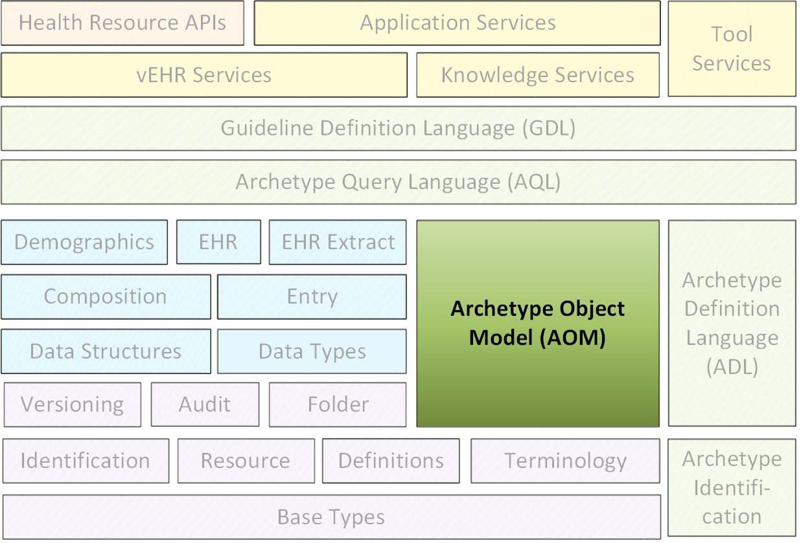

©2004 - 2017 openEHR基金会

openEHR基金会是一个独立的非营利社区组织，通过开源，基于标准的实施，促进消费者和临床医生共享健康记录。

- 许可: 
	- Creative Commons Attribution-NoDerivs 3.0 Unported。 
	- https://creativecommons.org/licenses/by-nd/3.0/
- 支持
	- 问题：https：//openehr.atlassian.net/browse/SPECPR/
	- 网址：http：//www.openehr.org/

## 修订记录

- AM Release-2.0.6
	- 2.0.6 (15 Jun 2016)
		- 调整C_ATTRIBUTE.any_allowed以具有后置条件Result = children.is_empty，而不是is_prohibited。
		- ADL和AOM规范之间的正确模糊性涉及持续时间小数秒 - 删除C_DURATION.fractional_seconds_allowed（SPECPR-188）。
		- 在“对象节点类型”部分下添加更精确的类型匹配规范，包括基本类型。将rm_primitive_type_equivalences属性添加到AOM_PROFILE以适应基本类型匹配规则。
		- SPECAM-40。正确的VSONT有效性规则说C_PRIMITIVE_OBJECT的C_COMPLEX_OBJECT重新定义无效。
		- 在第6.2.1节中修复拼写错误以在专门的原型中进行id代码重定义。
		- 将ARCHETYPE_TERMINOLOGY.parent_archetype重命名为owner_archetype。 （在SPECPR-193中报告）。
		- 删除对openEHR RM的引用。添加assume_types包以使spec独立;
		- 将对openEHR语言代码的引用更改为ISO 639代码。
		- 更改规则“部分，以记录重新使用新的openEHR表达式语言和模型。
		- 将由C_DATE等约束的类型更改为Date等，而不是ISO8601_DATE。
		- 在第4节中更新事件引用规则。
		- SPECBASE-4。将Hash <V，K>类型中的类型参数的顺序更改为Hash <K，V>。
		- 正确的ASSERTION.variables关联引用VARIABLE_DECLARATION。
		- 将RULE_ELEMENT类表添加到规范（在SPECPR-160中报告）
		- 正确的CARDINALITY.is_set文档（在SPECPR-147中报告）。
		- 向ARCHETYPE_TERM.code添加缺少类型的字符串。 （在SPECPR-162中报告）。
	- 2.0.5 (18 Jan 2016)
		- 创建AUTHORED_RESOURCE.uid和AUTHORED_ARCHETYPE.build_uid UUID，而不是任何种类的UID。
		- 添加P_序列化模型和模板部分。
	- 2.0.0 (04 Jan 2015)
		- 重构ARCHETYPE和ARCHETYPE_TERMINOLOGY模型，以简化：删除类的差异和平面形式。
		- 将ARCHETYPE分成两个类，使用AUTHORED_ARCHETYPE作为继承自AUTHORED_RESOURCE的新类。
		- 删除VDSSR，VSUNC;添加VDSSID，VARXID。将+ u（unstable）版本修饰符替换为semver.org标准-alpha。将概述材料移除到新的原型：技术概述规范。
		- 删除ARCHETYPE.provenance_id属性。
		- 正确拼写国际英语的许可证;将ARCHETYPE.urn重命名为provenance_id。
		- 修改C_ARCHETYPE_ROOT在所有情况下都有一个id代码。
		- 添加错误VSONPO，VSONPT：专业原型对象节点禁止发生的有效性。
		- 增加了对枚举类型的约束的支持。
		- 将ARCHETYPE.uid转换为urn：URN。
		- 将ARCHETYPE.commit_number重命名为build_count。
		- 使VACMCL发出警告WACMCL。
		- 将ARCHETYPE_INTERNAL_REF重命名为C_OBJECT_PROXY。
		- SPECAM-9。将本体部分重命名为术语并简化。
		- 删除CONSTRAINT_REF，C_REFERENCE_OBJECT类型;
		- SPECAM-2。引入新的原型结构识别系统;
		- SPECAM-28。向ADL和AOM添加IHTSDO标准术语URI。
		- 详细技术审查。
		- 删除C_DOMAIN_TYPE;
		- SPECAM-27。合并C_PRIMITIVE_OBJECT和C_PRIMITIVE;
		- 添加对元组约束的支持，替换ADL 1.4特殊的Ordinal和Quantity约束类型;
		- 添加新的基本类型C_TERMINOLOGY_CODE。
		- 添加了VSONIF，删除VSONCI（dup of VSONI）。
		- SPECAM-22。将assume_value限制为C_PRIMITIVE_OBJECT。
		- SPECAM-32。删除C_SINGLE_ATTRIBUTE和C_MULTIPLE_ATTRIBUTE类。
		- SPECAM-26。将any_allowed函数添加到ARCHETYPE_SLOT。
		- SPECAM-8。向ADL和AOM添加专业化语义。向ARCHETYPE_CONSTRAINT后代类添加各种属性和函数。
			- 将C_PRIMITIVE.assumed_value移动到UML中的属性槽
		    - 将C_DEFINED_OBJECT.default_value函数重命名为prototype_value
		    - 正确的assume_value定义就像prototype_value;从所有C_PRIMITIVE子类型中删除其条目
		    - 将模式的BOOLEAN标志表示转换为函数，并为模式值添加一个String数据成员，从而匹配XSD- 和ADL
		    - 添加ARCHETYPE.is_template属性。
		    - 添加ARCHETYPE.is_component属性。
		    - 允许计算以及存储的属性。
		    - 使ONTOLOGY.terminologies_available计算。
		- SPECAM-1。在AOM中将日期，时间等类别更改为来自支持IM的ISO8601_DATE，ISO8601_TIME等。
		- SPECAM-10。将Interval <Integer>转换为MULTIPLICITY_INTERVAL，以简化规范和实现。
		- SPECAM-5。原型槽正则表达式应该覆盖整个标识符。添加了C_STRING.is_pattern。
		- SPECAM-7。在AOM中使存在，出现和基数是可选的。
		- SPECAM-16。向ARCHETYPE_TERMINOLOGY添加有效性规则。
		- SPECAM-11。 ARCHETYPE_CONSTRAINT调整。
		- SPECAM-17。将模板对象模型添加到AM。
		- 向ARCHETYPE_SLOT添加is_exhaustive属性。
		- 将is_template属性添加到ARCHETYPE。
		- 向ARCHETYPE_TERMINOLOGY添加术语_extracts。
- R E L E A S E 1.0.2
	- 2.0.2 (2008年11月20日)
		- SPEC-257。正确的小错字和澄清文本。在CARDINALITY类中更正is_bag和is_set的反向定义。
		- SPEC-251。在原型中的Duration上允许模式和间隔约束。将模式属性添加到C_DURATION类。
- R E L E A S E 1.0.1
	- 2.0.1 (2007年3月20日)
		- SPEC-200。正确的1.0版排字错误。已添加错过类ASSERTION_VARIABLE的表。假设值已更正; standard_representation函数已更正。添加了missed adl_version，从SPEC-153的概念重命名。
		- SPEC-216：允许在ISO8601中的W，D等的混合持续时间（偏离标准）。
		- SPEC-219：使用常量而不是文字来引用RM中的术语。
		- SPEC-232。在CONSTRAINT_REF上放宽有效性不变量。
		- SPEC-233：定义ARCHETYPE_INTERNAL_REF上出现的语义。
		- SPEC-234：AOM约束模型包的正确函数语义。
		- SPEC-245：允许术语绑定到原型中的路径。
- R E L E A S E 1.0
	- 2.0 (2005年11月10日)
		- SPEC-153。同步ADL和AOM属性命名。 SPEC-178。将模板对象模型添加到AM。仅文本更改。 SPEC-167。添加AUTHORED_RESOURCE类。在公共IM中删除描述包到资源包。
- R E L E A S E 0.96
	- 0.6 (2005年6月20日)
		- SPEC-134。在AOM中纠正许多文档错误。在Archetype包中的TRANSLATION_DETAILS类中包括剪切和粘贴错误。第2.3节中更正的超链接。
		- SPEC-142。更新ADL语法以支持假定值。已更改C_PRIMITIVE和C_DOMAIN_TYPE。
		- SPEC-146：来自CEN MetaKnow的am.archetype.description的更改
		- SPEC-138。原型级断言。
		- SPEC-157。修复OPERATOR_KIND类属性的名称
- R E L E A S E 0.95
	- 0.5.1 （2005年1月20日）
		- 更正的文档错误 - ARCHETYPE_CONSTRAINT的返回类型。 has_path
		- 将可选性标记添加到基元类型UML图。
		- 从ARCHETYPE_ONTOLOGY中删除错误的聚合标记。 parent_archetype和- - -   ARCHETYPE_DESCRIPTION。 parent_archetype。
	- 0.5 (2004年11月10日)
		- SPEC-110。更新ADL文档并创建AOM文档。
		- 包括详细的输入和审查：
		    - DSTC
		    - CHIME，伦敦大学学院
		    - 海洋信息学
		- 初始写作。取自ADL文件1.2draft B.

## 致谢

### 主要作者

- Thomas Beale，海洋信息学英国; openHHR基金会管理委员会。

### 贡献者

本规范及其同类原型定义语言规范受益于openEHR和更广泛的健康信息社群的广泛正式和非正式投入。 openHHR基金会希望承认以下人员的贡献。

- Koray Atalag，MD，PhD，Sen.研究员，国家健康创新研究所（NIHI），新西兰

- 琳达博第博士，IHTSDO

- DiegoBoscá，IBIME，瓦伦西亚技术大学，西班牙VeraTech健康

- Rong Chen MD，博士，Cambio Healthcare Systems，瑞典

- 斯洛文尼亚Marand项目经理Borut Fabjan

- Sebastian Garde博士，海洋信息学

- Peter Gummer，海洋信息学

- Sam Heard MD，海洋信息学

- Stan Huff MD，Intermountain Healthcare，UT，美国

- 大卫Ingram博士，健康信息学名誉教授，UCL

- Dipak Kalra医学博士，博士，健康信息学教授，CHIME，UCL，总裁Eurorec

- 小林Shinji博士，京都大学EHR研究单位

- Bostjan Lah，建筑师，Marand，斯洛文尼亚

- Patrick Langford，NeuronSong有限责任公司

- David Lloyd，CHIME，UCL（ret）

- 春雷马博士，海洋信息学

- Ian McNicoll MD，海洋信息学英国

- David Moner，IBIME，技术大学瓦伦西亚，VeraTech健康，西班牙

- Claude Nanjo MA非洲研究，M公共卫生，认知医疗系统公司，加利福尼亚

- Pablo Pazos Gutierrez，Tarmac IT，CaboLabs，Uruguay

- Harold Solbrig，Mayo Clinic，Rochester，USA

- 瑞典林雪平大学Erik Sundvall博士

- Alessandro Torrisi，Code24，荷兰

- Bert Verhees，ROSA软件，荷兰。

### 支持者

本文件所报告的工作由下列组织提供资金：

- UCL（伦敦大学学院） - 健康信息学和多专业教育中心（CHIME）;

- 海洋信息学。

特别感谢UIM的CHIME创始主任David Ingram教授，他提供了自GEHR（1992年）时代以来的愿景和合作的工作环境。
商标

- 'openEHR'是openEHR基金会的商标

- “Java”是Oracle Corporation的注册商标

- “Microsoft”是Microsoft Corporation的商标

## 1.前言

### 1.1. 目的

本文档包含对象模型形式的openEHR原型和模板语义（最初在[Beale_2000]和[Beale_2002]中描述）的规范描述。这里提出的模型可以用作构建代表原型和模板的软件的基础，而不依赖于它们的持久表示。同样，它可以用于开发语言格式处理原型的解析器的输出端，如openEHR原型定义语言（ADL），XML等。

在任何情况下，建议结合本文档来阅读ADL规范，因为它包含对原型语义的详细解释，许多示例在ADL中更为明显，不管ADL是否实际与对象模型在这里或不在。

本规范中描述的AOM的发布对应于原型形式主义的2.x版本。

目标受众包括：

- 生产卫生信息学标准的标准组织;

- 研究小组使用openEHR，ISO 13606和其他EHR或EHR交换架构;

- 开源医疗保健社区;

- EHR解决方案供应商;

- 医疗信息学家和临床医生对健康信息感兴趣。

### 1.2. 相关文件

阅读本文档的前提条件包括：

- openEHR架构概述;

- openEHR原型技术概述。

- openEHR基本类型规范。

相关文档包括：

- openEHR原型定义语言2规范;

- openEHR操作模板规范。

### 1.3. 命名

在本文档中，术语“属性”表示在对象模型中定义的类型的任何存储的属性，包括原始属性和任何种类的关系，例如关联或聚合。 XML“属性”总是被明确称为“XML属性”。

我们还在广义上使用单词“原型”来指定通常被理解为“原型”（临床数据组/数据约束的规范）和“模板”（基于原型的数据集，因为在技术层面， ADL / AOM 2模板实际上只是原型。因此，除非另有说明，否则本说明书中关于“原型”的陈述总是可以理解为也适用于模板。

### 1.4. 状态

此规范处于TRIAL状态。本文档的开发版本可以在http://www.openehr.org/releases/AM/Release-2.0.6/AOM2.html找到。

已知的遗漏或问题在文本中用“待定”段落表示，如下：

TBD :(例如待定段落）

鼓励用户对这些段落以及主要内容发表评论和/或建议。应在技术邮件列表或规格问题跟踪器上提供反馈。

### 1.5. 工具

存在用于创建和处理原型的各种工具。 ADL Workbench是一个参考编译器，可视化工具和编辑器。 openEHR ADL / AOM工具可以从网站下载。源项目可以在openHHR Github项目中找到。

### 1.6. 从先前版本的更改

#### 1.6.1. 版本1.5至2.0（文档版本2.1.2 - ）

ADL / AOM形式主义的第2版的变化旨在使形式主义在术语方面更易于计算，并且能够进行更严格的验证和扁平化操作。

更改如下。

- 引入新的内部编码方案，由id码，at码和ac码组成;

- 用多部分，命名空间标识符替换字符串原型标识符;

- 在术语部分中添加显式值集，替换定义部分中的内嵌值集;

- 将原型本体部分重命名为术语;

- 将所有外部术语绑定表达为IHTSDO格式之后的URI;

- 引入'tuple'约束来替换openEHR自定义约束类型，用于在数量，有序结构中共变属性;

- 重新设计所有原始约束类型，即C_STRING，C_DATE等;

- 删除openEHR原型配置文件规范。

#### 1.6.2. 版本1.4至1.5（文档版本2.0至2.1.1）

版本1.5的变化是为了更好地促进专业原型的表示。专用原型的关键语义能力是能够支持差分表示，即仅根据其定义中的改变的或新的元素来表达专门的原型，而不是包括未改变的元素的副本。在变更管理方面，后者显然是不可持续的。

更改如下。

- 完全专业化支持：向C_ATTRIBUTE类添加一个属性，允许包含一个路径，该路径能够在结构内深入进行专门的原型重定义;

- 添加节点级注释;

- 原型本体节的结构简化;

- 不变段的名称已更改为规则，以更好地反映其目的。

- 模板现在只是原型。

#### 1.6.3. 版本0.6至1.4

从版本1.3更改为1.4：

- 向ARCHETYPE类添加了一个新属性adl_version：String;

- 更改ARCHETYPE的名称。 concept_code属性的概念。

## 2.模型概述

这里描述的模型是一个纯面向对象的模型，可以使用原型解析器和软件，操纵内存中的原型和模板。它通常是任何序列化形式的原型的解析器的输出。

### 2.1. 使用的基本类型

AOM依赖于openEHR BASE组件base_types包，其说明由AOM所假定的各种“叶”类型以及其他实用程序类型和基本数据结构，例如间隔类型。这些类型记录在openEHR基本类型规范中，为方便起见，在下面复制。

图1. base_types'leaf'类型

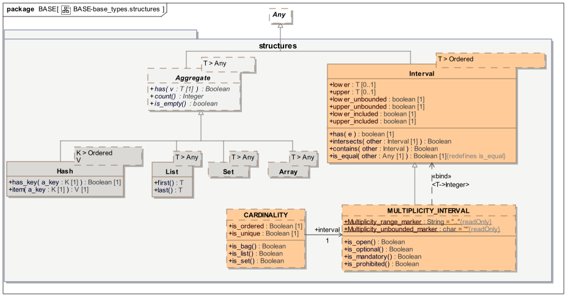
图2. base_types.structures包

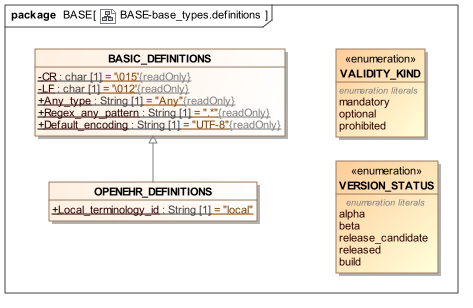
图3. base_types.structures包

提供枚举类型VALIDITY_KIND是为了定义在任何模型中表示强制，可选或不允许的标准值。 它在此模型中用于类，如C_DATE，C_TIME和C_DATE_TIME。 VERSION_STATUS枚举类型在各种AOM类型中提供类似的函数。

从基础包使用的其他类包括AUTHORED_RESOURCE（openEHR资源包）及其从属类。 这些在使用它们的包中完整显示。

> 注意: 
上述类型不构成本说明书的正式部分。 AOM的任何实现通常将必须使用在语言和/或库内发现的这些类型的具体版本。

### 2.2. 封装结构

原型对象模型定义为包am.archetype，如图包概述中所示。 它显示在am.archetype包的上下文中。

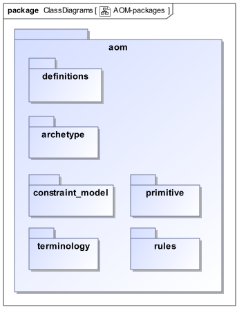
图4.软件包概述

### 2.3. 定义和实用程序类

#### 2.3.1. 概述

在AOM中使用各种定义常数。 这些在AM组件的aom.definitions包中定义，如下所示。

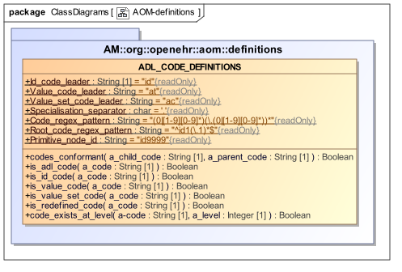
图5.定义包

#### 2.3.2. 类定义

#### 2.3.3. ADL\_CODE\_DEFINITIONS类

<table>
	<tr>
		<td>类</td>
		<td colspan="2">ADL_CODE_DEFINITIONS</td>
	</tr>
	<tr>
		<td>描述</td>
		<td colspan="3">与原型的内部代码系统相关的定义。</td>
	</tr>
	<tr>
		<td>继承</td>
		<td colspan="2"></td>
	</tr>
	<tr>
		<td>常量</td>
		<td>签名</td>
		<td>含义</td>
	</tr>
	<tr>
		<td>1..1</td>
		<td>Id_code_leader：String =“id”</td>
		<td>“标识符”代码的字符串前导符，即用于标识archteype节点的代码。</td>
	</tr>
	<tr>
		<td>1..1</td>
		<td>Value_code_leader：String =“at”</td>
		<td>'值'代码的字符串前导符，即用于标识代码值的代码，包括值集成员。</td>
	</tr>
	<tr>
		<td>1..1</td>
		<td>Value_set_code_leader：String =“ac”</td>
		<td>“值集”字符串的前导符，即用于标识值集的代码。</td>
	</tr>
	<tr>
		<td>1..1</td>
		<td>Specialisation_separator：char ='。'</td>
		<td>用于分隔属于不同专业化级别的代码的数字部分的字符。</td>
	</tr>
	<tr>
		<td>1</td>
		<td>Code_regex_pattern：String =“（0 | [1-9] [0-9] *）（\。（0 | [1-9] [0-9] *））*</td>
		<td>正则表达式用于定义任何原型代码的合法数字部分。对应于点数字的简单模式，如在典型的多级编号方案中使用的。</td>
	</tr>
	<tr>
		<td>1..1</td>
		<td>Root_code_regex_pattern：String =“^ id1（\。1）* $”</td>
		<td>任何原型的根ID代码的正则表达式。对应于id1，id1.1，id1.1.1等形式的代码。</td>
	</tr>
	<tr>
		<td>1..1</td>
		<td>Primitive_node_id：String =“id9999”</td>
		<td>创建时用于C_PRIMITIVE_OBJECT节点的代码标识。</td>
	</tr>
	<tr>
		<td>函数</td>
		<td>签名</td>
		<td>含义</td>
	</tr>
	<tr>
		<td></td>
		<td>codes_conformant（a_child_code：String，a_parent_code：String）：Boolean</td>
		<td>如果a_child_code在特殊化意义上符合a_parent_code，即是与a_parent_code相同或更专用的a_child_code，则为true。</td>
	</tr>
	<tr>
		<td></td>
		<td>
<pre>
is_adl_code（a_code：String）：Boolean
Post：Result = is_id_code（a_code）or else is_value_code（a_code）or else is_value_set_code（a_code）
</pre>
		</td>
		<td>如果a_code是任何类型的ADL原型本地代码，则为True。</td>
	</tr>
	<tr>
		<td></td>
		<td>
<pre>
is_id_code（a_code：String）：Boolean
Post：Result = a_code.starts_with（Id_code_leader）
</pre>
		</td>
		<td>如果a_code是'id'代码，则为true。</td>
	</tr>
	<tr>
		<td></td>
		<td>
<pre>
is_value_code（a_code：String）：Boolean
发布：结果= a_code.starts_with（V​​alue_code_leader）
</pre>
		</td>
		<td>如果a_code是“at”代码，即表示单个术语项的代码，则为真。</td>
	</tr>
	<tr>
		<td></td>
		<td>
<pre>
is_value_set_code（a_code：String）：Boolean
Post：Result = a_code.starts_with（V​​alue_set_code_leader）
</pre>
		</td>
		<td>如果a_code是“ac”代码，即，指代术语值集合的代码，则为真。</td>
	</tr>
	<tr>
		<td></td>
		<td>is_redefined_code（a_code：String）：Boolean</td>
		<td>
<pre>
如果在最后一个索引之上的任何地方存在非零代码索引，则代码已被专门化。

    at0.0.1→False

    at1.0.1→真
</pre>
		</td>
	</tr>
	<tr>
		<td></td>
		<td>code_exists_at_level（a-code：String，a_level：Integer）：Boolean</td>
		<td>'a_code'有效级别为'a_level'或更少，即如果我们删除对应于'a_level'下面的专门化的尾部专用部分，然后删除任何后面的'0'部分，我们最终得到一个有效的代码？如果是这样，则意味着代码对应于来自“a_level”或更高的真实节点。</td>
	</tr>
</table>

## 3.原型包

### 3.1. 概述

原型和模板（所有变体形式）的顶级模型在图原型包中说明。模型定义原型的标准结构表示。作为独立实体创建的原型是AUTHORED\_ARCHETYPE类的实例，它是AUTHORED\_RESOURCE和ARCHETYPE的后代。前者为任何资源提供了描述性元数据，语言信息，注释和修订历史的标准化模型。后一类定义任何种类原型的核心结构，包括定义，术语，可选规则部分，以及“语义标识符”（ARCHETYPE.archetype\_id）。

AUTHORED_ARCHETYPE类添加标识属性，标志和描述性元数据，并且是另外两个特殊化的先辈类型：TEMPLATE和OPERATIONAL\_TEMPLATE。 TEMPLATE类定义了“模板”原型的概念，即包含填充符/引用（ADL的use\_archetype语句）的原型，通常设计为表示数据集。要启用它，它可能包含“覆盖”，专用于它使用的一个或多个引用/填充原型的私有原型。叠加是TEMPLATE\_OVERLAY类的实例，没有自己的元数据，但在其他方面在计算上就像任何其他原型。

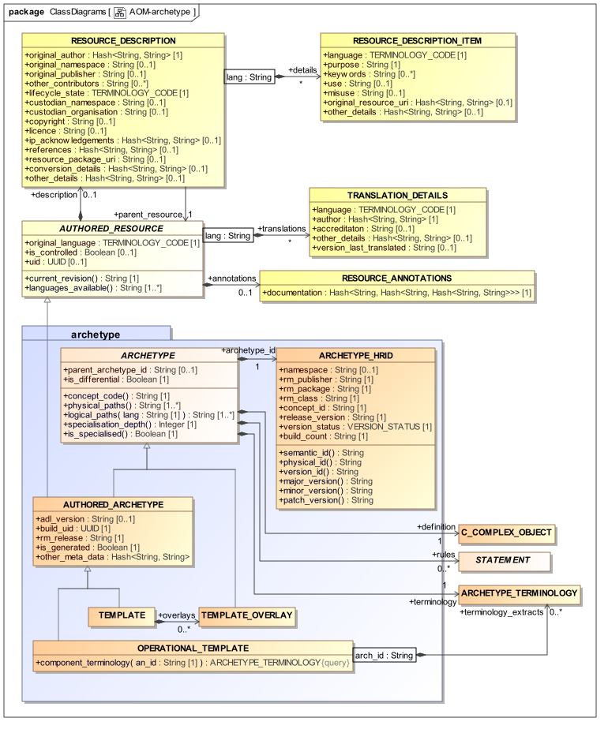
图6.原型包

OPERATIONAL\_TEMPLATE类表示模板的完全展平形式，即所有填充物和参考被替换和覆盖处理，以形成实际术语中的单个定制的“操作”伪影，准备好转换到下游伪影。因为操作模板包括一个或多个内联的其他原型结构，所以它还包括它们的术语，使其能够被视为自立式假象。

### 3.2. 原型识别

#### 3.2.1. 人类可读标识符（HRID）

基于ARCHETYPE的所有原型变体都具有由ARCHETYPE\_HRID类定义的人类可读的结构化标识符。此标识符将制品放置在基于命名空间，其参考模型类及其信息概念的多维空间中。该类定义标识符的原子化表示，使得能够根据需要使用变量形式。它的各个部分可以从下面的图中理解，它也显示了计算的semantic\_id和physical\_id形式。

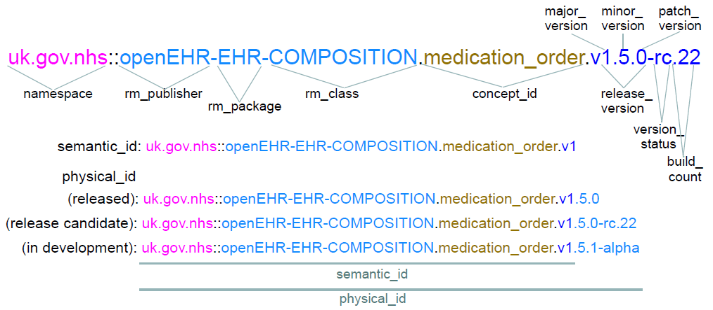
图7.原型HRID结构

对于专用原型，parent\_archetype_id也是必需的。这是对原型的字符串引用，通常是id的“接口”形式，即仅限于主版本。在某些情况下，包括次要版本号和修补程序版本号也是有用的。

识别的一个重要方面涉及关于当“移动”或“叉”发生时，何时何时HRID命名空间改变或被保留的规则。其值始终与从AUTHORED\_RESOURCE.description继承的original\_namespace和custodian\_namespace属性之一相同（或两者，在它们相同的情况下）。 openEHR原型标识规范中给出了标识系统和规则的完整解释。

#### 3.2.2. 机器标识符

为原型定义了两个机器标识符。 ARCHETYPE.uid属性定义等同于人类可读的ARCHETYPE.archetype\_id.semantic\_id的机器标识符，即直到其主版本的ARCHETYPE\_HRID，并且只要后者改变。它被定义为可选的，但是实际上有用将需要对使用该标识符的保管组织内的所有原型是强制性的。它原则上可以在任何时候为保管人合成，决定实施它。

ARCHETYPE.build\_uid属性也是可选的，并且如果使用的话，旨在提供对应于人工制品版本中的任何改变的唯一标识符。至少，这意味着为每个更改生成一个新的UUID：

- ARCHETYPE.archetype\_id.release\_version;

- ARCHETYPE.archetype\_id.build\_count;

- ARCHETYPE.description.lifecycle\_state。

对于对受控存储库中的原型（例如，元数据字段的添加或更新）所做的每个更改，此字段都应使用以正常方式生成的新UUID值进行更新。

### 3.3. 顶级元数据

以下项目对应于可能出现在ADL原型第一行中的括号中的语法元素。

#### 3.3.1. ADL版本

ADL 1.4中的ARCHETYPE.adl\_version属性用于指示在从其创建AOM结构的原型源文件中使用的ADL版本（版本号来自ADL规范的修订历史记录）在当前和将来的AOM和ADL规范，这个属性的意义被推广到意味着“原型形式主义的版本”，其中表示当前原型。为了方便起见，版本号仍然取自ADL规范，但现在是指所有原型 - 相关规范，因为它们总是以同步方式更新。

#### 3.3.2. 参考模型发布

ARCHETYPE.rm\_release属性指定原型的当前版本中基于原型的参考模型的发布。这意味着rm\_release可以随原型的新版本更改，其中重新版本化包括将原型升级到更高版本的RM。然而，这种升级仍必须遵守原型兼容性的基本规则：稍后，补丁版本和构建不能创建相对于先前版本无效的数据。

这应该是与ARCHETYPE\_HRID.release\_version属性在同一semver.org 3部分形式，例如。 “1.0.2”。此属性不指示与除了指定的参考模型版本之外的任何特定参考模型版本的一致性，因为大多数原型可以容易地符合多于一个。更小的原型在技术上可能比更复杂的类型更符合旧的和未来的版本。

#### 3.3.3. 生成的标志

ARCHETYPE.is\_generated标志用于指示原型已经从另一个人工产物机器生成，例如，一个旧的ADL版本（比如1.4），或者一个非原型的人工制品。如果为true，则向工具指示当前原型可能被覆盖，并且一些其他人工因素被认为是主要来源。如果发生手动创作，则此属性应设置为False。

### 3.4. 治理元数据

各种元数据元素从AUTHORED\_RESOURCE类继承，并提供原型，创作和翻译细节，使用，滥用，关键字等的自然语言描述。元数据有三个不同的部分：治理，作者和描述性细节。

#### 3.4.1. 治理元数据项

治理元数据主要在RESOURCE\_DESCRIPTION类中可见，通过AUTHORED\_RESOURCE继承，并由与该人造物的管理和知识产权状态相关的项目组成。这些的典型形式显示在图治理元数据中的屏幕截图中。

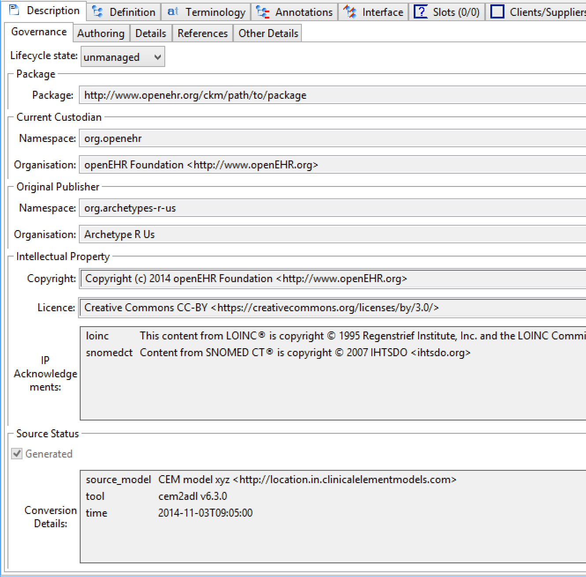
图8.治理元数据

##### 3.4.1.1. 包

可选的resource\_package\_uri属性使得能够记录对原型或其他资源的包的引用，下面考虑该原型。它可以是“文本<URL>”的形式。

##### 3.4.1.2. Lifecycle\_state

description.lifecycle_state是原型的重要属性，用于在定义的生命周期中记录其状态。 openEHR原型标识规范中完全解释了生命周期状态机和版本控制规则。这里我们简单地注意到，属性的值是对应于图上的宏状态名称之一的编码项，即“unmanaged”，“in\_development”等等。

##### 3.4.1.3. Original\_namespace和Original\_publisher

这两个可选属性表示原始发布组织及其命名空间，即首次导入或创建文件的原始发布环境。 original\_namespace属性通常与archetype\_id.namespace的值相同，除非将该工件分岔到其当前托管代码中，在这种情况下，archetype\_id.namespace将与custodian\_namespace相同。

##### 3.4.1.4. Custodian\_namespace和Custodian\_organisation

这两个可选属性表示正式命名空间，以及对应于当前保管人的人类可读的组织标识符，即如果存在，则维护人和公开人造物。

##### 3.4.1.5. 知识产权

在类中有三个属性，RESOURCE\_DESCRIPTION与知识产权（IP）相关。许可证是用于记录许可证（US：“许可证”）的字符串字段，根据该字段可以使用文件。推荐的格式是

许可证名称<许可证声明的可靠URL>

版权属性记录应用于人造物的版权，通常采用“（c）名称”或“（c）年份名称”的标准格式。也可以使用特殊字符©（UTF-8 0xC2A9）。

#### 3.4.2. 作者元数据

作者元数据由诸如作者姓名，贡献者和翻译者信息的项目组成，并且在图创作元数据中可视化。
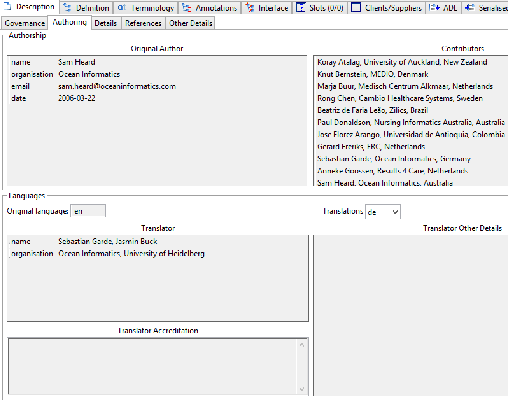
图9.创作元数据

##### 3.4.2.1. 原作者

RESOURCE\_DESCRIPTION.original\_author属性定义了一个名称/值对的简单列表，通过它可以记录原始作者。 典型的关键值包括'name'，'organi [zs]'，'email'和'date'。

##### 3.4.2.2. 贡献者

RESOURCE\_DESCRIPTION.other\_contributors属性是一个简单的字符串列表，每个贡献者一个。 字符串的推荐格式为以下之一：

	first names last name, organisation
	first names last name, organisation <contributor email address>
	first names last name, organisation <organisation email address>

##### 3.4.2.3. 语言和翻译

AUTHORED\_RESOURCE.original\_language和TRANSLATION\_DETAILS类允许表示创作的原始语言和与后续翻译相关的信息。 TRANSLATION_DETAILS.author允许每个翻译器以与original\_author相同的方式表示，即名称/值的列表。

##### 3.4.2.4. 版本\_last\_translated

version\_last\_translated属性用于在执行转换时记录每种语言的archetype\_id.physical\_id的副本。这使维护者知道何时需要为某些或所有语言进行新的翻译。此String属性记录上次翻译时的完整版本标识符（即ARCHETYPE.archetype\_id.version\_id），使工具能够确定翻译是否过期。

#### 3.4.3. 描述性元数据

可以在RESOURCE\_DESCRIPTION\_ITEM类中的多个翻译中为原型提供各种描述性元数据，对于每个翻译语言使用一个实例，如图描述性元数据所示。

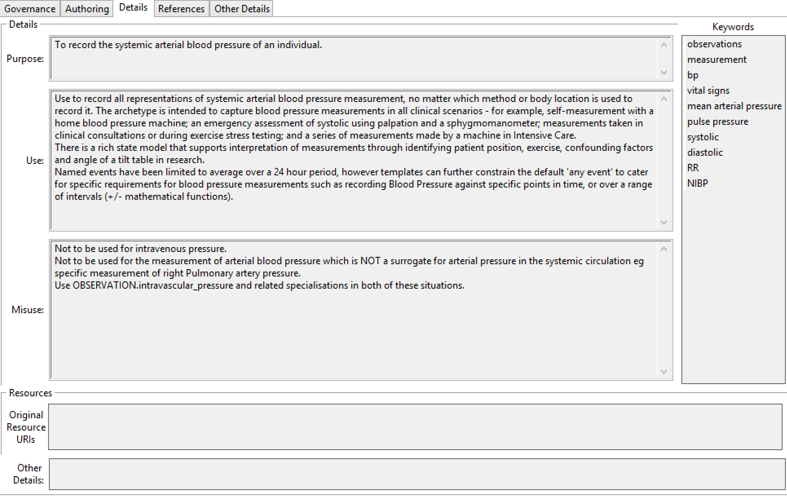
图10.描述性元数据

##### 3.4.3.1. 目的

目的项是用于记录人工制品的预期设计概念的String属性。

##### 3.4.3.2. 使用和误用

使用和误用属性使得能够记录具体使用和滥用。后者通常涉及常见的使用错误，或明显合理但错误的使用假设。

##### 3.4.3.3. 关键词

keywords属性是一个列表，用于记录人工制品的搜索关键字。

##### 3.4.3.4. 资源

original\_resource\_uri属性用于记录对每种特定语言的资源的一个或多个引用。

TBD：此属性似乎从未使用过，它可能没有用，因为“资源”通常不可用于每种语言。

### 3.5. 结构定义

#### 3.5.1. 普通结构件

原型定义是原型的主要定义部分，是C\_COMPLEX\_OBJECT的实例。这意味着原型的约束结构的根总是采取对非原始对象类型的约束的形式。

原型的术语部分由它自己的类表示，并且是允许原型是自然语言和术语中性的。它在术语包中详细描述。

原型可以包括一个或多个规则。规则是在谓词逻辑的子集中表达的语句，其可以用于对对象的多个部分的状态约束。它们不需要约束单个属性或对象（因为这可以通过适当的C\_ATTRIBUTE或C\_OBJECT来完成），但是对于涉及多个属性的约束是必需的，诸如“收缩压应该> =舒张压'在血压测量原型。它们还可以用于声明变量，包括外部数据查询结果，并且使其他约束取决于变量值，例如。记录主体的性别。

最后，可以根据需要包含从AUTHORED\_RESOURCE类继承的注释和修订历史记录部分。注释部分与原型和模板特别相关，并且用于记录原型或模板内的单个节点和/或引用模型数据中的节点，这些节点可以不限于原型，而是其在原型中的特定用途数据需要记录。在前一种情况下，注释由原型路径键入，而在后一种情况下，由参考模型路径键入。

#### 3.5.2. 结构变体

图原型包中的模型定义了“原型”思想的多个变体的结构。所有具体实例都是ARCHETYPE的具体后代之一。图Source Source原型结构说明了源原型的典型对象结构 - 由创作工具创建的原型的形式 - 由DIFFERENTIAL\_ARCHETYPE实例表示。强制部分以粗体显示。

图11.源原型结构

源原型可以是专门的，在这种情况下，它们的定义结构是平面父代或“顶级”的部分覆盖，在这种情况下，定义结构是完整的。 C\_ARCHETYPE\_ROOT实例只能表示对其他原型的直接引用 - “外部引用”。

平面原型通过本说明书下一章（也在ADL规范中）中描述的平坦化过程从一个或多个源原型生成。 这将从DIFFERENTIAL\_ARCHETYPE实例生成FLAT\_ARCHETYPE。 在此操作中发生的主要两个变化是：a）将专门的原型覆盖应用于平坦的父结构，产生完整的原型结构，以及b）内部引用（use\_nodes）被它们的扩展形式替换，即， 它们指向的子树。

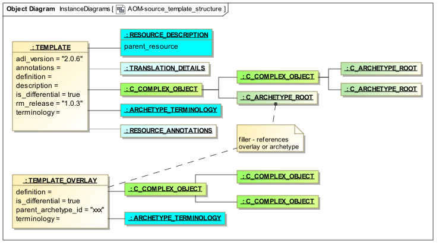
图12.源模板结构

此表单用于表示专用原型的完整“操作”结构，并有两种用途。第一个是生成向后兼容的ADL 1.4遗留原型（始终以平面形式）;第二个是在模板扁平化过程期间，当所有引用的原型和模板的平面形式最终被组合成单个操作模板时。

图源模板结构说明了源模板的结构，即TEMPLATE的实例。源模板是包含表示插槽填充的C\_ARCHETYPE\_ROOT对象的原型 - 每个引用外部原型或模板，或潜在的覆盖原型。

另一个原型变体（也在源模板结构中显示）是模板覆盖，即TEMPLATE\_OVERLAY的实例。这些是模板的纯本地组件，仅包括定义和术语。定义结构总是在其他东西上的特殊覆盖，并且可能不包含任何插槽填充或外部引用，即没有C\_ARCHETYPE\_ROOT对象。不需要标识符，adl\_version，语言或描述，因为它们被认为是从所属根模板传播的。因此，模板覆盖表现得像简化的专用原型。模板覆盖可以被认为在某些面向对象的编程语言中类似于“匿名”或“内部”类。

图操作模板结构说明了生成的操作模板或模板的编译形式。这是通过以其扁平形式构建引用的原型和/或模板和/或模板覆盖层来生成单个“巨型”原型而创建的。此原型的根节点以及其中的每个原型/模板根节点都使用C\_ARCHETYPE\_ROOT对象来表示。操作模板还具有component\_terminologies属性，其包含来自每个组成原型，模板和覆盖的本体。

模块开发，表示和语义的更多细节将在下一节中描述。

### 3.6. 类描述

#### 3.6.1. AUTHORED\_RESOURCE类

<table>
	<tr>
		<td>类</td>
		<td colspan="2">AUTHORED_RESOURCE（abstract）</td>
	</tr>
	<tr>
		<td>描述</td>
		<td colspan="2">人类作者创造的在线资源的抽象思想。</td>
	</tr>
	<tr>
		<td>继承</td>
		<td colspan="2"></td>
	</tr>
	<tr>
		<td>属性</td>
		<td>签名</td>
		<td>含义</td>
	</tr>
	<tr>
		<td>1..1</td>
		<td>original_language：TERMINOLOGY_CODE</td>
		<td>最初创建此资源的语言。虽然整体上没有资源的语言优先，但是需要原始创作的语言来确保自然语言翻译可以保持质量。语言在描述和本体部分都是相关的。</td>
	</tr>
	<tr>
		<td>0..1</td>
		<td>is_controlled：Boolean</td>
		<td>如果此资源受任何更改控制（即使是文件复制），则为True，在这种情况下将创建修订历史记录。</td>
	</tr>
	<tr>
		<td>0..1</td>
		<td>说明：RESOURCE_DESCRIPTION</td>
		<td>资源的描述和生命周期信息。</td>
	</tr>
	<tr>
		<td>0..1</td>
		<td>uid：UUID</td>
		<td>具有相同接口标识符（相同主版本）的原型族的唯一标识符。</td>
	</tr>
	<tr>
		<td>0..1</td>
		<td>注释：RESOURCE_ANNOTATIONS</td>
		<td>资源中各个项目的注释，由路径键入。内部表格采用由String标签键入的字符串值的哈希表格形式。</td>
	</tr>
	<tr>
		<td>0..1</td>
		<td>翻译：Hash <String，TRANSLATION_DETAILS></td>
		<td>由该资源做出的每个自然翻译的细节列表，由语言锁定。对于此处列出的每个翻译，资源的所有语言相关部分必须有相应的部分。 original_language不会出现在此列表中。</td>
	</tr>
	<tr>
		<td>函数</td>
		<td>签名</td>
		<td>含义</td>
	</tr>
	<tr>
		<td></td>
		<td>
<pre>
current_revision：String
Post：Result = revision_history.most_recent_version
</pre>
		</td>
		<td>如果is_controlled else（不受控制），则为revision_history中的最近修订版本。</td>
	</tr>
	<tr>
		<td></td>
		<td>languages_available：List &lt;String&gt;</td>
		<td>此资源中可用的语言总列表，派生自original_language和翻译。</td>
	</tr>
	<tr>
		<td>不变</td>
		<td colspan="2"></td>
	</tr>
	<tr>
		<td></td>
		<td colspan="2">
<pre>
Original_language_valid：code_set（Code_set_id_languages）.has_code（original_language.as_string）
</pre>
		</td>
	</tr>
	<tr>
		<td></td>
		<td colspan="2">
<pre>
Current_revision_valid：（current_revision / = Void而不是is_controlled）意味着current_revision.is_equal（“（不受控制的）”）
</pre>
		</td>
	</tr>
	<tr>
		<td></td>
		<td colspan="2">
<pre>
translate_valid：translations / = Void隐含（不是translations.is_empty，而不是translations.has（orginal_language.code_string））
</pre>
		</td>
	</tr>
	<tr>
		<td></td>
		<td colspan="2">
<pre>
Description_valid：translations / = Void implies（description.details.for_all（d | translations.has_key（d.language.code_string）））
</pre>
		</td>
	</tr>
	<tr>
		<td></td>
		<td colspan="2">Languages_available_valid：languages_available.has（original_language）</td>
	</tr>
	<tr>
		<td></td>
		<td colspan="2">Revision_history_valid：is_controlled xor revision_history = Void</td>
	</tr>
</table>

#### 3.6.2. RESOURCE\_DESCRIPTION类

<table>
	<tr>
		<td>类</td>
		<td colspan="2">RESOURCE_DESCRIPTION</td>
	</tr>
	<tr>
		<td>描述</td>
		<td colspan="2">定义资源的描述性元数据。</td>
	</tr>
	<tr>
		<td>继承</td>
		<td colspan="2"></td>
	</tr>
	<tr>
		<td>属性</td>
		<td>签名</td>
		<td>含义</td>
	</tr>
	<tr>
		<td>1..1</td>
		<td>original_author：Hash &lt;String，String&gt;</td>
		<td>本资源的原作者，具有所有相关细节，包括组织。</td>
	</tr>
	<tr>
		<td>0..1</td>
		<td>original_namespace：String</td>
		<td>原作者组织的名称空间，如果适用，以反向互联网形式。</td>
	</tr>
	<tr>
		<td>0..1</td>
		<td>original_publisher：String</td>
		<td>最初发布此工件的组织的纯文本名称（如果有）。</td>
	</tr>
	<tr>
		<td>0..1</td>
		<td>other_contributors：List &lt;String&gt;</td>
		<td>其他资源的贡献者，每个都列在“name <email>”表单中。</td>
	</tr>
	<tr>
		<td>1..1</td>
		<td>lifecycle_state：TERMINOLOGY_CODE</td>
		<td>资源的生命周期状态，通常包括以下状态：initial，in_development，in_review，published，depersed，obsolete。</td>
	</tr>
	<tr>
		<td>1..1</td>
		<td>parent_resource：AUTHORED_RESOURCE =</td>
		<td>引用拥有资源。</td>
	</tr>
	<tr>
		<td>0..1</td>
		<td>custodian_namespace：String</td>
		<td>以互联网反向格式的名称空间，当前保管组织。</td>
	</tr>
	<tr>
		<td>0..1</td>
		<td>custodian_organisation：String</td>
		<td>当前保管机构的纯文本名称。</td>
	</tr>
	<tr>
		<td>0..1</td>
		<td>copyright：String</td>
		<td>作为知识资源的资源的可选版权声明。</td>
	</tr>
	<tr>
		<td>0..1</td>
		<td>license：String</td>
		<td>当前文物的许可，格式为“短许可证名称&lt;许可证URL&gt;”，例如“Apache 2.0许可证&lt;http://www.apache.org/licenses/LICENSE-2.0.html&gt;”</td>
	</tr>
	<tr>
		<td>0..1</td>
		<td>ip_acknowledgements：Hash &lt;String，String&gt;</td>
		<td>
<pre>
在此原型中直接引用的其他IP的确认列表，通常是术语代码，本体id等。推荐的键是IP源的广为人知的名称或命名空间，如以下示例所示：

ip_acknowledgements = &lt;
    [“loinc”] = &lt;“此内容来自LOINC®是版权所有©1995 Regenstrief Institute，Inc.和LOINC委员会，可免费获得http://loinc.org/terms-of-use” &gt;
    [“snomedct”] = &lt;“来自SNOMEDCT®的内容版权©2007 IHTSDO &lt;ihtsdo.org&gt;”&gt;
&gt;
</pre>
		</td>
	</tr>
	<tr>
		<td>0..1</td>
		<td>Reference：Hash &lt;String，String&gt;</td>
		<td>该工件所基于的材料的引用列表，作为字符串的关键列表。密钥应采用标准引用格式。</td>
	</tr>
	<tr>
		<td>0..1</td>
		<td>resource_package_uri：String</td>
		<td>此资源所属的包的URI。</td>
	</tr>
	<tr>
		<td>0..1</td>
		<td>conversion_details：Hash &lt;String，String&gt;</td>
		<td>
<pre>
与从原始（如果相关）生成此模型的转换过程相关的详细信息，如名称/值对列表。推荐标签的典型示例：

conversion_details = <
        [“source_model”] = <“CEM模型xyz <http://location.in.clinicalelementmodels.com>”>
        [“tool”] = <“cem2adl v6.3.0”>
        [“time”] = <“2014-11-03T09：05：00”>
</pre>
		</td>
	</tr>
	<tr>
		<td>0..1</td>
		<td>other_details：Hash &lt;String，String&gt;</td>
		<td>附加的非语言资源元数据，作为名称/值对的列表。</td>
	</tr>
	<tr>
		<td>0..1</td>
		<td>详细信息：Hash &lt;String，RESOURCE_DESCRIPTION_ITEM&gt;</td>
		<td>资源描述的所有部分的细节是自然语言相关的，由语言代码锁定。</td>
	</tr>
</table>

#### 3.6.3. RESOURCE_DESCRIPTION_ITEM类

<table>
	<tr>
		<td>类</td>
		<td colspan="2">RESOURCE_DESCRIPTION_ITEM</td>
	</tr>
	<tr>
		<td>描述</td>
		<td colspan="2">语言特定的资源描述细节。当资源被翻译以在另一语言环境中使用时，每个RESOURCE_DESCRIPTION_ITEM需要被复制和翻译成新语言。</td>
	</tr>
	<tr>
		<td>继承</td>
		<td colspan="2"></td>
	</tr>
	<tr>
		<td>属性</td>
		<td>签名</td>
		<td>含义</td>
	</tr>
	<tr>
		<td>1..1</td>
		<td>语言：TERMINOLOGY_CODE</td>
		<td>本描述项中的项目所在的本地化语言。使用ISO 639-1（2个字符）语言代码编码。</td>
	</tr>
	<tr>
		<td>1..1</td>
		<td>purpose：String</td>
		<td>资源的目的。</td>
	</tr>
	<tr>
		<td>0..1</td>
		<td>关键字：List &lt;String&gt;</td>
		<td>表征此资源的关键字，例如用于索引和搜索。</td>
	</tr>
	<tr>
		<td>0..1</td>
		<td>use：String</td>
		<td>资源的使用的描述，即其可以在其中使用的上下文。</td>
	</tr>
	<tr>
		<td>0..1</td>
		<td>misuse：String</td>
		<td>对资源的任何误用的描述，即不应该使用它的上下文。</td>
	</tr>
	<tr>
		<td>0..1</td>
		<td>original_resource_uri：List &lt;Hash &lt;String，String &gt;&gt;</td>
		<td>原始临床文档的URI或该资源是以该描述项目的语言形式化的描述;关键的意义。</td>
	</tr>
	<tr>
		<td>0..1</td>
		<td>other_details：Hash &lt;String，String&gt;</td>
		<td>附加的语言固有资源元数据，作为名称/值对的列表。</td>
	</tr>
</table>

#### 3.6.4. RESOURCE\_ANNOTATIONS类

<table>
	<tr>
		<td>类</td>
		<td colspan="2">RESOURCE_ANNOTATIONS</td>
	</tr>
	<tr>
		<td>描述</td>
		<td colspan="2">
<pre>
表示原型上的注释的对象。这些可以是各种形式，具有迄今定义的文档形式，其具有多级表格结构[[[字符串值，字符串键]，路径键]，语言键]。示例实例，显示文档结构。

    documentation = <
        [“en”] = <
           [“/ data [id2]”] = <
               [“ui”] = <“passthrough”>
           >
           [“/ data [id2] / items [id3]”] = <
               [“design note”] = <“这是一个关于Statement的设计说明”>
               [“要求说明”] = <“这是一个关于声明的要求说明”>
               [“medline ref”] = <“this is a medline ref on Statement”>
           >
        >
    >

其他子结构可以具有不同的密钥，例如基于编程语言，UI工具包等。
</pre>
		</td>
	</tr>
	<tr>
		<td>继承</td>
		<td colspan="2"></td>
	</tr>
	<tr>
		<td>属性</td>
		<td>签名</td>
		<td>含义</td>
	</tr>
	<tr>
		<td>1..1</td>
		<td>文档：Hash &lt;String，Hash &lt;String，Hash &lt;String，String &gt;&gt;&gt;</td>
		<td>多级键控结构中的文档注释。</td>
	</tr>
	<tr>
		<td>0..1</td>
		<td>conversion_details：Hash &lt;String，String&gt;</td>
		<td>与从a生成此模型的转换过程相关的详细信息</td>
	</tr>
</table>

#### 3.6.5. TRANSLATION\_DETAILS类

<table>
	<tr>
		<td>类</td>
		<td colspan="2">TRANSLATION_DETAILS</td>
	</tr>
	<tr>
		<td>描述</td>
		<td colspan="2">类提供自然语言翻译的细节。</td>
	</tr>
	<tr>
		<td>继承</td>
		<td colspan="2"></td>
	</tr>
	<tr>
		<td>属性</td>
		<td>签名</td>
		<td>含义</td>
	</tr>
	<tr>
		<td>1..1</td>
		<td>语言：TERMINOLOGY_CODE</td>
		<td>翻译语言，使用ISO 639-1（2个字符）语言代码编码。</td>
	</tr>
	<tr>
		<td>1..1</td>
		<td>作者：Hash &lt;String，String&gt;</td>
		<td>翻译者姓名和其他人口统计细节。</td>
	</tr>
	<tr>
		<td>0..1</td>
		<td>accreditaton：String</td>
		<td>翻译者的认证，通常是国家翻译的注册或协会会员身份。</td>
	</tr>
	<tr>
		<td>0..1</td>
		<td>other_details：Hash &lt;String，String&gt;</td>
		<td>任何其他元数据。</td>
	</tr>
	<tr>
		<td>0..1</td>
		<td>version_last_translated：String</td>
		<td>此资源最后一次被翻译为此TRANSLATION_DETAILS对象表示的语言的版本。</td>
	</tr>
</table>

#### 3.6.6. ARCHETYPE类

<table>
	<tr>
		<td>类</td>
		<td colspan="2">ARCHETYPE（abstract）</td>
	</tr>
	<tr>
		<td>描述</td>
		<td colspan="2">ARCHETYPE类定义任何原型或模板的根对象的核心形式模型。它仅包括基本标识信息，否则提供从原型到其组成部分的结构连接，即定义（C_COMPLEX_OBJECT），术语（ARCHEYTPE_TERMINOLOGY）等。它是原型的所有具体类型的父类。</td>
	</tr>
	<tr>
		<td>继承</td>
		<td colspan="2"></td>
	</tr>
	<tr>
		<td>属性</td>
		<td>签名</td>
		<td>含义</td>
	</tr>
	<tr>
		<td>0..1</td>
		<td>parent_archetype_id：String</td>
		<td>原型引用此原型的专业化条目（如果适用）。可以采用原型接口标识符的形式，即标识符只到主版本，或者可以更深。</td>
	</tr>
	<tr>
		<td>1..1</td>
		<td>archetype_id：ARCHETYPE_HRID</td>
		<td>这个原型的标识符。</td>
	</tr>
	<tr>
		<td>1..1</td>
		<td>is_differential：Boolean</td>
		<td>指示此原型在其内容中是差异还是平坦的标志。顶级源原型的此标志设置为True。</td>
	</tr>
	<tr>
		<td>1..1</td>
		<td>definition：C_COMPLEX_OBJECT</td>
		<td>根节点的定义这个原型。</td>
	</tr>
	<tr>
		<td>1..1</td>
		<td>术语：ARCHETYPE_TERMINOLOGY</td>
		<td>原型的术语。</td>
	</tr>
	<tr>
		<td>0..1</td>
		<td>规则：列表&lt;STATEMENT&gt;</td>
		<td>关于这个原型的规则。语句用一阶谓词逻辑表示，通常指至少两个属性。</td>
	</tr>
	<tr>
		<td>函数</td>
		<td>签名</td>
		<td>含义</td>
	</tr>
	<tr>
		<td></td>
		<td>
<pre>
concept_code：String
后置条件：Result.is_equal（definition.node_id）
</pre>
		</td>
		<td>原型的根对象的概念代码，也代表了原型作为一个整体的概念。</td>
	</tr>
	<tr>
		<td></td>
		<td>physical_paths：List &lt;String&gt;</td>
		<td>从原型提取的语言无关路径的集合。路径遵循类似Xpath的语法，并且由C_OBJECT.node_id和C_ATTRIBUTE.rm_attribute_name值的交替组成。</td>
	</tr>
	<tr>
		<td></td>
		<td>logical_paths（lang：String）：List &lt;String&gt;</td>
		<td>从原型中提取的一组依赖于语言的路径。路径遵循与physical_paths相同的语法，但是node_ids由它们从本体中的含义替换。</td>
	</tr>	
	<tr>
		<td></td>
		<td>
<pre>
specialisation_depth：整数
post-condition：Result = terminology.specialisation_depth
</pre>
		</td>
		<td>这种原型的专业化深度;如果此原型具有父级，则大于0。派生自termsology.specialisation_depth。</td>
	</tr>	
	<tr>
		<td></td>
		<td>
<pre>
is_specialised：Boolean
后置条件：结果暗示parent_archetype_hrid / = Void
</pre>
		</td>
		<td>如果这个原型是另一个的专业化，则为true。</td>
	</tr>	
	<tr>
		<td>不变</td>
		<td colspan="2">Invariant_concept_valid：terminology.has_term_code（concept_code）</td>
	</tr>
	<tr>
		<td></td>
		<td colspan="2">Invariant_specialisation_validity：is_specialised意味着specialisation_depth> 0</td>
	</tr>
</table>

#### 3.6.7. AUTHORED\_ARCHETYPE类

<table>
	<tr>
		<td>类</td>
		<td colspan="2">AUTHORED_ARCHETYPE</td>
	</tr>
	<tr>
		<td>描述</td>
		<td colspan="2">独立的创作原型的根对象，包括所有元数据，描述，其他标识符和生命周期。</td>
	</tr>
	<tr>
		<td>继承</td>
		<td colspan="2">ARCHETYPE，AUTHORED_RESOURCE</td>
	</tr>
	<tr>
		<td>属性</td>
		<td>签名</td>
		<td>含义</td>
	</tr>
	<tr>
		<td>0..1</td>
		<td>adl_version：String</td>
		<td>ADL版本，如果从ADL可共享原型读入原型。</td>
	</tr>
	<tr>
		<td>1..1</td>
		<td>build_uid：UUID</td>
		<td>此原型实例的唯一标识符。每次通过工具改变内容时分配新的标识符。由工具用于区分同一制造品的不同修订版和/或临时快照。</td>
	</tr>
	<tr>
		<td>1..1</td>
		<td>rm_release：String</td>
		<td>Semver.org兼容版本的最新参考模型版本，其中的当前版本的原型是基于。这并不意味着仅与此版本一致，因为原型可能对于参考模型的多个版本有效。</td>
	</tr>
	<tr>
		<td>1..1</td>
		<td>is_generated：Boolean</td>
		<td>如果为True，表示此伪像是从其他来源计算生成的，在这种情况下，工具会预期在新一代上覆盖此伪像。当用户开始手动编辑原型时，编辑工具应将此值设置为False。</td>
	</tr>
	<tr>
		<td>1..1</td>
		<td>other_meta_data：Hash &lt;String，String&gt;</td>
		<td></td>
	</tr>
	<tr>
		<td>不变</td>
		<td colspan="2">Invariant_adl_version_validity：valid_version_id（adl_version）</td>
	</tr>
	<tr>
		<td></td>
		<td colspan="2">Invariant_rm_release：valid_version_id（rm_release）</td>
	</tr>
	<tr>
		<td></td>
		<td colspan="2">Description_validity：description / = Void</td>
	</tr>
</table>

#### 3.6.8. ARCHETYPE\_HRID类
#### 3.6.9. TEMPLATE类
#### 3.6.10. TEMPLATE\_OVERLAY类
#### 3.6.11. OPERATIONAL\_TEMPLATE类
#### 3.7. 有效性规则

以下有效性规则适用于ARCHETYPE对象的所有品种：

- VARAV：ADL版本有效性。 adl\_version顶级元数据项必须存在，并由有效的3部分版本标识符组成。

- VARRV：RM释放有效性。 rm\_release顶级元数据项必须存在，并由有效的3部分版本标识符组成。

- VARCN：原型概念有效性。原型根对象的node\_id必须是id1 {.1} *形式，其中组件的数量等于specalisation深度，并且必须在术语中定义。

- VATDF：价值代码有效性。在原型定义中的术语约束中使用的每个值代码（at-code）必须在当前原型的扁平形式的术语的term\_definitions部分中定义。

- VACDF：约束代码有效性。在原型定义中的术语约束中使用的每个值集代码（ac-code）必须在当前原型的术语的term\_definitions部分中定义。

- VATDA：价值集假设值代码有效性。用作在原型定义中的术语约束中设置的值的假定值的每个值代码（at-code）必须存在于用于标识的值集合的术语中的值集合定义中。

- VETDF：外部词有效性。在原型定义中使用的每个外部术语必须存在于相关术语中（取决于工具可接受性;不可访问术语的代码应标记有警告，指示不可能进行验证）。

- VOTM：术语翻译有效性。对于description / translations部分中定义的所有语言，term\_definitions和constraint\_definitions段必须存在翻译。

- VOKU：对象键唯一。在原型中的任何键入列表（包括描述，术语和注释部分）中，每个项必须具有相对于其同级的唯一键。

- VARDT：原型定义类型名有效性。原型定义部分的外部块中提到的类型名必须与原型ID的第一个段中提到的类型匹配。

- VRANP：注释路径有效。注释部分中的注释中提到的每个路径必须是有效的原型路径或“引用模型”路径，即对原型的根类有效的路径。

- VRRLP：规则路径有效。规则部分中的规则中提到的每个路径必须在原型中找到，或者是原型中找到的路径的RM有效扩展。

- 以下有效性规则适用于ARCHETYPE和除TEMPLATE\_OVERLAY之外的子类型的实例：

- VARID：原型标识符有效性。原型必须具有符合用于原型标识符的openEHR规范的标识符。

- VDEOL：指定原始语言。包含原始创作语言的元数据的original\_language部分必须存在。

- VARD：指定描述。包含原型的主要元数据的描述部分必须存在。

以下规则适用于专用原型，ARCHETYPE.is\_specialised返回True。

- VASID：原型专用化父标识符有效性。 specialization子句中描述的原型标识符必须是立即专用化父原型的标识符。

- VALC：原型语言一致性。在专门原型中定义的语言必须与在平面父类中定义的语言相同或是其子集。

- VACSD：原型概念专业化深度。原型的专业化深度必须大于父原型的专业化深度。

- VATCD：原型代码专业化级别有效性。在原型定义部分中使用的每个原型项（'at'代码）和约束代码（'ac'代码）必须具有不大于原型的专业化级别的专门化级别。

## 4. 约束模型包

### 4.1. 概述

图constraint\_model包和图constraint\_model.primitive包说明了在原型定义中使用的约束的对象模型。 这个模型是完全通用的，并且被设计为表达对类的实例的约束的语义，所述类本身在任何正统的面向对象的形式主义（例如UML）中描述。 因此，该模型中的主要抽象对应于面向对象形式主义的主要抽象，包括“对象”概念和“属性”概念的几种变化。 使用“对象”而不是“类”或“类型”的概念，因为原型是关于数据（即“实例”或“对象”）的约束，而不是从“类”构造的模型。 在本文档中，词“属性”是指类的任何数据属性，无论是否被视为对象模型中的“关系”（即关联，聚合或组合）或“原始”（即值）属性。

图14. constraint\_model包

原型的定义部分是C\_COMPLEX\_OBJECT的实例，由对象和属性约束节点的替代层组成，每个节点包含下一级节点。在叶子处是约束诸如String，Integer等原始类型的原始对象约束器节点。还存在表示对其他节点的内部引用的节点，指向原型术语的约束绑定部分中的文本约束的约束引用节点，以及原型约束节点，其表示对允许出现在给定点处的其他原型的约束。具体节点类型的完整列表如下：

- C\_COMPLEX\_OBJECT：表示一些非原始类型的实例上的约束的任何内部节点，例如。观察，部分;

- C\_ATTRIBUTE：表示对象类型中的属性（即UML“关系”或“原始属性”）上的约束的节点;

- C\_PRIMITIVE\_OBJECT：表示基本（内置）对象类型上的约束的节点;

- C\_COMPLEX\_OBJECT\_PROXY：引用同一原型中先前定义的C\_COMPLEX\_OBJECT节点的节点。使用路径进行引用;

- ARCHETYPE\_SLOT：其语句定义约束的节点，该约束确定哪些其他原型可以在当前原型中的该点出现。它可以被认为是一个钥匙孔，几个或许多钥匙可能适合，根据其形状的具体程度。逻辑上它具有与C\_COMPLEX\_OBJECT相同的语义，除了约束用另一个原型表示，而不是当前的原型。

- C\_ARCHETYPE\_ROOT：表示原型的根节点;使得能够从当前引用另一原型。用于原型和模板。

约束定义参考模型类实例的哪些配置被认为符合原型。例如，类PARTY，ADDRESS，CLUSTER和ELEMENT的某些配置可以由Person原型定义为“具有身份，联系人和地址的人”的允许结构。因为约束允许可选性，基数和其他选择，给定的原型通常对应于一组类似的对象配置。

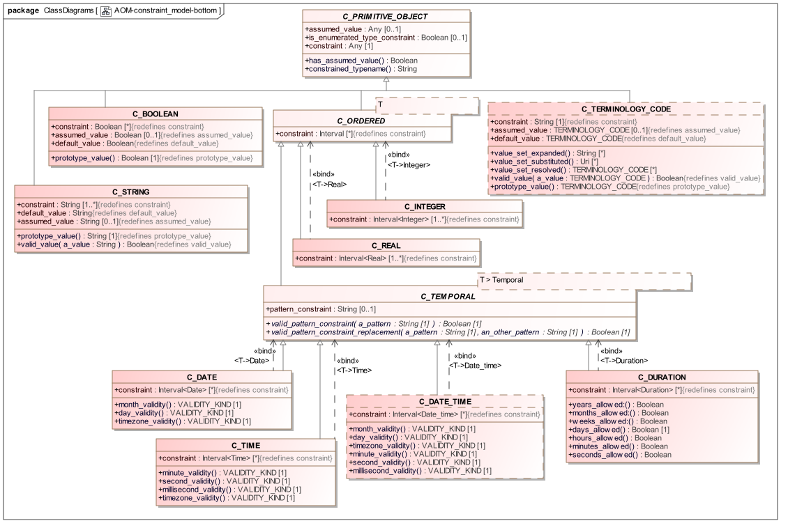
图15. constraint\_model.primitive包

这里使用的类型名称命名法C\_XXX旨在被解读为“对类型XXXX的对象的约束”，即C\_COMPLEX\_OBJECT是“对复杂对象（由复杂参考模型类型定义的）的约束”。这些类型名称在下面的形式模型中使用。

### 4.2. 语义

模型的效果是创建原型定义结构，它是对象和属性约束的层次交替。通过检查ADL原型，或者通过查看基于AOM的工具（如openEHR ADL工作台）中的原型，可以看到这种结构，这是面向对象原理的直接结果，即类由属性组成，作为类的类型。 （为了完全正确，类型不总是对应于对象模型中的类，但在这里没有任何区别）。原型的重复对象/属性层次结构提供了使用路径引用原型中的任何节点的基础。原型路径遵循可直接转换为W3C Xpath语法的语法。

#### 4.2.1. 所有节点类型

为所有节点类型定义了一些属性，如以下各节所述。

##### 4.2.1.1. 路径函数

路径特征计算从原型根路径到当前节点的路径，而has\_path函数指示是否可以在原型中找到给定路径。

##### 4.2.1.2. 一致性函数

所有节点类型包括两个函数，它们将专用原型与父原型的一致性概念形式化。两个函数都接受一个参数，该参数必须是父原型中的对应节点，不一定是直接父类。 “对应的”节点是在相同或一致的路径处找到的节点。一致路径是其中在专门原型中重新定义一个或多个at代码的路径。

如果调用它的节点是“其他”节点的有效专用化，则c\_conforms\_to函数将返回True。如果调用它的节点与另一个节点相同，则c\_congruent\_to函数返回True，但可能有一个重新定义的at-code异常。后者可能发生是由于需要将节点的域含义限制为比父节点中相同节点的含义更窄的含义。两个函数的形式语义在章节定义中给出。

##### 4.2.1.3. Any\_allowed

在一些节点类型上定义的any\_allowed函数指示参考模型对于所讨论的属性或类型允许的任何值被原型允许;其使用允许简单地表达完全“开放”约束的逻辑思想，避免对任何进一步子结构的需要。

#### 4.2.2. 属性节点

引用模型属性的约束，包括计算属性（由大多数编程语言中没有任何内容的函数表示）由C_ATTRIBUTE的实例表示。可表达的约束包括：

- is\_multiple：指示C\_ATTRIBUTE是否约束多值（即容器）RM属性或单值的标志;

- 存在：是否对应的实例（由rm\_attribute\_name属性定义）必须存在;

- 子对象：表示属性的对象值的允许值。

在单值属性（例如Person.date\_of\_birth）的情况下，子代表属性值的一个或多个替代对象约束。

对于多值属性（例如Person.contacts：List <Contact>），可以定义容器上的基数约束。对子对象的约束本质上是相同的，除了多于一个备选可以共存于数据中。图C\_ATTRIBUTE变体说明了这两种可能性。

C\_ATTRIBUTE中的存在和基数约束的出现值得一些解释，特别是因为这些概念的含义经常在面向对象的文献中被混淆。存在约束指示是否在给定属性字段中找到对象，而基数约束指示容器对象的有效成员资格。基数只需要容器对象，如List <T>，Set <T>等，而存在总是可能的。如果两者都被使用，含义如下：存在约束说明容器对象是否将存在（在所有），而基数约束表示容器中必须有多少项，以及它是否作为列表逻辑地行动，套或袋。在模型中，存在和基数都是可选的，因为它们只需要覆盖参考模型中的设置。

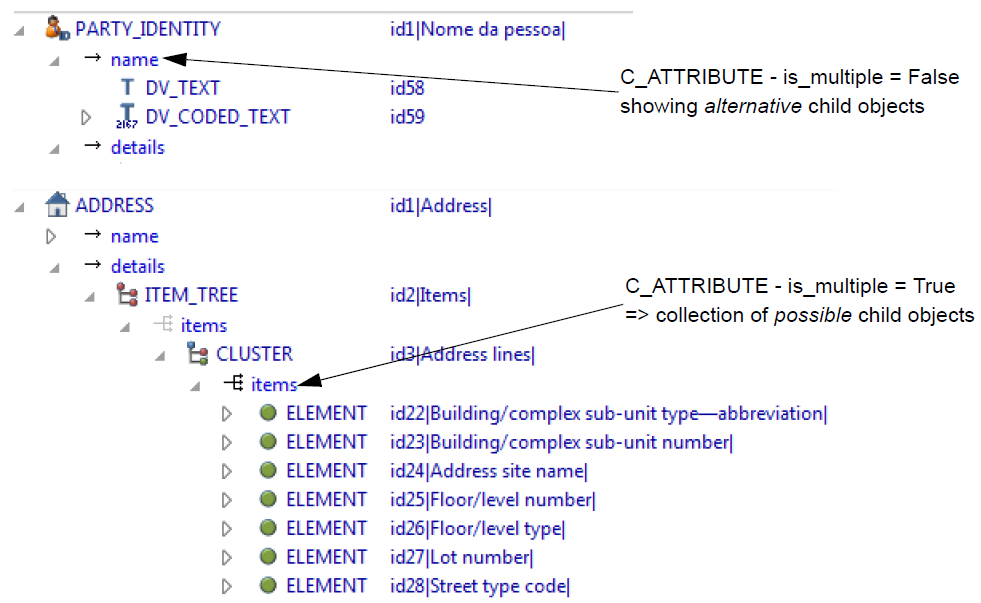
图16. C\_ATTRIBUTE变量

#### 4.2.3. 对象节点类型

以下部分适用于原型中的所有对象节点，即C\_OBJECT的任何后代的实例。

##### 4.2.3.1. Rm\_type\_name和参考模型类型匹配

每个对象节点都有一个rm\_type\_name属性，该属性指定要由原型中的该节点匹配的RM类型。 rm\_type\_name的值被理解为对所述参考模型类型的数据实例的动态类型的约束。它是来自RM的类名，或者是从RM类名构造的泛型类型，如ADL2规范的参考模型类型匹配部分所述。

原型对象节点中声明的RM类型被理解为静态类型约束。因此，它将匹配所述类型的任何RM子类型的实例，只要继承关系在RM定义中陈述。这既适用于子类，也适用于通用类型的子类型，以协变方式。以下匹配将因此成功：

- rm\_type\_name =“PARTY”匹配PERSON，其中PERSON在相关RM中继承PARTY;

- rm\_type\_name =“Interval <Ordered>”匹配间隔<Quantity>，SimpleInterval <Ordered>和SimpleInterval <Quantity>的动态类型的数据项，其中Quantity继承自Ordered，SimpleInterval从相关RM中的Interval继承。

有一些特殊的规则适用于原始类型匹配，它们使得原型中的“逻辑”原始类型名称能够匹配在一些参考模型和编程类型系统中出现的多个“具体”变体。这些在下面详细描述。

##### 4.2.3.2. Node\_id和路径

所有子类型继承的类C\_OBJECT中的node\_id属性在原型约束模型中具有关键重要性。它有两个功能：

- 它允许原型对象约束节点被单独标识，并且特别地，保证兄弟节点唯一标识;

- 它提供了可以附加人类理解术语定义的代码，以及潜在的术语绑定。

原型中的node\_ids的存在允许创建原型路径，其引用每个节点。原型中的每个节点都需要一个node\_id，但容器属性下的节点只有node\_ids必须具有术语定义。对于单值属性下的节点，术语定义是可选的（通常不提供），因为含义由参考模型属性定义给出。

> 注意，C\_PRIMITIVE\_OBJECT的实例具有常量node\_id（见下文），因此不需要以转换为AOM结构形式的语法或串行形式提供节点标识符。

##### 4.2.3.3. 兄弟姐妹顺序

在专门的原型中，可以在容器属性下定义重新定义或添加的对象节点。由于专门的原型是差分形式，即只表示重新定义或添加的节点，而不是节点未改变地继承，所以兄弟的相对排序不能简单地通过在原型的差异形式内的相关列表内的这样的项的排序来陈述。如果确实顺序是特定的，则需要显式排序指示符。 C\_OBJECT.sibling\_order属性提供了这种可能性。它只能在多值属性中的C\_OBJECT子节上设置，即对其基数有序的C\_ATTRIBUTE的实例。

##### 4.2.3.4. 节点弃用

可以将任何定义的节点类型的实例标记为过时的，意味着优选地不应该使用它，并且存在用于记录相同信息的替代解决方案。应如何处理弃用的规则或建议不在原型的范围之内，应由管理原型的治理框架提供。

#### 4.2.4. 定义对象节点（C\_DEFINED\_OBJECT）

C\_DEFINED\_OBJECT子类型对应于按原型按值定义的C\_OBJECT类别，即通过内联定义。四个属性表征C\_DEFINED\_OBJECT如下。

##### 4.2.4.1. Valid\_value

valid\_value函数测试参考模型对象是否符合原型。它是为递归实现而设计的，其中对原型定义顶部的函数的调用将导致在树上的级联调用。此函数是“原型启用的内核”组件的关键功能，它可以根据原型定义执行运行时数据验证。

##### 4.2.4.2. Prototype\_value

此函数用于生成由给定节点约束的引用对象的合理默认值。这允许基于拱形类型的软件从原型构建“原型”对象，该原型可以用作被约束的对象的初始版本，假设其由用户活动（例如，经由GUI应用）创建为新的）。这个函数的实现通常涉及使用反射库或类似的。

##### 4.2.4.3. 默认值

此属性允许在原型中定义用户指定的默认值。 default\_value对象必须与prototype\_value函数定义的类型相同，并传递valid\_value测试。在定义的情况下，prototype\_value函数将返回此值而不是合成值。

#### 4.2.5. 参考对象

类型ARCHETYPE\_SLOT和C\_COMPLEX\_OBJECT\_PROXY分别用于表示“槽”，其中可以使用进一步的原型来继续描述约束;对当前原型的一部分的引用，其表达在另一点处所需的完全相同的约束。

#### 4.2.6. 复杂对象（C\_COMPLEX\_OBJECT）

与C\_ATTRIBUTE一起，C\_COMPLEX\_OBJECT是constraint\_model包的关键结构类型，并且由类型C\_ATTRIBUTE的属性组成，它们是对参考模型类型的属性（即任何属性，包括关系）的约束。因此，每个C_ATTRIBUTE记录约束属性的名称（在rm\_attr\_name中），由约束表示的存在和基数（取决于约束的属性是多重还是单一关系）以及对该对象的约束C\_ATTRIBUTE通过其children属性（根据其参考模型）以进一步的C\_OBJECT的形式引用。

#### 4.2.7. 基本类型（C\_PRIMITIVE\_OBJECT后代）

基本类型的约束由从C\_PRIMITIVE\_OBJECT继承的类定义，即C\_STRING，C\_INTEGER等。基元类型以这样的方式表示，以便使用元组数组来容纳“元组”约束和逻辑一元约束，该元组数组的成员各自是对应于每个基元类型的基元约束。元组约束是如下所述的二阶约束，使得能够陈述共变约束。在一元情况下，约束是元组数组的第一个成员。

创建C\_PRIMITIVE\_OBJECT实例时，使用固定的id代码ADL\_CODE\_DEFINITIONS.primitive\_node\_id作为node\_id的值（请参阅ADL\_CODE\_DEFINITIONS类）。为此，不需要以原型的语法或序列化形式（包括ADL）提供节点标识符。

每个基本类型的基本约束本身可以是复杂的。其RM类型由每个C\_PRIMITIVE\_OBJECT后代中的约束访问器的类型给出，并在下表中进行了汇总。

<table>
	<tr>
		<td>AOM类型</td>
		<td>RM原始类型</td>
		<td>AOM原始约束类型</td>
		<td>说明</td>
	</tr>
	<tr>
		<td>C_BOOLEAN</td>
		<td>布尔值</td>
		<td>List &lt;Boolean&gt;</td>
		<td>可以表示一个或两个布尔值，使逻辑约束“true”，“false”和“true或false”可以表示。</td>
	</tr>
	<tr>
		<td>C_STRING</td>
		<td>串</td>
		<td>List &lt;String&gt;</td>
		<td>可能的字符串值的列表，可能包括由“/”字符分隔的正则表达式。</td>
	</tr>
	<tr>
		<td>C_TERMINOLOGY_CODE</td>
		<td>术语代码</td>
		<td>
<pre>
术语约束 -
[acN]或[atN]
</pre>
		</td>
		<td>包含单个代码或单个ac代码的字符串。在后一种情况下，约束指的是本地定义的值集或（通过绑定）外部值集。</td>
	</tr>	
	<tr>
		<td>C_ORDERED</td>
		<td>继承自Ordered</td>
		<td>List &lt;Interval&lt;T&gt;&gt;</td>
		<td>可以表示单个值（其是点间隔），值列表（点间隔的列表），间隔列表，其可以是适当的混合和点间隔。</td>
	</tr>
	<tr>
		<td>C_INTEGER</td>
		<td></td>
		<td></td>
		<td></td>
	</tr>
	<tr>
		<td>C_REAL</td>
		<td></td>
		<td></td>
		<td></td>
	</tr>
	<tr>
		<td>C_TEMPORAL</td>
		<td></td>
		<td></td>
		<td></td>
	</tr>	
	<tr>
		<td>C_DATE</td>
		<td></td>
		<td></td>
		<td></td>
	</tr>
	<tr>
		<td>C_TIME</td>
		<td></td>
		<td></td>
		<td></td>
	</tr>
	<tr>
		<td>C_DATE_TIME</td>
		<td></td>
		<td></td>
		<td></td>
	</tr>
	<tr>
		<td>C_DURATION</td>
		<td></td>
		<td></td>
		<td></td>
	</tr>
</table>

请注意，在上述中，默认假设C\_DATE\_TIME AOM类型适用于RM类型DateTime和Date\_time的数据项，包括大小写中的任何变体。

为了适应常见类型系统中使用的具体类型变体，以下RM类型匹配默认情况下应视为发生：

- 字符串变体：除了匹配字符串，C\_STRING应该匹配StringN和String\_N实例，以适应RM类型，如String8，String\_32等;

- 整数变量：除了匹配整数，C\_INTEGER应该匹配IntegerN和Integer\_N，以适应RM类型，如Integer\_16，Integer64等;

- 实际变体：除了匹配Real，C\_REAL应该匹配RealN和Real\_N和Double，以适应RM类型，如Real\_32，Real64和Double。

下面的RM原始类型等效部分中描述了基于每个RM配置此方法。

##### 4.2.7.1. Assumed\_value

假设值属性对于包含任何可选约束的原型非常有用。并且提供定义可以为在执行时间没有发现数据的数据项假设的值的能力。如果填充，它可以包含一个单一的代码，该代码必须在约束属性中的ac代码引用的本地值集中。

例如，用于概念“血压测量”的原型可以包含可选的协议部分，其包含用于患者位置的数据点，具有选择“躺着”，“坐着”和“站立”。由于该部分是可选的，因此可以根据不包含协议部分的原型创建数据。然而，如果患者没有处于某个位置，则不能采取血压，因此清楚地，患者位置具有隐含的值。在临床医生中，基本假设几乎总是针对这样的事情：在一般实践中，如果没有另外说明，则该位置总是可以安全地假定为“坐着”;在医院环境中，“说谎”将是正常的假设。原型的假定值特征允许明确地陈述这样的假设，使得当可选项不包括在数据中时，所有用户/系统知道假定什么值。

请注意，假设值的概念与“默认值”的概念不同。后一个概念是对于要由用户填充的数据项提供的默认“预填充”值（通常在模板的本地上下文中），但是在许多情况下通常是相同的。因此，默认值仅仅是用户的效率机制。因此，默认值确实显示在数据中，而假设值不显示。

#### 4.2.8. 术语约束（C\_TERMINOLOGY\_CODE）

C\_TERMINOLOGY\_CODE类型需要一些复杂性，值得进一步解释。这是唯一的约束语义不是自包含的，但位于原型术语和/或外部术语中的约束类型。

原型中的C\_TERMINOLOGY\_CODE实例很简单：它只能是以下约束之一：

- 单个ac码，引用在原型术语中定义的值集或者绑定到外部值集或ref集;

    - 在这种情况下，可以包括附加的at码作为假定值; at-code必须来自本地定义的值集;

- 单个代码，代表单个可能的值。

> 注意: 
理论上的第二种情况可以使用涉及包含单个值的值集的ac码来完成，但是在这个额外的语句中看起来没有什么价值，并且在提供单成员值集快捷方面几乎没有成本。

此外，C\_TERMINOLOGY\_CODE实例可以通过访问原型术语来重构内部值集（这必须在实现中设置）。如果评估绑定，则也可以潜在地获得值集的外部形式。这样做的效用是能够在评估操作模板时评估和缓存某些外部'ref集合'。

###### 4.2.8.1. 术语代码解析

当以操作模板的形式部署原型时，内部定义的值集合，并且任何绑定被分阶段处理，以便获得用户应当从中选择的最终术语代码。 C\_TERMINOLOGY\_CODE类提供了一些函数来形式化如下。

- value\_set\_expanded：List <String>：此函数将ac代码转换为其对应的at-codes集合，如原型的value\_sets部分中所定义。

- value\_set\_substituted：List <URI>：其中绑定存在于值集合at-codes，此函数将每个代码转换为其对应的绑定目标，即URI。

- value\_set\_resolved：List <TERMINOLOGY\_CODE>：此函数将URI列表转换为最终术语，包括使用文本字段，即TERMINOLOGY\_CODE列表。

这些功能通常被实现为“lambdas”或“代理”，以便获得对目标术语的访问。

> 注意: 
由于原型可能不包含其所有（甚至任何）术语约束的外部术语绑定，“已解析”原型通常在其cADL定义中包含at-codes。在创建数据的任何实现中，这些代码将被视为真实编码的术语，因此，原始代码可能会出现在实际数据中，如ADL规范的术语集成部分所述。

#### 4.2.9. 枚举类型的约束

假设参考模型中的枚举类型具有在UML和主流编程语言中期望的语义，即基于原始类型（通常为整数或字符串）的不同类型。每个这样的类型由来自其底层类型的域的一组值组成，因此，一组Integer，String或其他原始值。假定这些值中的每一个以符号常数的方式命名。虽然严格地说，UML不需要枚举类型是基于底层基本类型，编程语言，因此这里假设涉及来自这种类型的域的值。

因此，对枚举类型的约束由C\_PRIMITIVE子孙的AOM实例组成，几乎总是C\_INTEGER或C\_STRING。在C\_PRIMITIVE上定义的标志is\_enumerated\_type\_constraint指示给定的C\_PRIMITIVE是枚举类型的约束器。

由于C_PRIMITIVE在ADL中没有类型名称，所以类型名称由解析来自ADL的原型并且存储在从C\_OBJECT继承的rm_type属性中的任何解析器或编译器工具推断。下面显示了一个类型枚举的示例。

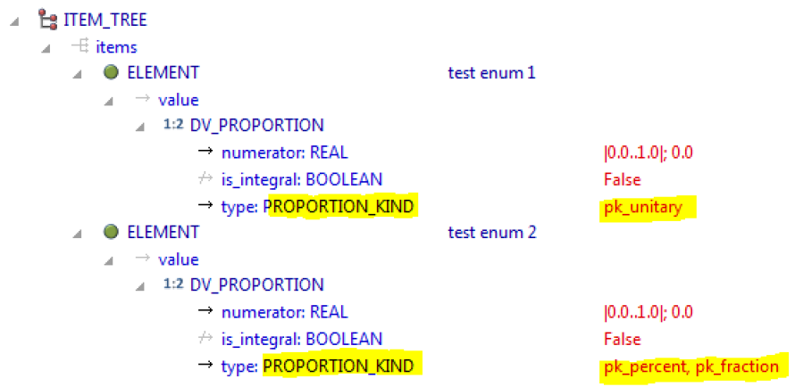

从对象转储格式（如ODIN，JSON或XML）解析的解析器不需要这样做。

约束本身的形式只是一系列的Integer，String或其他原始值，或一个等效的范围。在上面的例子中，类型为PROPORTION\_KIND的字段上的pk\_percent，pk\_fraction约束的ADL等价物实际上只是\ {2,3}，并且它通过查看可视化以显示相关的符号名称。

### 4.3. 二阶约束

上面描述的所有约束语义在它们定义如何在参考模型的某一部分的实例可能性空间中定义具体对象/属性/对象层次结构的意义上可以被认为是“一级”。

然而，一些约束不直接适合在对象/属性/对象分层结构方案内，并且在原型形式主义中被认为是“二阶约束”。 “规则”约束（ADL / AOM 1.4中的“不变量”）构成一个这样的组。这些约束是根据一阶谓词逻辑语句来定义的，其可以指代在主分层结构内的任何数量的约束节点。这些在图规则包中描述。

另一种类型的二阶约束可以“附加”到对象/属性/对象分层结构，以便进一步限制结构可能性。虽然这些约束在理论上也可以表示为规则，但是它们通过对主约束模型的直接添加来支持，因为它们可以在ADL和相应的AOM结构中容易且直观地表示为内联。

#### 4.3.1. 元组约束

元组约束被设计成解释了将多个RM类属性的值约束在一起的非常普通的需要。这有效地将所讨论的属性视为元组，并且相应的对象约束也因此被建模为元组。关于元组的详细解释可以在ADL2规范的关于二阶约束的部分中找到。添加到主要约束模型以支持元组如下所示。

图18.元组约束模型

在此模型中，类型C\_ATTRIBUTE\_TUPLE将C\_COMPLEX\_OBJECT下的共约束C\_ATTRIBUTE分组。目前，具体类型限于C\_PRIMITIVE\_OBJECT以减少复杂性，并且因为它满足所有已知的元组约束的示例。原则上，可以允许任何C\_DEFINED\_OBJECT，并且这可以在将来改变。

元组约束类型替换ADL / AOM 1.4中定义的所有特定于域的约束类型，包括C\_DV\_QUANTITY和C\_DV\_ORDINAL。

这些添加允许“注释”标准约束结构（即C\_ATTRIBUTE / C\_COMPLEX\_OBJECT / C\_PRIMITIVE\_OBJECT层级），同时保持第一级结构完整。以下示例显示了原型ORDINAL类型受约束的原型实例结构。逻辑要求是将ORDINAL约束为三个实例可能性中的一个，每个实例可能性分别由类型为Integer和TERMINOLOGY\_CODE的属性值和符号的一对值组成。这三个实例约束中的每一个都应该被理解为单值拥有属性ELEMENT .value的替代。元组约束实现了将约束表示为对，而不仅仅是在最终叶级别的可允许替代，这将不正确地允许整数和代码值的任何混合。

图19.元组约束示例AOM实例

图20.元组约束示例数据

#### 4.3.2. 断言

断言也用在ARCHETYPE\_SLOTs中，以便表示插槽的'included'和'excluded'原型。 在这种情况下，每个断言是引用其他原型的部分的表达式，例如其标识符（例如，“包括short\_concept\_name匹配xxxx的原型”）。 断言在这里被建模为一元前缀和二进制中缀运算符的通用表达式树。 在openEHR ADL规范中给出了ADL语法中的原型槽的示例。

### 4.4. AOM类型替换

图constraint\_model包中定义的C\_OBJECT类型在下面被再现，具体类型可能实际出现在原色中，以深黄色/非斜体显示。

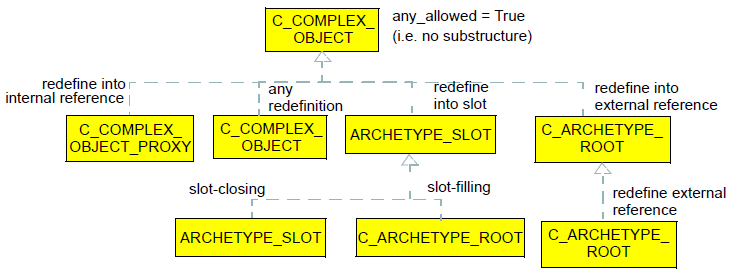

图21. C\_Object替换

在一个专门的原型中，重新定义父对象中的相应节点的节点通常具有相同的C\_OBJECT类型（我们可以认为这是一个“元类型”，因为RM类型是信息模型意义上的“类型”），但在某些情况下也可能是不同的C\_OBJECT类型。

元类型重定义的规则如下：

- 每个元类型的节点可以由具有缩窄/添加的约束的相同元类型的节点重新定义;

- ARCHETYPE\_SLOT可以通过以下方式重新定义：

    - 一个或多个C\_ARCHETYPE\_ROOT节点一起考虑，被认为定义时隙的'填充'版本;

    - ARCHETYPE\_SLOT，以便关闭插槽。

- C\_ARCHETYPE\_ROOT节点可以通过以下方式重新定义：

    - C\_ARCHETYPE\_ROOT，其中重定义节点的archetype\_ref是父节点中提到的特殊化。

- 除了RM类型，node\_id和可能的出现（即没有子结构）之外不包含约束的'终端'C\_COMPLEX\_OBJECT节点可以由除了C_PRMITIVE\_OBJECT之外的任何其他AOM类型的约束重新定义。

“终端”C\_COMPLEX\_OBJECT可以被理解为主要为了说明RM类型和含义（id代码）而定义的占位符节点。

### 4.5. 类定义

#### 4.5.1. ARCHETYPE\_CONSTRAINT类

#### 4.5.2. C\_ATTRIBUTE类

#### 4.5.3. CARDINALITY类

##### 4.5.3.1. 一致性语义

以下函数正式定义了专用原型中C\_ATRIBUTE节点与父原型中对应节点的一致性，其中“对应”表示在同一路径或一致路径中找到的节点。

	c_conforms_to (other: like Current): Boolean
	        -- True if this node on its own (ignoring any subparts) expresses the same or narrower constraints as `other'.
	        -- Returns False if any of the following is incompatible:
	        --	 * cardinality
	        --	 * existence
	    require
	        other /= Void
	    do
	        Result := existence_conforms_to (other) and
	            ((is_single and other.is_single) or else
	            (is_multiple and cardinality_conforms_to (other)))
	    end
	
	c_congruent_to (other: like Current): Boolean
			-- True if this node on its own (ignoring any subparts) expresses no additional constraints than `other'.
	    require
	        other /= Void
	    do
	        Result := existence = Void and ((is_single and other.is_single) or
	                (is_multiple and other.is_multiple and cardinality = Void))
	    end
	
	existence_conforms_to (other: like Current): Boolean
			-- True if the existence of this node conforms to other.existence
	    require
	        other_exists: other /= Void
	    do
	        if existence /= Void and other.existence /= Void then
	            Result := other.existence.contains (existence)
	        else
	            Result := True
	        end
	    end
	
	cardinality_conforms_to (other: like Current): Boolean
			-- True if the cardinality of this node conforms to other.cardinality, if it exists
	    require
	        other_exists: other /= Void
	    do
	        if cardinality /= Void and other.cardinality /= Void then
	            Result := other.cardinality.contains (cardinality)
	        else
	            Result := True
	        end
	    end
	
##### 4.5.3.2. 有效性规则

有效性规则如下：

- VCARM：属性名称引用模型有效性：引入属性约束块的属性名称必须在底层信息模型中定义为引入包围对象块的类型的属性（存储或计算）。

- VCAEX：原型属性参考模型存在一致性：如果设置一个属性的存在，则必须符合，即相同或更窄，与底层信息模型中相应属性的存在相一致。

- VCAM：原型属性参考模型多重性一致性：属性的多重性，即属性是乘法还是单值，必须符合底层信息模型中相应属性的多重性。

- VDIFV：archetype属性差异路径有效性：如果原型属于专用，则原型只能有差分路径。

以下有效性规则适用于专门原型中的重定义：

- VDIFP：专用原型属性差异路径有效性：如果属性约束具有差分路径，则路径必须存在于平面父代中，并且相对于参考模型也是有效的，即在其对应于法律潜力构造的意义上的对象。

- VSANCE：专用原型属性节点存在一致性：如果说明的话，专门原型中重新定义的属性节点的存在必须符合平坦父原型中对应节点的存在，通过具有相同的范围或范围完全包含由后者。

- VSAM：专门的原型属性多重一致性：重定义属性的多重性，即属性是乘法还是单值，必须符合父原型中相应属性的多重性。

以下有效性规则适用于单值属性，即当C\_ATTRIBUTE.is\_multiple为False时：

- VACSO：单值属性子对象出现的有效性：单值属性的子对象的出现不能具有大于1的上限。

以下有效性规则适用于容器属性，即当C\_ATTRIBUTE.is\_multiple为True时：

- VACMCU：基数/出现上限有效性：其中在属性上声明具有有限上限的基数，对于其中记述了出现约束的所有直接子对象，出现必须具有开放上界（ien。*）这被解释为在基数内允许的最大值，或者是有限上限，其是基数上限。

- VACMCO：基数/发生孤立：对于一个可选子对象（即出现次数下限为0的对象）的至少一个实例和每个强制子对象的一个​​实例必须是可能的（即对象出现的对象约束下限为> = 1）包括在基数范围内。

- VCACA：原型属性参考模型基数一致性：属性的基数必须符合（即相同或更窄）基础信息模型中相应属性的基数。

以下有效性警告适用于容器属性，即当C\_ATTRIBUTE.is\_multiple为True时：

- WACMCL：基数/出现次数下限有效性：其中在属性上声明具有有限上限的基数，对于其中陈述出现约束的所有直接子对象，出现次数下限应当低于基数上限。

以下有效性规则适用于专业原型中的基数重定义：

- VSANCC：专用原型属性节点基数一致性：如果说明，专用原型中重定义（多值）属性节点的基数必须符合平面父原型中对应节点的基数，要么是相同的，要么是完全由后者包含。

#### 4.5.4. C\_OBJECT类

#### 4.5.4. C\_OBJECT类

#### 4.5.5. SIBLING\_ORDER类

##### 4.5.5.1. 出现引用规则

“出现次数”的概念不存在于可用作基于模板类型的参考模型的对象模型中，因为它是类模型。然而，原型通常限制容器属性下的对象节点的出现，指示符合特定对象约束节点的对象数可能存在多少。

在各种情况下，知道原型对象节点的有效出现是有用的。一个是验证，以确定发生约束的有效性;另一个是在原型编辑器工具。类似地，在操作模板中，在容器属性的所有子对象节点上需要出现约束。大多数这样的约束来自源模板和原型，但通常会有没有出现设置的节点。在这些情况下，根据以下算法根据原型和参考模型推断出现次数约束，其中c\_object表示原型中的任何对象节点。

	effective_occurrences (rm_prop_mult: FUNCTION [args: TUPLE[rm_type_name: STRING, rm_property_path: STRING], result: MULTIPLICITY_INTERVAL]): MULTIPLICITY_INTERVAL
	        -- evaluate effective occurrences, using the RM when no occurrences constraint or parent node
	        -- cardinality exists.
	        -- In this case, the upper limit of the RM's owning attribute is used to provide a value.
	        -- `rm_prop_mult' is a function object that knows how to compute effective object multiplicity
	        -- by looking at the owning RM property.
	    local
	        occ_lower: INTEGER
	    do
	        if occurrences /= Void then
	            Result := occurrences
	
	        elseif parent /= Void then
	            if parent.existence /= Void then
	                occ_lower := parent.existence.lower
	            end
	            if parent.cardinality /= Void then
	                if parent.cardinality.interval.upper_unbounded then
	                    create Result.make_upper_unbounded (occ_lower)
	                else
	                    create Result.make_bounded (occ_lower, parent.cardinality.interval.upper)
	                end
	            elseif parent.parent /= Void then
	                Result := rm_prop_mult (parent.parent.rm_type_name, parent.parent.rm_attribute_path)
	            else
	                create Result.make_upper_unbounded (occ_lower)
	            end
	        else
	            create Result.make_open
	        end
	    end

在上面，rm\_prop\_mult是对RM模式表示中的函数的引用，其具有以下逻辑：

	object_multiplicity (rm_type_name: STRING, rm_property_path: STRING): MULTIPLICITY_INTERVAL
	        -- compute the effective object multiplicity of objects at rm_property_path within type rm_type_name
	        -- from the Reference Model
	    do
	        rm_property_def := get_rm_property_def (rm_type_name: STRING, rm_property_path: STRING)
	        if rm_property_def.is_container then
	            if rm_property_def.cardinality.upper_unbounded then
	                create Result.make_upper_unbounded (0)
	            else
	                create Result.make_bounded (0, rm_property_def.cardinality.upper)
	            end
	        else
	            Result := rm_property_def.existence
	        end
	    end

如何具体实现取决于建模环境。 一旦可能的RM模型实现在openEHR基本元模型（BMM）规范中描述。

##### 4.5.5.2. 一致性语义

以下函数形式上定义了专用原型中的C\_OBJECT节点与父原型中对应节点的一致性，其中“对应”是指在相同或相同路径处找到的节点。

	c_conforms_to (other: like Current; agent rm_types_conformant (a_type, other_type: String)): Boolean
	        -- True if this node on its own (ignoring any subparts) expresses the same or narrower constraints
	        -- as `other'.
	        -- `other' is typically from the flat parent archetype.
	        -- Returns True only when the following is True:
	        --	 * rm_type_name is the same or a subtype of rm_type_name of other;
	        --	 * occurrences is same (= Void) or a sub-interval
	        --	 * node_id is the same, or redefined to a legal code at the level of the owning archetype
	        -- `rm_types_conformant' is an agent (lambda) that can test an RM type's conformance to another RM type
	    require
	        other /= Void
	        rm_types_conformant /= Void
	    do
	        Result := node_id_conforms_to (other) and
	            occurrences_conforms_to (other) and
	            (rm_type_name.is_case_insensitive_equal (other.rm_type_name) or else
	            rm_types_conformant (rm_type_name, other.rm_type_name))
	    end
	
	c_congruent_to (other: like Current): Boolean
	        -- True if this node on its own (ignoring any subparts) expresses no constraints in addition
	        -- to `other', other than possible redefinition of the node id, which doesn't matter, since
	        -- this won't get lost in a compressed path.
	        -- Current and `other' are typically from flat archetypes being compared to generate a diff.
	        -- Used to determine if path segments can be compressed.
	        -- Returns True if:
	        --	 * rm_type_name is identical
	        --	 * occurrences is Void or else identical to other.occurrences
	        -- 	 * sibling_order is Void or else identical to other.sibling_order
	        --	 * node_id is identical or else is the only child that overlays the parent node
	    require
	        other /= Void
	    do
	        Result := rm_type_name.is_case_insensitive_equal (other.rm_type_name) and
	            (occurrences = Void or else (other.occurrences /= Void and then
	                occurrences.is_equal (other.occurrences))) and
	            (sibling_order = Void or else (other.sibling_order /= Void and then
	                sibling_order.is_equal (other.sibling_order))) and
	            node_reuse_congruent (other)
	    end
	
	occurrences_conforms_to (other: like Current): Boolean
	    require
	        other_exists: other /= Void
	    do
	        if occurrences /= Void and other.occurrences /= Void then
	            Result := other.occurrences.contains (occurrences)
	        else
	            Result := True
	        end
	    end
	
	node_id_conforms_to (other: like Current): Boolean
	    require
	        other_exists: other /= Void
	    do
	        Result := codes_conformant (node_id, other.node_id)
	    end
	
	node_reuse_congruent (other: like Current): BOOLEAN
	        -- True if this node is the sole re-using node of the corresponding node in the flat
	    do
	        Result := node_id_conforms_to (other) and
	            (is_root or else
	            attached parent and then parent.child_reuse_count (other.node_id) = 1)
	    end
	
##### 4.5.5.3. 有效性规则

所有C\_OBJECT的有效性规则如下：

- VCORM对象约束类型名存在：引入对象约束块的类型名称必须在基础信息模型中定义。

- VCORMT对象约束类型有效性：引入对象约束块的类型名称必须与其拥有属性的基础信息模型中声明的类型相同或一致。

- VCOCD对象约束定义有效性：对象约束块由以下之一组成（取决于子类型）：“任何”约束;参考;在发生设置为{0}的情况下，子约束的内联定义或无。

- VCOID对象节点标识符有效性：每个对象节点必须具有节点标识符。

- VCOSU对象节点标识符有效性：每个对象节点在原型中必须是唯一的。

以下有效性规则控制专用原型中的C\_OBJECT。

- VSONT专用原型对象节点元类型一致性：专用原型中重新定义的对象节点（即AOM节点类型，如C\_COMPLEX\_OBJECT等）的元类型必须与平面父对象中的对应节点的元类型相同，以下异常：没有子属性的C\_COMPLEX\_OBJECT可以由除C\_PRIMITIVE\_OBJECT之外的任何AOM类型的节点重新定义; C\_COMPLEX\_OBJECT\_PROXY，可以由C\_COMPLEX\_OBJECT重新定义; ARCHTEYPE\_SLOT可以由C\_ARCHETYPE\_ROOT（即“时隙填充”）重新定义。另请参见有效性规则VDSSID和VARXID。

- VSONCT专用原型对象节点引用类型一致性：专用原型中重新定义的对象节点的引用模型类型必须符合平面父原型中对应节点中的引用模型类型，要么是相同的，要么通过继承关系相关参考模型。

- 已弃用：VSONIR专用原型重新定义对象节点标识符条件：如果任何参考模型类型，术语中的节点标识符定义，则必须重新定义在平面父代中的节点的重定义的专用原型中的对象节点的节点标识符，或直接对象约束的出现被重新定义，除了出现被重新定义为{0}，即排除。

- 已弃用：VSONI专用原型重新定义对象节点标识符有效性：如果专用原型中的对象节点是根据VSONIR对平面父节点中的节点的重新定义，并且父节点携带节点标识符，则它必须携带节点标识符儿童原型的水平。否则，它必须携带与相应父节点相同的节点标识符（或无）。

- VSONIN专用原型新对象节点标识符有效性：如果专用原型中的对象节点是相对于平面父节点的新节点，并且它携带节点标识符，则标识符必须是“新”节点标识符，的儿童原型。

- VSONIF专用原型对象节点标识符在平面兄弟节点中的有效性：专用原型中的对象节点的标识（或不是）对于扁平父节点中的任何同级对象节点（参见VACMI）必须有效。

- VSONCO专用原型重新定义对象节点出现的有效性：如果说明了专用原型中重新定义的对象节点的出现，则必须符合平面父原型中对应节点中的出现，要么是相同的，要么完全由后者包含。

- VSONPT专用原型禁止对象节点AOM类型有效性：如果父级中的匹配节点具有相同的AOM类型，则可以仅禁止（例如{0}）专门原型中重新定义的对象节点的出现。

- VSONPI专门原型禁止对象节点AOM节点id有效性：发生匹配{0}的专用原型中的重新定义的对象节点必须与重定义的平面父对象中的节点具有完全相同的node\_id。

- VSONPO专用原型对象节点禁止发生的有效性：如果说明的话，专门原型中新的（即在父平面中没有对应的节点）对象节点的出现可能不是'禁止'，即{0}，因为仅禁止对现有节点有意义。

- VSSM专用原型同级订单有效性：在专用原型中的兄弟标记中使用的同级订单节点标识代码必须引用在平面父原型中同一容器中找到的节点。

#### 4.5.6. C\_DEFINED\_OBJECT类

#### 4.5.7. C\_COMPLEX\_OBJECT类

##### 4.5.7.1. 有效性规则

C\_COMPLEX\_OBJECTs的有效性规则如下：

VCATU属性唯一性：在对象节点中发生的同属属性必须相对于彼此唯一地命名，方式与对象引用模型中的类定义相同。

#### 4.5.8. C\_ARCHETYPE\_ROOT类

##### 4.5.8.1. 有效性规则

以下有效性规则适用于C\_ARCHETYPE\_ROOT对象：

VARXNC外部引用节点标识符有效性：如果外部引用对象是槽节点或另一个外部引用节点的重新定义，则对象的node\_id必须符合对应的节点的node\_id（即，它的相同或子节点）父节点。

VARXAV外部引用节点原型引用有效性：如果引用对象是另一个外部引用节点的重定义，对象的archetype\_ref必须匹配一个真实原型，该原型具有作为祖先的原型引用，由相应父节点中提及的原型引用匹配。

VARXTV外部引用类型有效性：引用对象原型标识符的引用模型类型必须相同，或者符合插槽的类型（如果有），在父原型中，或者属性的引用模型类型引用对象出现在子原型中的平面父对象。

VARXR外部引用指可解析的假象：原型引用必须引用可在当前存储库中找到的一个假象。

以下有效性规则适用于专用于平面父原型中的ARCHETYPE\_SLOT的C\_ARCHETYPE\_ROOT：

VARXS外部引用槽符合性：原型引用重新定义平面父代中的原型槽时，它必须符合原型槽节点，它是来自与当前原型相同的引用模型的引用模型类型。

VARXID外部引用槽填充id有效性：定义为父原型中的插槽的外部引用节点必须具有作为槽的特殊化的节点ID。

#### 4.5.9. ARCHETYPE\_SLOT类

##### 4.5.9.1. 有效性规则

ARCHETYPE\_SLOTs的有效性规则如下：

- VDFAI原型标识符的有效性定义。 在定义部分中的原型槽中提到的任何原型标识符必须符合用于原型标识符的已发布的openEHR规范。

- VDSIV原型槽'include'约束有效性。 原型槽中的“include”约束必须符合槽约束有效性规则。

- VDSEV原型槽“排除”约束有效性。 原型槽中的“排除”约束必须符合槽约束有效性规则。

槽约束有效性规则如下：

	if includes not empty and = any then
	    not (excludes empty or /= any) ==> VDSEV Error
	elseif includes not empty and /= any then
	    not (excludes empty or = any) ==> VDSEV Error
	elseif excludes not empty and = any then
	    not (includes empty or /= any) ==> VDSIV Error
	elseif excludes not empty and /= any then
	    not (includes empty or = any) ==> VDSIV Error
	end
	
以下有效性规则适用于定义为父原型中的插槽的专门化的ARCHETYPE\_SLOT：

- VDSSID时隙重定义子节点ID：重新定义平面父代中的插槽节点的专用原型中的插槽节点必须具有相同的节点标识。

- VDSSM专用原型槽定义匹配有效性。 通过专用原型槽定义从原型库匹配的原型集必须是通过父槽定义从相同库匹配的集合的正确子集。

- VDSSP专用原型槽定义父有效性。 原型槽的专业化的平面父代必须不关闭（is\_closed = False）。

- VDSSC专用原型槽定义封闭有效性。 在原型槽的专门化中，槽可以指定为关闭（is\_closed = True）或槽可以变窄，但不能同时变窄。

#### 4.5.10. C\_COMPLEX\_OBJECT\_PROXY类

##### 4.5.10.1. 有效性规则

以下有效性规则适用于内部引用：

- VUNT use\_node引用模型类型有效性：在C\_COMPLEX\_OBJECT\_PROXY节点中提及的引用模型类型必须与所引用节点的引用模型类型相同或为超级类型（根据引用模型）。

- VUNP use\_node路径有效性：use\_node语句中提到的路径必须引用在相同原型或其任何专门化父原型中定义的对象节点，它本身不是内部参考节点，并且如果有一个节点标识符需要在参考点。

以下有效性规则适用于在专门原型中重新定义内部引用：

- VSUNT use\_node专业化父有效性：C\_COMPLEX\_OBJECT\_PROXY节点可以由另一个C\_COMPLEX\_OBJECT\_PROXY（例如，为了重新定义事件）在专门的原型中重新定义，或者通过合法地重新定义由引用所引用的目标C\_COMPLEX\_OBJECT节点的C\_COMPLEX\_OBJECT结构。

#### 4.5.11. C\_PRIMITIVE\_OBJECT类

##### 4.5.11.1. 有效性规则

应用于所有C\_PRIMITIVE\_OBJECT类型的有效性规则如下：

VOBAV对象节点假定值有效性：假定值的值必须在由其附加的约束定义的值空间内。

##### 4.5.11.2. 一致性语义

以下函数形式上定义了专用原型中C\_PRIMITIVE\_OBJECT子类型的节点到父原型中的对应节点的一致性，其中“对应”是指在相同或一致路径处找到并且具有相同AOM类型的节点。

	c_conforms_to (other: like Current; agent rm_types_conformant (a_type, other_type: String)): Boolean
	        -- True if this node on its own (ignoring any subparts) expresses the same or narrower constraints
	        -- as `other'. Returns True only when the following is True:
	        --   * occurrences conforms
	        --   * `rm_type_name' is identical to that in `other'
	        -- `rm_types_conformant' is an agent (lambda) that can test an RM type's conformance to another RM type
	    require
	        other /= Void
	        rm_types_conformant /= Void
	    do
	        Result := occurrences_conforms_to (other) and rm_type_name.is_case_insensitive_equal (other.rm_type_name)
	    end
	
	c_congruent_to (other: like Current): Boolean
	        -- True if this node on its own (ignoring any subparts) expresses no constraints in addition to `other'
	    require
	        other /= Void
	    do
			Result := rm_typename.is_case_insensitive_equal (other.rm_typename)
	    end
	
#### 4.5.12. C\_BOOLEAN类

##### 4.5.12.1. 一致性语义

以下函数形式上定义了专用原型中的C\_BOOLEAN节点到父原型中的对应节点的一致性，其中“对应”是指在相同或一致路径处找到并且具有相同AOM类型的节点。

	c_conforms_to (other: like Current; agent rm_types_conformant (a_type, other_type: String)): Boolean
	        -- True if this node on its own (ignoring any subparts) expresses the same or narrower constraints
	        -- as `other'. Returns True only when the following is True:
	        --   * C_PRIMITIVE_OBJECT conditions are met and
	        --   * every `constraint' value is in `other.constraint'
	        -- `rm_types_conformant' is an agent (lambda) that can test an RM type's conformance to another RM type
	    require
	        other /= Void
	        rm_types_conformant /= Void
	    do
	        Result := precursor (other, rm_type_conformance_checker) and  -- precursor is from C_PRIMITIVE_OBJECT
	            constraint.count < other.constraint.count and
	            across constraint as val_csr all other.constraint.has (val_csr.item) end
	    end
	
	c_congruent_to (other: like Current): Boolean
	        -- True if this node on its own (ignoring any subparts) expresses no constraints in addition to `other'
	    require
	        other /= Void
	    do
	        Result := precursor (other) and   -- precursor is from C_PRIMITIVE_OBJECT
	            constraint.count = other.constraint.count and
	            across constraint as val_csr all other.constraint.has (val_csr.item) end
	    end
	
#### 4.5.13. C\_STRING类

TBD：有一个参数只允许一个String值，而不是一个列表，其中值是一个正则表达式，因为{“platypus”，“kangaroo”，“wombat”}可以表示为{/ platypus | kangaroo | wombat /}。 参见ADL规范。

##### 4.5.13.1 一致性语义

以下函数形式上定义了专用原型中的C\_STRING节点到父原型中的对应节点的一致性，其中“对应”是指在相同或一致路径处找到并且具有相同AOM类型的节点。

	c_conforms_to (other: like Current; agent rm_types_conformant (a_type, other_type: String)): Boolean
	        -- True if this node on its own (ignoring any subparts) expresses the same or narrower constraints
	        -- as `other'. Returns True only when the following is True:
	        --   * C_PRIMITIVE_OBJECT conditions are met and
	        --   * every `constraint' string or pattern is in `other.constraint'
	        -- `rm_types_conformant' is an agent (lambda) that can test an RM type's conformance to another RM type
	    require
	        other /= Void
	        rm_types_conformant /= Void
	    do
	        Result := precursor (other, rm_type_conformance_checker) and -- precursor is from C_PRIMITIVE_OBJECT
	            constraint.count < other.constraint.count and
	            across constraint as constraint_csr all other.constraint.has (constraint_csr.item) end
	end
	
	c_congruent_to (other: like Current): Boolean
	        -- True if this node on its own (ignoring any subparts) expresses no constraints in addition to `other'
	    require
	        other /= Void
	    do
	        Result := precursor (other) and -- precursor is from C_PRIMITIVE_OBJECT
	            constraint.count = other.constraint.count and then
	            across constraint as str_csr all
	                other.constraint.i_th (str_csr.cursor_index).is_equal (str_csr.item)
	            end
	    end
	
#### 4.5.14. C\_ORDERED类

##### 4.5.14.1. 一致性语义

以下函数形式上定义了专用原型中C\_ORDERED子类型的节点对父原型中的对应节点的一致性，其中“对应”是指在相同或一致路径处找到并且具有相同AOM类型的节点。
	
	c_conforms_to (other: like Current; agent rm_types_conformant (a_type, other_type: String)): Boolean
	        -- True if this node on its own (ignoring any subparts) expresses the same or narrower constraints
	        -- as `other'. Returns True only when the following is True:
	        --   * C_PRIMITIVE_OBJECT conditions are met and
	        --   * every interval constraint (if amy exist) is inside at least one interval in other.constraint
	        -- `rm_types_conformant' is an agent (lambda) that can test an RM type's conformance to another RM type
	    require
	        other /= Void
	        rm_types_conformant /= Void
	    do
	        if precursor (other, rm_types_conformant) and -- precursor is from C_PRIMITIVE_OBJECT
	            across constraint as ivl_csr all
	                across other.constraint as other_ivl_csr some other_ivl_csr.item.contains (ivl_csr.item) end
	            end
	        end
	    end
	
	c_congruent_to (other: like Current): Boolean
	        -- True if this node on its own (ignoring any subparts) expresses no constraints in addition to `other'
	    require
	        other /= Void
	    do
	        Result := precursor (other) and  -- precursor is from C_PRIMITIVE_OBJECT
	            constraint.count = other.constraint.count and
	            across constraint as ivl_csr all
	                ivl_csr.item.is_equal (other.constraint.i_th (ivl_csr.cursor_index))
	            end
	    end
	
#### 4.5.15. C\_INTEGER类
#### 4.5.16. C\_REAL类
#### 4.5.17. C\_TEMPORAL类
##### 4.5.17.1. 一致性语义

以下函数形式上定义了专用原型中C\_TEMPORAL子类型的节点到父原型中的对应节点的一致性，其中“对应”是指在相同或一致路径处找到并且具有相同AOM类型的节点。

	c_conforms_to (other: like Current; agent rm_types_conformant (a_type, other_type: String)): Boolean
	        -- True if this node on its own (ignoring any subparts) expresses the same or narrower constraints
	        -- as `other'. Returns True only when the following is True:
	        --   * C_ORDERED conditions are met and
	        --   * every interval in `constraint' (if amy exist) is inside an interval in `other.constraint'
	        --   * if `pattern_constraint' exists, it is the same or a valid replacement of that in `other'.
	        -- `rm_types_conformant' is an agent (lambda) that can test an RM type's conformance to another RM type
	    require
	        other /= Void
	        rm_types_conformant /= Void
	    do
	        if precursor (other, rm_types_conformant) then -- precursor is from C_ORDERED
	            if not pattern_constraint.is_empty and not other.pattern_constraint.is_empty then
	                Result := valid_pattern_constraint_replacement (pattern_constraint, other.pattern_constraint)
	            else
	                Result := pattern_constraint.is_empty and other.pattern_constraint.is_empty
	            end
	        end
	    end
	
	c_congruent_to (other: like Current): Boolean
	        -- True if this node on its own (ignoring any subparts) expresses no constraints in addition to `other'
	    require
	        other /= Void
	    do
	        if precursor (other) then -- precursor is from C_ORDERED
	            if not pattern_constraint.is_empty and not other.pattern_constraint.is_empty then
	                Result := pattern_constraint.is_equal (other.pattern_constraint)
	            else
	                Result := pattern_constraint.is_empty and other.pattern_constraint.is_empty
	            end
	        end
	    end
	
#### 4.5.18. C\_DATE类
#### 4.5.19. C\_TIME类
#### 4.5.20. C\_DATE\_TIME类
#### 4.5.21. C\_DURATION类
#### 4.5.22. C\_TERMINOLOGY\_CODE类
##### 4.5.22.1. 一致性语义

以下函数正式定义了专用原型中的C\_TERMINOLOGY\_CODE节点与父原型中对应节点的一致性，其中“对应”是指在相同或一致路径处找到的具有相同AOM类型的节点。

	c_conforms_to (other: like Current; agent rm_types_conformant (a_type, other_type: String)): Boolean
	        -- True if this node on its own (ignoring any subparts) expresses the same or narrower constraints
	        -- as `other'. Returns True only when the following is True:
	        --   * C_PRIMITIVE_OBJECT conditions are met and
	        --   * the value set represented by `constraint' is subsumed under that of `other.constraint'
	        -- `rm_types_conformant' is an agent (lambda) that can test an RM type's conformance to another RM type
	    require
	        other /= Void
	        rm_types_conformant /= Void
	    do
	        if precursor (other, rm_type_conformance_checker) then  -- precursor is from C_PRIMITIVE_OBJECT
	            if is_valid_value_set_code (constraint) and is_valid_value_set_code (other.constraint) then
	                this_vset := value_set_expanded
	                other_vset := other.value_set_expanded
	                Result := codes_conformant (constraint, other.constraint) and then
	                    across this_vset as vset_csr all other_vset.has (vset_csr.item) end
	            else
	                Result := codes_conformant (constraint, other.constraint)
	            end
	        end
	    end
	
	c_congruent_to (other: like Current): Boolean
	        -- True if this node on its own (ignoring any subparts) expresses no constraints in addition
	        -- to `other'
	    require
	        other /= Void
	    do
	        if precursor (other) then  -- precursor is from C_PRIMITIVE_OBJECT
	            if is_valid_value_set_code (constraint) and is_valid_value_set_code (other.constraint) then
	                this_vset := value_set_expanded
	                other_vset := other.value_set_expanded
	                Result := constraint.is_equal (other.constraint) and then
	                    this_vset.count = other_vset.count and then
	                        across this_vset as vset_csr all other_vset.has (vset_csr.item) end
	            else
	                Result := constraint.is_equal (other.constraint)
	            end
	        end
	    end
	
#### 4.5.23. C\_SECOND\_ORDER类

#### 4.5.24. C\_PRIMITIVE\_TUPLE类

#### 4.5.25. C\_ATTRIBUTE\_TUPLE类

## 5. 规则包

### 5.1. 概述

AOM规则包建立在openEHR表达式语言规范中描述的BASE :: org :: openehr :: expressions包的子集上，并添加少量类以表示特定于原型的叶引用类型。这使得表达式可以在原型中声明：

- 使用原型路径作为值引用，以及;

- 包括作为布尔值子表达式的C\_PRIMITIVE\_OBJECT约束。

后者的特殊情况是C\_STRING叶约束类型，用于表示ARCHETYPE\_SLOT类（包括和排除属性）实例中的原型槽约束。

原型中的表达式的一般使用在规则部分中，其中变量声明和断言都用于表示跨越多个节点的对象约束，即不能在主定义部分结构内表示为“内联”的约束。在这两个地方，他们的作用是限制当前原型内的东西。

诸如术语的外部资源的约束在原型术语中的约束绑定部分中表示，在术语包部分中描述。 AOM规则包如下所示。

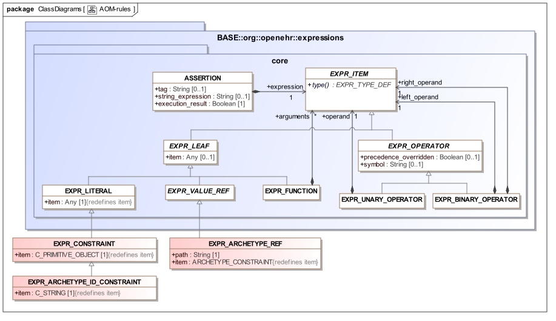
图22.规则包

### 5.2. 语义

原型断言是可以包含以下元素的表达式：

- 常数：

    - 原始值：包括日期/时间类型;

    - 约束操作数，即C\_PRIMITIVE\_OBJECT实例，用作匹配运算符的参数;

    - 原型id约束，即表示在时隙约束中使用的可能原型标识符的C\_STRING实例。

- 任何表达式运算符，即：

    - 算术运算符：+，*， - ，/，^（指数），％（模数除法）

    - 关系运算符：>，<，> =，<=，=，！=;

    - 布尔运算符：not，and，or，xor;

    - 应用于容器变量的量词：for\_all，exists;

- 功能。基本算术，三角函数等;

- 以下附加语义：

    - 引用数据中的原型值，由原型路径指定。

不允许openEHR表达式语言中描述的变量，赋值和外部查询。

### 5.3. 类描述

以下类增强了openEHR表达式语言规范中描述的核心模型。

#### 5.3.1. EXPR\_CONSTRAINT类

#### 5.3.3. EXPR\_ARCHETYPE\_REF类

## 6.术语包

### 6.1. 概述

所有本地术语以及原型的术语和术语绑定元素都表示在原型的术语部分中，其语义由archetype.terminology包定义，如下所示。

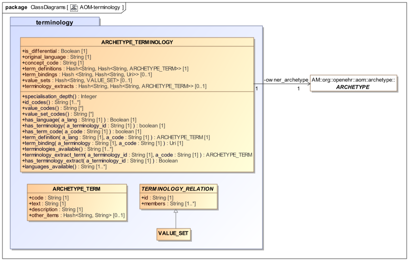
图23.术语包

原型术语由以下元素组成。

- term\_definitions：一个强制结构，包括定义为本地原型的术语定义列表，每个翻译语言的一个列表以及定义的原始语言。此表中的条目包括：

    - 部分或全部id代码。其中之一是形式为“id1”，“id1.1”，“id1.1.1”等的代码，表示原型作为一个整体的概念。此特定代码记录在concept\_code属性中，并用作原型定义中根节点上的id代码。并非所有id代码都需要在term\_definitions结构中 - 对于是单值属性的子节点，术语定义是可选的（通常不定义）。

    - 用于定义值术语和内联值集的at代码/所有at代码将出现在原型中的C\_TERMINOLOGY\_CODE约束对象内。所有at代码必须在term\_definitions中有定义。

    - 用于定义外部值集引用的ac代码。所有ac代码必须在term\_definitions中有定义。

- term\_bindings：由术语和绑定列表组成的可选结构，每个外部术语（即术语或本体“绑定到”）的一个列表。每个“绑定”是到目标的URI。对于id代码或at代码的绑定，目标将是单个项，并且对于ac代码，其将指定ref-set或值集。

- value\_sets：为本地定义的值集定义值集关系的可选结构。每个值集由ac码识别，并且具有一个或多个at代码作为成员。

- terminology\_extracts：包含来自外部术语（例如SNOMED CT，ICDx或任何本地术语）的提取的可选结构。这些提取物包括代码和优选术语量规，使得术语能够用于显示目的。此结构通常仅用于模板，从而允许在模板中本地捕获没有定义外部引用集或子集的小值集。

根据原型是差分形式还是平面形式，ARCHETYPE\_TERMINOLOGY类的实例包含分别在自己的原型中引入的术语，约束，绑定和术语提取，或者通过继承压缩原型谱系获得的所有代码和绑定。 ARCHETYPE\_TERMINOLOGY的典型实例结构如图所示。

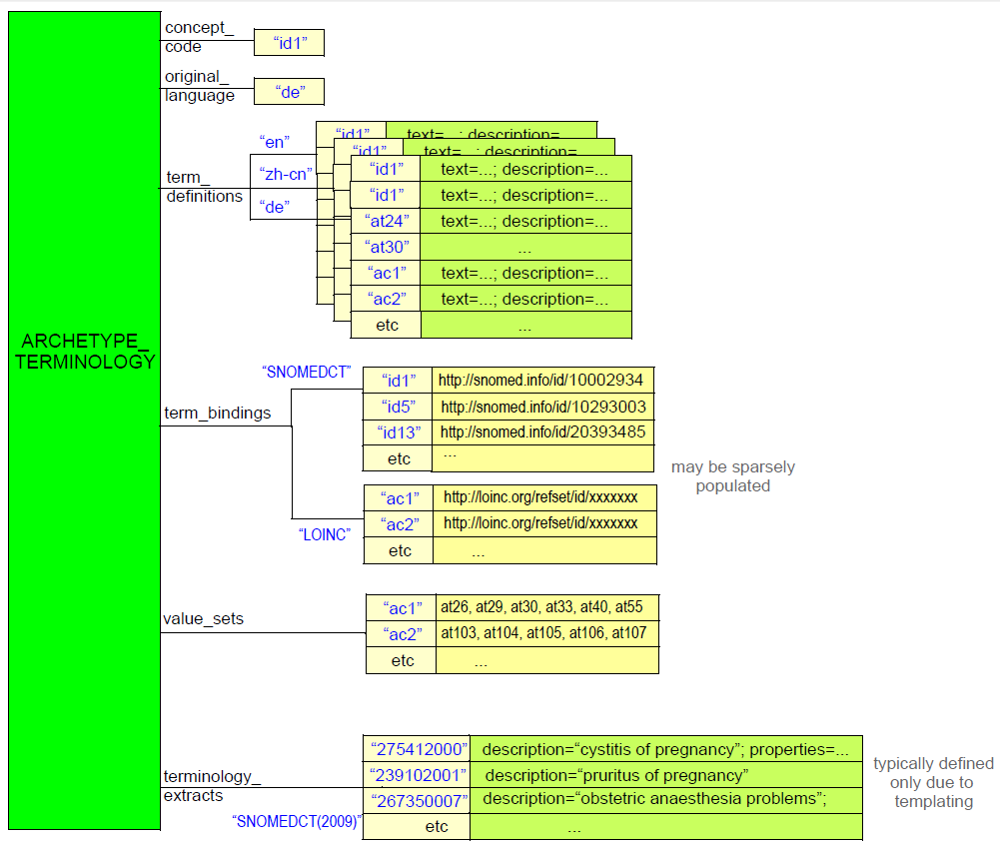
图24.术语实例结构

### 6.2. 语义

#### 6.2.1. 专业化深度

任何给定的原型发生在通过专业化相关的原型的谱系中的某一点处，其中深度由specialisation\_depth函数反映。不是另一个专门化的原型的specialisation_depth为0.在专门原型的术语中引入的术语和约束代码（即，在父原型的术语中不存在）是以严格的方式使用''定义的。 '' （期间）标记。例如，专业化深度2的原型将使用如下的术语定义代码：

- id0.0.1 - 在这个原型中引入的新术语，它不是任何父原型中任何先前术语的特化;

- id4.0.1 - 专用于顶级父级的id4术语的术语。需要介入.0来表示新词在深度2，而不是深度1;

- id25.1.1 - 专门化来自直接父的术语id25.1的术语，其本身专门化来自顶部父的术语id25。

代码的这种系统定义使得软件能够使用代码的结构来更快速和准确地推断关于术语定义向上和向下的专业化层次。另一方面，约束代码不遵循这些规则，而是存在于平坦的代码空间中。

### 6.3. 类描述

#### 6.3.1. ARCHETYPE\_TERMINOLOGY类
#### 6.3.2. TERMINOLOGY\_RELATION类
#### 6.3.3. VALUE\_SET类别
#### 6.3.4. ARCHETYPE\_TERM类
##### 6.3.4.1. 有效性规则

以下有效性规则适用于原型中的此类的实例：

- VTVSID：定义的值集ID。值集的标识代码必须在当前原型的术语定义中定义。

- VTVSMD：定义的值集成员。值集的成员代码必须在当前原型的扁平形式的术语定义中定义。

- VTVSUQ：价值集成员唯一。值集的成员代码在值集中必须是唯一的。

- VTSD专业化代码级别。原型术语中定义的术语或约束代码必须与原型（差异原型）或相同或较不专门的级别（平原型）具有相同的专业化级别。

- VTLC：语言一致性。语言一致：所有语言中都存在所有术语代码和约束代码。

- VTTBK：术语术语绑定密钥有效。每个术语绑定必须是定义的原型术语（'at-code'）或者在平面原型中有效的路径。

- VTCBK：术语约束绑定密钥有效。每个约束绑定必须是一个定义的原型约束代码（'ac-code'）。

## 7. 验证和转换语义

本节提供了一个基于ADL工作台引用编译器的验证，平展和差异的指南。在Workbench中处理给定原型A的顺序如下：

- 评价A的专业谱系

    - 从顶部按顺序处理每个父级

- 评估A的供应商原型（由use\_archetype语句相关的那些）

    - 过程供应商

- 解析A

- AOM阶段1验证 - 独立验证

- 如果通过，并且A是专门的：

    - AOM阶段2验证 - 针对平面父代验证

    - 扁平A对平的父母

    - AOM阶段3验证 - 对平面形式的验证

### 7.1. 验证

验证最好以多遍的方式实现，更多的基本类型的错误首先被检查。 ADL Workbench实现了三个验证阶段，如下所述。

#### 7.1.1. 阶段1 - 基本完整性

以下验证可以在原型上执行，如果它是专门的，则大多不参考其父类。

##### 7.1.1.1. 基本检查

- 检查根RM类型与标识符（VARDT）中提到的RM类型的匹配;

- 专家级（VARCN）的有效根ID代码;

- 任何缺少的强制性部分，例如术语段（STCNT）;

- 检查专业化深度是否大于父（VACSD）的专业化深度;

##### 7.1.1.2. AUTHORED\_ARCHETYPE元数据检查

- 检查原型主要部分中的原始语言在术语部分（VOLT）中可用;

- 检查adl\_version和rm\_release版本id格式（VARAV，VARRV）;

- 检查翻译部分中定义的语言是原型术语（VOTM）;

##### 7.1.1.3. 定义结构验证

- 检查仅在专门原型（VDIFV）中找到的差分路径;

- 检查专用原型中的差分路径是否存在于平面父（VDIFP）中;

##### 7.1.1.4。基本术语验证

- 验证术语代码格式和特定​​深度（VATCV，VTSD）;

- 验证术语语言 - 检查所有语言（VTLC）中的所有at-code和ac代码;

- 验证术语绑定 - 检查绑定中提及的所有术语和路径都存在术语和定义（VTTBK，VTCBK，VETDF）;

- 验证术语value\_sets - 检查术语值集定义中的每个代码都是术语，没有重复（VTVSID，VTVSMD，VTVSUQ）;

##### 7.1.1.5. 各种结构验证

- 检查插槽定义有效性（VDSEV）;

- 检查C\ARCHETYPE\_ROOT有效性（VARXRA，VARXTV）;

##### 7.1.1.6. 代码验证

- 检查定义中提到的所有代码是否在术语（VTSD，VATID）中定义;

- 验证C\_TERMINOLOGY\_CODE对象（VATCD，VATDF，VACDF，VATDA）;

##### 7.1.1.7. 验证注释

- 对于每种语言，请确保注释路径有效（VRANP）;

- 确保注释是彼此的正确翻译。

#### 7.1.2. 第二阶段 - 针对平面家长的专业原型验证

##### 7.1.2.1. 针对参考模型进行验证

以下检查需要可用的参考模型的计算表示。

- 检查RM（VCORM，VCARM）中是否存在类型和属性名称;

- 检查枚举类型约束使用有效的文字值（VCORMENV，VCORMENU，VCORMEN）;

- 验证任何允许的类型替换（VCORMT）;

- 检查C\_ATTRIBUTE中的存在对于RM（VCAEX）是否有效;

- 检查C\_ATTRIBUTE中的基数是否对RM（VCACA）有效;

- 检查原型和RM（VCAM）中C\_ATTRIBUTE的性能不匹配。

##### 7.1.2.2. 验证特殊定义

以下检查针对其平面父代的专门定义进行。

- 检查节点差分路径是否可以并且确实存在于父节点（VSONPT，VSONIN）中;

- 检查SIBLING\_ORDER在平面父（VSSM）中是否有效;

- 在C\_ATTRIBUTE节点

    - 检查存在与平家长的一致性（VSANCE）;

    - 检查基数与平面父（VSANCC）的一致性;

- 上C\_ARCHETYPE\_ROOT：

    - 检查archetype\_ref原型ID与父槽约束（VARXS）匹配;

    - 检查archetype\_ref原型ID是否存在于当前原型库（VARXR）中;

    - 填充id专业化深度错误（VARXID）;

- 确保子代中的ARCHETYPE\_SLOT只重新定义父代（VDSSID）中的ARCHETYPE\_SLOT;

- 对于父代中的节点C\_COMPLEX\_OBJECT\_PROXY，请检查代理路径是否存在（VSUNT）;

- 否则，子节点和父节点的AOM类型必须相同（VSONT）。

对于传递节点，请检查：

- 评估c\_conforms\_to（）函数：

    - RM型不符合（VSONCT）;

    - 发生不一致（VSONCO）;

    - 节点ID不一致值失配（VSONI）;

    - 无效叶对象值重定义（VPOV，VUNK）;

    - 对父节点（VTPNC，VTPIN）的元组验证。

##### 7.1.2.3. 验证规则

- 确保规则中提到的RM类型和路径对平面父原型和RM（VRRLPRM，VRRLPAR）有效。

#### 7.1.3. 阶段3 - 平面形式的验证

这些验证在成功生成当前原型的平面形式之后执行。

- 确保C\_COMPLEX\_OBJECT\_PROXY路径实际存在于当前平面形式（VUNP）中;

- 确保对象节点出现对于包围基数（VACMCO）有效。

### 7.2. 平展

扁平化在概念上是一个简单的操作 - 将差分子原型叠加到平面父类上。具体来说，它是一个有点复杂的操作，因为它必须考虑ADL和AOM允许的许多细节，包括：

- 差分路径，包括包含覆盖的id码的路径;

- 子节点可以在特定情况下覆盖父级中不同AOM类型的节点;

- 同胞排序标记;

- 覆盖与克隆：其中对于单个父复合结构存在多于一个子专用化节点，则在每个覆盖之前克隆父结构;

- 删除（存在匹配{0}，出现匹配{0}）。

- 代理引用目标如果子原型覆盖它们，则内联展开。

ADL Workbench中使用的算法为AOM原型和模板的实现适当的扁平化提供了合理的模板。

### 7.3. 差异

Diffing是压平的相反，主要用于支持编辑操作。原型的视觉编辑的基础是父母的平面形式，用户被允许进行与平面父母符合的修改。 Diffing操作用于从视觉编辑的最终状态提取所得到的差分形式原型。

ADL Workbench中使用的算法为实现AOM原型的差异提供了合理的模板。

8.序列化模型

本节介绍AOM的调整版本，用于将原型序列化为非ADL格式。这个模型中的类与AOM类几乎是1：1，但是名称前缀为P\_，用于“persistent”。不使用此模型，原型可以序列化为“对象转储”格式，例如ODIN，JSON，YAML，XML等，但输出将是庞大的。这个模型的效果是减小输出的大小，潜在地减少两倍或更多倍。人类的可读性也大大提高，这是越来越重要与直接使用XML和JSON的程序员。

尺寸减小和可读性主要通过将重复结构项映射到更加可读，但仍然可机器处理的较短字符串形式来实现。

“P\_”模型如下所示分为两部分。

由P\_类实现的AOM的转换如下：

- 所有的多重性，包括存在，基数和出现被转换为标准的UML字符串形式，如'0..1'，'0 .. *'等，而不是直接机器中将发生的8行左右的输出序列化;

- 代码从结构化形式（TERMINOLOGY\_CODE类）转换为字符串形式;

- UID标识符从结构化形式转换为字符串形式。

图25.序列化AOM（上）
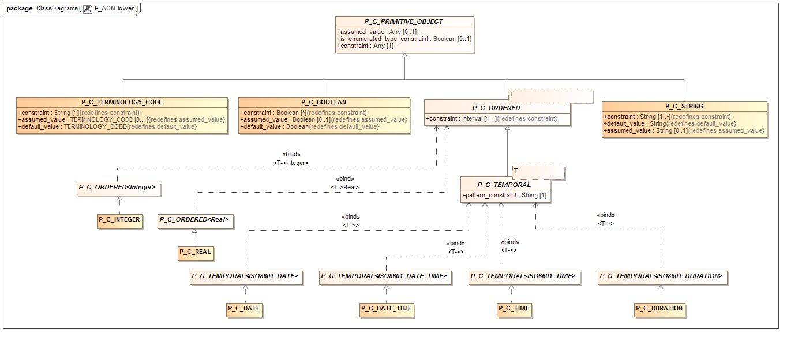
图26.序列化AOM（下）

## 9. 模板

在原型形式主义中，使用模板来聚集和细化原型，以产生对应于特定数据集的结构。模板因此提供了一种使用原型用于特定目的的方法，而原型包含可能的数据项，未链接到特定目的。有关模板语义的详细描述，请参阅ADL2规范，模板部分。

模板通过原型包中显示的TEMPLATE和TEMPLATE\_OVERLAY类正式定义为专门的原型。这意味着模板的所有形式特征由openEHR原型对象模型（AOM）和原型定义语言（ADL）规范应用于模板定义。这包括元数据（继承自AUTHORED\_RESOURCE类），专业化语义（模板可以专门用于其他模板），术语部分（允许多语言本地术语定义和外部术语绑定）以及规则和注释部分。

由于模板是一个专门的原型，它不能改变它专门化的原型的语义，因为它遵守与任何其他专门原型相同的规则。因此，由于使用模板而创建的所有数据被保证符合所引用的原型以及基础参考模型。

然而，AOM和ADL在模板中的使用模式与典型的原型略有不同。首先，以下功能通常在模板中使用，但通常不在原型中：

- 槽填充 - 通过专门化实现，如ADL规范中所述;

- 指定{0..0}约束以从引用的原型中删除不需要的元素;

- 指定{1..1}约束以从引用的原型授权元素;

- 设置默认值;

- 添加术语绑定到特定术语参考集。

其次，模板中的专门化通常仅仅是在平面父节点中定义的现有节点，即没有添加新节点。如果在模板上下文中需要新的数据节点，则应在创建适当的专用原型之前定义它们，然后在最终模板中使用。

这些变体不是ADL / AOM形式主义正式需要的，而是旨在通过工具，通过领先的ADL关键字（ADL文件）或序列化类型标记（其他序列化类型）识别原型和模板来实现。这种方法简化了工具构建器的生命，因为单个标准化编译器将始终编译任何原型或模板。

因为模板通常指由于槽填充而导致的多个原型（即，根原型加上作为槽填充器提及的组件原型），并且通常还定义对根和组件原型的进一步约束，所引用的实体最终为三类型：

- 一个公布的原型，按原样使用;

- 已发布的模板，按原样使用;

- 一个私人模板 - 本地模板覆盖。

其中前两个是显式标识和发布的伪像，通常可以作为任何可用的序列化语法中的文件获取。模板覆盖有点类似于一些编程语言中可用的“私有”或匿名类定义，并且可作为与根模板相关联的单独文件或在模板源文件内获得。

### 9.1. 一个例子

为了更好地解释模板伪影结构，下面描述示例。假设所需的逻辑结构如下所示。这显示了特定RM类型的三种原型，它们应该通过在特定路径中插槽填充来链接在一起，以形成最终模板。模板还通过覆盖添加了进一步的约束。

- org.openehr :: openEHR-EHR-COMPOSITION.encounter\_report.v1 / content [id5]

    - org.openehr :: openEHR-EHR-SECTION.vital\_signs\_headings.v1 / items - - [id2]

        - org.openehr :: openEHR-EHR-EVALUATION.problem\_description.v1

实现这一点所需的实际模板结构如下所示。原型org.openehr :: openEHR-EHR-COMPOSITION.encounter\_report.v1显示在右上角。这是模板（即专门）由模板uk.nhs.clinical :: openEHR-EHR-COMPOSITION.t\_encounter\_report.v1在左上角。模板通过专门化插槽来执行填充根原型中的id5插槽的作业。专用版本添加一个填充对象（用C\_ARCHETYPE\_ROOT实例指定），并且覆盖原始ARCHETYPE\_SLOT实例以通过进一步模板或在运行时关闭插槽以进行任何进一步填充。

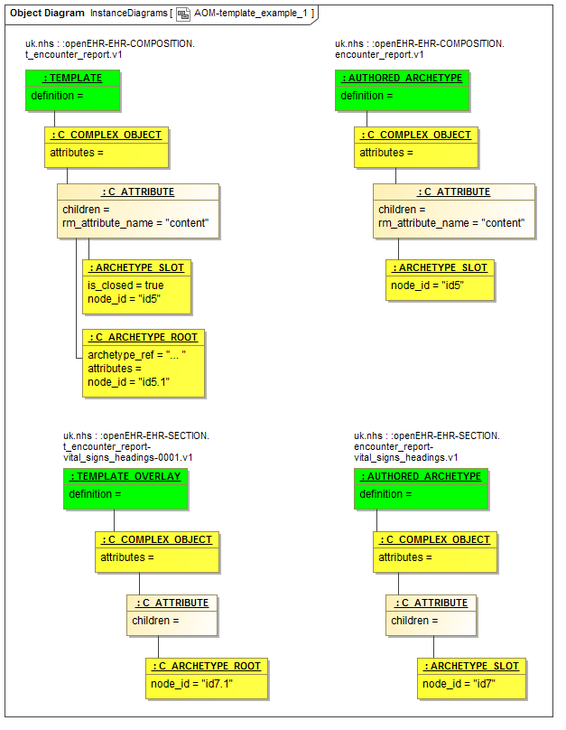
图27.模板源结构示例

填充对象在其archetype\_ref属性中指定用于填充插槽的工件（为了简洁，在图中显示为省略号）。这里不是简单的原型org.openehr :: openEHR-EHR-SECTION.vital\_signs\_headings.v1，而是这个原型的一种特殊形式，定义为本地模板覆盖，其标识符为uk.nhs.clinical :: openEHR-EHR -SECTION.t\_encounter\_report-vital\_signs\_headings-0001.v1。

在此SECTION模板覆盖内发生相同类型的重定义。来自原始原型（org.openehr :: openEHR-EHR-SECTION.vital\_signs\_headings.v1）的id7槽节点由模板覆盖中的C\_ARCHETYPE\_ROOT节点重新定义。覆盖通常会添加其自身的其他约束 - 通常删除不需要的项目，并强制从专业化父原型（这里未显示）中的其他项目。

源模板因此由两个假象构成，即：

- '模板'，即模板根;

- 内部“模板覆盖”组件。

这些在平展操作中连接在一起作为操作模板生成的一部分;此时，模板覆盖（左下）的C\_COMPLEX\_OBJECT根节点覆盖在模板的id5.1 C\_ARCHETYPE\_ROOT节点上，形成单个大型原型结构。

模板的组件不一定是内部的。在模板环境中，较低级别的参考模型类可以以其自己的权利来模板化，并且这样的模板简单地在正在构建的新模板中重用。在这种情况下，外部模板可以包含其自己的内部模板组件和其他模板。

### 9.2. 模板标识符

使用正常的ADL多轴标识符和GUID来标识模板，就像原型一样。然而，为了使工具和人类更容易看到，对于标识符的概念部分建议如下的一些简单约定。

- 模板：使用基于前缀t\_的原型的概念标识符;

- template\_overlay：使用由以下级联组成的概念标识符：

    - 根模板标识符（包括t\_）;

    - 覆盖的专用化父原型的概念标识符;

    - 最终\_N，其中“N”是整数。

以下是示例。

	uk.nhs.clinical::openEHR-EHR-COMPOSITION.t_encounter_report.v1.0.0  -- root template
	
	uk.nhs.clinical::openEHR-EHR-EVALUATION.t_encounter_report-problem_description-1.v1.0.0   -- overlay
	uk.nhs.clinical::openEHR-EHR-EVALUATION.t_encounter_report-medications-2.v1.0.0           -- overlay
	uk.nhs.clinical::openEHR-EHR-EVALUATION.t_encounter_report-care_plan-3.v1.0.0             -- overlay
	
这种方法定义了一个简短的概念标识符，它遵守正式规则，概念标识符在命名空间和RM类型中必须是唯一的，是人类可读的，最重要的是可以工具生成。
参考模型适应

到目前为止，ADL被提出作为一种抽象的形式语言，定义基于参考模型（RM）的法律信息结构。在现实世界的应用中，我们需要考虑参考模型来自何处，以及基于不同但相关的RM协调或以其他方式整合原型的问题。

大多数域中的常见问题之一是存在竞争参考模型，通常由诸如ISO，CEN，ASTM和/或诸如W3C和OASIS的其他开放标准机构的标准体定义。对于给定的主题，例如“癌症研究试验”或“电子健康记录”，通常可以有多个信息模型可用作原型设计的基础。由于政治压力，国家要求或偏好以及其他非技术因素的多样性，很可能原型将在基于多个竞争参考模型的领域内创作，这些竞争参考模型是合理相似的，而不会容易机器互换。

由于原型通常由领域专家创作，它们表示的实体往往来自同构模型空间，参考模型是原型作者甚至不可见的技术细节。然而，由于上述因素，不同地点或辖区的作者可能别无选择，只能对相同的实体建模，例如基于两个或多个不同参考模型的“完全血细胞计数”。

这产生了竞争的原型库的潜在问题，试图以稍微不同但不兼容的方式来建模相同的信息实体。这倾向于不必要地将域模型的组分成不同的社区，而事实上它们正在对相同的事物建模。

为了减轻由这种情况引起的一些问题，可以应用在AOM本身以外的以下描述的一些措施，以使得被处理的原型和RM能够被更均匀地处理。

### 10.1. AOM配置文件配置

这些适配可以在作为下面示出的类AOM\_PROFILE的实例的配置对象中形式化。这只是可以表示这样的信息的一种方式，并且可以使用替代方案。

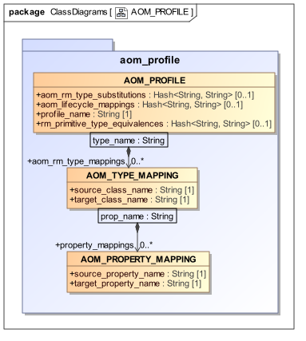
图28. aom\_profile包

#### 10.1.1. 类定义
#### 10.1.2. AOM\_PROFILE类
#### 10.1.3. AOM\_TYPE\_MAPPING类
#### 10.1.4. AOM\_PROPERTY\_MAPPING类
#### 10.1.5. 配置文件

上述类的实例可以在ODIN格式文件中表示，作为定义工具配置的方便方式。用于openEHR ADL Workbench工具的此类文件的示例可以在该工具的Github项目中找到。

### 10.2. 将RM实体映射到AOM实体

可以进行的一个调整是指示RM实体和AOM内置类型之间的等价。这可以通过健康中的常见情况来说明，其中多个RM具有“编码术语”概念的具体不同的模型。从语义上讲，这些都是相同的，并且对应于AOM内置类型TERMINOLOGY\_CODE。然而，没有什么可以在可以指示这种关系的ADL原型中陈述，结果是ADL工具不能推断某种类型，例如， openEHR的CODE\_PHRASE或ISO 13606的CODED\_TEXT等同于AOM中的TERMINOLOGY\_CODE类型。

通过使用AOM\_PROFILE类型的aom\_rm\_type\_mappings属性来实现映射，这使得能够描述复杂类和属性之间的等价。

以下示例显示两个AOM配置文件的部分，说明了“编码文本”到AOM TERMINOLOGY\_CODE类的RM类型的两种不同映射。以下摘录来自ADL Workbench的openEHR AOM配置文件文件。

	 --
	 -- mappings from AOM built-in types used for openEHR RM types
	 --
	aom_rm_type_mappings = <
		["TERMINOLOGY_CODE"] = <
			source_class_name = <"TERMINOLOGY_CODE">
			target_class_name = <"CODE_PHRASE">
			property_mappings = <
				["terminology_id"] = <
					source_property_name = <"terminology_id">
					target_property_name = <"terminology_id">
				>
				["code_string"] = <
					source_property_name = <"code_string">
					target_property_name = <"code_string">
				>
			>
		>
	>

以下摘录来自ADL Workbench的CIMI AOM配置文件文件。 这定义了从CIMI RM类CODED\_TEXT到AOM类TERMINOLOGY\_CODE的映射。

	 --
	 -- mappings from AOM built-in types used for CIMI RM types
	 --
	
	aom_rm_type_mappings = <
		["TERMINOLOGY_CODE"] = <
			source_class_name = <"TERMINOLOGY_CODE">
			target_class_name = <"CODED_TEXT">
			property_mappings = <
				["terminology_id"] = <
					source_property_name = <"terminology_id">
					target_property_name = <"terminology_id">
				>
				["code_string"] = <
					source_property_name = <"code_string">
					target_property_name = <"code">
				>
			>
		>

创建这些映射的价值是它们通知工具，对openEHR原型中的CODE\_PHRASE类型和CIMI原型中的CODED\_TEXT的约束应被理解为等同于原始AOM类型TERMINOLOGY\_CODE上的约束。这可以由工具检测，并且例如利用特定可视化来计算。如果没有此配置，原型约束仍然正确，但ADL工具不会将它们视为与任何其他RM复杂类型不同。

使用类和属性映射可以实现更复杂的原型比较和潜在的甚至协调，以及更智能的数据比较。

### 10.3. RM原始类型等价

AOM的原语约束器类型，即C\_PRIMITIVE\_OBJECT的后代对应于一个小的抽象原语类型集合，如原语类型表所示。 RM抽象原语类型的隐含列表是布尔值，整数，实数，日期，日期时间，时间，持续时间，字符串和术语代码。然而，实际参考模型可以基于典型的编程语言，因此包括类似Double，Integer64以及甚至String，Integer等的许多变体，诸如String\_8，String32等等。

为了防止AOM原语类型的类似的爆炸，AOM简档使用AOM\_PROFILE的rm\_primitive\_type\_equivalences属性实现这些后续类型（通常对于每个RM之间不同）之间的等价并且声明抽象集合。示例如下所示。

	rm_primitive_type_equivalences = <
		["Double"] = <"Real">                      -- treat RM type Double as if it where Real
		["Integer64"] = <"Integer">                -- treat RM type Integer64 as if it were Integer
		["ISO8601_DATE"] = <"Date">                -- treat RM type ISO8601_Date as if it were Date
		["ISO8601_DATE_TIME"] = <"Date_time">
		["ISO8601_TIME"] = <"Time">
		["ISO8601_DURATION"] = <"Duration">
	>
	
以下CADL片段提供了一个示例。

    ELEMENT[id5] occurrences matches {0..1} matches {	-- Systolic
        value matches {
            DV_QUANTITY[id1054] matches {
                property matches {[at1055]}
                magnitude matches {|0.0..<1000.0|}  -- **** parses as AOM C_REAL, but is Double in RM
                precision matches {0}
                units matches {"mm[Hg]"}
            }
        }
    }

### 10.4. RM类型替换

偶尔在RM类型和我们想要使用的AOM类型之间存在类型不匹配，或者已经在原型中使用。 例如，RM可能在某个类中具有表示ISO 8601日期的String属性。 可以使用C\_DATE而不是C\_STRING的AOM约束来获得更有意义的约束。

另一个用途是原型写入了一个整数constrant（即C\_INTEGER），但是RM在对应的位置有一个Real或Double类型。 这也可以适应。

可以通过使用AOM\_PROFILE类中定义的aom\_type\_substitutions配置表来更正这些差异。 以下是使用此设施为openEHR原型启用原始类型匹配的示例。

	 --
	 -- allowed substitutions from AOM built-in primitive types to openEHR RM types
	 --
	
	aom_rm_type_substitutions = <
		["ISO8601_DATE"] = <"String">
		["ISO8601_DATE_TIME"] = <"String">
		["ISO8601_TIME"] = <"String">
		["ISO8601_DURATION"] = <"String">
		["INTEGER"] = <"Double">
	>
	
这些映射的效果是，解析为左侧类型（ISO8601\_DATE等）的原型中的文字值将被静默映射到右侧RM类型（String等）。 以下示例显示映射到RM String值的本机ISO持续时间字段。

    INTERVAL_EVENT[id1043] occurrences matches {0..1} matches {	-- 24 hour average
        width matches {
            DV_DURATION[id1064] matches {
                value matches {PT24H}  -- **** parses as AOM ISO8601_DURATION, but is String in RM
            }
        }
    }

### 10.5. AOM生命周期状态映射

另一种有用的映射调整，可以帮助工具以更均匀的方式处理原型是与AOM生命周期状态，在openEHR原型标识规范中标准化。 这些状态表示整个原型在其创作生命周期中的状态。 然而，历史上没有标准名称，结果是各种原型工具实现它们自己的本地生命周期状态名称。 为了进行调整，可以使用AOM\_PROFILE类中的aom\_lifecycle\_mappings属性。 这些映射具有将解析的原型的RESOURCE\_DESCRIPTION实例的lifecycle\_state属性的当前值替换为openEHR标准状态名的效果。 下面是具有本地生命周期状态名称的原型的描述部分的典型示例。

	description
	    original_author = <
	        ["name"] = <"Dr J Joyce">
	        ["organisation"] = <"NT Health Service">
	        ["date"] = <2003-08-03>
	    >
	    lifecycle_state =  <"AuthorDraft"> -- **** should be 'unmanaged'
	    resource_package_uri =  <".....">
	
以下示例显示了海关生命周期状态名称与openEHR标准状态名称的典型映射。

	 -- allowed substitutions from source RM lifecycle states to AOM lifecycle states
	 -- States on the value side (right hand side) must be the AOM states:
	 --
	 --	"unmanaged"
	 --	"in_development"
	 --		"draft"
	 --		"in_review"
	 --		"suspended"
	 --	"release_candidate"
	 --	"published"
	 --	"deprecated"
	 --		"obsolete"
	 --		"superseded"
	
	 --
	
	aom_lifecycle_mappings = <
		["AuthorDraft"] = <"unmanaged">
		["Draft"] = <"in_development">
		["TeamReview"] = <"in_development">
		["Team Review"] = <"in_development">
		["ReviewSuspended"] = <"in_development">
		["Review Suspended"] = <"in_development">
		["Reassess"] = <"published">
		["Published"] = <"published">
		["Rejected"] = <"rejected">
	>

通常这种变化应写入原型，以便升级到标准形式。工具应该提供这种可能性，包括在批量/批量模式。

## 参考文献

### 出版物

<ol><li>
    [Anderson_1996]罗斯·安德森。临床信息系统的安全性。可在http://www.cl.cam.ac.uk/users/rja14/policy11/policy11.html获得。
</li><li>
    [Baretto_2005] Barretto S A.设计基于指南的工作流程 - 综合电子健康记录。南澳大学博士论文。可在http://www.cis.unisa.edu.au/~cissab/Barretto_PhD_Thesis_Revised_FINAL.pdf。
</li><li>
    [Beale_2000] Beale T. Archetypes：Constraint-based Domain Models for Future-proof Information Systems。 2000.可查阅http://www.openehr.org/files/resources/publications/archetypes/archetypes_beale_web_2000.pdf。
</li><li>
    [Beale_2002] Beale T.Archetypes：Constraint-based Domain Models for Future-proof Information Systems。第十一届OOPSLA行为语义研讨会：为客户服务（西雅图，美国华盛顿，2002年11月4日）。由Kenneth Baclawski和Haim Kilov编辑。 Northeastern University，Boston，2002，pp。16-32。请访问http://www.openehr.org/files/resources/publications/archetypes/archetypes_beale_oopsla_2002.pdf。
</li><li>
    [Beale_Heard_2007] Beale T，Heard S. An Ontology-based Model of Clinical Information。 2007.pp760-764 Proceedings MedInfo 2007，K.Kuhn et al。 （Eds），IOS Publishing 2007.见http://www.openehr.org/publications/health_ict/MedInfo2007-BealeHeard.pdf。
</li><li>
    [Booch_1994] Booch G.面向对象的分析和设计与应用。第2版​​。本杰明/ Cummings 1994。
</li><li>
    [Browne_2005] Browne E D.工作流建模协调的健康护理提供者护理计划。南澳大学博士论文。请访问http://www.openehr.org/publications/workflow/t_browne_thesis_abstract.htm。
</li><li>
    [Cimino_1997] Cimino J J. Desiderata for Controlled Medical vocabularies in the Twenty-F​​irst Century。 IMIA WG6 Conference，Jacksonville，Florida，Jan 19-22,1997。
</li><li>
    [埃菲尔]迈耶B.埃菲尔的语言（第二版）。 Prentice Hall，1992。
</li><li>
    [Elstein_1987] Elstein AS，Shulman LS，Sprafka SA。医学问题解决：临床推理的分析。剑桥，MA：哈佛大学出版社1987。
</li><li>
    [Elstein_Schwarz_2002] Elstein AS，Schwarz A.临床诊断的证据基础：临床问题解决和诊断决策：对认知文献的选择性审查。 BMJ 2002; 324; 729-732。
</li><li>
    [Fowler_1997] Fowler M.分析模式：可重用对象模型。 Addison Wesley 1997
</li><li>
    [Fowler_Scott_2000] Fowler M，Scott K.UML Distilled（2nd Ed。）。 Addison Wesley Longman 2000。
</li><li>
    [Gray_reuter_1993] Gray J，Reuter A. Transaction Processing Concepts and Techniques。 Morgan Kaufmann 1993。
</li><li>
    [Hein_2002] Hein J L.Discrete Structures，Logic and Computability（2nd Ed）。琼斯和巴特利特2002。
</li><li>
    [Hnìtynka_2004]HnìtynkaP，PlášilF. MOF的分布式版本控制模型。 Proceedings of WISICT 2004，Cancun，Mexico，A volume in the ACM international conference proceedings series，published by Computer Science Press，Trinity College Dublin Ireland，2004。
</li><li>
    [Ingram_1995] Ingram D.欧洲良好健康记录项目。 Laires，Laderia Christensen，Eds。健康在新的通信时代。阿姆斯特丹：IOS出版社; 1995; pp。66-74。
</li><li>
    [Kifer_Lausen_Wu_1995] Kifer M，Lausen G，Wu J. Logical Foundations of Object-Oriented and FrameBased Languages。 JACM 1995年5月。见见ftp://ftp.cs.sunysb.edu/pub/TechReports/kifer/flogic.pdf。
</li><li>
    [Kilov_1994] Kilov H，Ross J.信息建模 - 面向对象的方法。 Prentice Hall 1994。
</li><li>
    [Maier_2000] Maier M.系统建模原则。技术报告，阿拉巴马大学在亨茨维尔。 2000.可在http://www.infoed.com/Open/PAPERS/systems.htm获得
</li><li>
    [Martin] Martin P. UML，OWL，KIF和WebKB-2语言之间的翻译（For-Taxonomy，Frame-CG，Formalized English）。 May / June 2003. Available at http://www.webkb.org/doc/model/comparisons.html as at Aug 2004。
</li><li>
    [Meyer_OOSC2] Meyer B. Object-oriented Software Construction，2nd Ed。 Prentice Hall 1997
</li><li>
    [Müller_2003]MüllerR. Event-oriented Dnamic Adaptation of Workflows：Model，Architecture，and Implementation。莱比锡大学博士论文。请访问http://www.openehr.org/publications/workflow/t_mueller_thesis_abstract.htm。
</li><li>
    [Object_Z] Smith G.对象Z规范语言。 Kluwer Academic Publishers 2000.见http://www.itee.uq.edu.au/~smith/objectz.html。
</li><li>
    [GLIF] Lucila Ohno-Machado，John H.Gennari，Shawn N. Murphy，Nilesh L.Jain，Samson W.Tu，Diane E.Oliver，Edward Pattison-Gordon，Robert A.Greenes，Edward H. Shortliffe，and G 。Octo Barnett。 GuideLine交换格式 - 表示指南的模型。 J Am Med Inform Assoc。 1998 Jul-Aug; 5（4）：357-372。
</li><li>
	[Rector_1994] Rector A L，Nowlan W A，Kay S. Foundations for an Electronic Medical Record。 The IMIA Yearbook of Medical Informatics 1992（Eds.van Bemmel J，McRay A）。 Stuttgart Schattauer 1994。
</li><li>
    [Rector_1999] Rector A L.临床术语：为什么这么难？方法。 1999 Dec; 38（4-5）：239-52。可在http://www.cs.man.ac.uk/~rector/papers/Why-is-terminology-hard-single-r2.pdf。
</li><li>
    [Richards_1998] Richards E G. Mapping Time - The Calendar and its History。牛津大学出版社1998。
</li><li>
    [Sowa_2000] Sowa J F.知识表示：逻辑，哲学和计算基础。 2000，Brooks / Cole，California。
</li><li>
    [Sottile_1999] Sottile P.A.，Ferrara F.M.，Grimson W.，Kalra D.，and Scherrer J.R.The holistic healthcare information system。欧洲电子健康记录。 1999年11月; 259-266。
</li><li>
    [Van_de_Velde_Degoulet_2003] Van de Velde R，Degoulet P. Clinical Information Systems：A Component-Based Approach。 2003. Springer-Verlag New York。
</li><li>
    [Weed_1969] Weed LL。医疗记录，医疗教育和病人护理。 6 ed。芝加哥：年鉴医疗出版商公司1969年。
</li></ol>

### 资源

#### 一般

1.  [cov_contra]维基百科。协方差和逆变。请参阅https://en.wikipedia.org/wiki/Covariance_and_contravariance_(computer_science）。

#### 电子卫生标准

<ol><li>
    [Corbamed_PIDS]对象管理组。人身份识别服务。 1999年3月。见http://www.omg.org/spec/PIDS/。
</li><li>
    [Corbamed_LQS]对象管理组。词典查询服务。 March 1999. http://www.omg.org/spec/LQS/。
</li><li>
    [hl7_cda] HL7国际。 HL7版本临床文档架构（CDA）。可在http://www.hl7.org.uk/version3group/cda.asp获得。
</li><li>
    [HL7v3_ballot2] HL7国际。 HL7版本3第二选票规格。可在http://www.hl7.org获得。
</li><li>
    [HL7v3_data_types] Schadow G，Biron P. HL7版本3可交付：版本3数据类型。 （2002年第二版投票）。
</li><li>
    [hl7_v3_rim] HL7国际。 HL7 v3 RIM。见http://www.hl7.org。
</li><li>
    [hl7_arden] HL7国际。 HL7 Arden语法。见http://www.hl7.org/Special/committees/Arden/index.cfm。
</li><li>
    [hl7_gello] HL7国际。 GELLO决策支持语言。 http://www.hl7.org/implement/standards/product_brief.cfm?product_id=5。
</li><li>
    [IHTSDO_URIs] IHTSDO。 SNOMED CT URI标准。 http://ihtsdo.org/fileadmin/user_upload/doc/download/doc_UriStandard_Current-en-US_INT_20140527.pdf?ok。
</li><li>
    [NLM_UML_list]国家医学图书馆。 UMLS术语表。 http://www.nlm.nih.gov/research/umls/metaa1.html。
</li><li>
    [ISO_13606-1] ISO 13606-1 - 电子医疗记录通信 - 第1部分：扩展架构。 CEN TC251健康信息技术委员会。可在http://www.iso.org/iso/catalogue_detail.htm?csnumber=40784。
</li><li>
    [ISO_13606-2] ISO 13606-2 - 电子医疗记录通信 - 第2部分：域名术语列表。 CEN TC251健康信息技术委员会。可在http://www.iso.org/iso/iso_catalogue/catalogue_tc/catalogue_detail.htm?csnumber=50119。
</li><li>
    [ISO_13606-3] ISO 13606-3 - 电子医疗记录通信 - 第3部分：分发规则。 CEN TC251健康信息技术委员会。
</li><li>
    [ISO_13606-4] ISO 13606-4 - 电子医疗记录通信标准第4部分：信息交换的信息。 CEN TC251健康信息技术委员会。
</li><li>
    [ISO_18308] Schloeffel P.（编辑）。电子健康记录参考架构的要求。 （ISO TC 215 / SC N; ISO / WD 18308）。国际标准组织，澳大利亚，2002年。
</li><li>
    [ISO_20514] ISO。综合护理EHR。见http://www.iso.org/iso/iso_catalogue/catalogue_tc/catalogue_detail.htm?csnumber=39525。
</li></ol>

#### 电子卫生项目

<ol><li>
    [EHCR_supA_14] Dixon R，Grubb P A，Lloyd D，and Kalra D. Consolidated List of Requirements。 EHCR支持行动交付1.4。欧洲委员会DGXIII，布鲁塞尔; 2001年5月59pp可从http://www.chime.ucl.ac.uk/HealthI/EHCR-SupA/del1-4v1_3.PDF获得。
</li><li>
    [EHCR_supA_35] Dixon R，Grubb P，Lloyd D. EHCR支持行动交付3.5：“对CEN未来工作的最终建议”。 2000年10月。见http://www.chime.ucl.ac.uk/HealthI/EHCRSupA/documents.htm。
</li><li>
    [EHCR_supA_24] Dixon R，Grubb P，Lloyd D. EHCR支持行动2.4“CEN EHCRA解释和实施指南”。 2000年10月。见http://www.chime.ucl.ac.uk/HealthI/EHCR-SupA/documents.htm。
</li><li>
    [EHCR_supA_31_32] Lloyd D，et al。 EHCR支持行动交付3.1和3.2“CEN的中期报告”。 July 1998. Available at http://www.chime.ucl.ac.uk/HealthI/EHCR-SupA/documents.htm。
</li><li>
    [GEHR_del_4]可交付成果4：GEHR临床综合性要求。 GEHR项目，1992年，可查阅http://www.openehr.org/files/resources/related_projects/gehr/gehr_deliverable-4.pdf。
</li><li>
    [GEHR_del_7]可交付成果7：临床功能规范。 GEHR项目1993。
</li><li>
    [GEHR_del_8]可交付成果8：GEHR架构和系统的伦理和法律要求。 GEHR项目1994.可查阅http://www.openehr.org/files/resources/related_projects/gehr/gehr_deliverable-8.pdf。
</li><li>
    [GEHR_del_19_20_24]交付成果19,20,24：GEHR架构。 GEHR项目30/6/1995。请访问http://www.openehr.org/files/resources/related_projects/gehr/gehr_deliverable-19_20_24.pdf。
</li><li>
    [GeHR_AUS] Heard S，Beale T.The Good Electronic Health Record（GeHR）（Australia）。请参阅http://www.openehr.org/resources/related_projects#gehraus。
</li><li>
    [GeHR_Aus_gpcg] Heard S. GEHR Project Australia，GPCG Trial。请参阅http://www.openehr.org/resources/related_projects#gehraus。
</li><li>
    [GeHR_Aus_req] Beale T，Heard S.GEHR技术要求。请参阅http://www.openehr.org/files/resources/related_projects/gehr_australia/gehr_requirements.pdf。
</li><li>
    [Synapses_req_A] Kalra D.（Editor）。突触用户需求和功能规范（A部分）。欧盟远程信息处理应用程序，布鲁塞尔; 1996;突触项目：可交付用户1.1.1a。 6章，176页。
</li><li>
    [Synapses_req_B] Grimson W.和Groth T.（Editors）。突触用户需求和功能规范（B部分）。欧盟远程信息处理应用程序，布鲁塞尔; 1996;突触项目：可交付用户1.1.1b。
</li><li>
    [Synapses_odp] Kalra D.（编辑）。突触ODP信息观点。欧盟远程信息处理应用程序，布鲁塞尔; 1998;突触项目：最终交付。 10章，64页。请参阅http://discovery.ucl.ac.uk/66235/。
</li><li>
    [synex]伦敦大学学院。 SynEx项目。 http://www.chime.ucl.ac.uk/HealthI/SynEx/。
</li></ol>

#### 一般标准

<ol><li>
    [OCL]对象约束语言2.0。对象管理组（OMG）。可在http://www.omg.org/cgi-bin/doc?ptc/2003-10-14。
</li><li>
    [IEEE_828] IEEE。 IEEE 828-2005：软件配置管理计划标准。
</li><li>
    [ISO_8601] ISO 8601标准描述了表示时间，日期和持续时间的格式。请参阅https://en.wikipedia.org/wiki/ISO_8601。
</li><li>
    [ISO_2788] ISO。 ISO 2788单语词典的建立和发展指南。
</li><li>
    [ISO_5964] ISO。 ISO 5964建立和开发多语言词典的指南。
</li><li>
    [Perl_regex] Perl.org。 Perl正则表达式。可在http://perldoc.perl.org/perlre.html。
</li><li>
    [rfc_2396] Berners-Lee T.Universal Resource Identifiers in WWW。可在http://www.ietf.org/rfc/rfc2396.txt。这是一个用于全局资源识别的万维网RFC。在当前在网上使用时，由Mosaic，Netscape和类似工具。有关URI的起点，请参阅http://www.w3.org/Addressing。
</li><li>
    [rfc_2440] RFC 2440：OpenPGP消息格式。见http://www.ietf.org/rfc/rfc2440.txt和http://www.ietf.org/internet-drafts/draft-ietf-openpgp-rfc2440bis-18.txt
</li><li>
    [rfc_3986] RFC 3986：统一资源标识符（URI）：通用语法。 IETF。参见http://www.ietf.org/rfc/rfc3986.txt。
</li><li>
    [rfc_4122] RFC 4122：通用唯一标识符（UUID）URN命名空间。 IETF。参见http://www.ietf.org/rfc/rfc4122.txt。
</li><li>
    [rfc_2781] IETF。 RFC 2781：UTF-16，ISO 10646的编码见http://tools.ietf.org/html/rfc2781。
</li><li>
    [rfc_5646] IETF。 RFC 5646. Available at http://tools.ietf.org/html/rfc5646。
</li><li>
    [sem_ver]语义版本化。 http://semver.org。
</li><li>
    [Xpath] W3C Xpath 1.0规范。 1999.可在http://www.w3.org/TR/xpath。
</li><li>
    [uri_syntax]统一资源标识符（URI）：通用语法，因特网提议的标准。 2005年1月。见http://www.ietf.org/rfc/rfc3986.txt。
</li><li>
    [w3c_owl] W3C。 OWL - Web本体语言。请参阅http://www.w3.org/TR/2003/CR-owl-ref-20030818/。
</li><li>
    [w3c_xpath] W3C。 XML路径语言。请参阅http://w3c.org/TR/xpath。
</li></ol>
最后更新2017-01-09 18:42:34 GMT

