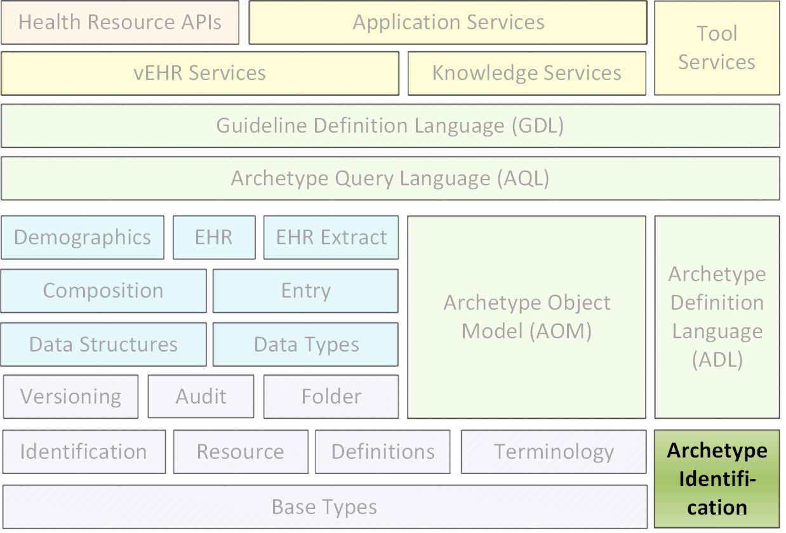
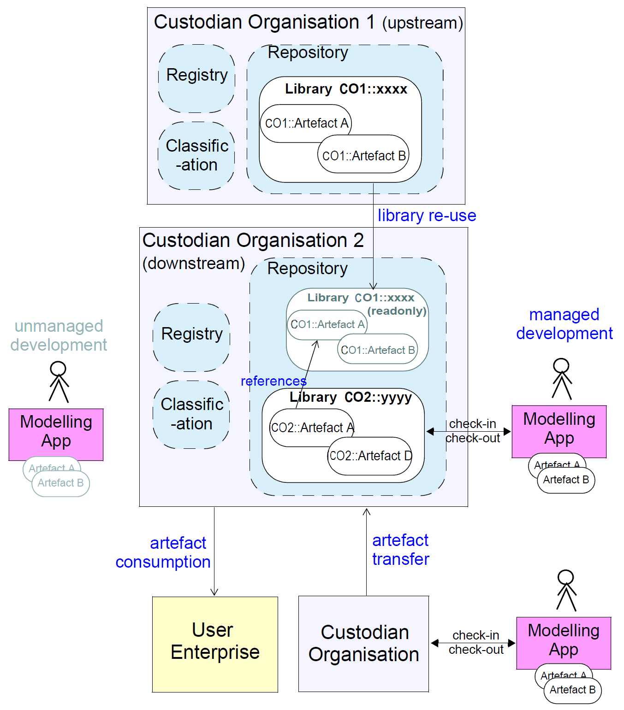
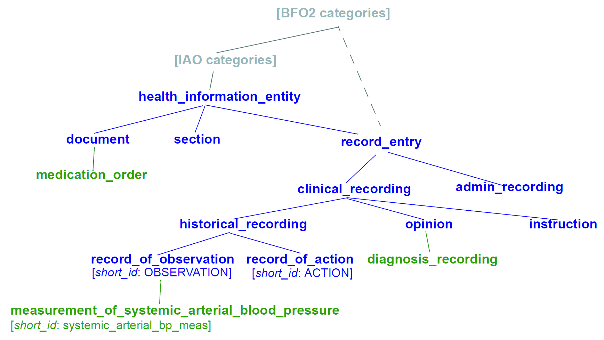
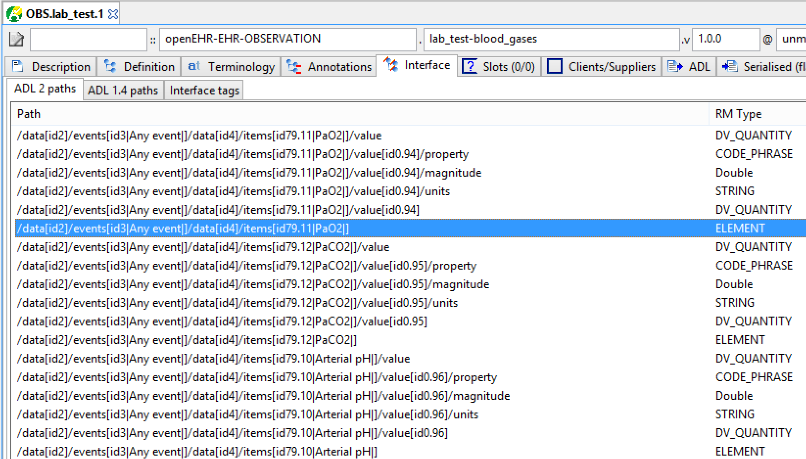
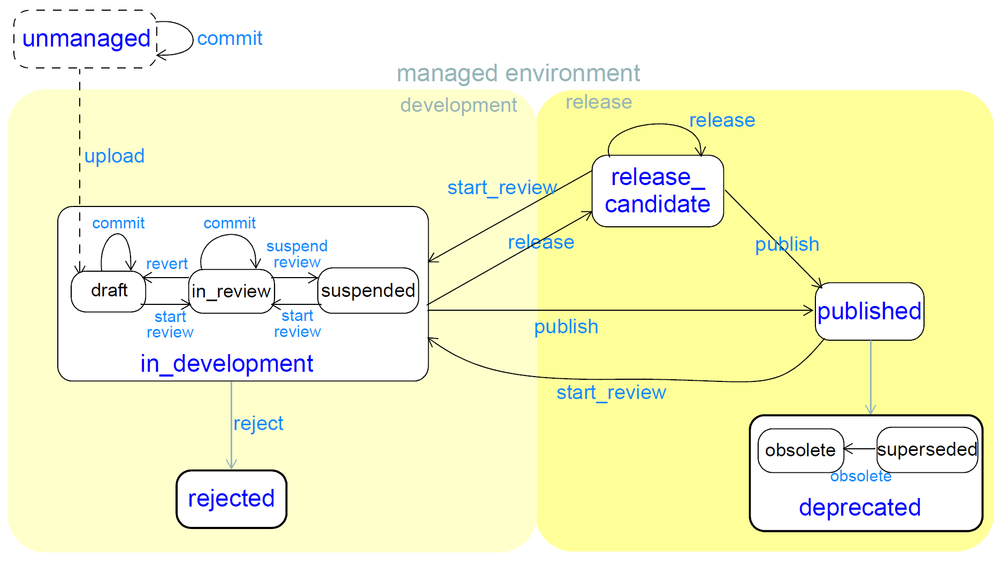
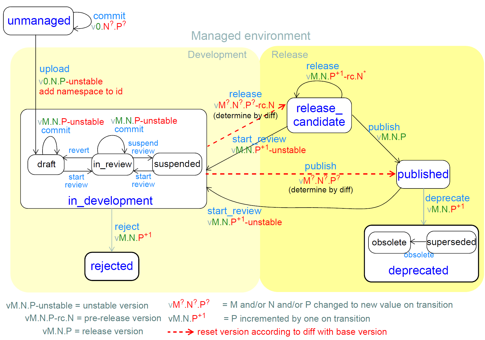
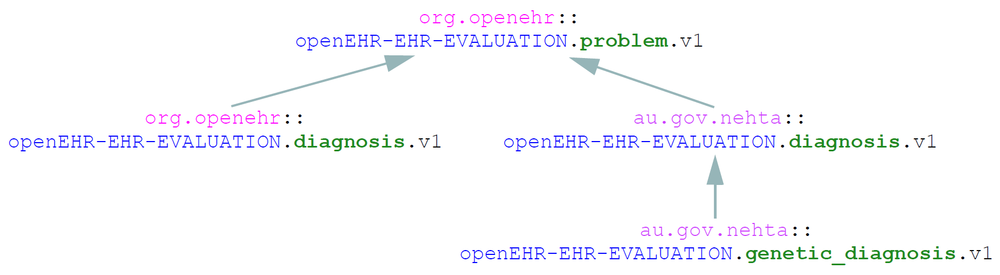
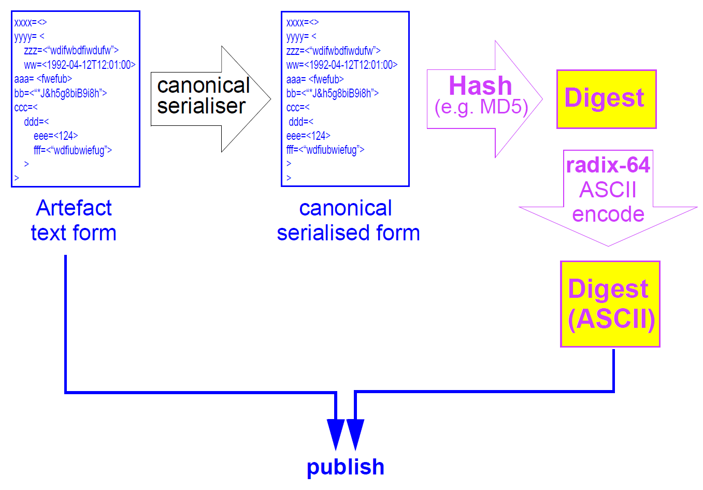
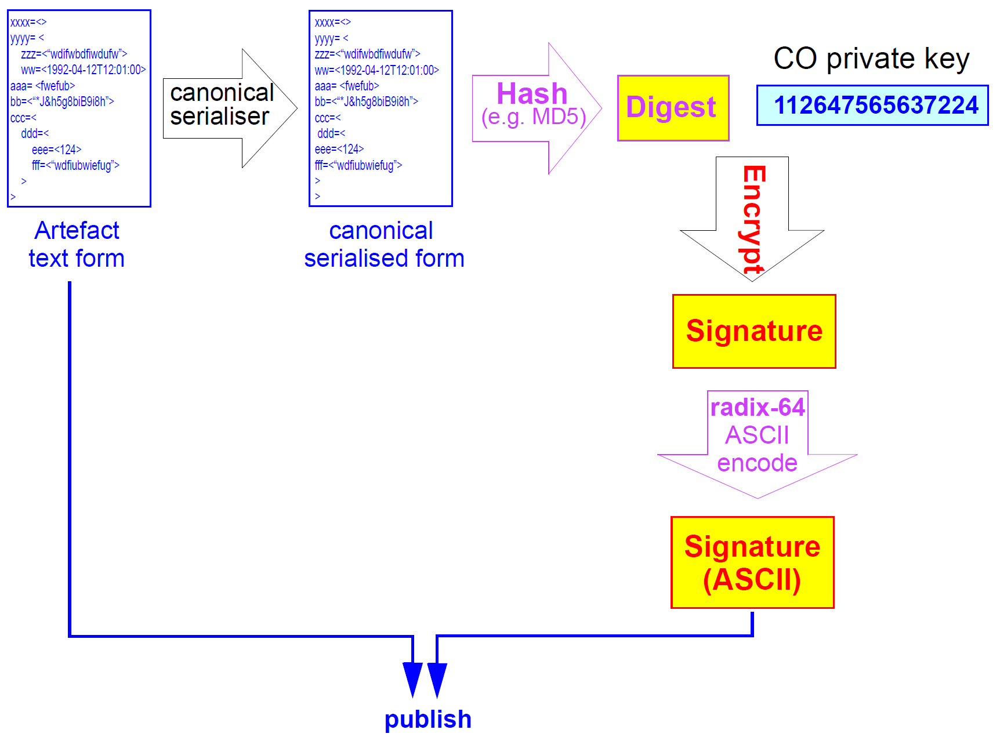

# 原型标识规范

发行人：openEHR规范程序

发布：Release-2.0.6

状态：TRIAL

修订：[latest_issue]

日期：[latest_issue_date]

关键词：原型，鉴定，治理

©2009 - 2017 openEHR基金会

openEHR基金会是一个独立的非营利社区组织，通过开源，基于标准的实施，促进消费者和临床医生共享健康记录。

- 许可:
	- Creative Commons Attribution-NoDerivs 3.0 Unported。 
	- https://creativecommons.org/licenses/by-nd/3.0/
- 支持: 
	- 问题：https：//openehr.atlassian.net/browse/SPECPR/
	- 网址：http：//www.openehr.org/

## 修订记录

- AM Release-2.0.6
	- 0.7.5 (2015年2月1日)
		- 将'-unstable'替换为'-alpha'以与典型工具兼容。
	- 0.7.4 (2014年9月29日)
		- 将'+ uNNN'替换为'-unstable';将“rc”之后的数字简化为整数构建计数。
	- 0.7.3 (2014年5月28日)
		- 删除build_count，替换为instance_uid。
	- 0.7.2 (2014年5月21日)
		- 将ARCHEYTPE_HRID.commit_number更改为build_count。每次版本更改时，Build_count重置为1。调整图表和解释。
	- 0.7.1 (2014年5月9日)
		- 简化生命周期中的开发状态;合并'初始'并重命名'草稿'。
	- 0.7.0 (20 Jun 2013)
		- 重写引用段;更新'问题描述;进一步的语法改进。	
	- 0.6.5 (2013年6月15日)
		- 删除错误和歧义以解释人类可读的标识符;改进命名;重写语法。
	- 0.6.0 (2013年4月21日)
		- 基于CKM临床组分析的主要更新，以及CIMI和openEHR社区的反馈。
	- 0.2.0 (2010年2月1日)
		- 关于模板识别的改进。从医学中心Alkmaar（荷兰）的评论。
	- 0.1.0 (2009年7月9日)
		- 初始写作。
## 致谢

### 主要作者

- Thomas Beale，海洋信息学英国; openEHR基金会管理委员会

### 贡献者

本规范受益于openEHR和更广泛的卫生信息学界的投入。 openEHR基金会希望承认以下人员和机构。

- Sebastian Garde博士，海洋信息学

- Heather Leslie MD，海洋信息学

- Ian McNicoll硕士，海洋信息学英国

- Martin van der Meer，Code24，Netherlands

- 西班牙大学博士，瓦伦西亚大学波利特

### 商标

- 'openEHR'是openEHR基金会的注册商标

- “SNOMED CT”是IHTSDO的注册商标

### 支持者

本文件中报告的工作由以下机构资助：

- 海洋信息学。

## 1.前言

### 1.1. 目的

本文档的目的是描述openEHR原型（包括模板）的识别系统。这包括由任何组织创建的原型，包括openEHR基金会，标准机构和临床建模计划和政府计划。

涵盖的语义包括：

- 正式的人类可读和机器标识符;

- 版本控制

- 生命周期管理和状态;

- 参考来自其他地方的文物;

- 处理转让和分岔;

- 支持完整性和不可否认性。

除非另有说明，在本文档中，术语“伪影”特指这些伪影类型。

### 1.2. 相关文件

阅读本文档的前提条件包括：

- openEHR架构概述。

- openEHR原型技术概述。

- openEHR基本类型规范。

相关文档包括：

- openEHR原型对象模型2（AOM2）规范。

- openEHR原型描述语言（ADL2）规范。

### 1.3. 状态

此规范处于TRIAL状态。本文档的开发版本可以在http://www.openehr.org/releases/AM/Release-2.0.6/Identification.html找到。

已知的遗漏或问题在文本中用“待定”段落表示，如下：

TBD :(例如待定段落）

鼓励用户对这些段落以及主要内容发表评论和/或建议。应在技术[邮件列表](http://lists.openehr.org/mailman/listinfo/openehr-technical_lists.openehr.org)或[规格问题跟踪器](https://openehr.atlassian.net/browse/SPECPR/?selectedTab=com.atlassian.jira.jira-projects-plugin:issues-panel)上提供反馈。

### 1.4. 工具

存在用于创建和处理原型的各种工具。 [ADL Workbench](http://www.openehr.org/downloads/ADLworkbench/home)是一个参考编译器，可视化工具和编辑器。 openEHR工具可以从网站下载。源项目可以在[openEHR Github](https://github.com/openEHR)项目中找到。

## 2.概述

### 2.1. 范围

本规范设计用于解决在分布式创作和消费环境中对复杂知识假象的可靠识别和引用的需要。重点是原型和模板及其派生形式，包括“操作模板”。词汇“人工制品”一般用于指任何这些。

需要识别和生命周期管理方案的相关文物包括术语子集/参考集，“查询集”，以及潜在的事物，例如可计算的准则。本规范在相关的情况下提到了这些后来种类的人工制品，但不为他们提出任何形式的。

超出范围是通常在术语（例如：[ICD10](http://www.openehr.org/downloads/ADLworkbench/home)，[SNOMED CT](http://www.ihtsdo.org/)，[LOINC](http://loinc.org/)）和本体（例如[OGMS](https://code.google.com/p/ogms/)，[FMA](http://sig.biostr.washington.edu/projects/fm/)，[IAO](https://code.google.com/p/information-artifact-ontology/)）中发现的原子“概念”和“类别”。

>注意: 
在本说明书中使用的词“原型”意指：以原型定义语言（ADL）或原型对象模型（AOM）的任何其它序列化形式书写的任何正式人造物。这包括“模板”原型（但不是其他种类的'模板'）。

### 2.2. 环境

原型假定由工具生成，或者以非管理方式生成，或者在用户连接到保管组织（CO）的情况下生成。假定这样的组织具有存储库（其存储和管理原型）以及潜在的注册表（其中存储有关原型的元数据）和分类（Artefacts的语义索引，通常通过使用一个或多个本体）。保管组织可以是国际，国家级或由公司或其他组织拥有。下图说明了本规范假设的关键概念和命名法。

图1.分布式开发环境

大多数CO将倾向于基于由“较高级”（即国家，国际）CO公布的原型开发原型。为了实现这一点，假设通过“下游”CO重新使用来自“上游”CO的指定版本的原型的逻辑能力。这通常意味着某种虚拟包含（例如从一个web可见的存储库到另一个），或者它可以通过将所接收的原型复制和标记为只读来实现。无论特定的实现，存储库的“逻辑内容”是localy管理原型的总和，加上所有虚拟引用的原型库。这是必要的，以使大多数类似编译器的工具正常工作。

假定原型也可以在CO之间移动以用于传输的目的，或者由于“分叉”（即分割开发线，如同软件一样）。用户企业在一些技术基础设施中部署原型，以某种形式和消费者发布工件。

用户企业最终消耗的工件通常以经过验证和编译的形式。

### 2.3. 问题

该规范特别涉及的问题是对原型的识别和引用。原型的关键特征与其他类型的知识文物（例如术语子集）一样，是它们“在软件之外”，并且它们独立于特定的实现技术。结果是，它们可以独立于软件伪影开发而创建，开发，传播和使用。

原型的例子包括：

- “血气”原型

- “放电摘要”的模板。

在健康领域中对这样的人工制品的广泛的经验表明，虽然与软件伪影识别存在许多相似性，但是存在足够的差异来保证明确的方案。健康域是这里假设的主要经验域，但这些原则适用于任何域。

这里涉及的关键要求如下：

- 识别和区分创作环境中的“源”原型的版本，变体和版本;

- 定义用于表达和解析源伪影之间的引用的规则，包括版本变体;

- 定义用于识别从源伪影导出的编译/操作伪像的规则;

- 基于用于伪影的“标准”生命周期来定义用于随着时间演化标识符（包括版本）的伪影的规则;

- 定义用于在人工制品退休，移动或“分叉”时用于识别的规则。

### 2.4. 人类可读和机器标识符

有两种一般的识别方法。第一种是在软件和本体开发中使用的：人类可读的标识符，在本说明书中表示为“HRID”。在该方法下，标识符命名一个伪像（例如，面向对象软件中的类，本体中的类别），并且可以用作连接层次结构中的类似伪像（例如根据继承关系）的引用。第二种是使用无意义的机器标识符（更适当地表示为“机器可读的”或“机器可解析的”标识符），例如具有伴随的解引用机制的GUID和ISO OID。这两种方法不是相互排斥的，也不是等价的。

人类可读的识别方案可以支持人工制品（在对象编程中的“继承”），多维概念空间，灵活版本化的专业化/包含层次化的概念，并且正式地反映人工制品作者和用户对概念的理解空间被建模。人类可读识别支持许多类型的计算处理。典型的软件HRID是类名FastSortedList。在软件世界中，HRID被用于源文物和诸如库和可执行文件的构建组件，尽管相应类型的标识符的细节可能不同。

大多数人类可读的标识符的一个关键特征是，它们可以在初始分配之后改变，出于改变目的，改进对需求的理解或外部需求改变的原因。这些类型的变化通常限于早期开发（通常在v1.0阶段之前）期间，以便以后实现稳定。

另一方面，机器标识符不是人类可读的，通常不直接支持版本化（除非特别设计这样做，通常通过使用原子标识符的元组），但是能够实现各种有用类型的计算。它们需要映射以转换为人类可读的标识符。与人类可读的标识符不同，一旦分配，机器标识符通常不改变。

使用机器标识符时的一个关键问题是：什么标识？一个逻辑的人工制品，可能存在几个小的和主要的版本？每个次要版本？每个文本不同的变体，提交到存储库？对于这些中的每一个，必须设计正确地识别要跟踪的事物的方案。

可以定义其中使用人类可读和机器标识符中的一个或两者的识别方案。在仅使用机器识别的方案中，所有人工制品识别被归入元数据描述，诸如名称，目的等。这样的方案的一个问题是元数据特征是非正式的，并且因此可以冲突 - 防止由人工制品占据的本体空间的任何形式化。重叠的发现以及事实上人工制品的任何比较特征不能容易地形式化，因此不能被正确地计算。

这里假设的方法是以下列方式使用两种类型的标识符：

- 在创建时将GUID分配给该文件。它不会改变，不管对文物的定义做了什么改变。这使得创作和模型存储库工具能够随着时间的推移而对它们进行修改。

- 其他GUID可以用于识别改变的伪影的更精细级别的快照;

- 可以从人工制品的各种性质计算用于人工制品的一个或多个命名空间HRID。哪些属性将取决于人工制品的类型。

- 可以以两种方式识别最后提交的文件（即，包含改变的最新版本，无论多么小）的“构建”

- 使用作为所述人工制品的版本标识的一部分的“编译”号;

- 通过对伪像的规范序列化的散列。

这是与没有分配机器标识符的常见情况的偏离，并且伪像HRID是静态字符串，而是像源文件filename。

### 2.5. 元数据

包括人类可读（形式）标识符的识别解决方案不可避免地牵涉到所识别的人工制品的“元数据”，因为这样的标识符通常是从诸如“参考模型类”，“版本”，“命名空间”等等。然而，一些元数据项不适合包含在一个文物中，而是将在注册表中创建。一般规则是这适用于可以改变而不影响人工制品的语义的任何信息项，并且其改变不应需要修订人工制品本身。这样的信息的例子：本体论分类; “所有权”状态。

本说明书假定人工制品管理环境包括这样的注册表，并且元数据的一些项目可以存储在人工制品本身之外。

## 3. 源伪影识别

### 3.1. 概述

识别源（即创作的）伪影的基础是定义多个单独的逻辑标识属性以及机器标识符。可以从非流体识别属性生成一个或多个人类可读的标识符。对于原型和模板，相关属性在来自openEHR原型对象模型的ARCHETYPE_HRID类上定义。相关属性从AUTHORED_RESOURCE继承到ARCHETYPE中，包括lifecycle_state属性，以及所有其他描述性元数据。

对于其他类型的人工制品，详细模型将有所不同，但原理是相同的。

支持在此描述的识别方案的ARCHETYPE_HRID类中显示的三个不同属性组如下：

- 命名空间提供了区分由不同组织创建的否则将在单个语义标识符空间中竞争的逻辑标识符的方式;

- rm_publisher，rm_closure，rm_class，concept_id形成人类可读标识符的主要部分的基础，例如openEHR-EHR-OBSERVATION.bp_measurement;

- 支持版本控制的属性：

- release_version，表示3部分版本标识符，例如。 '1.3.0';

- build_count，在每个提交时递增，支持非发布版本id，例如'1.3.0-rc.28'和'1.3.0-alpha'，其中构建计数为28;

- description.lifecycle_state，表达人工制品的开发状态，并用于导出未发布版本id的'rc'（发布候选）和'不稳定'（开发）部分。

诸如interface_id，physical_id和version_id的函数被定义为分别将“接口”和“物理”原型HRID（如下所述）作为字符串返回，以及完整版本字符串（从release_version，build_count和description.lifecycle_state计算）。函数major_version，minor_version和patch_version提取了3部分的release_version属性的各个部分。

uid属性提供机器标识符，并假定为Guid。

由于大多数现有的原型都没有，因此uid和命名空间属性是可选的。在本说明书中没有这些标识符的人工制品的解释是它是非管理的，即它没有公认的所有者组织。在切换到此处指定的标识符的时间段内，将显然存在事实上被管理的伪像，并且需要分配uid和命名空间属性。这显然需要一些时间，因为它需要工具生态系统的支持。

不同类型的人类可读标识符用于原型，模板和术语子集。以下部分描述此标识方案的形式细节，以及如何支持人工制品之间的引用。

### 3.2. 正式模型

这一部分定义了人类可读的知识文本标识符的形式语法。如上所述，可以从ARCHETYPE_HRID类的标识属性构造多于一个的人类可读标识符。语法如下绿色所示。

最高级别的区别在于管理和非管理的人工制品，其中管理状态通过将命名空间前置到可以被称为“本地”HRID（即对于给定命名空间上下文而言是本地的）来指示。

    artefact_hrid           =   namespaced_hrid | local_hrid ;
    namespaced_hrid         =   namespace '::' local_hrid ;
    local_hrid              =   hrid_root '.v' version_id ;
    namespace               =   V_REVERSE_DOMAIN_NAME ;
    V_REVERSE_DOMAIN_NAME   =   ; (* See IETF RFCs 1035, 123, and 2181. *)

上面的命名空间是发布者组织的反向域名。 使用反向域名以便辅助标识符的词法排序，以及基于反向域名段构建目录结构的工具。 所有托管文件（包括原型和模板）都应包含命名空间。 任何具有没有命名空间的标识符的原型或模板被假定为非管理的人工制品。

例子：

     org.openehr：openHR.org上的EHR原型库

     uk.nhs：英国国家卫生服务

     edu.nci：美国国家癌症研究所

#### 3.2.1. 人类可读标识符（HRID）

原型人类可读标识符由两个逻辑部分组成：它所基于的参考模型（即逻辑信息模型）类的标识符和本体标识符。

标识符由以下语法规则定义，这些语法规则是openEHR / ISO 13606 ARCHETYPE_ID类型的语法的略微简化的版本：

    hrid_root                       =   qualified_rm_class_name '.' concept_id ;
    qualified_rm_class_name         =   rm_publisher '-' rm_closure '-' rm_class ;
    rm_publisher                    =   V_ALPHANUMERIC_NAME ;
    rm_closure                      =   V_ALPHANUMERIC_NAME ;
    rm_class                        =   V_ALPHANUMERIC_NAME ;
    concept_id                      =   V_SEGMENTED_ALPHANUMERIC_NAME ;

    V_ALPHANUMERIC_NAME             =   ? [a-zA-Z][a-zA-Z0-9_]+ ? ;  (* regex *)
    V_SEGMENTED_ALPHANUMERIC_NAME   =   ? [a-zA-Z][a-zA-Z0-9_-]+ ? ; (* allows hyphens *)

字段含义如下：

    rm_publisher：源自此原型所基于的参考模型的组织的ID;

    rm_closure：原型基于的参考模型顶级包包闭包的标识符;

    rm_class：文档所基于的参考模型中的类或等价实体的名称;

    concept_id：来自信息伪像本体的标识符（见下文）;

第一部分采用3部分标识符的形式，例如：

    openEHR-EHR评估

    ISO-ISO13606-ENTRY

这在历史上已经在openEHR和CEN / ISO 13606-2中用于标识原型所基于的参考模型类。它包括参考模型的发布者（例如“ISO”，“openEHR”），正在引用顶级“闭包”，最后是哪个类。

“闭合”的概念是一个顶级包，从中可以达到焦点类。一般来说，一个给定的类可以从多个顶级包到达，但是该类的原型只适用于那些包中的一个。例如，openEHR类CLUSTER由ehr和人口级顶级包中的类使用。然而，CLUSTER的原型通常被设计为仅用于那些包中的一个。集群原型physical_examination例如将仅在由ehr包定义的数据中有意义。因此，它将具有形式为openEHR-EHR-CLUSTER的原型标识符。物理检查。

标识符的闭合部分可以由工具使用以确保例如“EHR”CLUSTER原型从未附加到“人口统计”信息项。

##### 3.2.1.1. 概念标识符

人类可读标识符的第二部分是“短”本体标识符（在ADL 1.4中称为“概念”或“领域概念”）。这样的标识符历史上是自然语言词或短语，通常以短助记符形式，例如原型标识符ISO-ISO13606-ENTRY.bp_measurement.v1中的'bp_measurement'。

##### 3.2.1.2. 遗留的ADL 1.4语义

历史上在ADL 1.4（ISO 13606-2：2008）中，标识符的“概念”部分将概念的专业化层级编码为一系列激活的段，例如， “问题”和“问题诊断”，后者识别前者的特定形式。在本说明书以及ADL / AOM 1.5规范中，去除了对概念名称包括专业化的要求。这使得任何伪像的域概念能够根据伪像的目的被自由分配。

为了允许遗留专用原型事实上包括分离的域概念标识符的“ - ”样式的事实，仍然允许“ - ”字符，但是不再具有任何语义意义。

一个结果是，对于具有符合本说明书的标识符的原型，不能再根据标识符来确定专门化级别。这种新方法符合如何以面向对象语言命名源伪像。

##### 3.2.1.3. 概念标识符语义

概念标识符的更重要的方面是它的起源和语义。历史上它已经是原型标识符的一部分，因为它是人类可读的，并且便于对数据包含这样的标识符的系统进行调试。显然，人类可读的标识符的纯临时指定是不可扩展的或可靠的。因此需要确定转让的规则和机制。

本说明书认为管理知识伪影标识符的概念部分必须来自与标识符的命名空间对应的本体，换句话说，是由Custodian组织或某些更高权威机构维护的本体。

本规范不是定义本体的业务，但是我们可以将一般形式表示为用于健康领域的信息实体类型的本体。假设本体内存在与来自信息（即“参考”）模型的类相关的节点。这导致了如下所示形式的本体。

图2.信息工件本体

这个（假定的）本体由高级健康信息记录实体（黑色），从临床研究者记录本体（[Beale_Heard_2007](http://www.openehr.org/releases/AM/Release-2.0.6/docs/Identification/Identification.html#Beale_Heard_2007)）衍生的一组记录条目类型以及蓝色的领域特定实体组成。假设本体的顶层节点可以与诸如[信息伪影本体（IAO）](https://code.google.com/p/information-artifact-ontology/)的已发布本体中的节点相关，但是这不是建立该本体的先决条件。更理想地，其类别将与[基本正式本体（BFO）](http://ifomis.uni-saarland.de/bfo/)中的类别相关。

蓝色节点measurement_of_systemic_arterial_blood_pressure（左下）描述了与“全身动脉血压测量记录”相对应的实体。这样的长名称在本体社群中是标准的，并且旨在确保类别的名称足以明确地定义其含义。这样的名称通常太长并且难以处理以用于可管理的词法标识符，例如原型。

因此，我们假设在本体内的“短标识符”的系统是可能的，其中“短id”是完整节点标识符的同义词。如果我们进一步假设本体是用工具（例如[Protege](http://protege.stanford.edu/)）构造的，并且检查本体标识符以确保唯一性。

管理这样的本体的设备应该集中地（例如openEHR.org或者在[开放生物和生物医学本体（OBO）](http://www.obofoundry.org/)）可用，使得每个添加的原型，模板或子集被从本体分配短的本体标识符。

现有的原型可以以两种可能的方式容纳在这样的本体内。如果它们已被使用，并且包含这些标识符的数据存在，则它们的当前本体标识符可以被建议作为为原型定义的本体类的短id。如果存在冲突，则需要新的原型概念短标识符，并且原型将需要在不同的标识符下重新公布。

##### 3.2.1.4. 需要标识符中的RM类名称

理论上，在一个构造良好的标识符中不应该使用引用模型类标识符部分（qualified_rm_class_name），基于不应该有概念标识符的冲突，而不管RM类是什么，即使它们可以容易地相似。例如，用于表示通用实验室结果结果的ENTRY（ISO 13606）或OBSERVATION（openEHR）结构的合理concept_id可能为“lab_result”。对于设计为包含任何“实验室结果”入口或观察的组合层级原型，合理的名称通常是“lab_report”（或另一种语言的等价物）。

不幸的是，对于一些信息概念，实际核心数据级别的适当名称看起来完全合理，也作为相同数据的较高级别容器的名称。如果没有高效的，基本上全球的本体构建服务或权限，包括合格的RM类名称作为对这种冲突的合理保护。

## 4.版本控制

### 4.1. 一般模型

与大多数现代版本系统中的软件伪影不同，知识文献是单独版本控制的。这是因为原型，模板或术语子集本身就是数据点/组和/或术语代码和关系的潜在复杂结构。它通常可以单独使用或与少量相关的人为因素（例如专业化父母）一起使用。因此，版本识别系统以典型软件版本化的方式应用于每个源人工制品，而不是整个存储库。

这有一个非常明显的效果：它意味着对一个人工制品的每一个“承诺”的改变就像一个版本，而使用软件，源文件的许多改变通常发生在版本之间。另外，为了在存储库环境中进行变化跟踪，每个伪影修订通过其版本标识符来区分，而对于软件源伪像，源库内的每个实体（例如，称为“LinkedList”的类）的逻辑“名称”不改变，即使它的内容。总结：

    通过仓库的连续快照执行软件版本化，并且通过向一些快照分配版本标识符来执行释放;

    对于这里描述的知识伪影，版本化对于每个人工制品独立地发生，并且“释放”仅仅是发布人工制品的行为;

    对于知识工件，版本化的人类可读标识符是或可以在计算上使用。例如,在查询和人工参考中，而软件版本标识符通常不由软件本身计算。

### 4.2. 版本号

尽管存在上述差异，知识文献版本的编号遵循由[semver.org](http://www.openehr.org/releases/AM/Release-2.0.6/docs/Identification/Identification.html#semver.org)描述的用于识别软件版本的规则。

因此，版本标识符基于由点分隔的数字部分标识的“版本化”的三个级别，具有与伪影生命周期相关的可选扩展，如下所述。数字部分是：

- 主要版本 - 必须随着突变形式定义的突变而增加;可以以较小的变化递增;

- 次要版本 - 必须随着对伪影形式定义的不断变化而递增;可以以较小的变化递增;

- 补丁版本 - 必须随着对文物的非正式部分的更改而递增;

- 构建号 - 每次提交伪像时递增的数字，并且每当版本id更改时重置为1。

在上文中，“形式定义”仅指原型或模板的以下部分：

- 标识符部分;

- 专业化条款;

- 定义部分;

- 在术语部分：

- term_definitions段中的术语的文本短名称（即不是描述长文本或其他元数据）;

- term_bindings节;

- value_set节。

词汇上，版本标识符定义如下：

	version_id          =   release_version [ extension ] ;
    release_version     =   major_version '.' minor_version '.' patch_version ;
    major_version       =   { V_NUMBER } ;
    minor_version       =   { V_NUMBER } ;
    patch_version       =   { V_NUMBER } ;
    extension           =   version_modifier instance_uid_slice ;
    version_modifier    =   '-rc' | '-alpha' ;
    instance_uid_slice  =   V_UID_DIGIT V_UID_DIGIT V_UID_DIGIT V_UID_DIGIT V_UID_DIGIT { V_UID_DIGIT } ; (* 5 or more digits from instance_uid *)
    V_NUMBER            =   '0' | '1' | '2' | '3' | '4' | '5' | '6' | '7' | '8' | '9' ;
    V_UID_DIGIT         =   V_NUMBER | 'a' | 'b' | 'c' | 'd' | 'e' | 'f' | 'A' | 'B' | 'C' | 'D' | 'E' | 'F' ;

这导致标识符，例如：

    1.3.5
    1.3.5-rc.3          # release candidate for version 1.3.5, build id 3
    1.3.5-alpha         # alpha development version based on version 1.3.5

使用版本标识符需要以下一般规则。

- 第一版本规则：伪像的第一版本（即，创建时的版本）是v0版本，即0.N.P。通常它是0.0.1，但可以是更高的v0版本以指示成熟度。下面的生命周期和分布式语义的讨论提供了关于初始版本语义的更多细节。

- 递增规则：当生成发布版本（即不是候选或alpha版本）时，当主版本递增时，次要版本号和补丁版本号被重置为0;当次要版本递增时，路径编号将重置为0。

下面描述与特定生命周期状态相关的更具体的规则。

在上面的语法中定义了两个'variant'版本：'release candidate'和'alpha'。第一个是标准软件分类，用标签rc语法表示。包括rc的版本号总是具有M.N.P-rc.B的形式，例如。 1.3.5-rc.1，其中减号（ - ）被理解为指示“小于”目标版本1.3.5的版本，即1.3.5-rc.1是导致稳定的中间版本版本1.3.5。

另一个变体用修饰语-alpha表示，其中 - 表示版本'前'由前面的数字标识符标识的版本，而alpha表示'alpha'开发版本。差值α-α版本的幅度由当前制造品的3部分版本标识符与其所基于的先前发布的版本标识符之间的差异指示。

注意，只有主要版本形成源人工产物人类可读标识符的一部分。其意图在于，从部署的观点来看，断裂的变化引起新的人工制品。这是类似于打破软件接口，Web服务定义等的变化，被视为一个不同的实体，通常部署在旧版本旁边。

### 4.3. 更改语义

作为3部分[semver.org](http://www.openehr.org/releases/AM/Release-2.0.6/docs/Identification/Identification.html#semver.org)版本识别方案的结果，可以区分对于人工制品的三个级别的改变。原型作者和工具开发人员的主要问题是：对于某种具体的变化，需要什么级别的版本变化？这是更改补丁，次要版本还是突变（即主要版本）？

>注意: 
不存在由域专家等价地看到给定技术水平的改变（即，由差异工具评估的）的假设。例如，只需要增加补丁版本的微小更改可能对临床语义有重大影响。为此，版本标识符可以增加超过机械比较所需的最小级别。

因此，以下规则定义版本改变的最小必要级别，而不是规定级别，其可以总是更高。

### 4.4. 版本控制'原型的'接口'

Semver模型是为软件设计的，它基于软件接口或“public API”的概念。 API由一组客户端软件可调用的例程的正式方法签名组成。如果API中包含的所有调用（包括例程名称，参数，返回值和类型的所有详细信息），那么客户端软件的给定组件将对给定的API有效。 API的语义也应该被遵守：分别名称和地址的两个函数都可以返回一个List <String>值，但是对于API的意义要保留在版本上，内容必须是名称和地址信息，而不是东西else（例如地址和名称值，颠倒）。

以类似的方式，对于原型或模板，“接口”的想法可以与“原型签名”相关，其可以如下定义。

	原型签名≝原型中每个定义节点的<path，RM类型，AOM约束>集合。

路径，RM类型和形式约束是其他系统组件对原型假设的，因此对于非中断更改必须保持什么。

首先考虑路径。原型路径是通过层次结构的正式路径，其节点由参考模型类属性命名，而在对象节点的情况下，由id代码命名。任何给定的路径必须是通过其所基于的参考模型可构造的实例结构的法律路径。这意味着两件事：

- 层次结构下的节点的顺序和命名由RM确定;

- 每个对象的类型由RM决定;

此外，通过使用原型id代码（在ADL 1.4原型中的at代码）使每个节点是唯一的，其区分任何属性节点下的兄弟子对象。在有兄弟姐妹（不一定总是存在）的地方，这些代码必须在原型术语中通过领域语义定义（例如“血清钠”，“O 2饱和水平”）来定义。

典型的原型路径如下所示：

图3.典型路径

RM属性名称和节点ID代码在路径（左侧列）中可见。路径中隐含的节点RM类型显示在中间列中。因此，第一个路径对应于对象模型引用OBSERVATION.data._events.data.items，并且恰好是类型ITEM。

我们可以显示包含代码rubrics的高亮路径：

	/ data [id2] / events [id3 |任何事件|] / data [id4] / items [id79.11 | PaO2 |]

这里，id79.11定义为“PaO2”，其描述为“动脉血中的氧分压”。这定义了该路径上节点的域含义。

路径和类型构成原型的结构。此外，必须考虑每个节点上的约束（由原型对象模型定义），而不是RM类型。这些包括对价值，基数和出现的约束。

#### 4.4.1. 接口保护

Semver风格版本化依赖于在相同逻辑伪像的推定版本之间的接口一致性的概念。基于上述，我们可以说，如果存在以下情况，原型接口将被保留：

- 对于现有路径，没有任何更改 - 层次结构或词法id代码中没有更改;

- 在路径集中，不删除路径;

- 在路径中使用的id码的域意义没有变化;

- RM类型的对象节点是相同的或是原始类型的祖先（即超类型）;

- 在每个路径的约束或者是相同的或者比原来的宽。

我们可以使用它作为确定对原型的不同类型的具体更改的所需版本更改的基础。

#### 4.4.2. 主版本（打破）更改

原型的中断更改被定义为在上面定义的意义上无法保留原型接口的断点更改。实际上，这将是任何更改，防止由先前版本的版本创建的数据验证新版本。

中断更改的示例有：

- 删除强制性数据点或组;

- 删除节点（路径）;

- 将节点移动到不同的子树;

- 更改id-code的域定义;

- 缩小任何约束，包括节点的RM类型。

任何此类更改都需要一个新的主要版本。

#### 4.4.3. 次要版本更改

在版本化的Semver方法中，如上所述，使用“次要”版本来指示对“接口”的不中断增强。

对于原型，这可以被解释为以下类型的改变：

- 约束，包括节点RM类型，重新定义为“更宽”（即由新约束包含的旧约束）;

- 附加定义节点（即新路径）;

- 添加术语绑定。

从技术上讲，术语绑定的添加可以被认为是补丁级别的变化，但是，它在实际使用中的重要性通常是这样的，即小版本将被保证。

这具有重要的副作用，即给定主要版本的次要版本可能具有与原始主要版本（即次要版本0）和任何其它中间次要版本相似的附加语义。换句话说，通常指定主版本可能不足以指定最新次版本中可用的所有接口。因此，为了参考具有期望参考将指定特定元件的假象的目的，可能需要至少一个较小版本。这将在参考部分进一步讨论。

#### 4.4.4. 修补程序版本更改

在原型上可能有许多其它种类的改变，这将至少需要修改（第三位置）版本号的改变。这些包括：

- 更改元数据;

- 增加语言翻译;

- 对术语的措辞的改变，不影响定义的感觉，或用户对术语的使用。

生命周期模型

### 5.1. 概念模型

与软件一样，知识文物遵循生命周期与识别的状态，可由状态图表示。 穿过状态图的遍历对应于对导致特定版本的释放的人工制品的改变的发展。

虽然有些外围的人工制品识别的范围，我们描述了一个“事实上的”生命周期有三个原因：

- 为没有其他定义可用的用户提供至少一个生命周期定义;

- 为在本规范和其他规范中使用的状态和转换提供明确的术语;

- 以确定通常在软件和其他正式人工制品开发中发生的版本化和状态转换之间的关系。

此处定义的生命周期如下所示。

图4.开发生命周期

使用多级模型，其中一些状态具有“微态”，并且顶级状态被称为“宏态”。目的是为所有宏状态提供标准名称，同时建议和允许微观状态。宏状态名称是软件版本标识的基础 - “开发”对应于-unstable变体，release_candidate到-rc变体。微状态用于指示，因为它们定义了通常在伪影存储库中支持的更细粒度状态的名称。

这个生命周期假定人工制品在“非管理”环境中或直接在管理的环境中开始生活。在后一种情况下，假定在开发者的视图和“释放”视图之间有一些区别。

关键状态用与典型软件和文档开发术语相对应的名称（深蓝色）和转换（浅蓝色）定义。遍历生命周期的典型遍历是：

- [非管理→]发展→出版

- 开发...开发→release_candidate→... release_candidate→发布

- 已发布→已弃用

- 发展→拒绝

这里使用的一些语言习惯值得注意：

- start_review是进入开发宏状态的所有操作的名称;

- 作为动作（即状态转换）的释放被认为意味着使得任何版本的伪像可用于公共用户基础，包括预发布，最终版本和后发布（“semver.org”中的“builds”）;

- 作为行动手段发布作出明确释放。

### 5.2. 基于生命周期的版本控制

现在可以根据下面的图示来描述版本化的人类可读标识符和生命周期状态的对应关系。

图5.使用版本控制的开发生命周期

版本标识符根据上述一般规则以及与生命周期状态相关的特定规则进行如下演化。

- 人工制品通常以0.0.1开始生活，尽管可以接受的做法是从某个其他v0版本开始。 0.5.0以指示大约如何成熟的人工制品。它仍然是一个v0版本的一段不稳定的早期发展导致初始可释放1.x版本。

- 在某些时候，文件将被上传到托管的存储库，此时，其标识符将以管理组织命名空间为前缀（并且可能以其他方式更改）。

- 在积极发展期间，人工制品被认为是不稳定的，即任何种类的改变都可以进行，逆转，重做等等;由于这个原因，版本id由对应于当前在伪像中的改变的大小的下一版本号形成，并且附加有 - 不稳定;

- 人工制品可以被拒绝，在这种情况下，其次要版本增加（遵循[semver.org]规则），并且人工制品生命周期状态被设置为拒绝。

- 在某个时候，一个文物的创作团队将决定该文物准备发布。然后根据当前表单和它所基于的基本版本之间的差异来计算其发布版本ID。

- 然后是：

    - 发布到预发布周期中，此时版本的数值部分根据当前形状的文物和其所基于的发布版本之间的差异来计算。标识符的形式变为M.N.P-rc.B，表示社区测试阶段。从release_candidate状态，可能有三个路径：

        - 用M.N.P形式的稳定版本id明确地公布;

        - 释放较新的版本候选，仅包含不破坏界面的修改，即修补程序级别更改或更少;在任何情况下更新实例UID;

        - 如果需要更大的变化，则回到开发状态并根据需要执行更大的变化;

    - 直接释放到M.N.P.形式的稳定版本。

- 一个人工制品最终可能被弃用，在这种情况下，其次要版本会增加（遵循[semver.org]规则），并且人工制品生命周期状态设置为“已弃用”。它可以在储存库注册表中被分类为过时，暂停或以某种其他方式。

根据上面的基本版本规则和生命周期模型，下面的版本标识符的“优先级”通过以下示例：

    1.2.3-rc.1 <1.2.3-rc.2 <1.2.3 <1.2.4-不稳定<1.3.0-不稳定<... <1.3.0

## 6. 分布式治理

### 6.1. 概述

本节介绍如何在分布式开发环境图中所示的分布式环境中管理知识工件标识符。需要规则来定义在管理下的人工制品的情况下如何管理标识符，以及管理的人工制品的转移和分支。

### 6.2. 管理

许多知识文物以特别的方式开始生活，由研究项目或专家个人创造。从本规范的角度来看，它们最初是“人道的”，意味着他们没有监护组织。

使一个人工制品广为人知，可用于外部世界的第一步是将其置于一个遵循治理和质量保证规则的组织的管理下，外部世界可以依靠这些规则。本规范没有描述所有这些规则，只是用于管理的人工制品的识别和元数据的规则。

当首先创建伪像时，其生命周期状态是“非管理的”，并且其版本标识符是v0.NP，即，通常被识别为（例如通过Github语义版本控制准则（[sem_ver](http://www.openehr.org/releases/AM/Release-2.0.6/docs/Identification/Identification.html#sem_ver)））的“不正确的形式，对正常的主要/次要/补丁版本化规则没有作出任何承诺。可以通过工具给予制品，虽然这将被管理组织忽略，因为由广告分配的Guids hoc工具或直接人工创作通常是现有Guids的副本（由于剪切和粘贴）或者以其他方式（不当的Guid算法实现）不可靠。

当托管组织接受一个人工制品时，会发生以下情况：

- 其生命周期状态进展到初始;

- 其人类可读的标识符改变为命名空间形式;

- 它被分配一个新生成的Guid作为其uid;

- 如果其主版本号高于0，则将其重置为0.0.1，否则保持不变;

- 设置各种元数据项，包括版权，许可证。

此外，可以为存储在存储库内的文物生成SHA-1散列。

### 6.3. 转换和分支

一旦人工制品受到管理，它将根据本规范前面所述的生命周期进行演变。大多数这些步骤和转换可以被认为是“发展的细节”。然而，当部署伪影时，将创建包含伪影标识符的数据，并且从这一点，将数据链接到生成伪像的可靠性的能力是关键问题。对此的标准方法在下一节中描述。

数据/伪造识别中的挑战源自托管组织之间的人工制品的转移和/或分支。人工制品在管理组织中可以有两个可能的角色：

- 作为积极开发和维护的人工制品;

- 作为部署人工制品。

保管组织可以决定停止自己维护一个人工制品，并将该责任转移给另一个组织，例如。通常它将继续在其当前部署环境中使用当前本地形式的人工制品，例如，由当地医院系统或供应商。

在新CO获得的那一刻，人工制品的HRID可能被重新分配。

在某些时候，新的保管人将对该文物进行维护工作，例如发布新的次要或补丁级别的版本。如果这些新版本被认为是国家标准，原始CO将很可能采用它们来使用。问题是：如何识别人工制品的新版本？

关于人类可读的标识符，有两种策略可用：保留原始的人类可读标识符，或改变它以反映新的CO。反对改变它的一个论据是将保留标识符连续性，确保现有的原型引用查询和数据，以及其他原型和模板保持有效。如果假定所有这样的引用都限于原始管理域，则该问题的大小是已知的，并且最有可能是可控制的。

更改标识符的参数包括：

- 要求在文物中确定新的托管组织;这可能是工业的全球期望，例如。如果新管理者是一个国家组织，如果供应商和系统管理者发布的文件携带其标识符，则对供应商和系统管理员来说显然更容易;

- 原始域继续创建新的本地释放的可能性，可能是为了响应本地遇到的需要不可避免的本地特定更改的问题;

- 新的CO想要重命名该文物以更好地适应其自己的本体论物品分类;

- 如果没有使用所讨论的工件创建数据或查询，则改变其标识符将不会有任何具体的影响;

- 如果命名空间总是反映当前的CO，将更容易知道谁为了支持和其他目的联系。

这些点中的第二个构成了软件术语中的“叉”，即，一行开发变为两个。常识似乎决定了分叉的可能性，特别是由于在人工制品被提升到更高的管理领域之后处理局部问题的不可预见的需要，永远不会为零，甚至可能是频繁的。

似乎也可以合理地假设，即使在从一个经理移动到另一个经理时，没有规则或义务改变人工制品的标识符，但是在某些情况下它也会通过双方同意而发生。

因此，本说明书的方法是必须提供规则，其定义如何实现伪影重新识别，而实际上不需要在任何特定情况下进行。部分要求是建立一个机器可处理的“伪影等价”概念。

人类可读标识符和机器标识符都需要迁移规则。关于人可读标识符，假设以下任何一个是可变的：

- 命名空间：至少这将总是改变;

- concept_id：本体标识符可以或可以不改变，这取决于新管理器是否希望在不同的本体中定位人工产物;

- 版本标识符：版本标识符通常将改变，可能作为标识符的概念部分是否改变的函数。

一般情况是，将伪像传送到另一管理组织可能导致除了标识符的参考模型相关部分之外的所有方面都改变的标识符，其不能由于形式原因而改变。

这里假设当人类可读的标识符改变（无论多么微小）时，uid属性也必须改变。这是为了防止原始版本的后续新版本与已传输的版本的版本之间的混淆。一个新的uid进一步证明了不可避免的“迁移是分叉”的假设。

为了使工具能够确定什么原型是等效的，提出了伪影元数据的特定部分，其记录当前标识符和先前标识符之间的等价。 假设一个人工制品在其生命中可能迁移不止一次，则本节将需要适应多个这样的语句。 为了帮助人们使用这些信息，还建议包括一个日期。 因此，该部分将具有等价历史的逻辑结构，如下面的原型（'hrid'=人类可读的id）的示例所示：

    id_history = <
        ["2001-05-27"] = <
            old = <
                hrid = <"au.com.rbh::openEHR-EHR-EVALUATION.problem_desc.v2.4.1">
                uid = <"5221C9E5-0ECA-469F-83C5-A5D5A0C6682C">
            >
            new = <
                hrid = <"au.gov.nehta::openEHR-EHR-EVALUATION.problem.v1.0.1">
                uid = <"094C8B37-F0CD-45C9-A1B7-CDFDE14C67AB">
            >
        >
        ["2004-14-03"] = <
            old = <
                hrid = <"au.gov.nehta::openEHR-EHR-EVALUATION.problem.v1.6.3">
                uid = <"E50290BB-890A-4344-9480-D40AF01C5BCC")
            >
            new = <
                hrid = <"au.gov.doha::openEHR-EHR-EVALUATION.problem.v1.6.3">
                uid = <"F4166F58-4EDA-4F13-B413-45A8F7A3E53D")
            >
        >

这些等价历史将被Custodian组织用来填充人工标识符等价表，可以根据请求与其他经理组织共享。此系统让人想起互联网域名系统（DNS）中的CNAME记录类型，用于记录规范域名的别名域名。

## 7.引用

本节描述了其他人为因素和软件如何引用伪像。参考的一般原理是，以与软件相同的方式，在源伪影之间使用基于人类可读标识符的引用，而在伪影或数据的操作形式中的引用可以是HRID或机器标识符的形式。

与标识符相反，引用存在关键的语义差异。引用是完整的物理人工标识符，或者是具有部分版本信息的标识符。在这两种情况下，使用参考来匹配携带完全识别的伪影。通常，可以存在若干候选匹配，因此必须在每种情况下指定匹配算法，以便在所有建模和计算环境中确保给定参考的恒定含义。

如下所述，根据需要使用基于HRID的各种形式的参考。这些表示如下：

    - 接口HRID引用（ihrid_ref），其对于共享相同核心接口的所有伪影实例是相同的，换句话说，仅包括主要版本的标识符的形式;这将匹配该主版本的最新版本;

    - 特定接口HRID引用（sihrid_ref），其是包括将与接口​​的特定版本匹配的主版本和次版本的标识符的形式;

    - 物理HRID引用（phrid_ref），其标识相同的伪影实例;这是包含完整版本标识符的标识符的形式。

这里的语法如下。

    hrid_ref                =   namespaced_hrid_ref | local_hrid_ref ;
    namespaced_hrid_ref     =   namespace '::' local_hrid_ref ;
    local_hrid_ref          =   ihrid_ref | sihrid_ref | phrid_ref ;
    ihrid_ref               =   hrid_root '.v' major_version ;
    sihrid_ref              =   hrid_root '.v' major_version '.' minor_version ;
    phrid_ref               =   local_hrid ;

作为示例，以下两个原型iHRID引用从数据处理的角度表示不同的逻辑原型，因为它们的主要版本不同，指示两者之间的中断改变：

org.openehr :: openEHR-EHR-EVALUATION.diagnosis.**v1**
org.openehr :: openEHR-EHR-EVALUATION.diagnosis.**v2**

相反，以下参考文献表示被认为是逻辑上可替代的物理上不同的原型：

org.openehr :: openEHR-EHR-EVALUATION.diagnosis.**v1.1.5**
org.openehr :: openEHR-EHR-EVALUATION.diagnosis.**v1.1.7**

### 7.1. Source Artefact参考文献

本节描述在设计时间'源'（即编译器输入）伪像之间基于标识符的引用所需的场景和表示。

#### 7.1.1. 原型外部参考（ADL / AOM 2）

在ADL 2中，可以定义直接原型原型引用，称为“外部引用”，它使用原型miniHRID，如下面的示例所示。

    ACTIVITY[id2] ∈ {   -- Medication activity
        description ∈ {
            use_archetype ITEM_TREE [openEHR-EHR-ITEM_TREE.medication.v1]
        }
    }

如果这样的引用不包括命名空间，则意味着假定与当前原型相同的命名空间（其可以不是命名空间）。将包括一个命名空间来表示对当前命名空间之外的原型的引用。

诸如上述的引用将在运行时根据以下算法解析为实际原型：

- openEHR-EHR-ITEM_TREE.medication.v1的最新发布版本变体，即最新的次要版本或补丁版本，如v1.0.4，v1.2.49等

- openEHR-EHR-ITEM_TREE.medication.v1的最新版本候选版本，例如v1.2.3-rc44，因为'rc'版本被保证在语义上与它们的目标版本兼容

因为次要版本可以包括结构添加，所以在某些情况下，原型外部引用也需要包含次要版本 - 允许识别原型（接口）的精确结构形式。类似地，为了测试或其他研究目的，应该假定需要引用原型的patch和-rc和-alpha版本。

因此，一般情况假定一个伪影参考是一个hrid_ref，但最常见的是一个ihrid_ref。

#### 7.1.2. 模板引用原型和模板

模板通常设计为软件工件的前光标，例如表单，消息定义和文档模式。因此，为了稳定起见，其确切的内容和结构通常由开发商仔细控制。为了实现这一点，从模板到其他模板或原型的引用需要能够引用目标制品的任何级别的版本。在开发阶段期间，模板引用可能限于人类可读标识符的主要版本，即ihrid_ref。在某些时候，可能的情况是也必须包括次要版本。如上所述，这是因为较小版本的原型可以包括结构添加，并且因此影响最终文档/数据集等的结构。甚至可能是需要标识补丁级版本的情况，以便确保即使源文件的升级版本可用，也不会在模板中发生任何更改。

然而，这种严格的控制不是通用要求。可能已经采取了有意识的设计决定，其中所得到的软件伪影内容是来自发布时的模板定义的任何结果，假设仅参考主要版本。

为了适应这些情况，对原型和其他模板的模板引用需要在任何版本级别是合法的。例如，以下任何引用应在模板中合法：

- org.openehr :: openEHR-EHR-EVALUATION.problem.v2

- org.openehr :: openEHR-EHR-EVALUATION.problem.v2.4

- org.openehr :: openEHR-EHR-EVALUATION.problem.v2.4.17

在开发和研究环境中，允许-rc和-alpha变量也是合理的。

因此，一般情况下原型外部引用：模板引用是一个hrid_ref。

#### 7.1.3. 专业原型之间

一个专门的原型引用它的父类使用人类可读的引用，只包括主要版本。可能出现两种可能的变体：

- 使用非命名空间引用。这被假定为来自与专用原型相同的命名空间。

- 使用命名空间标识符，其中命名空间不同于引用原型的名称空间。这将解决引用的命名空间的本地可用存储库副本中引用的原型的最新版本。

下图显示了通过专业化相关的一些原型。

图6.专业化关系

自然而然地产生与专业化有关的一个问题是当父原型被修改时会发生什么。该方法与面向对象软件的方法相同：给定“检出”或发布中的所有原型必须始终在任何时间编译为有效。如果引入了修改后的父对象，使其任何继承子项无效，则必须在存储库再次作为整体有效之前对子项进行修订。这意味着一个原型的新版本通常可能需要重新版本化子原型。

7.2. 源伪影关系约束

与“引用”的概念相关的是约束，当在运行时评估时，解析为伪影标识符。这里描述两种类型，它们是两种原型“槽”定义。

7.2.1. ADL 1.4原型槽

在ADL 1.4中，原型槽通过其slot语句中的断言来定义。虽然规范允许所有种类的可能性，但是使用中的唯一一个是允许填充槽的原型标识符的正则表达式（RE）。当前的ADL 1.4工具支持完整（非名称间隔）ADL 1.4原型标识符的RE，其仅包括主要版本号，例如：

	openEHR-EHR-EVALUATION.problem.v1

注意，这样的RE通常包括通过使用形式的不相交图案

	"id_pattern1|id_pattern2|id_pattern3".

使用基于这样的标识符的RE的典型时隙定义如下：

    protocol matches {
        ITEM_TREE[at0015] ∈ {
            items cardinality ∈ {0..*; ordered} ∈ {
                allow_archetype CLUSTER[id20] occurrences ∈ {0..1} matches {
                    include
                        archetype_id/value ∈ {/openEHR-EHR-CLUSTER\.device(-[a-zA-Z0-9_]+)*\.v1/}
                }
            }
        }
    }

此插槽允许任何名为openEHR-EHR-CLUSTER.device.v1或openEHR-EHR-CLUSTER.device-xxx.v1的原型，它使用表示专用原型的ADL 1.4方法。

命名空间包含的规则与外部引用的规则相同：

- 没有命名空间意味着与当前原型相同的命名空间;

- 显式命名空间意味着该命名空间的原型。

至于外部引用，在技术上没有什么可阻止槽RE被定义为引用原型的特定次要版本或构建。 同样的规则适用：释放的原型应该只包括主要版本。

#### 7.2.2. ADL 2原型插槽

在ADL 2中，可以使用语义（而不是词汇）表达式来定义时隙，其中匹配原型以对原型概念（以及可选的命名空间）的约束的形式被定义，使人联想到SNOMED CT后协调约束语法。 这在以下示例中显示。

    allow_archetype CLUSTER [id4.1] occurrences ∈ {0..1} ∈ {
        include ∈ {True}
            archetype_id ∈ {
                ARCHETYPE_ID ∈ {
                    namespace ∈ {...}
                    concept ∈ {<< investigation_methodology OR << investigation_protocol}
                    ...
                }
            }
        }

上述类型的引用依赖于人类可读标识符的concept_id部分的本体基础。

### 7.3. AQL查询集

AQL查询通常在“集合”中创作以便实现设计目标，例如。 填充报告，屏幕或一些分析目标。 许多是纯粹地方性质的，可以被认为是“一次性”。 其他的是精心设计的需要，如填充临床指南或执行标准计算。 在一个原型框架中，这些查询集需要以类似于其他人工制品的方式被识别和管理。

### 7.4. AQL查询

基于原型的查询包含原型引用和路径，并且还可以包含模板标识符和路径。 典型示例是以下查询中的路径（绿色）：

    SELECT pulse
    FROM EHR[ehr_id/value=$ehruid]
     CONTAINS COMPOSITION c
     CONTAINS OBSERVATION pulse[openEHR-EHR-OBSERVATION.pulse.v1]

    WHERE c/name/value='Encounter` AND
        c/context/start_time/value <= $endperiod AND
        c/context/start_time/value >= $startPeriod AND
        pulse/data/events[id6]/data/items[id4]/value/value < 60

查询中的引用语义与原型到原型形式的语义不同，因为引用通常后跟有引用结构中特定数据点的路径。 为了使AQL查询正确，路径必须存在于引用匹配的版本中的原型中。 由于次要版本可以添加到原型的“接口”（即向结构添加数据点和路径），给定的路径需要引用路径有效的最旧的原型。 考虑以下路径：

    [openEHR-EHR-OBSERVATION.pulse.v1]/data/events[at0006]/data/items[at0004]/value/value

为了使其有效，路径/数据/事件[at0006] / data / items [at0004] / value / value必须存在于原型openEHR-EHR-OBSERVATION.pulse.v1的最早v1.x版本中，即v1 .0.0。 如果此路径恰好已在最近的次要版本中添加，原型引用将需要包含包含该路径的第一个次要版本。

一旦AQL查询处理器可以使用有效路径，它将匹配以下数据：

- 所引用原型中该路径处的数据点的任何实例;

- 专业化子原型中全等路径中的数据点的任何实例。

子原型中的一致路径的示例是：

    /data/events[id6.0.4]/data/items[id4.1]/value/value

### 7.5. 操作工艺

诸如平坦原型和由编译器工具生成的操作模板的操作伪像从源伪影构建，包括通过从一些源伪影内的参考解析到本地和导入伪像的当前存储库内的其他伪像。参考目标的特定版本由配置的内容确定，并且因此是版本管理活动的功能，以与软件开发相同的方式。

当从受控源伪影（即，在保管组织内）生成操作伪像时，可以包括来自相关源伪影的细粒度修订信息，使得操作形式准确地描述了哪些源伪影被用于生产它。还可以包括源伪影语义签名。该信息可以包括在制品的配置部分中。这将在ODIN（以前的dADL）或XML等价物中表示，并且将列出用于生成操作版本的具体工件修订版本的“配置”。

配置的结构如下：

    configuration       =   archetype_config template_config subset_config rm_release ;
    archetype_config    =   config_item { config_item } ;
    template_config     =   { config_item } ;
    subset_config       =   { config_item } ;
    rm_release          =   rm_name release_id ;

    config_item         =   identifier [ revision_id [ commit_id ] ] [ signature ] ;

    signature           =   CHARACTER_SEQUENCE ;
    revision_id         =   V_INTEGER ;
    commit_id           =   V_INTEGER ;
    release_id          =   V_STRING ;

受控环境（ODIN格式）中的操作模板的配置示例如下：

    archetypes = <
        [1] = <
            id = <"org.openehr::openEHR-EHR-OBSERVATION.heartrate.v1.3.28">
            signature = <"23895yw85y0y0">
        >
        [2] = <
            id = <"au.gov.nehta::openEHR-EHR-EVALUATION.genetic-diagnosis.v1.2.0">
            signature = <"98typrhweruhfd">
        >
        [3] = <
            id = <"org.openehr::openEHR-EHR-EVALUATION.problem.v2.4.0">
            signature = <"2rfhweiudfwieurfh">
        >
    >
    templates = <
        [1] = <
            id = <"au.gov.nehta::openEHR-EHR-COMPOSITION.vital_signs.v5.36.1">
        >
    >
    subsets = <
        [1] = <
            id = <"org.ihtsdo.general::cardiac_diagnoses.v18.1.0">
        >
    >
    rm = <
        name = <"org.openehr.rm">
        release = <"1.1">
    >

### 7.6. 数据参考

#### 7.6.1. 要求

在知识启用的信息环境中，诸如基于原型原理构建的信息环境中，知识伪影用于控制数据的创建和验证，其结果是最终存储在这样的系统中的数据符合相关的人工制品。为了能够进一步处理（例如显示，修改和查询）这样的数据，对知识伪影的某种类型的引用必须存储在数据中。这种引用的要求取决于在两个可能的情况下，即操作系统（例如EHR系统）内的数据和在系统之间发送的“消息”，“提取”或“文档”内的数据。

可以针对系统内的数据识别三个要求。

- 可重构性：首先，必须有可能重新连接数据与原型，模板和子集，用于创建它们。这意味着主要和次要版本至少被记录在数据中，因为次要版本可能对结构有影响。

- 查询：其次，它必须能够知道什么原型（包括主要版本），因此什么路径集可以用于查询数据 - 假定这可能包括专门的archteypes的父母，而不仅仅是用于直接创建的原型数据。

- 优化：我们还可以假设在处理数百万健康记录的典型生产系统中，嵌入数据中的伪标识符的大小（特别是如果重复）可能是一个问题，并且可能需要某种类型的空间优化。

在提取或消息中，相同的要求大体上保持，但是可以更好地重述如下。

- 可重构性：接收系统必须能够确定每个数据元素与用于创建它的伪像的关系，使得其可以在接收机系统环境中被正确地重构。

- 查询：为了确保查询的正确功能，提取或消息应当潜在地携带在数据中使用的原型的足够的原型沿袭信息，以允许在接收器处查询，特别是如果后者希望能够使用更一般的父查询一个“问题”原型，而不是一些特定的诊断专业化）。

- 优化：考虑到消息，提取等在异构系统之间流动，必须使用空间优化和表示清晰度之间的合理权衡。

#### 7.6.2.可重组性

可重构性要求意味着在数据中的相关节点上记录原型和模板标识符。其基本形式总是在openEHR中使用，使得在原型根节点处，原型标识符以及相关的模板标识符被记录，并且在内部节点处，记录代码（形式上，原型标识符和 - 代码记录在每个数据节点的LOCATABLE .archetype_node_id属性中）。例如，在基于openEHR版本1.0.2或更早版本创建的数据中，原型标识符引用的形式为：

	openEHR-EHR-EVALUATION.diagnosis.v1

使用这里描述的更复杂的识别系统，这些原型引用​​需要包括命名空间和完整版本标识符，即：

	org.openehr :: openEHR-EHR-EVALUATION.diagnosis.**v1.29.0**

没有命名空间的引用将是合法的，因为使用不受控制的原型和模板不应存在计算障碍。在实验情况下。缺少次要和补丁级别版本号对于非命名空间标识符也应是合法的，并且在两种情况下被解释为0，即.v1表示.v1.0.0。

#### 7.6.3. 支持基于原型的查询

在openEHR系统中的数据的查询被假定为基于原型“路径集”，即从操作（平面形式）原型提取的路径集合。路径是标准X路径的略微简化。到目前为止，已经描述了两种查询方法，AQL和a-path，两者都做出这个假设（参见[openehr_query_aql]）。

基于这个假设，给定原型X用于创建数据，以下原型可以用于查询：

- X，即完全相同的版本，修订和提交;

- 任何先前的次要或补丁变体X;

- 任何X的专业化父母;

- 任何X的专业化父母的任何先前的次要或补丁变体。

对于非专业原型，可以从数据中记录的原型引用中推导出允许的查询原型。对于专门的原型，专业化谱系只能从用于创建数据的模板中找到的原型的操作形式获得。这将产生潜在的问题，其中对于从没有相关模板的另一站点导入的数据，原型沿袭信息不可用。这将防止接收机系统处的查询引擎知道如何使用甚至更可能访问的系统中更一般的原型来查询数据。

为了解决这种情况，需要以下策略之一：

- 在交换（即，在EHR提取中）时包括来自操作模板的配置元数据与数据。

- 在数据本身中包括原型沿袭信息。这可以是在专门原型的情况下的标识符引用的修改形式，以允许存储沿袭信息。

第二种方法可以被认为是仅记录当前原型标识符的一般化，即非专用原型的“谱系”仅评价原型ID，对于专门的类型，它将是一个列表。本说明书假定使用第二个。

这种最简单的形式将是操作标识符的列表，例如

    au.gov.nehta :: openEHR-EHR-EVALUATION.genetic_diagnosis.v1.12.9，
    org.openehr :: openEHR-EHR-EVALUATION.diagnosis.v1.29.0，
    org.openehr :: openEHR-EHR-EVALUATION.problem.v2.4.18

#### 7.6.4. 正式模型

符合上述要求的参考资料的正式定义如下：

    archetype_data_ref  =   archetype_ver_ref { ',' archteype_ver_ref } ;
    archteype_ver_ref   =   hrid_root '.' version_id_ref ;
    version_id_ref      =   'v' version_id ;

#### 7.6.5. 优化

在正常的基于原型的数据中，基本引用和附加沿袭信息可以在给定组件（例如openEHR或ISO 13606组成）中重复。考虑记录患者的问题和诊断的组合物，其中每个问题使用原型记录

    uk.nhs.royalfree.clinical :: openEHR-EHR-EVALUATION.diagnosis.v2.15.0

其血统是：

    org.openehr :: openEHR-EHR-EVALUATION.diagnosis.v1.29.0
    org.openehr :: openEHR-EHR-EVALUATION.problem.v2.4.0

在本例中，原型参考长度分别为66,57和54个字符，即总共177个字符。重复说5次将为组合物提供885个字符的标识符元数据，其主要临床数据可以很容易类似。即使在基于XML的存储系统中，使用各种类型的压缩，标识符参考开销可以被认为是总体数据存储需求的不可接受的部分。

因此，值得考虑各种简单的优化，同时保持数据中的清晰性和可理解性。以下想法目前旨在限于串行化数据形式。因此，它们只需要更改openEHR XML模式，而不是抽象引用模型。

##### 7.6.5.1. 标识符别名

最明显的优化是使用一组对数据上下文本地的变量引用，在本例中为openEHR或ISO 13606提取。例如，在提取的顶部，可以进行以下定义：

    id01 = uk.nhs.royalfree :: openEHR-EHR-EVALUATION.diagnosis.v2.15.0，
        org.openehr :: openEHR-EHR-EVALUATION.diagnosis.v1.29.0，
        org.openehr :: openEHR-EHR-EVALUATION.problem.v2.4.0
    id02 = au.gov.nehta :: openEHR-EHR-OBSERVATION.hba1c_result.v1.4，
        org.openehr :: openEHR-EHR-OBSERVATION.lab_result.v1.18
    etc

然后在数据中使用标识符id01，id02等，在一些情况下将标识符开销减少大约50％。通过在openEHR参考模型中的EHR_EXTRACT类型的顶部添加一个属性来包含变量定义，并在其他模型中的等效类中添加一个属性来实现这种可能性。

使用这样的变量将使查询和其他数据处理稍微复杂，因为返回组合的一部分的查询将返回包含无意义的局部变量名称的数据，而不是适当的原型元数据。

要考虑的第二个问题是标识符的任何部分是否可以删除。例如，最初可能看起来可以完全去除参考模型和类标识，因为最初创建的数据在定义上似乎基于参考模型和原型的类。但是，两者都不能保证。考虑以下两种情况，它们使用基于不同参考模型的原型来创建数据：

- 数据提取器，将源数据（例如以openEHR形式）转换为标准形式，例如ISO 13606形式。嵌入在后面的数据中的原型标识符将是原始的openEHR原型标识符（提取器不创建新的原型来进行其转换工作）;

- 直接基于另一个标准（如ISO 13606）的产品，但使用openEHR原型的已发布库。

类似地，在类的情况下，数据可以容易地基于原型（例如EVENT）中提及的类的后代（例如，openEHR中的POINT_EVENT类）。

因此，我们假设虽然上述假设中的一些可能在非常特定的环境中可用，但是它们不能被一般地安全地做出，特别是因为它永远不能被预测在哪里可以共享数据。

##### 7.6.5.2. 基准压缩

然而，可以进一步消除一次性声明中的重复。例如，可以构造原型沿袭信息的压缩形式，由此每个后续标识符中的重复部分被特殊字符替代。上面的例子将变成：

    id01 = uk.nhs.royalfree :: openEHR-EHR-EVALUATION.diagnosis.v2.15.0，
        org.openehr ::〜.diagnosis.v1.29.0，
        〜::〜.problem.v2.4.0
    id02 = au.gov.nehta :: openEHR-EHR-OBSERVATION.hba1c_result.v1.4.0，
        org.openehr.ehr ::〜.lab_result.v1.18.0

上面的语法使用列表中每个标识符中的〜字符表示“缺少的部分取自列表中先前标识符的相应元素”（灵感是在词典中使用〜来代表关键字）。在此语法中，用于创建数据的具体原型保证首先出现在列表中。

显然，在一个特定的系统中，原型只是从与系统本身建立的相同的参考模型使用，可以创建这些参考的更进一步减少的形式。然而，如果数据被共享，这样的引用将具有不可互操作的危险。

是否额外节省空间证明了解析中增加的复杂性是有争议的。

## 8.知识资源的可靠URI

对于所有发布的知识资源，应该有源和运营形式的标准化和可靠的统一资源标识符（URI）。这可以证明其自己的方案空间，但是至少在正常的http方案空间内是可实现的。

未完待续

## 9.伪影验证

理论上，修订信息应当是可靠的，并且不应存在相同但具有不同标识符和/或修订信息或不同但被识别为相同的两个物理知识假象。然而，在实际系统中，这种情况可能由于不受控制的伪影创建，不受控制的复制以及版本管理中的错误而发生。

TBD：对源v操作伪像进行哈希处理？考虑不改变但引用的原型的模板。

### 9.1. 完整性检查

因此，即使版本信息相同，也能够确定两个文物（通常是所声称的副本或后续版本）是否相同是有用的。这可以通过使用数字散列函数（例如SHA-1，MD5）来实现，其产生人工制品的“指纹”。具有相同散列值的两个原型必须相同 - 如果输入流中的单个位不同，则散列函数生成不同的结果。然而，将这样的函数应用于原型或模板的典型文件表示通常不会具有期望的结果。这是因为白空间和非有效排序的差异（这对语义没有区别）将仍然生成不同的散列值。其他语义上无关紧要的差异包括对元数据值的改变（例如描述等）可能已经改变（例如，以便纠正拼写，改进措辞）以及翻译的改变或添加。

因此，用于生成openEHR知识假象的语义签名的散列函数的输入必须是原始文字假象的一些规范形式，其不受上述类型的差异的影响，同时保留将影响计算的差异与这样的人工制品。完整性检查过程如下所示。

图7.完整性检查方案

### 9.2. 验证

对知识伪影的有效性的第二种需求是确定它们的真实性，即它们的真实起源。 支持认证的通常方式是使用数字签名。 基于公钥基础设施（PKI）概念的典型方案是让人工制品的制造商用其私钥对其签名，并且公钥由该人工制品的消费者用来解密所签署的实体。

在openEHR知识文物的情况下，需要知道原始保管人组织的文物。 PKI方法是为每个CO生成一个密钥对，并向中央治理局提供公钥。 然后使用已经为人工产生的散列摘要的CO私钥执行签名。 修改过程如下图所示。

图8.数字签名

### 9.3. 规范形式 - 原型“语义观”

对于散列和签名有用，输入假象需要有两个特性。首先，我们需要知道，人工制品已经被验证，因为没有用于传播数字认证但无用的人工制品。其次，必须消除人工制品中“非语义”变化的影响。这需要一个句法规范形式。

这两个要求可以实现原型和模板与规范形式基于原型的“语义视图”，类似于“接口类”的想法在软件开发中。语义视图是从对象的抽象语法树（AST）形式的特定序列化创建的，这是它的可计算形式。完整的AST形式实际上是由openEHR AOM定义的，但它包含来自描述，本体和原型的其他部分的所有文本元数据。该模型的“语义”形式适合于生成用于散列的规范化序列化，具有以下简化形式：

- 标识符;

- 专用标识符，如果存在;

- 概念代码;

- 定义部分（删除注释）。

这些对象将以与AOM定义的相同的形式表示。合适的序列化是dADL语法形式。可以使用XML表单，但是它们取决于使用的模式变体，并且没有用于AOM的单一规范性openEHR XML模式。

TBD：其他人工制品类型的规范形式。由于所有形式的原型和模板现在基于AOM（从1.5开始），可以描述基于AOM（具有TOM扩展）的单个规范算法。

TBD：操作模板散列和签名是必需的

# 10.场景

本节介绍与伪影开发，部署和查询相关的典型场景。

## 10.1. 次要版本升级

## 10.2. 主要版本升级

## 10.3. 使用ArchCypes和子集的模板

## 10.4. 人工制品转移/叉

## 参考文献

### 出版物

<ol><li>
    [Anderson_1996]罗斯·安德森。临床信息系统的安全性。可在http://www.cl.cam.ac.uk/users/rja14/policy11/policy11.html获得。
</li><li>
    [Baretto_2005] Barretto S A.设计基于指南的工作流程 - 综合电子健康记录。南澳大学博士论文。可在http://www.cis.unisa.edu.au/~cissab/Barretto_PhD_Thesis_Revised_FINAL.pdf。
</li><li>
    [Beale_2000] Beale T. Archetypes：Constraint-based Domain Models for Future-proof Information Systems。 2000.可查阅http://www.openehr.org/files/resources/publications/archetypes/archetypes_beale_web_2000.pdf。
</li><li>
    [Beale_2002] Beale T.Archetypes：Constraint-based Domain Models for Future-proof Information Systems。第十一届OOPSLA行为语义研讨会：为客户服务（西雅图，美国华盛顿，2002年11月4日）。由Kenneth Baclawski和Haim Kilov编辑。 Northeastern University，Boston，2002，pp。16-32。请访问http://www.openehr.org/files/resources/publications/archetypes/archetypes_beale_oopsla_2002.pdf。
</li><li>
    [Beale_Heard_2007] Beale T，Heard S. An Ontology-based Model of Clinical Information。 2007.pp760-764 Proceedings MedInfo 2007，K.Kuhn et al。 （Eds），IOS Publishing 2007.见http://www.openehr.org/publications/health_ict/MedInfo2007-BealeHeard.pdf。
</li><li>
    [Booch_1994] Booch G.面向对象的分析和设计与应用。第2版​​。本杰明/ Cummings 1994。
</li><li>
    [Browne_2005] Browne E D.工作流建模协调的健康护理提供者护理计划。南澳大学博士论文。请访问http://www.openehr.org/publications/workflow/t_browne_thesis_abstract.htm。
</li><li>
    [Cimino_1997] Cimino J J. Desiderata for Controlled Medical vocabularies in the Twenty-F​​irst Century。 IMIA WG6 Conference，Jacksonville，Florida，Jan 19-22,1997。
</li><li>
    [埃菲尔]迈耶B.埃菲尔的语言（第二版）。 Prentice Hall，1992。
</li><li>
    [Elstein_1987] Elstein AS，Shulman LS，Sprafka SA。医学问题解决：临床推理的分析。剑桥，MA：哈佛大学出版社1987。
</li><li>
	[Elstein_Schwarz_2002] Elstein AS，Schwarz A.临床诊断的证据基础：临床问题解决和诊断决策：对认知文献的选择性审查。 BMJ 2002; 324; 729-732。
</li><li>
    [Fowler_1997] Fowler M.分析模式：可重用对象模型。 Addison Wesley 1997
</li><li>
    [Fowler_Scott_2000] Fowler M，Scott K.UML Distilled（2nd Ed。）。 Addison Wesley Longman 2000。
</li><li>
    [Gray_reuter_1993] Gray J，Reuter A. Transaction Processing Concepts and Techniques。 Morgan Kaufmann 1993。
</li><li>
    [Hein_2002] Hein J L.Discrete Structures，Logic and Computability（2nd Ed）。琼斯和巴特利特2002。
</li><li>
    [Hnìtynka_2004]HnìtynkaP，PlášilF. MOF的分布式版本控制模型。 Proceedings of WISICT 2004，Cancun，Mexico，A volume in the ACM international conference proceedings series，published by Computer Science Press，Trinity College Dublin Ireland，2004。
</li><li>
    [Ingram_1995] Ingram D.欧洲良好健康记录项目。 Laires，Laderia Christensen，Eds。健康在新的通信时代。阿姆斯特丹：IOS出版社; 1995; pp。66-74。
</li><li>
    [Kifer_Lausen_Wu_1995] Kifer M，Lausen G，Wu J. Logical Foundations of Object-Oriented and FrameBased Languages。 JACM 1995年5月。见见ftp://ftp.cs.sunysb.edu/pub/TechReports/kifer/flogic.pdf。
</li><li>
    [Kilov_1994] Kilov H，Ross J.信息建模 - 面向对象的方法。 Prentice Hall 1994。
</li><li>
    [Maier_2000] Maier M.系统建模原则。技术报告，阿拉巴马大学在亨茨维尔。 2000.可在http://www.infoed.com/Open/PAPERS/systems.htm获得
</li><li>
    [Martin] Martin P. UML，OWL，KIF和WebKB-2语言之间的翻译（For-Taxonomy，Frame-CG，Formalized English）。 May / June 2003. Available at http://www.webkb.org/doc/model/comparisons.html as at Aug 2004。
</li><li>
    [Meyer_OOSC2] Meyer B. Object-oriented Software Construction，2nd Ed。 Prentice Hall 1997
</li><li>
    [Müller_2003]MüllerR. Event-oriented Dnamic Adaptation of Workflows：Model，Architecture，and Implementation。莱比锡大学博士论文。请访问http://www.openehr.org/publications/workflow/t_mueller_thesis_abstract.htm。
</li><li>
    [Object_Z] Smith G.对象Z规范语言。 Kluwer Academic Publishers 2000.见http://www.itee.uq.edu.au/~smith/objectz.html。
</li><li>
    [GLIF] Lucila Ohno-Machado，John H.Gennari，Shawn N. Murphy，Nilesh L.Jain，Samson W.Tu，Diane E.Oliver，Edward Pattison-Gordon，Robert A.Greenes，Edward H. Shortliffe，and G 。Octo Barnett。 GuideLine交换格式 - 表示指南的模型。 J Am Med Inform Assoc。 1998 Jul-Aug; 5（4）：357-372。
</li><li>
    [Rector_1994] Rector A L，Nowlan W A，Kay S. Foundations for an Electronic Medical Record。 The IMIA Yearbook of Medical Informatics 1992（Eds.van Bemmel J，McRay A）。 Stuttgart Schattauer 1994。
</li><li>
    [Rector_1999] Rector A L.临床术语：为什么这么难？方法。 1999 Dec; 38（4-5）：239-52。可在http://www.cs.man.ac.uk/~rector/papers/Why-is-terminology-hard-single-r2.pdf。
</li><li>
    [Richards_1998] Richards E G. Mapping Time - The Calendar and its History。牛津大学出版社1998。
</li><li>
    [Sowa_2000] Sowa J F.知识表示：逻辑，哲学和计算基础。 2000，Brooks / Cole，California。
</li><li>
    [Sottile_1999] Sottile P.A.，Ferrara F.M.，Grimson W.，Kalra D.，and Scherrer J.R.The holistic healthcare information system。欧洲电子健康记录。 1999年11月; 259-266。
</li><li>
    [Van_de_Velde_Degoulet_2003] Van de Velde R，Degoulet P. Clinical Information Systems：A Component-Based Approach。 2003. Springer-Verlag New York。
</li><li>
    [Weed_1969] Weed LL。医疗记录，医疗教育和病人护理。 6 ed。芝加哥：年鉴医疗出版商公司1969年。
</li></ol>

### 资源

#### 一般

1. [cov_contra]维基百科。协方差和逆变。请参阅https://en.wikipedia.org/wiki/Covariance_and_contravariance_(computer_science）。

#### 电子卫生标准

<ol><li>
    [Corbamed_PIDS]对象管理组。人身份识别服务。 1999年3月。见http://www.omg.org/spec/PIDS/。
</li><li>
    [Corbamed_LQS]对象管理组。词典查询服务。 March 1999. http://www.omg.org/spec/LQS/。
</li><li>
    [hl7_cda] HL7国际。 HL7版本临床文档架构（CDA）。可在http://www.hl7.org.uk/version3group/cda.asp获得。
</li><li>
    [HL7v3_ballot2] HL7国际。 HL7版本3第二选票规格。可在http://www.hl7.org获得。
</li><li>
    [HL7v3_data_types] Schadow G，Biron P. HL7版本3可交付：版本3数据类型。 （2002年第二版投票）。
</li><li>
    [hl7_v3_rim] HL7国际。 HL7 v3 RIM。见http://www.hl7.org。
</li><li>
    [hl7_arden] HL7国际。 HL7 Arden语法。见http://www.hl7.org/Special/committees/Arden/index.cfm。
</li><li>
    [hl7_gello] HL7国际。 GELLO决策支持语言。 http://www.hl7.org/implement/standards/product_brief.cfm?product_id=5。
</li><li>
    [IHTSDO_URIs] IHTSDO。 SNOMED CT URI标准。 http://ihtsdo.org/fileadmin/user_upload/doc/download/doc_UriStandard_Current
</li><li>
	[IHTSDO_URIs] IHTSDO。 SNOMED CT URI标准。 http://ihtsdo.org/fileadmin/user_upload/doc/download/doc_UriStandard_Current-en-US_INT_20140527.pdf?ok。
</li><li>
    [NLM_UML_list]国家医学图书馆。 UMLS术语表。 http://www.nlm.nih.gov/research/umls/metaa1.html。
</li><li>
    [ISO_13606-1] ISO 13606-1 - 电子医疗记录通信 - 第1部分：扩展架构。 CEN TC251健康信息技术委员会。可在http://www.iso.org/iso/catalogue_detail.htm?csnumber=40784。
</li><li>
    [ISO_13606-2] ISO 13606-2 - 电子医疗记录通信 - 第2部分：域名术语列表。 CEN TC251健康信息技术委员会。可在http://www.iso.org/iso/iso_catalogue/catalogue_tc/catalogue_detail.htm?csnumber=50119。
</li><li>
    [ISO_13606-3] ISO 13606-3 - 电子医疗记录通信 - 第3部分：分发规则。 CEN TC251健康信息技术委员会。
</li><li>
    [ISO_13606-4] ISO 13606-4 - 电子医疗记录通信标准第4部分：信息交换的信息。 CEN TC251健康信息技术委员会。
</li><li>
    [ISO_18308] Schloeffel P.（编辑）。电子健康记录参考架构的要求。 （ISO TC 215 / SC N; ISO / WD 18308）。国际标准组织，澳大利亚，2002年。
</li><li>
    [ISO_20514] ISO。综合护理EHR。见http://www.iso.org/iso/iso_catalogue/catalogue_tc/catalogue_detail.htm?csnumber=39525。
</li></ol>

#### 电子卫生项目

<ol><li>
    [EHCR_supA_14] Dixon R，Grubb P A，Lloyd D，and Kalra D. Consolidated List of Requirements。 EHCR支持行动交付1.4。欧洲委员会DGXIII，布鲁塞尔; 2001年5月59pp可从http://www.chime.ucl.ac.uk/HealthI/EHCR-SupA/del1-4v1_3.PDF获得。
</li><li>
    [EHCR_supA_35] Dixon R，Grubb P，Lloyd D. EHCR支持行动交付3.5：“对CEN未来工作的最终建议”。 2000年10月。见http://www.chime.ucl.ac.uk/HealthI/EHCRSupA/documents.htm。
</li><li>
    [EHCR_supA_24] Dixon R，Grubb P，Lloyd D. EHCR支持行动2.4“CEN EHCRA解释和实施指南”。 2000年10月。见http://www.chime.ucl.ac.uk/HealthI/EHCR-SupA/documents.htm。
</li><li>
    [EHCR_supA_31_32] Lloyd D，et al。 EHCR支持行动交付3.1和3.2“CEN的中期报告”。 July 1998. Available at http://www.chime.ucl.ac.uk/HealthI/EHCR-SupA/documents.htm。
</li><li>
    [GEHR_del_4]可交付成果4：GEHR临床综合性要求。 GEHR项目，1992年，可查阅http://www.openehr.org/files/resources/related_projects/gehr/gehr_deliverable-4.pdf。
</li><li>
    [GEHR_del_7]可交付成果7：临床功能规范。 GEHR项目1993。
</li><li>
    [GEHR_del_8]可交付成果8：GEHR架构和系统的伦理和法律要求。 GEHR项目1994.可查阅http://www.openehr.org/files/resources/related_projects/gehr/gehr_deliverable-8.pdf。
</li><li>
    [GEHR_del_19_20_24]交付成果19,20,24：GEHR架构。 GEHR项目30/6/1995。请访问http://www.openehr.org/files/resources/related_projects/gehr/gehr_deliverable-19_20_24.pdf。
</li><li>
    [GeHR_AUS] Heard S，Beale T.The Good Electronic Health Record（GeHR）（Australia）。请参阅http://www.openehr.org/resources/related_projects#gehraus。
</li><li>
    [GeHR_Aus_gpcg] Heard S. GEHR Project Australia，GPCG Trial。请参阅http://www.openehr.org/resources/related_projects#gehraus。
</li><li>
    [GeHR_Aus_req] Beale T，Heard S.GEHR技术要求。请参阅http://www.openehr.org/files/resources/related_projects/gehr_australia/gehr_requirements.pdf。
</li><li>
    [Synapses_req_A] Kalra D.（Editor）。突触用户需求和功能规范（A部分）。欧盟远程信息处理应用程序，布鲁塞尔; 1996;突触项目：可交付用户1.1.1a。 6章，176页。
</li><li>
    [Synapses_req_B] Grimson W.和Groth T.（Editors）。突触用户需求和功能规范（B部分）。欧盟远程信息处理应用程序，布鲁塞尔; 1996;突触项目：可交付用户1.1.1b。
</li><li>
    [Synapses_odp] Kalra D.（编辑）。突触ODP信息观点。欧盟远程信息处理应用程序，布鲁塞尔; 1998;突触项目：最终交付。 10章，64页。请参阅http://discovery.ucl.ac.uk/66235/。
</li><li>
    [synex]伦敦大学学院。 SynEx项目。 http://www.chime.ucl.ac.uk/HealthI/SynEx/。
</li></ol>

#### 一般标准

<ol><li>
    [OCL]对象约束语言2.0。对象管理组（OMG）。可在http://www.omg.org/cgi-bin/doc?ptc/2003-10-14。
</li><li>
    [IEEE_828] IEEE。 IEEE 828-2005：软件配置管理计划标准。
</li><li>
    [ISO_8601] ISO 8601标准描述了表示时间，日期和持续时间的格式。请参阅https://en.wikipedia.org/wiki/ISO_8601。
</li><li>
    [ISO_2788] ISO。 ISO 2788单语词典的建立和发展指南。
</li><li>
    [ISO_5964] ISO。 ISO 5964建立和开发多语言词典的指南。
</li><li>
    [Perl_regex] Perl.org。 Perl正则表达式。可在http://perldoc.perl.org/perlre.html。
</li><li>
	[rfc_2396] Berners-Lee T.Universal Resource Identifiers in WWW。可在http://www.ietf.org/rfc/rfc2396.txt。这是一个用于全局资源识别的万维网RFC。在当前在网上使用时，由Mosaic，Netscape和类似工具。有关URI的起点，请参阅http://www.w3.org/Addressing。
</li><li>
    [rfc_2440] RFC 2440：OpenPGP消息格式。见http://www.ietf.org/rfc/rfc2440.txt和http://www.ietf.org/internet-drafts/draft-ietf-openpgp-rfc2440bis-18.txt
</li><li>
    [rfc_3986] RFC 3986：统一资源标识符（URI）：通用语法。 IETF。参见http://www.ietf.org/rfc/rfc3986.txt。
</li><li>
    [rfc_4122] RFC 4122：通用唯一标识符（UUID）URN命名空间。 IETF。参见http://www.ietf.org/rfc/rfc4122.txt。
</li><li>
    [rfc_2781] IETF。 RFC 2781：UTF-16，ISO 10646的编码见http://tools.ietf.org/html/rfc2781。
</li><li>
    [rfc_5646] IETF。 RFC 5646. Available at http://tools.ietf.org/html/rfc5646。
</li><li>
    [sem_ver]语义版本化。 http://semver.org。
</li><li>
    [Xpath] W3C Xpath 1.0规范。 1999.可在http://www.w3.org/TR/xpath。
</li><li>
    [uri_syntax]统一资源标识符（URI）：通用语法，因特网提议的标准。 2005年1月。见http://www.ietf.org/rfc/rfc3986.txt。
</li><li>
    [w3c_owl] W3C。 OWL - Web本体语言。请参阅http://www.w3.org/TR/2003/CR-owl-ref-20030818/。
</li><li>
    [w3c_xpath] W3C。 XML路径语言。请参阅http://w3c.org/TR/xpath。
</li></ol>

最后更新时间：2017-01-09 18:31:59 GMT