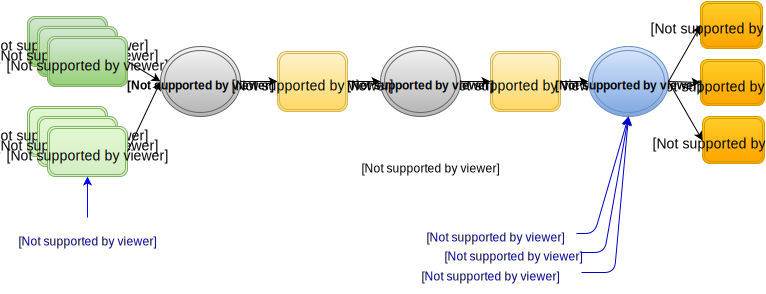

# 操作模板（OPT2）规范

发行人：openEHR规范程序

发布：Release-2.0.6

状态：DEVELOPMENT

修订：[latest_issue]

日期：[latest_issue_date]

关键词：EHR，ADL，AOM，健康记录，原型，约束语言，13606
©2015 - 2017 OpenEHR基金会

openEHR基金会是一个独立的非营利社区组织，通过开源，基于标准的实施，促进消费者和临床医生共享健康记录。

- 许可: 
	- Creative Commons Attribution-NoDerivs 3.0 Unported。 
	- https://creativecommons.org/licenses/by-nd/3.0/
- 支持: 
	- 问题：https：//openehr.atlassian.net/browse/SPECPR/
	- 网址：http：//www.openehr.org/

## 修订记录

- AM Release-2.0.6
	- 0.5.1 (08 Jun 2016)
		- 添加“目的”部分。
	- 0.5.0 (2015年10月28日)
		- 初始写作

## 致谢

### 主要作者

- Thomas Beale，海洋信息学英国; openHHR基金会管理委员会

### 商标

- “Microsoft”和“.Net”是Microsoft Corporation的注册商标。

- “Java”是Oracle Corporation的注册商标

- “Linux”是Linus Torvalds的注册商标。

- 'openEHR'是openEHR基金会的注册商标

- “SNOMED CT”是IHTSDO的注册商标

## 1. 前言

### 1.1. 目的

本文档提供了ADL2工件的操作模板（OPT）的正式规范。 OPT是基于源原型和模板的第一代“编译的”人工制品，其用作进一步下游格式生成（例如模式，API）的起点以及使用原型的操作EHR系统的计算格式。

本规范主要面向软件开发人员。

### 1.2. 相关文件

阅读本文档的前提条件包括：

    - openEHR原型技术概述

相关文档包括：

    - openEHR原型对象模型（AOM2）;

### 1.3. 命名

在本文档中，术语“属性”表示在对象模型中定义的类型的任何存储的属性，包括原始属性和任何种类的关系，例如关联或聚合。 XML“属性”总是被明确称为“XML属性”。

我们还在广义上使用单词“原型”来指定通常被理解为“原型”（临床数据组/数据约束的规范）和“模板”（基于原型的数据集，因为在技术层面， ADL / AOM 2模板实际上只是原型。因此，除非另有说明，否则本说明书中关于“原型”的陈述总是可以理解为也适用于模板。

### 1.4. 状态

此规范处于DEVELOPMENT状态。本文档的开发版本可以在http://www.openehr.org/releases/AM/Release-2.0.6/OPT2.html找到。

已知的遗漏或问题在文本中用“待定”段落表示，如下：

TBD :(例如待定段落）

鼓励用户对这些段落以及主要内容发表评论和/或建议。应在技术邮件列表或规格问题跟踪器上提供反馈。

### 1.5. 工具

存在用于创建和处理原型的各种工具。 ADL Workbench是一个参考编译器，可视化工具和编辑器。 openEHR工具可以从网站下载。源项目可以在openHHR Github项目中找到。

### 1.6. 与OPT的关系'1.4'

本规范描述了基于ADL2 / AOM2的操作模板，而不是原始的OPT，它是基于ADL 1.4原型的XML模式格式。

## 2.概述

操作模板（OPT）是一系列技术文件，它是从源模板和原型在ADL2中表示的，如原型技术概述文档中所述。

### 2.1. OPT的目的

作为工件的操作模板是源归档模板和模板的编译形式，并且由于多种原因是有用的，如下所述。

1. 生产EHR或其他原型驱动的系统可以安全地运行，只使用保证验证的模板和原型。由于安全原因，不应直接使用源文物。 （显然，实验/研究系统可能会有所不同）。

2. 原型之间的专业化关系必须被评估以便产生可用的人工制品，因为这种人工制品的可用形式是“继承 - 扁平化”形式。这正好与面向对象编程中类继承的情况类似：任何类的可执行形式是继承平面形式。因此，可部署形式的原型和模板必须以某种方式从源编译。

3. 通常，总是有可能需要对源伪影进行进一步调整以获得可部署的人工制品。例如，原始原型可以是多种语言，并且具有用于说三个术语的绑定，而最终的伪像通常仅需要一种或两种语言（例如，国家语言和英语），并且仅术语绑定的子集通常需要。 OPT提供了可以进行这些选择的目标人工制品。

4. 最终人工制品（OPT）的具体格式旨在便于实施，而不是人类使用或建模工具;通常这意味着使用诸如XML，JSON或甚至二进制格式的机器格式。在ADL2工具中，OPT可以在ADL，ODIN，JSON，XML和YAML中生成，并且将来可能会添加其他格式。

5.OPT旨在不仅用于生产系统，而且还用作生成新种类的人工制品的其他类型的变换的基础。例如。模板数据模式（TDS，一种XSD），模板数据对象（TDO，部分类），API等。 OPT为这些类型的变换提供了单个标准输入伪像。

### 2.2. OPT的类型

有两种类型的OPT：“raw”和“profiled”。 原始形式可以非正式地被理解为对应于许多源原型和模板的单个大型原型结构，被扁平化和扩展成单个人工制品。 原始OPT包含语言和术语绑定方面的所有可能内容。 下图显示了从原始原型和模板逐步生成这些假象。

图1. OPT工具链

简档OPT是已经移除了一些语言并且删除了一些或所有术语绑定，可能进行的外部术语替换，以及潜在地移除注释部分的OPT。因此，这种形式的OPT在形式上与原始OPT相同，只是具有较少的内容。因此，只需要一个规范来描述这两种形式。

为了防止混淆，使用不同的文件名保存原始和配置的OPT。

因为OPT作为单个独立原型操作，所以它不需要源原型或模板的所有语法或语义特征。因此可以将其理解为类似于顶级（即非专门）原型，具有以下差别：

- 所有原型引用已解析为特定原型标识符，包括完整版本;

- 没有专业化语句 - 一个OPT被认为是一个“顶级”独立的人工制品;

- 在容器属性下的对象节点之中没有兄弟顺序（即之前或之后）标记;

- 没有use_node节点，即所有内部引用已经展开为其目标的副本;

- 所有插入槽和直接外部引用（use_archetype节点）已被解析和替换;

- 移除所有闭合的槽;

- 删除存在匹配{0}（即逻辑删除）的所有属性（C_ATTRIBUTE）节点;

- 所有模板覆盖已应用（平展）;

- 所有引用原型的所有术语段的展平形式都包含在component_terminologies部分中。

注意，在OPT中使用的原型和模板的所有最深特化的标识符在对应结构的根节点处可见，从顶部节点开始。这使得可以通过OPT的检查和直接引用的伪像的检查的组合来检索所涉及的原型和模板的全部，以在适用的情况下获得专业化父节点。

OPT可以以多种形式序列化，包括ADL，XML和JSON。为了方便工具和减少混淆，使用了不同的文件扩展名，形式为.opt（ADL），.optx（XML），.optj等。

## 3. 原始运作模板

'raw'OPT是来自主源模板的OPT处理的第一阶段，以及它引用的所有其他模板和原型。对原型节点和其他原型的所有引用都将被解析，并且结构将完全展平，并删除所有已删除的节点。

### 3.1. 人工结构

由于OPT被认为是“顶级”独立的人工制品，因此没有专业化声明。对于人工制品的“外部”结构没有其他差异，因此其结构与任何顶级原型相同，即在ADL术语中，它遵循以下Antlr4规则：

	adl_operational_template: 'operational_template' '(' qualifiers? ')'
	        ARCHETYPE_HRID
	    'language'
	        odin_text
	    'description'
	        odin_text
	    'definition'
	        cadl_text
	    ('rules'
	        rules_text)?
	    'terminology'
	        odin_text
	    ('annotations'
	        odin_text)?
	    'component_terminologies'
	        odin_text
	    ;

3.2。原型引用

在源原型和模板中找到的对其他原型（通常不包括完整版本信息）的所有引用将解析为完整的原型标识符，并由OPT输出中的这些标识符（保证包括完整的3部分版本）替换。
3.3。平展

OPT的平坦化工艺比AOM规范中描述的产生扁平原型的标准平坦化工艺更广泛。

OPT平整包括以下附加步骤：

    因为在容器属性节点下的对象节点的兄弟集合被完全表示（即，考虑到来自专门的子原型的添加和删除），所以在原始OPT中没有兄弟顺序标记（即，'前'和'后'标记） ;

    use_node内部引用被引用的目标结构的内联副本替换;

    插槽：

        移除所有闭合的槽;

        所有槽填充原型引用被引用解析的原型的内联副本替换;

    从输出中删除所有已删除的节点，即存在匹配{0}的属性（C_ATTRIBUTE）节点和出现匹配{0}的对象（C_OBJECT）节点;

### 3.4. 术语

在OPT平展化过程中，每个扁平成分原型或模板（除根模板之外）的术语部分的平面形式在component_terminologies部分下收集。

## 4. 概要操作模板

“简档”OPT是用于在某些情况下直接使用的技术工件。它是原始OPT的处理形式，其中进行不需要的元素的各种去除，并且将术语参考转换为期望的形式用于最终使用。多个轮廓OPT可以从原始OPT导出。

假设工具提供了指定各种改变的方式，并且这里不对其进行描述。以下仅介绍生成的输出。

### 4.1. 注释删除

可以从原始OPT中删除注释，这将导致输出中注释部分的完全删除。

### 4.2. 语言筛选

由于原型和模板通常可以包含许多语言翻译，并且目标部署环境通常仅被定向到一种或两种语言，过滤可能性之一是去除任何语言（包括原始创作语言）直到极限只剩下一个。

所得的OPT将具有与之前相同的形式，但具有减少的语言翻译。在原型的语言部分中，original_language属性将包含根源模板的原始创作语言（这很容易与大多数引用的原型的语言不同）。

### 4.3. 术语绑定过滤

术语绑定也可以在概要的OPT中全局过滤，直到删除所有绑定。生成的OPT将仅包含未在术语部分中指定用于删除的绑定。

### 4.4. 术语替换

术语相关处理的更复杂的方面与原型数据中将使用什么最终代码有关。在源伪影中，出现两种类型的值编码。第一种情况是用原型局部值集限制的字段，即ac码映射到一组at码，或者指定单个at码。第二种情况是ac代码只绑定到外部值集（通常是大的那些，例如'感染类型'），并且记录在该字段的数据中的值必须是某种外部代码。

第一种情况提供了一种可能的选择 - 原型 - 本地at-codes或外部代码可以使用。根据所需的细粒度控制的级别，可以在几个地方选择对于与内部和外部术语绑定的每个ac码应当使用什么术语。

- 如果我们只需要选择在整个库级别允许使用哪些术语，则选择是通过选择要移除的术语绑定来实现的，如上所述。

- 如果我们需要基于每个OPT决定，即允许/需要的术语可以从一个OPT到下一个OPT不同，它仍然可以是OPT剖析步骤的输入，但是现在它将是每个OPT特有的参数。

- 如果需要节点级控制，则需要在原始OPT中进行选择。注意，尽管一些节点通过一个术语来编码是正常的， HL7词汇，以及其他。 SNBOMED CT，不需要逐个节点选择来实现这一点，因为这些节点的绑定已经陈述了允许的可能性。逐个节点选择仅在需要进一步减少更有限集合的可能性时才需要。如果在单个模板内，一个节点具有对ICD10和SNOMED CT的绑定但是在特定使用中，应该仅在ICD10中编码，但是存在另一个节点，其中应该仅允许来自相同的两个原始可能性的SNOMEDCT。

TBD：目前没有办法在ADL2这样做。使用一组编码节点的路径将是容易实现的，每个编码节点具有在该点允许的术语列表。

然而，做出的选择的结果通过使用正常项约束语法的修改形式在剖析的OPT中表示。这在ADL规范，术语约束和术语集成部分有详细描述。

## 5. 文件格式

### 5.1. 文件命名

### 5.2. 固实格式

#### 5.2.1. ADL

#### 5.2.2. 对象转储格式 - JSON，YAML

#### 5.2.3. XML

最后更新2016-05-18 16:09:44 BST