# 公共信息模型

发行人：openEHR规范程序

发布：版本1.0.3

状态：STABLE

修订：[latest_issue]

日期：[latest_issue_date]

关键词：普通，EHR，参考模型，openehr

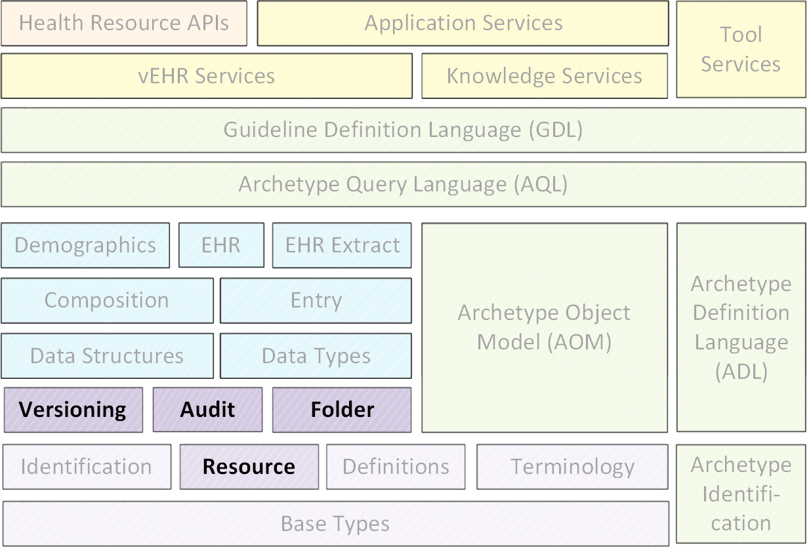

©2003 - 2015 openEHR基金会

openEHR基金会是一个独立的非营利社区组织，通过开源，基于标准的实施，促进消费者和临床医生共享健康记录。

- 许可: 
	- Creative Commons Attribution-NoDerivs 3.0 Unported。 https://creativecommons.org/licenses/by-nd/3.0/
- 支持: 
	- 问题：https：//openehr.atlassian.net/browse/SPECPR/
	- 网址：http：//www.openehr.org/

## 修订记录

- R E L E A S E 1.0.3
	- 2.1.2 (2015年10月12日)
		- SPECRM-21：使PARTICIPATION.mode可选。 4.3.5节更新。
		- SPECRM-28：改进VERSION.uid的文档，以明确id的第一部分是拥有的VERSIONED_OBJECT.uid（SPECPR-90）。
		- SPECRM-34：为VERSIONED_OBJECT.uid添加约束以防止扩展。 （SPECPR-1）。
- R E L E A S E 1.0.2
	- 2.1.1 （2008年12月20日）
		- SPECRM-249：路径和定位器架构概述和公共IM中的轻微错误。标识符元组中元素的正确排序。第6.3.3,6.4.1和6.4.2节。
		- SPECRM-257：更正小的拼写错误并澄清文本。完成ATTESTATION类的目的。正确的resource_description包的UML - make RESOURCE_DESCRIPTION 1. *，AUTHORED_RESOURCE abstract。
- R E L E A S E 1.0.1
	- 2.1.0 （2007年4月8日）
		- SPEC-209：稍作更改以正确定义AUTHORED_RESOURCE.current_revision。添加到REVISION_HISTORY的函数;已添加AUTHORED_RESOURCE.current_revision后置条件。
		- SPEC-206：更改LOCATABLE.item_at_path以返回ANY。
		- SPEC-200：正确的版本1.0印刷错误。在VERSION中添加缺失不变量，将contribution.type限制为“CONTRIBUTION”。修复LOCATABLE函数中的前置和后置条件。
		- 修复时区max / min值和不变量中的错误。
		- SPEC-203：1.0版的说明文字改进。将配置管理和版本控制的说明材料移至架构概述。
		- SPEC-202：更正VERSION.preceding_version_id中的小错误。将preced_version_id重命名为preceding_version_uid。将preceding_version_uid不变量添加到VERSION <T>。
		- SPEC-197：将LOCATABLE.uid更改为HIER_OBJECT_ID。
		- SPEC-214：对EERR准备的VERSION的更改提取升级。将lifecycle_state添加到VERSION <T>，在VERSIONED_OBJECT <T>上添加了额外的函数。将更正和添加的提交函数修改为VERSIONED_OBJECT。添加了ATTESTATION.attested_view（符合CEN EN13606-1）。
		- SPEC-212：允许VERSION.data可选，以启用逻辑删除。
		- SPEC-130：LOCATABLE和ARCHETYPED类中的正确的安全详细信息。删除ARCHETYPED.access_control。
		- SPEC-219：使用常量而不是文字来引用RM中的术语。
		- SPEC-231：将RESOURCE_DESCRIPTION.details从List更改为Hash。
		- SPEC-235：进行仅证明提交需要贡献。
		- SPEC-239：添加OBJECT_VERSION_ID和HIER_OBJECT_ID的通用父类型。
		- SPEC-243：将template_id添加到ARCHETYPED类。
		- SPEC-244：将LOCATABLE路径函数分隔为PATHABLE类。
		- SPEC-166：将可查看的文档形式添加到COMPOSITION。
		- SPEC-246：更正openEHR术语表。
- R E L E A S E 1.0
	- 2.0 （2006年2月2日）
		- SPEC-147：使DIRECTORY可重复使用。添加新目录包。
		- SPEC-162.没有人口统计数据时允许方标识符。
		- SPEC-167.添加AUTHORED_RESOURCE类。
		- SPEC-179.将AUDIT_DETAILS移动到通用包;添加REVISION_HISTORY。
		- SPEC-182：合理化VERSION.lifecycle_state和ATTESTATION.status。
		- SPEC-65.将REVISION_HISTORY添加到change_control包。
		- SPEC-187：在DIRECTORY类中更正正确的建模错误并重命名。
		- SPEC-163：为原始和网关系统添加标识符到FEEDER_AUDIT。
		- SPEC-165.在FEEDER_AUDIT和AUDIT_DETAILS中澄清对system_id的使用。
		- SPEC-190.将VERSION_REPOSITORY重命名为VERSIONED_OBJECT。
		- SPEC-161.支持分布式版本控制。添加到change_control包。将REVISION_HISTORY_ITEM.revision重命名为version_id，并将类型更改为OBJECT_VERSION_ID。
- R E L E A S E 0.96
	- 1.6.2 （2005年6月10日）
		- SPEC-159.改进在change_control包中使用ATTESTATION的说明。
- R E L E A S E 0.95
	- 1.6.1 (2005年2月22日)
		- SPEC-48.文件的预发布审查。固定UML在图8的版本控制的非正式模型。
	- 1.6 (2004年12月10日)
		- SPEC-108.轻微更改为change_control包。
		- SPEC-24.将含义还原为STRING，并重命名为arch
		- SPEC-97.在公共模型中修正版本图中的错误。
		- SPEC-99. PARTICIPATION。图中的功能类型与规格不同步。
		- SPEC-116.添加PARTICIPATION.function词汇和不变。
		- SPEC-118.使包名称为小写。改进识别部分的呈现;将一些文本移动到数据类型IM文档，基本包。
		- SPEC-111.移动标识包以支持。
- R E L E A S E 0.9
	- 1.5 （2004年3月09日）
		- SPEC-80.删除ARCHETYPED.concept - 数据中不需要
		- SPEC-81. LINK应该是单向的。 SPEC-83. RELATED_PARTY.party应该是可选的。 - SPEC-85. LOCATABLE.synthesised不需要。添加FEEDER_AUDIT.change_type的词汇表。 
		- SPEC-86. LOCATABLE.presentation不需要。
		- SPEC-91.纠正使用CODE_PHRASE和DV_CODED_TEXT时的异常。已更改PARTICIPATION.mode，将ATTESTATION.status，RELATED_PARTY.relationship，VERSION_AUDIT.change_type，FEEDER_AUDIT.change_type更改为DV_CODED_TEXT。
		- SPEC-94.将生命周期状态属性添加到VERSION;正确DV_STATE。
		- 使用ISE Eiffel 5.4正式验证。
	- 1.4.12 （25 Feb 2004）
		- SPEC-71.允许版本ID在TERMINOLOGY_ID中是可选的。
		- SPEC-44.将反向引用从VERSION_REPOSITORY <T>添加到所有者对象。
		- SPEC-63. ATTESTATION应该有一个状态属性。
		- SPEC-46.重命名COORDINATED_TERM和DV_CODED_TEXT.definition。
	- 1.4.11 （2003年11月2日）
		- SPEC-56. common.VERSION类中的引用应该是OBJECT_REF。
	- 1.4.10 （2003年10月21日）
		- SPEC-45.删除VERSION_REPOSITORY.status。
	- 1.4.9 （2003年10月9日）
		- SPEC-25.允许ATTESTATION验证组合物的部分。由于CEN TC / 251联合WGM进行的更改，罗马，2003年2月。
		- SPEC-43.将外部包移动到Common RM并重命名为Identification（包含SPEC-36 - 添加HIER_OBJECT_ID类，使OBJECT_ID类抽象）。
	- 1.4.8 (04 Oct 2003)
		- SPEC-41.在openEHR文档中可视化区分基本类型。
	- 1.4.7 （2003年9月15日）
		- SPEC-13.根据CEN ENV13606重命名关键类。
	- 1.4.6 （2003年6月20日）
		- SPEC-12.将演示文稿属性添加到LOCATABLE。
		- SPEC-27.将feeder_audit移动到LOCATABLE以与CEN 13606版本兼容。添加新类FEEDER_AUDIT。
	- 1.4.5 （2003年6月10日）
		- SPEC-20.将VERSION.charset移动到DV_TEXT，将区域移动到TRANSACTION。删除VERSION.language。
	- 1.4.4 (2003年4月11日)
		- SPEC-7.将RELATED_PARTY类添加到通用包。
		- SPEC-17.将VERSION.parent_version_id重命名为preceding_version_id。
	- 1.4.3 (2003年3月18日)
		由于SPEC-3，SPEC-4的主要更改。 ARCHETYPED类不再继承自LOCATABLE，现在通过关联关联。重新设计Change Control包。文档结构改进。 （正式验证）
	- 1.4.2 (2003年2月25日)
		- 将外部程序包移动到支持RM。更正了CONTRIBUTION。描述为DV_TEXT。使PARTICIPATION.time可选。 （正式验证）。
	- 1.4.1 (2003年2月18日)
		- 使用ISE Eiffel 5.2正式验证。更正了VERSIONABLE.language，charset，territory的类型。已添加ARCHETYPED.uid：OBJECT_ID。将ARCHETYPE_ID.rm_source重命名为rm_originator，将rm_level重命名为rm_concept;添加archetype_originator。重写原型ID部分。将PARTICIPATION.mode`更改为'COORDINATED_TERM＆fixed invariant。
	- 1.4 (2003年2月8日)
		- CEN WG会议后的更改2003年2月罗马。将ARCHETYPED.meaning从STRING更改为DV_TEXT。添加了CONTRIBUTION。名称不变。已移除AUTHORED_VA和ACQUIRED_VA审核类型，将Feed审核移至EHR RM。 VERSIONABLE.code_set已重命名为charset。修复了OBJECT_ID.context_id的前/后条件，添加了OBJECT_ID.has_context_id。更改了TERMINOLOGY_ID字符串语法。
	- 1.3.5 （2003年1月3日）
		- 已从archetype_id中移除段图和类文本中的校正不一致。
	- 1.3.4 (2003年1月3日)
		- 已从VERSIONABLE继承到ARCHETYPED。
	- 1.3.3 (2002年11月17日)
		- 次要更正：OBJECT_ID;更改TERMINOLOGY_ID的语法。校正图6.
	- 1.3.2 （2002年11月8日）
		- 添加通用包;添加PARTICIPATION并更改并移动了ATTESTATION类。
	- 1.3.1 （2002年10月22日）
		- 已移除EXTERNAL_ID.iso_oid。将EXTERNAL_ID重新模型化为新类 - OBJECT_REF和OBJECT_ID。重新配置所有更改控件类。
	- 1.3 (2002年10月22日)
		- 已将ARCHETYPE_ID.iso_oid移动到EXTERNAL_ID。 DV_LINK不再是数据类型;重命名为LINK。
	- 1.2 （2002年10月11日）
		- 删除结构包到自己的文档。改进的CM图。
	- 1.1 (2002年9月16日)
		- 已移除HCA_ID。包括EHR RM的空间包。将“SPATIAL”重命名为“STRUCTURE”。
	- 1.0 (26 August 2002)
		- 取自EHR RM。

## 致谢

本文件所报告的工作由下列组织提供资金：

- 伦敦大学学院 - 健康信息学和多专业教育中心（CHIME）;

- 海洋信息;

- 分布式系统技术中心（DSTC），通过澳大利亚联邦政府总理和内阁部合作研究中心计划。

特别感谢CHIME负责人David Ingram教授，他提供了自GEHR（1992年）时代以来的愿景和合作的工作环境。

### 商标

- 'openEHR'是openEHR基金会的商标

- “Java”是Oracle Corporation的注册商标

- “Microsoft”是Microsoft Corporation的商标

## 1.前言

### 1.1.目的

本文档描述了openEHR公共参考模型的体系结构，其中包含其他openEHR参考模型使用的模式。

目标受众包括：

- 生产卫生信息学标准的标准机构;

- 使用openEHR的学术团体;

- 开源医疗保健社区;

- 解决方案供应商;

- 医疗信息学家和临床医生对健康信息感兴趣。

- 健康数据管理器。

### 1.2.相关文件

阅读本文档的前提条件包括：

- openEHR架构概述（[openehr_overview]）;

相关文档包括：

- openEHR支持信息模型（[openehr_rm_support]）。

- openEHR数据类型信息模型（[openehr_rm_data_types]）。

### 1.3.状态

此规范处于STABLE状态。本文档的开发版本可以在http://www.openehr.org/releases/RM/latest/common.html找到。

已知的遗漏或问题在文本中用“待定”段落表示，如下：

TBD :(例如待定段落）

鼓励用户对这些段落以及主要内容发表评论和/或建议。应在技术邮件列表或规格问题跟踪器上提供反馈。

### 1.4.一致性

数据或软件工件与openEHR参考模型规范的一致性通过该工件相对于相关openEHR实现技术规范（ITS）（例如IDL接口或XML模式）的形式测试来确定。由于ITS是来自参考模型的形式化的自动推导，ITS一致性指示RM一致性。

### 2.概述

openEHR公共信息模型定义了在较高级别openEHR模型中使用的各种抽象概念和设计模式。

原型包通过一些设计原则，以“两级”建模的概念为中心。这些原理在[Beale\_2000]中有详细描述。通用包包含形成“分析模式”的类，这些类在整个域中是通用的，主要与从其他数据（包括PARTICIPATION，PARTY\_PROXY，ATTESTATION等）中引用人口统计实体有关。

目录包提供了一个简单的可重用的版本化文件夹结构的抽象。

change\_control包定义了随着时间的推移对逻辑存储库（例如EHR）的更改的广义语义。此类存储库中的每个项目都受版本控制，以允许整个存储库及时正确地版本化。所描述的语义是响应GEHR [GEHR\_1995]和ISO技术规范18308 [ISO\_18308]中定义的医学要求。这两个要求规范特别提到了健康记录的版本控制。

资源包定义在线创作资源（例如文档）的语义，并支持多语言翻译，描述性元数据和修订历史。

## 3.原型包

###3.1.概述

原型包定义了核心类型PATHABLE，LOCATABLE，ARCHETYPED和LINK。它在common.archetyped包中进行说明。

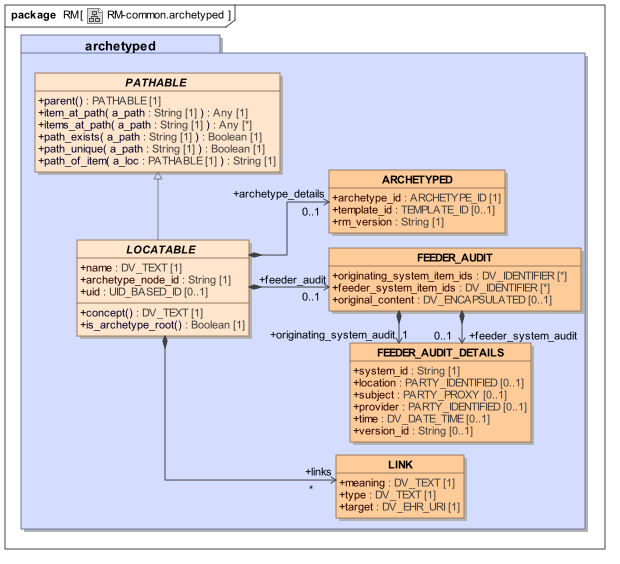

#### 3.1.1. PATHABLE类

PATHABLE类定义了openEHR引用模型中几乎所有类使用的路径能力，主要通过继承LOCATABLE。 PATHABLE对象的定义特性是它们可以使用路径定位子对象，并且他们知道它们在组合层次结构中的父对象。父特征在模型中被定义为抽象的，并且可以以任何方式实现。

许多函数提供了路径功能，其中item\_at\_path（）和items\_at\_path（）是关键函数。前者返回对应于唯一路径的项目，即，将数据结构解析为单个节点的路径。后者返回与非唯一路径对应的项目列表。这些函数可以使用以下模式安全地使用，但也可以在不检查路径的有效性的情况下使用，如果这在代码中是先验已知的话。

	if path_exists（a_path）{
	    如果path_unique（a_path）{
	        x：= item_at_path（a_path）
	            //处理一个项目
	        }}
	    else {
	        list_of_x：= items_at_path（a_path）
	        //迭代列表
	    }}
	}}

#### 3.1.2. LOCATABLE类

openEHR参考模型中的大多数类继承自LOCATABLE类，它定义了“在原型结构中的可定位性”的概念。 LOCATABLE定义了运行时名称和archetype\_node\_id。 archetype\_node\_id是节点的标准化语义代码，来自用于创建数据的原型中的对应节点。唯一的例外是数据中的原型根点，其中archetype\_node\_id携带字符串形式的原型标识符，而不是原型中的内部节点标识符。 LOCATABLE还提供属性archetype\_details，它对数据中的原型根点是非空的，并且携带与根点相关的元数据。 name属性包含在运行时创建的名称。任何节点的'意义'正式来自原型，通过从原型本体部分，以所需的语言获取archetype\_node\_id代码的文本值。

LOCATABLE实例中的名称和archetype\_node\_id值在语义上通常是相同的，但可能不同。例如，在“问题/ SOAP”部分（即标题）中，问题级别的节的名称可能是“糖尿病”，但其含义可能是“问题”。除非明确设置，否则name的默认值应假定为有关节点上archetype\_node\_id代码的本地语言的文本值。
唯一节点标识

LOCATABLE后代可能有一个包含GUID的uid。在当前openEHR体系结构中，不需要GUID来标识数据节点，因为路径用于引用顶层结构（即组合体等）内部的所有节点。因此，EHR的部分之间的所有引用以LOCATABLE\_REFs或DV\_EHR\_URIs（前者是对附加有路径的OBJECT\_VERSION\_ID的引用;后者是字符串URI形式）来表示。这将允许例如一个条目在2004年4月12日的实验室测试的版本化组合物的版本2中的另一个条目中引用血清钠值。在大多数openEHR EHR系统中，uid属性在大多数EHR数据中通常为空。

异常是顶级类型，如COMPOSITION，EHR\_STATUS，PARTY等，为此建议将uid值设置为所拥有的VERSION对象的uid属性的副本。这使得能够以序列化形式容易地识别独立的顶级对象。

LOCATABLE.uid的另一个用途是在EHR Extracts中，它包含EHR内容的序列化表达式。在提取中，可以在一些或所有节点上将uid设置为通过将封闭版本对象（即VERSION.uid）的uid和唯一运行时路径连接到特定节点而生成的值。这对于接收机系统来说可能是有用的，以用于在与发送机或另一系统通信时引用特定数据节点。然而，uid的这种使用不是强制性的，因为对于提取项目中的每个节点，uid可以在任何时间生成（包括在接收机系统处）。
注意
在openEHR体系结构中的一些类，它们不继承LOCATABLE但需要一个uid，例如VERSIONED_OBJECT，VERSION等，显式地定义他们自己的uid属性。

#### 3.1.3.馈线系统审计

EHR的任何部分中的数据可以从馈线系统获得，即不服从openEHR的版本控制，审计和内容语义的源系统（EHR中源自另一个openEHR系统的数据被处理公共IM，更改控制部分）。 FEEDER\_AUDIT类定义审计跟踪的语义，该跟踪被构造用于描述已经转换为openEHR格式并提交给系统的数据的来源。 c的数据转换问题有很多方面

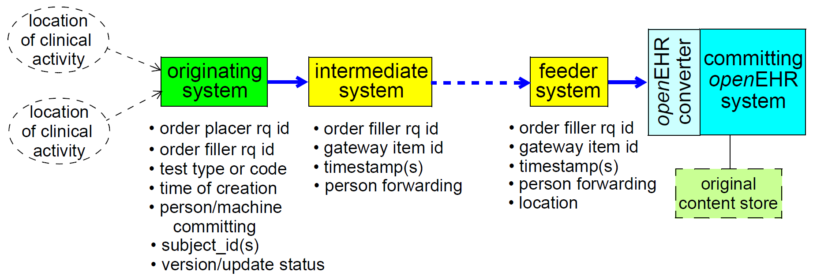

openEHR Feeder审计模型的基本思想是，有两组元数据，应该记录一个导入的信息项。第一个是关于其创建的医学法律元数据：原始系统，创建它以及创建时间。第二种是为来自始发和馈线系统以及潜在地在馈线链中的其他中间系统的项目识别元数据，必要时支持重复检测，版本检测等等。
元数据

关于所接收项目的潜在可用医学元数据如下：

- 原始系统的标识符（项目最初提交的位置）;

- 发起系统中的信息项的标识符;

- 承办该项目的代理人;

- 提交或创建项目的时间戳;

- 类型的变化，例如。初始创建，校正（包括子部分的删除），逻辑删除（例如由于取消订单）;

- 信息状态，例如临时

- 版本ID，其中支持版本控制。

上述信息等同于在组合版本中提交在openEHR系统中创建的信息时捕获的审计跟踪和版本控制数据。

可能需要各种识别信息，包括以下内容：

- 通常记录受试者标识符（通常多于一个，例如国家患者id，GP的本地患者id，实验室的本地患者id），并且可能为了可追溯性目的而需要;

- 主题标识符可以将除记录主题之外的某人标识为进入项目的主题;

- 馈线系统的位置;

- 标识符（其可以是在馈线系统位置处的许多中的一个）;

- 识别馈送系统用于所讨论的物品（通常称为“登记号”）;

- 该信息是响应的请求或订单的标识符（有时称为“安置者的请求id”）;

- 由始发系统使用的信息项的标识符（有时称为“填充者的请求id”）;

- 由馈线系统分配给该项目的时间戳。

这些信息中的一些或全部通常足以执行如下的多个任务。
可追溯性

第一个任务是通过卫生计算基础设施支持对信息项目的路径的医学法律调查。这需要有足够的标识符信息的可用性，以便可以跟踪信息项的来源。应使用可用的主题标识符，以确保接收的数据进入正确的EHR，确保可以实现客户端目录中的相关查找或其他查找机制。再次，在极少数情况下，输入数据项的主题不一定是EHR的主题 - 测试结果可以从将被存储在患者的EHR中的相关人或其他关联人做出。
版本检测

第二种是检测项目的新版本（例如微生物学测试结果的临时和最终版本）。这通常可以通过使用各种标识符以及发起系统版本id和/或内容状态（临时，最终等）来实现。即使在内容没有改变的情况下（例如微生物学测试，其中结果在中间和最终结果中“没有生长”），应当为每个接收的版本创建新的openEHR组合物版本。

##### 重复检测

另一个任务是消除来自馈线系统的重复（通常由发送期间的网络连接的故障引起）。然而在某些情况下，重复项被馈送系统错误地给予新的ID，给予接收者对新信息的印象。在这种情况下，可能需要另一项元数据：

- 哈希或内容签名（最有可能由转换器）从接收的信息。

##### 差分编码数据

另一个问题是，始发系统可以发送项目的新版本，它们本身不完整，即只包括相对于同一项目的先前发送的新的或改变的元素。一个示例是向HL7v2血液测试消息发送校正的系统，其中校正仅包括“血清钠”数据项。在这种情况下，在openEHR转换器组件中将需要特殊处理，以便在接收到时从差分数据重新产生完整数据项。这种处理还可能必须考虑已删除的项目。

总之，Feeder审计类设计试图适应在任何特定情况下相关的上述元数据的记录。这取决于openEHR转换前端组件的设计以及对情况的适当分析，以确定哪些标识符与可跟踪性的需求密切相关。一般来说，任何具有医学 - 法律意义的元数据都应该在可用的地方被捕获。
在转换的数据中使用馈送器审计

虽然openEHR转换器的设计超出了当前文档的范围，但是值得考虑一个通用的设计方法，并且FEEDER\_AUDIT类适合。转换非openEHR数据（如HL7v2消息，关系数据等）的有效方法，是在两个步骤。第一个是使用'legacy archetypes'执行'语法'转换到包含GENERIC\_ENTRY类的实例（在Integration IM中描述）的组合。结果数据库将包含包含GENERIC\_ENTRY实例的版本化组合;逻辑上此数据库不包含EHR，而只是外部数据转换为openEHR计算形式。相关的FEEDER\_AUDIT实例应附加到包含相应GENERIC\_ENTRY实例的组合。第二步是根据标准化临床原型对ENTRY，即观察，评价，指导和行动的亚型进行“语义”转换。有多种可能性与Feeder审核有关。最终实例所需的最小馈线器审计包含源系统审计信息，但不包含与馈线或中间系统有关的信息。这将满足医疗法律需要。或者，可以进行完整的复制，即使馈线相关的元数据可能仅在转换环境中使用。饲养者审核在EHR中的表现可能取决于当地的立法，规范或其他因素。替代的转换方法也是可能的，其中不存在中间形式的数据。

##### 结构对应

不能保证记录在馈线系统中的信息的粒度遵守条目，组成等的规则。作为一个条件，馈线信息可以对应于在openEHR模型中定义的任何级别的信息。为了能够正确地记录馈线审计信息，模型必须能够将一个审计跟踪与任何粒度的对象相关联。因此，馈线审计信息通过feeder\_audit属性附加到LOCATABLE类，尽管设计上优选将其附加到组合物的等同物或至少等价的原型实体（即组合物，区域树和条目）。它的常用用法是将其附加到它适用的最外面的对象。换句话说，在大多数情况下，在遗留数据转换过程期间，组合的整体仅需要一个FEEDER\_AUDIT来记录其起源。在特殊情况下，其中馈线数据接近实时，例如，从ICU数据库，可能需要为合成的部分生成单独的FEEDER\_AUDIT对象;在这种情况下，每个提交将创建一个组合的版本的堆栈，其中越来越多的FEEDER\_AUDIT对象附加到内部数据节点，每个文档记录上次导入的数据。

馈送器审核信息作为合成数据的一部分，而不是版本提交的审核跟踪的一部分，因为它在逻辑合成的版本化过程中保持相关，即当创建新版本时，馈送器信息是作为当前版本的一部分保留以供查看和可能修改，就像其余内容一样。如果内容的主要部分被如此大幅度地修改，使得馈线审计不相关，它也可以被移除。馈线和遗留系统的第二个结果是，结构数据项可能需要被合成以便创建有效结构，即使源系统不具有它们。例如，系统可以具有集群和元素的等效数据（参见openEHR数据结构IM或CEN EN13606），但没有条目，节或其他更高级数据项;这些必须在转化期间合成。为了指示数据节点的合成，将FEEDER\_AUDIT实例附加到所讨论的LOCATABLE，并且将其change\_type设置为“合成”。

##### 原始内容

到目前为止描述的模型的特征允许内容的准确参考，如在源系统和中间馈线系统中已知的。 FEEDER\_AUDIT类的另一个特征是，original\_content属性允许原始内容项本身被包括在线或被指向。如果使用链路，则通常情况是内容在与接收系统相关联的商店中，例如消息或文档数据库。内容也可以包括在内联中。由于original\_content链接在FEEDER\_AUDIT对象上，因此如果需要，可以在同一个生成的合成中使用多个。可以认为优选在顶部节点（即，组合节点）仅附加单个链路，因为这在整个组合与整个文档或消息之间建立了基本等效。

### 3.2.类定义

#### 3.2.1. PATHABLE类

<table>
	<tr>
		<td>类</td>
		<td colspan="2">PATHABLE（abstract）</td>
	</tr>
	<tr>
		<td>描述</td>
		<td colspan="2">PATHABLE类定义了openEHR引用模型中几乎所有类使用的路径能力，主要通过继承LOCATABLE。 PATHABLE对象的定义特性是它们可以使用路径定位子对象，并且他们知道它们在组合层次结构中的父对象。父特征在模型中被定义为抽象的，并且可以以任何方式实现。</td>
	</tr>
	<tr>
		<td>函数</td>
		<td>签名</td>
		<td>含义</td>
	</tr>
	<tr>
		<td></td>
		<td>parent：PATHABLE</td>
		<td>组合层次结构中此节点的父节点。</td>
	</tr>
	<tr>
		<td></td>
		<td>item_at_path（a_path：String）：任意前：path_unique（a_path）</td>
		<td>路径上的项目（相对于此项目）;仅对唯一路径有效，即唯一解析为单个项目的路径。</td>
	</tr>
	<tr>
		<td></td>
		<td>items_at_path（a_path：String）：List <Any></td>
		<td>与非唯一路径对应的项目列表。</td>
	</tr>
	<tr>
		<td></td>
		<td>path_exists（a_path：String）：Boolean前：不是a_path.is_empty</td>
		<td>如果数据中存在相对于当前项目的路径，则为true。</td>
	</tr>
	<tr>
		<td></td>
		<td>path_unique（a_path：String）：Boolean前：path_exists（a_path）</td>
		<td>如果路径对应于数据中的单个项目，则为true。</td>
	</tr>
	<tr>
		<td></td>
		<td>path_of_item（a_loc：PATHABLE）：String</td>
		<td>相对于此原型结构的根的项的路径。</td>
	</tr>
</table>

#### 3.2.2. LOCATABLE类

<table>
	<tr>
		<td>类</td>
		<td colspan="2">LOCATABLE（abstract）</td>
	</tr>
	<tr>
		<td>描述</td>
		<td colspan="2">可以进行原型设计的所有信息模型类的根类。 openEHR参考模型中的大多数类继承自LOCATABLE类，它定义了原型结构中的可定位性概念。 LOCATABLE定义运行时名称和rchetype_node_id。</td>
	</tr>
	<tr>
		<td>继承</td>
		<td colspan="2">pATHABLE</td>
	</tr>
	<tr>
		<td>属性</td>
		<td>签名</td>
		<td>含义</td>
	</tr>
	<tr>
		<td>1..1</td>
		<td>名称：DV_TEXT</td>
		<td>此片段的运行时名称，用于构建运行时路径。这是通过临床应用或批处理过程提供的用于命名该EHR构建体的术语：其在EHR中的保留忠实地保留原始标签，通过该原始标签，该条目对于最终用户是已知的。</td>
	</tr>
	<tr>
		<td>1..1</td>
		<td>archetype_node_id：String</td>
		<td>
<pre>
从其生成原型获取的此节点的设计时原型ID;用于构建原型路径。始终采用at代码的形式，例如at0005.该值使得能够通过参考生成原型本地本体来生成该节点的“标准化”名称。

在原型根点处，此属性的值始终是在archetype\_details对象中找到的archetype\_id的字符串形式。
</pre>
		</td>
	</tr>
	<tr>
		<td>0..1</td>
		<td>uid：UID_BASED_ID</td>
		<td>原型结构的根点的可选全局唯一对象标识符。</td>
	</tr>
	<tr>
		<td>0..1</td>
		<td>链接：列表<LINK></td>
		<td>指向其他原型结构（其根对象继承自ARCHETYPED的数据，例如ENTRY，SECTION等）的链接。链接可以是其他组合物中的结构。</td>
	</tr>
	<tr>
		<td>0..1</td>
		<td>archetype_details：ARCHETYPED</td>
		<td>此节点上使用的原型的详细信息。</td>
	</tr>
	<tr>
		<td>0..1</td>
		<td>feeder_audit：FEEDER_AUDIT</td>
		<td>来自非开放式EHR系统的审计跟踪，原始提交形成该节点的内容的信息，或来自已合成该节点的转换网关。</td>
	</tr>
	<tr>
		<td>函数</td>
		<td>签名</td>
		<td>含义</td>
	</tr>
	<tr>
		<td></td>
		<td>概念：DV_TEXT</td>
		<td>原型作为一个整体的临床概念（=从根节点的archetype_node_id'导出）</td>
	</tr>
	<tr>
		<td></td>
		<td>is_archetype_root：Boolean</td>
		<td>如果此节点是原型结构的根，则为true。</td>
	</tr>
	<tr>
		<td>不变</td>
		<td colspan="2">Links_valid：links / =虚空意味着不links.is_empty</td>
	</tr>
	<tr>
		<td></td>
		<td colspan="2">Archetyped_valid：is_archetype_root xor archetype_details = Void</td>
	</tr>
	<tr>
		<td></td>
		<td colspan="2">Archetype_node_id_valid：not archetype_node_id.is_empty</td>
	</tr>
</table>

#### 3.2.3. ARCHETYPED类

<table>
	<tr>
		<td>类</td>
		<td colspan="2">ARCHETYPED</td>
	</tr>
	<tr>
		<td>描述</td>
		<td colspan="2">
<pre>
原型作为由参考模型定义的实例的特定结构的配置基础。为了使原型能够用于创建有效数据，参考模型中的关键类作为原型的根节点;因此，这些类具有设置的archetype\_details属性。

ARCHETYPED类的实例包含相关的原型标识信息，允许生成原型与数据实例匹配。
</pre>
		</td>
	</tr>
	<tr>
		<td>继承</td>
		<td colspan="2"></td>
	</tr>
	<tr>
		<td>属性</td>
		<td>签名</td>
		<td>含义</td>
	</tr>
	<tr>
		<td>1..1</td>
		<td>archetype_id：ARCHETYPE_ID</td>
		<td>全局唯一原型标识符。</td>
	</tr>
	<tr>
		<td>0..1</td>
		<td>template_id：TEMPLATE_ID</td>
		<td>全局唯一模板标识符，如果模板在结构中的此时是活动的。通常，模板将仅用于顶级结构的顶部，但是对于较低级别的模板存在可能性。</td>
	</tr>
	<tr>
		<td>1..1</td>
		<td>rm_version：String</td>
		<td>用于创建此对象的openEHR参考模型的版本。以释放版本字符串表示，例如1.0，1.2.4.</td>
	</tr>
	<tr>
		<td>不变</td>
		<td colspan="2">Rm_version_valid：not rm_version.is_empty</td>
	</tr>
</table>

3.2.4. LINK类

<table>
	<tr>
		<td>类</td>
		<td colspan="2">LINK</td>
	</tr>
	<tr>
		<td>描述</td>
		<td colspan="2">
<pre>
LINK类型定义两个项目之间的逻辑关系，例如两个ENTRY或ENTRY和COMPOSITION。链接可以跨组合和跨EHR使用。链接可以潜在地在内部（即非原型根）节点之间使用，虽然这可能在原型中被防止。多个LINK可以附加到任何原型结构的根对象，以产生1→N链接的效果。

原型的内容元素（例如ENTRY）之间的1：1和1：N关系可以通过分别使用一个或多于一个的DV_LINK来表示。链接链可用于查看问题线程或项目的其他逻辑分组。

链接应该在原型结构之间，即在表示完整域概念的对象之间，因为整个概念的子元素之间的关系不一定有意义，并且可能是彻头彻尾的混乱。敏感链接仅存在于整个ENTRY，SECTION，COMPOSITION等等之间。
</pre>
		</td>
	</tr>
	<tr>
		<td>继承</td>
		<td colspan="2"></td>
	</tr>
	<tr>
		<td>属性</td>
		<td>签名</td>
		<td>含义</td>
	</tr>
	<tr>
		<td>1..1</td>
		<td>含义：DV_TEXT</td>
		<td>用于描述关系，通常在临床术语中，如响应（测试结果和顺序之间的关系），后续等等。这样的关系可以表示信息片段之间的任何临床上有意义的连接。意义的值包括附件C，ENV 13606 pt 2中描述的一般，文档和报告，组织，临床，环境和视图管理类别。</td>
	</tr>
	<tr>
		<td>1..1</td>
		<td>类型：DV_TEXT</td>
		<td>type属性用于指示链接种类的临床或域级含义，例如问题或问题。如果类型值被适当地设计，它们可以由EHR提取的请求者使用以对必须遵循的链接进行分类，并且当创建提取时可以断开链接。</td>
	</tr>
	<tr>
		<td>1..1</td>
		<td>target：DV_EHR_URI</td>
		<td>逻辑对象在链接关系中，根据意义属性的语言意义。</td>
	</tr>
</table>

#### 3.2.5. FEEDER\_AUDIT类

<table>
	<tr>
		<td>类</td>
		<td colspan="2">FEEDER_AUDIT</td>
	</tr>
	<tr>
		<td>描述</td>
		<td colspan="2">FEEDER_AUDIT类定义审计跟踪的语义，该跟踪被构造用于描述已经转换为openEHR格式并提交给系统的数据的来源。</td>
	</tr>
	<tr>
		<td>属性</td>
		<td>签名</td>
		<td>含义</td>
	</tr>
	<tr>
		<td>0..1</td>
		<td>originating_system_item_ids：List <DV_IDENTIFIER></td>
		<td>用于在始发系统中的项目的标识符，例如填料和沉积物。</td>
	</tr>
	<tr>
		<td>0..1</td>
		<td>feeder_system_item_ids：List <DV_IDENTIFIER></td>
		<td>用于馈送系统中的项目的标识符，其中馈送系统与始发系统不同。</td>
	</tr>
	<tr>
		<td>0..1</td>
		<td>original_content：DV_ENCAPSULATED</td>
		<td>可选的内联包含或引用与此节点上的openEHR内容对应的原始内容。通常是对与EHR相关联的持久性存储中的文档或消息的URI引用。</td>
	</tr>
	<tr>
		<td>1..1</td>
		<td>originating_system_audit：FEEDER_AUDIT_DETAILS</td>
		<td>来自始发系统的信息项的任何审核信息。</td>
	</tr>
	<tr>
		<td>0..1</td>
		<td>feeder_system_audit：FEEDER_AUDIT_DETAILS</td>
		<td>来自馈线系统的信息项的任何审计信息，如果与始发系统不同。</td>
	</tr>
</table>

#### 3.2.6. FEEDER\_AUDIT\_DETAILS类

<table>
	<tr>
		<td>类</td>
		<td colspan="2">FEEDER_AUDIT_DETAILS</td>
	</tr>
	<tr>
		<td>描述</td>
		<td colspan="2">供料系统链中任何系统的审计详细信息。此处的审计详细信息指的是创建审计所附属的信息项的人/地点/时间的一般概念。没有一个属性被定义为强制性的，然而，在不同的场景中，属性的各种组合通常是强制性的。这可以通过在遗留原型中指定馈送器审计详细信息来控制。</td>
	</tr>
	<tr>
		<td>继承</td>
		<td colspan="2"></td>
	</tr>
	<tr>
		<td>属性</td>
		<td>签名</td>
		<td>含义</td>
	</tr>
	<tr>
		<td>1..1</td>
		<td>system_id：String</td>
		<td>处理信息项的系统的标识符。</td>
	</tr>
	<tr>
		<td>0..1</td>
		<td>位置：PARTY_IDENTIFIED</td>
		<td>处理项目的组织中特定地点/设施的标识符。对于可计算性，该标识符需要例如。可以包括在PARTY_IDENTIFIED对象的标识符列表中的PKI标识符。</td>
	</tr>
	<tr>
		<td>0..1</td>
		<td>主题：PARTY_PROXY</td>
		<td>接收信息项主题的标识符。</td>
	</tr>
	<tr>
		<td>0..1</td>
		<td>供应商：PARTY_IDENTIFIED</td>
		<td>创建，提交，转发或以其他方式处理项目的可选提供商。</td>
	</tr>
	<tr>
		<td>0..1</td>
		<td>时间：DV_DATE_TIME</td>
		<td>处理项目的时间。对于发端系统，这将是创建时间，对于中间馈线系统，这将是加入时间或其他处理时间（如果可用）。</td>
	</tr>
	<tr>
		<td>0..1</td>
		<td>version_id：String</td>
		<td>系统中使用的任何标识符，例如“临时”，“最终”或数字版本（如果可用）。</td>
	</tr>
	<tr>
		<td>不变</td>
		<td colspan="2">System_id_valid：not system_id.is_empty</td>
	</tr>
</table>

## 4.通用包

### 4.1.概述

本节中提出的类是概念的抽象概念，它是健康领域（和最可能的其他领域）的通用模式，例如“参与”和“证明”。通用集群如下所示。

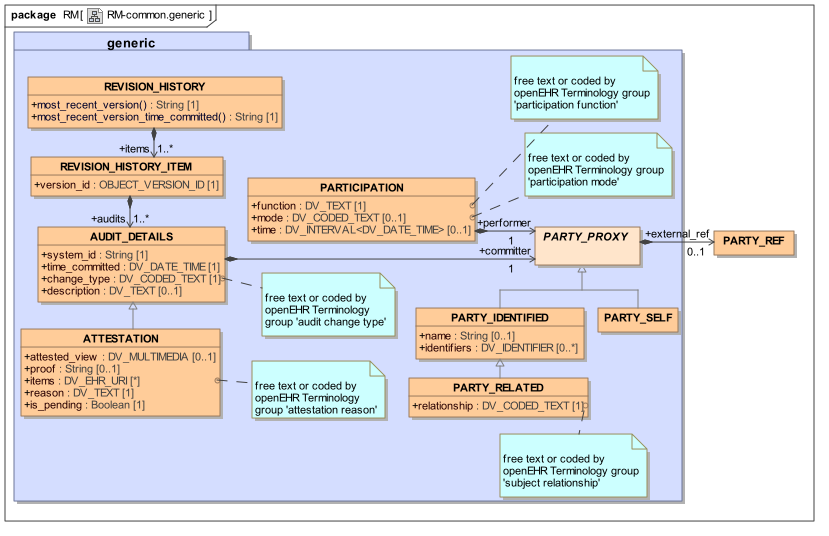

### 4.2.设计原则

#### 4.2.1.参考人口统计实体

在openEHR EHR中引用人口统计身份的方法有两种：直接使用PARTY\_REF，在某些外部系统中记录一方的标识符;使用PARTY\_PROXY，由少量描述性数据组成，具体取决于子类型;一个可选的PARTY\_REF。 PARTY\_REF的语义在通用IM标识包中描述，而PARTY\_PROXY的语义和在这样的实体中使用PARTY\_REF描述如下。 openEHR中用于在EHR数据中表示人口统计和用户实体的方法基于以下假设：

- 例如“Julius Marlowe，MD”，“NHS提供者号码1039385”或者诸如“Rahil.Azam”的系统用户ID;或者诸如“Rahil.Azam”之类的系统用户标识符。

- 可能在用于所讨论的一方的EHR外部的服务中存在数据，诸如人口统计，身份管理或患者索引服务;如果有，应该可以参考;

- 记录的主题从不以任何直接方式（即，通过使用她的名字或其他人类可读的细节）来识别，而是可以在一些外部系统中包括无意义的标识符。

基于这些假设，PARTY\_PROXY类和子类型模型引用参与方。 PARTY\_PROXY的语义启用了一种灵活的方法：在具有身份管理和人口统计服务的更严格的环境中，并且在这样的服务中存在针对所讨论的一方的条目时，PARTY\_PROXY.external\_ref将是非Void，而在其他环境中，它将是空的。

这两个子类型对应于“记录主体”的相互不同的类别，在openEHR中称为“自我”方，以及任何其他方。每当记录中必须引用记录主体时，使用PARTY\_SELF的实例，而对于所有其他情况使用PARTY\_IDENTIFIED。后一类提供可选的人类可读的名称和形式标识符，每个都由目的或含义来键入。

当需要一方与记录主体的关系时，使用RELATED\_PARTY类型。关系是编码的，包括家庭的（“母亲”，“叔叔”等）以及像“捐赠者”，“旅行伴侣”等关系。
PARTY\_SELF并从EHR引用患者

存在可能用于指代来自EHR内的患者（即记录主体）人口统计学或患者主索引（PMI）数据的三种方案，每种方案在不同情况下可能是有效的。每个使用一个PARTY\_SELF对象，但使用的external\_ref属性不同，如下所示。

- external\_ref属性没有在PARTY\_SELF的任何实例上设置，即在EHR中不存在。这是最安全的方法，并且意味着EHR和患者之间的链接必须在EHR之外通过关联EHR.ehr\_id和患者人口统计/ PMI标识符来完成。这种方法更可能在更开放的数据共享环境中。

- external\_ref属性仅在EHR\_STATUS.subject中设置一次。由于EHR\_STATUS对象与EHR内容是分开的，因此PARTY\_SELF的根实例通常不可见。

- 在PARTY\_SELF的每个实例中设置external\_ref;此解决方案使得患者external\_ref在每个PARTY\_SELF实例中可见，这在安全环境中是合理的，并且便于在本地复制记录的部分。

所有这三种方案都由openEHR模型支持，并且可能都会在不同的设置和EHR部署类型中使用。

#### 4.2.2.参与

参与抽象模拟了一个活动中某个Party的交互。在openEHR参考模型中，参与实际上是以两种方式建模的。在参与的种类已知并且是常数的情况下，它们在相关参考模型中被建模为命名属性。例如，AUDIT\_DETAILS中的提交者：PARTY\_PROXY属性对函数为“committal”的参与进行建模。如果参与的类型在设计时未知，则使用通用PARTICIPATION类的后代。

#### 4.2.3.审计信息

##### 审核详细信息

提供三个类来表示审计信息。第一个AUDIT\_DETAILS表示当将某些信息提交到某种类型的存储库时可能会捕获的关于用户的详细信息，该存储库可能受版本控制。它记录提交者，时间，更改类型和描述。提交者使用PARTY\_PROXY记录，允许在提交者是记录主题时使用PARTY\_SELF，并且使用PARTY\_IDENTIFIED表达的其他用户包括其他标识信息。在AUDIT\_DETAILS中的PARTY\_PROXY实例中使用的识别信息的类型可能与COMPOSITION.composer或其他地方中使用的不同，即以系统登录标识符的形式，例如， “maxime.lavache@stpatricks.health.ie”。

##### 修订记录

类REVISION\_HISTORY和REVISION\_HISTORY\_ITEM表达修订历史的概念，其由审计项目组成，每个审计项目与修订版本号相关联。 REVISION\_HISTORY\_ITEM类的实例被设计为表示对应于修订历史中的项目的信息，即，与一些信息项目相关的所有审计的列表。包括version\_id以指示每个审计对应于哪个修订。这些类为VERSIONED\_OBJECT和AUTHORED\_RESOURCE类提供了可互操作的修订历史定义。

#### 4.2.4.证明

证明是健康信息中通常发生的另一个概念。证明是由一个健康护理代理为了各种特定目的明确签署特定内容，包括：

- 受控物质或程序的授权（例如根据精神卫生法对患者进行切片）;

- 高级临床专业人员见证内容;

- 指示预期接收方对内容的确认，例如。 GP订购了测试结果。

这里它被建模为AUDIT\_DETAILS的子类型，这意味着它在逻辑上是一种审计，附加信息对于签名的行为是显着的。 ATTESTATION的内容如下：

- 验证方的身份（AUDIT\_DETAILS.committer）;

- 认证行动的日期和时间（AUDIT\_DETAILS.time\_committed）;

- 对正在证明的记录中的项目的引用（ATTESTATION.items）;如果此列表为空，则证明是针对附加了证明的整个对象（通常是ORIGINAL\_VERSION的内容），否则列表必须包含附加了证明的项目中的项目的一组路径;

- 一个可选的编码证明原因（ATTESTATION.reason）;

- 所述内容的可选字面视图，例如二进制屏幕图像;

- 以证明方的数字签名的形式的证明的证明。

如果存在数字签名，则根据以下所示的过程，使用IETF RFC 2440（openPGP; [rfc\_2440]）标准来生成数字签名。

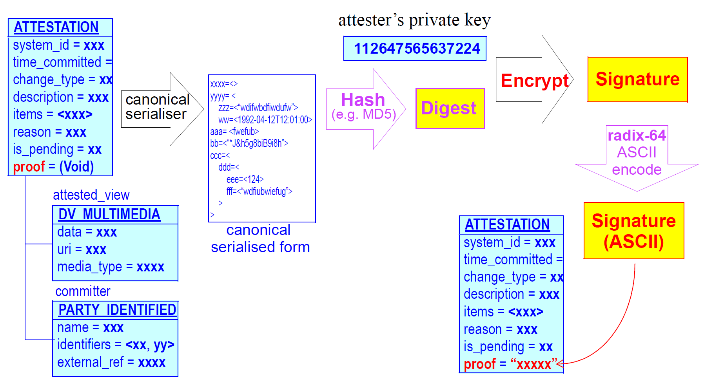

图4.证明签名生成（使用openPGP）

在此过程中，认证对象被序列化为规范文本形式，然后散列以创建摘要。使用用户的私钥从散列创建数字签名。结果然后被radix-64编码以创建ASCII字符串，以便消除或减少随后通信的潜在问题。 openPGP标准确保在其中指示用于创建签名的变换和算法（即签名是自描述的）。

序列化过程通过将整个Attestation对象序列化（注意，验证属性在这一点上将是Void）成为商定的XML，dADL或其他文本格式的简单规则工作，然后将后续变换应用于串行化数据，然后写入摘要结果返回到证明属性。

待确定：openEHR尚未定义确切的序列化，但是dADL可能是首选，因为它具有对象结构的明确编码，而XML库从同一对象生成不同的XML。

通常，被验证的项目列表应该是单个条目或组合，但是没有任何东西阻止它包括细粒度项目，即使这样的项目的单独证明似乎不与良好的临床信息设计或过程相称。

reason属性用于指示证明发生的原因，并且使用openEHR术语组“证明原因”来编码，其包括诸如“授权”和“见证”的值。 is\_pending属性将证明标记为已完成或等待完成，具体取决于其值。这有助于查询记录以找到需要签名或见证的项目。当需要证明时，最常见的情况是使用类型为ATTESTATION的commit\_audit而不是仅仅AUDIT\_DETAILS来提交组合版本; is\_pending标志将被设置为True，以指示提交的信息需要由另一个人签名。当发生签名时，它将导致一个新的ATTESTATION对象被添加到VERSION.attestations列表，这次is\_pending设置为False，并提供适当的证明。因此，内容被提交到记录并且需要以后由高级人员审查和签署的共同情况将导致创建两个ATTESTATION对象。

### 4.3.类描述

#### 4.3.1. PARTY\_PROXY类

<table>
	<tr>
		<td>类</td>
		<td colspan="2">PARTY_PROXY（摘要）</td>
	</tr>
	<tr>
		<td>描述</td>
		<td colspan="2">代理描述的一方的抽象概念，包括在人口统计或其他身份管理系统中的该方的数据的可选链接。分成PARTY_IDENTIFIED和PARTY_SELF。</td>
	</tr>
	<tr>
		<td>继承</td>
		<td colspan="2"></td>
	</tr>
	<tr>
		<td>属性</td>
		<td>签名</td>
		<td>含义</td>
	</tr>
	<tr>
		<td>0..1</td>
		<td>external_ref：PARTY_REF</td>
		<td>在外部系统中可选参考此方的更详细的人口统计或识别信息。</td>
	</tr>
</table>

#### 4.3.2. PARTY\_SELF类

<table>
	<tr>
		<td>类</td>
		<td colspan="2">PARTY_SELF</td>
	</tr>
	<tr>
		<td>描述</td>
		<td colspan="2">代理记录主体的代理。用于表示该方是记录的所有者。可能或可能没有external_ref设置。</td>
	</tr>
	<tr>
		<td>继承</td>
		<td colspan="2">PARTY_PROXY</td>
	</tr>
</table>

#### 4.3.3. PARTY\_IDENTIFIED类

<table>
	<tr>
		<td>类</td>
		<td colspan="2">PARTY_IDENTIFIED</td>
	</tr>
	<tr>
		<td>描述</td>
		<td colspan="2">
<pre>
用于除记录主体之外的被识别方的代理数据，最小包括人类可读标识符，诸如姓名，形式（和可能可计算的）标识符，例如NHS号码，以及到外部数据的可选链接。必须至少存在名称，标识符或external\_ref中的一个。

用于描述其中只有标识符可能已知，并且在人口统计系统（或甚至没有人口统计系统）中根本没有条目的各方。通常，对于卫生保健提供者，名称和机构的提供者号码。

不应该用于包括患者识别信息。
</pre>
		</td>
	</tr>
	<tr>
		<td>继承</td>
		<td colspan="2">PARTY_PROXY</td>
	</tr>
	<tr>
		<td>属性</td>
		<td>签名</td>
		<td>含义</td>
	</tr>
	<tr>
		<td>0..1</td>
		<td>name：String</td>
		<td>可选的人工可读名称（以字符串形式）。</td>
	</tr>
	<tr>
		<td>0..1</td>
		<td>标识符：列表<DV_IDENTIFIER></td>
		<td>一个或多个形式标识符（可能是可计算的）。</td>
	</tr>
	<tr>
		<td>不变</td>
		<td colspan="2">Basic_validity：name / = Void或者标识符/ = Void或者external_ref / = Void</td>
	</tr>
	<tr>
		<td></td>
		<td colspan="2">Name_valid：name / = Void意味着不是name.is_empty</td>
	</tr>
	<tr>
		<td></td>
		<td colspan="2">Identifiers_valid：标识符/ = Void意味着不是identifiers.is_empty</td>
	</tr>
</table>

#### 4.3.4. PARTY\_RELATED类

<table>
	<tr>
		<td>类</td>
		<td colspan="2">PARTY_RELATED</td>
	</tr>
	<tr>
		<td>描述</td>
		<td colspan="2">用于识别一方及其与记录主体的关系的代理类型。用于必须知道当事人和记录主体之间的关系的地方。</td>
	</tr>
	<tr>
		<td>继承</td>
		<td colspan="2">PARTY_IDENTIFIED</td>
	</tr>
	<tr>
		<td>属性</td>
		<td>签名</td>
		<td>含义</td>
	</tr>
	<tr>
		<td>1..1</td>
		<td>关系：DV_CODED_TEXT</td>
		<td>此ENTRY的主题与记录主题的关系。可以编码。如果是病人，编码为自我。</td>
	</tr>
	<tr>
		<td>不变</td>
		<td colspan="2">Relationship_valid：术语（Terminology_id_openehr）.has_code_for_group_id（Group_id_subject_relationship，relationship.defining_code）</td>
	</tr>
</table>

#### 4.3.5.PARTICIPATION类

<table>
	<tr>
		<td>类</td>
		<td colspan="2">PARTICIPATION</td>
	</tr>
	<tr>
		<td>描述</td>
		<td colspan="2">一个缔约方（任何演员或角色）参与活动的模式。用于表示缔约方在某些活动中的任何参与，这在模型中没有明确说明。协助护士。可用于记录过去或未来的参与。不应该用于代替人口统计实体之间更为永久的关系。</td>
	</tr>
	<tr>
		<td>继承</td>
		<td colspan="2"></td>
	</tr>
	<tr>
		<td>属性</td>
		<td>签名</td>
		<td>含义</td>
	</tr>
	<tr>
		<td>1..1</td>
		<td>功能：DV_TEXT</td>
		<td>缔约方在这种参与中的职能（注意，某一缔约方可能以不止一种方式参与特定活动）。此属性应该编码，但不能限于HL7v3：ParticipationFunction词汇表，因为它太有限并且面向医院。</td>
	</tr>
	<tr>
		<td>0..1</td>
		<td>模式：DV_CODED_TEXT</td>
		<td>用于记录表演者/活动交互的“模式”的可选字段，例如出席，电话，电子邮件等。</td>
	</tr>
	<tr>
		<td>0..1</td>
		<td>时间：DV_INTERVAL <DV_DATE_TIME></td>
		<td>参与发生的时间间隔，如果它用于观察上下文（即记录关于过去的事实）;或在未来环境中使用时参与的预期时间间隔，例如EHR指令。</td>
	</tr>
	<tr>
		<td>1..1</td>
		<td>执行者：PARTY_PROXY</td>
		<td>参与活动的一方的id和可能的人口统计系统链接。</td>
	</tr>
	<tr>
		<td>函数</td>
		<td>签名</td>
		<td>含义</td>
	</tr>
	<tr>
		<td>（有效）</td>
		<td></td>
		<td></td>
	</tr>
	<tr>
		<td>不变</td>
		<td colspan="2">Function_valid：function.generating_type.is_equal（“DV_CODED_TEXT”）意味着术语（Terminology_id_openehr）.has_code_for_group_id（Group_id_participation_function，function.defining_code）</td>
	</tr>
	<tr>
		<td></td>
		<td colspan="2">Mode_valid：mode / = Void意味着术语（Terminology_id_openehr）.has_code_for_group_id（Group_id_participation_mode，mode.defining_code）</td>
	</tr>
</table>

#### 4.3.6. AUDIT\_DETAILS类

<table>
	<tr>
		<td>类</td>
		<td colspan="2">AUDIT_DETAILS</td>
	</tr>
	<tr>
		<td>描述</td>
		<td colspan="2">记录将信息项提交到存储库所需的属性集。</td>
	</tr>
	<tr>
		<td>属性</td>
		<td>签名</td>
		<td>含义</td>
	</tr>
	<tr>
		<td>1..1</td>
		<td>system_id：String</td>
		<td>实施更改的系统的标识。理想情况下，这是一个机器和人类可处理的标识符，但它可能不是。</td>
	</tr>
	<tr>
		<td>1..1</td>
		<td>time_committed：DV_DATE_TIME</td>
		<td>项目的提交时间。</td>
	</tr>
	<tr>
		<td>1..1</td>
		<td>change_type：DV_CODED_TEXT</td>
		<td>更改类型。使用openEHR术语审计更改类型组编码。</td>
	</tr>
	<tr>
		<td>0..1</td>
		<td>描述：DV_TEXT</td>
		<td>提交原因。</td>
	</tr>
	<tr>
		<td>1..1</td>
		<td>committer：PARTY_PROXY</td>
		<td>提交项目的用户的身份和可选参考到身份管理服务。</td>
	</tr>
	<tr>
		<td>不变</td>
		<td colspan="2">System_id_valid：not system_id.is_empty</td>
	</tr>
	<tr>
		<td></td>
		<td colspan="2">Change_type_valid：术语（Terminology_id_openehr）.has_code_for_group_id（Group_id_audit_change_type，change_type.defining_code）</td>
	</tr>
</table>

#### 4.3.7. ATTESTATION类

<table>
	<tr>
		<td>类</td>
		<td colspan="2">ATTESTATION</td>
	</tr>
	<tr>
		<td>描述</td>
		<td colspan="2">将一方（提交者）的证明记录到记录内容的项目。证明是由一个健康护理代理人为了各种特定目的明确签署特定内容，包括：用于受控物质或程序的授权（例如，根据精神卫生法对患者进行切片）;高级临床专业人员见证内容;指示预期接收方对内容的确认，例如。 GP订购了测试结果。</td>
	</tr>
	<tr>
		<td>继承</td>
		<td colspan="2">AUDIT_DETAILS</td>
	</tr>
	<tr>
		<td>属性</td>
		<td>签名</td>
		<td>含义</td>
	</tr>
	<tr>
		<td>0..1</td>
		<td>attested_view：DV_MULTIMEDIA</td>
		<td>可选的视觉呈现内容屏幕图像。</td>
	</tr>
	<tr>
		<td>0..1</td>
		<td>proof：String</td>
		<td>证明证明。</td>
	</tr>
	<tr>
		<td>0..1</td>
		<td>项目：列表<DV_EHR_URI></td>
		<td>已验证的项目，表示为相关项目的完全限定运行时路径。虽然不推荐，这些可能包括已在其他系统中证明的细粒度项目。否则假定它是与它相关联的整个VERSION。</td>
	</tr>
	<tr>
		<td>1..1</td>
		<td>原因：DV_TEXT</td>
		<td>这个证明的原因。可选地由openEHR术语组认证原因编码;包括授权，证人等价值。</td>
	</tr>
	<tr>
		<td>1..1</td>
		<td>is_pending：Boolean</td>
		<td>如果这个证明是出色的， False表示已完成。</td>
	</tr>
	<tr>
		<td>不变</td>
		<td colspan="2">Items_valid：items / = Void意味着不是items.is_empty</td>
	</tr>
	<tr>
		<td></td>
		<td colspan="2">Reason_valid：（reason.generating_type.is_equal（“DV_CODED_TEXT”）意味着术语（Terminology_id_openehr）.has_code_for_group_id（Group_id_attestation_reason，reason.defining_code））</td>
	</tr>
</table>

#### 4.3.8. REVISION_HISTORY类

<table>
	<tr>
		<td>类</td>
		<td colspan="2">REVISION_HISTORY</td>
	</tr>
	<tr>
		<td>描述</td>
		<td colspan="2">用途定义审计项目的修订历史记录的概念，每个审计项目与提交审计的版本相关联。该列表是按照最近先出的顺序。</td>
	</tr>
	<tr>
		<td>继承</td>
		<td colspan="2"></td>
	</tr>
	<tr>
		<td>属性</td>
		<td>签名</td>
		<td>含义</td>
	</tr>
	<tr>
		<td>1..1</td>
		<td>项目：列表<REVISION_HISTORY_ITEM></td>
		<td>最近最后一个订单中的此历史记录中的项目。</td>
	</tr>
	<tr>
		<td>函数</td>
		<td>签名</td>
		<td>含义</td>
	</tr>
	<tr>
		<td></td>
		<td>most_recent_version：String发布：Result.is_equal（items.last.version_id.value）</td>
		<td>最近项目的版本标识，作为字符串。</td>
	</tr>
	<tr>
		<td></td>
		<td>
<pre>
most_recent_version_time_committed：String
Post：Result.is_equal（items.last.audits.first.time_committed.value）</td>
</pre>
		<td>最近一个项目的提交日期/时间，作为字符串。</td>
	</tr>
</table>

#### 4.3.9. REVISION\_HISTORY\_ITEM类

<table>
	<tr>
		<td>类</td>
		<td colspan="2">REVISION_HISTORY_ITEM</td>
	</tr>
	<tr>
		<td>描述</td>
		<td colspan="2">修订历史记录中的条目，对应于来自版本化容器的版本。包含AUDIT_DETAILS实例，其中包含AUDIT_DETAILS意图所属修订版本的修订标识符。</td>
	</tr>
	<tr>
		<td>继承</td>
		<td colspan="2"></td>
	</tr>
	<tr>
		<td>属性</td>
		<td>签名</td>
		<td>含义</td>
	</tr>
	<tr>
		<td>1..1</td>
		<td>version_id：OBJECT_VERSION_ID</td>
		<td>此修订版本的版本标识符。</td>
	</tr>
	<tr>
		<td>1..1</td>
		<td>审核：列表<AUDIT_DETAILS></td>
		<td>这次修订的审计;总是会有至少一个提交审计（其本身可以是一个ATTESTATION），也可能有进一步的证明。
		</td>
	</tr>
</table>

## 5. 目录包

5.1.概述

目录包如下所示。它提供了一个版本化文件夹结构的简单抽象。 VERSIONED\_FOLDER类是VERSIONED\_OBJECT <T>与类FOLDER的绑定，即它是VERSIONED\_OBJECT <FOLDER>。这意味着它的每个版本都是一个文件夹结构，而不是单个文件夹。它提供了一种随着时间的推移对FOLDER结构进行版本化的方法，这在EHR，人口统计服务或其他任何使用文件夹对事物进行分组的地方很有用。 FOLDER实例包含更多的FOLDER和/或项，它们是对其他（通常是版本化的）对象的引用。因此，FOLDER结构就像一个包含对象引用的目录。由于它们是引用，所以对同一对象的多个引用是可能的，允许结构用于对其他对象进行mutiply分类。例如，如果它与VERSIONED\_COMPOSITION一起使用，则文件夹可能用于表示剧集和同时出现问题组。

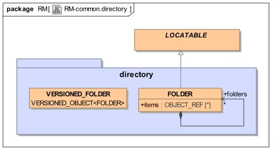

VERSIONED\_FOLDER中的FOLDER结构是可构造结构，并且可以以与用于EHR的SECTION原型相同的方式创建FOLDER原型。

#### 5.1.1.路径

目录路径使用从LOCATABLE继承到每个FOLDER对象的name属性值构建。在实际数据中，这些通常从archetype\_node\_id属性的值导出，如果需要，加上唯一性修饰符。示例路径（例如在EHR中）：

    / folders [hospital episodes] / items [1]
    / 文件夹[病人输入数据] /文件夹[糖尿病监测]
    / folders [homeopathy联系人]

唯一性修饰符被附加在括号中，并且仅需要区分在相同节点处的文件夹，否则将具有相同的名称，例如。

    [医院事件]
    [医院事件（1998年8月车祸）]

### 5.2.类描述

#### 5.2.1. VERSIONED_FOLDER类

<table>
	<tr>
		<td>类</td>
		<td colspan="2">VERSIONED_FOLDER</td>
	</tr>
	<tr>
		<td>描述</td>
		<td colspan="2">版本控制的FOLDER的层次结构，给出目录的效果。</td>
	</tr>
</table>

5.2.2. FOLDER类

<table>
	<tr>
		<td>类</td>
		<td colspan="2">FOLDER</td>
	</tr>
	<tr>
		<td>描述</td>
		<td colspan="2">命名文件夹的概念。</td>
	</tr>
	<tr>
		<td>继承</td>
		<td colspan="2">LOCATABLE</td>
	</tr>
	<tr>
		<td>属性</td>
		<td>签名</td>
		<td>含义</td>
	</tr>
	<tr>
		<td>0..1</td>
		<td>items：List <OBJECT_REF></td>
		<td>在此文件夹中逻辑地引用其他（通常）版本化对象的列表。</td>
	</tr>
	<tr>
		<td>0..1</td>
		<td>文件夹：列表<FOLDER></td>
		<td>此FOLDER的子文件夹。</td>
	</tr>
	<tr>
		<td>函数</td>
		<td>签名</td>
		<td>含义</td>
	</tr>
	<tr>
		<td>（有效）</td>
		<td></td>
		<td></td>
	</tr>
	<tr>
		<td>不变</td>
		<td colspan="2">Folders_valid：not folders.is_empty</td>
	</tr>
</table>

## 6.更改控制包

### 6.1.概述

如架构概述文档中所述，正式版本控制和变更管理在openEHR中使用，以支持EHR和其他需要一致性，不可消除性，可追溯性和分布式共享属性的存储库的构建。 change_control包提供了openEHR中这些功能的形式规范。

图common.change\_control包说明了Versioned对象及其组成版本的openEHR模型。在此模型中，类VERSIONED\_OBJECT <T>的实例为一个版本化项提供版本控制功能，通常称为“版本容器”。虽然任何种类的数据都可以根据这里提出的模型进行版本化，但openEHR中版本控制的使用仅限于“顶层结构”，如人口统计系统中的EHR组合和Party对象。

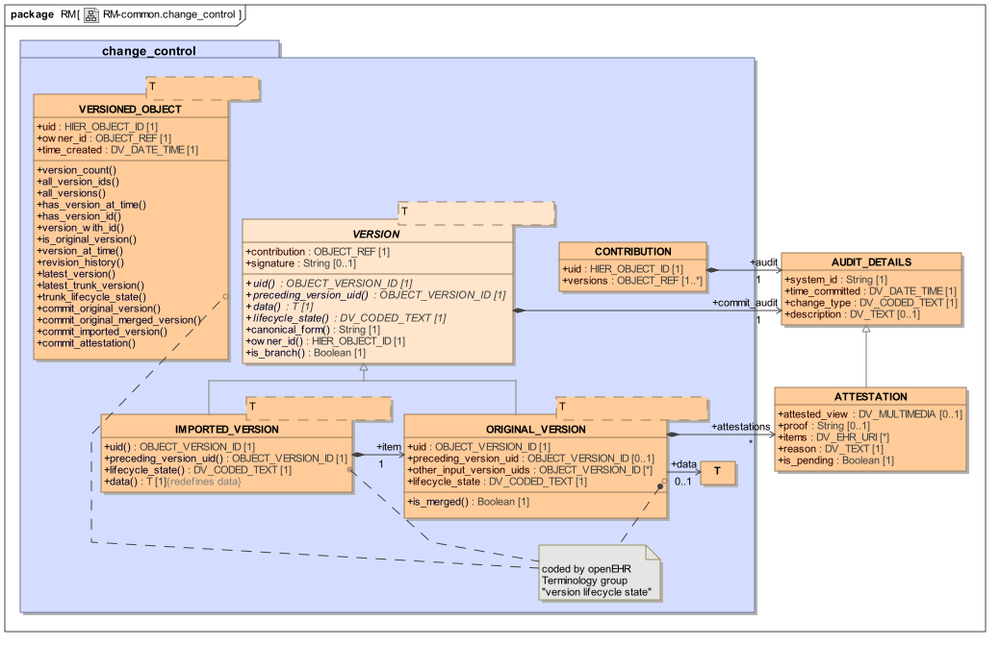

图版本控制结构说明包含多个VERSION的单个VERSIONED_OBJECT。 虽然该图表示通过Versioned对象对版本进行物理遏制，但这只是一种可能的实现。 其他实现（例如，使用正统关系结构）可以使用引用，单独的压缩副本或任何其他机制。

### 6.2.基本语义

#### 6.2.1.打字

类VERSIONED_OBJECT <T>，VERSION <T>，ORIGINAL_VERSION <T>和IMPORTED_VERSION <T>是通用类，通用参数类型T是数据的类型。这确保给定VERSIONED_OBJECT中的所有版本都是相同类型，例如COMPOSITION，FOLDER或PARTY，并且版本容器本身正确键入。

#### 6.2.2.版本化对象

每个VERSIONED\_OBJECT具有记录在uid属性（典型地包含GUID的HIER\_OBJECT\_ID）中的唯一标识符，以及对owner\_id属性中的拥有对象（例如拥有的EHR）的引用（这通常也是GUID）。后者有助于确保在存储系统中，Versioned对象始终正确分配给其封装存储库，例如EHR。

VERSIONED\_OBJECT中的数据是两个VERSION <T>子类型的实例集合的形式，并且仅通过VERSIONED\_OBJECT的功能接口可用。如何在VERSIONED\_OBJECT内部实现此集合的表示未由此规范定义，只有任何给定版本的形式。 VERSIONED\_OBJECT的实现可以从简单（所有版本存储为列表中的完整副本）到软件文件版本控制和一些对象数据库中使用的复杂压缩版本方法。 （由不同组织开发的VERSIONED\_OBJECT实现的持久数据格式通常是不兼容的。为了共享的目的，VERSIONED\_OBJECT的可互操作表达式由EHR提取IM中的X\_VERSIONED\_OBJECT类定义。

#### 6.2.3.版本及其子类型

在Versioned对象内，每个版本都是类VERSION <T>的子类型的实例。抽象VERSION类定义了包含一些数据的版本的通用概念，该版本已作为贡献的成员提交到存储库。因此，它将在Contribut_audit中的Contribution属性和审计中记录。版本还知道其在容器内的版本树中的位置。它有一个版本标识符uid，并且知道它在树中的哪个版本（即什么版本被签出创建当前版本），preced\_version\_id（如果它是第一个版本，则为Void）。这两个标识符都是全局唯一的（请参阅support.identification包）。这些属性在VERSION类中是抽象的，因为它们被定义为分别在其子类型中存储或计算。

给定版本容器中的所有版本都有一个包含容器的uid的uid;换句话说，版本的uid是其容器的uid加上该特定版本相对于同一容器中的其他版本的进一步版本标识。 VERSION.owner\_id函数从VERSION的uid中提取所拥有的VERSIONED\_OBJECT的uid字段。

VERSION类有两个子类型。第一个ORIGINAL\_VERSION <T>代表在创建时（包括来自nonopenEHR本地馈线系统）使用原始内容（存储形式的数据属性）创建的版本，并且可能已验证（签名）。它包括作为属性的当前版本（uid）和先前版本（preceding\_version\_uid）。它还知道其内容的生命周期状态。如果是前一版本之外的版本的合并（参见版本合并）的结果，这些版本的标识符将记录在属性other\_input\_version\_uids中。非分布式openEHR系统中的所有VERSION <T>实例都将是ORIGINAL\_VERSION <T>的实例。 ORIGINAL\_VERSION也是分布式环境中的复制单位。

第二个子类型是IMPORTED\_VERSION <T>，并且作为ORIGINAL\_VERSION <T>的包装器。它有自己的贡献和commit\_audit（继承自VERSION <T>），并且包含正在其项目属性中导入的原始版本。它的uid和preced\_version被定义为函数，从包装的ORIGINAL\_VERSION对象返回相应的属性值（换句话说，IMPORTED\_VERSION没有自己的版本标识符，不同于它包装的版本）。导入的语义在下面的复制部分中描述。图版本化数据的实例视图说明了在VERSIONED\_OBJECTs内的ORIGINAL\_VERSION和IMPORTED\_VERSION对象的典型安排，依次在EHR（如果这是EHR系统）内，最终在已识别的系统内。示出了两个VERSIONED\_OBJECT表示“药物”和“问题列表”，以给出版本化结构与逻辑数据的对应的一些想法。星形图标表示数字签名。

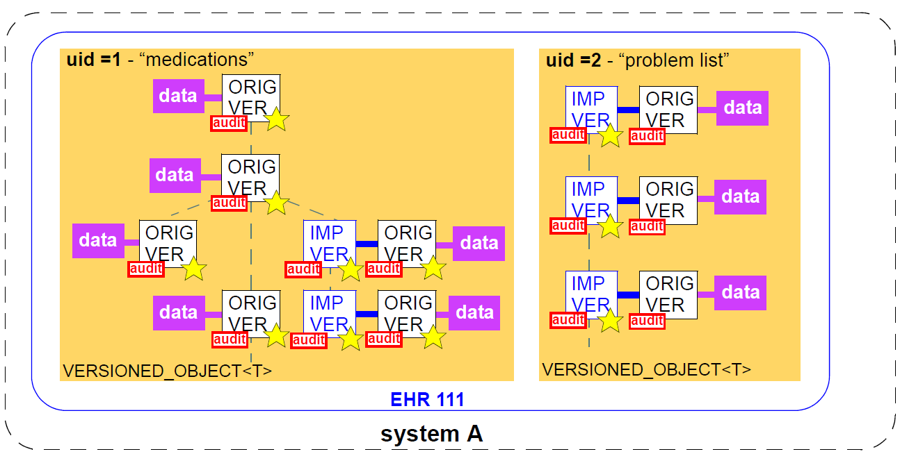

#### 6.2.4. “虚拟版本树”

这里定义的版本化模型的底层设计概念被称为“虚拟版本树”。这个想法在抽象中很简单。信息以块的形式提交到存储库（例如EHR），每个块是一个版本的“数据”。每个版本在版本树中有其位置，而版本树又在Versioned对象内维护。虚拟版本树概念意味着任何给定的Versioned对象可以在各种系统中具有许多副本，并且每个版本的创建以这样的方式完成：所创建的所有版本实际上与“虚拟”版本树兼容从所有副本的版本树的叠加。这是使用用于版本识别的简单规则来实现的，如下所述，并且是为了便于数据共享而实现的。虚拟版本树概念提供了两个非常常见的场景：

- 在一个或多个护理交付组织中创建和维护作为患者的状态或情况的代理的纵向数据，例如“药物”或“问题列表”（openEHR中的持久性组成），并且跨越更大数量组织;

- 在一个位置中的EHR服务器中的一些EHR被镜像到一个或多个其他EHR服务器中（例如在相关患者也被治疗的护理提供者处）;镜像过程要求服务器之间的异步同步无缝工作，而不管创建的任何数据的位置，时间或作者。

类VERSIONED_OBJECT <T>的uid属性实际上是给定逻辑项（例如某个病人的“问题列表”）的虚拟版本树的uid - 也就是说，uid将是相同的在分布式系统中相同版本对象的所有副本中。

openEHR中使用的版本控制方案保证无论数据在哪里创建或复制，由于共享，没有不一致，并且明确表示逻辑副本。这是通过版本标识符的设计实现的。

#### 6.2.5.贡献

由于版本化的存储库（即VERSIONED_OBJECTs的集合）按定义是不可消除的，所以包括删除，添加，修改（包括错误更正和内容更改），现有项目的导入和证明的所有逻辑更改都是通过物理提交新版本来实现的，或者用于证明，新的证明对象到现有版本。每个逻辑类型的变化实现如下：

- 添加新项：创建一个新的VERSIONED\_OBJECT，其中第一个ORIGINAL\_VERSION的数据是新项; ORIGINAL\_VERSION.commit_audit.change\_type设置为“创建”的代码

- 删除现有项目：将其数据属性设置为Void的新ORIGINAL\_VERSION添加到现有VERSIONED\_OBJECT; ORIGINAL\_VERSION.commit\_audit.change\_type设置为“已删除”的代码;

- 修改现有项目：将其数据包含项目内容的更新形式的新ORIGINAL\_VERSION添加到现有VERSIONED\_OBJECT;

    - 如果改变在逻辑上是校正（例如错误输入的数据），则将ORIGINAL\_VERSION.commit\_audit.change\_type设置为“修改”的代码;

    - 如果更改在逻辑上是对内容的更改，添加等，则ORIGINAL\_VERSION.commit\_audit.change\_type设置为“修改”的代码;

- 导入项：创建一个新的IMPORTED\_VERSION，合并收到的ORIGINAL\_VERSION; IMPORTED\_VERSION.commit\_audit.change\_type设置为“创建”的代码。

- 条目的认证：将新的ATTESTATION添加到现有的ORIGINAL\_VERSION的认证列表中; ATTESTATION.commit\_audit.change\_type设置为“证明”的代码。

在典型的应用情况下，可以将一个或多个上述更改作为贡献提交到存储库。例如，在患者遭遇期间，可能发生以下情况：

- 添加：创建新的组合物，记录在遭遇期间进行的观察（例如身体检查）等;

- 修改：由于在遭遇期间给出处方，更新包含当前药物列表的组合物。

这两个变化一起构成一个逻辑“变更集”，并且通常包括在一个贡献中。一般来说，在对应于单个真实世界商业事件（例如GP遭遇）的应用程序的单个提交中可能存在逻辑改变类型的任何组合，虽然证明，删除和校正通常是唯一的改变贡献。在每种情况下，无论组合如何，都将创建CONTRIBUTION对象，列出受影响的VERSION对象，并包括其自己的审计对象。

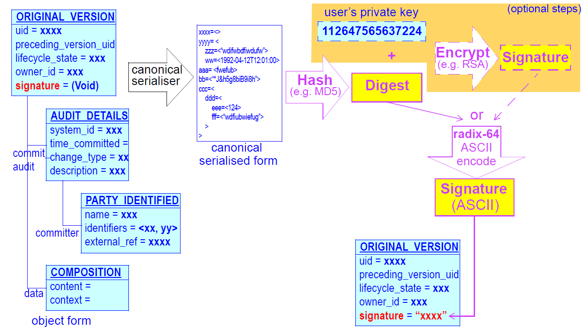

序列化过程通过将整个版本对象串行化（注意，签名属性在这一点上将是Void）成为商定的XML，ODIN或其他文本格式的简单规则工作，然后将后续变换应用于串行化数据，然后写入摘要结果返回签名属性。如果要序列化的对象是IMPORTED\_VERSION，则该过程是相同的 - 对象的所有属性都被序列化，然后用于生成签名。结果将是IMPORTED\_VERSION实例将携带其自己的签名，其表示从另一系统在​​本地导入ORIGINAL\_VERSION的行为。

待确定：openEHR尚未定义确切的序列化，但是ODIN可能是首选，因为它具有对象结构的明确编码，而不同的XML库可以从同一对象生成不同的XML。

应当注意，这里的签名过程创建内容的逻辑形式的签名，而不是特定的图形或其他直接人类可解释的视图。通常，在可靠的系统中，数据与屏幕上看到的内容之间的关系假定为1：1.然而，如果需要屏幕图像的签名或数据的其他文字形式的等同物，则需要commit\_audit的证明形式。这在下面描述。

在openEHR数据中签名的最重要的使用之一可能在EHR提取中，因为它们可以向不知道在始发系统中使用的进程的质量的接收者提供数据的保证真实性和完整性。

签名计算必须在系统的服务器侧，恰好在提交之前执行，因为包括在签名的内容中的数据元素之一是提交时间戳。

#### 6.2.8.证明

ORIGINAL\_VERSION.attestations属性允许将证明与原始版本中的数据相关联。认证在openEHR中作为一种具有附加属性的审计来处理，并且在本说明书的通用包部分中详细描述。与Versioned对象中的每个版本相关联的任何数量的证明。可以在提交被验证的内容之后的任何时间添加证明。它们可以根据进入奖励程序或立法的要求使用，并指明由谁以及何时证明有问题的物品。还需要数字“证明”，尽管没有对这种证据的形式做出假设。

证明可以以如下不同的方式使用。

- 在committal签名内容：由于某种原因，正在提交的信息需要进行数字签名。可能的是，将敏感信息添加到EHR，例如。记录根据精神健康行为切割患者的事实，诊断致命疾病等，或者仅仅是用户想要签名的东西。在这种情况下，ORIGINAL\_VERSION.commit\_audit的类型为ATTESTATION，而不是AUDIT\_DETAILS。

- 标记要审核和签名的内容：由数据输入人员输入和提交的数据，例如秘书，记录员或学生需要由高级临床医生审查和签名。与上述情况类似，这将导致ORIGINAL\_VERSION.commit_audit类型为ATTESTATION，但在这种情况下，证明的is\_pending标志设置为True，表示需要证明。

- 提交后签名：在正在等待状态中使用证明提交的数据由适当的工作人员在tme的稍后时间点进行审查和签名。此操作会将ATTESTATION添加到ORIGINAL\_VERSION.attestations列表中。

通常，证明指的是它们所连接的整个版本。然而，ATTESTATION实例可以引用版本数据中的一些更细粒度的项目，例如组合物中的单个ENTRY。

当添加后续版本时，不能假定现有证书对新版本有效，因为证明的性质是它记录了在见证时显示的内容的见证。

### 6.3.版本化语义

#### 6.3.1.版本生命周期

原始版本中的内容具有与其关联的生命周期状态，使用ORIGINAL\_VERSION.lifecycle\_state属性建模，该属性由openEHR术语“版本生命周期状态”组编码。可能的值为“完成”，“不完整”和“已删除”。通常内容将承诺在“完成”状态。然而，在一些情况下，因为作者已用完时间或由于紧急情况，它可能被提交为“不完整”，意味着它不完整或至少未经审查。在医院这是一种常见的情况。未完成的组合物不能在客户端机器上本地保存，因为这表示安全风险（小型客户端数据库比安全服务器更容易入侵）。因此，他们必须坚持在服务器上，无论是在实际的EHR，还是在被认为不属于EHR正确的一部分的“控制区”。无论哪种方式，作者必须明确地检索组合物，并在进一步的工作或审查之后，将它们作为“活性”组合物“推广”到EHR中;或者，他们可能决定把他们丢弃。

从“不完整”到“完成”几乎总是对应于内容的变化，并且对应于新的VERSION。该建模方法允许这样的内容存在于EHR系统上，但是当被用户观看时被标记为不完整。

系统负责实施检查以找到处于“不完整”状态的“旧”版本，并将它们带到相关用户的通知，或者自动删除它们或将其进行到“完成”。

#### 6.3.2.逻辑删除

在上述生命周期中，现有顶级内容项（即版本的整个数据内容）的删除在openEHR和EHR中通常是一种特殊情况。药物和可追溯性要求意味着信息不能被字面删除，因为它必须总是可能恢复到记录的先前状态，其中删除的信息是完整的。因此，信息只能在逻辑上被删除。这是通过以下过程在有问题的版本容器中实现：

- 以正常方式创建新版本;

- 删除其数据（其将默认为以前版本的数据的副本）;

- 将lifecycle\_state值设置为“已删除”的代码

- 提交以正常方式。

逻辑删除可以用于各种原因，包括患者去除材料的方向，以及在关于不同患者的信息被不正确地提交到记录并且必须被移除的情况下。

- 6.3.3.版本识别

这里描述的版本识别方案改编自Hnìtynka和Plášil[Hnìtynka\_2004]的工作。 VERSION对象由uid属性标识，uid属性是由属性object\_id，creation\_system\_id和version\_tree\_id组成的三部分标识符（请参阅support IM [openehr\_rm\_support]中的support.identification包），其中object\_id部分是拥有VERSIONED\_OBJECT版本容器的uid。

下图说明了该方案。 VERSIONED_OBJECT uid值 - 这里为“1234” - 用作每个包含的VERSION的uid的object\_id（）部分（注意，OBJECT\_VERSION\_ID的值是一个String，其中包含各种访问器函数，如object\_id（）用于提取逻辑片）。因此，这些版本中的每一个将具有遵循模式“1234：system\_id：version\_tree\_id”的uid。在下面的部分中解释了标识符的version\_tree\_id和system\_id部分的使用。提供函数VERSION.owner\_id（）以使调用者能够容易地获得“拥有版本容器”标识符。

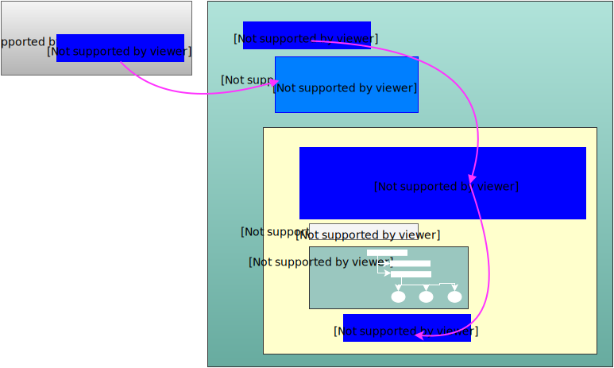

下图提供了VERSIONED\_OBJECT中的多个VERSION的示例，其中一个版本已从另一个系统合并。 这突出显示了标识符; 原始和合并版本的详细信息如下所述。

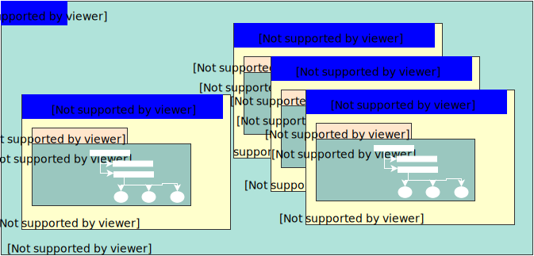

##### 本地版本控制

VERSION.uid的version\_tree\_id属性标识项目相对于同一树中的其他版本的版本。标识符的要求与在软件配置管理中使用的典型版本化系统的要求相同，并且如下：

- 以编码版本id中的版本之间的关系，也就是说，版本标识符被构造为使得给定一系列标识符，可以确定树中的相对位置;

- 以允许分支，从而可以创建特定节点的变体;例如由于翻译，或用于培训目的。

满足健康信息的上述要求的合适方案是最简单的可能，即表示版本的单个数字。版本标识符因此从1开始并且以单个增量继续。由随时间变化形成的版本标识符的连续被称为版本树的“主干”。

为了支持分支，添加了另一对数字。第一个数字标识分支（例如，从该中继节点的第一分支，第二分支等），而第二个标识版本。这两个数字也从“1”开始。这样做的结果是版本号如“1.1.1”（从干线节点1的第一分支的第一版本），“2.3.3”（从干线节点2的第3分支的第三版本）是可能的。在不与其他系统共享的openEHR系统内部，预期将很少使用分支版本;翻译可能是唯一的原因（例如，如果一个英语版本的组合的葡萄牙语翻译）。
分布式版本控制

然而，在可能发生复制和后续修改的分布式环境中，对版本识别方案有更多的要求，如下所述：

- 必须能够复制项目并且进行局部修改，而不会导致版本冲突;

- 必须能够将较早版本从原始系统发送到已经接收较早版本的目标系统，并且为了使这些版本与接收系统中的版本（包括先前导入的版本）区分开来，这使得接收系统能够知道如何和在哪里提交接收的版本;

- 必须保证任何对象的任何版本被全局唯一标识，无论它是本地创建的中继版本，本地创建的分支版本还是包含对复制版本所做更改的版本。

为了满足这些需要，对识别方案进行了两个修改。第一个是添加VERSION.uid的creation\_system\_id属性，表示创建版本的系统。这是可机器处理的标识符，例如反向因特网地址或GUID。

每当在本地创建特定VERSIONED\_OBJECT（具有特定uid）中的新ORIGINAL\_VERSION时，将VERSION.uid.creating\_system\_id设置为本地系统的标识符;如果导入了版本，则creation\_system\_id将已经设置为原始创建系统的标识符。

第二个修改是要求在对从别处复制的版本进行本地修改时使用分支版本标识符;这确保了目标系统中正在进行的修改在全局意义上被认为是作为在始发系统中进行的逻辑分支或变体而不是中继线版本。它还允许来自原始系统的以后的中继线版本在未​​来的某个时间被复制到目标系统，而没有版本标识符冲突。总之，该方案使用元组{object\_id，version\_tree\_id，creation\_system\_id}来全局唯一地标识任何openEHR VERSION对象。

### 6.4.分布式系统中的语义

#### 6.4.1.复制

##### 复制操作

在openEHR中，满足可跟踪性要求的系统之间的内容复制的最小单位是ORIGINAL\_VERSION。为了复制一个OBSERVATION甚至一个组合物在其他地方并保留版本控制能力，它的封闭的ORIGINAL\_VERSION对象必须发送。例如，当内容的类型是COMPOSITION时，将发送ORIGINAL\_VERSION <COMPOSITION>对象。在接收系统，将根据以下是否发生各种步骤：

- 有关的EHR的任何项目曾经被复制过;

- 复制的EHR存在于用于护理对象的目的地系统中，但是还没有进行所讨论的特定项目的副本（例如，它是第一次复制家族历史）;

- 存在EHR，并且已经为所讨论的项目进行了先前的复制;

- 对于护理主体存在重复的EHR（即，通过新的数据输入而不是通过自动复制创建）。

在第一种情况下，在目标系统中甚至没有EHR（即所讨论的患者的Versioned对象的储存库）。必须创建一个新的。如EHR IM [openehr\_rm\_ehr]规范中所述，新创建的EHR应重新使用源系统中的EHR标识符。这将新的EHR建立为源EHR的有意克隆（或更准确地说，是构成该患者的虚拟EHR的EHR家族的一部分）。

如果是首次从源系统接收到由其ORIGINAL\_VERSION.uid.object\_id（即，其原始VERSIONED\_OBJECT的uid，对同一容器中的所有版本是公共的）逻辑地标识的项目的任何版本，则新的VERSIONED\_OBJECT <T >（例如VERSIONED_OBJECT <COMPOSITION>），其uid设置为与接收的VERSION.uid.object\_id相同的值。这会将新创建的VERSIONED\_OBJECT建立为从中复制接收到的ORIGINAL\_VERSION的逻辑克隆。如果已经接收到项目的某个版本，则该步骤将已经发生，并且必需的VERSIONED\_OBJECT将已经存在。

然后创建IMPORTED\_VERSION实例，其项目设置为接收到的ORIGINAL\_VERSION，并且以正常方式提交（即作为贡献的一部分）。 IMPORTED\_VERSION commit\_audit和contribution属性记录了本地提交的行为。在此操作中，ORIGINAL\_VERSION实例从不被修改 - 它仍然是其原始的忠实副本，无论可以通过多少系统进行复制。
后续本地修改

在大多数情况下，接收的信息将保持该持续时间。然而，在一些情况下，接收器系统处的用户也可能想要进行修改。这可能发生在信息项表示药物列表和过敏等事件的情况下。当将新版本本地添加到复制的对象时，本地系统标识将记录在uid.creating\_system\_id属性中，而在uid.version\_tree\_id中使用分支编号。

这些复制方案如下图所示。在图的左手侧，示出了具有uid =“1”的版本容器（即，VERSIONED\_OBJECT的实例）第一个版本有uid.creating\_system\_id =“sysA”; uid.version\_tree\_id =“1”。还示出了另外的本地干线和分支版本。

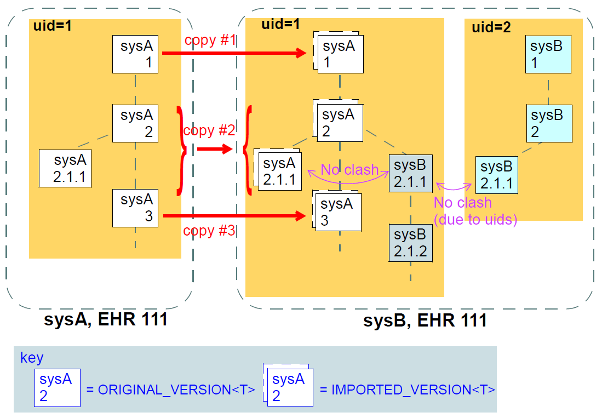

当第一个ORIGINAL_VERSION复制（复制＃1）到系统B时，它作为IMPORTED\_VERSION提交给VERSIONED\_OBJECT，该VERSIONED\_OBJECT是原始克隆。随后的副本（副本＃2和副本＃3）可以由从系统A到系统B的更高版本组成，其效果是可以在系统B内重新创建版本树（如果需要的话;当然没有义务做任何事情与接收的信息）。系统B中的用户还对接收的版本副本进行修改;这些修改以灰色显示，作为带有uid.creating\_system_id =“sysB”的分支版本。独立地，系统B中的用户当然将在本地创建其他内容，例如。如右侧所示，其中已创建具有uid =“2”的Versioned对象。在图上指示两个地方可能发生识别冲突，但由于使用3部分唯一的版本标识符方案而被防止。

需要两个规则来使此系统工作，如下所示：

- 来自复制到另一个系统的原始系统的分支版本不能被复制，除非它们在相同分支（如果有的话）上的相应的先前版本和中继线版本也被复制;

- 没有系统应该创建一个新的Versioned对象（使用一个新的uid），而不首先确定它没有一个具有相同的uid。如果使用GUID（并且生成软件可靠），这应该会自动发生;如果正在使用ISO Oids，则可能需要进行检查。

IMPORTED\_VERSION方法的一个重要结果是，在由复制操作产生的版本容器中，提交时间总是反映本地（更新近的）提交行为，而不是将信息原始提交到创建它的容器。这确保了在早期提交时间对于Version容器的状态的查询正确地返回该时间在该容器中存在的信息，而不是给出最近拷贝的版本早于本地提交时间的错觉（如将发生的那样如果ORIGINAL\_VERSION对象的原始提交时间用于此类查询中的比较目的）。因此，在整个EHR或其他版本化信息库上的这种查询总是返回在那时用户可用的存储库的状态，而不管执行了多少后来的合并或副本。这是支持存储信息的医疗法律和历史调查的关键要求。

#### 6.4.2.版本合并

在分布式版本环境中，特别是在医疗保健中，最常见的操作之一是在一个系统中创建的内容被导入另一个系统，在那里创建修改，然后发送回第一个系统。该信息路径对应于诸如患者从初级保健被转入医院，并且随后被释放到初级（或其他护理）中的情形。

当第一系统接收由第二系统对数据所做的改变时，通常的需要是将它们合并回版本树的主干。逻辑上，“合并”是使用相同内容的两个版本来创建第三版本的操作。如何使用源版本将根据信息的语义而有所不同;它可能是简单地取其全部，而另一个被丢弃，或者在由用户编辑的过程中可能创建这两者的一些混合。在健康中的许多情况下，例如在内容是药物或问题列表的情况下，原始系统中的用户将审查所接收的内容并且使用该内容在本地创建新的中继线版本，因为它将被认为是最准确可用于临床计算环境。此场景如下所示。

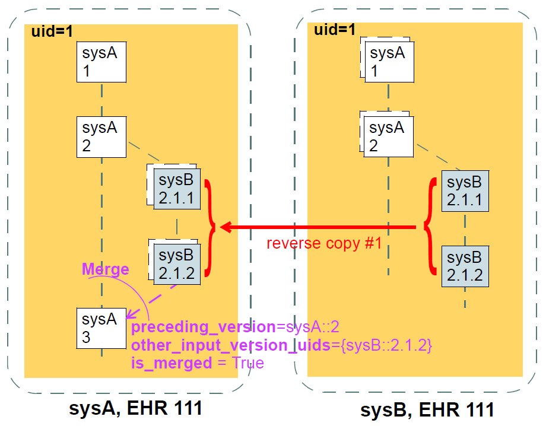

在该图中，来自具有uid = 1的版本化对象的内容（例如药物列表）的版本1和2从系统A（例如GP）复制到系统B（例如医院）。在系统B中，对版本2进行更改，根据上述规则的要求创建分支（作为IMPORTED_VERSION <T>的实例）。这些改变（修改的药物列表）然后被导回回系统A.系统A用户使用sysB :: 2.1.2和sysA :: 2内容执行合并操作以创建新的中继版本3;最有可能的是，他只是简单地审查两个输入版本并使用sysB :: 2.1.2内容不变（结果是系统A现在具有用于患者的最新药物列表，包括在系统A处完全记录的药物，以及在系统B处记录的添加）。新版本是ORIGINAL_VERSION <T>的一个实例，其other_input_version_ids属性设置为包括表示sysB :: 2.1.2的OBJECT_VERSION_ID（它不需要包括sysA :: 2，因为这在previous_version_uid中已经知道）。

如果在系统A中对sysA :: 2版本进行了修改，则创建sysA :: 3与系统B并行更改，则在进行合并尝试时可能会发生冲突情况。这可能需要由人类用户来解决，对于这些用户，自动化合并尝试可以作为起始点呈现在屏幕上，就像当今源代码控制工具今天所做的一样。

#### 6.4.3.不相交合并

非预期但并非罕见的情况是为同一真实世界实体创建不同的版本容器。例如，由于患者识别错误或其他程序或管理问题，可以为一个患者创建单独的EHR。每个记录可能包含一些逻辑上重复的基本信息，以及该记录唯一的信息，例如。由不同的医院部门提供。在一个EHR中，可能为同一逻辑项（例如患者的问题列表）创建无意识的不同版本容器。这些错误的情况最终被检测到，需要纠正。逻辑上所需要的是将两个记录（每个潜在地由许多版本容器组成）合并成一个，如下所示。

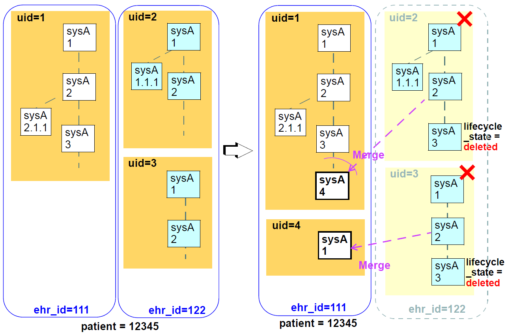

合并过程如下：

- 决定哪个记录保持活动（为了合并的目的，这将是“目标”，另一个是“源”）;

- 对于源记录中的所有版本容器...

    - 如果在目标记录中有一个逻辑等价物（对于EHR，通常只有等效的持久性和可能的​​管理性组合），通过以下方式在目标版本容器中执行不相交合并：

        - 在目标版本容器中创建新的中继版本;

    - 如果没有逻辑等价，请执行以下操作：

        - 创建新的目标版本容器;

        - 创建其第一中继版本;

    - 在这两种情况下，继续如下：

        - 将新中继版本中的数据设置为来自源容器的最近中继版本的数据的副本;

        - 设置other_input_version_uids以包括正在合并的源版本的uid（此uid将包含正在逻辑删除的版本容器的uid）;

        - 对于源容器中最近的中继版本上的任何分支，在目标中新创建的中继版本上创建相应的分支，包括相应的内容，并以与上述相同的方式在目标中设置other_input_version_uids;

        - 向源容器添加新的中继版本，将数据设置为Void，并将lifecycle_state设置为deleted。

对于复制和合并，该过程的重要结果是所得到的记录（即合并过程的目标）继续正确地表示存储库的先前状态，而不管发生了多少最近的合并。

#### 6.4.4.移动版本容器

整个VERSIONED_OBJECTS需要移动到另一个系统，例如，由于移动完整的患者记录（由于患者移动），或者重组EHR数据中心。移动的语义与复制的语义不同：移动后，操作后不再有源实例;目标实例将成为主实例。

当移动被实现时，VERSIONED_OBJECT现在存在的系统的标识符通常将不同于之前的标识符。因此，在移动的版本容器中创建的内容的后续版本现在将uid.creating_system_id设置为新系统的标识。这会在版本谱系上创建另一个变体，其中uid.creating_system_id值可以在干线中更改，如下所示。

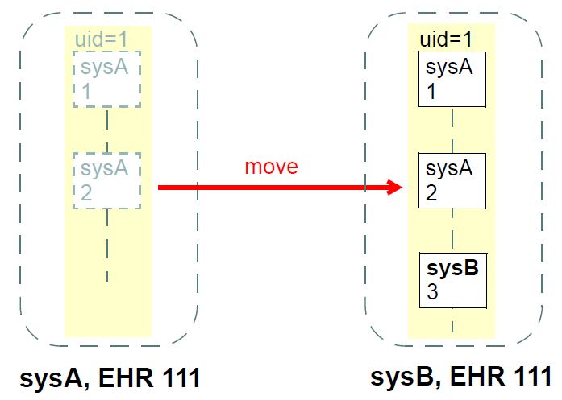

### 6.5.类描述

#### 6.5.1. VERSIONED_OBJECT类

<table>
	<tr>
		<td>类</td>
		<td colspan="2">VERSIONED_OBJECT</td>
	</tr>
	<tr>
		<td>描述</td>
		<td colspan="2">版本控制抽象，定义用于版本化一个复杂对象的语义。</td>
	</tr>
	<tr>
		<td>继承</td>
		<td colspan="2"></td>
	</tr>
	<tr>
		<td>属性</td>
		<td>签名</td>
		<td>含义</td>
	</tr>
	<tr>
		<td>1..1</td>
		<td>uid：HIER_OBJECT_ID</td>
		<td>此版本容器的唯一标识符以不带扩展名的UID的形式。这个ID在分布式环境中的相同容器的所有实例中将是相同的，这意味着它可以被理解为虚拟版本树的uid。</td>
	</tr>
	<tr>
		<td>1..1</td>
		<td>owner_id：OBJECT_REF</td>
		<td>引用此版本容器所属的对象，例如包含EHR或其他相关所有实体的ID。</td>
	</tr>
	<tr>
		<td>1..1</td>
		<td>time_created：DV_DATE_TIME</td>
		<td>初始创建此版本对象的时间。</td>
	</tr>
	<tr>
		<td>函数</td>
		<td>签名</td>
		<td>含义</td>
	</tr>
	<tr>
		<td></td>
		<td>version_count：整数</td>
		<td>返回此对象中的版本总数。</td>
	</tr>
	<tr>
		<td></td>
		<td>all_version_ids：List <OBJECT_VERSION_ID></td>
		<td>返回此对象中所有版本的ID的列表。</td>
	</tr>
	<tr>
		<td></td>
		<td>all_versions：列表<VERSION></td>
		<td>返回此对象中所有版本的列表。</td>
	</tr>
	<tr>
		<td></td>
		<td>has_version_at_time（a_ver_id：OBJECT_VERSION_ID）：Boolean</td>
		<td>如果存在时间'a_time'的版本，则为true。</td>
	</tr>
	<tr>
		<td></td>
		<td>has_version_id（a_ver_id：OBJECT_VERSION_ID）：Boolean</td>
		<td>如果存在具有an_id的版本，则为true。</td>
	</tr>
	<tr>
		<td></td>
		<td>version_with_id（a_ver_id：OBJECT_VERSION_ID）：VERSION前：has_version_id（a_ver_id）</td>
		<td>返回id ='a_ver_id'的版本。</td>
	</tr>
	<tr>
		<td></td>
		<td>is_original_version（a_ver_id：OBJECT_VERSION_ID）：Boolean
		Before：has_version_id（a_ver_id）</td>
		<td>如果包含an_id的版本为ORIGINAL_VERSION，则为true。</td>
	</tr>
	<tr>
		<td></td>
		<td>version_at_time（a_time：DV_DATE_TIME）：VERSION
前：has_version_at_time（a_time）</td>
		<td>返回版本的时间'a_time'。</td>
	</tr>
	<tr>
		<td></td>
		<td>revision_history：REVISION_HISTORY</td>
		<td>此版本化存储库中所有审计和证明的历史记录。</td>
	</tr>
	<tr>
		<td></td>
		<td>latest_version：VERSION</td>
		<td>返回最近添加的版本（即在中继线或任何分支上）。</td>
	</tr>
	<tr>
		<td></td>
		<td>latest_trunk_version：VERSION</td>
		<td>返回最近添加的中继版本。</td>
	</tr>
	<tr>
		<td></td>
		<td>
<pre>
trunk_lifecycle_state：DV_CODED_TEXT
Post：Result = latest_trunk_version.lifecycle_state</td>
</pre>
		<td>从最新的中继版本返回生命周期状态。用于确定版本容器是否在逻辑上被删除。</td>
	</tr>
	<tr>
		<td></td>
		<td>
<pre>
commit_original_version（a_contribution：OBJECT_REF，a_new_version_uid：OBJECT_VERSION_ID，a_preceding_version_id：OBJECT_VERSION_ID，an_audit：AUDIT_DETAILS，a_lifecycle_state：DV_CODED_TEXT，a_data：T，signing_key：String）：void
Pre：all_version_ids.has（a_preceding_version_uid）或者version_count = 0
</pre>
		</td>
		<td>添加新的原始版本。</td>
	</tr>
	<tr>
		<td></td>
		<td>
<pre>
commit_original_merged_version（a_contribution：OBJECT_REF，a_new_version_uid：OBJECT_VERSION_ID，a_preceding_version_id：OBJECT_VERSION_ID，an_audit：AUDIT_DETAILS，a_lifecycle_state：DV_CODED_TEXT，a_data：T，an_other_input_uids：List <OBJECT_VERSION_ID>，signing_key：String）：void
Pre：all_version_ids.has（a_preceding_version_uid）或者version_count = 0
</pre>
		</td>
		<td>添加新的原始合并版本。此提交函数添加一个参数，该参数包含合并到当前版本中的其他版本的标识。</td>
	</tr>
	<tr>
		<td></td>
		<td>commit_imported_version（a_contribution：OBJECT_REF，an_audit：AUDIT_DETAILS，a_version：ORIGINAL_VERSION）：void</td>
		<td>添加新导入的版本。版本ID等的详细信息来自于正在提交的ORIGINAL_VERSION。</td>
	</tr>
	<tr>
		<td></td>
		<td>
<pre>
commit_attestation（an_attestation：ATTESTATION，a_ver_id：OBJECT_VERSION_ID，signing_key：String）：void
前：has_version_id（a_ver_id）和is_original_version（a_ver_id）
</pre>
		</td>
		<td>向指定的原始版本添加新的证书。身份验证只能添加到原始版本。</td>
	</tr>
	<tr>
		<td>不变</td>
		<td colspan="2">Version_count_valid：version_count> = 0</td>
	</tr>
	<tr>
		<td></td>
		<td colspan="2">All_version_ids_valid：all_version_ids.count = version_count</td>
	</tr>
	<tr>
		<td></td>
		<td colspan="2">All_versions_valid：all_versions.count = version_count</td>
	</tr>
	<tr>
		<td></td>
		<td colspan="2">latest_version_valid：version_count> 0表示latest_version / = Void</td>
	</tr>
	<tr>
		<td></td>
		<td colspan="2">Uid_validity：extension.is_empty</td>
	</tr>
</table>

#### 6.5.2. VERSION类

<table>
	<tr>
		<td>类</td>
		<td colspan="2">VERSION（abstract）</td>
	</tr>
	<tr>
		<td>描述</td>
		<td colspan="2">在版本容器中的一个版本的抽象模型，包含数据，提交审计跟踪以及其贡献的标识符。</td>
	</tr>
	<tr>
		<td>属性</td>
		<td>签名</td>
		<td>含义</td>
	</tr>
	<tr>
		<td>1..1</td>
		<td>贡献：OBJECT_REF</td>
		<td>添加了此版本的贡献。</td>
	</tr>
	<tr>
		<td>0..1</td>
		<td>signature：String</td>
		<td>OpenPGP数字签名或在此版本中提交的内容摘要。</td>
	</tr>
	<tr>
		<td>1..1</td>
		<td>commit_audit：AUDIT_DETAILS</td>
		<td>与此版本的提交对应的审计跟踪到VERSIONED_OBJECT。</td>
	</tr>
	<tr>
		<td>函数</td>
		<td>签名</td>
		<td>含义</td>
	</tr>
	<tr>
		<td></td>
		<td>uid：OBJECT_VERSION_ID</td>
		<td>此VERSION的唯一标识符，以{object_id，version_tree_id，creation_system_id}三元组的形式，其中object_id与包含VERSIONED_OBJECT的uid具有相同的值。</td>
	</tr>
	<tr>
		<td></td>
		<td>preced_version_uid：OBJECT_VERSION_ID</td>
		<td>
<pre>
此版本是修改的版本的唯一标识符;如果这是第一个版本，则为空。

数据：T

本版本的原始内容。
</pre>
		</td>
	</tr>
	<tr>
		<td></td>
		<td>lifecycle_state：DV_CODED_TEXT</td>
		<td>此版本的生命周期状态;由openEHR词汇版本生命周期状态编码。</td>
	</tr>
	<tr>
		<td></td>
		<td>canonical_form：String</td>
		<td>版本对象的规范形式，通过序列化除签名之外的所有属性创建。</td>
	</tr>
	<tr>
		<td></td>
		<td>
<pre>
owner_id：HIER_OBJECT_ID
发布：Result.value.is_equal（uid.object_id.value）
</pre>
		</td>
		<td>拥有的VERSIONED_OBJECT.uid值的副本;从本地uid属性的object_id中提取。</td>
	</tr>	
	<tr>
		<td></td>
		<td>is_branch：Boolean</td>
		<td>如果此版本表示分支，则为True。派生自uid属性。</td>
	</tr>
	<tr>
		<td>不变</td>
		<td colspan="2">Preceding_version_uid_validity：uid.version_tree_id.is_first xor preceding_version_uid / = Void</td>
	</tr>
	<tr>
		<td></td>
		<td colspan="2">Lifecycle_state valid_：lifecycle_state / = Void然后术语（Term_id_openehr）.has_code_for_group_id（Group_id_version_lifecycle_state，lifecycle_state.defining_code）</td>
	</tr>
</table>

#### 6.5.3. ORIGINAL_VERSION类

<table>
	<tr>
		<td>类</td>
		<td colspan="2">ORIGINAL_VERSION</td>
	</tr>
	<tr>
		<td>描述</td>
		<td colspan="2">包含本地创建的内容和可选认证的版本。</td>
	</tr>
	<tr>
		<td>继承</td>
		<td colspan="2">VERSION</td>
	</tr>
	<tr>
		<td>属性</td>
		<td>签名</td>
		<td>含义</td>
	</tr>
	<tr>
		<td>1..1</td>
		<td>uid：OBJECT_VERSION_ID</td>
		<td>存储版本的继承前体。</td>
	</tr>
	<tr>
		<td>0..1</td>
		<td>preced_version_uid：OBJECT_VERSION_ID</td>
		<td>存储版本的继承前体。</td>
	</tr>
	<tr>
		<td>0..1</td>
		<td>other_input_version_uids：List <OBJECT_VERSION_ID></td>
		<td>其内容已合并到此版本（如果有）的其他版本的标识符。</td>
	</tr>
	<tr>
		<td>1..1</td>
		<td>lifecycle_state：DV_CODED_TEXT</td>
		<td>此版本中内容项的生命周期状态。</td>
	</tr>
	<tr>
		<td>0..1</td>
		<td>attestations：List <ATTESTATION></td>
		<td>与此版本有关的证明。</td>
	</tr>
	<tr>
		<td>0..1</td>
		<td>data：T</td>
		<td></td>
	</tr>
	<tr>
		<td>函数</td>
		<td>签名</td>
		<td>含义</td>
	</tr>
	<tr>
		<td></td>
		<td>is_merged：Boolean</td>
		<td>如果此版本是从不仅仅是前面的（检出）版本创建的，则为True。</td>
	</tr>
	<tr>
		<td>不变</td>
		<td colspan="2">Attestations_valid：attestations / = void意味着不是attestations.is_empty</td>
	</tr>
	<tr>
		<td></td>
		<td colspan="2">Is_merged_validity：other_input_version_ids = Void xor is_merged</td>
	</tr>
	<tr>
		<td></td>
		<td colspan="2">Other_input_version_uids_valid：other_input_version_uids / = Void表示不是other_input_version_uids.is_empty</td>
	</tr>
</table>

#### 6.5.4. IMPORTED_VERSION类

<table>
	<tr>
		<td>类</td>
		<td colspan="2">IMPORTED_VERSION</td>
	</tr>
	<tr>
		<td>描述</td>
		<td colspan="2">内容为从另一个位置复制的ORIGINAL_VERSION的版本;此类从VERSION <T>继承commit_audit和contribution，为导入的版本提供自己的审计跟踪和Contribution，与导入的ORIGINAL_VERSION不同。</td>
	</tr>
	<tr>
		<td>继承</td>
		<td colspan="2">VERSION</td>
	</tr>
	<tr>
		<td>属性</td>
		<td>签名</td>
		<td>含义</td>
	</tr>
	<tr>
		<td>1..1</td>
		<td>项目：ORIGINAL_VERSION</td>
		<td>导入的ORIGINAL_VERSION对象。</td>
	</tr>
	<tr>
		<td>函数</td>
		<td>签名</td>
		<td>含义</td>
	</tr>
	<tr>
		<td>（有效）</td>
		<td>
<pre>
uid：OBJECT_VERSION_ID
发布：Result = item.uid
</pre>
		</td>
		<td>计算版本的继承前体，派生为item.uid。</td>
	</tr>
	<tr>
		<td>（有效）</td>
		<td>
<pre>
preced_version_uid：OBJECT_VERSION_ID
Post：Result = item.preceding_version_uid
</pre>
		</td>
		<td>计算版本的继承前体，派生为item.preceding_version_uid。</td>
	</tr>
	<tr>
		<td>（有效）</td>
		<td>lifecycle_state：DV_CODED_TEXT</td>
		<td>在封装的ORIGINAL_VERSION中的内容项的生命周期状态，派生为item.lifecycle_state。</td>
	</tr>
	<tr>
		<td>（有效）</td>
		<td></td>
		<td></td>
	</tr>
	<tr>
		<td>（有效）</td>
		<td>Data：T</td>
		<td>本版本的原始内容。</td>
	</tr>
</table>

6.5.5.CONTRIBUTION类

<table>
	<tr>
		<td>类</td>
		<td colspan="2">CONTRIBUTION</td>
	</tr>
	<tr>
		<td>描述</td>
		<td colspan="2">记录添加到变更控制的存储库中的一个或多个版本的贡献（更改集）。</td>
	</tr>
	<tr>
		<td>继承</td>
		<td colspan="2"></td>
	</tr>
	<tr>
		<td>属性</td>
		<td>签名</td>
		<td>含义</td>
	</tr>
	<tr>
		<td>1..1</td>
		<td>uid：HIER_OBJECT_ID</td>
		<td>此贡献的唯一标识。</td>
	</tr>
	<tr>
		<td>1..1</td>
		<td>版本：列表<OBJECT_REF></td>
		<td>对导致此EHR更改的版本的引用集。每个贡献包含版本列表，其可以包括指向任何数量的可更名项目的路径，即类型为COMPOSITION和FOLDER的项目。</td>
	</tr>
	<tr>
		<td>1..1</td>
		<td>AUDIT：AUDIT_DETAILS</td>
		<td>与此贡献的提交相对应的审计跟踪。</td>
	</tr>
</table>

## 7. 目录包

### 7.1.概述

common.resource包定义了由人类作者创建的在线资源的一般概念的结构和语义，因此自然语言是一个因素。包装如下图所示。

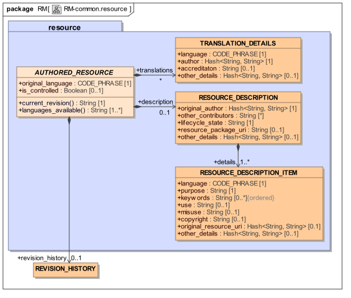

#### 7.1.1.自然语言和翻译

编写的资源包含自然语言元素，因此以一些原始语言创建，记录在AUTHORED_RESOURCE类的orginal_language属性中。关于翻译的信息包括在翻译属性中，这允许记录一组或多组翻译细节。通过执行以下操作转换资源：

- 将每个依赖语言的元素翻译成新语言;

- 向翻译添加新的TRANSLATION_DETAILS实例，其中包含有关翻译者，组织，质量保证等的详细信息。

- 在AUTHORED_RESOURCE的派生类型实例中对语言特定元素的任何进一步翻译。

languages_available函数提供资源中语言的完整列表。

#### 7.1.2.元数据

通常被认为是资源的“元数据”，即其作者，创建日期，目的和其他描述性项目，由RESOURCE_DESCRIPTION和RESOURCE_DESCRIPTION_ITEM类描述。这是自然语言的部分，因此可能需要翻译版本，在RESOURCE_DESCRIPTION_ITEM类的实例中表示。因此，如果一个RESOURCE_DESCRIPTION有多个RESOURCE_DESCRIPTION_ITEM，这些中的每一个都应该携带不同的自然语言完全相同的信息。

AUTHORED_RESOURCE.description属性是可选的，允许没有元数据的资源。资源在部分建设状态。 translations属性仍然可能是必需的，因为可能存在与语言相关的资源对象的其他部分（由AUTHORED_RESOURCE继承的类指定）。

#### 7.1.3.修订记录

当资源被视为处于应该控制其更改的状态时，is_controlled属性设置为True，并且所有后续更改都应记录审计跟踪。通常，受控资源将在版本化存储库（例如由CVS，Subversion或类似系统实现）中管理，并且审计信息将被存储在存储库中的某处（例如，在版本控制文件中）。在AUTHROED_RESOURCE类中定义的revision_history属性旨在作为资源库用户所熟知的版本历史记录的文档副本。考虑到不同地方的资源可以在不同类型的存储库中进行管理，在资源内具有标准化形式的修订历史的副本使其能够通过创作和其他工具被互操作地使用。

对提交到相关存储库的资源的每个更改都会导致revision_history的新增。

### 7.2.类描述

#### 7.2.1. AUTHORED_RESOURCE类

<table>
	<tr>
		<td>类</td>
		<td colspan="2">AUTHORED_RESOURCE（abstract）</td>
	</tr>
	<tr>
		<td>描述</td>
		<td colspan="2">人类作者创造的在线资源的抽象思想。</td>
	</tr>
	<tr>
		<td>属性</td>
		<td>签名</td>
		<td>含义</td>
	</tr>
	<tr>
		<td>1..1</td>
		<td>original_language：CODE_PHRASE</td>
		<td>最初创建此资源的语言。虽然整体上没有资源的语言优先，但是需要原始创作的语言来确保自然语言翻译可以保持质量。语言在描述和本体部分都是相关的。</td>
	</tr>
	<tr>
		<td>0..1</td>
		<td>is_controlled：Boolean</td>
		<td>如果此资源受到任何更改控制（即使是文件复制），则为True，在这种情况下会创建修订历史记录。</td>
	</tr>
	<tr>
		<td>0..1</td>
		<td>翻译：列表<TRANSLATION_DETAILS></td>
		<td>由该资源做出的每个自然翻译的细节列表，由语言锁定。对于此处列出的每个翻译，资源的所有语言相关部分必须有相应的部分。 original_language不会出现在此列表中。</td>
	</tr>
	<tr>
		<td>0..1</td>
		<td>说明：RESOURCE_DESCRIPTION</td>
		<td>资源的描述和生命周期信息。</td>
	</tr>
	<tr>
		<td>0..1</td>
		<td>revision_history：REVISION_HISTORY</td>
		<td>资源的修订历史。仅当is_controlled = True时才需要（避免大的修订历史记录用于非正式或专用编辑情况）。</td>
	</tr>
	<tr>
		<td>函数</td>
		<td>签名</td>
		<td>含义</td>
	</tr>
	<tr>
		<td></td>
		<td>
<pre>
current_revision：String
Post：Result = revision_history.most_recent_version
</pre>
		</td>
		<td>如果is_controlled else（不受控制），则为revision_history中的最近修订版本。</td>
	</tr>
	<tr>
		<td></td>
		<td>languages_available：List <String></td>
		<td>此资源中可用的语言总列表，派生自original_language和翻译。</td>
	</tr>
	<tr>
		<td>不变</td>
		<td colspan="2">Original_language_valid：code_set（Code_set_id_languages）.has_code（original_language.as_string）</td>
	</tr>
	<tr>
		<td></td>
		<td colspan="2">Languages_available_valid：languages_available.has（original_language）</td>
	</tr>
	<tr>
		<td></td>
		<td colspan="2"Revision_history_valid：is_controlled xor revision_history = Void</td>
	</tr>
	<tr>
		<td></td>
		<td colspan="2">Current_revision_valid：（current_revision / = Void而不是is_controlled）意味着current_revision.is_equal（“（不受控制的）”）</td>
	</tr>
	<tr>
		<td></td>
		<td colspan="2">translate_valid：translations / = Void隐含（不是translations.is_empty，而不是translations.has（orginal_language.code_string））</td>
	</tr>
	<tr>
		<td></td>
		<td colspan="2">Description_valid：translations / = Void implies（description.details.for_all（d | translations.has_key（d.language.code_string）））</td>
	</tr>
</table>

#### 7.2.2. TRANSLATION_DETAILS类

<table>
	<tr>
		<td>类</td>
		<td colspan="2">TRANSLATION_DETAILS</td>
	</tr>
	<tr>
		<td>描述</td>
		<td colspan="2">类提供自然语言翻译的细节。</td>
	</tr>
	<tr>
		<td>属性</td>
		<td>签名</td>
		<td>含义</td>
	</tr>
	<tr>
		<td>1..1</td>
		<td>语言：CODE_PHRASE</td>
		<td>翻译语言。</td>
	</tr>
	<tr>
		<td>1..1</td>
		<td>作者：Hash <String，String></td>
		<td>翻译者姓名和其他人口统计细节。</td>
	</tr>
	<tr>
		<td>0..1</td>
		<td>accreditaton：String</td>
		<td>翻译者的认证，通常是国家翻译的注册或协会会员身份。</td>
	</tr>
	<tr>
		<td>0..1</td>
		<td>other_details：Hash <String，String></td>
		<td>任何其他元数据。</td>
	</tr>
	<tr>
		<td>不变</td>
		<td colspan="2">Language_valid：code_set（Code_set_id_languages）.has_code（language）</td>
	</tr>
</table>

7.2.3. RESOURCE_DESCRIPTION类

<table>
	<tr>
		<td>类</td>
		<td colspan="2">RESOURCE_DESCRIPTION</td>
	</tr>
	<tr>
		<td>描述</td>
		<td colspan="2">定义资源的描述性元数据。</td>
	</tr>
	<tr>
		<td>属性</td>
		<td>签名</td>
		<td>含义</td>
	</tr>
	<tr>
		<td>1..1</td>
		<td>original_author：Hash <String，String></td>
		<td>本资源的原作者，具有所有相关细节，包括组织。</td>
	</tr>
	<tr>
		<td>0..1</td>
		<td>other_contributors：List &lt;String&gt;</td>
		<td>资源的其他贡献者，可能以名称<email>形式列出。</td>
	</tr>
	<tr>
		<td>1..1</td>
		<td>lifecycle_state：String</td>
		<td>资源的生命周期状态，通常包括以下状态：初始，提交，实验，awaiting_approval，已批准，已取代，已过时。</td>
	</tr>
	<tr>
		<td>0..1</td>
		<td>resource_package_uri：String</td>
		<td>此资源所属的包的URI。</td>
	</tr>
	<tr>
		<td>0..1</td>
		<td>other_details：Hash <String，String></td>
		<td>附加的非语言资源元数据，作为名称/值对的列表。</td>
	</tr>
	<tr>
		<td>1..1</td>
		<td>parent_resource：AUTHORED_RESOURCE = 0..1</td>
		<td>引用拥有资源。</td>
	</tr>
	<tr>
		<td>1..1</td>
		<td>详细信息：列表<RESOURCE_DESCRIPTION_ITEM></td>
		<td>资源描述的所有部分的细节是自然语言相关的，由语言代码锁定。</td>
	</tr>
	<tr>
		<td>不变</td>
		<td colspan="2">Original_author_valid：not original_author.is_empty</td>
	</tr>
	<tr>
		<td></td>
		<td colspan="2">Lifecycle_state_valid：not lifecycle_state.is_empty</td>
	</tr>
	<tr>
		<td></td>
		<td colspan="2">Details_valid：not details.is_empty</td>
	</tr>
	<tr>
		<td></td>
		<td colspan="2">Language_valid：parent_resource / = Void隐含details.for_all（d | parent_resource.languages_available.has（d.language.code_string））</td>
	</tr>
	<tr>
		<td></td>
		<td colspan="2">Parent_resource_valid：parent_resource / = Void意味着parent_resource.description = self</td>
	</tr>
</table>

7.2.4. RESOURCE_DESCRIPTION_ITEM类

<table>
	<tr>
		<td>类</td>
		<td colspan="2">RESOURCE_DESCRIPTION_ITEM</td>
	</tr>
	<tr>
		<td>描述</td>
		<td colspan="2">语言特定的资源描述细节。当资源被翻译以在另一语言环境中使用时，每个RESOURCE_DESCRIPTION_ITEM需要被复制和翻译成新语言。</td>
	</tr>
	<tr>
		<td>继承</td>
		<td colspan="2"></td>
	</tr>
	<tr>
		<td>属性</td>
		<td>签名</td>
		<td>含义</td>
	</tr>
	<tr>
		<td>1..1</td>
		<td>语言：CODE_PHRASE</td>
		<td>本描述项中的项目所在的本地化语言。从openEHR代码集语言编码。</td>
	</tr>
	<tr>
		<td>1..1</td>
		<td>purpose：String</td>
		<td>资源的目的。</td>
	</tr>
	<tr>
		<td>0..1</td>
		<td>关键字：List <String></td>
		<td>表征此资源的关键字，例如用于索引和搜索。</td>
	</tr>
	<tr>
		<td>0..1</td>
		<td>use：String</td>
		<td>资源的使用的描述，即其可以在其中使用的上下文。</td>
	</tr>
	<tr>
		<td>0..1</td>
		<td>misuse：String</td>
		<td>对资源的任何误用的描述，即不应该使用它的上下文。</td>
	</tr>
	<tr>
		<td>0..1</td>
		<td>copyright：String</td>
		<td>作为知识资源的资源的可选版权声明。</td>
	</tr>
	<tr>
		<td>0..1</td>
		<td>original_resource_uri：List <Hash <String，String >></td>
		<td>原始临床文档的URI或该资源是以该描述项目的语言形式化的描述;关键的意义。</td>
	</tr>
	<tr>
		<td>0..1</td>
		<td>other_details：Hash <String，String></td>
		<td>附加的语言固有资源元数据，作为名称/值对的列表。</td>
	</tr>
	<tr>
		<td>不变</td>
		<td colspan="2">Language_valid：code_set（Code_set_id_languages）.has_code（language）</td>
	</tr>
	<tr>
		<td></td>
		<td colspan="2">Purpose_valid：not purpose.is_empty</td>
	</tr>
	<tr>
		<td></td>
		<td colspan="2">Use_valid：use / = Void意味着不使用use.is_empty</td>
	</tr>
	<tr>
		<td></td>
		<td colspan="2">misuse_valid：misuse / = Void意味着不是misuse.is_empty</td>
	</tr>
	<tr>
		<td></td>
		<td colspan="2">copyright_valid：copyright / = Void不是copyright.is_empty</td>
	</tr>
</table>

## 参考文献

### 出版物

<ol><li>
    [Anderson_1996]罗斯·安德森。临床信息系统的安全性。可在http://www.cl.cam.ac.uk/users/rja14/policy11/policy11.html获取。
</li><li>
    [Baretto_2005] Barretto S A.设计基于指南的工作流程 - 综合电子健康记录。南澳大学博士论文。可在http://www.cis.unisa.edu.au/~cissab/Barretto_PhD_Thesis_Revised_FINAL.pdf。
</li><li>
    [Beale_2000] Beale T. Archetypes：Constraint-based Domain Models for Future-proof Information Systems。 2000.可查阅http://www.openehr.org/files/resources/publications/archetypes/archetypes_beale_web_2000.pdf。
</li><li>
    [Beale_2002] Beale T.Archetypes：Constraint-based Domain Models for Future-proof Information Systems。第十一届OOPSLA行为语义研讨会：为客户服务（西雅图，美国华盛顿，2002年11月4日）。由Kenneth Baclawski和Haim Kilov编辑。 Northeastern University，Boston，2002，pp。16-32.请访问http://www.openehr.org/files/resources/publications/archetypes/archetypes_beale_oopsla_2002.pdf。
</li><li>
    [Beale_Heard_2007] Beale T，Heard S. An Ontology-based Model of Clinical Informat
</li><li>
	[Booch_1994] Booch G.面向对象的分析和设计与应用。第2版​​。本杰明/ Cummings 1994.
</li><li>
    [Browne_2005] Browne E D.工作流建模协调的健康护理提供者护理计划。南澳大学博士论文。请访问http://www.openehr.org/publications/workflow/t_browne_thesis_abstract.htm。
</li><li>
    [Cimino_1997] Cimino J J. Desiderata for Controlled Medical vocabularies in the Twenty-F​​irst Century。 IMIA WG6 Conference，Jacksonville，Florida，Jan 19-22,1997.
</li><li>
    [埃菲尔]迈耶B.埃菲尔的语言（第二版）。 Prentice Hall，1992.
</li><li>
    [Elstein_1987] Elstein AS，Shulman LS，Sprafka SA。医学问题解决：临床推理的分析。剑桥，MA：哈佛大学出版社1987.
</li><li>
    [Elstein_Schwarz_2002] Elstein AS，Schwarz A.临床诊断的证据基础：临床问题解决和诊断决策：对认知文献的选择性审查。 BMJ 2002; 324; 729-732.
</li><li>
    [Fowler_1997] Fowler M.分析模式：可重用对象模型。 Addison Wesley 1997
</li><li>
    [Fowler_Scott_2000] Fowler M，Scott K.UML Distilled（第2版）。 Addison Wesley Longman 2000.
</li><li>
    [Gray_reuter_1993] Gray J，Reuter A. Transaction Processing Concepts and Techniques。 Morgan Kaufmann 1993.
</li><li>
    [Hein_2002] Hein J L.Discrete Structures，Logic and Computability（2nd Ed）。琼斯和巴特利特2002.
</li><li>
    [Hnìtynka_2004]HnìtynkaP，PlášilF. MOF的分布式版本控制模型。 Proceedings of WISICT 2004，Cancun，Mexico，A volume in the ACM international conference proceedings series，published by Computer Science Press，Trinity College Dublin Ireland，2004.
</li><li>
    [Ingram_1995] Ingram D.欧洲良好健康记录项目。 Laires，Laderia Christensen，Eds。健康在新的通信时代。阿姆斯特丹：IOS出版社; 1995; pp。66-74.
</li><li>
    [Kifer_Lausen_Wu_1995] Kifer M，Lausen G，Wu J. Logical Foundations of Object-Oriented and FrameBased Languages。 JACM 1995年5月。见见ftp://ftp.cs.sunysb.edu/pub/TechReports/kifer/flogic.pdf。
</li><li>
    [Kilov_1994] Kilov H，Ross J.信息建模 - 一种面向对象的方法。 Prentice Hall 1994.
</li><li>
    [Maier_2000] Maier M.系统建模原则。技术报告，阿拉巴马大学在亨茨维尔。 2000.可在http://www.infoed.com/Open/PAPERS/systems.htm获得
</li><li>
    [Martin] Martin P. UML，OWL，KIF和WebKB-2语言之间的翻译（For-Taxonomy，Frame-CG，Formalized English）。 May / June 2003. Available at http://www.webkb.org/doc/model/comparisons.html as at Aug 2004.
</li><li>
    [Meyer_OOSC2] Meyer B. Object-oriented Software Construction，2nd Ed。 Prentice Hall 1997
</li><li>
    [Müller_2003]MüllerR. Event-oriented Dnamic Adaptation of Workflows：Model，Architecture，and Implementation。莱比锡大学博士论文。请访问http://www.openehr.org/publications/workflow/t_mueller_thesis_abstract.htm。
</li><li>
    [Object_Z] Smith G.对象Z规范语言。 Kluwer Academic Publishers 2000.见http://www.itee.uq.edu.au/~smith/objectz.html。
</li><li>
    [Rector_1994] Rector A L，Nowlan W A，Kay S. Foundations for an Electronic Medical Record。 The IMIA Yearbook of Medical Informatics 1992（Eds.van Bemmel J，McRay A）。 Stuttgart Schattauer 1994.
</li><li>
    [Rector] Rector A L.临床术语：为什么这么难？方法。 1999 Dec; 38（4-5）：239-52.可在http://www.cs.man.ac.uk/~rector/papers/Why-is-terminology-hard-single-r2.pdf。
</li><li>
    [Richards_1998] Richards E G. Mapping Time - The Calendar and its History。牛津大学出版社1998.
</li><li>
    [Sowa_2000] Sowa J F.知识表示：逻辑，哲学和计算基础。 2000，Brooks / Cole，California。
</li><li>
    [Sottile_1999] Sottile P.A.，Ferrara F.M.，Grimson W.，Kalra D.，and Scherrer J.R.The holistic healthcare information system。欧洲电子健康记录。 1999年11月; 259-266.
</li><li>
    [Van_de_Velde_Degoulet_2003] Van de Velde R，Degoulet P. Clinical Information Systems：A Component-Based Approach。 2003. Springer-Verlag New York。
</li><li>
    [Weed_1969] Weed LL。医疗记录，医疗教育和病人护理。 6 ed。芝加哥：年鉴医疗出版商公司1969年。
</li></ol>

### 资源

#### 本体

<ol><li>
    [bfo]正式本体和医学信息科学研究所（IFOMIS）。基本正式本体论（BFO）。 http://ifomis.uni-saarland.de/bfo/。
</li><li>
    [FMA] http://sig.biostr.washington.edu/projects/fm/。
</li><li>
    [Horrocks_owl] Patel-Schneider P，Horrocks I，Hayes P. OWL Web本体语言语义和抽象语法。请参阅http://w3c.org/TR/owl-semantics/。
</li><li>
    信息工件本体。 https://code.google.com/p/information-artifact-ontology/。
</li><li>
    [OBO] The Open Biological and Biomedical Ontologies。见http://www.obofoundry.org/。
</li><li>
    [OGMS]一般医学科学本体（OGMS）。 https://code.google.com/p/ogms/。
</li></ol>

#### 一般

1.  [cov_contra]维基百科。协方差和逆变。请参阅https://en.wikipedia.org/wiki/Covariance_and_contravariance_(computer_science）。

#### 电子卫生标准

<ol><li>
    [ENV_13606-1] ENV 13606-1 - 电子医疗记录通信 - 第1部分：扩展架构。 CEN / TC 251健康信息技术委员会。
</li><li>
    [ENV_13606-2] ENV 13606-2 - 电子医疗记录通信 - 第2部分：域名术语列表。 CEN / TC 251健康信息技术委员会。
</li><li>
    [ENV_13606-3] ENV 13606-3 - 电子医疗记录通信 - 第3部分：分发规则。 CEN / TC 251健康信息技术委员会。
</li><li>
    [ENV_13606-4] ENV 13606-4 - 电子医疗记录通信标准第4部分：信息交换的信息。 CEN / TC 251健康信息技术委员会。
</li><li>
    [Corbamed_PIDS]对象管理组。人身份识别服务。 1999年3月。
</li><li>
    [Corbamed_LQS]对象管理组。词典查询服务。 1999年3月。
</li><li>
    [HL7v3_ballot2] JL7国际。 HL7版本3第二选票规格。可在http://www.hl7.org获得。
</li><li>
    [HL7v3_data_types] Schadow G，Biron P. HL7版本3可交付：版本3数据类型。 （2002年第二版投票）。
</li><li>
    [hl7_v3_rim] HL7. HL7 v3 RIM。见http://www.hl7.org。
</li><li>
    [ICD10AM]。世卫组织/ ACCD。国际疾病分类，第10次修订，澳大利亚修改。请参见https://www.accd.net.au/Icd10.aspx
</li><li>
    [IHTSDO]国际健康术语标准制定组织（IHTSDO）。 http://www.ihtsdo.org。
</li><li>
    [IHTSDO_URIs] IHTSDO。 SNOMED CT URI标准。 http://ihtsdo.org/fileadmin/user_upload/doc/download/doc_UriStandard_Current-en-US_INT_20140527.pdf?ok。
</li><li>
    [NLM_UML_list]国家医学图书馆。 UMLS术语表。 http://www.nlm.nih.gov/research/umls/metaa1.html。
</li><li>
    [SNOMED_CT] IHTSDO。系统化命名医学。请参见http://www.ohtsdo.org。
</li><li>
    [WHO_ICD]世界卫生组织（WHO）。国际疾病分类（ICD）。见：http：//www.who.int/classifications/icd/en/。
</li><li>
    [ISO_18308] Schloeffel P.（编辑）。电子健康记录参考架构的要求。 （ISO TC 215 / SC N; ISO / WD 18308）。国际标准组织，澳大利亚，2002年。
</li><li>
    [ISO_20514] ISO。综合护理EHR。见http://www.iso.org/iso/iso_catalogue/catalogue_tc/catalogue_detail.htm?csnumber=39525.
</li><li>
    [UCUM] Schadow G，McDonald C J.The Unified Code for Units of Measure，Version 1.4 2000.Regenstrief Institute for Health Care，Indianapolis。请参阅http://aurora.rg.iupui.edu/UCUM
</li></ol>

#### 电子卫生项目

<ol><li>
    [CIMI]临床信息建模倡议（CIMI）项目。参见http://opencimi.org。
</li><li>
    [EHCR_supA_14] Dixon R，Grubb P A，Lloyd D，and Kalra D. Consolidated List of Requirements。 EHCR支持行动交付1.4.欧洲委员会DGXIII，布鲁塞尔; 2001年5月59pp可从http://www.chime.ucl.ac.uk/HealthI/EHCR-SupA/del1-4v1_3.PDF获得。
</li><li>
    [EHCR_supA_35] Dixon R，Grubb P，Lloyd D. EHCR支持行动交付3.5：“对CEN未来工作的最终建议”。 2000年10月。见http://www.chime.ucl.ac.uk/HealthI/EHCRSupA/documents.htm。
</li><li>
    [EHCR_supA_24] Dixon R，Grubb P，Lloyd D. EHCR支持行动2.4“CEN EHCRA解释和实施指南”。 2000年10月。见http://www.chime.ucl.ac.uk/HealthI/EHCR-SupA/documents.htm。
</li><li>
    [Lloyd D，et al。 EHCR支持行动交付3.1和3.2“CEN的中期报告”。 July 1998. Available at http://www.chime.ucl.ac.uk/HealthI/EHCR-SupA/documents.htm。
</li><li>
    [GEHR_del_4]可交付成果4：GEHR临床综合性要求。 GEHR项目1992
</li><li>
    [GEHR_del_7]可交付成果7：临床功能规范。 GEHR项目1993
</li><li>
    [GEHR_del_8]可交付成果8：GEHR架构和系统的伦理和法律要求。 1994年GEHR项目
</li><li>
    [GEHR_del_19_20_24]交付成果19,20,24：GEHR架构。 GEHR项目30/6/1995
</li><li>
    [GeHR_AUS] Heard S，Beale T.The Good Electronic Health Record（GeHR）（Australia）。请参阅http://www.openehr.org/resources/related_projects#gehraus。
</li><li>
    [GeHR_Aus_gpcg] Heard S. GEHR Project Australia，GPCG Trial。可在http://www.gehr.org/gpcg/ehra.htm。
</li><li>
    [GeHR_Aus_req] Beale T，Heard S.GEHR技术要求。请参阅http://www.gehr.org/technical/requirements/gehr_requirements.html。
</li><li>
    [Synapses_req_A] Kalra D.（Editor）。突触用户需求和功能规范（A部分）。欧盟远程信息处理应用程序，布鲁塞尔; 1996;突触项目：可交付用户1.1.1a。 6章，176页。
</li><li>
    [Synapses_req_B] Grimson W.和Groth T.（Editors）。突触用户需求和功能规范（B部分）。欧盟远程信息处理应用程序，布鲁塞尔; 1996;突触项目：可交付用户1.1.1b。
</li><li>
	[Synapses_odp] Kalra D.（编辑）。突触ODP信息观点。欧盟远程信息处理应用程序，布鲁塞尔; 1998;突触项目：最终交付。 10章，64页。
</li><li>
    [synex]伦敦大学学院。 SynEx项目。 http://www.chime.ucl.ac.uk/HealthI/SynEx/。
</li></ol>

#### 一般标准

<ol><li>
    [OCL]对象约束语言2.0.对象管理组（OMG）。可在http://www.omg.org/cgi-bin/doc?ptc/2003-10-14.
</li><li>
    [IANA] IANA。 http://www.iana.org/。
</li><li>
    [IEEE_828] IEEE。 IEEE 828-2005：软件配置管理计划标准。
</li><li>
    [ISO_8601] ISO 8601标准描述了表示时间，日期和持续时间的格式。参见例如http://www.mcs.vuw.ac.nz/technical/software/SGML/doc/iso8601/ISO8601.html和http://www.cl.cam.ac.uk/~mgk25/iso-time.html 。
</li><li>
    [ISO_2788] ISO。 ISO 2788单语词典的建立和发展指南。
</li><li>
    [ISO_5964] ISO。 ISO 5964建立和开发多语言词典的指南。
</li><li>
    [Perl_regex] Perl.org。 Perl正则表达式。可在http://perldoc.perl.org/perlre.html。
</li><li>
    斯坦福大学。参见http://protege.stanford.edu/。
</li><li>
    [rfc_2396] Berners-Lee T.Universal Resource Identifiers in WWW。可在http://www.ietf.org/rfc/rfc2396.txt。这是一个用于全局资源识别的万维网RFC。在当前在网上使用时，由Mosaic，Netscape和类似工具。有关URI的起点，请参阅http://www.w3.org/Addressing。
</li><li>
    [rfc_2440] RFC 2440：OpenPGP消息格式。见http://www.ietf.org/rfc/rfc2440.txt和http://www.ietf.org/internet-drafts/draft-ietf-openpgp-rfc2440bis-18.txt
</li><li>
    [rfc_3986] RFC 3986：统一资源标识符（URI）：通用语法。 IETF。参见http://www.ietf.org/rfc/rfc3986.txt。
</li><li>
    [rfc_4122] RFC 4122：通用唯一标识符（UUID）URN命名空间。 IETF。参见http://www.ietf.org/rfc/rfc4122.txt。
</li><li>
    [rfc_2781] IETF。 RFC 2781：UTF-16，ISO 10646的编码见http://tools.ietf.org/html/rfc2781.
</li><li>
    [rfc_5646] IETF。 RFC 5646. Available at http://tools.ietf.org/html/rfc5646.
</li><li>
    [sem_ver]语义版本化。 http://semver.org。
</li><li>
    [Xpath] W3C Xpath 1.0规范。 1999.可在http://www.w3.org/TR/xpath。
</li><li>
    [uri_syntax]统一资源标识符（URI）：通用语法，因特网提议的标准。 2005年1月。见http://www.ietf.org/rfc/rfc3986.txt。
</li><li>
    [w3c_owl] W3C。 OWL - Web本体语言。请参阅http://www.w3.org/TR/2003/CR-owl-ref-20030818/。
</li><li>
    [w3c_xpath] W3C。 XML路径语言。请参阅http://w3c.org/TR/xpath。
</li></ol>

#### 工具

1.  [Template_Designer]模板设计器。海洋信息学。 http://www.openehr.org/downloads/modellingtools

#### openEHR资源

<ol><li>
    [openehr_18308] openEHR基金会。 openEHR架构符合ISO TS 18308“EHR体系结构的要求”。请参阅http://www.openehr.org/releases/trunk/architecture/iso18308_conformance.pdf。
</li><li>
    [openEHR_ADL_workbench] openEHR基金会。 openEHR ADL工作台。 http://www.openehr.org/downloads/ADLworkbench/home。
</li><li>
    [openehr_am_overview] openEHR基金会。 openEHR原型技术概述。请参阅http://www.openehr.org/releases/AM/latest/Overview.html。
</li><li>
    [openehr_am_adl14] openEHR基金会。原型定义语言1.4（ADL1.4）。请访问http://www.openehr.org/releases/AM/latest/ADL1.4.html。
</li><li>
    [openehr_am_aom14] openEHR基金会。原型对象模型1.4（AOM1.4）。请访问http://www.openehr.org/releases/AM/latest/AOM1.4.html。
</li><li>
    [openehr_am_adl2] openEHR基金会。原型定义语言2（ADL2）。请访问http://www.openehr.org/releases/AM/latest/ADL2.html。
</li><li>
    [openehr_am_aom2] openEHR基金会。原型对象模型2（AOM2）。请访问http://www.openehr.org/releases/AM/latest/AOM2.html。
</li><li>
    [openehr_am_identification] openEHR基金会。原型标识规范。请访问http://www.openehr.org/releases/AM/latest/Identification.html。
</li><li>
    [openehr_am_def_pri] openEHR基金会。原型定义和原则。 （已弃用）可查阅http://www.openehr.org/releases/1.0.2/architecture/am/archetype_principles.pdf。
</li><li>
    [openehr_am_sys] openEHR基金会。原型系统。 （已弃用）可查阅http://www.openehr.org/releases/1.0.2/architecture/am/archetype_system.pdf。
</li><li>
    [openehr_am_oap] openEHR基金会。 openEHR原型配置文件。 http://www.openehr.org/releases/1.0.2/architecture/am/openehr_archetype_profile.pdf。
</li><li>
    [openehr_CKM] openEHR临床知识经理（CKM）。请参阅http://www.openEHR.org/ckm
</li><li>
    [openehr_odin] openEHR基金会。对象数据实例符号（ODIN）。请访问http://www.openehr.org/releases/BASE/latest/odin.html。
</li><li>
    [openeneH_overview] openEHR基金会。 openEHR架构概述。请参阅http://www.openehr.org/releases/BASE/latest/architecture_overview.html。
</li><li>
	[openehr_query_aql] openEHR基金会。 openEHR原型查询语言（AQL）。请参阅http://www.openehr.org/releases/QUERY/latest/AQL.html。
</li><li>
    [openehr_rm_data_types] openEHR。数据类型信息模型。请参阅http://www.openehr.org/releases/RM/Release-1.0.3/data_types.html。
</li><li>
    [openehr_rm_data_structures] openEHR。数据结构信息模型。请参阅http://www.openehr.org/releases/RM/Release-1.0.3/data_structures.html。
</li><li>
    [openehr_rm_common] openEHR。公共信息模型。请参阅http://www.openehr.org/releases/RM/Release-1.0.3/common.html。
</li><li>
    [openehr_rm_ehr] openEHR基金会。 EHR信息模型。 http://www.openehr.org/releases/RM/Release-1.0.3/ehr.html。
</li><li>
    [openehr_rm_ehr_extract] openEHR基金会。 EHR Extrct信息模型。 http://www.openehr.org/releases/RM/Release-1.0.3/ehr_extract.html。
</li><li>
    [openehr_rm_integration] openEHR基金会。集成信息模型。 http://www.openehr.org/releases/RM/Release-1.0.3/integration.html。
</li><li>
    [openehr_rm_support] openEHR。支持信息模型。请参阅http://www.openehr.org/releases/RM/Release-1.0.3/support.html。
</li><li>
    openEHR基金会。 openEHR术语http://www.openehr.org/releases/TERM/latest/SupportTerminology.html。
</li><li>
    [openeneHL基金会]。 openEHR术语项目（GitHub）https://github.com/openEHR/terminology。
</li></ol>

最后更新2015-12-10 13:17:43 GMT