# 数据结构信息模型

发行人：openEHR规范程序

发布：版本1.0.3

状态：STABLE

修订：[latest_issue]

日期：[latest_issue_date]

关键词：EHR，数据结构，openehr

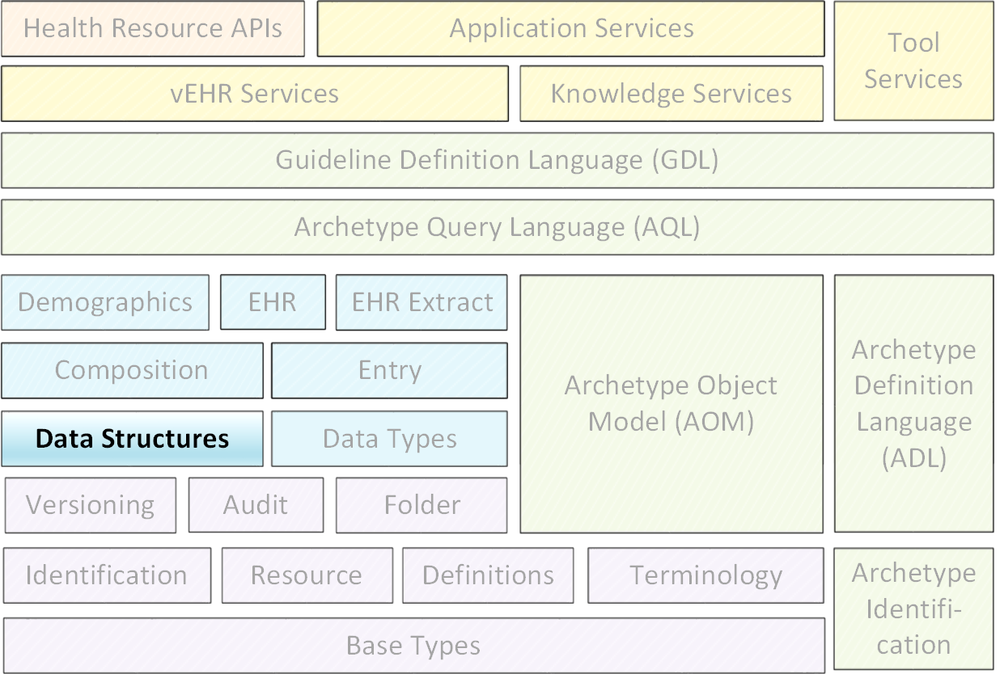

©2003 - 2015 openEHR基金会

openEHR基金会是一个独立的非营利社区组织，通过开源，基于标准的实施，促进消费者和临床医生共享健康记录。

- 许可: Creative Commons Attribution-NoDerivs 3.0 Unported。 https://creativecommons.org/licenses/by-nd/3.0/

- 支持: 
	- 问题：https：//openehr.atlassian.net/browse/SPECPR/
	- 网址：http：//www.openehr.org/

## 修订记录

- R E L E A S E 1.0.3

	- 1.7.2（2015年11月15日）
		- SPECRM-42.阐明HISTORY.summary的定义（地址为SPECPR-81.
- R E L E A S E 1.0.2
	- 1.7.1 （2008年11月5日）
		- SPEC-271.修正ITEM_TABLE规范和示例中的次要不一致。
		- SPEC-257：更正小的拼写错误并澄清文本。
		- SPEC-255.在INTERVAL_EVENT.width文档中纠正小错误。
		- SPEC-283.将ELEMENT.null_flavor属性的拼写更正为null_flavour。
- R E L E A S E 1.0.1
	- 1.7 （2006年9月26日）
		- SPEC-200.正确的1.0版排字错误。对图表的微小化妆品更改。将ITEM_TABLE函数的正确返回类型更正为CLUSTER，而不是List <ELEMENT>。
		- SPEC-207：将ITEM_TABLE列更改为行。
		- SPEC-219：使用常量而不是文字来引用RM中的术语。
		- SPEC-220：拧紧HISTORY.period和EVENT.time的语义。
- R E L E A S E 1.0
	- 1.6 （16 Dec 2005）
		- SPEC-14.调整历史记录。主要简化包装;使事件在时间上是绝对的。
		- SPEC-155：摘要数据。
		- SPEC-183.从ITEM_TREE中删除根节点。
		- SPEC-185.改进的EVENT模型。
		- SPEC-155：摘要数据。
		- SPEC-192：将增强显示为绝对设施添加到历史记录中的增量事件（仅添加说明）。
		- SPEC-193：简化INTERVAL_EVENT的原型和路径。每个INTERVAL_EVENT返回一个数学函数。
		- SPEC-196：将HISTORY.items重命名为事件。
		- SPEC-192.支持更改，增加和减少历史记录中的事件。
- R E L E A S E 0.96
- R E L E A S E 0.95
	- 1.5.1 （2005年2月22日）
		- SPEC-48.文件的预发布审查。固定HISTORY UML图 - 删除多余的T：XXX（无语义变化）。将转换的参数类型转换为UML框形式。
	- 1.5 （2004年12月10日）
		- SPEC-101.改进结构类的建模。
		- SPEC-100. ITEM_STRUCTURE包中的正确继承错误。
		- SPEC-24.将含义恢复为STRING，并重命名为archetype_node_id_。
		- SPEC-118.使包名称为小写。
		- SPEC-123. EVENT应该继承LOCATABLE。
		- 规格-124.修复数据结构中的路径语法IM文档。
- R E L E A S E 0.9
	- 1.4 （2004年3月09日）
		- SPEC-19.添加HISTORY和STRUCTURE超类。
		- SPEC-28.更改STRUCTURE类的名称以避免冲突。
		- SPEC-89.删除ITEM.displayed。
		- SPEC-91.纠正使用CODE_PHRASE和DV_CODED_TEXT时的异常。
		- SPEC-67.更改EVENT类以启用数学函数间隔A测量。将EVENT.duration和SINGLE_EVENT.duration重命名为width。
	- 1.3.3 （2003年9月4日）
		- SPEC-41.在openEHR文档中可视化区分基本类型。
	- 1.3.2 （2003年6月20日）
		- SPEC-13重命名键类 - 将COMPOUND重命名为CLUSTER以符合CEN 13606.
	- 1.3.1 （2003年3月18日）
		- 改进的标题布局，包命名。使HISTORY.is_periodic成为一个函数。
	- 1.3 （2003年2月20日）
		- 使用ISE Eiffel 5.2正式验证。没有变化。
	- 1.2.1 （08 Jan 2003）
		- 对terminology_id不变量的小修正。
	- 1.2 （18 Dec 2002）
		- 定义的包正确，并从EHR RM移动HISTORY类。语义没有改变。
	- 1.1.1 （2002年11月10日）
		- 次要更正：SINGLE_S新功能。
	- 1.1 （2002年11月1日）
		- 由于DV_CODED_TEXT的更改而导致的微小调整。
	- 1.0 （2002年10月11日）
		- 取自Common RM。

## 致谢

本文件所报告的工作由下列组织提供资金：

- 伦敦大学学院 - 健康信息学和多专业教育中心（CHIME）;

- 海洋信息;

- 分布式系统技术中心（DSTC），通过澳大利亚联邦政府总理和内阁部合作研究中心计划。

感谢澳大利亚Kestral Computing的Grahame Grieve提供与历史数据相关的一般性输入和示例。

特别感谢CHIME负责人David Ingram教授，他提供了自GEHR（1992年）时代以来的愿景和合作的工作环境。

## 1.前言

## 1.1.目的

本文档描述了openEHR参考模型中使用的公共数据结构，包括列表，表，树和历史记录。

目标受众包括：

- 生产卫生信息学标准的标准机构;

- 使用openEHR的学术团体;

- 开源医疗保健社区;

- 解决方案供应商;

- 医疗信息学家和临床医生对健康信息感兴趣。

- 健康数据管理器。

### 1.2.相关文件

阅读本文档的前提条件包括：

- openEHR架构概述（[openehr_overview]）;

### 1.3.状态

此规范处于STABLE状态。本文档的开发版本可以在http://www.openehr.org/releases/RM/latest/data_structures.html找到。

已知的遗漏或问题在文本中用“待定”段落表示，如下：

TBD :(例如待定段落）

鼓励用户对这些段落以及主要内容发表评论和/或建议。应在技术邮件列表或规格问题跟踪器上提供反馈。

### 1.4.一致性

数据或软件工件与openEHR参考模型规范的一致性通过该工件相对于相关openEHR实现技术规范（ITS）（例如IDL接口或XML模式）的形式测试来确定。由于ITS是来自参考模型的形式化的自动推导，ITS一致性指示RM一致性。

## 2. 背景

### 2.1.要求

在EHR和其他系统中结构化数据的要求基本上是低级数据可以在标准结构中表示。通常需要的结构如下：

- 单值，例如。体重，身高，血糖;

- 命名/编号元素的列表，例如血液检查结果;

- 具有命名列和/或命名行的值表，例如视力结果;

- 值的树，例如。生物化学，微生物学结果;

- 值的历史，其每一个采取任何上述形式，例如，血压，葡萄糖水平或成像数据的时间序列。

### 2.2.设计原则

特别适用于这里描述的数据结构模型的设计原理是需要使用相同的通用表示（诸如层次结构）来为逻辑结构提供明确的规范。逻辑结构包括表，列表，树和历史的概念。

不管这样的结构是作为纯表示还是作为具有语义意义，都有各种原因明确地包括以通用方式表示的逻辑结构的语义，例如层次结构，包括：

- 对于互操作性来说，诸如逻辑表，列表或线性历史的结构以相同的方式由所有信息的发送者和接收者编码到通用表示中是至关重要的，否则不能保证任何通信方的软件处理结构预期的时尚;

- 软件实现者可以开发软件，其将逻辑结构明确地捕获为功能性接口，其被用作构建这样的结构的唯一方式。这样的接口（假设它们是无错误的）保证所有应用软件总是创建正确的结构 - 每次都不需要依赖调用软件进行低级调用以从层次元素中创建表或列表;

- 使用用于这种类型的功能接口意味着接收器端的应用软件总是能够以其预期形式处理输入信息，使得能够在屏幕上正确地呈现数据。

明确定义逻辑数据结构的动机之一是消除以前的EHR规范和标准（例如CEN 13606，GEHR，GEHR Australia和HL7v3 CDA规范）中记录结构和时间的模糊性。过去的替代方案是简单地使用通用的分层结构;在标准中没有就如何表示表格达成一致，类似地，时间没有标准表示。当记录单个值时，适当地设置意味着“记录时间”的属性;如果需要时间序列，则没有关于如何建模的明确指导。一种方法是建立一个逻辑上是两列表的双列表，其第一列是时间点数据，但是许多其他方法是可能的。标准化方法消除了所有这些模糊性，并提高了数据和软件的质量。

## 3.概述

rm.data_structures软件包包含两个软件包：item_structure软件包和历史记录软件包。第一种描述了通用的，可路径寻址的数据结构，而后者描述了用于记录过去时间中的事件的线性历史的通用概念。 data_structures包在下面的UML图中说明。

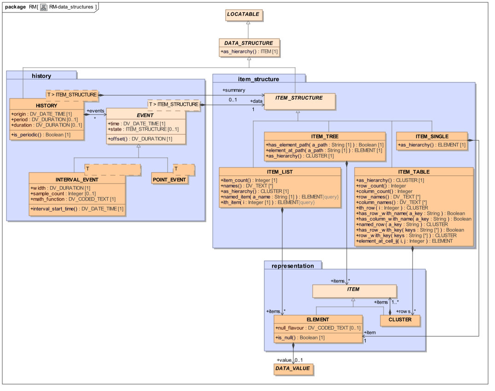

data_structures包本身包含单个类DATA_STRUCTURE，它是所有openEHR数据结构的祖先。其唯一的特征是as_hierarchy函数，它由DATA_STRUCTURE的每个子类型实现，以便生成CEN EN13606形式的结构的物理表示。 13606形式通常不如openEHR形式最优，但与较少语义丰富的标准兼容，并且（理论上）保证可被支持CEN EN13606作为互操作性标准的其他系统理解。

### 3.1.实例结构

在本文档中包括结构的典型实例的图。每个实例以物理和逻辑形式显示。物理形式显示如果使用表示包实现结构，将在数据中出现的实例。逻辑形式仅以逻辑形式显示相同的实例 - 即隐藏物理实现。只有后一种形式用于其他openEHR文档。在所有实例图中，以下缩写用于众所周知的属性名称：

- “m = xxxx” - 表示“意义= xxxx”，即从LOCATABLE类继承的archetype_node_id属性的含义。

- “n = xxxx” - 表示“name = xxxx”，即从LOCATABLE类继承的name属性的值。

- “v = xxxx” - 表示“value = xxxx”，即来自ELEMENT类的value属性的值。

## 3.2.类描述

### 3.2.1. DATA_STRUCTURE类

<table>
	<tr>
		<td>类</td>
		<td colspan="2">DATA_STRUCTURE（abstract）</td>
	</tr>
	<tr>
		<td>描述</td>
		<td colspan="2">所有数据结构类型的抽象父类。包括as_hierarchy函数，可以为每个子类型的物理表示生成等效的CEN EN13606单层次结构。例如，ITEM_LIST的物理表示是List <ELEMENT>;它的as_hierarchy的实现将生成一个CLUSTER包含来自列表中的ELEMENT节点的集合。</td>
	</tr>
	<tr>
		<td>继承</td>
		<td colspan="2">LOCATABLE</td>
	</tr>
	<tr>
		<td>属性</td>
		<td>签名</td>
		<td>含义</td>
	</tr>
	<tr>
		<td></td>
		<td></td>
		<td></td>
	</tr>
	<tr>
		<td>函数</td>
		<td>签名</td>
		<td>含义</td>
	</tr>
	<tr>
		<td>（有效）</td>
		<td>as_hierarchy：ITEM</td>
		<td>每个子类型的物理表示的等级分级，与CEN EN 13606结构兼容。</td>
	</tr>
</table>

## 4.项目结构包

### 4.1.概述

这里介绍的item_structure包类是对通用的，可构造的数据结构的需求的形式化，并且被所有openEHR参考模型使用。

ITEM_STRUCTURE类的子类明确地建模通常在健康记录数据中出现的逻辑数据结构类型，并且包括ITEM​​_SINGLE（对于单个值，例如患者体重），ITEM_LIST（对于诸如地址的部分的列表），ITEM_TREE诸如微生物报告的分层结构化数据）和ITEM_TABLE（用于诸如视敏度或反射测试结果的表格数据）。这些类中的每一个定义了功能接口，使用来自表示包的基本类型CLUSTER和ELEMENT具有最佳物理表示，并且可以生成其数据的符合CEN EN13606的分级表示。实现这些类型的任何系统都保证创建表示列表，表和树的逻辑结构相同的数据。

数据值通过表示簇的ELEMENT类的value属性连接到空间结构。这个类还带有一个重要的属性null_flavour，其值指示如何读取值。包含诸如“未知”，“未公开”，“未确定”等值的小域名词语列表，如在openEHR支持信息模型中的无效词汇的风味中所描述的。

用于空间结构的openEHR类模型在图rm.data_structures包的右侧示出。应当注意，这些类（ITEM_LIST等）不是在大多数数据结构库中类似命名的类（例如List <T>）的等同物 - 它们还包括每节点名称，archetype_node_id和叶节点值和零风格，以及路径能力。

### 4.2. CEN EN13606编码规则

#### 4.2.1. ITEM_SINGLE

ITEM_SINGLE对象在EN13606中编码为单个ELEMENT对象。

#### 4.2.2. ITEM_LIST

ITEM_LIST对象在EN13606中被编码为包含来自openEHR列表的一组ELEMENT的CLUSTER对象。

#### 4.2.3. ITEM_TABLE

ITEM_TABLE编码规则如下：

- 每行都被编码为包含多个ELEMENT的集群，每个对应于该行中某列的值。

- 行的empty / void列值由不包含值的ELEMENT表示，并设置为null_flavour。

- 行中的ELEMENT的名称是列名称。

- 每行的包含CLUSTER的名称是整个表中行的字符串编号。

#### 4.2.4. ITEM_TREE

ITEM_TREE实例的数据被简单地复制，以产生正确的EN13606层次形式。

### 4.3.类描述

#### 4.3.1. ITEM_STRUCTURE类

<table>
	<tr>
		<td>类</td>
		<td colspan="2">ITEM_STRUCTURE（abstract）</td>
	</tr>
	<tr>
		<td>描述</td>
		<td colspan="2">所有空间数据类型的抽象父类。</td>
	</tr>
	<tr>
		<td>继承</td>
		<td colspan="2">数据结构</td>
	</tr>
</table>

#### 4.3.2. ITEM_SINGLE类

<table>
	<tr>
		<td>类</td>
		<td colspan="2">ITEM_SINGLE</td>
	</tr>
	<tr>
		<td>描述</td>
		<td colspan="2">逻辑单值数据结构。用于表示逻辑上为单个值的任何数据，例如人的身高或体重。</td>
	</tr>
	<tr>
		<td>继承</td>
		<td colspan="2">ITEM_STRUCTURE</td>
	</tr>
	<tr>
		<td>属性</td>
		<td>签名</td>
		<td>含义</td>
	</tr>
	<tr>
		<td>1..1</td>
		<td>item：ELEMENT</td>
		<td></td>
	</tr>
	<tr>
		<td>函数</td>
		<td>签名</td>
		<td>含义</td>
	</tr>
	<tr>
		<td>（有效）</td>
		<td>as_hierarchy：ELEMENT</td>
		<td>生成一个包含单个ELEMENT的CEN EN13606兼容层次结构。</td>
	</tr>
</table>

#### 4.3.3. ITEM_LIST类

<table>
	<tr>
		<td>类</td>
		<td colspan="2">ITEM_LIST</td>
	</tr>
	<tr>
		<td>描述</td>
		<td colspan="2">
<pre>
逻辑列表数据结构，其中每个项目都有一个值，可以通过列表中的名称和位置索引来引用。列表可能为空。使用用于表示逻辑上是值列表的任何数据，例如血压，大多数方案，许多血液测试等。

误用：不应用于基于时间的列表，应以适当的时间类别（即HISTORY）表示。</td>
</pre>
	</tr>
	<tr>
		<td>继承</td>
		<td colspan="2">ITEM_STRUCTURE</td>
	</tr>
	<tr>
		<td>属性</td>
		<td>签名</td>
		<td>含义</td>
	</tr>
	<tr>
		<td>0..1</td>
		<td>items：List <ELEMENT></td>
		<td>列表的物理表示。</td>
	</tr>
	<tr>
		<td>函数</td>
		<td>签名</td>
		<td>含义</td>
	</tr>
	<tr>
		<td></td>
		<td>item_count：整数</td>
		<td>所有项目的计数。</td>
	</tr>
	<tr>
		<td></td>
		<td>names：List<DV_TEXT></td>
		<td>检索所有项目的名称。</td>
	</tr>
	<tr>
		<td></td>
		<td>named_item（a_name：String）：ELEMENT</td>
		<td>检索名称为“a_name”的项目。</td>
	</tr>
	<tr>
		<td></td>
		<td>ith_item（i：Integer）：ELEMENT</td>
		<td>使用名称检索第i个项目。</td>
	</tr>
	<tr>
		<td></td>
		<td>as_hierarchy：CLUSTER</td>
		<td>生成一个CEN EN13606兼容层次结构，其中包含一个包含此列表中的ELEMENT的单个CLUSTER。</td>
	</tr>
	<tr>
		<td>不变</td>
		<td colspan="2">Valid_structure：items.forall（i：ITEM | i.type =“ELEMENT”）</td>
	</tr>
</table>

#### 4.3.4. ITEM_TABLE类

<table>
	<tr>
		<td>类</td>
		<td colspan="2">ITEM_TABLE</td>
	</tr>
	<tr>
		<td>描述</td>
		<td colspan="2">
<pre>
逻辑关系数据库样式表数据结构，其中列相对于彼此命名和排序。使用每行群集编码实现。每个行集群必须具有相同数量的元素，每个元素在每行的相应位置中必须具有相同的名称和值类型。

一些列可以以关系表的方式被指定为键'列，包含每行的键数据。这允许行命名，其中每行代表身体部位，血抗原等。一列中的所有值具有相同的数据类型。

用于表示逻辑上是值表的任何数据，例如血压，大多数方案，许多血液测试等。

误用：不应用于基于时间的数据，应使用时间类HISTORY表示。表可能为空。
</pre>
		</td>
	</tr>
	<tr>
		<td>继承</td>
		<td colspan="2">ITEM_STRUCTURE</td>
	</tr>
	<tr>
		<td>属性</td>
		<td>签名</td>
		<td>含义</td>
	</tr>
	<tr>
		<td>0..1</td>
		<td>rows：List <CLUSTER></td>
		<td>表的物理表示形式为CLUSTER列表，每个表包含表中一行的数据。</td>
	</tr>
	<tr>
		<td>函数</td>
		<td>签名</td>
		<td>含义</td>
	</tr>
	<tr>
		<td></td>
		<td>row_count：Integer</td>
		<td></td>
	</tr>
	<tr>
		<td></td>
		<td>column_count：整数</td>
		<td></td>
	</tr>
	<tr>
		<td></td>
		<td>row_names：List <DV_TEXT></td>
		<td></td>
	</tr>
	<tr>
		<td></td>
		<td>column_names：List <DV_TEXT></td>
		<td></td>
	</tr>
	<tr>
		<td></td>
		<td>ith_row（i：Integer）：CLUSTER</td>
		<td></td>
	</tr>
	<tr>
		<td></td>
		<td>has_row_with_name（a_key：String）：Boolean</td>
		<td></td>
	</tr>
	<tr>
		<td></td>
		<td>has_column_with_name（a_key：String）：Boolean</td>
		<td></td>
	</tr>
	<tr>
		<td></td>
		<td>named_row（a_key：String）：CLUSTER</td>
		<td></td>
	</tr>
	<tr>
		<td></td>
		<td>has_row_with_key（keys：List <String>）：Boolean</td>
		<td></td>
	</tr>
	<tr>
		<td></td>
		<td>row_with_key（keys：List <String>）：CLUSTER</td>
		<td></td>
	</tr>
	<tr>
		<td></td>
		<td>element_at_cell_ij（i，j：Integer）：ELEMENT</td>
		<td></td>
	</tr>
	<tr>
		<td>（有效）</td>
		<td>as_hierarchy：CLUSTER</td>
		<td>生成包含单个CLUSTER的CEN EN13606兼容层次结构，该CLUSTER包含表示此表的列的CLUSTER。</td>
	</tr>
	<tr>
		<td>不变</td>
		<td colspan="2">Valid_structure：rows.for_all（items.for_all（instance_of（“ELEMENT”）））</td>
	</tr>
</table>

#### 4.3.5. ITEM_TREE类

<table>
	<tr>
		<td>类</td>
		<td colspan="2">ITEM_TREE</td>
	</tr>
	<tr>
		<td>描述</td>
		<td colspan="2">逻辑树数据结构。树可能为空。用于表示逻辑上树的数据，例如听力学结果，微生物学结果，生物化学结果。</td>
	</tr>
	<tr>
		<td>继承</td>
		<td colspan="2">ITEM_STRUCTURE</td>
	</tr>
	<tr>
		<td>属性</td>
		<td>签名</td>
		<td>含义</td>
	</tr>
	<tr>
		<td>0..1</td>
		<td>包含ITEM_TREE的项目。可以包含0个或更多CLUSTER和/或0个或更多个单独的元素。</td>
		<td>items：列表<ITEM></td>
	</tr>
	<tr>
		<td>函数</td>
		<td>签名</td>
		<td>含义</td>
	</tr>
	<tr>
		<td></td>
		<td>has_element_path（a_path：String）：Boolean</td>
		<td>如果路径a_path'是有效的叶路径，则为true。</td>
	</tr>
	<tr>
		<td></td>
		<td>Element_at_path（a_path：String）：ELEMENT</td>
		<td>返回叶子元素在路径a_path'。</td>
	</tr>
	<tr>
		<td>（有效）</td>
		<td>as_hierarchy：CLUSTER</td>
		<td>生成一个CEN EN13606兼容的层次结构，这与树的物理表示法相同。</td>
	</tr>
	<tr>
		<td>不变</td>
		<td colspan="2"></td>
	</tr>
	<tr>
		<td></td>
		<td colspan="2"></td>
	</tr>
</table>

### 4.4.实例结构

#### 4.4.1. ITEM_SINGLE实例结构

下图说明了ITEM_SINGLE实例，包括物理和逻辑形式。

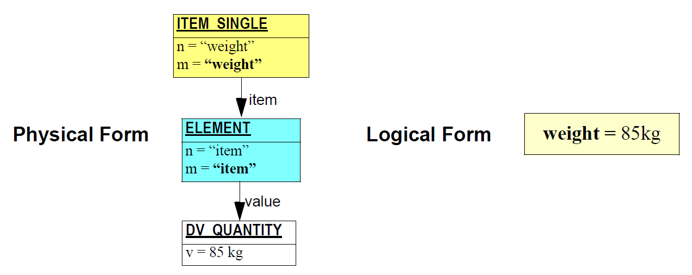

#### 4.4.2. ITEM_LIST实例结构

下图说明了典型的ITEM_LIST结构，在这种情况下用于BP协议。

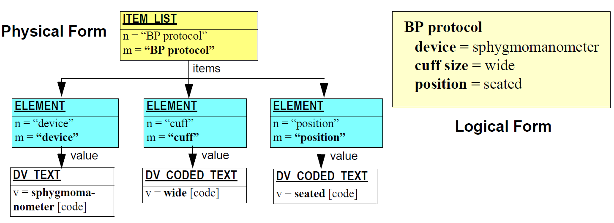

#### 4.4.3. ITEM_TABLE实例结构

下图说明了一个视力测试结果表。

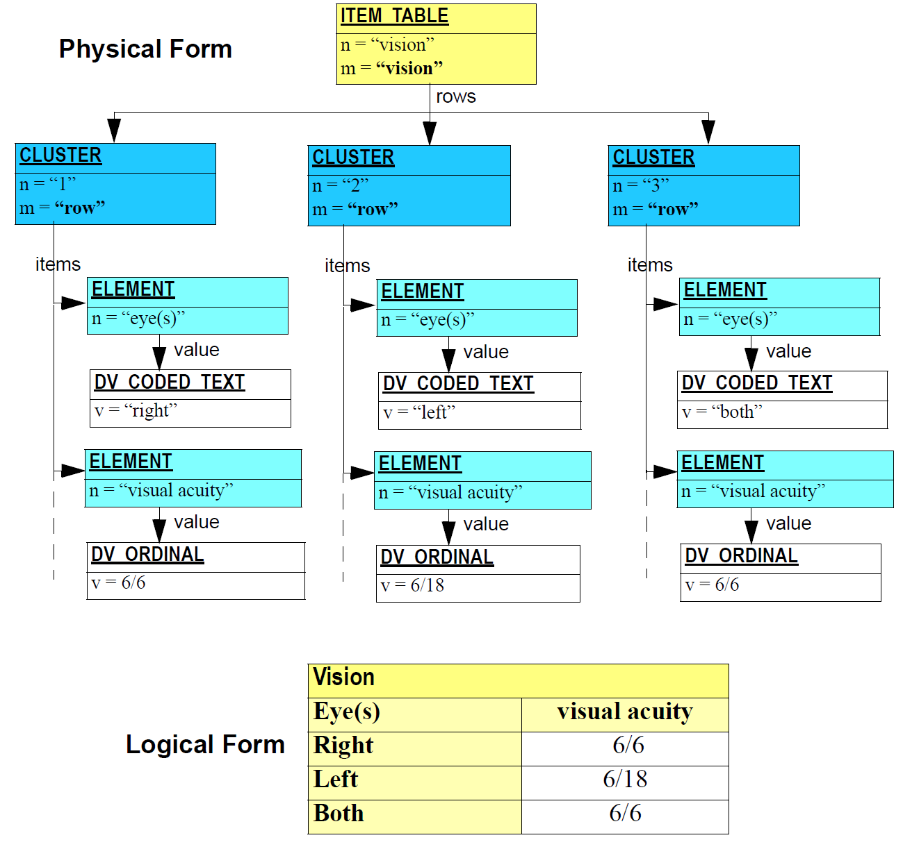

#### 4.4.4. ITEM_TREE实例结构

下图说明了示例ITEM_TREE实例的逻辑和物理形式，表示生物化学结果。

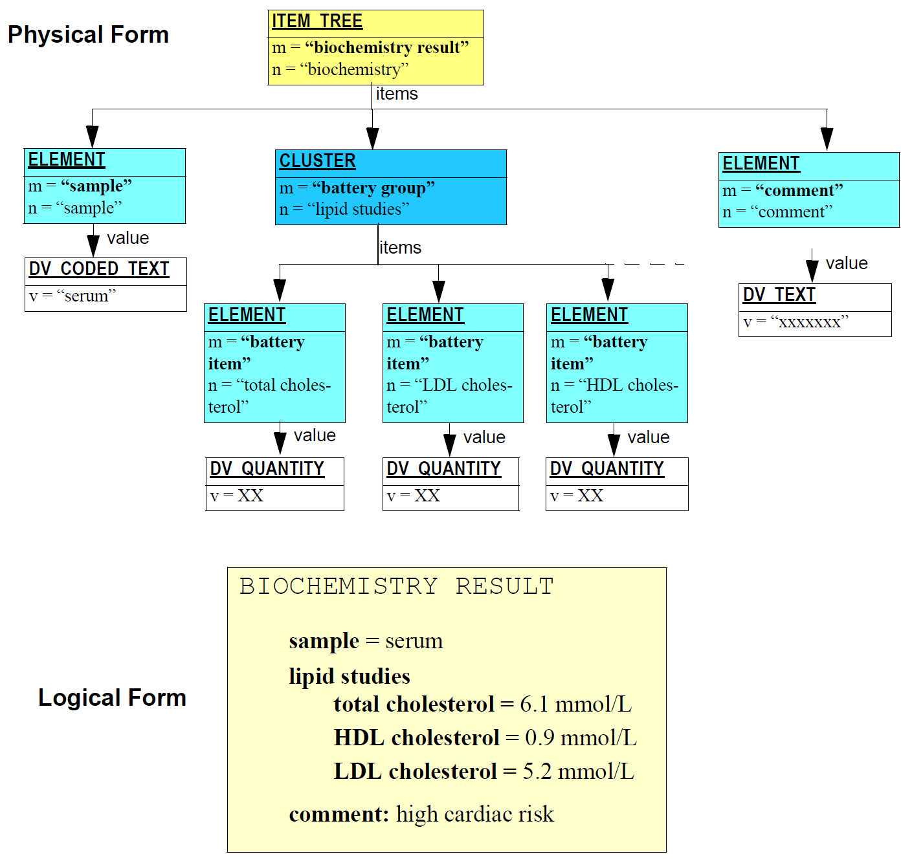

## 5.表示包

### 5.1.概述

此包包含用于任何数据结构的简单分层表示的类，如图rm.data_structures Package的右下方所示。这些类与CEN EN13606相同名称的类兼容，实例可以无损地生成到EN13606实例结构。

### 5.2.类描述

#### 5.2.1. ITEM类

<table>
	<tr>
		<td>类</td>
		<td colspan="2">ITEM（抽象）</td>
	</tr>
	<tr>
		<td>描述</td>
		<td colspan="2">CLUSTER和ELEMENT表示类的抽象父类。</td>
	</tr>
	<tr>
		<td>继承</td>
		<td colspan="2">LOCATABLE</td>
	</tr>
</table>

#### 5.2.2. CLUSTER类

<table>
	<tr>
		<td>类</td>
		<td colspan="2">CLUSTER</td>
	</tr>
	<tr>
		<td>描述</td>
		<td colspan="2">ITEM的分组变体，其可以包含ITEM的进一步实例，在有序列表中。</td>
	</tr>
	<tr>
		<td>继承</td>
		<td colspan="2">ITEM</td>
	</tr>
	<tr>
		<td>属性</td>
		<td>签名</td>
		<td>含义</td>
	</tr>
	<tr>
		<td>1..1</td>
		<td>items：列表<ITEM></td>
		<td>此「CLUSTER」项目的有序列表 - CLUSTER或ELEMENT对象。</td>
	</tr>
</table>

#### 5.2.3. ELEMENT类

<table>
	<tr>
		<td>类</td>
		<td colspan="2">ELEMENT</td>
	</tr>
	<tr>
		<td>描述</td>
		<td colspan="2">ITEM的叶变量，附加了DATA_VALUE实例。</td>
	</tr>
	<tr>
		<td>继承</td>
		<td colspan="2">ITEM</td>
	</tr>
	<tr>
		<td>属性</td>
		<td>签名</td>
		<td>含义</td>
	</tr>
	<tr>
		<td>0..1</td>
		<td>null_flavour：DV_CODED_TEXT</td>
		<td>空值的风味，例如。不确定，未询问等</td>
	</tr>
	<tr>
		<td>0..1</td>
		<td>值：DATA_VALUE</td>
		<td>表示ELEMENT的叶值对象的属性。在实际数据中，可以使用DATA_VALUE的任何具体子类型。</td>
	</tr>
	<tr>
		<td>函数</td>
		<td>签名</td>
		<td>含义</td>
	</tr>
	<tr>
		<td></td>
		<td>is_null：Boolean</td>
		<td>如果值逻辑上不知道，则为True。如果不确定，不询问等</td>
	</tr>
	<tr>
		<td>不变</td>
		<td colspan="2">Is_null_valid：is_null =（value = Void）</td>
	</tr>
	<tr>
		<td></td>
		<td colspan="2">Null_flavour_indicated：is_null xor null_flavour = Void</td>
	</tr>
	<tr>
		<td></td>
		<td colspan="2">Null_flavour_valid：is_null含义术语（Terminology_id_openehr）.has_code_for_group_id（Group_id_null_flavour，null_flavour.defining_code）</td>
	</tr>
</table>

## 6.历史包

### 6.1.概述

历史包定义了将过去的线性时间的概念形式化的类，通过它可以记录任何结构复杂性的历史数据。它支持周期性和非周期性系列中的瞬时和间隔事件样本。在间隔事件中记录的数据用数学函数标记，包括由openEHR event_math_function词汇定义的“时间点”，“平均值”，“delta”等。它还支持包括“摘要”数据，即，以某种方式总结整个历史的文本或图像项目。

不管实际数据是由单个样本还是由多个样本组成，它们以相同的方式表示：作为事件历史，即作为时间序列，允许所有软件以统一的方式访问数据，无论它是单个重量测量，长系列三维或四维图像，或者甚至一系列封装的多媒体项目。

该模型定义约束通用（也称为'模板'或'参数化'）类型HISTORY <T>，EVENT <T>，POINT_EVENT <T>和INTERVAL_EVENT <T>，其中类型参数约束为ITEM_STRUCTURE类型，并定义记录在HISTORY实例中的数据的类型。效果是，空间复杂数据的重复实例可以在时间上重现，对应于数据被实际测量的方式。 POINT_EVENT实例的非周期性系列通常用于表示在时间上重复的手动测量。 INTERVAL_EVENT实例的周期性历史通常用于表示生命体征监测输出（其通常以具有额外最小和最大值的平均形式递送）。

与openEHR参考模型的所有其他部分一样，历史包是为原型设计的;原型定义HISTORY实例的域语义。历史包显示在图rm.data_structures包的左侧。

#### 6.1.1.基本语义

历史模型的意图是表示基于时间的数据，其中该系列中的每个样本是相同现象（例如患者心率）的测量，并且使用相同的测量方法（例如脉搏血氧计）获得。以这种方式获取的样品可以被可靠地处理为表示随时间的现象的变化，并且因此可以安全地用于基于时间的计算，例如绘图，统计分析等。历史记录可以包含POINT_EVENT和INTERVAL_EVENT实例的任何混合。显然，模型不可能保证完全正确的使用，但有两个主要的保障措施。

首先，使用通用类型强制每个事件中的数据类型相同。因此，历史类型HISTORY <ITEM_LIST>因此将每个事件（EVENT.item）的数据类型限制为ITEM_LIST类型，没有别的。

其次，使用原型（通常在openEHR观察原型内）确保ITEM_STRUCTURE子类型的实际结构以相同的方式为每个样本定义。表示收缩压和舒张压的两项列表。

#### 6.1.2.定时

HISTORY类的实例包含原点：DV_DATE_TIME属性，指示什么被认为是时间序列的“0点”，以及一系列EVENT子类型的实例，每个实例包含一个时间：DV_DATE_TIME属性，表示绝对时间事件。任何事件的相对偏移量由EVENT.offset函数计算为EVENT.time和HISTORY.origin之间的差值。对于间隔事件（即INTERVAL_EVENT的实例），时间属性总是指事件的结束时间，因为这是数据（例如平均值）为真的时间。

历史的起始时间不一定是第一个样本的时间 - 它可能是事件的时间，例如记录样本的子女出生的时间，例如。 Apgar评分（Apgar是0-10评分，表示基于呼吸，心率，颜色，肌肉和反射的新生儿的健康）在1分钟和3分钟偏移。周期性和非周期性通过is_periodic和period属性表示。对于周期性时间序列，周期设置为周期持续时间值，is_periodic返回True。历史的总持续时间由HISTORY.duration函数给出。下图说明了历史周期性和事件类型的多个变体。

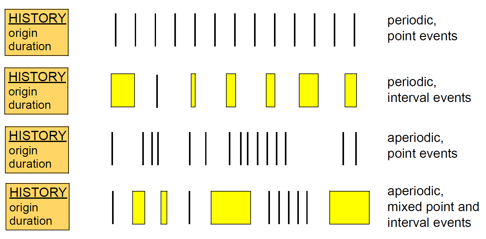

#### 6.1.3. 点事件

历史中最简单的事件是“点”事件，由类POINT_EVENT的实例表示，表示瞬时值。 HISTORY实例可以仅由点事件组成，如随着患者改变位置随着时间测量的多个血压值的情况。 Apgar结果是非周期点数据的典型示例，通常由2或3个事件组成，每个事件包含5个值和代表该时间点的Apgar分数的第6个值。 点数据也可以从监视设备获得。 对于细粒度（例如1秒）数据，样本的数量对于健康记录可能太大，并且可能需要以概要间隔事件（见下文）的形式的更有效的记录。 下图说明了包含POINT_EVENTs的HISTORY的结构。

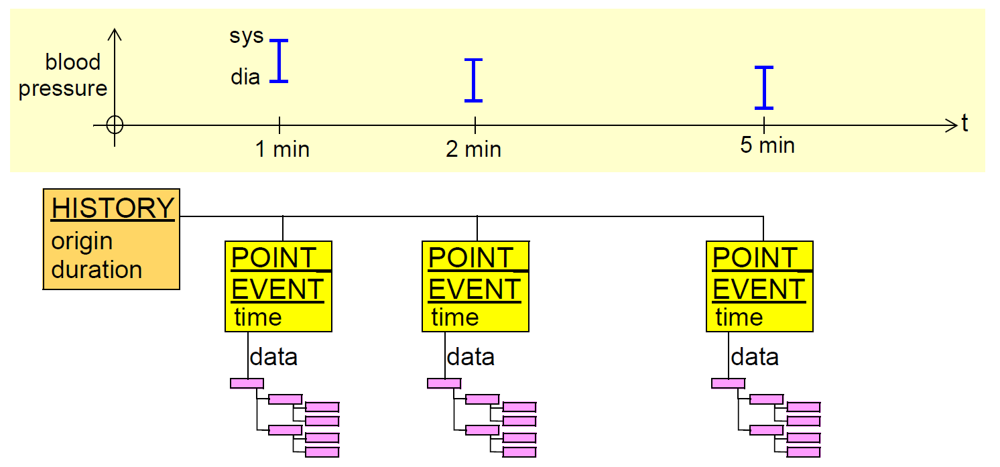

#### 6.1.4.间隔事件

INTERVAL_EVENT类的实例用于表示与时间间隔相对应的值。 INTERVAL_EVENT.width属性定义间隔的持续时间;并且继承的时间值对应于事件的后沿。

该模型中间隔事件的含义是，这些值有效地总结在事件间隔期间发生的数据的实际瞬时值。任何特定间隔事件的数据的数学含义由math_function属性给出。这由openEHR术语组“事件数学函数”编码，并且采用诸如“最小”，“最大”，“平均值”，“delta”等值。在历史中的每个间隔事件中使用的特定数学函数可以在整个历史中变化;例如，一个4小时Interval事件可能包含表示平均值的数据，而以下事件可能包含表示最大值的数据。这样的数据可以方便地用于生成随时间变化的底层数据的复杂图形。下图说明了包含2对4小时血压间隔事件的历史，每对包含+ 4h和+ 8h时间点（每个时间点包括收缩和舒张值）的最大和平均血压值结构。

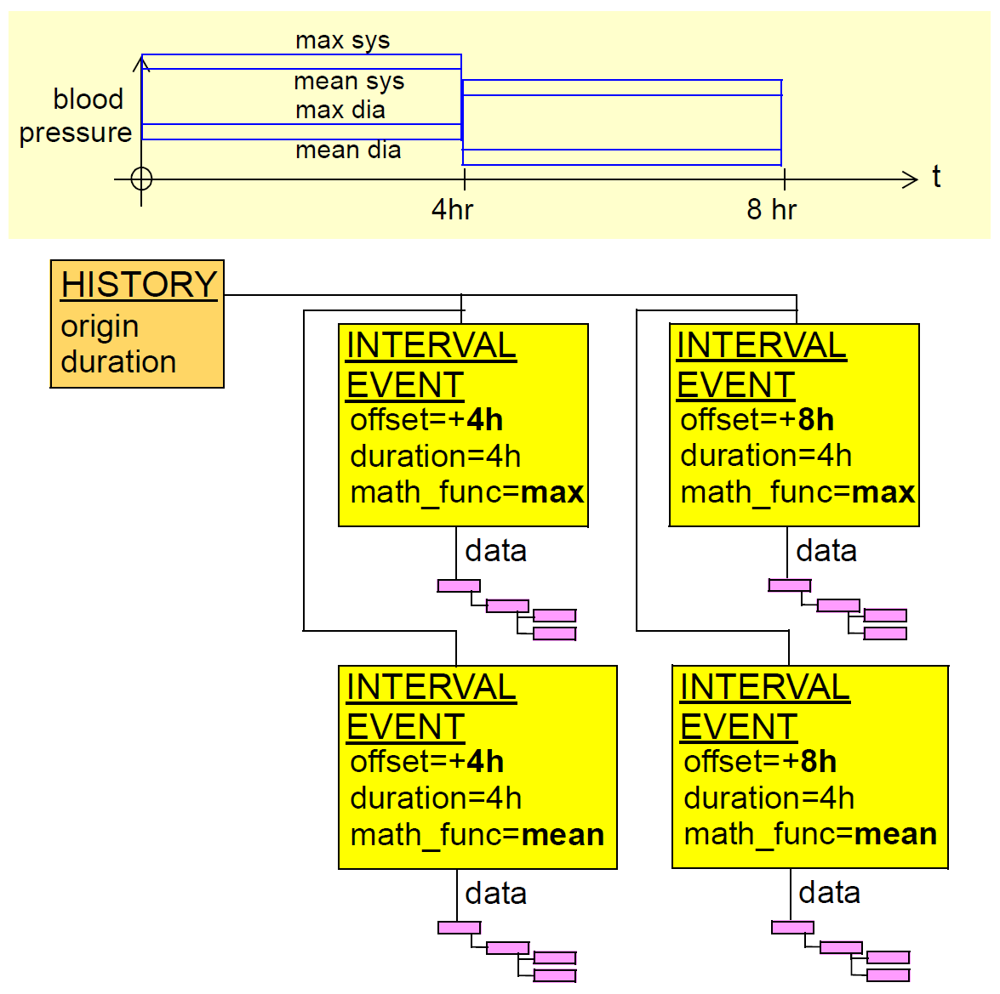

间隔事件可以与同一历史记录中的其他间隔或点事件重叠。 发生这种情况的常见情况是测量生命体征的不同时期，例如4小时血压事件，其与包含6×4小时时期的值的24小时事件重叠。 通常，长间隔事件可以重叠点或间隔事件的任何组合，如下图所示。

#### 6.1.5.更改数据

值得一提的间隔数据的一个子类别是更改数据。有三个事件数学函数项用于指示数据值的变化，如下所示：

- “change”：这意味着记录的值是现在的值和之前一段时间的值之间的差。它可以是正的或负的;

- “增加”：记录的变化值为正。为原型中的项目选择的名称（即ELEMENT.name）携带阳性的语义，例如。 “增加...;上升... ...;增加”等;

- “减少”：记录的变化值为正。但是为该项目选择的名称带有否定性的语义，例如。 “减少...;下降... ... ...”。

以下示例显示如何协调数据和这些数学函数。

- 上周重量为76 kg。等待这一周= 74公斤。可能的实例：

<table>
	<tr>
		<td>原型中的项目名</td>
		<td>存储值</td>
		<td>类型</td>
		<td>数学函数</td>
	</tr>
	<tr>
		<td>“重量变化”</td>
		<td>+ 2kg</td>
		<td>DV_QUANTITY</td>
		<td>“更改”</td>
	</tr>
	<tr>
		<td>“重量减少”</td>
		<td>（+）2kg</td>
		<td>DV_QUANTITY</td>
		<td>“减少”</td>
	</tr>
	<tr>
		<td>“重量减少”</td>
		<td>真正</td>
		<td>布尔值</td>
		<td>“减少”</td>
	</tr>
</table>

- 上周重量为80 kg。本周重量= 83公斤。可能的实例：

<table>
	<tr>
		<td>项目名原型</td>
		<td>存储值</td>
		<td>类型</td>
		<td>数学函数</td>
	</tr>
	<tr>
		<td>“重量变化”</td>
		<td>（+）3kg</td>
		<td>DV_QUANTITY</td>
		<td>“更改”</td>
	</tr>
	<tr>
		<td>“增重”</td>
		<td>（+）3kg</td>
		<td>DV_QUANTITY</td>
		<td>“增加”</td>
	</tr>
	<tr>
		<td>“体重增加”</td>
		<td>真正</td>
		<td>布尔值</td>
		<td>“增加”</td>
	</tr>
</table>

使用这些数学函数指示符允许以可计算的形式正确地表示变化值，而不管它们如何被捕获。

#### 6.1.6.摘要事件数据

尤其在实验室测试中的相对常见的情况是存在伴随更详细的历史数据的“总结”事件。出现这种情况的示例包括：

- 一系列放射科医生报告所有这些报告（报告可能包括一个或多个关键图像）;

- 动态刺激试验的图形总结如葡萄糖耐量试验;

- 一些关于一系列观察值上的值的模式的评论。

这样的数据通过可选的HISTORY.summary属性容纳在模型中，HISTORY.summary属性本身是一个结构，可以独立于主数据的结构进行构造。在上面的第一个例子中，摘要数据可能包含一个包含文本报告的ITEM_SINGLE对象;在第二个，包含DV_MULTIMEDIA实例内的图像的ITEM_SINGLE对象。

#### 6.1.7.细粒度设备数据的有效表示

间隔事件的一个有用的实际结果是它允许用单个间隔事件表示长周期的相对稳定的数据，而有趣的扰动将用许多细粒度的间隔或点事件表示。在下图的示例中，使用事件实例表示4小时的数据，包括来自血压监视器的14,400 x 1秒采样。可选的INTERVAL_EVENT.sample_count属性可用于记录事件中汇总的原始样本数。在图中，math_function显示为mean;显然在第一个长期，监测的基准不是绝对平坦。这意味着记录软件被配置成将小带（例如5mm Hg）中的变化视为不重要的，并且仅当基本值移动到带外时创建新的Event对象。另一种方法是为每个长周期创建两个间隔事件对象，一个给出最小值，另一个最大值，仍然基于在基础数据保持在指定限制内​​的时段生成一个这样的对的原理。无论细节如何，这种一般方法提供了一种方法，可以在非常少的空间中包括来自诸如生命体征监视器的设备的细粒度数据的小时数;数据只需要转换成等效的openEHR历史表格。

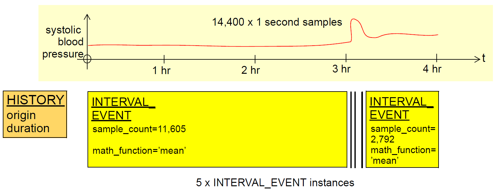

#### 6.1.8.状态

记录用于科学和临床使用的历史数据的模型特有的特征是记录“状态”的能力。在openEHR中，'state'被理解为与主数据的正确解释有关的信息。一个简单的例子是主数据是心率;有用的状态数据将是受试者的运动水平（休息，在3分钟循环之后等）。在临床记录情况下，状态数据对于主要数据的安全使用通常是至关重要的，因为根据患者状态，后者可能是正常的或异常的。在openEHR中有两种记录状态的方法。一个是通过在OBSERVATION类中使用一个单独的HISTORY结构（见ehr.composition.content.entry包）。另一种是通过使用在类EVENT本身中定义的类型ITEM_STRUCTURE的状态属性。 openEHR原型和系统的经验表明，后一种方法对应于最常见的临床需要，即能够记录事件时的状态（另一种方法允许记录独立的状态事件）。一个简单的例子是在葡萄糖耐量试验期间记录3个葡萄糖水平。每个事件的状态信息分别是（在典型测试中）：

- 0分钟样品：“后8小时快”;

- 1小时样品：“75g口服葡萄糖刺激”;

- 2小时样品：“75g口服葡萄糖攻击”。

此示例的历史结构如下图所示。

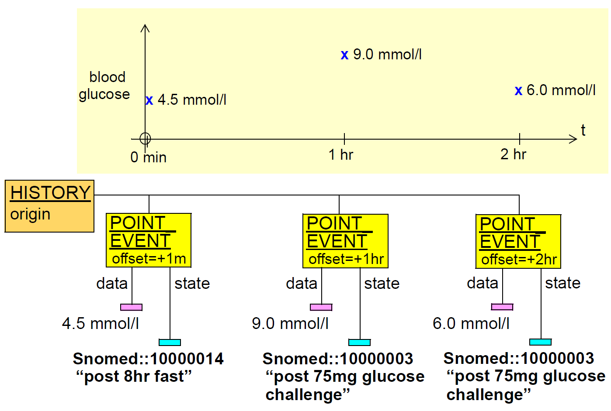

### 6.2.类描述

#### 6.2.1.历史类

<table>
	<tr>
		<td>类</td>
		<td colspan="2">HISTORY</td>
	</tr>
	<tr>
		<td>描述</td>
		<td colspan="2">根对象的线性历史，即时间序列结构。对于周期性的事件序列，将设置周期，并且历史中每个事件的时间必须对应;即EVENT.offset必须是每个事件的周期的倍数。但是，允许历史记录中缺少事件。</td>
	</tr>
	<tr>
		<td>继承</td>
		<td colspan="2">DATA_STRUCTOR</td>
	</tr>
	<tr>
		<td>属性</td>
		<td>签名</td>
		<td>含义</td>
	</tr>
	<tr>
		<td>1..1</td>
		<td>起源：DV_DATE_TIME</td>
		<td>此事件历史的时间原点。第一个事件不一定在原点。</td>
	</tr>
	<tr>
		<td>0..1</td>
		<td>时间：DV_DURATION</td>
		<td>如果是周期性的，在该段中的采样之间的周</td>
	</tr>
	<tr>
		<td>0..1</td>
		<td>持续时间：DV_DURATION</td>
		<td>整个历史的持续时间;或者对应于所有事件的持续时间，和/或如果存在则由摘要表示的持续时间。</td>
	</tr>
	<tr>
		<td>0..1</td>
		<td>摘要：ITEM_STRUCTURE</td>
		<td>聚合，组织，缩减和转换事件系列的可选摘要数据。这可以是呈现图形表示的文本或图像，或者有助于数据解释的一些数据。</td>
	</tr>
	<tr>
		<td>0..1</td>
		<td>事件：列出<EVENT></td>
		<td>系列中的事件。</td>
	</tr>
	<tr>
		<td>函数</td>
		<td>签名</td>
		<td>含义</td>
	</tr>
	<tr>
		<td></td>
		<td>is_periodic：Boolean</td>
		<td>指示历史记录是否是定期的。</td>
	</tr>
	<tr>
		<td>不变</td>
		<td colspan="2">Events_valid：（events / = Void，然后不是events.is_empty）或summary / = Void</td>
	</tr>
	<tr>
		<td></td>
		<td colspan="2">Events_valid：（events / = Void，然后不是events.is_empty）或summary / = Void</td>
	</tr>
	<tr>
		<td></td>
		<td colspan="2">Periodic_validity：is_periodic xor period = Void</td>
	</tr>
	<tr>
		<td></td>
		<td colspan="2">Period_consistency：is_periodic意味着events.for_all（e：EVENT | e.offset。to_seconds.mod（period.to_seconds）= 0）</td>
	</tr>
</table>

#### 6.2.2. EVENT类

<table>
	<tr>
		<td>类</td>
		<td colspan="2">EVENT（抽象）</td>
	</tr>
	<tr>
		<td>描述</td>
		<td colspan="2">定义系列中单个事件的抽象概念。此类是通用的，允许生成锁定到特定空间类型的类型，例如EVENT <ITEM_LIST>。子类型表示点或整数数据。</td>
	</tr>
	<tr>
		<td>继承</td>
		<td colspan="2">LOCATABLE</td>
	</tr>
	<tr>
		<td>属性</td>
		<td>签名</td>
		<td>含义</td>
	</tr>
	<tr>
		<td>1..1</td>
		<td>时间：DV_DATE_TIME</td>
		<td>此活动的时间。如果宽度不为零，则它是事件的后沿的时间点。</td>
	</tr>
	<tr>
		<td>0..1</td>
		<td>状态：ITEM_STRUCTURE</td>
		<td>此事件的可选状态数据。</td>
	</tr>
	<tr>
		<td>1..1</td>
		<td>数据：ITEM_STRUCTURE</td>
		<td>此事件的数据。</td>
	</tr>
	<tr>
		<td>函数</td>
		<td>签名</td>
		<td>含义</td>
	</tr>
	<tr>
		<td></td>
		<td>偏移：DV_DURATION</td>
		<td>Post_condition：Result = time.diff（parent.origin）</td>
	</tr>
	<tr>
		<td></td>
		<td></td>
		<td>此事件从起点偏移，计算为time.diff（parent.origin）。</td>
	</tr>
	<tr>
		<td>不变</td>
		<td colspan="2">Offset_validity1：offset / = Void，然后offset = time.diff（parent.origin）</td>
	</tr>
</table>

#### 6.2.3. POINT_EVENT类

<table>
	<tr>
		<td>类</td>
		<td colspan="2">POINT_EVENT</td>
	</tr>
	<tr>
		<td>描述</td>
		<td colspan="2">定义系列中的单点事件。</td>
	</tr>
	<tr>
		<td>继承</td>
		<td colspan="2">EVENT</td>
	</tr>
</table>

6.2.4. INTERVAL_EVENT类

<table>
	<tr>
		<td>类</td>
		<td colspan="2">INTERVAL_EVENT</td>
	</tr>
	<tr>
		<td>描述</td>
		<td colspan="2">定义系列中的单个间隔事件。</td>
	</tr>
	<tr>
		<td>继承</td>
		<td colspan="2">EVENT</td>
	</tr>
	<tr>
		<td>属性</td>
		<td>签名</td>
		<td>含义</td>
	</tr>
	<tr>
		<td>1..1</td>
		<td>宽度：DV_DURATION</td>
		<td>状态为真的时间间隔的长度。如果是瞬时事件则为空。</td>
	</tr>
	<tr>
		<td>0..1</td>
		<td>sample_count：整数</td>
		<td>此事件对应的原始样本的可选计数。</td>
	</tr>
	<tr>
		<td>1..1</td>
		<td>math_function：DV_CODED_TEXT</td>
		<td>此事件的数据的数学函数，例如最大值，平均值等。使用openEHR术语组事件数学函数编码。</td>
	</tr>
	<tr>
		<td>函数</td>
		<td>签名</td>
		<td>含义</td>
	</tr>
	<tr>
		<td></td>
		<td>interval_start_time：DV_DATE_TIME</td>
		<td>此事件的间隔的开始时间。</td>
	</tr>
	<tr>
		<td>不变</td>
		<td colspan="2">Math_function_validity：术语（Terminology_id_openehr）.has_code_for_group_id（Group_id_event_math_function，math_function.defining_code）</td>
	</tr>
	<tr>
		<td></td>
		<td colspan="2">Interval_start_time_valid：interval_start_time = time-width</td>
	</tr>
</table>

### 6.3. 历史实例结构

#### 6.3.1. 单样本

下图显示了单个重量测量。 Event对象包含定时信息，在这种情况下，它只是测量时间（原点）。

#### 6.3.2. 5分钟血压平均值

下图说明了代表5分钟血压平均值的两个间隔事件，第一个5分钟偏离初始事件，持续5分钟，第二个5分钟后。

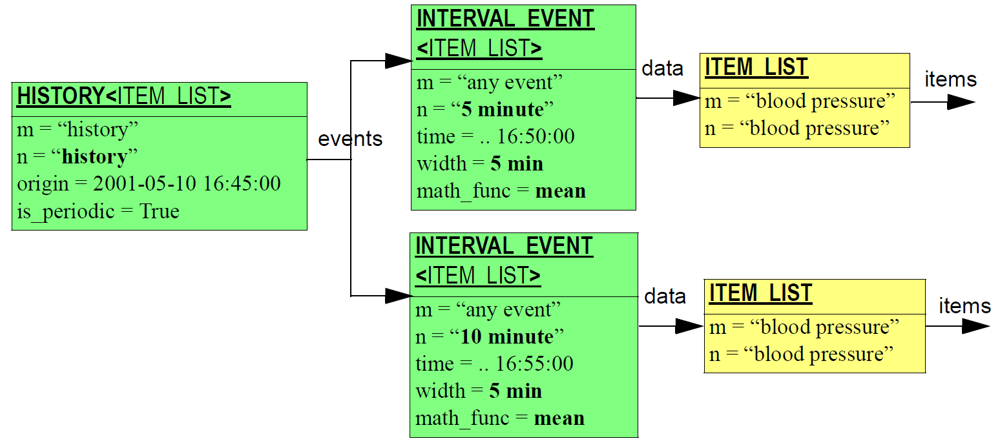

## 参考文献

### 出版物

<ol><li>
    [Anderson_1996]罗斯·安德森。临床信息系统的安全性。可在http://www.cl.cam.ac.uk/users/rja14/policy11/policy11.html获取。
</li><li>
    [Baretto_2005] Barretto S A.设计基于指南的工作流程 - 综合电子健康记录。南澳大学博士论文。可在http://www.cis.unisa.edu.au/~cissab/Barretto_PhD_Thesis_Revised_FINAL.pdf。
</li><li>
    [Beale_2000] Beale T. Archetypes：Constraint-based Domain Models for Future-proof Information Systems。 2000.可查阅http://www.openehr.org/files/resources/publications/archetypes/archetypes_beale_web_2000.pdf。
</li><li>
    [Beale_2002] Beale T.Archetypes：Constraint-based Domain Models for Future-proof Information Systems。第十一届OOPSLA行为语义研讨会：为客户服务（西雅图，美国华盛顿，2002年11月4日）。由Kenneth Baclawski和Haim Kilov编辑。 Northeastern University，Boston，2002，pp。16-32.请访问http://www.openehr.org/files/resources/publications/archetypes/archetypes_beale_oopsla_2002.pdf。
</li><li>
    [Beale_Heard_2007] Beale T，Heard S. An Ontology-based Model of Clinical Information。 2007.pp760-764 Proceedings MedInfo 2007，K.Kuhn et al。 （Eds），IOS Publishing 2007.见http://www.openehr.org/publications/health_ict/MedInfo2007-BealeHeard.pdf。
</li><li>
    [Booch_1994] Booch G.面向对象的分析和设计与应用。第2版​​。本杰明/ Cummings 1994.
</li><li>
    [Browne_2005] Browne E D.工作流建模协调的健康护理提供者护理计划。南澳大学博士论文。请访问http://www.openehr.org/publications/workflow/t_browne_thesis_abstract.htm。
</li><li>
    [Cimino_1997] Cimino J J. Desiderata for Controlled Medical vocabularies in the Twenty-F​​irst Century。 IMIA WG6 Conference，Jacksonville，Florida，Jan 19-22,1997.
</li><li>
    [埃菲尔]迈耶B.埃菲尔的语言（第二版）。 Prentice Hall，1992.
</li><li>
    [Elstein_1987] Elstein AS，Shulman LS，Sprafka SA。医学问题解决：临床推理的分析。剑桥，MA：哈佛大学出版社1987.
</li><li>
    [Elstein_Schwarz_2002] Elstein AS，Schwarz A.临床诊断的证据基础：临床问题解决和诊断决策：对认知文献的选择性审查。 BMJ 2002; 324; 729-732.
</li><li>
    [Fowler_1997] Fowler M.分析模式：可重用对象模型。 Addison Wesley 1997
</li><li>
    [Fowler_Scott_2000] Fowler M，Scott K.UML Distilled（第2版）。 Addison Wesley Longman 2000.
</li><li>
    [Gray_reuter_1993] Gray J，Reuter A. Transaction Processing Concepts and Techniques。 Morgan Kaufmann 1993.
</li><li>
    [Hein_2002] Hein J L.Discrete Structures，Logic and Computability（2nd Ed）。琼斯和巴特利特2002.
</li><li>
    [Hnìtynka_2004]HnìtynkaP，PlášilF. MOF的分布式版本控制模型。 Proceedings of WISICT 2004，Cancun，Mexico，A volume in the ACM international conference proceedings series，published by Computer Science Press，Trinity College Dublin Ireland，2004.
</li><li>
    [Ingram_1995] Ingram D.欧洲良好健康记录项目。 Laires，Laderia Christensen，Eds。健康在新的通信时代。阿姆斯特丹：IOS出版社; 1995; pp。66-74.
</li><li>
    [Kifer_Lausen_Wu_1995] Kifer M，Lausen G，Wu J. Logical Foundations of Object-Oriented and FrameBased Languages。 JACM 1995年5月。见见ftp://ftp.cs.sunysb.edu/pub/TechReports/kifer/flogic.pdf。
</li><li>
    [Kilov_1994] Kilov H，Ross J.信息建模 - 一种面向对象的方法。 Prentice Hall 1994.
</li><li>
    [Maier_2000] Maier M.系统建模原则。技术报告，阿拉巴马大学在亨茨维尔。 2000.可在http://www.infoed.com/Open/PAPERS/systems.htm获得
</li><li>
	[Martin] Martin P. UML，OWL，KIF和WebKB-2语言之间的翻译（For-Taxonomy，Frame-CG，Formalized English）。 May / June 2003. Available at http://www.webkb.org/doc/model/comparisons.html as at Aug 2004.
</li><li>
    [Meyer_OOSC2] Meyer B. Object-oriented Software Construction，2nd Ed。 Prentice Hall 1997
</li><li>
    [Müller_2003]MüllerR. Event-oriented Dnamic Adaptation of Workflows：Model，Architecture，and Implementation。莱比锡大学博士论文。请访问http://www.openehr.org/publications/workflow/t_mueller_thesis_abstract.htm。
</li><li>
    [Object_Z] Smith G.对象Z规范语言。 Kluwer Academic Publishers 2000.见http://www.itee.uq.edu.au/~smith/objectz.html。
</li><li>
    [Rector_1994] Rector A L，Nowlan W A，Kay S. Foundations for an Electronic Medical Record。 The IMIA Yearbook of Medical Informatics 1992（Eds.van Bemmel J，McRay A）。 Stuttgart Schattauer 1994.
</li><li>
    [Rector] Rector A L.临床术语：为什么这么难？方法。 1999 Dec; 38（4-5）：239-52.可在http://www.cs.man.ac.uk/~rector/papers/Why-is-terminology-hard-single-r2.pdf。
</li><li>
    [Richards_1998] Richards E G. Mapping Time - The Calendar and its History。牛津大学出版社1998.
</li><li>
    [Sowa_2000] Sowa J F.知识表示：逻辑，哲学和计算基础。 2000，Brooks / Cole，California。
</li><li>
    [Sottile_1999] Sottile P.A.，Ferrara F.M.，Grimson W.，Kalra D.，and Scherrer J.R.The holistic healthcare information system。欧洲电子健康记录。 1999年11月; 259-266.
</li><li>
    [Van_de_Velde_Degoulet_2003] Van de Velde R，Degoulet P. Clinical Information Systems：A Component-Based Approach。 2003. Springer-Verlag New York。
</li><li>
    [Weed_1969] Weed LL。医疗记录，医疗教育和病人护理。 6 ed。芝加哥：年鉴医疗出版商公司1969年。
</li></ol>

### 资源

#### 本体

<ol><li>
    [bfo]正式本体和医学信息科学研究所（IFOMIS）。基本正式本体论（BFO）。 http://ifomis.uni-saarland.de/bfo/。
</li><li>
    [FMA] http://sig.biostr.washington.edu/projects/fm/。
</li><li>
    [Horrocks_owl] Patel-Schneider P，Horrocks I，Hayes P. OWL Web本体语言语义和抽象语法。请参阅http://w3c.org/TR/owl-semantics/。
</li><li>
    信息工件本体。 https://code.google.com/p/information-artifact-ontology/。
</li><li>
    [OBO] The Open Biological and Biomedical Ontologies。见http://www.obofoundry.org/。
</li><li>
    [OGMS]一般医学科学本体（OGMS）。 https://code.google.com/p/ogms/。
</li></ol>

### 一般

1.    [cov_contra]维基百科。协方差和逆变。请参阅https://en.wikipedia.org/wiki/Covariance_and_contravariance_(computer_science）。

### 电子卫生标准

<ol><li>
    [ENV_13606-1] ENV 13606-1 - 电子医疗记录通信 - 第1部分：扩展架构。 CEN / TC 251健康信息技术委员会。
</li><li>
    [ENV_13606-2] ENV 13606-2 - 电子医疗记录通信 - 第2部分：域名术语列表。 CEN / TC 251健康信息技术委员会。
</li><li>
    [ENV_13606-3] ENV 13606-3 - 电子医疗记录通信 - 第3部分：分发规则。 CEN / TC 251健康信息技术委员会。
</li><li>
    [ENV_13606-4] ENV 13606-4 - 电子医疗记录通信标准第4部分：信息交换的信息。 CEN / TC 251健康信息技术委员会。
</li><li>
    [Corbamed_PIDS]对象管理组。人身份识别服务。 1999年3月。
</li><li>
    [Corbamed_LQS]对象管理组。词典查询服务。 1999年3月。
</li><li>
    [HL7v3_ballot2] JL7国际。 HL7版本3第二选票规格。可在http://www.hl7.org获得。
</li><li>
    [HL7v3_data_types] Schadow G，Biron P. HL7版本3可交付：版本3数据类型。 （2002年第二版投票）。
</li><li>
    [hl7_v3_rim] HL7. HL7 v3 RIM。见http://www.hl7.org。
</li><li>
    [ICD10AM]。世卫组织/ ACCD。国际疾病分类，第10次修订，澳大利亚修改。请参见https://www.accd.net.au/Icd10.aspx
</li><li>
    [IHTSDO]国际健康术语标准制定组织（IHTSDO）。 http://www.ihtsdo.org。
</li><li>
    [IHTSDO_URIs] IHTSDO。 SNOMED CT URI标准。 http://ihtsdo.org/fileadmin/user_upload/doc/download/doc_UriStandard_Current-en-US_INT_20140527.pdf?ok。
</li><li>
    [NLM_UML_list]国家医学图书馆。 UMLS术语表。 http://www.nlm.nih.gov/research/umls/metaa1.html。
</li><li>
    [SNOMED_CT] IHTSDO。系统化命名医学。请参见http://www.ohtsdo.org。
</li><li>
    [WHO_ICD]世界卫生组织（WHO）。国际疾病分类（ICD）。见：http：//www.who.int/classifications/icd/en/。
</li><li>
    [ISO_18308] Schloeffel P.（编辑）。电子健康记录参考架构的要求。 （ISO TC 215 / SC N; ISO / WD 18308）。国际标准组织，澳大利亚，2002年。
</li><li>
    [ISO_20514] ISO。综合护理EHR。见http://www.iso.org/iso/iso_catalogue/catalogue_tc/catalogue_detail.htm?csnumber=39525.
</li><li>
    [UCUM] Schadow G，McDonald C J.The Unified Code for Units of Measure，Version 1.4 2000.Regenstrief Institute for Health Care，Indianapolis。请参阅http://aurora.rg.iupui.edu/UCUM
</li></ol>

### 电子卫生项目

<ol><li>
    [CIMI]临床信息建模倡议（CIMI）项目。参见http://opencimi.org。
</li><li>
    [EHCR_supA_14] Dixon R，Grubb P A，Lloyd D，and Kalra D. Consolidated List of Requirements。 EHCR支持行动交付1.4.欧洲委员会DGXIII，布鲁塞尔; 2001年5月59pp可从http://www.chime.ucl.ac.uk/HealthI/EHCR-SupA/del1-4v1_3.PDF获得。
</li><li>
    [EHCR_supA_35] Dixon R，Grubb P，Lloyd D. EHCR支持行动交付3.5：“对CEN未来工作的最终建议”。 2000年10月。见http://www.chime.ucl.ac.uk/HealthI/EHCRSupA/documents.htm。
</li><li>
    [EHCR_supA_24] Dixon R，Grubb P，Lloyd D. EHCR支持行动2.4“CEN EHCRA解释和实施指南”。 2000年10月。见http://www.chime.ucl.ac.uk/HealthI/EHCR-SupA/documents.htm。
</li><li>
    [Lloyd D，et al。 EHCR支持行动交付3.1和3.2“CEN的中期报告”。 July 1998. Available at http://www.chime.ucl.ac.uk/HealthI/EHCR-SupA/documents.htm。
</li><li>
    [GEHR_del_4]可交付成果4：GEHR临床综合性要求。 GEHR项目1992
</li><li>
    [GEHR_del_7]可交付成果7：临床功能规范。 GEHR项目1993
</li><li>
    [GEHR_del_8]可交付成果8：GEHR架构和系统的伦理和法律要求。 1994年GEHR项目
</li><li>
    [GEHR_del_19_20_24]交付成果19,20,24：GEHR架构。 GEHR项目30/6/1995
</li><li>
    [GeHR_AUS] Heard S，Beale T.The Good Electronic Health Record（GeHR）（Australia）。请参阅http://www.openehr.org/resources/related_projects#gehraus。
</li><li>
    [GeHR_Aus_gpcg] Heard S. GEHR Project Australia，GPCG Trial。可在http://www.gehr.org/gpcg/ehra.htm。
</li><li>
    [GeHR_Aus_req] Beale T，Heard S.GEHR技术要求。请参阅http://www.gehr.org/technical/requirements/gehr_requirements.html。
</li><li>
    [Synapses_req_A] Kalra D.（Editor）。突触用户需求和功能规范（A部分）。欧盟远程信息处理应用程序，布鲁塞尔; 1996;突触项目：可交付用户1.1.1a。 6章，176页。
</li><li>
    [Synapses_req_B] Grimson W.和Groth T.（Editors）。突触用户需求和功能规范（B部分）。欧盟远程信息处理应用程序，布鲁塞尔; 1996;突触项目：可交付用户1.1.1b。
</li><li>
	[Synapses_odp] Kalra D.（编辑）。突触ODP信息观点。欧盟远程信息处理应用程序，布鲁塞尔; 1998;突触项目：最终交付。 10章，64页。
</li><li>
    [synex]伦敦大学学院。 SynEx项目。 http://www.chime.ucl.ac.uk/HealthI/SynEx/。
</li></ol>

### 一般标准

<ol><li>
    [OCL]对象约束语言2.0.对象管理组（OMG）。可在http://www.omg.org/cgi-bin/doc?ptc/2003-10-14.
</li><li>
    [IANA] IANA。 http://www.iana.org/。
</li><li>
    [IEEE_828] IEEE。 IEEE 828-2005：软件配置管理计划标准。
</li><li>
    [ISO_8601] ISO 8601标准描述了表示时间，日期和持续时间的格式。参见例如http://www.mcs.vuw.ac.nz/technical/software/SGML/doc/iso8601/ISO8601.html和http://www.cl.cam.ac.uk/~mgk25/iso-time.html 。
</li><li>
    [ISO_2788] ISO。 ISO 2788单语词典的建立和发展指南。
</li><li>
    [ISO_5964] ISO。 ISO 5964建立和开发多语言词典的指南。
</li><li>
    [Perl_regex] Perl.org。 Perl正则表达式。可在http://perldoc.perl.org/perlre.html。
</li><li>
    斯坦福大学。参见http://protege.stanford.edu/。
</li><li>
    [rfc_2396] Berners-Lee T.Universal Resource Identifiers in WWW。可在http://www.ietf.org/rfc/rfc2396.txt。这是一个用于全局资源识别的万维网RFC。在当前在网上使用时，由Mosaic，Netscape和类似工具。有关URI的起点，请参阅http://www.w3.org/Addressing。
</li><li>
    [rfc_2440] RFC 2440：OpenPGP消息格式。见http://www.ietf.org/rfc/rfc2440.txt和http://www.ietf.org/internet-drafts/draft-ietf-openpgp-rfc2440bis-18.txt
</li><li>
    [rfc_3986] RFC 3986：统一资源标识符（URI）：通用语法。 IETF。参见http://www.ietf.org/rfc/rfc3986.txt。
</li><li>
    [rfc_4122] RFC 4122：通用唯一标识符（UUID）URN命名空间。 IETF。参见http://www.ietf.org/rfc/rfc4122.txt。
</li><li>
    [rfc_2781] IETF。 RFC 2781：UTF-16，ISO 10646的编码见http://tools.ietf.org/html/rfc2781.
</li><li>
    [rfc_5646] IETF。 RFC 5646. Available at http://tools.ietf.org/html/rfc5646.
</li><li>
    [sem_ver]语义版本化。 http://semver.org。
</li><li>
    [Xpath] W3C Xpath 1.0规范。 1999.可在http://www.w3.org/TR/xpath。
</li><li>
    [uri_syntax]统一资源标识符（URI）：通用语法，因特网提议的标准。 2005年1月。见http://www.ietf.org/rfc/rfc3986.txt。
</li><li>
    [w3c_owl] W3C。 OWL - Web本体语言。请参阅http://www.w3.org/TR/2003/CR-owl-ref-20030818/。
</li><li>
    [w3c_xpath] W3C。 XML路径语言。请参阅http://w3c.org/TR/xpath。
</li></ol>

### 工具

1.  [Template_Designer]模板设计器。海洋信息学。 http://www.openehr.org/downloads/modellingtools

### openEHR 资源

<ol><li>
    [openehr_18308] The openEHR Foundation. Conformance of openEHR architecture to ISO TS 18308, "Requirements for EHR Architectures". See http://www.openehr.org/releases/trunk/architecture/iso18308_conformance.pdf.
</li><li>
    [openEHR_ADL_workbench] The openEHR Foundation. The openEHR ADL Workbench. http://www.openehr.org/downloads/ADLworkbench/home .
</li><li>
    [openehr_am_overview] The openEHR Foundation. The openEHR Archetypes Technical Overview. See http://www.openehr.org/releases/AM/latest/Overview.html.
</li><li>
    [openehr_am_adl14] The openEHR Foundation. Archetype Definition Language 1.4 (ADL1.4). Available at http://www.openehr.org/releases/AM/latest/ADL1.4.html.
</li><li>
    [openehr_am_aom14] The openEHR Foundation. Archetype Object Model 1.4 (AOM1.4). Available at http://www.openehr.org/releases/AM/latest/AOM1.4.html.
</li><li>
    [openehr_am_adl2] The openEHR Foundation. Archetype Definition Language 2 (ADL2). Available at http://www.openehr.org/releases/AM/latest/ADL2.html.
</li><li>
    [openehr_am_aom2] The openEHR Foundation. Archetype Object Model 2 (AOM2). Available at http://www.openehr.org/releases/AM/latest/AOM2.html.
</li><li>
    [openehr_am_identification] The openEHR Foundation. Archetype Identification specification. Available at http://www.openehr.org/releases/AM/latest/Identification.html.
</li><li>
    [openehr_am_def_pri] The openEHR Foundation. Archetype Definitions and Principles. (deprecated) Available at http://www.openehr.org/releases/1.0.2/architecture/am/archetype_principles.pdf.
</li><li>
    [openehr_am_sys] The openEHR Foundation. The Archetype System. (deprecated) Available at http://www.openehr.org/releases/1.0.2/architecture/am/archetype_system.pdf.
</li><li>
    [openehr_am_oap] The openEHR Foundation. The openEHR Archetype Profile. http://www.openehr.org/releases/1.0.2/architecture/am/openehr_archetype_profile.pdf .
</li><li>
    [openehr_CKM] The openEHR Clinical Knowledge Manager (CKM). See http://www.openEHR.org/ckm
</li><li>
    [openehr_odin] The openEHR Foundation. Object Data Instance Notation (ODIN). Available at http://www.openehr.org/releases/BASE/latest/odin.html.
</li><li>
    [openehr_overview] The openEHR Foundation. The openEHR Architecture Overview. See http://www.openehr.org/releases/BASE/latest/architecture_overview.html.
</li><li>
    [openehr_query_aql] The openEHR Foundation. The openEHR Archetype Query language (AQL). See http://www.openehr.org/releases/QUERY/latest/AQL.html.
</li><li>
    [openehr_rm_data_types] openEHR. Data Types Information Model. See http://www.openehr.org/releases/RM/Release-1.0.3/data_types.html.
</li><li>
    [openehr_rm_data_structures] openEHR. Data Structures Information Model. See http://www.openehr.org/releases/RM/Release-1.0.3/data_structures.html.
</li><li>
    [openehr_rm_common] openEHR. Common Information Model. See http://www.openehr.org/releases/RM/Release-1.0.3/common.html.
</li><li>
    [openehr_rm_ehr] The openEHR Foundation. The EHR Information Model. http://www.openehr.org/releases/RM/Release-1.0.3/ehr.html.
</li><li>
    [openehr_rm_ehr_extract] The openEHR Foundation. The EHR Extrct Information Model. http://www.openehr.org/releases/RM/Release-1.0.3/ehr_extract.html.
</li><li>
    [openehr_rm_integration] The openEHR Foundation. The Integration Information Model. http://www.openehr.org/releases/RM/Release-1.0.3/integration.html.
</li><li>
    [openehr_rm_support] openEHR. Support Information Model. See http://www.openehr.org/releases/RM/Release-1.0.3/support.html.
</li><li>
    [openehr_terminology] The openEHR Foundation. The openEHR Terminology http://www.openehr.org/releases/TERM/latest/SupportTerminology.html.
</li><li>
    [openehr_terminology_resources] The openEHR Foundation. The openEHR Terminology project (GitHub) https://github.com/openEHR/terminology.
</li></ol>

最后更新时间 2015-12-10 13:17:33 GMT
