# 数据类型信息模型

发行者：openEHR规范程序

发布：版本1.0.3

状态：STABLE

修订：[latest_issue]

日期：[latest_issue_date]

关键词：EHR，临床，数据类型，openehr

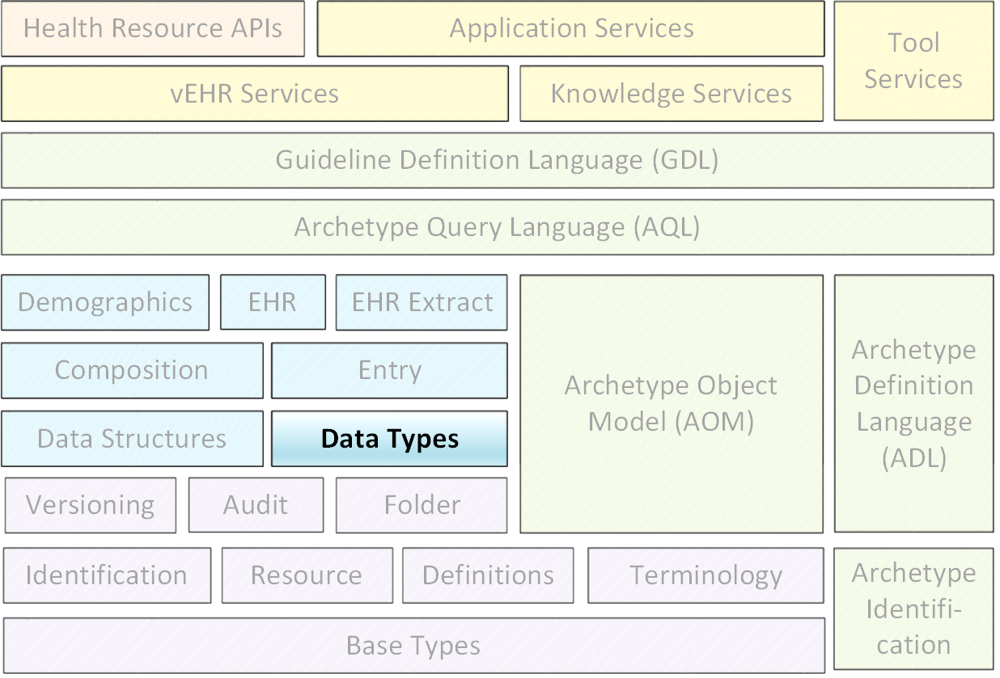

<table>
	<tr>
		<td colspan="2">
			©2003 - 2015 openEHR基金会
		</td>
	</tr>
	<tr>
		<td colspan="2">
openEHR基金会是一个独立的非营利社区组织，通过开源，基于标准的实施，促进消费者和临床医生共享健康记录。
		</td>
	</tr>
	<tr>
		<td>许可：</td>
		<td>Creative Commons Attribution-NoDerivs 3.0 Unported。 https://creativecommons.org/licenses/by-nd/3.0/</td>
	</tr>
	<tr>
		<td>支持</td>
		<td>问题：https：//openehr.atlassian.net/browse/SPECPR/
网址：http：//www.openehr.org/</td>
	</tr>
</table>

## 修订记录

- R E L E A S E 1.0.3
	- 2.1.2(2015年11月15日)
		- SPECRM-32将不变量添加到DV_PROPORTION，防止0分母。 （SPECPR-112）
		- SPECRM-33.澄清EHR URI方案的规范。稍微调整DV_EHR_URI文本。
		- SPECRM-23：使一些DV_IDENTIFIER功能可选。 （SPECPR-33）。
		- SPECRM-20：将错误的DV_DATE.magnitude原点更正为“0001-01-01”（SPECPR-64）。
- R E L E A S E 1.0.2
	- 2.1.1(2008年11月20日)
		- SPEC-257：更正小的拼写错误并澄清文本。在DV_EHR_URI的类定义的继承中，将DV_EHR_URI替换为DV_URI。说明DV_PROPORTION中的type属性的描述，以指示它是如何由PROPORTION_KIND控制的。在封装包的UML图中，向as_string（）函数添加一个DV_ENCAPSULATED类。
		- SPEC-261：指示如何处理DV_QUANTIFIED类型中的加/减操作的精度。指示未知精度的特殊值。

- R E L E A S E 1.0.1
	- 2.1.0(2007年4月12日)
		- SPEC-144：增加新类型：DV_PROPORTION。
		- SPEC-198：更改DV_Date / Time / Duration以具有值作为属性。
		- SPEC-199：将normal_range属性添加到DV_ORDERED。
		- SPEC-200.正确的1.0版排字错误。将DV_ENCAPSULATED.size更正为定义表中的抽象。将基本包的UML中的DV_STATE.value更正为DV_CODED_TEXT。在QUANTITY包的UML图中将DV_ORDINAL.symbol类型更正为DV_CODED_TEXT。
		- 向“订单”添加缺少的继承到“DV_ORDERED”。
		- SPEC-205：将日期/时间常数转换为类。
		- SPEC-211：将magnitude_status添加到DV_QUANTIFIED。
		- SPEC-215：合并DV_PARTIAL_XX日期/时间类，并将ISO 8601语义移动到支持IM。删除DV_WORLD_TIME类。
		- SPEC-216：允许在ISO8601中的W，D等的混合持续时间（偏离标准）。
		- SPEC-219：使用常量而不是文字来引用RM中的术语。
		- SPEC-221.将normal_status添加到DV_ORDERED。调整不变量。
		- SPEC-227：删除DV_QUANTITY_RATIO。
		- SPEC-230：将DV_DATE_TIME.to_quantity更改为秒
		- SPEC-236：在DV_MULTIMEDIA中将字符的使用更改为八位位组。
		- SPEC-237：数量和日期/时间类型的正确语义。
		- SPEC-240：允许DV_ORDINAL值为负。
		- SPEC-247：将DV_TEMPORAL类添加到数量包。
- R E L E A S E 1.0
	- 2.0.0 (2006年2月1日)
		- SPEC-176.使DV_QUANTIFIED.accuracy可选。
		- SPEC-163.为原始和网关系统添加标识符到FEEDER_AUDIT。向DV_IDENTIFIER添加了分配器属性。
		- SPEC-121.改进DV_EHR_URI模型以支持Xpath样式路径。
		- SPEC-161.支持分布式版本控制。从DV_EHR_URI中删除函数。
- R E L E A S E 0.96
- R E L E A S E 0.95
	- 1.9.1 (2005年2月22日)
		- 改进实施指导。 DV_ORDINAL。已修正为REFERENCE_RANGE <DV_ORDINAL>的限制类型。
	- 1.9 (2004年12月09日)
		- SPEC-126.部分日期/时间类的正确详细信息。
		- SPEC-112.新增DV_PARTIAL_DATE_TIME类别
		- SPEC-113.添加用于标识realworld实体的DATA_VALUE子类型
		- SPEC-118.使包名称为小写。
		- SPEC-119.改进数据类型文档。
		- SPEC-102.使DV_TEXT.language和charset可选。
- R E L E A S E 0.9
	- 1.8 (2004年3月09日)
		- SPEC-23. TERM_MAPPING.match应该被编码/枚举。
		- SPEC-69.更正日期/时间类型统计说明。
		- SPEC-46.将COORDINATED_TERM重命名为CODE_PHRASE，将DV_CODED_TEXT.definition重命名为define_code。
		- SPEC-84.将DV_COUNTABLE重命名为DV_COUNT。
		- SPEC-90.使TERM_MAPPING.purpose可选。
		- SPEC-91.纠正使用CODE_PHRASE和DV_CODED_TEXT时的异常。
		- SPEC-94.将生命周期状态属性添加到VERSION;正确DV_STATE。
		- SPEC-95.从数量包中删除属性属性。
		- 使用ISE Eiffel 5.4正式验证。
	- 1.7.9 (2003年11月10日)
		- SPEC-66.使DV_ORDERED.normal_range成为一个函数。
		- 更正DV_QUANTITY的UML。
	- 1.7.8 (2003年11月2日)
		- SPEC-53.使DV_ORDINAL.limits成为一个函数。
		- SPEC-54.将DV_QUANTIFIED.is_normal移动到DV_ORDERED
		- SPEC-55.重新定义DV_ORDERED.less_than为中缀函数'<'。
	- 1.7.7 (26 Oct 2003)
		- SPEC-41.在openEHR文档中可视化区分基本类型。
		- SPEC-34.日期/时间类的状态表示为ISO8601.
		- SPEC-52.将DV_DURATION.sign更改为前缀“ - ”操作。
		- SPEC-42.将DV_ORDINAL.rubric设为DV_CODED_TEXT;类型属性不需要。
	- 1.7.6(2003年10月1日)
		- SPEC-13.根据CEN ENV 13606重命名关键类。
		- SPEC-26.将DV_QUANTITY.value重命名为magnitude。
		- SPEC-31.在DV_QUANTITY.value中将抽象NUMERIC更改为DOUBLE。
	- 1.7.5(2003年6月20日)
		- SPEC-22.代码TERM_MAPPING.purpose。
	- 1.7.4(2003年6月10日)
		- SPEC-20.将VERSION.charset移动到DV_TEXT，将区域移动到TRANSACTION。删除VERSION.language。
	- 1.7.3 (2003年3月25日)
		- DV_INTERVAL现在从INTERVAL继承，以避免重复语义。 （正式验证）。
	- 1.7.2 (2003年3月21日)
		- 对文本包中的图进行小修改。改进的标题结构，包命名。文本包图中的更正错误。已将TEXT_FORMAT_PROPERTY类替换为具有相同形式的字符串属性。 Made MULTIMEDIA.media_type强制。 （正式验证）。
	- 1.7.1 (2003年2月25日)
		- 将定义和假定类型移动到支持参考模型。没有语义变化。
	- 1.7 (2003年2月17日)
		- 使用ISE Eiffel 5.2正式验证。
		- SPEC-1.检查数据类型规范。使多个术语名称定义（第3.2.1节）一致。
		- 已更正的DV_ENCAPSULATED.language，charset，DV_MULTIMEDIA.integrity_check_algorithm，compression_algorithm，media_type的类型。
		- 纠正术语名称定义的多个（第3.2.1节）。
		- 校正的DV_ENCAPSULATED，DV_MULTI_MEDIA，DV_QUANTITY，DV_CODED_TEXT，DV_TEXT，DV_INTERVAL，TERM_MAPPING的不变量。
		- 已更正DV_TEXT.formatting;添加了TERM_MAPPING有效性函数。制作DV_ORDINAL.limits属性。已移除TERM_MAPPING.source;已将COORDINATED_TERM语言移至DV_TEXT;已将类型更改为COOORDINATED_TERM。
		- 更正时间规范类。
	- 1.6.1 (27 Jan 2003)
		- 罗马CEN TC 251会议。更新到HL7比较文本。 DV_DATE现在继承自DV_CUSTOMARY_QUANTITY。
	- 1.6 (2002年12月13日)
		- Sam Heard完整评价。更改常数术语defs到运行时评估集;已删除DV_PHYSICAL_DATA。添加了通用实现指南的新章节，假定类型的新章节。后置条件移动到不变量：DV_TEXT.value，DV_ORDERED.is_simple，DV_PARTIAL_DATE.probable_date，possible_dates，DV_PARTIAL_TIME.probable_time，possible_times。对HL7比较文本进行次要更新。增加了对HL7部分的解释。
	- 1.5.9 （2002年11月10日）
		- 小修正：DV_ENCAPSULATED; DV_QUANTITY.units定义为String;更改了COORDINATED_TERM类（但语义上等同）。
	- 1.5.8 （2002年11月1日）
		- 将LINK软件包的名称更改为URI。主要更新到文本集群类和说明。更新HL7数据类型比较。
	- 1.5.7 （2002年10月18日）
		- DV_TEXT_LIST已还原到TEXT_LIST。 DV_LINK不再是数据类型;重命名为LINK并移动到Common RM。链接包重命名为uri。
	- 1.5.6 （2002年9月16日）
		- 重写TIME_SPECIFICATION解析规范。调整到DV_ORDINAL。
	- 1.5.5 （2002年9月2日）
		- ISO8601中的纯DV_DATE不允许使用时区。
	- 1.5.4 （2002年8月29日）
		- 将DV_QUANTIFIED.units和属性属性移动到DV_QUANTITY。引入DV_WORLD_TIME.to_quantity。已将fractional_second增加到DV_TIME，DV_DATE_TIME和DV_DURATION。
	- 1.5.3 （2002年8月20日）
		- 进一步校正 - 删除衍生的'/'标记;重命名为TERM_MAPPING.granularity以匹配。改进了对DV_ORDINAL的说明。 DV_QUANTIFIED.units现在是DV_PARSABLE。 REFERENCE_RANGE.meaning现在是一个DV_TEXT。 DV_ENCAPSULATED.uri现在是DV_URI。 DV_LINK.type现在是DV_TEXT。 Zar Zar Tun（DSTC）的详细审查。
	- 1.5.2 （2002年8月15日）
		- 进一步校正 - 删除衍生的'/'标记;重命名为TERM_MAPPING.granularity以匹配。
	- 1.5.1 （2002年8月15日）
		- 小修正。
	- 1.5 （2002年8月1日）
		- 描述文本类型的部分的重写;添加新属性DV_CODED_TEXT.mappings。删除TERM_REFERENCE.concept_code。
	- 1.4.3（2002年7月16日）
		- 对文本的较小更改。对DV_CODED_TEXT关系的更正。制作DV_INTERVAL.lower_unbounded和DV_INTERVAL.upper_unbounded函数。
	- 1.4.2 （14 July 2002）
		- DV_LINK.meaning已更改为DV_TEXT（在表中输入）。添加了抽象类DV_WORLD_TIME。
	- 1.4.1 （2002年7月10日）
		- 对DV_ENCAPSULATED，DV_PARSABLE不变量的更改。
	- 1.4 （2002年7月1日）
		- DV_ENCAPSULATED。 text_equivalent重命名为DV_ENCAPSULATED.alternate_text。为QUANTITY.precision添加了不变量。
	- 1.3 （2002年6月30日）
		- 已将时区添加到DV_TIME和DV_DATE_TIME，并登录到DV_DURATION;将linguistic_order添加到TERM_RELATION;将as_display_string和as_canonical_string添加到所有类型。添加了DV_STATE.is_terminal。已将TERM_TEXT重新命名为CODED_TEXT。
	- 1.2 （2002年5月15日）
		- 对文本包进行较小更正。
	- 1.1 （2002年5月10日）
		- 许多小的变化，包括：术语等价物，关系和数量参考范围。
	- 1.0 （2002年5月5日）
		- 与openEHR参考模型分开。

## 致谢

本文件所报告的工作由下列组织提供资金：

- 伦敦大学学院 - 健康信息学和多专业教育中心（CHIME）;

- 海洋信息;

- 分布式系统技术中心（DSTC），通过澳大利亚联邦政府总理和内阁部合作研究中心计划。

特别感谢CHIME负责人David Ingram教授，他提供了自GEHR（1992年）时代以来的愿景和合作的工作环境。

## 1.前言

### 1.1.目的

本文档定义了openEHR参数模型中使用的openEHR数据类型信息模型。

目标受众包括：

- 生产卫生信息学标准的标准机构;

- 使用openEHR的学术团体;

- 开源医疗保健社区;

- 解决方案供应商;

- 医疗信息学家和临床医生对健康信息感兴趣。

- 健康数据管理器。

### 1.2.相关文件

阅读本文档的前提条件包括：

- openEHR架构概述（[openehr_overview]）;

- openEHR支持信息模型（[openehr_rm_support]）。

### 1.3.状态

此规范处于STABLE状态。本文档的开发版本可以在http://www.openehr.org/releases/RM/latest/data_types.html找到。

已知的遗漏或问题在文本中用“待定”段落表示，如下：

TBD :(例如待定段落）

鼓励用户对这些段落以及主要内容发表评论和/或建议。应在技术邮件列表或规格问题跟踪器上提供反馈。

### 1.4.一致性

数据或软件工件与openEHR参考模型规范的一致性通过该工件相对于相关openEHR实现技术规范（ITS）（例如IDL接口或XML模式）的形式测试来确定。由于ITS是来自参考模型的形式化的自动推导，ITS一致性指示RM一致性。

## 2. 背景

### 2.1.范围

这里提出的数据类型规范定义了在其他openEHR模型中使用的临床/科学数据类型。在健康信息基础设施中的相关服务所使用的信息模型之间的数据类型的统一对于减少转换工作和这些服务之间的错误的潜在性是至关重要的。因此，openEHR数据类型规范不仅用于EHR，而且用于openEHR定义的其他模型，例如openEHR人口统计和术语模型。

这里描述的类型来自GEHR [GeHR_Aus_req]，突触和SynEx [EHCR_supA_35]，CEN 13606 [ENV_13606-1]，[ENV_13606-3]和HL7v3 [HL7v3_data_types]参考模型中使用的数据类型。

### 2.2.设计标准

除了需要满足临床数据的功能需求，三个关注已经驱动了openEHR数据类型的设计：

- 表达的清晰度

- 易于实施

- 与来自其他标准的数据类型的互操作性

第一个模型导致模型试图清楚地传达临床领域所需的类型的语义。约束（前后条件和类不变量）和可理解类结构的使用确保了面向对象形式主义中的正式自我一致性，正确的类型替换性和可实现性。类型被设计为不与面向对象的语言和库的规范冲突，特别是类名和内置类型。因此，这里给出的所有类型具有从DV_开始的逻辑名称，确保在实现形式主义中不存在与类型的冲突，因此这里呈现的类型DV_DATE将不会与在许多编程语言或库中出现的类型DATE混淆。

已经考虑的面向对象语言包括IDL，C ++，Java，C＃，Eiffel，Delphi和Python。这些语言中的每一种都服从类的众所周知的语义的一些变体，封装，打字和继承。这里描述的数据类型遵循UML中定义的面向对象的原则，同时注意不要使它们在任何语言中的实现无效。这些模型已经通过在Eiffel语言中的实现来验证，UML是最接近的可用语义适配，并且是当前最强大的主流面向对象形式。

XML模式中的可实现性也是一个重要的设计标准，当前数据类型消除了GEHR和CEN数据类型为XMLschema呈现的许多问题。没有尝试支持XML-DTD，因为它没有类型系统，并且不能以面向对象的方式可靠地推理。

为了简化在所有面向对象的形式主义，包括IDL，编程语言和XML模式中的实现，通常避免多重继承（在使用它时，只有onr分支对应于可替换性）。通用类已被使用，因为它们明显地澄清了模型。类型一般性在Java，C＃，Eiffel，C ++和一些其他语言中可用。对于没有它的语言，有一个众所周知的从包含泛型类的模型到非泛型类型系统的类的转换。

关系数据库中的可实现性也被考虑，并且看起来相对直接，因为只需要表示类型的数据视图。许多实现可能仅使用单个String或XML字符串来表示每个整个数据实例，这显着简化了事情。

### 2.3.之前的工作

对于临床数据的四个其他类型的系统，即GEHR数据类型，HL7 v3数据类型，CEN 13606数据项类型和Corbamed数据类型，仔细审查，以确保a）所有需要的类型被覆盖在openEHR规范，和b）数据转换将是可能的。来自所有三个的概念在可能的情况下在本说明书中交叉引用。

因为HL7v3数据类型规范是用于临床数据类型的广泛可用且全面的规范，所以特别注意并入其语义以及修正错误或缺点。虽然在设计方法和细节方面都存在差异，但是必须向这项工作的作者承认重要的债务，从中提取了本说明书中的许多想法。在与HL7v3类型的比较下找到详细的讨论。

## 3.介绍

### 3.1.概述

本说明书描述了适用于科学，临床和相关信息结构的一组类型。为了存在这样的类型，假设一组原语类型，即整数，实数，布尔，字符，八位字节，字符串，列表<T>，集合<T>和数组<T>。这些在UML，OCL中使用的OMG对象模型中具有标准定义，并且几乎在所有类型的系统中都可用。 openEHR支持信息模型中描述了确切的假设。支持IM中还描述了大量符号定义（类似于编程中的常量）。

这里描述的数据类型以类前缀DV_命名，并继承自类DATA_VALUE。它们在参考模型中有两个不同的用途。首先，它们可以用作参考模型结构中的“数据值”，无论DATA_VALUE类出现在哪里，例如，通过ELEMENT.value属性在EHR参考模型中。另外，这里描述的数据类型的特定子类型还可以用作参考模型中的其他类中的属性类型，诸如日期/时间，编码项等。不同之处在于，在前一种情况下，可以仅使用DATA_VALUE的子类型，而在后一种情况下，也可以从假定的基本类型集合中使用其他类型。

### 3.2.封装结构

openEHR数据类型的包结构如下所示。

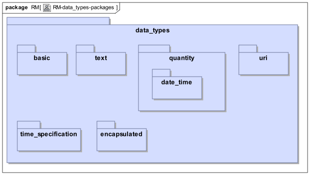

## 4.基本包装

### 4.1. 概述

下面所示的data_types.basic包包含bistate，状态（在状态机中）和实际实体标识符的概念的类型（有关标识符类型的讨论，请参见openEHR Common IM）。

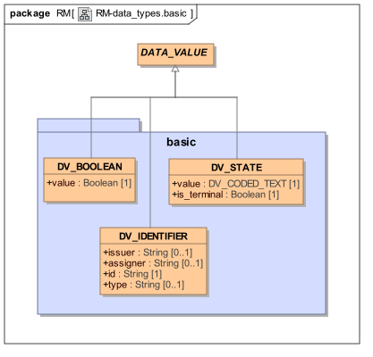

#### 4.1.1. 要求

##### 双态值

最基本的数据类型之一是布尔或双态数据。 这里需要的是一个类型，它包括一个布尔值，并继承自类型DATA_VALUE，使其能够用作ELEMENT.value。

##### 状态机状态

需要一种类型来表示状态机的状态值。 在一个简单的数据类型系统中，一个简单的整数将足以执行此作业。 然而，在一个原型框架中，需要一个不同的类型，所以它可以不是由整数的约束，而是由状态机定义代替。 为此目的提供了类型DV_STATE。 在下图中说明了对药物订单的生命周期进行建模的状态机的示例。 这个定义将出现在原型中; DV_STATE对象的值然后被限制为定义中的状态的值。

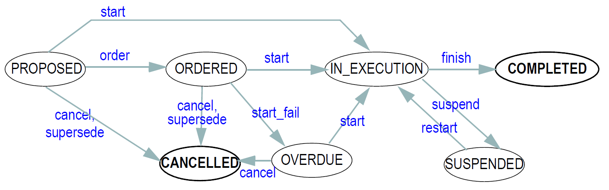

##### 现实世界实体识别

诸如人，汽车引擎，发票和约会的现实世界实体（RWE）都可以被分配标识符。虽然其中许多设计为在管辖区域或发布空间内是唯一的，但由于数据输入错误，不良设计（ids太小或包含所标识实体的一些非唯一特性），坏进程（例如非同步id发布点）;身份盗用（例如通过窃取证明文件或黑客入侵）。一般来说，虽然一些现实世界标识符（RWI）是“几乎唯一的”，但没有一个可以保证。因此，从严格的计算机角度看，RWI不被视为可靠的标识符，而是作为其拥有对象的属性，例如以与名称和地址相同的方式。

意图在发布机构或组织的空间内唯一的RWE标识符的示例包括：

- 驾驶执照号码

- 社会安全号码

- 护照号

- 处方ID

RWE ids的定义逻辑特性是它们继续识别所讨论的实体，而不管它们如何随时间变化;例如当有人改变他们的头发颜色甚至他们的性别时（这两个属性都可以记录在数据库中），社会安全号码不改变。通常情况下，如果两个RWE id相等，则它们指的是相同的RWE。

在实践层面，RWE标识符与信息实体（IE）标识符不同，因为前者通常不由使用它们的计算基础设施来分配 - 也就是说，在生产计算系统中，这样的标识符与其它特性，例如姓名或地址。

#### 4.1.2.设计

在DV_IDENTIFIER类中定义的模型允许记录三个事物作为识别感兴趣项目的一部分：

- 给予感兴趣的项目的标识符（强制性）。

- 使用的ID类型的发布机构（例如它可能是联邦卫生部）（可选）;

- 该ID的分配者到被识别的项目。这通常是创建被识别的项目的组织（可选）;

此外，还可以记录被识别的项目的类型，诸如“驾驶执照”或“医疗保险卡”。所有字段都是文本字段，而不是编码，因为没有确定的词汇可用。然而，存在一些有用的术语源，例如类型字段的HL7v2表203.如果使用后者，建议使用“描述”而不是代码。

只有标识符字段是必需的，以便允许不能填充其他字段的用例。但是强烈建议在可能的情况下填充类型和颁发者字段。在许多情况下，发行者和分配者具有相同的值，然而两个字段允许其中中央发行者向其他组织提供标识符块（通常以某种形式或其他文书工作），然后将它们分配给个人的情况，如通常使用处方标识符。

有关RWE和IE的进一步讨论以及openEHR中的IE的定义，请参阅支持IM [openehr_rm_support]规范。

### 4.2.类描述

#### 4.2.1. DATA_VALUE类

<table>
	<tr>
		<td>类</td>
		<td>DATA_VALUE（摘要）</td>
	</tr>
	<tr>
		<td>描述</td>
		<td>作为openEHR模型中所有数据值类型的共同祖先。</td>
	</tr>
	<tr>
		<td>继承</td>
		<td>OPENEHR_DEFINITIONS</td>
	</tr>
</table>

#### 4.2.2. DV_BOOLEAN类

<table>
	<tr>
		<td>类</td>
		<td colspan="2">DV_BOOLEAN</td>
	</tr>
	<tr>
		<td>描述</td>
		<td colspan="2">真正为布尔数据的项目，例如真/假或是/否答案。对于这样的数据，重要的是仔细地设计含义（通常是主观数据中的问题），使得唯一允许的结果实际上是真或假。 滥用：DV_BOOLEAN类不应该用作替代原始模型枚举类型，例如男/女等。这样的值应该被编码，并且在任何情况下，枚举通常具有多于两个值。</td>
	</tr>
	<tr>
		<td>继承</td>
		<td>DATA_VALUE</td>
		<td></td>
	</tr>
	<tr>
		<td>属性</td>
		<td>签名</td>
		<td>含义</td>
	</tr>
	<tr>
		<td>1..1</td>
		<td>value：Boolean</td>
		<td>此项的布尔值。实际值可以是语言或实现依赖的。</td>
	</tr>
</table>

#### 4.2.3. DV_STATE类

<table>
	<tr>
		<td>类</td>
		<td colspan="2">DV_STATE</td>
	</tr>
	<tr>
		<td>描述</td>
		<td colspan="2">用于表示遵守定义的状态机的状态值，例如表示指令或护理过程的状态的变量。 DV_STATE表示为字符串，但其值由原型定义的状态机驱动。这提供了一种在简单数据中捕获状态复杂进程的强大方法。</td>
	</tr>
	<tr>
		<td>继承</td>
		<td colspan="2">DATA_VALUE</td>
	</tr>
	<tr>
		<td>属性</td>
		<td>签名</td>
		<td>含义</td>
	</tr>
	<tr>
		<td>1..1</td>
		<td>值：DV_CODED_TEXT</td>
		<td>状态名称。状态名称由在原型中定义的状态/事件表确定，并使用openEHR术语或本地原型术语（由原型指定）进行编码。</td>
	</tr>
	<tr>
		<td>1..1</td>
		<td>is_terminal：Boolean</td>
		<td>指示该状态是否是不可能进一步转换的终端状态，例如“中止”，“完成”等。</td>
	</tr>

#### 4.2.4. DV_IDENTIFIER类

<table>
	<tr>
		<td>类</td>
		<td colspan="2">DV_IDENTIFIER</td>
	</tr>
	<tr>
		<td>描述</td>
		<td colspan="2">用于表示真实世界实体的标识符的类型。典型的标识符包括驾驶执照号码，社会安全号码，退伍军人事务号码，处方ID，订单ID等。 DV_IDENTIFIER用于表示某一机构或机构发布的真实事物的任何标识符。 滥用：DV_IDENTIFIER不用于表示由基础结构生成的引用信息项的标识符;为此目的定义了类型OBJECT_ID和OBJECT_REF和子类型。</td>
	</tr>
	<tr>
		<td>继承</td>
		<td colspan="2">DATA_VALUE</td>
	</tr>
	<tr>
		<td>属性</td>
		<td>签名</td>
		<td>含义</td>
	</tr>
	<tr>
		<td>0..1</td>
		<td>issuer：String</td>
		<td>发出此对象的id字段中使用的id类型的可选权限。</td>
	</tr>
	<tr>
		<td>0..1</td>
		<td>assigner：String</td>
		<td>将ID分配给正在标识的项目的可选组织。</td>
	</tr>
	<tr>
		<td>1..1</td>
		<td>id：String</td>
		<td>标识符值。通常结构化，根据发证机构的规则的定义。</td>
	</tr>
	<tr>
		<td>0..1</td>
		<td>type：String</td>
		<td>可选标识符类型，例如处方或社会安全号码。有一天，受控的词汇可能是可能的。</td>
	</tr>
	<tr>
		<td>不变</td>
		<td colspan="2">Issuer_valid：not issuer.is_empty</td>
	</tr>
	<tr>
		<td></td>
		<td colspan="2">Assigner_valid：not assigner.is_empty</td>
	</tr>
	<tr>
		<td></td>
		<td colspan="2">Id_valid：not id.is_empty</td>
	</tr>
	<tr>
		<td></td>
		<td colspan="2">Type_valid：not type.is_empty</td>
	</tr>

## 5.文本包

### 5.1.概述

data_types.text包包含用于表示健康记录中所有文本值的类，包括纯文本，编码术语和叙述文本。如下图所示。

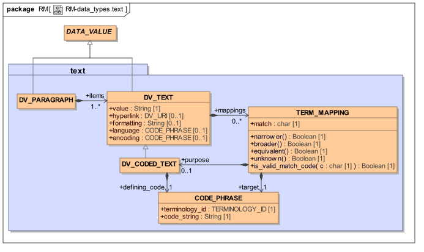

#### 5.1.1.要求

以下部分描述了文本数据类型的要求。一开始就应当注意两个最重要的原则。

1. 不管临床医生和/或软件可用什么术语（或不可用），主要要求是在所有情况下临床医生能够准确地记录他们想要说什么。这意味着，如果他们想要记录一些非常笼统的东西，比如“冷”或一个非常具体的术语，如“罗斯河病毒感染”，他们应该能够，不管是否有适当的编码术语。然而，该设施应该可用于在任何时候或甚至在稍后时间对任何这样的文本项目进行附加编码，以便满足报告或其他需要。

2. 假设任何术语的客户端，例如EHR，使用术语服务，其提供对术语的完整接口。 DV_CODED_TEXT类型的设计反映了这一点。因此，在此处描述的数据类型所允许的术语环境之外不存在“后协调”的概念：从术语服务可获得的唯一的事物是指代词汇实体的关键词，其可以是单个词或代码短语，并且其可以是参考术语的一部分和/或链接到底层本体的元素。还假定不存在对任何特定术语的直接访问;对所有术语（无论是简单编码词典还是大型语义网络）的访问是通过相同的抽象接口。

##### 术语Id可能是各种类型。

1. 术语Id =“local”：此常量值表示允许值的原点在原型中描述。这是编码以允许翻译。本地原型只需要一组代码和本地翻译。如果需要，原型可以包含转换表。

2. 术语Id =“[authority]”。这可能是“openehr”，“centc251”，“hl7”等;

3. 也可以支持变体术语Id =“[authority]：[Domain value set]”，尽管通常不必要，因为所有代码在给定的发布机构内应该是唯一的。示例可能是“openehr：event math function”，“hl7：gender”;

4. 术语Id =“SNOMED-CT”，“ICD10AM”等。这种类型的同义词必须是来自权威来源的一组已接受的术语中的唯一值。这些必须是普遍知道的。在openEHR中，使用来自美国国家医学图书馆的UMLS术语名称列表的名称。有关详细信息，请参见[openehr_rm_support]，术语包。

##### 叙事文本

叙述性文本项目在许多情况下用于EHR，包括：

- 参考模型中的编码属性的值;

- 记录主观或不精确的患者反应，特别是不被认为足够精确以使用结构化定量或日期/时间日期类型表示的数量或日期;

- 记录叙述陈述，例如。视觉观察;

- 记录散文束，例如。总体结果和结论，预后;

- 记录通常将被编码但是没有代码和/或没有术语服务可用的值。

虽然叙事文本项本身不是自己编码的，但是它们可以具有与它们相关联的代码短语，如下面在映射下所描述的，并且可以在段落内与编码项混合。

##### 术语实体

术语服务中可用的文本实体在健康记录中使用，以实现从简单查询到决策支持的处理。使用术语的原因包括以下。

- 保证意义的互操作性。例如，如果术语“冷”以纯文本记录，可以解释为“感觉寒冷”，“COLD”（慢性阻塞性肺病），“rhinorrhoea”，“coryza”或“URTI（上呼吸道感染然而，如果它是从诸如ICD10或SNOMED-CT的术语编码的，则任何读取数据（包括软件）的一方都知道意图，因为术语中的代码的含义是明确的。

- 标准化术语的文本呈现，避免非正式的速记。例如，想要写“收缩压”的医生写“收缩压BP”，“收缩压bp”，“系统BP”。等等;使用编码术语确保这样的缩写或者被避免，或者与明确的含义相关联。

- 用于明确命名问题，药物或诊断，以支持基于知识的工具，如处方包和其他决策支持应用程序。

- 对于记录中的事物的标准化名称“体格检查”的标题或“差别诊断”等条目。

- 对于有限集合的值（'值集合'），例如。血型='A | B | AB | O'。

- 为了将其它数据分类以用于统计研究，例如通过将ICD疾病组分类器放入在健康记录中输入的实际疾病名称。

使用术语（即文本是代码的官方标记）编码的文本项的互操作性的基本要求是，必须记录量规和代码（或“代码短语”），以确保最初对于不能访问在原点处使用的术语的EHR信息的接收者保留预期文本。然而，在术语服务可用的情况下，密钥可以用于明确地定位术语的字符串值，并且还可以用于找到其他语言的翻译。 （请注意，这些注释不适用于映射，如下所述）。

在一些术语中，存在从大多数编码术语发出的链接的语义网络，其将它们分类或将它们与其他术语相关联。这种链接提供了决策支持的手段，以推断记录中发现的具体事物。例如，如果发现术语“白血病”，可以对术语服务进行询问，以便推断患者既具有“癌症”又具有“免疫系统疾病”（假设白血病被分类在这些更一般的术语中的术语）。

本说明书假定术语服务的存在，其负责询问实际术语并执行术语的经验证的协调，即创建由潜在的源术语认为有效的组合，潜在地甚至不向结果分配新的代码。所有经验证的协调在术语服务内部执行，并且由服务提供的任何“术语”已经“协调”。 “预协调”和“后协调”术语之间的区别是前者具有单个代码，而后者具有可由术语解释的代码短语或表达。例如，可以由术语服务从源术语“脚”，“左”和“具有左侧”创建协调“脚，左”（写入关系“脚具有左侧的关系”的简写方式）从术语如SNOMED。任何这样的协调在源术语中必须是有效的，即对应于其中定义的有效关系。

这里描述的类DV_CODED_TEXT捕获两件事的关联：

- 记录在define_code属性中的术语服务提供的代码短语的代码短语。

- 代码短语的文本标记，记录在value属性中（继承自DV_TEXT）;

类CODE_PHRASE.code_string以术语服务接口中的某些检索功能的参数的形式记录一个键。

附加到术语协调的语义可能不同。文献中描述的两类协调是“资格”和“修改”。第一个的共同定义是“资格缩窄意义” - 即创建一个新的术语，其可能的真实世界实例在由原始根术语表示的集合内。另一方面，修改改变根词的含义。以下在含义修改下描述各种情况。两种协调类型都假定由术语服务管理。

编码的术语还可以被映射到来自其他术语的术语，其可以被认为是等同物，分类器或其间的某物。下面的映射部分涉及这些。

#### 5.1.2.设计

所有原子文本项都是类型DV_TEXT或DV_CODED_TEXT的实例。前者允许使用可选的格式和超链接来表达文本。后者另外将文本值连接到术语服务中的键，意味着键是指与文本值在词汇和语义上相同的术语实体。

DV_CODED_TEXT的模型被设计为捕获由用户或软件在运行时选择的实际编码项;隐含地假定这包括选择了任何同义词（来自相同术语的等同含义的术语），用于支持同义词的术语，以及基础不同术语的任何协调。 DV_CODED_TEXT实例只能在用户选择的最终文本值在词汇上与术语服务为该键返回的Rubric相同时使用;如果用户进行了最轻微的更改，则会丢失Rubric / key的身份，并应使用映射（请参阅映射部分）。

在允许编码或非编码文本项目的任何地方应使用DV_TEXT类型，而在文本项目必须编码的任何地方应使用DV_CODED_TEXT类型。类型DV_PARAGRAPH允许从DV_TEXT实例的列表（即DV_TEXT和DV_CODED_TEXT的实例）构建更大的文本块，如下所示。

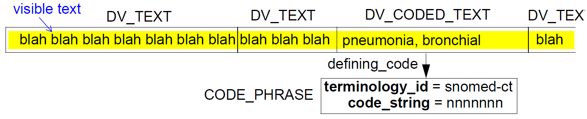

下图说明了典型DV_PARAGRAPH的视觉外观。

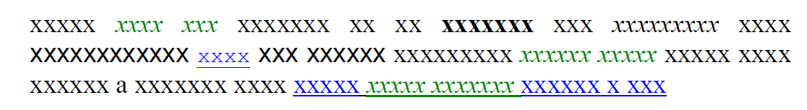

#### 5.1.3.资格

资格是通过附加条款的后期协调使一个术语更具体的过程。当术语定义主要术语和其他符合主要术语的术语之间的关系时，会发生这种情况。例如，使用产生限定术语的术语“支气管炎”的协调可以是“急性支气管炎”;后者的所有现实世界的实例也是前者的实例。

#### 5.1.4.含义修改

改变其他术语含义的术语通常称为“修饰符”。修饰和限定之间的差异是修饰剂改变含义，使得修饰的术语作为整体不指未修饰的术语的实例。我们在下面描述特定类型的修饰符以及它们如何使用文本数据类型表示。

##### 模式转换条款

一类修饰语的例子是添加了“风险”，“恐惧”，“历史”等词。这些有时被称为模式变化术语，因为它们将根词的“模式”从现在改变为过去（“历史”），潜在未来（“风险”）或一些其他替代现实。以这种方式修改的术语不应该在搜索根词的查询中匹配;例如，（患者的）“冠状动脉性疾病”的查询不应与“冠状动脉疾病的家族史”匹配。
上下文敏感性

存在许多术语，其含义通过它们被陈述的上下文来改变，例如在某种类型的音符或测试结果内。考虑以下：

- 在75gm口服负荷后的血糖水平与空腹血糖具有不同的含义;

- 肺动脉中的收缩血压具有与全身动脉血压不同的含义;

- 在“计划程序”的上下文中的“全髋关节置换术”;

- “脑膜炎”在“鉴别诊断”的上下文中。

##### 否定

否定是一种特殊的模式变化，在过去一直是一个严重的设计挑战，因为修饰符，如“不”或“不”只有附加到一些术语时才有意义，并通过任意与其他术语关联创​​建无意义的值或模糊。
意义修改术语的表示

不是提供用于在DV_CODED_TEXT内表示修饰词的显式特征，除了资格之外的所有后协调的基本表示的一般原理是较高级别的原型结构，例如ENTRY（在EHR RM中定义）是最小的不可分割的信息单位。这样的更高级实体可以具有内部结构，并且可能（并且期望）通过该结构实现术语组合的效果。在ENTRY的情况下，它将通过CLUSTER / ELEMENT对象的结构化。一般规则是：为了获得记录中找到的任何术语的完整含义，必须从根到相关叶来考虑任何ENTRY（已编码或未编码）中的所有节点名称。相反，记录中任何术语的“最终”含义不能与结构中的其余术语分离。

因此，概念“冠状动脉疾病的家族史”被表示为其根被命名（例如）“主体家族史”的ENTRY，并且其包括可以更大更不详细的进一步结构;编码的术语“冠状动脉疾病”将出现在该结构的某处。实际结构完全由适当的原型定义。与一些看法相反，没有一般方法来表示诸如“冠心病家族史”的概念，因为它将根据记录多少细节而变化。如果一些GP常规记录的只是最简单的形式，其他人可能会记录哪些家庭成员有心脏问题的详细信息，以及它们是什么。

相同的方法用于上下文相关项。定义诸如“计划过程”或“鉴别诊断”的上下文的原型将使用这些术语作为它们的根节点;因此，出现在根下面的任何术语的含义只能通过包括根来理解。再次，确切的结构完全依赖于原型，并且可以是简单的或相当复杂的。

否定是比可能首先明显更复杂，并且最好由好的原型设计处理。术语可能提供一个术语，如“没有已知的过敏”，这是有帮助的。但是，如果某人有某种过敏，药物的要求可能是记录该人对青霉素或另一类正在处方的药物没有已知的过敏。经常提出的使用通用否定“修饰语”来处理这些问题的方法导致进一步的问题。考虑使用否定肝 - “无肝”，“无明显肝”，“无肝病”，“无肝病史”，“无肝功能”，“无肝功能检查”。否定术语的含义可能是非感觉的，难以解释。

处理负面的基本原则是意识到，最简单的建议使用案例是相当含糊的。 “没有过敏”是指“没有报告的过敏反应”，“没有过敏反应”，“没有已知的药物过敏”或其他？这是否意味着这些陈述是由患者给出的，还是由测试确定的？像所有的医学现象一样，过敏症必须在一些细节上描述为EHR的任何实际使用。几乎不可避免地，这排除了否定术语的使用。由于实际的信息结构将由原型设计者预先确定，临床医生几乎不会处于不得不否定术语的情况。然而，如果需要确实出现，则应当通过否定的或定量的答案，即值而不是名称来处理。例如，在描述当前问题的任何ENTRY中，临床医生可以记录名称/值对“过敏：NONE”。这里，“过敏”将是DV_CODED_TEXT，并且“NONE”将是DV_CODED_TEXT或DV_TEXT;这两个将由包含对象关联，例如来自EHR RM的ELEMENT类的实例。在openEHR中没有明确的否定模型。

#### 5.1.5.映射

在许多情况下，纯文本和编码文本项目被映射到来自其他术语的术语。在理论上，这应该永远不会发生，因为这意味着应当仅在知识库（以术语服务或其他形式）中知道的术语之间的关系被创建并作为EHR信息的一部分被传送，从而潜在地无效或重写知识库。在需要映射的地方，正确的方法是在知识环境中创建叙词表，并通过它们进行映射。不幸的是，在一些情况下，真实世界中的活动不遵守信息/知识边界，因此这里描述的模型包括显式映射概念，其本身包括“目的”和“匹配”指示符。匹配对应于下面描述的类别。

##### 分类（更宽​​的术语）

任何文本项目，无论是否编码，都可以用编码术语分类，用于研究，报告和决策支持目的。例如，在热带澳大利亚工作的GP可能希望写“Ross River感染”，并且使用不包含该术语的ICD9（尽管ICD9-CM）。他或她将使用纯文本项，但仍然能够将其映射到ICD9分类器，例如“虫媒病毒感染NOS”的代码。相同的方法可以用于将分类项添加到编码文本项。分类器术语的效用是多种多样的：它们允许决策支持来做出更强大的推断;在其中可用术语不提供内置分类的情况下，并且在已知不是所有EHR数据的用户将具有可用术语的情况下。在数据术语中，分类映射可以如下所示地可视化。

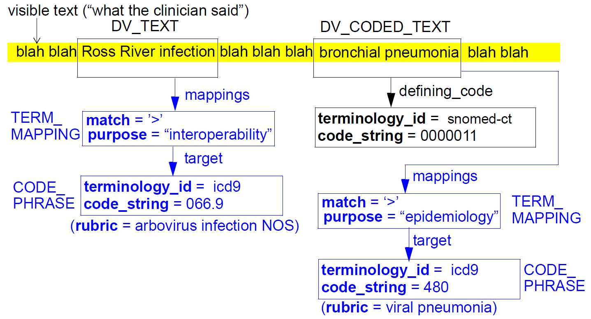

通过将术语添加到原始术语的映射列表来表示分类映射。每个映射使用TERM_MAPPING的实例来显式地表示，其指示与原始文本项相关联的项和用于匹配属性的值“>”，其指示映射是“更宽的”。 match属性的可能值为'>'（较宽），'<'（较窄）和'='（等效）。它们取自ISO标准[ISO_2788]和[ISO_5964]。

##### 等效/同义词

来自病理实验室的数据经常使用实验室本地的术语进行编码，因为使用现有广泛的术语缺乏或经济上不可行。然而，一些实验室还提供来自诸如LOINC的熟知术语的最接近的等效代码，以使得数据的接收器能够以更标准的方式处理它。这里，“等价”是指具有相同含义但来自不同词汇的术语。

可能提供等效术语的另一个实例是在跨管辖区共享EHR时，实施跨专业词汇的翻译，例如护理词汇。

在理论上，对于用本地和更标准的等效物来编码的数据的发送者和接收者的处理映射问题的最清洁的方式是本地术语的发起者将翻译的完整辞典提供到一个或多个识别的术语中。然而，在实践中，使用HL7v2.x消息传递标准的实验室通常编码主要术语和具有HL7 CE数据类型的等同物，这意味着等价物仅包括与它们一起使用的术语。在EHR中映射等效项的类似的实用方法可能与这里描述的数据类型一起使用，并且可以利用与分类相同的映射方法来实现。

另一种情况是，文本值 - 这次是纯文本 - 被映射到等价术语是当自然语言处理用于生成现有自由文本散文的编码项时。这种处理的目的是检测单词短语并将它们与具有相同含义的编码项相关联，而不删除原始文本。根据这里描述的模型，CODE_PHRASE通过映射属性与DV_TEXT实例相关联。

在所有使用等价值的情况下，match属性的值为'='，表示映射是同义词。

##### 更具体的映射（更窄的术语）

有时，需要创建到比原始文本项目具有更窄含义的术语的映射。发生这种情况的情况包括当临床医生想要记录诸如“cro”或“流感”的综合征时，但是该术语不包含这些一般术语，尽管它包含更具体的术语，例如。 “病毒性喉炎 - 气管炎”或“A型流感”。显然，应该允许临床医生记录他/她想要什么（如果需要，可以是纯文本），但是也应当能够将映射添加到更精确的术语。对于映射到较窄术语的映射，match属性的值为'<'。

##### 统一医学语言系统（UMLS）

在GEHR [GeHR_Aus_req]中已经论证UMLS参考术语还应当以UMLS概念唯一标识符或“CUI”的形式提供编码术语的出现。 UMLS是对在美国国家医学图书馆开发的术语进行编码的一种方式，由一个元词库组成，其中来自任何现存术语集（例如ICD，SNOMED，READ）的术语可以交叉参考。 UMLS CUI可能对决策支持和报告非常有用。

UMLS的正确使用是来自特定术语的术语被传递到UMLS接口并且响应地接收CUI + Rubric。然而，上述映射方法还可以用于将UMLS CUI映射到EHR中的现有文本或术语;在这种情况下，为每个UMLS“项”构造DV_CODED_TEXT，其中代码是CUI，并且Rubric是CUI的文本呈现（在UMLS中保证是唯一的）。相同的方法可以用于将来可用的任何其它同义词词典。

##### 传统映射场景

在传统数据必须转换为符合openHHR的数据并且只有代码可用的情况下， ICD或ICPC代码，建议采用以下方法：

- 创建一个新的DV_TEXT，其值为“（不可用）”

- 添加映射到DV_TEXT，具有：

    - purpose =“legacy conversion”

    - match =“=”

    - target = CODE_PHRASE对象，其code_string和terminology_id设置为对应于旧数据中的可用代码。

这表明了现实：遗留系统中没有记录任何文本;而是直接在数据字段中记录代码。在转换的数据中，这个代码更正确地被认为是映射。

#### 5.1.6.语言翻译

在大多数情况下，文本对象的自然语言从包围的条目（即观察）或其他包围的上下文中是已知的。在不同的地方（例如，在英语语言诊断中的德语句子），或者没有封闭上下文时，可以设置DV_TEXT.language属性以指示文本项的语言。

### 5.2.类描述

#### 5.2.1. DV_TEXT类

<table>
	<tr>
		<td>类</td>
		<td colspan="2">DV_TEXT</td>
	</tr>
	<tr>
		<td>描述</td>
		<td colspan="2">文本项，其可以包含任何数量的合法字符，排列为例如字，句子等（即一个DV_TEXT可以是多于一个字）。可以包括可视格式化和超链接。 DV_TEXT可以通过向其添加映射来编码。 文本的片段（无论是否被编码）作为值使用，或者组成更大的文本段，其可以以某种方式被标记，最终组成段落。</td>
	</tr>
	<tr>
		<td>继承</td>
		<td colspan="2">DATA_VALUE</td>
	</tr>
	<tr>
		<td>属性</td>
		<td>签名</td>
		<td>含义</td>
	</tr>
	<tr>
		<td>1..1</td>
		<td>value：String</td>
		<td>项目的可显示再现，无论其基础结构如何。对于DV_CODED_TEXT，这是术语服务提供的完整术语的标题。不允许回车，换行或其他非打印字符。</td>
	</tr>
	<tr>
		<td>0..1</td>
		<td>超链接：DV_URI</td>
		<td>可选链接位于一段纯文本或编码项目项的后面。</td>
	</tr>
	<tr>
		<td>0..1</td>
		<td>formatting：String</td>
		<td>格式字符串形式名称：value; name：value ...， “font-weight：bold; font-family：Arial; font-size：12pt;”。 取自W3C CSS2属性的值列出了背景和字体。</td>
	</tr>
	<tr>
		<td>0..1</td>
		<td>映射：列表<TERM_MAPPING></td>
		<td>来自与该术语最密切匹配的其他术语的术语，通常在信息的发起者（例如病理学实验室）使用本地术语但是还提供来自公知术语（例如LOINC）的一个或多个等同物时使用。</td>
	</tr>
	<tr>
		<td>0..1</td>
		<td>语言：CODE_PHRASE</td>
		<td>用于写入值的本地化语言的可选指示符。从openEHR代码集语言编码。仅当文本对象使用与包含的ENTRY不同的语言时使用，或者文本对象正在ENTRY或指示语言的其他包围结构之外使用。</td>
	</tr>
	<tr>
		<td>0..1</td>
		<td>encoding：CODE_PHRASE</td>
		<td>对此值进行编码的字符编码方案的名称。从openEHR代码设置字符集编码。 Unicode是openEHR中的默认假设，UTF-8是假定的编码。此属性允许从这些假设的变化。</td>
	</tr>
	<tr>
		<td>不变</td>
		<td colspan="2">Valid_value：not value.is_empty然后不是（value.has（CR）或value.has（LF））</td>
	</tr>
	<tr>
		<td></td>
		<td colspan="2">Language_valid：language / = Void意味着code_set（Code_set_id_languages）.has_code（language）</td>
	</tr>
	<tr>
		<td></td>
		<td colspan="2">Encoding_valid：encoding / = Void意味着code_set（Code_set_id_character_sets）.has_code（encoding）</td>
	</tr>
	<tr>
		<td></td>
		<td colspan="2">Mappings_valid：mappings / = void表示不是mappings.is_empty</td>
	</tr>
	<tr>
		<td></td>
		<td colspan="2">Formatting_valid：formatting / = void表示不是formatting.is_empty</td>
	</tr>

#### 5.2.2. TERM_MAPPING类

<table>
	<tr>
		<td>类</td>
		<td colspan="2">TERM_MAPPING</td>
	</tr>
	<tr>
		<td>描述</td>
		<td colspan="2">表示映射到DV_TEXT的编码项，以及目标项相对于映射项目的相对匹配。普通或编码的文本项目可能出现在EHR中，需要替代术语中的一个或映射。映射仅用于启用计算机处理，因此它们只能是DV_CODED_TEXT的实例。用于添加分类术语（例如将ICD分类器添加到SNOMED描述性术语），或映射到其他术语（例如跨护理词汇）的等同物。</td>
	</tr>
	<tr>
		<td>属性</td>
		<td>签名</td>
		<td>含义</td>
	</tr>
	<tr>
		<td>1..1</td>
		<td>match：char</td>
		<td>
<pre>
目标词语相对于映射文本项目的相对匹配。结果含义： 

    '&gt'：映射是一个更广泛的术语。原始文本=虫媒病毒感染，目标=病毒感染

    '='：映射到（假定）等价于原始项目

    '&lt'：映射是一个较窄的术语。例如原始文本=糖尿病，映射=糖尿病。

    '？'：映射的类型是未知的。

前三个值取自ISO标准2788（单语词典的建立和发展指南）和5964（多语言词典的建立和开发指南）。
</pre>
</td>
	</tr>
	<tr>
		<td>0..1</td>
		<td>用途：DV_CODED_TEXT</td>
		<td>映射目的。自动化数据挖掘，计费，互操作性</td>
	</tr>
	<tr>
		<td>1..1</td>
		<td>target：CODE_PHRASE</td>
		<td>映射的目标术语。</td>
	</tr>
	<tr>
		<td>函数</td>
		<td>签名</td>
		<td>含义</td>
	</tr>
	<tr>
		<td></td>
		<td>narrower：Boolean</td>
		<td>映射是一个较窄的术语。</td>
	</tr>
	<tr>
		<td></td>
		<td>broader：Boolean 发布：match ='>'表示结果</td>
		<td>映射是一个更广泛的术语。</td>
	</tr>
	<tr>
		<td></td>
		<td>equivalent：Boolean</td>
		<td>映射是等效的术语。</td>
	</tr>
	<tr>
		<td></td>
		<td>Unknown：布尔 Post：match ='？'表示结果</td>
		<td>映射的类型是未知的。</td>
	</tr>
	<tr>
		<td></td>
		<td>is_valid_match_code（c：char）：Boolean
post：result：= c ='&gt'或c ='='或c ='&lt'或c ='？</td>
		<td>如果匹配有效则为True。</td>
	</tr>
	<tr>
		<td>不变</td>
		<td colspan="2">Purpose_valid：purpose / = Void意味着术语（Terminology_id_openehr）.has_code_for_group_id（Group_id_term_mapping_purpose，purpose.defining_code）</td>
	</tr>
	<tr>
		<td></td>
		<td colspan="2">Match_valid：is_valid_match_code（match）</td>
	</tr>
</table>

#### 5.2.3. CODE_PHRASE类

<table>
	<tr>
		<td>类</td>
		<td colspan="2">CODE_PHRASE</td>
	</tr>
	<tr>
		<td>描述</td>
		<td colspan="2">从术语服务（与特定术语不同）完全协调（即已执行所有协调）术语。</td>
	</tr>
	<tr>
		<td>属性</td>
		<td>签名</td>
		<td>含义</td>
	</tr>
	<tr>
		<td>1..1</td>
		<td>terminology_id：TERMINOLOGY_ID</td>
		<td>提取code_string（或其元素）的不同术语的标识符。</td>
	</tr>
	<tr>
		<td>1..1</td>
		<td>code_string：String</td>
		<td>术语服务用于识别概念或协调概念的关键字。这个字符串在术语服务中很可能是可解析的，但是除了上下文之外，不能假设它的语法。</td>
	</tr>
	<tr>
		<td>不变</td>
		<td colspan="2">Code_string_valid：not code_string.is_empty</td>
	</tr>
</table>

#### 5.2.4. DV_CODED_TEXT类

<table>
	<tr>
		<td>类</td>
		<td colspan="2">DV_CODED_TEXT</td>
	</tr>
	<tr>
		<td>描述</td>
		<td colspan="2">一个文本项，其值必须是受控术语中的Rubric，其中的键（即代码'）是define_code属性。换句话说：DV_CODED_TEXT是CODE_PHRASE（有效地是一个代码）和该术语（来自术语服务）在数据创作语言中的标题的组合。 因为DV_CODED_TEXT是DV_TEXT的子类型，所以它可以用于代替它，有效地允许类型DV_TEXT意味着可以可选地被编码的文本项。 滥用：如果意图表示以某种方式附加到纯文本片段的术语代码，则不应使用DV_CODED_TEXT;而是使用DV_TEXT和TERM_MAPPING到CODE_PHRASE。</td>
	</tr>
	<tr>
		<td>继承</td>
		<td colspan="2">DV_TEXT</td>
	</tr>
	<tr>
		<td>属性</td>
		<td>签名</td>
		<td>含义</td>
	</tr>
	<tr>
		<td>1..1</td>
		<td>define_code：CODE_PHRASE</td>
		<td>'值'属性是文本表达（即，粗体）的术语。</td>
	</tr>
</table>

#### 5.2.5. DV_PARAGRAPH类

<table>
	<tr>
		<td>类</td>
		<td colspan="2">DV_PARAGRAPH</td>
	</tr>
	<tr>
		<td>描述</td>
		<td colspan="2">由一系列DV_TEXT组成的逻辑复合文本值，即，可能具有简单格式化的纯文本（可选地被编码），以形成更大的散列区，其可以被解释为用于作为段落的显示目的。 DV_PARAGRAPH是在摘要，报告等中构建较长文本项的标准方法。</td>
	</tr>
	<tr>
		<td>继承</td>
		<td colspan="2">DATA_VALUE</td>
	</tr>
	<tr>
		<td>属性</td>
		<td>签名</td>
		<td>含义</td>
	</tr>
	<tr>
		<td>1..1</td>
		<td>项目：列表<DV_TEXT></td>
		<td>组成段落的项目，其中每一个是文本项目（其可以具有其自己的格式化和/或具有超链接）。</td>
	</tr>
	<tr>
		<td>不变</td>
		<td colspan="2">Items_valid：not items.is_empty</td>
	</tr>
</table>

## 6.数量包装

### 6.1.概述

data_types.quantity包如下所示。日期和时间在下一节中找到。

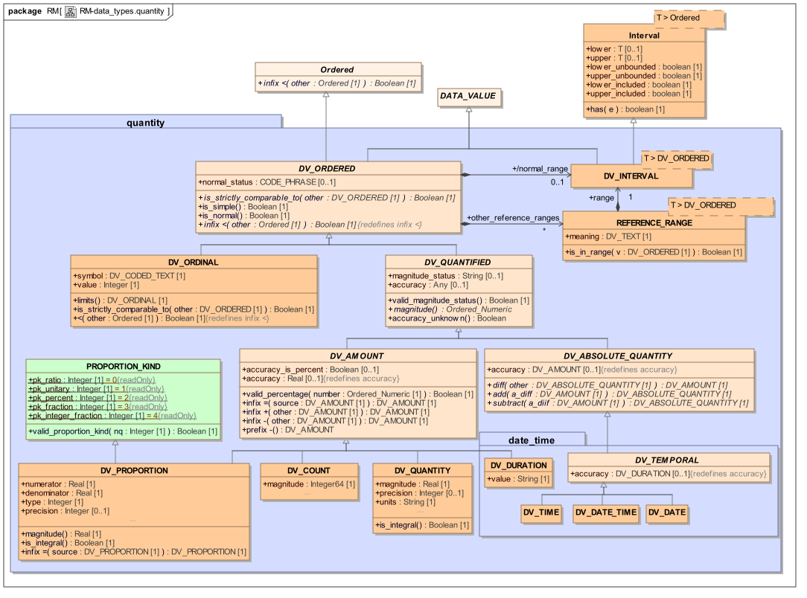

#### 6.1.1.要求

##### 序数值

医学是一个域，其中通常使用表示相对幅度的符号，没有精确的值是已知的。主要目的通常是将患者分成可能作出不同决定的组。因此，尽管可以说明近似范围（技术上 - “模糊间隔”）（例如对于尿分析），但具体值不感兴趣，只有类别。例如，将疼痛表征为“轻度”，“中度”，“严重”或对腱刺激的反射反应为“ - ”，“+/-”，“+”，“++”，“ ++“，”++++“。可能没有办法科学地精确地量化这样的值，因为它们反映了患者的主观经验或临床医生的非正式判断。然而，它们被理解为有序的，例如。 “++”是“大于”“+”。

类似地，即使在尿分析中溶血血液的符号值具有针对它们所述的近似范围，如下所示，但是这些“值”不能以与真实量相同的方式使用。

- “neg”，“痕量”（10个细胞/μl）

- “small”（<25个细胞/μl）

- “moderote”（<80个细胞/μl）

- “large”（> 200个细胞/μl）

对于序数值的第二要求是在许多情况下需要将整数值与符号相关联，以便于有序比较，并且还能够实现相同类型的结果（例如疼痛，蛋白质）的纵向比较。整数值可以是负的，0和正，通常允许0值对应于范围中的中性值。

>注意: 有时提出以更精确的方式记录所有序数的论据是，可能希望比较两个实验室为同一符号（例如“中等”）引用的值。有许多反驳。首先，这种比较是正常化的一种很差的尝试，这种活动是病理学家的业务，而不是EHR用户。其次，符号值通常由测试者在条带上进行颜色判断来获得，其中，用于分类的足够（和成本有效）方法不是量化值的有效方法。最后，在大多数情况下，如果需要或可用的量化点值或范围，则将使用它 - 意味着可以使用适当的定量数据类型，而不是序数类型。

##### 可数事物

医学中的一种常见类型的数据值是无量纲的可数量，例如“剂量数：2”，“以前怀孕的次数：1”，“片剂数：3”。此类型的值始终为整数。为了统计目的，可计数值需要转换为实数，例如对于每对夫妇的平均妊娠数的研究。

一些可数的实体，如平板电脑，可以分为主要部分，通常是一半和偶尔宿舍。

##### 尺寸量

最常见的数量是一个测量的，量化的数量。任何可衡量的（而不是可数的）涉及一些数据方面，即：

- 其值为实数的幅度;

- 用适当的单位测量的物理性质;

- 精度的概念，即记录值的小数位数;

- 精度的概念，即由于仪器或人类判断的测量中的已知或假设误差。

尺寸量的示例包括：

- 收缩压：110mmHg

- 身高：178厘米

- 哮喘发作率：7 /周

- 重量损失：2.5公斤

- 比率和比例

科学和医学中的常见定量类型是在以下情况中使用的比例或比率：

- 1：128（滴度）。

- Na：K浓度比（单位分母）;

- 白蛋白：肌酐比;

- ％例如红细胞分布宽度（RDW），其是RBC宽度分布的宽度。

通常，比率具有实数值，即使许多实例看起来是整数比。具有单位分母和％（分母= 100）的比例是常见的。

##### 制剂

表面上类似于比例和比例的概念是材料的配方，例如液体中的固体例如：

- 250 mg / 500 ml（溶质/溶剂）

尽管单一溶质/单一溶剂制剂似乎具有与比例相同的形式，但是通常的形式是通常根据特定程序将任何数量的物质混合在一起。因此，制剂不是用于直接建模为细粒度量的候选物，而是通过构建较高级别结构来构建，其中每个叶子元素包含所需种类的数量。

##### 数量范围

数量范围在科学和医学中是普遍存在的，并且可以被定义用于任何种类的测量现象。示例包括：

- 健康体重范围。 48kg - 60kg

- 妊娠中尿分析的正常范围 - 蛋白质，例如。 “nil” - “trace”

##### 参考范围

参考范围是附加到测量值的量范围，并且对于实验室结果值是常见的。在病理结果中发现的参考范围的典型形式表示对于测量值被认为是“正常”范围。参考范围的示例：

- 血清Na的正常范围为135 - 145 mmol / L。

- 理想的总胆固醇：<5.5 mmol / L（严格来说，这可能应该是2.0 - 5.5 mmol / L，但通常不会这样引用，因为低胆固醇不被视为一个问题。）

也可以引用药物施用的范围，在这种情况下，它们通常被认为是“治疗”范围。例如，抗惊厥药物卡马西平的治疗范围为20-40μMol/ L。在一些情况下，存在与药物相关的多个范围，例如，水杨酸盐具有1.0-2.5mmol / L的治疗范围和> 3.6mmol / L的毒性范围

发生各种示例，其中可以陈述多个范围，包括以下。

- 取决于具体患者状态的药物的给药建议。例如，环孢菌素（免疫抑制剂）的治疗范围是受影响器官移植后的时间的函数，例如，肾：<6个月：250-350μg/ L，> 6个月：100-200μg/ L。

- 血液IgG，IgA，IgM的正常范围随着出生后几个月的年龄而显着变化。

- 孕酮和垂体激素具有对于月经周期和绝经的不同阶段不同的范围。这可能导致为一个结果给出4或5个范围。只有一个适用于任何特定的患者 - 但是循环的确切阶段可能是未知的 - 因此范围可能需要与没有“正常”范围的值相关联。

在有多个范围的情况下，重要的问题是：哪个范围信息与为患者记录的实际数据相关？理论上，仅应使用与特定患者情况相对应的范围，即在考虑性别，年龄，吸烟状况，“职业运动员”，移植器官等之后应用的范围。在大多数情况下，这是单个“正常”范围或一对范围，通常为“治疗性”和“临界”。然而，实际因素使事情复杂化。首先，有时从病理实验室提供数据以及一些或所有适用的参考范围，即使只有一些可能适用。如果实验室没有关于患者的其他数据，并且不能评估哪个范围适用，则尤其如此。记录的忠实性的要求可以扩展到实验室提供的参考数据，而不管参考数据是如何不相关或任意选择的，意味着这样的数据必须存储在记录中。其次，可能存在医生想要多个参考范围的情况，甚至在知道仅有一个范围适用于该数据时。相关的范围之上和之下的范围可能对希望确定该数据超出范围多远的医生是有用的。
实验室数据中的正常范围和状态

实验室常常包括每个测量值的正常范围和/或正常“状态”，其指示该值相对于正常范围的位置。后者通常采用HL7v2消息中的标记，如“HHH”（临界高），HH（异常高），H（边界高），L，LL，LLL的形式，但无疑使用其他方案。

#### 6.1.2.设计

##### 基本语义

为了以系统的方式理解需求，需要对数量进行适当的分类。通常称为“量”的所有值的最基本特征是它们是有序的，意味着在域中的任何两个值之间定义运算符“<”（小于）。相应地定义了称为DV_ORDERED的所有数量的祖先类。这种类型被分成序号和真实量，分别由类DV_ORDINAL和DV_QUANTIFIED表示。 DV_ORDINAL表示其确切数值未知的数据值，并使用符号渲染，例如“+”，“++”，“+++”或“轻度”，“中度”，“严重”。每个符号可以分配任何整数值，为可计算的比较提供基础。相反，DV_QUANTIFIED及其所有子类型的实例具有精确的数值量级。

DV_QUANTIFIED本身引入了幅度和magnitude_status的概念。幅度属性保证在任何DV_QUANTIFIED上可用，携带有效值，而不考虑特定子类型。可选的magnitude_status属性可用于提供精确度的非量化指示，并采用以下值：

- “=”：magnitude是点值

- “<”：value is <magnitude

- “>”：value is> magnitude

- “<=”：value is <= magnitude

- “> =”：value is> = magnitude

- “〜”：值近似大小

如果不存在，意思是“=”。

逻辑上，一个精度属性也应该包括在DV_QUANTIFIED中，但是由于它的建模在子类型中是不同的，所以它不容易适用于共同的祖先，它只包括在子类型中。

DV_QUANTIFIED类有两个子类型：DV_AMOUNT和DV_ABSOLUTE_QUANTITY。前者对应于物品（例如物质）或物品（例如香烟）的相对“量”。在数学上，'+'和' - '运算符（以及'*'和'/'）以与实数（或任何其他数学'字段'）相同的方式定义，测量相同事物（即具有相同单位）的相对量产生相同种类的另一相对量;而减法的语义是从另一个相减的一个相对量产生第三个。

DV_QUANTIFIED的第二个子类型DV_ABSOLUTE_QUANTITY对沿着具有定义原点的线是绝对值的数量进行建模。绝对量的主要示例是时间概念日期，时间和日期/时间。这些区别于相对量，因为正常的加法和减法操作不适用。相反，这种算子的语义基于绝对值之间的差是相对量的想法。例如，可以减去两个日期，但结果是一个持续时间，而不是另一个日期。为此，定义了操作add，subtract和diff，而不是'+'或' - '。日期/时间类型以及相对概念持续时间在“日期时间包”中定义。

DV_AMOUNT的子类型为DV_PROPORTION，DV_QUANTITY，DV_COUNT和DV_DURATION（请参阅date_time包）。类型DV_COUNT具有整数量级，并且用于记录自然可数的事情，例如先前怀孕的数目，恢复的中风受害者采取的步骤数等。 DV_COUNT中没有单位或精确度。可计数量可用于创建DV_QUANTITY的实例，例如在统计研究期间在一段时间内平均烟草消耗。这样的计算可能导致创建表示如{magnitude = 5.85，units ='/ week'}的值的DV_QUANTITY对象

DV_QUANTITY用于表示可测量事物的量，并且具有实数幅度，精度，单位和精度。 units属性包含以统计代码为度量单位[UCUM]定义的可解析形式的科学单位。有效的单位字符串总是暗示测量的属性，例如“力”或“压力”。数量的属性可以方便地限制在原型中，例如。到“压力”，这将允许任何压力单元。单元字符串可以被比较以确定它们是否测量相同的属性（例如，“bar”和“kPa”都是对应于属性“pressure”的单元），其使得能够在DV_QUANTITY上正确地指定在DV_ORDERED上定义的is_strictly_comparable_to函数。

>注意： 而这些语义将允许比较例如。以mbar和mmHg记录的两个压力，或者甚至单位为“ms ^ -2”和“m / s ^ 2”的两个加速度，它们不能保证这是在领域语义方面做的明智的事情：比较血压至大气压力例如可以或可以不具有任何意义。这不是在数量包的范围内表达这样的语义：这是由使用在规范中发现的数量的应用软件。

##### 精度和不确定性

理论上，可以认为“准确度”不应该包括在量化值的模型中，因为它是测量过程和/或设备的假象，而不是量本身。例如，“82kg±5％”的重量可以表示为两部分。 “82kg”表示为DV_QUANTITY，而“±5％”可以包括在称重仪器的协议描述中，因为这是错误来自的地方。然而，为了实际目的，（in）测量量的精度对应于可能值的范围。在健康的实际计算中，很可能在对量的计算中需要精度，特别是对于其中测量误差必须从真相关去除的统计总体查询。

因此，精确度被引入作为DV_QUANTIFIED类的抽象特征精度。它在两个后代中具体定义，DV_AMOUNT，其中类型为Real，以及DV_ABSOLUTE_QUANTITY，其中它是由子类型定义的差异类型。在任一情况下的值0表示100％的精度，即在测量中没有误差。在数量中未记录精度的情况下，由特殊值表示。在DV_AMOUNT中，精度属性的值为-1用于此目的，并且类中提供常量unknown_accuracy_value = -1以为特殊值提供符号名称。在DV_ABSOLUTE_QUANTITY类中，accuracy_unknown由精度属性的Void（即null）值表示。在父类DV_QUANTIFIED中定义抽象布尔特征accuracy_unknown以提供精度缺失的逻辑测试，并且通过检查特殊值的具体函数在各个后代中实现。

此外，类DV_AMOUNT提供了一个功能precision_is_percent：Boolean，用于指示精度值是要理解为百分比还是绝对值。

当使用+或 - 运算符（DV_AMOUNT后代）或add和substract（DV_ABSOLUTE_QUANTITY类）添加或减去两个兼容数量时，精度表现如下：

- 如果精度存在于两个量中，则它们被添加到结果中，用于加法和减法操作;

- 如果一个或两个量具有未知的准确度，则结果的准确性也是未知的;

- 如果两个DV_AMOUNT后代被添加或减去，并且只有一个具有accuracy_is_percent = True，则精度以在两个量中的较大者中使用的形式表示在结果中。

“不确定性”的相关概念被理解为由临床医生做出的主观判断，指示他/她不确定特定的陈述。它与准确度不同：不确定性可能适用于非量化值，例如主观陈述，它不是客观测量过程的一个方面，而是人类信心的一个方面。其中不确定性是由于主观记忆。 “我认为我的祖父在他死亡时是56岁”，不确定性被简单地记录为另一个值，以及正在记录的主要数据项。因此，不确定性不直接在openEHR数据类型中建模，而是在特定的原型中显示。

##### 数量范围

范围由通用类型DV_INTERVAL <T：DV_ORDERED>建模，该类型允许构造任何其他数量类型（除比率）的范围。这允许DV_ORDERED的任何子类型也作为范围出现。

##### 比例

提供DV_PROPORTION类型用于表示真实比率，即相对值，并且由分子和分母实数值以及作为分子/分母除法的结果计算的幅度函数组成。 type属性用于指示比例的逻辑类型。支持的类型包括：

- 百分比：分母为100;通常呈现是“分子％”

- 单位：分母为1;通常的演示是“分子”

- 分数：分子和分母都是整数值;通常的呈现是n / d，例如。例如1/2或3/4，1/2，3/4等;

- integer_fraction：numerator和denominator都是整数值;通常呈现是n / d;如果分子>分母，显示为“a b / c”，即整数部分后跟剩余分数部分，例如。 1½;这是表达一些平板电脑的最可能的形式;

- ratio：分子和分母可以取任何值;通常的表述是“分子：分母”

最后，is_integral函数指示分子和分母都是整数值;这用于分数（上面的分数和整数分数类型）和其他常见的比率，其中两个部分总是整数值。

##### 正常和参考范围

可以通过属性REFERENCE_RANGE的属性DV_ORDERED.normal_range包括任何数量类型（即DV_ORDERED的子类型的任何实例）的正常范围。可以通过属性DV_ORDERED.other_reference_ranges包括其他参考范围（例如，亚临界，关键等）。使用正常和其他参考范围属性的分离，因为前者构成定量数据引用的绝大多数范围。

可以通过属性DV_ORDERED.normal_status包括正常状态，该属性采用DV_ORDINAL的形式，其符号属性根据openEHR术语组“正常状态”编码，并且取值“HHH”（临界高），“HH” （异常高），“H”（临界高），“N”（正常），“L”...“LLL”。

##### 记录时间

时间可以用两种方式记录。社交时间域中的绝对时间（例如日期和时间）使用date_time包中的类型记录。使用具有单位='s'或另一时间单位（'h'，'ms'，'ns'等）的DV_QUANTITY记录作为持续时间而不是时间的细粒度'时间'。

### 6.2.类描述

#### 6.2.1. DV_ORDERED类

<table>
	<tr>
		<td>类</td>
		<td colspan="2">DV_ORDERED（摘要）</td>
	</tr>
	<tr>
		<td>描述</td>
		<td colspan="2">抽象类定义有序值的概念，包括序数和真实量。它定义函数<'和is_strictly_comparable_to，后者对于与<'函数比较的实例必须求值为True，或者用作DV_INTERVAL <T>类中的限制。 要在DV_INTERVAL <T>类中用作限制的数据值类型必须继承此类，并实现函数is_strictly_comparable_to以确保实例有意义地进行比较。例如，DV_QUANTITY的实例只能在它们测量相同种类的物理量时进行比较。</td>
	</tr>
	<tr>
		<td>继承</td>
		<td colspan="2">DATA_VALUE，已排序</td>
	</tr>
	<tr>
		<td>属性</td>
		<td>签名</td>
		<td>含义</td>
	</tr>
	<tr>
		<td>0..1</td>
		<td>normal_status：CODE_PHRASE</td>
		<td>可选的正常状态指示值，相对于该值的正常范围。通常由实验室包括，即使不包括正常范围本身。由序列HHH，HH，H，（无），L，LL，LLL编码;请参见openEHR术语组正常状态。</td>
	</tr>
	<tr>
		<td>0..1</td>
		<td>normal_range：DV_INTERVAL</td>
		<td>可选正常范围。</td>
	</tr>
	<tr>
		<td>0..1</td>
		<td>other_reference_ranges：List <REFERENCE_RANGE></td>
		<td>此值在其特定测量上下文中的可选标记的其他参考范围。</td>
	</tr>
	<tr>
		<td>函数</td>
		<td>签名</td>
		<td>含义</td>
	</tr>
	<tr>
		<td></td>
		<td>is_strictly_comparable_to（other：DV_ORDERED）：Boolean</td>
		<td>测试两个实例是否严格可比。</td>
	</tr>
	<tr>
		<td></td>
		<td>is_simple：Boolean</td>
		<td>如果此数量没有参考范围，则为true。</td>
	</tr>
	<tr>
		<td></td>
		<td><pre>
is_normal：Boolean
Pre：normal_range / = Void或normal_status / = Void
Post_range：normal_range / = Void表示Result = normal_range.has（self）
Post_status：normal_status / = Void意味着normal_status.code_string.is_equal（“N”）</pre></td>
		<td>值在正常范围内，通过比较值与normal_range（如果存在）或normal_status标记（如果存在）确定。</td>
	</tr>
	<tr>
		<td>（有效）</td>
		<td>infix <（other：Ordered）：Boolean</td>
		<td></td>
	</tr>
	<tr>
		<td>不变</td>
		<td colspan="2">Other_reference_ranges_validity：other_reference_ranges / = Void表示不是other_reference_ranges.is_empty</td>
	</tr>
	<tr>
		<td></td>
		<td colspan="2">Is_simple_validity：（normal_range = Void和other_reference_ranges = Void）意味着is_simple</td>
	</tr>
	<tr>
		<td></td>
		<td colspan="2">Normal_status_validity：normal_status / = Void意味着code_set（Code_set_id_normal_statuses）.has_code（normal_status）</td>
	</tr>
	<tr>
		<td></td>
		<td colspan="2">Normal_range_and_status_consistency：（normal_range / = Void和normal_status / = Void）隐含（normal_status.code_string.is_equal（“N”）xor not normal_range.has（self））</td>
	</tr>
</table>

#### 6.2.2. DV_INTERVAL类

<table>
	<tr>
		<td>类</td>
		<td colspan="2">DV_INTERVAL</td>
	</tr>
	<tr>
		<td>描述</td>
		<td colspan="2">
<pre>
定义可比较类型的间隔（即范围）的通用类。间隔是可比较基本类型的连续子范围。用于定义日期，时间和数量（其单位匹配）的间隔等。类型参数T必须是类型DV_ORDERED的后代，这对于要比较的实例是必要的（但不够），也需要strict_comparable。

没有DV_INTERVAL类，将需要更多的DV_类来表示逻辑间隔，即所有日期/时间类的间隔版本以及数量类。此外，它允许在一个地方明确地陈述间隔的语义，包括用于严格比较的条件。

基本语义是从支持RM中描述的类Interval <T>派生的。
</pre>
		</td>
	</tr>
	<tr>
		<td>继承</td>
		<td colspan="2">DATA_VALUE，间隔</td>
	</tr>
	<tr>
		<td>不变</td>
		<td colspan="2">Limits_consistent：（not upper_unbounded，而不是lower_unbounded）意味着（lower.is_strictly_comparable_to（upper）和lower⇐upper）</td>
	</tr>
</table>

#### 6.2.3. REFERENCE_RANGE类

<table>
	<tr>
		<td>类</td>
		<td colspan="2">参考范围</td>
	</tr>
	<tr>
		<td>描述</td>
		<td colspan="2">定义要与任何ORDERED基准相关联的命名范围。每个这样的范围是特定于患者和背景，例如。性别，年龄和影响范围的任何其他因素。可用于表示正常，治疗，危险，临界等范围。</td>
	</tr>
	<tr>
		<td>属性</td>
		<td>签名</td>
		<td>含义</td>
	</tr>
	<tr>
		<td>1..1</td>
		<td>含义：DV_TEXT</td>
		<td>其值指示该范围的含义的术语，例如。正常，临界，治疗等。</td>
	</tr>
	<tr>
		<td>1..1</td>
		<td>范围：DV_INTERVAL</td>
		<td>这个含义的数据范围，例如。临界等</td>
	</tr>
	<tr>
		<td>功能</td>
		<td>签名</td>
		<td>含义</td>
	</tr>
	<tr>
		<td></td>
		<td>is_in_range（v：DV_ORDERED）：Boolean</td>
		<td>指示值val'是否在范围内。</td>
	</tr>
	<tr>
		<td>不变</td>
		<td colspan="2">Range_is_simple：（range.lower_unbounded或else range.lower.is_simple）和（range.upper_unbounded或else range.upper.is_simple）</td>
	</tr>
</table>

#### 6.2.4. DV_ORDINAL类

<table>
	<tr>
		<td>类</td>
		<td colspan="2">DV_ORDINAL</td>
	</tr>
	<tr>
		<td>描述</td>
		<td colspan="2">
<pre>
模型排名和分数，例如。疼痛，Apgar值等，其中存在a）暗示的排序，b）不暗示每个值之间的距离是常数，以及c）值的总数是有限的。注意，尽管数学中的术语“序数”仅表示自然数，但在这里允许任何整数，因为医疗专业人员常常使用负值和零值作为中性点附近的值。序数值集的示例：

    -3，-2，-1,0,1,2,3-反射响应值

    0，1，2 - Apgar值

该类用于记录通常使用符号值记录的任何临床数据。示例：在尿分析带上的结果，例如， {neg，trace，，，}用于白细胞，蛋白质，亚硝酸盐等;对于非溶血性血液（neg，trace，moderate};对于溶血血小，中，大}。
</pre>
		</td>
	</tr>
	<tr>
		<td>继承</td>
		<td colspan="2">DV_ORDERED</td>
	</tr>
	<tr>
		<td>属性</td>
		<td>签名</td>
		<td>含义</td>
	</tr>
	<tr>
		<td>1..1</td>
		<td>符号：DV_CODED_TEXT</td>
		<td>枚举中的该值的编码文本表示，其可以是从+符号或者诸如轻微，中等，严重或甚至与值的相同数字序列的术语的其他枚举形成的字符串，例如。 1，2，3.代码来自原型。</td>
	</tr>
	<tr>
		<td>1..1</td>
		<td>value：整数</td>
		<td>值的有序枚举中的值。可以使用任何整数值。</td>
	</tr>
	<tr>
		<td>功能</td>
		<td>签名</td>
		<td>含义</td>
	</tr>
	<tr>
		<td></td>
		<td>限制：DV_ORDINAL</td>
		<td>序数枚举的限制，允许将序数值与其限制进行比较。</td>
	</tr>
	<tr>
		<td></td>
		<td><（other：Ordered）：Boolean
Post：Result = value &lt;other.value</td>
		<td></td>
	</tr>
	<tr>
		<td>（有效）</td>
		<td>is_strictly_comparable_to（other：DV_ORDERED）：Boolean 
发布：symbol.is_comparable（other.symbol）隐含结果</td>
		<td></td>
	</tr>
	<tr>
		<td>不变</td>
		<td colspan="2">Limits_valid：limits.meaning.is_equal（“limits”）</td>
	</tr>
	<tr>
		<td></td>
		<td colspan="2">Reference_range_valid：other_reference_ranges.has（limits）</td>
	</tr>
</table>

#### 6.2.5. DV_QUANTIFIED类

<table>
	<tr>
		<td>类</td>
		<td colspan="2">DV_QUANTIFIED（摘要）</td>
	</tr>
	<tr>
		<td>描述</td>
		<td colspan="2">定义真实量化值的概念的抽象类，即不仅有序的，而且具有精确幅度的值。</td>
	</tr>
	<tr>
		<td>继承</td>
		<td colspan="2">DV_ORDERED</td>
	</tr>
	<tr>
		<td>属性</td>
		<td>签名</td>
		<td>含义</td>
	</tr>
	<tr>
		<td>0..1</td>
		<td>magnitude_status：String</td>
		<td>
<pre>
值的可选状态：

    =：幅度是点值

    <：value is <magnitude

    >：value is> magnitude

    <=：值是⇐幅度

    > =：value is> = magnitude

    〜：值近似为幅度

如果不存在，意思是=。
</pre>
		</td>
	</tr>
	<tr>
		<td>0..1</td>
		<td>准确性：任何</td>
		<td></td>
	</tr>
	<tr>
		<td>功能</td>
		<td>签名</td>
		<td>含义</td>
	</tr>
	<tr>
		<td></td>
		<td>
<pre>
valid_magnitude_status：Boolean
Post：Result = s.is_equal（“=”）或s.is_equal（“<”）或s.is_equal（“>”）或s.is_equal（“⇐”）或s.is_equal（“> =”） s.is_equal（“〜”）
</pre>
		</td>
		<td>测试字符串值是否为magnitude_status属性的有效值之一。</td>
	</tr>
	<tr>
		<td></td>
		<td>magnitude：Ordered_Numeric</td>
		<td></td>
	</tr>
	<tr>
		<td></td>
		<td>accuracy_unknown：Boolean</td>
		<td>如果准确性未知，则为True。由于没有被记录或可辨别。</td>
	</tr>

	<tr>
		<td>不变</td>
		<td colspan="2">Magnitude_status_valid：magnitude_status / = Void表示valid_magnitude_status（magnitude_status）</td>
	</tr>
</table>

#### 6.2.6. DV_AMOUNT类

<table>
	<tr>
		<td>类</td>
		<td colspan="2">DV_AMOUNT（摘要）</td>
	</tr>
	<tr>
		<td>描述</td>
		<td colspan="2">抽象类定义相对量化量的概念。对于相对数量，定义了+'和 - '运算符（与DV_ABSOLUTE_QUANTITY的后代不同，例如日期/时间类型）。</td>
	</tr>
	<tr>
		<td>继承</td>
		<td colspan="2">DV_QUANTIFIED</td>
	</tr>
	<tr>
		<td>属性</td>
		<td>签名</td>
		<td>含义</td>
	</tr>
	<tr>
		<td>0..1</td>
		<td>accuracy_is_percent：Boolean</td>
		<td>如果为True，表示创建此对象时，将精度记录为百分比值;如果为False，则为绝对数量值。</td>
	</tr>
	<tr>
		<td>0..1（重新定义）</td>
		<td>精度：真实</td>
		<td>
<pre>
测量精度，表示为半范围百分比值（accuracy_is_percent = True）或半范围量。值0表示精度为100％，即没有误差。

值unknown_accuracy_value意味着未记录精度。
</pre>
		</td>
	</tr>
	<tr>
		<td>功能</td>
		<td>签名</td>
		<td>含义</td>
	</tr>
	<tr>
		<td></td>
		<td>valid_percentage（number：Ordered_Numeric）：Boolean</td>
		<td>测试一个数字是否是有效的百分比，即在0和100之间。</td>
	</tr>
	<tr>
		<td></td>
		<td>中缀+（其他：DV_AMOUNT）：DV_AMOUNT</td>
		<td>
<pre>
此数量与其形式类型必须是此数量的差异类型的总和。结果的精度值为：

    操作数的精度的总和，如果两者都存在，或; *两个操作数精度都是unknown_accuracy_value。

如果精度值是一个操作数中的百分比而不是另一个操作数中的百分比，则结果中的形式是较大操作数的形式。
</pre>
		</td>
	</tr>
	<tr>
		<td></td>
		<td>中缀 - （其他：DV_AMOUNT）：DV_AMOUNT</td>
		<td>
<pre>
当前对象的否定版本，例如用于表示差异，例如，减肥。

结果的精度值为：

    操作数的精度的总和，如果两者都存在，或;

    未知，如果任一或两个操作数精度未知。

如果精度值是一个操作数中的百分比而不是另一个操作数中的百分比，则结果中的形式是较大操作数的形式。
</pre>
		</td>
	</tr>
	<tr>
		<td></td>
		<td>前缀 - ：DV_AMOUNT</td>
		<td>当前对象的否定版本，例如用于表示差异，例如，减肥。</td>
	</tr>
	<tr>
		<td>（有效）</td>
		<td>infix =（来源：DV_AMOUNT）：DV_AMOUNT</td>
		<td></td>
	</tr>
	<tr>
		<td>不变</td>
		<td colspan="2">Accuracy_is_percent_validity：accuracy = 0表示不是accuracy_is_percent</td>
	</tr>
	<tr>
		<td></td>
		<td colspan="2">precision_validity：accuracy_is_percent意味着valid_percentage（accuracy）</td>
	</tr>
</table>

#### 6.2.7. DV_QUANTITY类

<table>
	<tr>
		<td>类</td>
		<td colspan="2">DV_QUANTITY</td>
	</tr>
	<tr>
		<td>描述</td>
		<td colspan="2">
<pre>
表示科学量的量化类型，即表示为幅度和单位的量。单位的灵感来自于Gunther Schadow和The Regenstrief Institute的Clement J. McDonald开发的统一度量单位代码（UCUM）。

也可以用于持续时间，其中更方便的是将它们视为简单的数秒而不是天，月，年。
</pre>
		</td>
	</tr>
	<tr>
		<td>继承</td>
		<td colspan="2">DV_AMOUNT</td>
	</tr>
	<tr>
		<td>属性</td>
		<td>签名</td>
		<td>含义</td>
	</tr>
	<tr>
		<td>1..1</td>
		<td>幅度：真实</td>
		<td>数量的数量级。</td>
	</tr>
	<tr>
		<td>0..1</td>
		<td>precision：整数</td>
		<td>表示数量值的精度，以小数位数表示。值0表示整数。值-1表示没有限制，即任何小数位数。</td>
	</tr>
	<tr>
		<td>1..1</td>
		<td>units：String</td>
		<td>字符化单位，以UCUM单位语法表示，例如“kg / m2”，“mm [Hg]”，“ms-1”，“km / h”。</td>
	</tr>
	<tr>
		<td>0..1（重新定义）</td>
		<td>normal_range：DV_INTERVAL <DV_QUANTITY></td>
		<td>可选正常范围。</td>
	</tr>
	<tr>
		<td>0..1（重新定义）</td>
		<td>other_reference_ranges：List &lt;REFERENCE_RANGE &lt;DV_QUANTITY &gt;&gt;</td>
		<td>此值在其特定测量上下文中的可选标记的其他参考范围。</td>
	</tr>
	<tr>
		<td>功能</td>
		<td>签名</td>
		<td>含义</td>
	</tr>
	<tr>
		<td></td>
		<td>is_integral：Boolean</td>
		<td>True如果precision = 0，意味着幅度是一个整数。</td>
	</tr>
</table>

#### 6.2.8. DV_COUNT个类别

<table>
	<tr>
		<td>类</td>
		<td colspan="2">DV_COUNT</td>
	</tr>
	<tr>
		<td>描述</td>
		<td colspan="2">
<pre>
可计数量。用于可数类型，如怀孕和步骤（由理疗患者摄取），一天吸烟的数量。

滥用：不用于物质实体数量（所有实体都有单位）。
</pre>
		</td>
	</tr>
	<tr>
		<td>继承</td>
		<td colspan="2">DV_AMOUNT</td>
	</tr>
	<tr>
		<td>属性</td>
		<td>签名</td>
		<td>含义</td>
	</tr>
	<tr>
		<td>1..1</td>
		<td>magnitude：Integer64</td>
		<td></td>
	</tr>
	<tr>
		<td>0..1（重新定义）</td>
		<td>normal_range：DV_INTERVAL <DV_COUNT></td>
		<td>可选正常范围。</td>
	</tr>
	<tr>
		<td>0..1（重新定义）</td>
		<td>other_reference_ranges：List &lt;REFERENCE_RANGE &lt;DV_COUNT &gt;&gt;</td>
		<td>此值在其特定测量上下文中的可选标记的其他参考范围。</td>
	</tr>
</table>

#### 6.2.9. DV_PROPORTION类

<table>
	<tr>
		<td>类</td>
		<td colspan="2">DV_PROPORTION</td>
	</tr>
	<tr>
		<td>描述</td>
		<td colspan="2">
<pre>
对值的比率建模，即，其中分子和分母都是纯数字。 PROPORTION_KIND类的valid_proportion_kind属性用于将type属性控制为定义集之一。

用于记录滴度（例如1：128），浓度比例， Na：K（单位分母），白蛋白：肌酸酐比例和百分比。红细胞分布宽度（RDW）。

滥用：不应该用来表示像血压这样常常使用'/'字符写的东西，给人误解的印象，即该项目是一个比率，而实际上它是一个结构化的值。类似地，在临床注释中经常写为（例如）“6/24”的视敏度不是比率而是序数（其包括诸如CF =计数指等的非数字符号）。不应用于配方。
</pre>
		</td>
	</tr>
	<tr>
		<td>继承</td>
		<td colspan="2">PROPORTION_KIND，DV_AMOUNT</td>
	</tr>
	<tr>
		<td>属性</td>
		<td>签名</td>
		<td>含义</td>
	</tr>
	<tr>
		<td>1..1</td>
		<td>分子：真实</td>
		<td>比率的分子</td>
	</tr>
	<tr>
		<td>1..1</td>
		<td>分母：Real</td>
		<td>比率的分母。</td>
	</tr>
	<tr>
		<td>1..1</td>
		<td>type：整数</td>
		<td>表示比例的语义类型，包括百分比，单位等。</td>
	</tr>
	<tr>
		<td>0..1</td>
		<td>precision：整数</td>
		<td>以小数位数表示比例的分子和分母值的精度。值0表示整数。值-1表示没有限制，即任何小数位数。</td>
	</tr>
	<tr>
		<td>0..1（重新定义）</td>
		<td>normal_range：DV_INTERVAL <DV_PROPORTION></td>
		<td>可选正常范围。</td>
	</tr>
	<tr>
		<td>0..1（重新定义）</td>
		<td>other_reference_ranges：List &lt;REFERENCE_RANGE &lt;DV_PROPORTION &gt;&gt;</td>
		<td>此值在其特定测量上下文中的可选标记的其他参考范围。</td>
	</tr>
	<tr>
		<td>功能</td>
		<td>签名</td>
		<td>含义</td>
	</tr>
	<tr>
		<td></td>
		<td>is_integral：Boolean</td>
		<td>如果分子和分母值是整数，即如果精度为0，则为真。</td>
	</tr>
	<tr>
		<td>（有效）</td>
		<td>幅度：真实</td>
		<td>有效幅度由比率表示。</td>
	</tr>
	<tr>
		<td>（有效）</td>
		<td>infix =（source：DV_PROPORTION）：DV_PROPORTION</td>
		<td>分配运算符</td>
	</tr>
	<tr>
		<td>不变</td>
		<td colspan="2">Type_validity：valid_proportion_kind（type）</td>
	</tr>
	<tr>
		<td></td>
		<td colspan="2">Precision_validity：precision = 0表示is_integral</td>
	</tr>
	<tr>
		<td></td>
		<td colspan="2">Is_integral_validity：is_integral隐含（numerator.floor = numerator和denominator.floor = denominator）</td>
	</tr>
	<tr>
		<td></td>
		<td colspan="2">Fraction_validity：（type = pk_fraction或type = pk_integer_fraction）隐含is_integral</td>
	</tr>
	<tr>
		<td></td>
		<td colspan="2">Unitary_validity：type = pk_unitary隐含denominator = 1</td>
	</tr>
	<tr>
		<td></td>
		<td colspan="2">Percent_validity：type = pk_percent隐含分母= 100</td>
	</tr>
	<tr>
		<td></td>
		<td colspan="2">Valid_denominator：denominator / = 0.0</td>
	</tr>
</table>

6.2.10. PROPORTION_KIND类

<table>
	<tr>
		<td>类</td>
		<td colspan="2">PROPORTION_KIND</td>
	</tr>
	<tr>
		<td>描述</td>
		<td colspan="2">定义DV_PROPORTION类的比例类型的枚举常量类。</td>
	</tr>
	<tr>
		<td>属性</td>
		<td>签名</td>
		<td>含义</td>
	</tr>
	<tr>
		<td>1..1</td>
		<td>pk_ratio：Integer = 0</td>
		<td>比率类型。分子和分母可以是任何值。</td>
	</tr>
	<tr>
		<td>1..1</td>
		<td>pk_unitary：整数= 1</td>
		<td>分母必须为1.</td>
	</tr>
	<tr>
		<td>1..1</td>
		<td>pk_percent：Integer = 2</td>
		<td>分母为100，分子被理解为百分比值。</td>
	</tr>
	<tr>
		<td>1..1</td>
		<td>pk_fraction：Integer = 3</td>
		<td>分子和分母是积分的，并且呈现方法使用斜杠，例如。 1/2.</td>
	</tr>
	<tr>
		<td>1..1</td>
		<td>pk_integer_fraction：Integer = 4</td>
		<td>分子和分母是积分的，并且呈现方法使用斜杠，例如。 1/2;如果分子大于分母， n = 3，d = 2，表示为1 1/2.</td>
	</tr>
	<tr>
		<td>功能</td>
		<td>签名</td>
		<td>含义</td>
	</tr>
	<tr>
		<td></td>
		<td>valid_proportion_kind（nq：Integer）：Boolean</td>
		<td>如果n是定义的类型之一，则返回true。</td>
	</tr>
</table>

#### 6.2.11. DV_ABSOLUTE_QUANTITY类

<table>
	<tr>
		<td>类</td>
		<td colspan="2">DV_ABSOLUTE_QUANTITY（abstract）</td>
	</tr>
	<tr>
		<td>描述</td>
		<td colspan="2">定义量化实体的概念的抽象类，其值相对于原点是绝对的。日期和时间是主要的例子。</td>
	</tr>
	<tr>
		<td>继承</td>
		<td colspan="2">DV_QUANTIFIED</td>
	</tr>
	<tr>
		<td>属性</td>
		<td>签名</td>
		<td>含义</td>
	</tr>
	<tr>
		<td>0..1（重新定义）</td>
		<td>准确度：DV_AMOUNT</td>
		<td></td>
	</tr>
	<tr>
		<td>功能</td>
		<td>签名</td>
		<td>含义</td>
	</tr>
	<tr>
		<td></td>
		<td>diff（其他：DV_ABSOLUTE_QUANTITY）：DV_AMOUNT</td>
		<td>
<pre>
两个量的差。

结果的精度值为：

    操作数的精度的总和，如果两者都存在，或;

    未知，如果任一或两个操作数精度未知。
</pre>
		</td>
	</tr>
	<tr>
		<td></td>
		<td>add（a_diff：DV_AMOUNT）：DV_ABSOLUTE_QUANTITY</td>
		<td>
<pre>
对此数量加上差额。

结果的精度值为：

    操作数的精度的总和，如果两者都存在，或;

    未知，如果任一或两个操作数精度未知。
</pre>
		</td>
	</tr>
	<tr>
		<td></td>
		<td>减去（a_diif：DV_AMOUNT）：DV_ABSOLUTE_QUANTITY</td>
		<td>
<pre>
从此数量中减去差额金额的结果。

结果的精度值为：

    操作数的精度的总和，如果两者都存在，或;

    未知，如果任一或两个操作数精度未知。
</pre>
		</td>
	</tr>
</table>

### 6.3.语法

#### 6.3.1.单位语法

单位字符串的BNF语法规范，修改自[UCUM](http://www.openehr.org/releases/RM/Release-1.0.3/docs/data_types/data_types.html#UCUM)如下：

	units = '/' exp_units | units '.' exp_units | units '/' exp_units | exp_units ;
	exp_units = unit_group exponent | unit_group ;
	unit_group = PREFIX annot_unit | annot_unit | '(' exp_units ')' | factor ;
	annot_unit = unit_name [ '{' ANNOTATION '}' ] | '{' ANNOTATION '}' ;
	factor = Integer ;
	exponent = [ SIGN ] Integer ;
	
	PREFIX = 'Y' |'Z' | 'E' | 'P' | 'T' | 'G' | 'M' | 'k' | 'h' | 'da' | 'd' | 'c' | 'm' | 'μ' | 'n' | 'p' | 'f' | 'a' | 'z' | 'y' ;
	UNIT_NAME = ? [a-zA-Z_%]+ ?;   (* replace regex with values from unit tables *)
	ANNOTATION = ? [a-zA-Z'.]+ ?;  (* replace regex with values from unit tables *)
	SUFFIX = ? [a-zA-Z0-9'_]+ ?;   (* replace regex with values from unit tables *)
	SIGN = '+' | '-' ;
	Integer = ? [0-9]+ ?;          (* regex *)

这个建议是全面的，涵盖所有有用的单位系统，包括SI，各种帝国，习惯mesaures和一些晦涩的措施，以及临床特定的添加。 识别度量前缀，意义改变的文本后缀（例如“mm [Hg]”中的“[Hg]”）和非意义改变注释（例如“kg {total} 使用此语法，单位可以简单地表示为字符串，如：

	“kg / m ^ 2”，“m.s ^ -1”，“km / h”，“mm [Hg]”

等等。

## 7.日期时间包

### 7.1. 概述

data_types.quantity.date_time包包括三个绝对日期/时间概念：DV_DATE，DV_TIME，DV_DATE_TIME和相对概念：DV_DURATION。 所有这些的表示是ISO8601：2004兼容的日期/时间字符串。 它们还包括部分日期和时间的ISO8601语义。 quantity.date_time包如下所示。

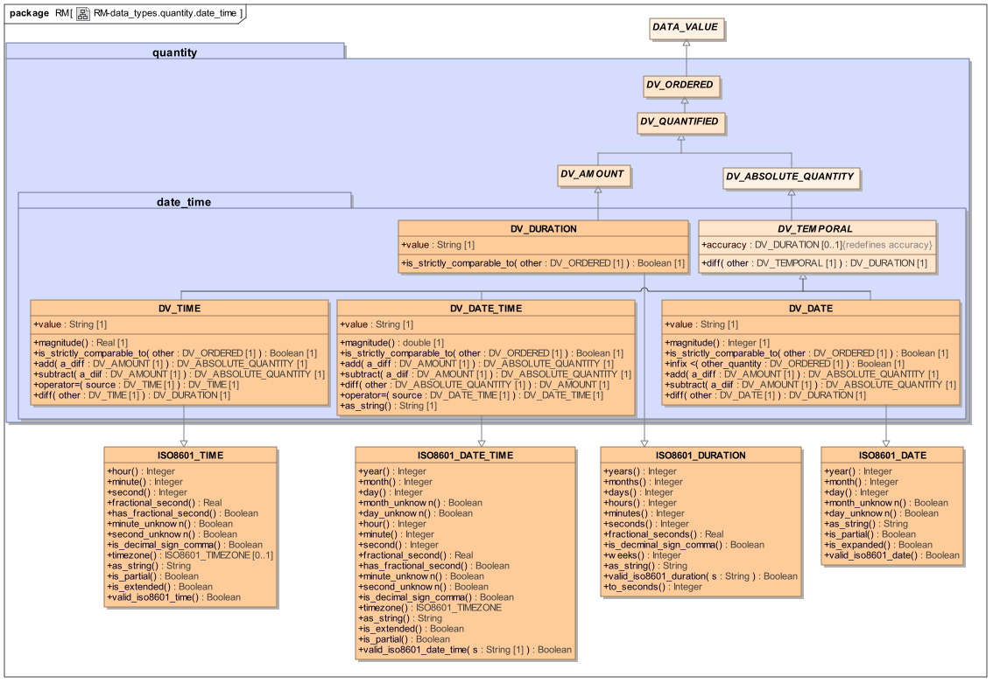

#### 7.1.1.要求

##### 标准日期/时间

基本要求是表示以下概念的类型：

- 日期：记录年，月和日的类型。例子包括出生日期，问题发生的日期

- 时间：记录小时，分钟，秒和时区的类型。示例包括进餐时间，问题再次出现的时间。在共享的EHR库中需要时区，使得在不同时区中发生的临床事件的时间是可比的;这包括可能在另一个国家进行的专门的病理学检查。

- Date_time：记录年，月，日，时，分，秒和时区的类型。示例包括死亡的日期和时间，任何观察的时间戳。与Time中相同的原因需要时区。

- 持续时间：记录事件或（活动）的持续时间的类型，如天，小时，分钟和秒。

##### 部分日期/时间

部分或不确定的日期/时间必须在临床医学中得到支持。患者常常不确定日期和持续时间。部分日期/时间的要求包括以下内容。

- 对于日期，以下规则之一适用于任何实例：

    - 只有一年是已知的

    - 只有年和月是已知的

    - 如果甚至不知道年，那么日期显然是非常近似的，并且它可能是不安全的，以计算方式来表示。然而，如果在这种情况下需要可计算表示，则可以使用日期间隔。一个违反这些规则的迂回示例是声称在“1934年5月初的星期一”出生的人（即日期，但不是日期未知）。或者临床医生确定1934年5月第一个星期一实际是什么日期，并记录（假设患者的准确记住的方式恰好是通过日而不是日期），否则记录“1934年5月”的部分日期在ISO 8601形式，“1934-05”），如果他们确定病人真的不确定。

- 有时不完整的时间被记录，其遵循相同的规则，小时或两者的小时和分钟存在。例子：

    - 由只生成hh：mm值（即没有秒）的仪器记录;

    - 记录事件大概时间的患者的记录;

    - 由在主管部门中使用大致时间的临床医生的记录，例如， “在上午8点服用胰岛素”真的意味着像8am +/- 30分钟。

- 不精确的持续时间（例如“2-3小时”）需要以可计算的形式进行记录。

为了满足健康记录记录的忠实性要求，应该总是能够记录由患者提供的基准的描述形式以及正式形式。

#### 7.1.2.设计

##### 一般方法

日期/时间值在数据类型领域有些特别，因为它们以“常规”形式表示，其中{value，unit}的标准结构和数量级的度量关系不成立。习惯形式是我们习惯在社会时间域中使用的，例如出生，死亡，年龄，以及我们记住的事件的时间和持续时间。在所有这些情况下，使用熟悉的年/月/日/时/分/秒系统来表示，其中每个连续时间单位之间的关系是非度量的。常规形式可以从原点开始转换为幅度，并且许多日期/时间库执行这种操作以便实现各种操作，特别是比较。

日期/时间类型分为两类：绝对和相对。绝对类别包括日期，日期/时间和时间概念，每个概念测量从已知来源的时间。日期和日期/时间从日期0001-01-01测量日历时间，而时间测量从午夜起的时钟时间。日期/时间和时间都可以包括时区信息，确保其实例正确位于同一时间轴上。所有绝对时间类型从DV_TEMPORAL类型继承，为diff（）函数提供适当的签名。

相对类别仅包含持续时间概念，其表示两个时间点之间的经过时间。 DV_DURATION类用于表示临床现象的持续时间和绝对时间之间的差异。

所有四个概念都在ISO 8601：2004标准中定义，相应地用作openEHR日期/时间类型的定义基础。

##### 部分日期/时间

本规范中定义的类型支持部分指定的日期和时间的概念。这里使用的建模方法考虑了表示部分日期/时间数据的已知需要，同时平衡这与需要避免不可理解的复杂类型，其通用性仅适用于很小百分比的困难情况。因此，对不完全日期/时间建模的基础如下。

- 建模问题仅涉及需要计算的日期/时间量。对于非常不精确的日期/时间，如果临床医生感到需要，她可以将其记录为叙述文本。

- 对于不精确的持续时间，应使用间隔，即DV_INTERVAL <DV_DURATION>。以这种方式，可以表示如“2-3小时”的持续时间，并且仍然是可计算的。

基于上述考虑，部分类型的要求通过ISO8601：2004的“精度降低”日期/时间的语义来满足，其中日期，时间或日期/时间的部分可能从右手端字符串。这模拟了合理的情况。日期可能在日期中未知，但日期不能具有未知的月份和日期。

##### 日历

对日历的评论是有序的。在本规范中，当前建模的所有日期/时间类型都是基于公历的。这是由ISO 8601做出的相同假设，以及当今世界许多地方的大多数技术计算系统。乍看起来，这似乎是一种文化上不敏感的方法，但事实上，在计算方面，对于格里高利和其他日历的用户来说是有意义的。朱利安，伊斯兰，巴哈伊等。试图使用此处定义的日期/时间类来表示任何日历的日期/时间的参数包括以下：

- 几乎所有在计算机系统上的日期，包括在使用替代日历的印度次大陆，土耳其和中东地区，都在格里高利系统中。这可能是一段时间的情况，并且可能总是这样，不管为宗教或其他目的（健康外）继续使用其他日历;

- 如果在日期数量中使用了日历指示器，则所有正确的软件都必须检查该值，以验证它是否在预期的日历系统中，并且如果不是，则执行特殊操作 - 添加成本可能的错误源，很少使用。现实是，在西方世界，印度等（可能除了开源软件）生产的大多数软件将自动承担公历，如果它确实收到包含日历从备用日历的EHR数据将是错误的。

- 如果/当EHR或相​​关系统中使用其他日历时，这些日历的用户将知道它，并且包括格雷戈里日期和他们自己之间的适当转换逻辑，限制额外的软件工作和质量问题给那些实际上需要替代日历。如果来自这些地方的EHR被发送到默认为格雷戈里安的医疗保健机构，则不需要特别确保这些记录包含接收者可理解的日期。

- 在一些其他日历中的日期/时间的详细模型与公历日历中的日期/时间的详细模型不同，因此它们将需要不同的类 - 这里定义的类不一定只是通过添加日历字段正确地正确地运行。

对于在EHR和其他卫生系统中需要非公历日期的用户，有两种方法。一个是将非格里高利日期视为本地化问题，在应用程序和GUI环境中处理。另一个是实际向openEHR日期/时间包中添加更多的同级包，为每个需要的新日历或日历组。转换算法最可能需要格里高利类型，以使得能够实现从不同应用或源得到的信息的互操作性。这种方法可能需要大量的建模工作。

算法用于在埃及，亚美尼亚，Khwarizmian，波斯，埃塞俄比亚，科普特，共和党，马其顿，叙利亚，朱利安罗马，格里高利亚，伊斯兰A，伊斯兰B，巴哈伊和萨卡日历之间转换由Richards [Richards_1998]关于DA Hatcher的工作（1986年）。

##### 表示

这里描述的所有日期/时间类都被定义为具有称为类型String的值的属性，以ISO 8601：2004字符串的形式。 ISO 8601为此目的是方便的，因为它是一个简单的语法，并且不仅涵盖这里描述的完全指定的日期/时间的所有四个变体，而且涵盖部分变体。 使用单个字符串属性可显着简化持久性以及映射到基于XML的形式主义，这种形式主要使用符合ISO 8601标准的日期/时间表示。 EHR假定的ISO 8601语义在类ISO8601_DATE，ISO8601_TIME，ISO8601_DATE_TIME，ISO8601_DURATION中找到的类中定义，来自rm.support.assumed_types包。 这些类继承到下面定义的相应类中。

### 7.2. 类描述

#### 7.2.1. DV_TEMPORAL类

<table>
	<tr>
		<td>类</td>
		<td colspan="2">DV_TEMPORAL（摘要）</td>
	</tr>
	<tr>
		<td>描述</td>
		<td colspan="2">差异类型为DV_DURATION的DV_ABSOLUTE_QUANTITY的专门时态变体。</td>
	</tr>
	<tr>
		<td>继承</td>
		<td colspan="2">DV_ABSOLUTE_QUANTITY</td>
	</tr>
	<tr>
		<td>属性</td>
		<td>签名</td>
		<td>含义</td>
	</tr>
	<tr>
		<td>0..1
（重新定义）</td>
		<td>准确度：DV_DURATION</td>
		<td></td>
	</tr>
	<tr>
		<td>功能</td>
		<td>签名</td>
		<td>含义</td>
	</tr>
	</tr>
	<tr>
		<td>（有效）</td>
		<td>diff（其他：DV_TEMPORAL）：DV_DURATION</td>
		<td>两个量的差。</td>
	</tr>
</table>

#### 7.2.2. DV_DATE类

<table>
	<tr>
		<td>类</td>
		<td colspan="2">DV_DATE</td>
	</tr>
	<tr>
		<td>描述</td>
		<td colspan="2">表示在公历上测量的绝对时间点，仅指定日期。由ISO 8601定义的语义。用于在真实世界时间中记录日期。部分形式用于近似出生日期，死亡日期等。</td>
	</tr>
	<tr>
		<td>继承</td>
		<td colspan="2">DV_TEMPORAL，ISO8601_DATE</td>
	</tr>
	<tr>
		<td>属性</td>
		<td>签名</td>
		<td>含义</td>
	</tr>
	<tr>
		<td>1..1</td>
		<td>value：String</td>
		<td>ISO8601日期字符串。</td>
	</tr>
	<tr>
		<td>功能</td>
		<td>签名</td>
		<td>含义</td>
	</tr>
	<tr>
		<td>（有效）</td>
		<td>magnitude：整数</td>
		<td>日期的数值，以日历起始日期0001-01-01为起的天数。</td>
	</tr>
	<tr>
		<td>（有效）</td>
		<td>is_strictly_comparable_to（other：DV_ORDERED）：Boolean</td>
		<td>测试两个实例是否严格可比。</td>
	</tr>
	<tr>
		<td>（有效）</td>
		<td>infix <（other_quantity：DV_ORDERED）：Boolean</td>
		<td>测试此日期是否早于引用日期。</td>
	</tr>
	<tr>
		<td>（有效）</td>
		<td>add（a_diff：DV_AMOUNT）：DV_ABSOLUTE_QUANTITY</td>
		<td>向此日期添加时间段。</td>
	</tr>
	<tr>
		<td>（有效）</td>
		<td>减去（a_diif：DV_AMOUNT）：DV_ABSOLUTE_QUANTITY</td>
		<td>从此日期中减去一个时间段。</td>
	</tr>
	<tr>
		<td>（有效）</td>
		<td>diff（其他：DV_DATE）：DV_DURATION</td>
		<td>两个量的差。</td>
	</tr>
	<tr>
		<td>不变</td>
		<td colspan="2">Value_valid：valid_iso8601_date（value）</td>
	</tr>
</table>

#### 7.2.3. DV_TIME类

<table>
	<tr>
		<td>类</td>
		<td colspan="2">DV_TIME</td>
	</tr>
	<tr>
		<td>描述</td>
		<td colspan="2">
<pre>
表示从原点开始的绝对时间点，通常被解释为指定当前日期的开始，指定为秒。 ISO 8601定义的语义。

用于记录真实世界时间，而不是科学地测量精细的时间量。部分形式用于事件和物质管理的大致时间。
</pre>
		</td>
	</tr>
	<tr>
		<td>继承</td>
		<td colspan="2">DV_TEMPORAL，ISO8601_TIME</td>
	</tr>
	<tr>
		<td>属性</td>
		<td>签名</td>
		<td>含义</td>
	</tr>
	<tr>
		<td>1..1</td>
		<td>value：String</td>
		<td>ISO8601时间字符串</td>
	</tr>
	<tr>
		<td>函数</td>
		<td>签名</td>
		<td>含义</td>
	</tr>
	<tr>
		<td></td>
		<td>operator =（source：DV_TIME）：DV_TIME</td>
		<td></td>
	</tr>
	<tr>
		<td>（有效）</td>
		<td>magtinude：Real</td>
		<td>时间的数值为从天开始的秒，即00:00:00.</td>
	</tr>
	<tr>
		<td>（有效）</td>
		<td>is_strictly_comparable_to（other：DV_ORDERED）：Boolean</td>
		<td>测试两个实例是否严格可比。</td>
	</tr>
	<tr>
		<td>（有效）</td>
		<td>add（a_diff：DV_AMOUNT）：DV_ABSOLUTE_QUANTITY</td>
		<td>为此时间添加时间段。</td>
	</tr>
	<tr>
		<td>（有效）</td>
		<td>减去（a_diif：DV_AMOUNT）：DV_ABSOLUTE_QUANTITY</td>
		<td>从此时间减去持续时间。</td>
	</tr>
	<tr>
		<td>（有效）</td>
		<td>diff（其他：DV_TIME）：DV_DURATION</td>
		<td>两个量的差。</td>
	</tr>
	<tr>
		<td>不变</td>
		<td colspan="2">Value_valid：valid_iso8601_time（value）</td>
	</tr>
</table>

#### 7.2.4. DV_DATE_TIME类别

<table>
	<tr>
		<td>类</td>
		<td colspan="2">DV_DATE_TIME</td>
	</tr>
	<tr>
		<td>描述</td>
		<td colspan="2">
<pre>
表示指定给秒的绝对时间点。 ISO 8601定义的语义。

用于在真实世界时间中记录精确点，并且用于近似时间戳。一个HISTORY的起源在一个只有部分已知的OBSERVATION。
</pre>
		</td>
	</tr>
	<tr>
		<td>继承</td>
		<td colspan="2">DV_TEMPORAL，ISO8601_DATE_TIME</td>
	</tr>
	<tr>
		<td>属性</td>
		<td>签名</td>
		<td>含义</td>
	</tr>
	<tr>
		<td>1..1</td>
		<td>value：String</td>
		<td>ISO8601日期/时间字符串。</td>
	</tr>
	<tr>
		<td>函数</td>
		<td>签名</td>
		<td>含义</td>
	</tr>
	<tr>
		<td></td>
		<td>operator =（source：DV_DATE_TIME）：DV_DATE_TIME</td>
		<td></td>
	</tr>
	<tr>
		<td>（有效）</td>
		<td>幅度：双</td>
		<td>日期/时间的数值为自日历原始日期/时间0001-01-01T00：00：00Z以来的秒数。</td>
	</tr>
	<tr>
		<td>（有效）</td>
		<td>is_strictly_comparable_to（other：DV_ORDERED）：Boolean</td>
		<td>测试两个实例是否严格可比。</td>
	</tr>
	<tr>
		<td>（有效）</td>
		<td>add（a_diff：DV_AMOUNT）：DV_ABSOLUTE_QUANTITY</td>
		<td>向此date_time添加一个时间段。</td>
	</tr>
	<tr>
		<td>（有效）</td>
		<td>减去（a_diif：DV_AMOUNT）：DV_ABSOLUTE_QUANTITY</td>
		<td>从此date_time中减去一个时间段。</td>
	</tr>
	<tr>
		<td>（有效）</td>
		<td>diff（其他：DV_ABSOLUTE_QUANTITY）：DV_AMOUNT</td>
		<td>两个量的差。</td>
	</tr>
	<tr>
		<td>（有效）</td>
		<td>as_string：String</td>
		<td></td>
	</tr>
	<tr>
		<td>不变</td>
		<td colspan="2">Value_valid：valid_iso8601_date_time（value）</td>
	</tr>
</table>

#### 7.2.5. DV_DURATION类别

<table>
	<tr>
		<td>类</td>
		<td colspan="2">DV_DURATION</td>
	</tr>
	<tr>
		<td>描述</td>
		<td colspan="2">
<pre>
表示相对于未指定的概念时间点的时间段。符号可以用于指示持续时间是向后的而不是向前。
注意
支持偏离ISO8601，允许W'指示符与其他指示符混合。请参阅支持IM中的假定类型部分。

用于记录现实世界中某物的持续时间，特别是当需要a）以习惯格式（即天，小时，分钟等）表示持续时间时，以及b）如果它将用于具有日期/时间量，即加法，减法等。

滥用：持续时间不能用于表示时间点或时间间隔。
</pre>
		</td>
	</tr>
	<tr>
		<td>继承</td>
		<td colspan="2">DV_AMOUNT，ISO8601_DURATION</td>
	</tr>
	<tr>
		<td>属性</td>
		<td>签名</td>
		<td>含义</td>
	</tr>
	<tr>
		<td>1..1</td>
		<td>value：String</td>
		<td>ISO8601持续字符串。</td>
	</tr>
	<tr>
		<td>函数</td>
		<td>签名</td>
		<td>含义</td>
	</tr>
	<tr>
		<td>（有效）</td>
		<td>is_strictly_comparable_to（other：DV_ORDERED）：Boolean</td>
		<td></td>
	</tr>
	<tr>
		<td>不变</td>
		<td colspan="2">Value_valid：valid_iso8601_duration（value）</td>
	</tr>
</table>

## 8.时间指定包

### 8.1.概述

时间规范是关于潜在性而不是现实，需要它自己的类型。 openEHR data_types.time_specification包根据相同名称的HL7类型提供了这样的类型，如下所示。

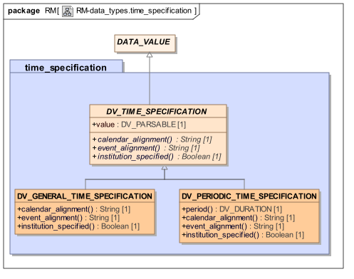

#### 8.1.1.要求

时间的困难之一是表达未来时间，因为潜在的事件，持续时间，重复不能以与实际时间相同的方式表示。使问题复杂化的是人类倾向于使用非常习惯的（即，卡兰达锚定的）指定时间的方式，例如“每隔一个星期二”或“每月的第一个星期日”。在临床医学中，未来时间最常用于表达何时想要进行药物或其他疗法。它们通常被锚定到日历，并且可以容易地包括重复。

与其他时间类型一样，有两种简单和复杂的情况要考虑。未来时间的最常见的例子是药物给药的时间，例如。 “每四小时一次”。这可以表示为简单的周期性规范，包括时间的起始点，周期和重复的次数。在葡萄糖试验期间获取血糖水平的规格可以表示为简单的非周期系列，例如， “.5小时，1小时，2小时”。然而，即使是处方的常见规格。 “一天三次，七天”开始变得相当复杂，例如，因为“一天三次”可能不是字面上相隔8小时。

在时序规范中要考虑的一些因素是：

- 重复期

- 指定的活动持续时间

- 可能与日历对齐，例如“每月5日”

- 可能与现实世界事件对准。 “吃完以后”

- 模糊性

因为时间本质上是“杂乱的”（月份不是都有相同的天数，闰年改变一些年份的天数等），并且因为我们与时间的关系也可以是任意的（例如锚定到餐馆等），正式指定语言上明显的规范是相当具有挑战性的。

#### 8.1.2.设计

用于时间规范的HL7版本3数据类型似乎允许所有必需的可能性。语法基于ISO 8601标准[ISO_8601]。它提供类型表达：

- 周期性间隔（HL7v3 - PIVL <T：TS>）允许指定周期，持续时间和日历链接。

- 事件关联的周期性间隔（HL7v3-EIVL <T：TS>） - 允许PIVL链接到像吃饭的现实世界事件。

- 一般定时规范（HL7v3-GTS） - 允许使用与一系列IVL <TS>（即DATE_TIME的间隔）等效的语法来表示任何时间规范。

时间规范的HL7语法封装在这里描述的等效openEHR类型中。

### 8.2.类描述

#### 8.2.1. DV_TIME_SPECIFICATION类

<table>
	<tr>
		<td>类</td>
		<td colspan="2">DV_TIME_SPECIFICATION（摘要）</td>
	</tr>
	<tr>
		<td>描述</td>
		<td colspan="2">这是一个抽象类，所有的时序规范都是专门化的。指定时间点，可能链接到日历，或真实世界重复事件，如早餐。</td>
	</tr>
	<tr>
		<td>继承</td>
		<td colspan="2">DATA_VALUE</td>
	</tr>
	<tr>
		<td>属性</td>
		<td>签名</td>
		<td>含义</td>
	</tr>
	<tr>
		<td>1..1</td>
		<td>值：DV_PARSABLE</td>
		<td>规范，在HL7v3语法中的PIVL或EIVL类型。</td>
	</tr>
	<tr>
		<td>函数</td>
		<td>签名</td>
		<td>含义</td>
	</tr>
	<tr>
		<td></td>
		<td>calendar_alignment：String</td>
		<td>指示日历中的规范与什么样的原型点对准，例如。本月5日。如果未对齐，则为空。从value'属性提取。</td>
	</tr>
	<tr>
		<td></td>
		<td>event_alignment：String</td>
		<td>指示规范与任何现有世界事件对齐。从value'属性提取。</td>
	</tr>
	<tr>
		<td></td>
		<td>institution_specified：Boolean</td>
		<td>指示规范是否与机构时间表一致。医院护理转换或用餐时间。从value'属性提取。</td>
	</tr>
	<tr>
		<td>不变</td>
		<td colspan="2"></td>
	</tr>
</table>

#### 8.2.2. DV_PERIODIC_TIME_SPECIFICATION类

<table>
	<tr>
		<td>类</td>
		<td colspan="2">DV_PERIODIC_TIME_SPECIFICATION</td>
	</tr>
	<tr>
		<td>描述</td>
		<td colspan="2">
<pre>
指定定期时间点，链接到日历（阶段链接）或真实世界重复事件，例如早餐（事件链接）。基于HL7v3数据类型PIVL <T>和EIVL <T>。

用于治疗处方，在openEHR模型中表示为INSTRUCTION。
</pre>
		</td>
	</tr>
	<tr>
		<td>继承</td>
		<td colspan="2">DV_TIME_SPECIFICATION</td>
	</tr>
	<tr>
		<td>函数</td>
		<td>签名</td>
		<td>含义</td>
	</tr>
	<tr>
		<td></td>
		<td>时间：DV_DURATION</td>
		<td>从语法表示计算地导出重复的周期。从value'属性提取。</td>
	</tr>
	<tr>
		<td>（有效）</td>
		<td>calendar_alignment：String</td>
		<td>从值中提取日历对齐。</td>
	</tr>
	<tr>
		<td>（有效）</td>
		<td>event_alignment：String</td>
		<td>从值中提取事件对齐。</td>
	</tr>
	<tr>
		<td>（有效）</td>
		<td>institution_specified：Boolean</td>
		<td>从值中提取。</td>
	</tr>
	<tr>
		<td>不变</td>
		<td colspan="2">Value_valid：value.formalism.is_equal（“HL7：PIVL”）或value.formalism。 is_equal（“HL7：EIVL”）</td>
	</tr>
</table>

8.2.3. DV_GENERAL_TIME_SPECIFICATION类

<table>
	<tr>
		<td>类</td>
		<td colspan="2">DV_GENERAL_TIME_SPECIFICATION</td>
	</tr>
	<tr>
		<td>描述</td>
		<td colspan="2">指定通用语法中的时间点。基于HL7v3 GTS数据类型。</td>
	</tr>
	<tr>
		<td>继承</td>
		<td colspan="2">DV_TIME_SPECIFICATION</td>
	</tr>
	<tr>
		<td>函数</td>
		<td>签名</td>
		<td>含义</td>
	</tr>
	<tr>
		<td>（有效）</td>
		<td>calendar_alignment：String</td>
		<td>从值中提取日历对齐。</td>
	</tr>
	<tr>
		<td>（有效）</td>
		<td>event_alignment：String</td>
		<td>从值中提取事件对齐。</td>
	</tr>
	<tr>
		<td>（有效）</td>
		<td>institution_specified：Boolean</td>
		<td>从值中提取。</td>
	</tr>
</table>

### 8.3.语法

#### 8.3.1.相位时间指定语法

相位连接的周期性时间规格（从PIVL T规范HL7v3选票中导出）的句法形式如下。

	“[”interval“]”“/”“（”difference“）”[“@”alignment] [“IST”]

示例包括：

	* [200004181100; 200004181110] /（7d）@DW =每个星期二从11:00到11:10 AM。
	* [200004181100; 200004181110] /（1mo）@DM“=每月的18日11:00到11:10 AM。

解析规范如下：

	phase_linked_time_spec = pure_phase_linked_time_spec [“IST”];
	pure_phase_linked_time_spec = phase [“@”alignment];
	phase = interval“/”“（”difference“）”;
	alignment =“DW”|等等; （*来自“HL7 :: CalendarCycle”域*的术语）
	difference =; （* ISO 8601时差*）
	interval =“[”interval_spec“]”;
	interval_spec =“;” | “;” date_time |约会时间 ”;” date_time |约会时间 ”;” ;
	date_time =（* ISO 8601日期/时间字符串yyyymmdd [hh [mm [ss]]] *）;

#### 8.3.2.事件链接的周期时间规范语法

事件链接周期时间规范的示例包括：

- “PC + [1h; 1h]”=餐后一小时

- “HS- [50分钟; 1小时] =睡前1小时，持续10分钟

以下解析规范定义了事件相关的周期性时间规范的语法。

	event_linked_time_spec = event |事件偏移;
	event =“AC”| “ACD”|等等; （* HL7域“HL7 :: TimingEvent”*）
	offset =（“+”|“ - ”）dur_interval;
	dur_interval =; （* ISO 8601持续时间间隔*）

#### 8.3.3.一般时间规范语法

该类在结构上与DV_TIME_SPECIFICATION父类相同。语法是由以下解析规范定义的HL7 GTS语法：

	general_time_spec = symbol | union |排除;
	union = intersection [“;”联合]
	排除=排除“\”交集;
	交叉=因子交叉|因子;
	hull = factor [“..”hull];
	factor = interval | phase_linked_time_spec | event_linked_time_spec | “（”general_time_spec“）”;

## 9.封装包装

### 9.1.概述

data_types.encapsulated包包含表示其内部结构在EHR模型外部定义的数据值的类，例如多媒体和可解析数据。如下图所示。

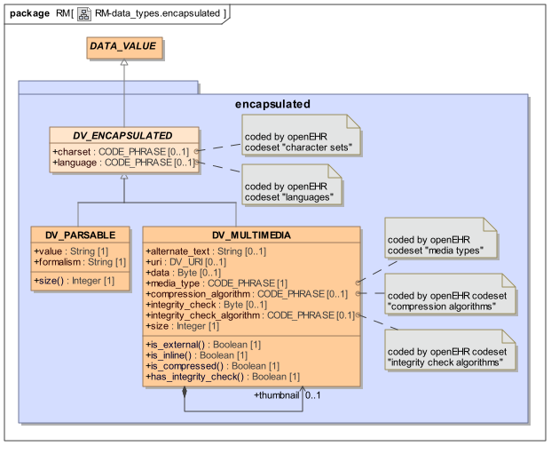

#### 9.1.1.要求

需要能够在EHR中包括内容，其内部结构未在EHR参考模型中建模，而是由用于特定工具的足够元数据属性记录以处理数据。此类别中的内容类型如下。

- 图像，包括图像本身是来自存储在别处的高分辨率图像集合的一个图像的压缩版本。这样的图像可以是任何公知的压缩或未压缩格式，并且可以附加其自己的缩略图图像以便于网络浏览。

- 生物信号数据系列，例如表示ECG迹线的诊断部分的一组值。这可能表示为DICOM内容。

- 内容是文本的（或接近这样），它本质上是某种类型的可解析语言文件。这包括所有XML实例，HTML和任何其他以语法形式表示的EHR内容，例如在数量中使用的单位字符串。形式主义的名称应该存储为元数据。

- 由工作处理器或其他专用工具处理的二进制内容。

- 数字签名。

足够的元数据必须包括在所有这些类型中以使得能够处理内容的方式，通常通过指示其类型（例如“jpeg”，“word文档”）或可以使用的工具的名称处理它。重要的元数据包括：

- 内容大小;

- 自然语言（如果有）。

任何封装的数据项可以是在某些其他系统或文件系统中在EHR外部发现的原始内容项的摘要，“缩略图”或以其他方式缩减的形式。校验和必须能够表示具有校验和的那些项目，或者系统生成校验和以提高其内部数据传输的质量。

#### 9.1.2.设计

这里使用的设计方法基于以下分析。

- 任何封装的数据项可以是某种特定语言，即使它是图像或其他图形形式，例如具有特定语言的轴标记的生物信号;

- 封装的内容数据项的一般结构包括表示内容的字节或字符块以及适当的各种元数据，包括：

    - 尺寸

    - 字符编码

    - 压缩类型/算法

    - 可解析内容的形式主义的名称

- 对于在另一个系统中具有对应物的封装项目，便携式地址的标准手段是W3C URI;

- 对于具有相关联的完整性校验和的项目，校验和本身是一系列字节，并且还必须指定校验和的类型。 “md5”。

这些观察结果自然地导致了抽象的DV_ENCAPSULATED类，对于所有内容来说，具有两个子类型DV_PARSABLE，对于所有内容，其本质上是句法性的，对于其他所有内容是DV_MULTIMEDIA。注意，可以想象可解析的内容项目，其大，以压缩形式存储，并且本身是网络上其他地方的另一项目的摘要;这样的项目可以出于实际目的被表示为DV_MULTIMEDIA的实例，而不是DV_PARSABLE。绝大多数可解析的封装数据被期望是短的并且以本地文本形式存储。 XML或HTML的片段。

类DV_ENCAPSULATED和DV_MULTIMEDIA的形式模型紧密地基于来自HL7v3数据类型规范的ED类型。

### 9.2.类描述

#### 9.2.1. DV_ENCAPSULATED类

<table>
	<tr>
		<td>类</td>
		<td colspan="2">DV_ENCAPSULATED（摘要）</td>
	</tr>
	<tr>
		<td>描述</td>
		<td colspan="2">抽象类定义所有类型的封装数据的公共元数据。</td>
	</tr>
	<tr>
		<td>继承</td>
		<td colspan="2">DATA_VALUE</td>
	</tr>
	<tr>
		<td>属性</td>
		<td>签名</td>
		<td>含义</td>
	</tr>
	<tr>
		<td>0..1</td>
		<td>字符集：CODE_PHRASE</td>
		<td>对此值进行编码的字符编码方案的名称。从openEHR代码设置字符集编码。 Unicode是openEHR中的默认假设，UTF-8是假定的编码。此属性允许从这些假设的变化。</td>
	</tr>
	<tr>
		<td>0..1</td>
		<td>语言：CODE_PHRASE</td>
		<td>如果相关，写入数据的本地化语言的可选指示器。从openEHR代码集语言编码。</td>
	</tr>
	<tr>
		<td>不变</td>
		<td colspan="2"&gt;Language_valid：language / = Void意味着code_set（Code_set_id_languages）.has_code（language）</td>
	</tr>
	<tr>
		<td></td>
		<td colspan="2">Charset_valid：charset / = Void意味着code_set（Code_set_id_character_sets）.has_code（charset）</td>
	</tr>
</table>

#### 9.2.2. DV_MULTIMEDIA类

<table>
	<tr>
		<td>类</td>
		<td colspan="2">DV_MULTIMEDIA</td>
	</tr>
	<tr>
		<td>描述</td>
		<td colspan="2">DV_ENCAPSULATED专门用于视听和生物信号类型。包括与多媒体类型相关的其他元数据，这些元数据不适用于DV_ENCAPSULATED的其他子类型。</td>
	</tr>
	<tr>
		<td>继承</td>
		<td colspan="2">DV_ENCAPSULATED</td>
	</tr>
	<tr>
		<td>属性</td>
		<td>签名</td>
		<td>含义</td>
	</tr>
	<tr>
		<td>0..1</td>
		<td>alternate_text：字符串</td>
		<td>要显示的文本，而不是多媒体显示/重放。</td>
	</tr>
	<tr>
		<td>0..1</td>
		<td>uri：DV_URI</td>
		<td>对存储在记录之外的电子信息的URI引用作为文件，数据库条目等，如果提供作为参考。</td>
	</tr>
	<tr>
		<td>0..1</td>
		<td>数据：字节</td>
		<td>在uri找到的实际数据（如果提供内联）。</td>
	</tr>
	<tr>
		<td>1..1</td>
		<td>media_type：CODE_PHRASE</td>
		<td>由openEHR代码集媒体类型（IANA MIME类型代码集的接口）编码的数据媒体类型。</td>
	</tr>
	<tr>
		<td>0..1</td>
		<td>compression_algorithm：CODE_PHRASE</td>
		<td>压缩类型，来自openEHR完整性检查代码集的编码值。空隙意味着没有压缩。</td>
	</tr>
	<tr>
		<td>0..1</td>
		<td>integrity_check：字节</td>
		<td>二进制密码完整性校验和。</td>
	</tr>
	<tr>
		<td>0..1</td>
		<td>integrity_check_algorithm：List <CODE_PHRASE></td>
		<td>完整性检查类型，来自openEHR完整性检查代码集的编码值。</td>
	</tr>
	<tr>
		<td>0..1</td>
		<td>缩略图：DV_MULTIMEDIA</td>
		<td>此项目的缩略图（如果存在）;主要用于图形格式。</td>
	</tr>
	<tr>
		<td>1..1</td>
		<td>size：Integer</td>
		<td>未编码的封装数据的原始大小（以字节为单位）。也就是说编码（如base64，十六进制等）不会更改此属性的值。</td>
	</tr>
	<tr>
		<td>函数</td>
		<td>签名</td>
		<td>含义</td>
	</tr>
	<tr>
		<td></td>
		<td>is_external：Boolean</td>
		<td>从uri属性的值计算：如果数据存储在记录外部，则为true，如`uri'所示。副本也可以在内部存储，在这种情况下`is_expanded'也是true。</td>
	</tr>
	<tr>
		<td></td>
		<td>is_inline：Boolean</td>
		<td>从数据属性的值计算。如果数据以扩展形式存储，即在EHR本身内存储，则为真。</td>
	</tr>
	<tr>
		<td></td>
		<td>is_compressed：Boolean</td>
		<td>从compression_algorithm属性的值计算：如果数据以压缩形式存储，则为True。</td>
	</tr>
	<tr>
		<td></td>
		<td>has_integrity_check：Boolean</td>
		<td>从integrity_check_algorithm属性的值计算：如果已计算完整性检查，则为True。</td>
	</tr>
	<tr>
		<td>不变</td>
		<td colspan="2">Not_empty：is_inline或is_external</td>
	</tr>
	<tr>
		<td></td>
		<td colspan="2">Media_type_valid：media_type / = Void，然后是code_set（Code_set_id_media_types）.has_code（media_type）</td>
	</tr>
	<tr>
		<td></td>
		<td colspan="2">Compression_algorithm_validity：compression_algorithm / = Void意味着code_set（Code_set_id_compression_algorithms）.has_code（compression_algorithm）</td>
	</tr>
	<tr>
		<td></td>
		<td colspan="2">Integrity_check_validity：integrity_check / = Void意味着integrity_check_algorithm / = Void</td>
	</tr>
	<tr>
		<td></td>
		<td colspan="2">Integrity_check_algorithm_validity：integrity_check_algorithm / = Void意味着code_set（Code_set_id_integrity_check_algorithms）.has_code（integrity_check_algorithm）</td>
	</tr>
	<tr>
		<td></td>
		<td colspan="2">Size_valid：size> = 0</td>
	</tr>
</table>

#### 9.2.3. DV_PARSABLE类

<table>
	<tr>
		<td>类</td>
		<td colspan="2">DV_PARSABLE</td>
	</tr>
	<tr>
		<td>描述</td>
		<td colspan="2">封装数据表示为可解析字符串。在openEHR模型中没有描述与其他封装类型相同的数据项的内部模型，但是在这种情况下，数据的形式被假定为纯文本，而不是压缩的或其他类型的大二进制数据。</td>
	</tr>
	<tr>
		<td>继承</td>
		<td colspan="2">DV_ENCAPSULATED</td>
	</tr>
	<tr>
		<td>属性</td>
		<td>签名</td>
		<td>含义</td>
	</tr>
	<tr>
		<td>1..1</td>
		<td>value：String</td>
		<td>字符串，在某些语法中可能有效地为空。</td>
	</tr>
	<tr>
		<td>1..1</td>
		<td>形式主义：字符串</td>
		<td>形式主义的名称，例如。 GLIF 1.0，Proforma等</td>
	</tr>
	<tr>
		<td>函数</td>
		<td>签名</td>
		<td>含义</td>
	</tr>
	<tr>
		<td></td>
		<td>size：Integer</td>
		<td>值的字节大小。</td>
	</tr>
	<tr>
		<td>不变</td>
		<td colspan="2">Formalism_valid：not formalism.is_empty</td>
	</tr>
	<tr>
		<td></td>
		<td colspan="2">Size_valid：size> = 0</td>
	</tr>
</table>

## 10. Uri包
### 10.1.概述

data_types.uri包包含两种用于引用信息资源的类型。 DV_URI类型允许创建对万维网上对象的引用的数据值。其专业化，DV_EHR_URI，使得openEHR记录中的任何元素能够以与网络上的其他对象相同的方式被识别。 DV_EHR_URI类型是方便的，因为它是一个字符串，像任何其他URI，因此很容易可移植和可处理。因为它有自己的方案空间“ehr”，实例可以是全球唯一的，只要EHR标识是全球唯一的。 DV_EHR_URIs用于表示EHR中的所有运行时路径。 uri包如下所示。

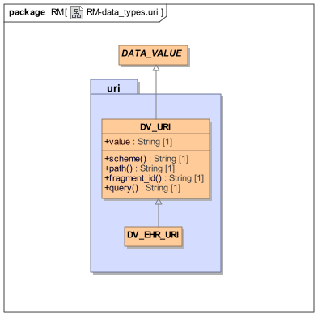

#### 10.1.1.要求

此包满足表示W3C统一资源标识符（URI）的DATA_VALUE子类型的要求。可以使用的一个常见示例是表示对与EHR中记录的干预或治疗计划相关联的临床指南或其他合理文档的引用。

URI是统一资源定位符（URL）的超集（尽管两者经常被混淆，甚至在W3C内），并且可以用于指定任何信息项的位置，而不管其类型，位置或存储方法，长因为对于该类型的信息存在URI“方案”。

对于可以指向EHR数据项（在包含链接的相同EHR内）或在另一EHR中的一种URI的附加要求。这是实现LINK类型的基础。

#### 10.1.2.设计

使用简单的设计方法，其中URI被表示为字符串，并且定义适当的函数以根据由Tim Berners-Lee [rfc_3986]定义的URI的语法来提取各个部分。定义了EHR特定子类型，其方案是“ehr”，并且其包含使得类型的实例能够记录它们所指的什么样的对象的其他属性。

### 10.2.定义

以下符号定义用于下面的类中。

- Ehr_scheme：String =“ehr”

### 10.3.类描述

#### 10.3.1. DV_URI类

<table>
	<tr>
		<td>类</td>
		<td colspan="2">DV_URI</td>
	</tr>
	<tr>
		<td>描述</td>
		<td colspan="2">对符合统一资源标识符（URI）标准的对象的引用。参见Tim Berners-Lee的“Universal Resource Identifiers in WWW”，http：//www.ietf.org/rfc/rfc3986.txt。这是一个用于全局资源识别的万维网RFC。有关URI的起点，请参阅http://www.w3.org/Addressing。</td>
	</tr>
	<tr>
		<td>继承</td>
		<td colspan="2">DATA_VALUE</td>
	</tr>
	<tr>
		<td>属性</td>
		<td>签名</td>
		<td>含义</td>
	</tr>
	<tr>
		<td>1..1</td>
		<td>value：String</td>
		<td>URI的值作为字符串。</td>
	</tr>
	<tr>
		<td>函数</td>
		<td>签名</td>
		<td>含义</td>
	</tr>
	<tr>
		<td></td>
		<td>scheme：String</td>
		<td>存在信息对象的分布式信息“空间”。该方案同时指定信息空间和用于访问该空间中的对象的机制。例如，如果scheme =“ftp”，它标识所有ftpable对象存在的信息空间，以及应用程序 - ftp - 可用于访问它们。值可以包括：“ftp”，“telnet”，“mailto”，“gopher”等等。有关完整列表，请参阅WWW URI RFC。在URI规范中可以容纳新的信息空间。</td>
	</tr>
	<tr>
		<td></td>
		<td>path：String</td>
		<td>一个字符串，其格式是方案的函数。标识信息实体的<scheme> -space中的位置。典型值包括任何机器的分层目录路径。例如，对于scheme =“ftp”，路径可能是/ pub / images / image_01.字符串“”。和“..”保留用于路径。路径可以包括形式为：sub_domain ... domain的互联网/内部网位置标识符，例如“info.cern.ch</td>
	</tr>
	<tr>
		<td></td>
		<td>fragment_id：String</td>
		<td>对象中的一部分，片段或子函数。允许引用对象的子部分，例如文本对象中的某一行和字符位置。语法和语义由负责对象的应用程序定义。</td>
	</tr>
	<tr>
		<td></td>
		<td>query：String</td>
		<td>要发送到应用程序的查询字符串由方案和路径隐含。启用对应用程序的查询，包括要包括在URI中的数据库。支持对服务器有意义的任何查询，包括SQL。</td>
	</tr>

	<tr>
		<td>不变</td>
		<td colspan="2">Value_valid：not value.is_empty</td>
	</tr>
</table>

10.3.2. DV_EHR_URI类

<table>
	<tr>
		<td>类</td>
		<td colspan="2">DV_EHR_URI</td>
	</tr>
	<tr>
		<td>描述</td>
		<td colspan="2">
<pre>
DV_EHR_URI是具有方案名称“ehr”的DV_URI，并且其仅可以引用EHR中的项目。

用于引用EHR中的项目，其可能与当前EHR（包含此链接）或其他EHR相同。
</pre>
		</td>
	</tr>
	<tr>
		<td>继承</td>
		<td colspan="2">DV_URI</td>
	</tr>
	<tr>
		<td>不变</td>
		<td colspan="2">Scheme_valid：scheme.is_equal（Ehr_scheme）</td>
	</tr>
</table>

### 10.4.语法

#### 10.4.1 DV_EHR_URI语法

DV_EHR_URI的语法是一个openEHR路径，在'ehr'URI方案空间内，并且具有以下形式：

	ehr：// system_id / ehr_id / top_level_structure_locator / path_inside_top_level_structure

该语法在openEHR体系结构概述中有更详细的描述。 DV_EHR_URIs用作在EHR中引用的机制，确保人类的可读性，以及当提取在其他地方传输时的有效性：即使路径的目标不存在，路径也可用于按需定位缺失的项目的值。

## 11.实施战略

### 11.1.概述

本节指出了将openEHR数据类型映射到编程语言和XML等实现技术的一些常见挑战。对于具体指南，应咨询每个目标形式主义的实施技术规范（ITS）文件。

### 11.2.数量和有序_数字

在数量包中，显示具有类型为Ordered_numeric的抽象属性的类型DV_QUANTIFIED。这旨在表示类型DV_QUANTIFIED通过幅度属性（相比于说DV_ORDERED，其描述了没有幅度的有序事物）来区分。类型Ordered_numeric在实现技术中映射到各种类型，如下所示：

- Java：java.lang.Number

- C＃：System.IComparable

- Eiffel：NUMERIC

所有这些类型的系统当前都没有具有“有序”（具有函数“<”）和“数字”（具有函数'+'，' - '，'*'，' '），但在实践中并不重要。对于不具有数字具体类型Real，Integer，Double的方便超类型的类型系统，幅度属性可以安全地留在DV_QUANTIFIED之外;唯一的缺点是代码不能多边形调用DV_QUANTIFIED.magnitude，例如。在统计应用程序中处理DV_QUANTITY和DV_COUNT个对象。

### 11.3. Unicode

在不同的语言中以不同的方式支持Unicode。在Java中，从JDK 1.1开始，unicode支持在基类中是隐含的。从文档：

	类java.io.InputStreamReader，java.io.OutputStreamWriter和
	java.lang.String可以在Unicode和其他字符之间进行转换
	编码。更多信息，请访问：
	http://java.sun.com/j2se/1.3/docs/guide/intl/encoding.doc.html。

在C＃语言中，可以使用系统在Unicode和其他代码页之间进行转换。 Text.UnicodeEncoding（用于UTF-16）和System.Text.UTF8Encoding（用于UTF-8）类。

在XML中，unicode是通过在XML声明中指定文档的编码来处理的。 <？xml version =“1.0”encoding =“UTF-16”？>。

在Eiffel语言中，unicode可以在Gobo公共域库（见http://www.gobosoft.com）的UC_STRING类中，它继承自String类。在其他语言的支持不同，可能需要一个特殊的类型，如在埃菲尔使用的UC_STRING。

### 11.4.日期和时间

在某些形式上，日期和时间使用单个日历类来表示。从规范的角度来看，这不被认为是良好的实践，因为更难以为用于表示特定逻辑类型（例如DATE或TIME）的类描述适当的不变量，然而，其在实现中的实用性被识别。

当实现者想要使用这样的类（为了讨论在此称为CALENDAR），推荐的方法是用表示本说明书中描述的类型的类包装类CALENDAR，即DATE等。这使得能够添加任何必要的功能在包装器中，例如，用于序列化和反序列化XML。

## 附录A：与HL7v3类型的比较

### A.1.范围

一些HL7v3类型不在openEHR中建模。 OpenEHR假设存在于任何实现技术的底层类型系统中的HL7v3 V3DT类型包括：

- 整数（INT）

- 真实（REAL）

- 设置（SET）

- 列表（LIST）

- 袋（BAG）

在这里没有建模的HL7v3类型，因为它们对于具体建模几乎总是太易变，并且可以使用原型的通用信息结构来创建，如下所示（即使在HL7中，它们实际上是数据结构，而不是数据类型）：

- 邮政地址（AD）

- 实体名称（EN）

- 人名（PN）

- 组织名称（ON）

- 平凡名称（TN）

这些类型都是通过openEHR中的原型空间数据结构（相当于CDA规范中的结构的子类型）来建模的。可能需要在未来建模的HL7v3类型包括：

- 不确定值概率（UVP）

- 非参数概率分布（NPPD）

- 参数概率分布（PPD）

由openEHR提供但不由HL7直接支持的类型包括：

- 状态变量（DV_STATE）;

- 序数值（DV_ORDINAL）;

- 显式部分日期和时间类型（DV_DATE，DV_TIME）;

- 显式持续时间（DV_DURATION）。

后两个类别中的类型可以用TS（时间戳）类型来实现。

### A2.设计差异

openEHR数据类型和HL7v3数据类型之间的设计方法存在一些显着差异，如以下各节所述。

#### A.2.1.命名

HL7规范中的所有类型都有两个名称，一个短和一个长。例如，表示物理量的类型被称为“PhysicalQuantity”和“PQ”。虽然短名称对于常用类型可能是合理的，但是一些名称不明显。 “EN”，“ON”，“TN”，“NPPD”等。短名称对于绘图工具如Rational Rose或其他UML工具肯定有好处，然而，正式模型是否应该包括这种工具的视觉外观的基础（可能会认为这样的工具应该提供别名的视觉目的，而不改变实际模型）。另一个问题是UML不包括类名别名的概念，大多数编程语言也不包括。

openEHR模型只为每个类使用一个名称。

#### A.2.2.识别

HL7 V3DT包括类型II，UID，OID和UUID。 II类型被声明为用于识别所有类型的实体，其在这里被分类为真实世界实体（“RWE”）（诸如人，车辆登记，发票）和信息实体（“IE”是表示计算机系统中的RWE的数据的快照。 RWE识别方案的一个问题是一些是已知的（例如社会安全号码）以产生可疑的标识符或其中多个RWE具有相同的标识符或根本没有标识符的情况。相反，通过良好控制和国际上认可的发布/生成信息系统标识符（例如GUID，ISO OID）的方式，认为这样的标识符可以变得可靠，并且实际上与它们预期的IE对应1：1.然而，IE的一个问题是，在时间上通常存在重复和多个版本，每个意图表示相同的RWE（诸如特定的人，观察或组成）。

就目前可以确定的是，没有考虑IE和RWE的存在的标准分析，并且认识到多个版本和/或副本可以指代相同RWE的事实。

在openEHR中关于标识符采取的方法目前如下。

- RWE标识符（例如社会安全号码，许可证号等）使用类型DV_IDENTIFIER建模，该类型具有以下属性：

    - issuer：String

    - id：String

    - type：String上面列出的属性与HL7 II类型几乎相同，表明这两种类型可能兼容。

- 使用类型OBJECT_ID来完成IE的标识，类型OBJECT_ID不是数据类型，并记录在支持信息模型中。 OBJECT_ID类型考虑了通过添加版本标识符（假定为时间戳）可能存在指向相同的底层RWE的多个IE的事实。

#### A.2.3.原型

openEHR数据类型是在基于原型的系统的假设下定义的。虽然他们在没有什么关于原型的系统中工作得很好，但是一些类型没有被定义，因为从更基本的实体构建的可构造结构而不是具体建模的数据类型。这些包括在HL7v3和CEN 13606中找到的地址和人名的“类型”。

#### A.2.4.内置类型的处理

HL7v3数据类型没有对大多数对象和关系形式化内置的类型的存在做出任何假设，例如基本类型String，Integer，Boolean，Real，Double和泛型类型Set <T>，Bag <T>和Array <T>。因此，类型ST，INT，REAL，BL，SET <T>，BAG <T>等由HL7重新定义。这种方法的假设的优点是，HL7系统中所有类型的语义，直到原子数据项在定义中是自包含的，并且不依赖于外部语义。这种方法的可能的问题包括以下。

- HL7定义偏离了基本数据类型的OMG IDL和ISO 11404定义，这可能导致在典型开发技术（面向对象和关系）中进行的软件开发和数据处理中出现意想不到的问题。

- HL7类型INT和REAL被定义为QTY类型的子类型，这种关系在这些类型的任何面向对象的形式主义中都不存在（特别是，对于类型叫Qty的类型，没有一种叫做Integer或Real的类型的可替换性内置到任何对象语言）。 INT和REAL的定义也不同于大多数对象形式化中的定义。这可能会导致实现的一些困难。

- 二进制数据类型BIN表示为List <BL>（其中每个项目可以是True，False，null），而在大多数软件中通常预期为类似于Array <Octet>（即字节数组）环境。在将其定义为List <BL>时似乎没有任何实用程序，因为二进制数据几乎没有异常地被表示和处理为连续的机器字节数组。

- 字符串类型ST从封装数据类型ED继承，继而从二进制数据类型BIN继承。其结果是ST的实例包含与多媒体数据相关的许多数据属性，并且该内容可能被表示为List <BL>。这是与计算机科学中的字符串的标准理解的主要背离，这通常是简单的字符数组。

- 由于空标记方法（见下文），HL7布尔类型BL是一个三值逻辑类型，而不是在编程语言中的布尔概念中找到的通常的两值类型。 INT和REAL也是如此：由于空标记设计，“null”是整数或实数以及真实整数和实数值的可能返回值。

一般来说，如果HL7中的同名类型和编程语言之类的底层形式主义存在差异，在实现中可能会有一些混乱。此外，如何处理包含在基本类型的标准规范中没有使用的大量（有时是递归）字段的基本类型的实例可能存在混淆。关于内置类型的openEHR方法仅假定在主流面向对象编程语言中找到的那些类型，特别是诸如OMG IDL和XML的定义形式主义。虽然这意味着在理论上对这些类型的控制比在HL7方法中更少，所涉及的类型的数量是非常小的，并且与对象形式化的基本类型的绑定的问题是很好理解的。另外，由于认识到由openEHR定义的一些数据类型可能与在一些语言和库中找到的类型冲突，所有数据类型类名称以“DV_”开头，以避免命名混淆，并允许openEHR类型的实现，与现有类型在实现形式主义中存在。

#### A.2.5.使用空标记

所有HL7数据类型都从ANY类（等同于openEHR中的DATA_VALUE类）继承，该类包含属性：

	BL非空;
	CS nullFlavor
	BL isNull;

这些属性的目的是指示数据是否为空，以及为什么原因。由于一些数据类型类也显示为其他数据类型的属性，Null标记还指示数据的任何部分是否为空。因此，在下面所示的类间隔<T>中，所有属性都有包含空标记的可能性。

	type Interval<T> alias IVL<T> extends Set<T>
	{
	    T low;
	    BL lowClosed;
	    T high;
	    BL highClosed;
	    T.diff width;
	    T center;
	    IVL<T> hull(IVL<T> x);
	    literal ST;
	    promotion IVL<T> (T x);
	    demotion T;
	};

例如，这允许具有缺失的末端和宽度的间隔作为结构化类型存在。该方法的结果是整个模型本质上是“部分”数据类型的模型;任何属性和任何函数调用都可能返回Null值，以及其类型的真实值（实际上，在规范中，Null值被定义为所有数据类型的有效值）。这种设计决定是在HL7中进行的，因此任何数据，无论多么未知，都将以与完全已知的数据相同的方式在结构上表示，使其能够以与所有其他类型的实例相同的方式进行处理。

然而，一种重要的面向对象的设计原则在这种方法中已被忽略。在类的正确设计中，规定了属性和类不变量。不变量是描述类的实例的正确性条件的语句;一般规则是类的创建例程（构造器）的后置条件必须满足不变量。例如，HL7 IVL类的不变量可以是：

	(exists(low) and exists(high)) or else
	(exists(low) and exists(width)) or else
	(exists(width) and exists(high))

当创建这个类的实例时，这个条件应该被满足，并且在实例的生命中保持满足。否则就是创建数据的实例，其他软件可以不做任何假设，并被迫检查每个字段，然后确定以自组织方式做什么。 （关于不变概念的详细解释，参见[Meyer_OOSC2] p366，[Booch_1994] p43，[Kilov_1994] p29）。内置Null标记设计方法的可能后果包括：

- 因为即使HL7的基本类型ST，INT，REAL，LIST <>，SET <>包括空标记，空值的处理将在最低级别上是普遍的;

- 软件将更复杂，数据类型的实现和处理它们的软件。这是因为软件总是必须处理调用例程和返回Null值的属性的可能性。迄今为止，大多数临床信息系统采用的方法是，如果完全已知，则将基准表示为正式类型的实例，或者如果仅部分则表示为叙述性文本;

- 数据可能不总是可安全地处理，因为一些软件可能不能正确地处理与部分已知数据项的属性相关联的空值。基本上，处理数据的所有软件必须是“空值感知”，并且不对任何特定数据实例是否有效做任何假设。

HL7数据类型模型与诸如CEN，GEHR和openEHR中使用的更简单的方法形成对比，其中数据类型是类型的形式模型，例如Coded_term，Quantity等。不是在数据类型中的每个属性和类中构建空标记的可能性，而是在相关的包含类中定义单个空标记。该决定基于数据类型应该独立于其使用上下文来定义的原则。因此，在将数据类型用作数据值（例如在来自openEHR EHR参考模型的类ELEMENT的值属性中）时，还定义并行特征is_null和null_flavour。但是，如果数据类型在模型中的其他位置显示为属性，并且它们不可能为空，则不使用空标记。下图显示了两种方法之间的差异。

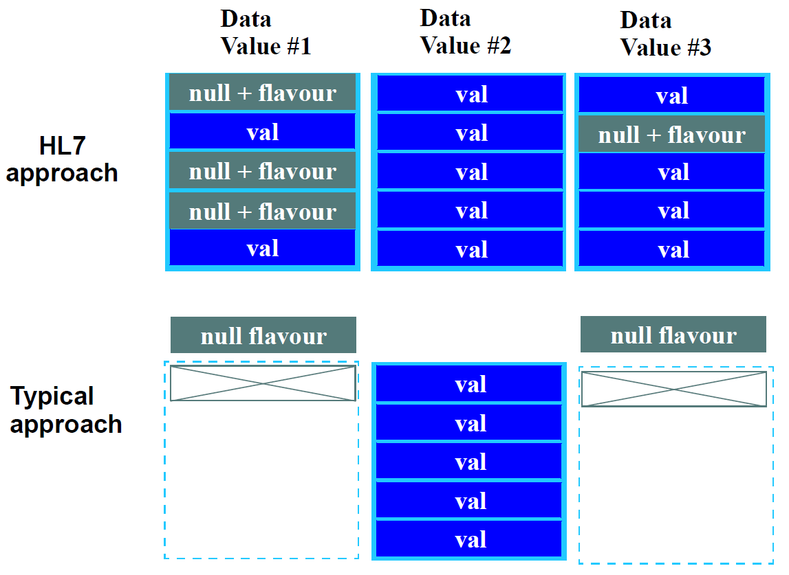

标准软件工程方法的后果包括：

- 数据类型可以更容易地被正式指定，因为不变量，属性和操作的语义不需要包括空值的可能性;

- 软件实现更简单;

- 数据总是保证可以安全地处理决策支持和一般查询，因为如果数据非常不可靠，则不会首先创建正式类型的实例;

- 空标记只出现在他们是相关的模型中，而不是使用数据类型;

- 然而，openEHR数据类型不会自动处理缺失或未知的内部属性值（例如，间隔，部分日期等缺少高值和低值）。

为了处理最后的可能性，在openEHR中使用了各种方法：

    - 对于未完全知道的大多数数据，不创建数据类型实例，并创建空标记。根据不同的原型的设计，通常会有以叙述形式记录基准的可能性;

- openEHR EHR参考模型中的ENTRY包括一个确定性：布尔属性，用于记录一个疑问级别;

- 对于通常是部分的特定数据类型，定义特殊特征。受影响的主要类型是DV_DATE，DV_TIME和DV_DATE_TIME;属性month_unknown，day_unknown，minute_unknown和second_unknown（基于ISO 8601语义）用于明确定义缺少日期，缺少秒数等的日期的语义;

- 日期/时间类型的间隔包括当参数类型是部分类之一时生成的类型，因此，类型DV_INTERVAL <DV_DATE>（其中一端或两端具有未知部分）是可能的。这涵盖了从结束日期/时间中缺少一些日期的间隔的需要，而不允许创建具有完全缺失的项目的间隔;

- 为了更准确地表达不确定性，可以使用概率分布数据类型（基于在HL7中定义的类型）。

HL7模型的结果是以XML或另一种结构化文本格式表示的数据实例将在结构上相同，而不管是否存在Null值。用于部分已知数据的结构化形式（通常会破坏其类的不变量）对于将数据表示为文本字段的一部分可能是有用的，使得更容易用于稍后可能进行的任何处理。

#### A.2.6.术语方法

openEHR中的方法是假定存在术语服务器，该术语服务器是具有任何种类的术语的唯一权威接口，并且是可以承担对术语的查询，后协调或其他操纵的唯一实体。不允许协调“修饰语”，“限定词”或服务外的任何其他术语。因此，在DV_CODED_TEXT类型中没有协调设施，与规范的早期版本不同 - 从术语服务提供的任何术语必须已经由术语服务或其中一个术语“协调”访问。这使得将术语牢固地结合在系统的知识部分中，并防止在别处创建未授权的未验证的组合。

#### A.2.7.日期/时间方法

HL7规范使用单个TS类型来表示所有逻辑日期，时间，日期/时间及其部分版本。 openEHR规范为每个类型定义了不同的类型，因为这些是在现实世界中出现的类型，并且使用这种方法更容易指定正确性约束。应当认识到，一些实现者可以使用单个类型（取决于所使用的语言中可用的类型），然而，推荐的做法是使用本说明书中描述的逻辑类型来包装任何这样的类型。这种方法减少了传输数据中的任何错误的可能性（因为没有在类型定义中没有明确描述的年，...，秒的奇怪组合）。

#### A.2.8.时间规范类型

HL7时间规范方法似乎涵盖所有合理的要求，但有一些小问题，包括：

- 当似乎没有理由时，类型PIVL和EIVL被声明为通用类型（即PIVL <T：TS>，EIVL <T：TS>）;

- PIVL.phase属性用于表示活动发生的间隔，例如给出的是“每8小时2分钟”。然而，“2分钟”几乎总是某种治疗处方的一部分，而不是时间规范的一部分。 Thera peutic处方的形式是“每X次做X”，其中X描述了做什么，以及做多长时间（例如40分钟按摩，在10分钟内缓慢地施用药物）。事实上，我们真正感兴趣的时序规范是指定一些活动的时间起点，而不是基于时间的开/关点图，而实际上PIVL类型是什么。

#### A.2.9.类型转换

HL7v3数据类型规范允许各种类型转换，如下所示：

	定义了三种类型转换：升级，降级和字符串字面量。
	类型转换可以是隐式或显式。隐式类型转换发生时一定
	类型是期望的（例如作为语句的参数），但实际上提供了不同的类型。

在HL7中可能的一种显着类型的转换是任何类型T的值到包含该值的Set <T>，List <T>，Bag <T>或IVL <T>的实例中。 openEHR模型不提供任何类型转换，除了内置的基本数字类型（如Integer，Float和Double）之间自动可用的类型转换，以及所有面向对象语言支持的继承类型之间的类型转换。

## 参考文献

### 出版物

<ol><li>
    [Anderson_1996]罗斯·安德森。临床信息系统的安全性。可在http://www.cl.cam.ac.uk/users/rja14/policy11/policy11.html获取。
</li><li>
    [Baretto_2005] Barretto S A.设计基于指南的工作流程 - 综合电子健康记录。南澳大学博士论文。可在http://www.cis.unisa.edu.au/~cissab/Barretto_PhD_Thesis_Revised_FINAL.pdf。
</li><li>
    [Beale_2000] Beale T. Archetypes：Constraint-based Domain Models for Future-proof Information Systems。 2000.可查阅http://www.openehr.org/files/resources/publications/archetypes/archetypes_beale_web_2000.pdf。
</li><li>
    [Beale_2002] Beale T.Archetypes：Constraint-based Domain Models for Future-proof Information Systems。第十一届OOPSLA行为语义研讨会：为客户服务（西雅图，美国华盛顿，2002年11月4日）。由Kenneth Baclawski和Haim Kilov编辑。 Northeastern University，Boston，2002，pp。16-32.请访问http://www.openehr.org/files/resources/publications/archetypes/archetypes_beale_oopsla_2002.pdf。
</li><li>
    [Beale_Heard_2007] Beale T，Heard S. An Ontology-based Model of Clinical Information。 2007.pp760-764 Proceedings MedInfo 2007，K.Kuhn et al。 （Eds），IOS Publishing 2007.见http://www.openehr.org/publications/health_ict/MedInfo2007-BealeHeard.pdf。
</li><li>
    [Booch_1994] Booch G.面向对象的分析和设计与应用。第2版​​。本杰明/ Cummings 1994.
</li><li>
    [Browne_2005] Browne E D.工作流建模协调的健康护理提供者护理计划。南澳大学博士论文。请访问http://www.openehr.org/publications/workflow/t_browne_thesis_abstract.htm。
</li><li>
    [Cimino_1997] Cimino J J. Desiderata for Controlled Medical vocabularies in the Twenty-F​​irst Century。 IMIA WG6 Conference，Jacksonville，Florida，Jan 19-22,1997.
</li><li>
    [埃菲尔]迈耶B.埃菲尔的语言（第二版）。 Prentice Hall，1992.
</li><li>
    [Elstein_1987] Elstein AS，Shulman LS，Sprafka SA。医学问题解决：临床推理的分析。剑桥，MA：哈佛大学出版社1987.
</li><li>
    [Elstein_Schwarz_2002] Elstein AS，Schwarz A.临床诊断的证据基础：临床问题解决和诊断决策：对认知文献的选择性审查。 BMJ 2002; 324; 729-732.
</li><li>
    [Fowler_1997] Fowler M.分析模式：可重用对象模型。 Addison Wesley 1997
</li><li>
    [Fowler_Scott_2000] Fowler M，Scott K.UML Distilled（第2版）。 Addison Wesley Longman 2000.
</li><li>
    [Gray_reuter_1993] Gray J，Reuter A. Transaction Processing Concepts and Techniques。 Morgan Kaufmann 1993.
</li><li>
    [Hein_2002] Hein J L.Discrete Structures，Logic and Computability（2nd Ed）。琼斯和巴特利特2002.
</li><li>
    [Hnìtynka_2004]HnìtynkaP，PlášilF. MOF的分布式版本控制模型。 Proceedings of WISICT 2004，Cancun，Mexico，A volume in the ACM international conference proceedings series，published by Computer Science Press，Trinity College Dublin Ireland，2004.
</li><li>
    [Ingram_1995] Ingram D.欧洲良好健康记录项目。 Laires，Laderia Christensen，Eds。健康在新的通信时代。阿姆斯特丹：IOS出版社; 1995; pp。66-74.
</li><li>
    [Kifer_Lausen_Wu_1995] Kifer M，Lausen G，Wu J. Logical Foundations of Object-Oriented and FrameBased Languages。 JACM 1995年5月。见见ftp://ftp.cs.sunysb.edu/pub/TechReports/kifer/flogic.pdf。
</li><li>
    [Kilov_1994] Kilov H，Ross J.信息建模 - 一种面向对象的方法。 Prentice Hall 1994.
</li><li>
    [Maier_2000] Maier M.系统建模原则。技术报告，阿拉巴马大学在亨茨维尔。 2000.可在http://www.infoed.com/Open/PAPERS/systems.htm获得
</li><li>
	[Martin] Martin P. UML，OWL，KIF和WebKB-2语言之间的翻译（For-Taxonomy，Frame-CG，Formalized English）。 May / June 2003. Available at http://www.webkb.org/doc/model/comparisons.html as at Aug 2004.
</li><li>	
	[Meyer_OOSC2] Meyer B. Object-oriented Software Construction，2nd Ed。 Prentice Hall 1997
</li><li>	
	[Müller_2003]MüllerR. Event-oriented Dnamic Adaptation of Workflows：Model，Architecture，and Implementation。莱比锡大学博士论文。请访问http://www.openehr.org/publications/workflow/t_mueller_thesis_abstract.htm。
</li><li>	
	[Object_Z] Smith G.对象Z规范语言。 Kluwer Academic Publishers 2000.见http://www.itee.uq.edu.au/~smith/objectz.html。
</li><li>	
	[Rector_1994] Rector A L，Nowlan W A，Kay S. Foundations for an Electronic Medical Record。 The IMIA Yearbook of Medical Informatics 1992（Eds.van Bemmel J，McRay A）。 Stuttgart Schattauer 1994.
</li><li>	
	[Rector] Rector A L.临床术语：为什么这么难？方法。 1999 Dec; 38（4-5）：239-52.可在http://www.cs.man.ac.uk/~rector/papers/Why-is-terminology-hard-single-r2.pdf。
</li><li>	
	[Richards_1998] Richards E G. Mapping Time - The Calendar and its History。牛津大学出版社1998.
</li><li>	
	[Sowa_2000] Sowa J F.知识表示：逻辑，哲学和计算基础。 2000，Brooks / Cole，California。
</li><li>	
	[Sottile_1999] Sottile P.A.，Ferrara F.M.，Grimson W.，Kalra D.，and Scherrer J.R.The holistic healthcare information system。欧洲电子健康记录。 1999年11月; 259-266.
</li><li>	
	[Van_de_Velde_Degoulet_2003] Van de Velde R，Degoulet P. Clinical Information Systems：A Component-Based Approach。 2003. Springer-Verlag New York。
</li><li>	
	[Weed_1969] Weed LL。医疗记录，医疗教育和病人护理。 6 ed。芝加哥：年鉴医疗出版商公司1969年。
</li></ol>

### 资源

#### 本体
<ol><li>
    [bfo]正式本体和医学信息科学研究所（IFOMIS）。基本正式本体论（BFO）。 http://ifomis.uni-saarland.de/bfo/。
</li><li>
    [FMA] http://sig.biostr.washington.edu/projects/fm/。
</li><li>
    [Horrocks_owl] Patel-Schneider P，Horrocks I，Hayes P. OWL Web本体语言语义和抽象语法。请参阅http://w3c.org/TR/owl-semantics/。
</li><li>
    信息工件本体。 https://code.google.com/p/information-artifact-ontology/。
</li><li>
    [OBO] The Open Biological and Biomedical Ontologies。见http://www.obofoundry.org/。
</li><li>
    [OGMS]一般医学科学本体（OGMS）。 https://code.google.com/p/ogms/。
</li></ol>

#### 一般

1. [cov_contra]维基百科。协方差和逆变。请参阅https://en.wikipedia.org/wiki/Covariance_and_contravariance_(computer_science）。

#### 电子卫生标准
<ol><li>
    [ENV_13606-1] ENV 13606-1 - 电子医疗记录通信 - 第1部分：扩展架构。 CEN / TC 251健康信息技术委员会。
</li><li>
    [ENV_13606-2] ENV 13606-2 - 电子医疗记录通信 - 第2部分：域名术语列表。 CEN / TC 251健康信息技术委员会。
</li><li>
    [ENV_13606-3] ENV 13606-3 - 电子医疗记录通信 - 第3部分：分发规则。 CEN / TC 251健康信息技术委员会。
</li><li>
    [ENV_13606-4] ENV 13606-4 - 电子医疗记录通信标准第4部分：信息交换的信息。 CEN / TC 251健康信息技术委员会。
</li><li>
    [Corbamed_PIDS]对象管理组。人身份识别服务。 1999年3月。
</li><li>
    [Corbamed_LQS]对象管理组。词典查询服务。 1999年3月。
</li><li>
    [HL7v3_ballot2] JL7国际。 HL7版本3第二选票规格。可在http://www.hl7.org获得。
</li><li>
    [HL7v3_data_types] Schadow G，Biron P. HL7版本3可交付：版本3数据类型。 （2002年第二版投票）。
</li><li>
    [hl7_v3_rim] HL7. HL7 v3 RIM。见http://www.hl7.org。
</li><li>
    [ICD10AM]。世卫组织/ ACCD。国际疾病分类，第10次修订，澳大利亚修改。请参见https://www.accd.net.au/Icd10.aspx
</li><li>
    [IHTSDO]国际健康术语标准制定组织（IHTSDO）。 http://www.ihtsdo.org。
</li><li>
    [IHTSDO_URIs] IHTSDO。 SNOMED CT URI标准。 http://ihtsdo.org/fileadmin/user_upload/doc/download/doc_UriStandard_Current-en-US_INT_20140527.pdf?ok。
</li><li>
    [NLM_UML_list]国家医学图书馆。 UMLS术语表。 http://www.nlm.nih.gov/research/umls/metaa1.html。
</li><li>
    [SNOMED_CT] IHTSDO。系统化命名医学。请参见http://www.ohtsdo.org。
</li><li>
    [WHO_ICD]世界卫生组织（WHO）。国际疾病分类（ICD）。见：http：//www.who.int/classifications/icd/en/。
</li><li>
    [ISO_18308] Schloeffel P.（编辑）。电子健康记录参考架构的要求。 （ISO TC 215 / SC N; ISO / WD 18308）。国际标准组织，澳大利亚，2002年。
</li><li>
    [ISO_20514] ISO。综合护理EHR。见http://www.iso.org/iso/iso_catalogue/catalogue_tc/catalogue_detail.htm?csnumber=39525.
</li><li>
    [UCUM] Schadow G，McDonald C J.The Unified Code for Units of Measure，Version 1.4 2000.Regenstrief Institute for Health Care，Indianapolis。请参阅http://aurora.rg.iupui.edu/UCUM
</li></ol>

#### 电子卫生项目

<ol><li>
    [CIMI]临床信息建模倡议（CIMI）项目。参见http://opencimi.org。
</li><li>
    [EHCR_supA_14] Dixon R，Grubb P A，Lloyd D，and Kalra D. Consolidated List of Requirements。 EHCR支持行动交付1.4.欧洲委员会DGXIII，布鲁塞尔; 2001年5月59pp可从http://www.chime.ucl.ac.uk/HealthI/EHCR-SupA/del1-4v1_3.PDF获得。
</li><li>
    [EHCR_supA_35] Dixon R，Grubb P，Lloyd D. EHCR支持行动交付3.5：“对CEN未来工作的最终建议”。 2000年10月。见http://www.chime.ucl.ac.uk/HealthI/EHCRSupA/documents.htm。
</li><li>
    [EHCR_supA_24] Dixon R，Grubb P，Lloyd D. EHCR支持行动2.4“CEN EHCRA解释和实施指南”。 2000年10月。见http://www.chime.ucl.ac.uk/HealthI/EHCR-SupA/documents.htm。
</li><li>
    [Lloyd D，et al。 EHCR支持行动交付3.1和3.2“CEN的中期报告”。 July 1998. Available at http://www.chime.ucl.ac.uk/HealthI/EHCR-SupA/documents.htm。
</li><li>
    [GEHR_del_4]可交付成果4：GEHR临床综合性要求。 GEHR项目1992
</li><li>
    [GEHR_del_7]可交付成果7：临床功能规范。 GEHR项目1993
</li><li>
    [GEHR_del_8]可交付成果8：GEHR架构和系统的伦理和法律要求。 1994年GEHR项目
</li><li>
    [GEHR_del_19_20_24]交付成果19,20,24：GEHR架构。 GEHR项目30/6/1995
</li><li>
    [GeHR_AUS] Heard S，Beale T.The Good Electronic Health Record（GeHR）（Australia）。请参阅http://www.openehr.org/resources/related_projects#gehraus。
</li><li>
    [GeHR_Aus_gpcg] Heard S. GEHR Project Australia，GPCG Trial。可在http://www.gehr.org/gpcg/ehra.htm。
</li><li>
	[GeHR_Aus_req] Beale T，Heard S.GEHR技术要求。请参阅http://www.gehr.org/technical/requirements/gehr_requirements.html。
</li><li>
    [Synapses_req_A] Kalra D.（Editor）。突触用户需求和功能规范（A部分）。欧盟远程信息处理应用程序，布鲁塞尔; 1996;突触项目：可交付用户1.1.1a。 6章，176页。
</li><li>
    [Synapses_req_B] Grimson W.和Groth T.（Editors）。突触用户需求和功能规范（B部分）。欧盟远程信息处理应用程序，布鲁塞尔; 1996;突触项目：可交付用户1.1.1b。
</li><li>
    [Synapses_odp] Kalra D.（编辑）。突触ODP信息观点。欧盟远程信息处理应用程序，布鲁塞尔; 1998;突触项目：最终交付。 10章，64页。
</li><li>
    [synex]伦敦大学学院。 SynEx项目。 http://www.chime.ucl.ac.uk/HealthI/SynEx/。
</li></ol>

#### 一般标准

<ol><li>
    [OCL]对象约束语言2.0.对象管理组（OMG）。可在http://www.omg.org/cgi-bin/doc?ptc/2003-10-14.
</li><li>
    [IANA] IANA。 http://www.iana.org/。
</li><li>
    [IEEE_828] IEEE。 IEEE 828-2005：软件配置管理计划标准。
</li><li>
    [ISO_8601] ISO 8601标准描述了表示时间，日期和持续时间的格式。参见例如http://www.mcs.vuw.ac.nz/technical/software/SGML/doc/iso8601/ISO8601.html和http://www.cl.cam.ac.uk/~mgk25/iso-time.html 。
</li><li>
    [ISO_2788] ISO。 ISO 2788单语词典的建立和发展指南。
</li><li>
    [ISO_5964] ISO。 ISO 5964建立和开发多语言词典的指南。
</li><li>
    [Perl_regex] Perl.org。 Perl正则表达式。可在http://perldoc.perl.org/perlre.html。
</li><li>
    斯坦福大学。参见http://protege.stanford.edu/。
</li><li>
    [rfc_2396] Berners-Lee T.Universal Resource Identifiers in WWW。可在http://www.ietf.org/rfc/rfc2396.txt。这是一个用于全局资源识别的万维网RFC。在当前在网上使用时，由Mosaic，Netscape和类似工具。有关URI的起点，请参阅http://www.w3.org/Addressing。
</li><li>
    [rfc_2440] RFC 2440：OpenPGP消息格式。见http://www.ietf.org/rfc/rfc2440.txt和http://www.ietf.org/internet-drafts/draft-ietf-openpgp-rfc2440bis-18.txt
</li><li>
    [rfc_3986] RFC 3986：统一资源标识符（URI）：通用语法。 IETF。参见http://www.ietf.org/rfc/rfc3986.txt。
</li><li>
    [rfc_4122] RFC 4122：通用唯一标识符（UUID）URN命名空间。 IETF。参见http://www.ietf.org/rfc/rfc4122.txt。
</li><li>
    [rfc_2781] IETF。 RFC 2781：UTF-16，ISO 10646的编码见http://tools.ietf.org/html/rfc2781.
</li><li>
    [rfc_5646] IETF。 RFC 5646. Available at http://tools.ietf.org/html/rfc5646.
</li><li>
    [sem_ver]语义版本化。 http://semver.org。
</li><li>
    [Xpath] W3C Xpath 1.0规范。 1999.可在http://www.w3.org/TR/xpath。
</li><li>
    [uri_syntax]统一资源标识符（URI）：通用语法，因特网提议的标准。 2005年1月。见http://www.ietf.org/rfc/rfc3986.txt。
</li><li>
    [w3c_owl] W3C。 OWL - Web本体语言。请参阅http://www.w3.org/TR/2003/CR-owl-ref-20030818/。
</li><li>
    [w3c_xpath] W3C。 XML路径语言。请参阅http://w3c.org/TR/xpath。
</li></ol>

#### 工具

1.    [Template_Designer]模板设计器。海洋信息学。 http://www.openehr.org/downloads/modellingtools

#### openEHR资源

<ol><li>
    [openehr_18308] openEHR基金会。 openEHR架构符合ISO TS 18308“EHR体系结构的要求”。请参阅http://www.openehr.org/releases/trunk/architecture/iso18308_conformance.pdf。
</li><li>
    [openEHR_ADL_workbench] openEHR基金会。 openEHR ADL工作台。 http://www.openehr.org/downloads/ADLworkbench/home。
</li><li>
    [openehr_am_overview] openEHR基金会。 openEHR原型技术概述。请参阅http://www.openehr.org/releases/AM/latest/Overview.html。
</li><li>
    [openehr_am_adl14] openEHR基金会。原型定义语言1.4（ADL1.4）。请访问http://www.openehr.org/releases/AM/latest/ADL1.4.html。
</li><li>
    [openehr_am_aom14] openEHR基金会。原型对象模型1.4（AOM1.4）。请访问http://www.openehr.org/releases/AM/latest/AOM1.4.html。
</li><li>
    [openehr_am_adl2] openEHR基金会。原型定义语言2（ADL2）。请访问http://www.openehr.org/releases/AM/latest/ADL2.html。
</li><li>
    [openehr_am_aom2] openEHR基金会。原型对象模型2（AOM2）。请访问http://www.openehr.org/releases/AM/latest/AOM2.html。
</li><li>
    [openehr_am_identification] openEHR基金会。原型标识规范。请访问http://www.openehr.org/releases/AM/latest/Identification.html。
</li><li>
    [openehr_am_def_pri] openEHR基金会。原型定义和原则。 （已弃用）可查阅http://www.openehr.org/releases/1.0.2/architecture/am/archetype_principles.pdf。
</li><li>
    [openehr_am_sys] openEHR基金会。原型系统。 （已弃用）可查阅http://www.openehr.org/releases/1.0.2/architecture/am/archetype_system.pdf。
</li><li>
    [openehr_am_oap] openEHR基金会。 openEHR原型配置文件。 http://www.openehr.org/releases/1.0.2/architecture/am/openehr_archetype_profile.pdf。
</li><li>
    [openehr_CKM] openEHR临床知识经理（CKM）。请参阅http://www.openEHR.org/ckm
</li><li>
    [openehr_odin] openEHR基金会。对象数据实例符号（ODIN）。请访问http://www.openehr.org/releases/BASE/latest/odin.html。
</li><li>
    [openeneH_overview] openEHR基金会。 openEHR架构概述。请参阅http://www.openehr.org/releases/BASE/latest/architecture_overview.html。
</li><li>
    [openehr_query_aql] openEHR基金会。 openEHR原型查询语言（AQL）。请参阅http://www.openehr.org/releases/QUERY/latest/AQL.html。
</li><li>
    [openehr_rm_data_types] openEHR。数据类型信息模型。请参阅http://www.openehr.org/releases/RM/Release-1.0.3/data_types.html。
</li><li>
    [openehr_rm_data_structures] openEHR。数据结构信息模型。请参阅http://www.openehr.org/releases/RM/Release-1.0.3/data_structures.html。
</li><li>
    [openehr_rm_common] openEHR。公共信息模型。请参阅http://www.openehr.org/releases/RM/Release-1.0.3/common.html。
</li><li>
    [openehr_rm_ehr] openEHR基金会。 EHR信息模型。 http://www.openehr.org/releases/RM/Release-1.0.3/ehr.html。
</li><li>
    [openehr_rm_ehr_extract] openEHR基金会。 EHR Extrct信息模型。 http://www.openehr.org/releases/RM/Release-1.0.3/ehr_extract.html。
</li><li>
    [openehr_rm_integration] openEHR基金会。集成信息模型。 http://www.openehr.org/releases/RM/Release-1.0.3/integration.html。
</li><li>
    [openehr_rm_support] openEHR。支持信息模型。请参阅http://www.openehr.org/releases/RM/Release-1.0.3/support.html。
</li><li>
    openEHR基金会。 openEHR术语http://www.openehr.org/releases/TERM/latest/SupportTerminology.html。
</li><li>
    [openeneHL基金会]。 openEHR术语项目（GitHub）https://github.com/openEHR/terminology。
</li></ol>

最后更新2015-12-10 13:17:22 GMT