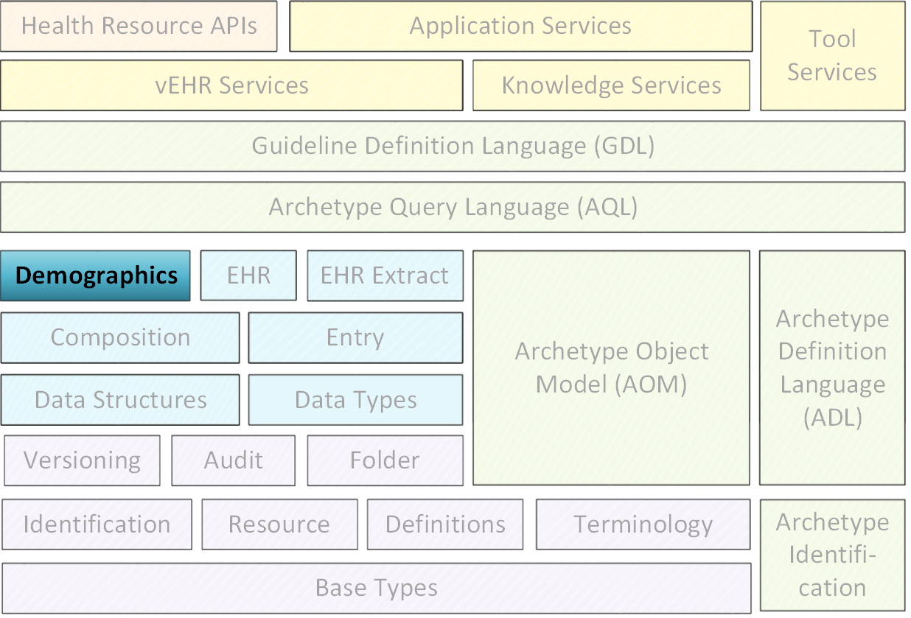
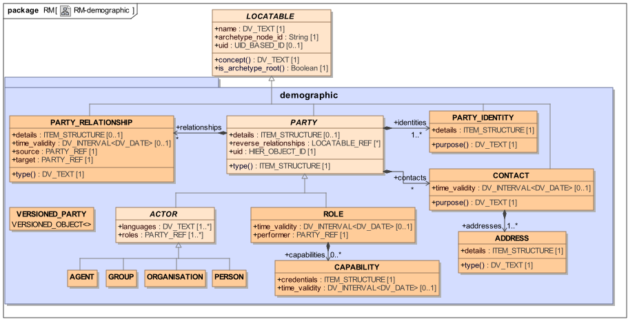
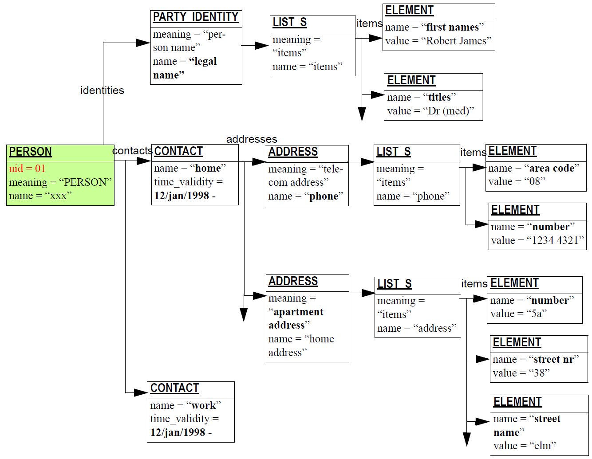
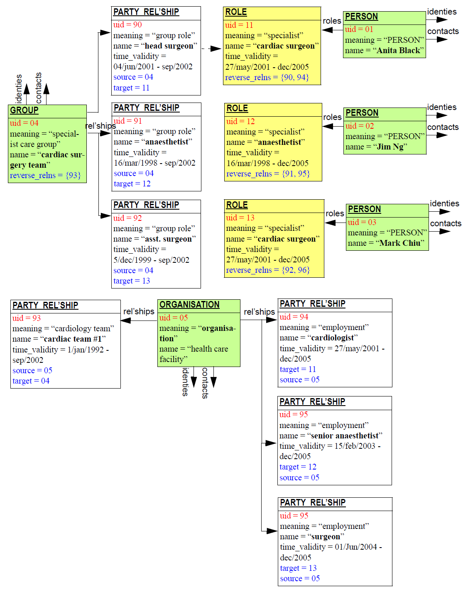
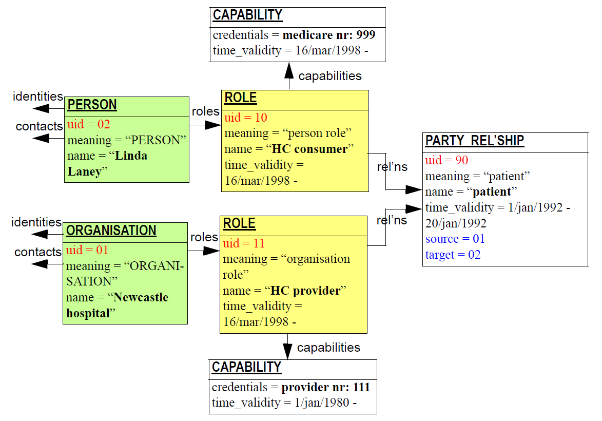

# 人口统计信息模型

发行人：openEHR规范程序

发布：版本1.0.3

状态：STABLE

修订：[最新版]

日期：[最新发布日期]

关键词：EHR，人口统计学，openehr

©2003 - 2015 openEHR基金会

openEHR基金会是一个独立的非营利社区组织，通过开源，基于标准的实施，促进消费者和临床医生共享健康记录。

- 许可: Creative Commons Attribution-NoDerivs 3.0 Unported。 https://creativecommons.org/licenses/by-nd/3.0/

- 支持：
	- 问题：https：//openehr.atlassian.net/browse/SPECPR/
	- 网址：http：//www.openehr.org/

## 修订记录
问题详情Raiser Completed

- R E L E A S E 1.0.3
	- 2.0.3 （2015年8月15日）
		- SPECRM-36：删除ADDRESS.as_string（）和PARTY_IDENTITY.as_string（）函数。
		- SPEC-45.删除ACTOR.has_legal_entity（）函数。
- R E L E A S E 1.0.2
	- 2.0.2 （2008年8月2日）
		- SPEC-257：更正小的拼写错误并澄清文本。在类定义中，必须强制使用PARTY_IDENTITY.details和ADDRESS.details。
- R E L E A S E 1.0.1
	- 2.0.1 （2006年2月23日)
		- SPEC-200：正确的版本1.0印刷错误。
- R E L E A S E 1.0
	- 2.0 (2006年1月25日)
		- SPEC-189.添加LOCATABLE.parent。 PARTY中的新不变式。
		- SPEC-190。将VERSION_REPOSITORY重命名为VERSIONED_OBJECT。
		- SPEC-194.使用LOCATABLE.uid更正异常。
		- SPEC-161.支持分布式版本控制。
- R E L E A S E 0.96
- R E L E A S E 0.95
	- 1.4.7 (2005年3月12日)
		- SPEC-133.删除详细信息/ =从PARTY中删除不变量。
	- 1.4.6 （2005年2月22日）
		- SPEC-48.文件的预发布审查。已更正的STRUCTURE为ITEM_STRUCTURE。使ACTOR.languages列表不是集合。
	- 1.4.5 （2005年1月10日）
		- SPEC-24.将含义恢复为STRING，并重命名为archetype_node_id。
		- SPEC-118.使包名称为小写。
- R E L E A S E 0.9
	- 1.4.4 （04 Oct 2003）
		- SPEC-41.在openEHR文档中可视化区分基本类型。
	- 1.4.3 （2003年9月15日）
		- SPEC-13.根据CEN ENV 13606重命名关键类。
	- 1.4.2 （14 August 2003）
		- SPEC-35.澄清PARTY和PARTY_REL之间的循环关系。
	- 1.4.1 （2003年3月18日）
		- SPEC-3.已移除ARCHETYPED和VERSIONABLE类。
	- 1.4 (2003年2月25日)
		- 使用ISE Eiffel 5.2正式验证。对不变量的小修正。
	- 1.3.1 (2003年2月13日)
		- 评论：H Frankel，MCA。校正图和类文本。改进了PARTY_RELATIONSHIP语义。添加患者实例示例。使得time_validity属性可选。
	- 1.3 (08 Jan 2003)
		- 校正图和类文本。对于大多数键类，继承已更改为ARCHETYPED。添加了一些实例示例。
	- 1.2 (2002年10月22日)
		- 一般修改，添加CAPABILITY类。
	- 1.1 (18 Sep 2002)
		- 将CONTACT_DESCRIPTOR重命名为CONTACT。已删除CONTACT.role。已将PARTY_ROLE重命名为ROLE。将CONTACT.address更改为地址。将“SPATIAL”重命名为“STRUCTURE”。推出了PARTY和ACTOR类。
	- 1.0 (28 August 2002)
		- 创建从EHR RM。
	
## 致谢

本文件所报告的工作由下列组织提供资金：

- 伦敦大学学院 - 健康信息学和多专业教育中心（CHIME）;

- 海洋信息;

- 分布式系统技术中心（DSTC），通过澳大利亚联邦政府总理和内阁部合作研究中心计划。

特别感谢CHIME负责人David Ingram教授，他提供了自GEHR（1992年）时代以来的愿景和合作的工作环境。
## 1.前言

###1.1.目的

本文档描述了openEHR人口统计信息模型的架构。语义来自GEHR的以前工作，CEN 13606和HL7v3 RIM中的现有模型，以及澳大利亚完成的其他工作。

目标受众包括：

- 生产卫生信息学标准的标准机构;

- 使用openEHR的学术团体;

- 开源医疗保健社区;

- 解决方案供应商;

- 医疗信息学家和临床医生对健康信息感兴趣。

### 1.2.相关文件

阅读本文档的前提条件包括：

- openEHR架构概述（[openehr_overview]）;

描述相关模型的其他文档包括：

- openEHR支持信息模型（[openehr_rm_support]）。

- openEHR数据类型信息模型（[openehr_rm_data_types]）。

### 1.3.状态

此规范处于稳定状态。本文档的开发版本可以在http://www.openehr.org/releases/RM/latest/demographic.html找到。

已知的遗漏或问题在文本中用“待定”段落表示，如下：

TBD :(例如待定段落）

鼓励用户对这些段落以及主要内容发表评论和/或建议。应在技术邮件列表或规格问题跟踪器上提供反馈。

### 1.4.一致性

数据或软件工件与openEHR参考模型规范的一致性通过该工件相对于相关openEHR实现技术规范（ITS）（例如IDL接口或XML模式）的形式测试来确定。由于ITS是来自参考模型的形式化的自动推导，ITS一致性指示RM一致性。

## 2.人口包

### 2.1. 概述

在下面的UML图中说明的人口模型是在人口统计服务器中可能期望看到的事实的一般化模型。 模型的目的是作为人口统计服务的规范，或者是独立的，或者是诸如患者主索引（PMI）的现有系统的“包装”服务。 在后一种情况下，它用于向现有服务添加所需的openEHR语义，特别是版本控制。

一般设计基于Fowler [Fowler_1997]描述的方案和问责制，并且受包括在澳大利亚和HL7v3 RIM [HL7v3_ballot2]（其本身受Fowler模型影响）的临床适应影响。

该模型的主要设计标准之一是其表达存在的人口统计实体的属性和关系，而不管特定临床参与或特定事件中的参与。参与仅仅在健康记录或其他相关模型的背景下是有意义的，它们记录真实世界中人口统计实体和事件之间的特定情境关系。

另一个标准是模型中的类的实例必须以可疑的方式可序列化为EHR提取。这要求每个PARTY是一个自包含的数据层次结构，与EHR模型中不同的COMPOSITION在Extract中是不同的层次结构相同。为了确保这个条件，PARTY_RELATIONSHIPs必须正确实现，以防止无序遍历所有PARTY对象通过他们的关系，当序列化。有关详情，请参阅下面的派对关系。

#### 2.1.1.原型

该模型被设计为与原型一起使用，因此是所有实体的通用性质。每个包含表单详细信息的属性的类：STRUCTURE是一个完全可构造的结构。因此，原型可以定义为概念，如特定种类的人，组织;对于实际的角色，如“保健医生”，以及党身份和地址。

#### 2.1.2.名称和地址

类别已包含在PARTY_IDENTITY和ADDRESS中，即使它们只包含指向详细信息的链接，以通用STRUCTURE类的形式。这不是绝对必要的 - 它可以简单地使用在PARTY和CONTACT类中的适当命名的属性 - 但是完成，以提供一个地方，在模型的未来版本中添加特定的语义。它还希望使软件开发更容易，因为它提供了可以添加行为和其他实现属性的显式类。最后，它允许在原型创作工具中显式使用PARTY_IDENTITY和ADDRESS的概念。

通过属性标识链接到PARTY的PARTY_IDENTITY的实例旨在表示人，组织和其他参与者的名称，即由该方“拥有”的名称，例如， （在机构和公司的情况下）或由于社会关系（由父母，部落等提供的姓名）。其他组织给出的缔约方的标识符或国家不以这种方式表示，而应记录在PARTY.details结构中（见下文）。

#### 2.1.3.党代表

由组织或国家提供的缔约方的标识符被视为缔约方的任何其他属性，即记录为PARTY.details结构中的数据的一部分。系统中的Party实例的标识符以与EHR中的Compositions的标识符相同的方式提供：通过包含VERSION的uid属性（类型OBJECT_VERSION_ID）。这些标识符用于缔约方之间以及缔约方与缔约方之间的所有交叉参考。

#### 2.1.4.党友关系

现实世界中的各方之间的关系可以使用PARTY_RELATIONSHIP对象来表示，如下所示。

关系被认为是有方向性的，因此使用属性名称源和目标，然而，这些名称是中性的，并且不给出关系的含义的指示，例如哪一​​方负责和哪一方负责（为了比较， Fowler的人口模型[Fowler_1997]）。因此，如果在目标端，则在关系列表中包括关系中包含的每个参与者，如果它在源端，或者在reverse_relationships列表中。

确定两个缔约方之间关系的方向性的通常方法通常是哪个缔约方的行动导致关系的产生。例如，表示健康消费者和健康护理组织之间的概念“患者”的关系将使消费者作为源和组织作为目标。

PARTY_RELATIONSHIPs存储为指定为源的PARTY的数据的一部分。这意味着关系属性是按值，而reverse_relationships是通过引用，如PARTY_RELATIONSHIP.source和target。实际的引用类型是通过使用包含HIER_OBJECT_ID的OBJECT_REF来表示Party的Version容器，而不是OBJECT_VERSION_IDs，这将表示特定的版本。逻辑上，这实现了在现实世界中这样的关系在连续体之间的语义，即真实的缔约方，而不仅仅是其人口统计系统中的一个版本实例。

#### 2.1.5.版本化语义

类PARTY及其后代ACTOR和ROLE都可能在人口统计系统中进行版本化。 PARTY的版本包括所有组成部分，例如身份，联系人，作为来源的党派关系。每个Party都存储在自己的版本容器中。

### 2.2.类定义

#### 2.2.1.派对类

<table>
	<tr>
		<td>类</td>
		<td colspan="2">PARTY（摘要）</td>
	</tr>
	<tr>
		<td>描述</td>
		<td colspan="2">所有派对类型的祖先，包括现实世界实体及其角色。一方是可以参与活动的任何实体。继承自LOCATABLE的名称属性用于指示实际的参与方类型（注意，实际名称，即参与方的身份在identities属性中指示，而不是name属性）。</td>
	</tr>
	<tr>
		<td>继承</td>
		<td colspan="2">LOCATABLE</td>
	</tr>
	<tr>
		<td>属性</td>
		<td>签名</td>
		<td>含义</td>
	</tr>
	<tr>
		<td>1..1</td>
		<td>身份：列表<PARTY_IDENTITY></td>
		<td>身份用于识别自身，如法定名称，阶段名称，别名，昵称等。</td>
	</tr>
	<tr>
		<td>0..1</td>
		<td>联系人：列表<CONTACT></td>
		<td>此对象的联系人。</td>
	</tr>
	<tr>
		<td>0..1</td>
		<td>详细信息：ITEM_STRUCTURE</td>
		<td>此方的所有其他详细信息。</td>
	</tr>
	<tr>
		<td>0..1</td>
		<td>reverse_relationships：List <LOCATABLE_REF></td>
		<td>这个角色作为目标的关系。</td>
	</tr>
	<tr>
		<td>0..1</td>
		<td>关系：列表<PARTY_RELATIONSHIP></td>
		<td>此角色作为来源的关系。</td>
	</tr>
	<tr>
		<td>1..1（重新定义）</td>
		<td>uid：HIER_OBJECT_ID</td>
		<td>此方的标识符。</td>
	</tr>
	<tr>
		<td>函数</td>
		<td>签名</td>
		<td>含义</td>
	</tr>
	<tr>
		<td></td>
		<td>类型：ITEM_STRUCTURE</td>
		<td>党派类型，例如PERSON，ORGANIZATION等。全科医生，护士，私人公民。取自继承的name属性。</td>
	</tr>
	<tr>
		<td>不变</td>
		<td colspan="2">Type_valid：type = name</td>
	</tr>
	<tr>
		<td></td>
		<td colspan="2">Contacts_valid：contacts / = Void意味着不是contacts.is_empty</td>
	</tr>
	<tr>
		<td></td>
		<td colspan="2">Relationships_validity：关系/ = Void隐含（不是relationships.is_empty，然后是relationships.for_all（r | r.source = self）</td>
	</tr>
	<tr>
		<td></td>
		<td colspan="2">Reverse_relationships_validity：reverse_relationships / = Void隐含（不是rev​​erse_relationships.empty，然后是reverse_relationships.for_all（item | repository（“demographics”））all_party_relationships.has_object（item）然后是仓库（“demographics”）。all_party_relationships.object = self））</td>
	</tr>
	<tr>
		<td></td>
		<td colspan="2">Is_archetype_root：is_archetype_root</td>
	</tr>
</table>

#### 2.2.2. ROLE类

<table>
	<tr>
		<td>类</td>
		<td colspan="2">ROLE</td>
	</tr>
	<tr>
		<td>描述</td>
		<td colspan="2">角色执行的角色的一般描述。角色对应于党的能力。角色用于定义一方为某一目的而承担的责任。角色应具有验证执行者的凭据以执行角色。</td>
	</tr>
	<tr>
		<td>继承</td>
		<td colspan="2">PARTY</td>
	</tr>
	<tr>
		<td>属性</td>
		<td>签名</td>
		<td>含义</td>
	</tr>
	<tr>
		<td>0..1</td>
		<td>time_validity：DV_INTERVAL <DV_DATE></td>
		<td>此角色的有效时间间隔。</td>
	</tr>
	<tr>
		<td>1..1</td>
		<td>执行者：PARTY_REF</td>
		<td>引用版本容器的Actor扮演的角色。</td>
	</tr>
	<tr>
		<td>0..1</td>
		<td>能力：列表<能力></td>
		<td>这个角色的能力。</td>
	</tr>
	<tr>
		<td>不变</td>
		<td colspan="2">Capabilities_valid：capabilities / = Void意味着不是capabilities.empty</td>
	</tr>
</table>

#### 2.2.3. PARTY_RELATIONSHIP类

<table>
	<tr>
		<td>类</td>
		<td colspan="2">PARTY_RELATIONSHIP</td>
	</tr>
	<tr>
		<td>描述</td>
		<td colspan="2">各方之间关系的一般描述。</td>
	</tr>
	<tr>
		<td>继承</td>
		<td colspan="2">LOCATABLE</td>
	</tr>
	<tr>
		<td>属性</td>
		<td>签名</td>
		<td>含义</td>
	</tr>
	<tr>
		<td>0..1</td>
		<td>详细信息：ITEM_STRUCTURE</td>
		<td>关系的详细描述。</td>
	</tr>
	<tr>
		<td>0..1</td>
		<td>time_validity：DV_INTERVAL <DV_DATE></td>
		<td>此关系的有效时间间隔。</td>
	</tr>
	<tr>
		<td>1..1</td>
		<td>来源：PARTY_REF</td>
		<td>关系来源。</td>
	</tr>
	<tr>
		<td>1..1</td>
		<td>target：PARTY_REF</td>
		<td>关系目标。</td>
	</tr>
	<tr>
		<td>函数</td>
		<td>签名</td>
		<td>含义</td>
	</tr>
	<tr>
		<td></td>
		<td>类型：DV_TEXT</td>
		<td>关系类型，如就业，权威，健康提供</td>
	</tr>
	<tr>
		<td>不变</td>
		<td colspan="2">Source_valid：source / = Void然后source.relationships.has（self）</td>
	</tr>
	<tr>
		<td></td>
		<td colspan="2">Target_valid：target / = Void，然后不是target.reverse_relationships.has（self）</td>
	</tr>
	<tr>
		<td></td>
		<td colspan="2">Type_validity：type = name</td>
	</tr>
</table>

#### 2.2.4. PARTY_IDENTITY类

<table>
	<tr>
		<td>类</td>
		<td colspan="2">PARTY_IDENTITY</td>
	</tr>
	<tr>
		<td>描述</td>
		<td colspan="2">由PARTY拥有的身份，例如人名或公司名称，并由该方用于标识自己。实际结构是原型。</td>
	</tr>
	<tr>
		<td>继承</td>
		<td colspan="2">LOCATABLE</td>
	</tr>
	<tr>
		<td>属性</td>
		<td>签名</td>
		<td>含义</td>
	</tr>
	<tr>
		<td>1..1</td>
		<td>详细信息：ITEM_STRUCTURE</td>
		<td>个性的价值。这通常采用可解析字符串或小结构的字符串的形式。</td>
	</tr>
	<tr>
		<td>函数</td>
		<td>签名</td>
		<td>含义</td>
	</tr>
	<tr>
		<td></td>
		<td>用途：DV_TEXT</td>
		<td>身份的目的，例如。法定，原名，昵称，部落名称，商号。从继承的name属性的值。</td>
	</tr>
	<tr>
		<td>不变</td>
		<td colspan="2">Purpose_valid：purpose = name</td>
	</tr>
</table>

#### 2.2.5.CONTACT类

<table>
	<tr>
		<td>类</td>
		<td colspan="2">CONTACT</td>
	</tr>
	<tr>
		<td>描述</td>
		<td colspan="2">描述一方的联系方式。实际结构是原型。</td>
	</tr>
	<tr>
		<td>继承</td>
		<td colspan="2">LOCATABLE</td>
	</tr>
	<tr>
		<td>属性</td>
		<td>签名</td>
		<td>含义</td>
	</tr>
	<tr>
		<td>1..1</td>
		<td>地址：列表<ADDRESS></td>
		<td>为此目的的一组地址备选方案和时间有效性。</td>
	</tr>
	<tr>
		<td>0..1</td>
		<td>time_validity：DV_INTERVAL <DV_DATE></td>
		<td>此联系人描述符的有效时间间隔。</td>
	</tr>
	<tr>
		<td>函数</td>
		<td>签名</td>
		<td>含义</td>
	</tr>
	<tr>
		<td></td>
		<td>用途：DV_TEXT</td>
		<td>使用此联系人的目的，例如。邮件，白天电话等。从继承的name属性的值。</td>
	</tr>
	<tr>
		<td>不变</td>
		<td colspan="2">Purpose_valid：purpose = name</td>
	</tr>
</table>

#### 2.2.6. ADDRESS类

<table>
	<tr>
		<td>类</td>
		<td colspan="2">ADDRESS</td>
	</tr>
	<tr>
		<td>描述</td>
		<td colspan="2">联系地址，可以是电子地址。</td>
	</tr>
	<tr>
		<td>继承</td>
		<td colspan="2">LOCATABLE</td>
	</tr>
	<tr>
		<td>属性</td>
		<td>签名</td>
		<td>含义</td>
	</tr>
	<tr>
		<td></td>
		<td>1..1</td>
		<td>详细信息：ITEM_STRUCTURE</td>
	</tr>
	<tr>
		<td>函数</td>
		<td>签名</td>
		<td>含义</td>
	</tr>
	<tr>
		<td></td>
		<td>类型：DV_TEXT</td>
		<td>地址类型，例如电子，地方。从继承的name属性的值。</td>
	</tr>
	<tr>
		<td>不变</td>
		<td colspan="2">Type_valid：type = name</td>
	</tr>
</table>

#### 2.2.7.CAPABILITY

<table>
	<tr>
		<td>类</td>
		<td colspan="2">CAPABILITY</td>
	</tr>
	<tr>
		<td>描述</td>
		<td colspan="2">一个角色的能力，如ehr修饰词，卫生保健提供者。能力应该由凭据备份。</td>
	</tr>
	<tr>
		<td>继承</td>
		<td colspan="2">LOCATABLE</td>
	</tr>
	<tr>
		<td>属性</td>
		<td>签名</td>
		<td>含义</td>
	</tr>
	<tr>
		<td>1..1</td>
		<td>凭证：ITEM_STRUCTURE</td>
		<td>此能力的角色的执行者的资格。这可能包括专业资格和官方身份，如提供者号码等。</td>
	</tr>
	<tr>
		<td>0..1</td>
		<td>time_validity：DV_INTERVAL <DV_DATE></td>
		<td>此功能的凭据的有效时间间隔。</td>
	</tr>
</table>

#### 2.2.8. ACTOR类

<table>
	<tr>
		<td>类</td>
		<td colspan="2">ACTOR（摘要）</td>
	</tr>
	<tr>
		<td>描述</td>
		<td colspan="2">所有现实世界类型的祖先，包括人和组织。演员是任何能够承担角色的真实世界实体。</td>
	</tr>
	<tr>
		<td>继承</td>
		<td colspan="2">PARTY</td>
	</tr>
	<tr>
		<td>属性</td>
		<td>签名</td>
		<td>含义</td>
	</tr>
	<tr>
		<td>1..1</td>
		<td>语言：List <DV_TEXT></td>
		<td>可用于与此演员通信的语言，按照优选的使用顺序（如果已知，否则顺序不相关）。</td>
	</tr>
	<tr>
		<td>1..1</td>
		<td>角色：列表<PARTY_REF></td>
		<td>此方所扮演的每个角色的版本容器的标识符。</td>
	</tr>
</table>

#### 2.2.9. PERSON类

<table>
	<tr>
		<td>类</td>
		<td colspan="2">PERSON</td>
	</tr>
	<tr>
		<td>描述</td>
		<td colspan="2">人员的一般描述。提供可以定向Person原型的专用类型。</td>
	</tr>
	<tr>
		<td>继承</td>
		<td colspan="2">ACTOR</td>
	</tr>
</table>

2.2.10。GROUP类

<table>
	<tr>
		<td>类</td>
		<td colspan="2">GROUP</td>
	</tr>
	<tr>
		<td>描述</td>
		<td colspan="2">组织的一般描述。一个组织是一个合法组成的机构，其存在（一般来说）比被认为是其一部分的缔约方的存在寿命更长。</td>
	</tr>
	<tr>
		<td>继承</td>
		<td colspan="2">ACTOR</td>
	</tr>
	<tr>
		<td>属性</td>
		<td>签名</td>
		<td>含义</td>
	</tr>
	<tr>
		<td></td>
		<td></td>
		<td></td>
	</tr>
	<tr>
		<td>函数</td>
		<td>签名</td>
		<td>含义</td>
	</tr>
	<tr>
		<td>（有效）</td>
		<td></td>
		<td></td>
	</tr>
	<tr>
		<td>不变</td>
		<td colspan="2"></td>
	</tr>
	<tr>
		<td></td>
		<td colspan="2"></td>
	</tr>
</table>

2.2.11. GROUP类

<table>
	<tr>
		<td>类</td>
		<td colspan="2">GROUP</td>
	</tr>
	<tr>
		<td>描述</td>
		<td colspan="2">团体是由另一方（通常是组织）为某些特定目的而创建的现实世界的团体。典型的临床例子是专科护理团队的例证，例如。心脏病学小组。小组成员通常一起工作。</td>
	</tr>
	<tr>
		<td>继承</td>
		<td colspan="2">ACTOR</td>
	</tr>
</table>

2.2.12.代理类

<table>
	<tr>
		<td>类</td>
		<td colspan="2">PROX</td>
	</tr>
	<tr>
		<td>描述</td>
		<td colspan="2">任何类型代理的通用概念，包括设备，软件系统，而不是人或组织。</td>
	</tr>
	<tr>
		<td>继承</td>
		<td colspan="2">ACTOR</td>
	</tr>
</table>

### 2.3. 实例示例

在以下实例示例中，属性uid，source，target和reverse_relationships的值不意味着被视为字面上有效的OBJECT_ID - 为了清楚起见，已经使用了简单整数。

#### 2.3.1. 派对

##### 人

下图说明了PERSON的一组可能的实例，其中包含家庭和工作联系人信息。 PERSON，每个ADDRESS和每个PARTY_IDENTITY都有单独的原型。 在下图中，“意义”是从archetype_node_id属性的值的含义，功能上从原型本地本体派生。

##### 临床医生

##### 证书

##### 保健设施

##### 组

下图显示了一家医院的cadiac手术团队的人口统计信息。 该组包括头外科医生，麻醉师，助理外科医生，以及可能是其他人（未示出）。 这些团队的每个成员都与医院有雇佣关系（仅为一名外科医生，为了清楚起见）。

#### 2.3.2. 关系

##### 家庭关系

##### 雇佣关系

##### 患者

下图显示了一种表示个人和医疗保健组织之间的患者关系的简单方法。

下图显示了相同的逻辑关系，但两个缔约方通过角色行事，分别代表他们作为医疗保健消费者和医疗保健提供者的地位。 这些角色中的每一个都具有相关联的凭证，其在医疗保健系统内记录其官方性质。

## 参考文献

### 出版物

<ol><li>
    [Anderson_1996]罗斯·安德森。临床信息系统的安全性。可在http://www.cl.cam.ac.uk/users/rja14/policy11/policy11.html获取。
</li><li>
    [Baretto_2005] Barretto S A.设计基于指南的工作流程 - 综合电子健康记录。南澳大学博士论文。可在http://www.cis.unisa.edu.au/~cissab/Barretto_PhD_Thesis_Revised_FINAL.pdf。
</li><li>
    [Beale_2000] Beale T. Archetypes：Constraint-based Domain Models for Future-proof Information Systems。 2000.可查阅http://www.openehr.org/files/resources/publications/archetypes/archetypes_beale_web_2000.pdf。
</li><li>
    [Beale_2002] Beale T.Archetypes：Constraint-based Domain Models for Future-proof Information Systems。第十一届OOPSLA行为语义研讨会：为客户服务（西雅图，美国华盛顿，2002年11月4日）。由Kenneth Baclawski和Haim Kilov编辑。 Northeastern University，Boston，2002，pp。16-32.请访问http://www.openehr.org/files/resources/publications/archetypes/archetypes_beale_oopsla_2002.pdf。
</li><li>
    [Beale_Heard_2007] Beale T，Heard S. An Ontology-based Model of Clinical Information。 2007.pp760-764 Proceedings MedInfo 2007，K.Kuhn et al。 （Eds），IOS Publishing 2007.见http://www.openehr.org/publications/health_ict/MedInfo2007-BealeHeard.pdf。
</li><li>
    [Booch_1994] Booch G.面向对象的分析和设计与应用。第2版​​。本杰明/ Cummings 1994.
</li><li>
    [Browne_2005] Browne E D.工作流建模协调的健康护理提供者护理计划。南澳大学博士论文。请访问http://www.openehr.org/publications/workflow/t_browne_thesis_abstract.htm。
</li><li>
    [Cimino_1997] Cimino J J. Desiderata for Controlled Medical vocabularies in the Twenty-F​​irst Century。 IMIA WG6 Conference，Jacksonville，Florida，Jan 19-22,1997.
</li><li>
    [埃菲尔]迈耶B.埃菲尔的语言（第二版）。 Prentice Hall，1992.
</li><li>
    [Elstein_1987] Elstein AS，Shulman LS，Sprafka SA。医学问题解决：临床推理的分析。剑桥，MA：哈佛大学出版社1987.
</li><li>
    [Elstein_Schwarz_2002] Elstein AS，Schwarz A.临床诊断的证据基础：临床问题解决和诊断决策：对认知文献的选择性审查。 BMJ 2002; 324; 729-732.
</li><li>
    [Fowler_1997] Fowler M.分析模式：可重用对象模型。 Addison Wesley 1997
</li><li>
    [Fowler_Scott_2000] Fowler M，Scott K.UML Distilled（第2版）。 Addison Wesley Longman 2000。
</li><li>
    [Gray_reuter_1993] Gray J，Reuter A. Transaction Processing Concepts and Techniques。 Morgan Kaufmann 1993.
</li><li>
    [Hein_2002] Hein J L.Discrete Structures，Logic and Computability（2nd Ed）。琼斯和巴特利特2002.
</li><li>
    [Hnìtynka_2004]HnìtynkaP，PlášilF. MOF的分布式版本控制模型。 Proceedings of WISICT 2004，Cancun，Mexico，A volume in the ACM international conference proceedings series，published by Computer Science Press，Trinity College Dublin Ireland，2004.
</li><li>
    [Ingram_1995] Ingram D.欧洲良好健康记录项目。 Laires，Laderia Christensen，Eds。健康在新的通信时代。阿姆斯特丹：IOS出版社; 1995; pp。66-74.
</li><li>
    [Kifer_Lausen_Wu_1995] Kifer M，Lausen G，Wu J. Logical Foundations of Object-Oriented and FrameBased Languages。 JACM 1995年5月。见见ftp://ftp.cs.sunysb.edu/pub/TechReports/kifer/flogic.pdf。
</li><li>
    [Kilov_1994] Kilov H，Ross J.信息建模 - 一种面向对象的方法。 Prentice Hall 1994.
</li><li>
    [Maier_2000] Maier M.系统建模原则。技术报告，阿拉巴马大学在亨茨维尔。 2000.可在http://www.infoed.com/Open/PAPERS/systems.htm获得
</li><li>
    [Martin] Martin P. UML，OWL，KIF和WebKB-2语言之间的翻译（For-Taxonomy，Frame-CG，Formalized English）。 May / June 2003. Available at http://www.webkb.org/doc/model/comparisons.html as at Aug 2004.
</li><li>
    [Meyer_OOSC2] Meyer B. Object-oriented Software Construction，2nd Ed。 Prentice Hall 1997
</li><li>
    [Müller_2003]MüllerR. Event-oriented Dnamic Adaptation of Workflows：Model，Architecture，and Implementation。莱比锡大学博士论文。请访问http://www.openehr.org/publications/workflow/t_mueller_thesis_abstract.htm。
</li><li>
    [Object_Z] Smith G.对象Z规范语言。 Kluwer Academic Publishers 2000.见http://www.itee.uq.edu.au/~smith/objectz.html。
</li><li>
    [Rector_1994] Rector A L，Nowlan W A，Kay S. Foundations for an Electronic Medical Record。 The IMIA Yearbook of Medical Informatics 1992（Eds.van Bemmel J，McRay A）。 Stuttgart Schattauer 1994.
</li><li>
    [Rector] Rector A L.临床术语：为什么这么难？方法。 1999 Dec; 38（4-5）：239-52.可在http://www.cs.man.ac.uk/~rector/papers/Why-is-terminology-hard-single-r2.pdf。
</li><li>
    [Richards_1998] Richards E G. Mapping Time - The Calendar and its History。牛津大学出版社1998.
</li><li>
	[Sowa_2000] Sowa J F.知识表示：逻辑，哲学和计算基础。 2000，Brooks / Cole，California。
</li><li>
	[Sottile_1999] Sottile P.A.，Ferrara F.M.，Grimson W.，Kalra D.，and Scherrer J.R.The holistic healthcare information system。欧洲电子健康记录。 1999年11月; 259-266.
</li><li>
    [Van_de_Velde_Degoulet_2003] Van de Velde R，Degoulet P. Clinical Information Systems：A Component-Based Approach。 2003. Springer-Verlag New York。
</li><li>
    [Weed_1969] Weed LL。医疗记录，医疗教育和病人护理。 6 ed。芝加哥：年鉴医疗出版商公司1969年。
</li></ol>

### 资源

#### 本体

<ol><li>
    [bfo]正式本体和医学信息科学研究所（IFOMIS）。基本正式本体论（BFO）。 http://ifomis.uni-saarland.de/bfo/。
</li><li>
    [FMA] http://sig.biostr.washington.edu/projects/fm/。
</li><li>
    [Horrocks_owl] Patel-Schneider P，Horrocks I，Hayes P. OWL Web本体语言语义和抽象语法。请参阅http://w3c.org/TR/owl-semantics/。
</li><li>
    信息工件本体。 https://code.google.com/p/information-artifact-ontology/。
</li><li>
    [OBO] The Open Biological and Biomedical Ontologies。见http://www.obofoundry.org/。
</li><li>
    [OGMS]一般医学科学本体（OGMS）。 https://code.google.com/p/ogms/。
</li></ol>

#### 一般

1.  [cov_contra]维基百科。协方差和逆变。请参阅https://en.wikipedia.org/wiki/Covariance_and_contravariance_(computer_science）。

#### 电子卫生标准

<ol><li>
    [ENV_13606-1] ENV 13606-1 - 电子医疗记录通信 - 第1部分：扩展架构。 CEN / TC 251健康信息技术委员会。
</li><li>
    [ENV_13606-2] ENV 13606-2 - 电子医疗记录通信 - 第2部分：域名术语列表。 CEN / TC 251健康信息技术委员会。
</li><li>
    [ENV_13606-3] ENV 13606-3 - 电子医疗记录通信 - 第3部分：分发规则。 CEN / TC 251健康信息技术委员会。
</li><li>
    [ENV_13606-4] ENV 13606-4 - 电子医疗记录通信标准第4部分：信息交换的信息。 CEN / TC 251健康信息技术委员会。
</li><li>
    [Corbamed_PIDS]对象管理组。人身份识别服务。 1999年3月。
</li><li>
    [Corbamed_LQS]对象管理组。词典查询服务。 1999年3月。
</li><li>
    [HL7v3_ballot2] JL7国际。 HL7版本3第二选票规格。可在http://www.hl7.org获得。
</li><li>
    [HL7v3_data_types] Schadow G，Biron P. HL7版本3可交付：版本3数据类型。 （2002年第二版投票）。
</li><li>
    [hl7_v3_rim] HL7. HL7 v3 RIM。见http://www.hl7.org。
</li><li>
    [ICD10AM]。世卫组织/ ACCD。国际疾病分类，第10次修订，澳大利亚修改。请参见https://www.accd.net.au/Icd10.aspx
</li><li>
    [IHTSDO]国际健康术语标准制定组织（IHTSDO）。 http://www.ihtsdo.org。
</li><li>
    [IHTSDO_URIs] IHTSDO。 SNOMED CT URI标准。 http://ihtsdo.org/fileadmin/user_upload/doc/download/doc_UriStandard_Current-en-US_INT_20140527.pdf?ok。
</li><li>
    [NLM_UML_list]国家医学图书馆。 UMLS术语表。 http://www.nlm.nih.gov/research/umls/metaa1.html。
</li><li>
    [SNOMED_CT] IHTSDO。系统化命名医学。请参见http://www.ohtsdo.org。
</li><li>
    [WHO_ICD]世界卫生组织（WHO）。国际疾病分类（ICD）。见：http：//www.who.int/classifications/icd/en/。
</li><li>
    [ISO_18308] Schloeffel P.（编辑）。电子健康记录参考架构的要求。 （ISO TC 215 / SC N; ISO / WD 18308）。国际标准组织，澳大利亚，2002年。
</li><li>
    [ISO_20514] ISO。综合护理EHR。见http://www.iso.org/iso/iso_catalogue/catalogue_tc/catalogue_detail.htm?csnumber=39525.
</li><li>
    [UCUM] Schadow G，McDonald C J.The Unified Code for Units of Measure，Version 1.4 2000.Regenstrief Institute for Health Care，Indianapolis。请参阅http://aurora.rg.iupui.edu/UCUM
</li></ol>

#### 电子卫生项目

<ol><li>
    [CIMI]临床信息建模倡议（CIMI）项目。参见http://opencimi.org。
</li><li>
    [EHCR_supA_14] Dixon R，Grubb P A，Lloyd D，and Kalra D. Consolidated List of Requirements。 EHCR支持行动交付1.4.欧洲委员会DGXIII，布鲁塞尔; 2001年5月59pp可从http://www.chime.ucl.ac.uk/HealthI/EHCR-SupA/del1-4v1_3.PDF获得。
</li><li>
    [EHCR_supA_35] Dixon R，Grubb P，Lloyd D. EHCR支持行动交付3.5：“对CEN未来工作的最终建议”。 2000年10月。见http://www.chime.ucl.ac.uk/HealthI/EHCRSupA/documents.htm。
</li><li>
    [EHCR_supA_24] Dixon R，Grubb P，Lloyd D. EHCR支持行动2.4“CEN EHCRA解释和实施指南”。 2000年10月。见http://www.chime.ucl.ac.uk/HealthI/EHCR-SupA/documents.htm。
</li><li>
    [Lloyd D，et al。 EHCR支持行动交付3.1和3.2“CEN的中期报告”。 July 1998. Available at http://www.chime.ucl.ac.uk/HealthI/EHCR-SupA/documents.htm。
</li><li>
    [GEHR_del_4]可交付成果4：GEHR临床综合性要求。 GEHR项目1992
</li><li>
    [GEHR_del_7]可交付成果7：临床功能规范。 GEHR项目1993
</li><li>
    [GEHR_del_8]可交付成果8：GEHR架构和系统的伦理和法律要求。 1994年GEHR项目
</li><li>
    [GEHR_del_19_20_24]交付成果19,20,24：GEHR架构。 GEHR项目30/6/1995
</li><li>
    [GeHR_AUS] Heard S，Beale T.The Good Electronic Health Record（GeHR）（Australia）。请参阅http://www.openehr.org/resources/related_projects#gehraus。
</li><li>
    [GeHR_Aus_gpcg] Heard S. GEHR Project Australia，GPCG Trial。可在http://www.gehr.org/gpcg/ehra.htm。
</li><li>
    [GeHR_Aus_req] Beale T，Heard S.GEHR技术要求。请参阅http://www.gehr.org/technical/requirements/gehr_requirements.html。
</li><li>
    [Synapses_req_A] Kalra D.（Editor）。突触用户需求和功能规范（A部分）。欧盟远程信息处理应用程序，布鲁塞尔; 1996;突触项目：可交付用户1.1.1a。 6章，176页。
</li><li>
    [Synapses_req_B] Grimson W.和Groth T.（Editors）。突触用户需求和功能规范（B部分）。欧盟远程信息处理应用程序，布鲁塞尔; 1996;突触项目：可交付用户1.1.1b。
</li><li>
    [Synapses_odp] Kalra D.（编辑）。突触ODP信息观点。欧盟远程信息处理应用程序，布鲁塞尔; 1998;突触项目：最终交付。 10章，64页。
</li><li>
    [synex]伦敦大学学院。 SynEx项目。 http://www.chime.ucl.ac.uk/HealthI/SynEx/。
</li></ol>

#### 一般标准

<ol><li>
    [OCL]对象约束语言2.0。对象管理组（OMG）。可在http://www.omg.org/cgi-bin/doc?ptc/2003-10-14.
</li><li>
    [IANA] IANA。 http://www.iana.org/。
</li><li>
    [IEEE_828] IEEE。 IEEE 828-2005：软件配置管理计划标准。
</li><li>
    [ISO_8601] ISO 8601标准描述了表示时间，日期和持续时间的格式。参见例如http://www.mcs.vuw.ac.nz/technical/software/SGML/doc/iso8601/ISO8601.html和http://www.cl.cam.ac.uk/~mgk25/iso-time.html 。
</li><li>
    [ISO_2788] ISO。 ISO 2788单语词典的建立和发展指南。
</li><li>
    [ISO_5964] ISO。 ISO 5964建立和开发多语言词典的指南。
</li><li>
    [Perl_regex] Perl.org。 Perl正则表达式。可在http://perldoc.perl.org/perlre.html。
</li><li>
    斯坦福大学。参见http://protege.stanford.edu/。
</li><li>
    [rfc_2396] Berners-Lee T.Universal Resource Identifiers in WWW。可在http://www.ietf.org/rfc/rfc2396.txt。这是一个用于全局资源识别的万维网RFC。在当前在网上使用时，由Mosaic，Netscape和类似工具。有关URI的起点，请参阅http://www.w3.org/Addressing。
</li><li>
    [rfc_2440] RFC 2440：OpenPGP消息格式。见http://www.ietf.org/rfc/rfc2440.txt和http://www.ietf.org/internet-drafts/draft-ietf-openpgp-rfc2440bis-18.txt
</li><li>
    [rfc_3986] RFC 3986：统一资源标识符（URI）：通用语法。 IETF。参见http://www.ietf.org/rfc/rfc3986.txt。
</li><li>
    [rfc_4122] RFC 4122：通用唯一标识符（UUID）URN命名空间。 IETF。参见http://www.ietf.org/rfc/rfc4122.txt。
</li><li>
    [rfc_2781] IETF。 RFC 2781：UTF-16，ISO 10646的编码见http://tools.ietf.org/html/rfc2781.
</li><li>
    [rfc_5646] IETF。 RFC 5646. Available at http://tools.ietf.org/html/rfc5646.
</li><li>
    [sem_ver]语义版本化。 http://semver.org。
</li><li>
    [Xpath] W3C Xpath 1.0规范。 1999.可在http://www.w3.org/TR/xpath。
</li><li>
    [uri_syntax]统一资源标识符（URI）：通用语法，因特网提议的标准。 2005年1月。见http://www.ietf.org/rfc/rfc3986.txt。
</li><li>
    [w3c_owl] W3C。 OWL - Web本体语言。请参阅http://www.w3.org/TR/2003/CR-owl-ref-20030818/。
</li><li>
    [w3c_xpath] W3C。 XML路径语言。请参阅http://w3c.org/TR/xpath。
</li></ol>

#### 工具

1.  [Template_Designer]模板设计器。海洋信息学。 http://www.openehr.org/downloads/modellingtools

#### openEHR资源

<ol><li>
    [openehr_18308] openEHR基金会。 openEHR架构符合ISO TS 18308“EHR体系结构的要求”。请参阅http://www.openehr.org/releases/trunk/architecture/iso18308_conformance.pdf。
</li><li>
    [openEHR_ADL_workbench] openEHR基金会。 openEHR ADL工作台。 http://www.openehr.org/downloads/ADLworkbench/home。
</li><li>
    [openehr_am_overview] openEHR基金会。 openEHR原型技术概述。请参阅http://www.openehr.org/releases/AM/latest/Overview.html。
</li><li>
    [openehr_am_adl14] openEHR基金会。原型定义语言1.4（ADL1.4）。请访问http://www.openehr.org/releases/AM/latest/ADL1.4.html。
</li><li>
    [openehr_am_aom14] openEHR基金会。原型对象模型1.4（AOM1.4）。请访问http://www.openehr.org/releases/AM/latest/AOM1.4.html。
</li><li>
    [openehr_am_adl2] openEHR基金会。原型定义语言2（ADL2）。请访问http://www.openehr.org/releases/AM/latest/ADL2.html。
</li><li>
    [openehr_am_aom2] openEHR基金会。原型对象模型2（AOM2）。请访问http://www.openehr.org/releases/AM/latest/AOM2.html。
</li><li>
    [openehr_am_identification] openEHR基金会。原型标识规范。请访问http://www.openehr.org/releases/AM/latest/Identification.html。
</li><li>
    [openehr_am_def_pri] openEHR基金会。原型定义和原则。 （已弃用）可查阅http://www.openehr.org/releases/1.0.2/architecture/am/archetype_principles.pdf。
</li><li>
    [openehr_am_sys] openEHR基金会。原型系统。 （已弃用）可查阅http://www.openehr.org/releases/1.0.2/architecture/am/archetype_system.pdf。
</li><li>
    [openehr_am_oap] openEHR基金会。 openEHR原型配置文件。 http://www.openehr.org/releases/1.0.2/architecture/am/openehr_archetype_profile.pdf。
</li><li>
    [openehr_CKM] openEHR临床知识经理（CKM）。请参阅http://www.openEHR.org/ckm
</li><li>
    [openehr_odin] openEHR基金会。对象数据实例符号（ODIN）。请访问http://www.openehr.org/releases/BASE/latest/odin.html。
</li><li>
    [openeneH_overview] openEHR基金会。 openEHR架构概述。请参阅http://www.openehr.org/releases/BASE/latest/architecture_overview.html。
</li><li>
    [openehr_query_aql] openEHR基金会。 openEHR原型查询语言（AQL）。请参阅http://www.openehr.org/releases/QUERY/latest/AQL.html。
</li><li>
    [openehr_rm_data_types] openEHR。数据类型信息模型。请参阅http://www.openehr.org/releases/RM/Release-1.0.3/data_types.html。
</li><li>
    [openehr_rm_data_structures] openEHR。数据结构信息模型。请参阅http://www.openehr.org/releases/RM/Release-1.0.3/data_structures.html。
</li><li>
    [openehr_rm_common] openEHR。公共信息模型。请参阅http://www.openehr.org/releases/RM/Release-1.0.3/common.html。
</li><li>
    [openehr_rm_ehr] openEHR基金会。 EHR信息模型。 http://www.openehr.org/releases/RM/Release-1.0.3/ehr.html。
</li><li>
    [openehr_rm_ehr_extract] openEHR基金会。 EHR Extrct信息模型。 http://www.openehr.org/releases/RM/Release-1.0.3/ehr_extract.html。
</li><li>
    [openehr_rm_integration] openEHR基金会。集成信息模型。 http://www.openehr.org/releases/RM/Release-1.0.3/integration.html。
</li><li>
    [openehr_rm_support] openEHR。支持信息模型。请参阅http://www.openehr.org/releases/RM/Release-1.0.3/support.html。
</li><li>
    openEHR基金会。 openEHR术语http://www.openehr.org/releases/TERM/latest/SupportTerminology.html。
</li><li>
    [openeneHL基金会]。 openEHR术语项目（GitHub）https://github.com/openEHR/terminology。
</li></ol>

最后更新2015-12-10 13:18:41 GMT