#EHR信息模型

发行人：openEHR规范程序

发布：版本1.0.3

状态：STABLE

修订：[latest_issue]

日期：[latest_issue_date]

关键词：EHR，EMR，参考模型，openehr

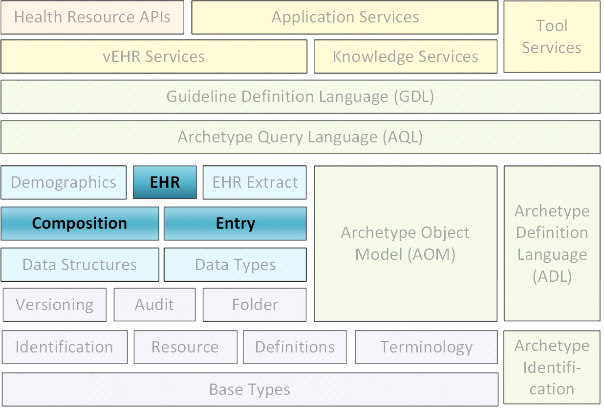

©2003 - 2015 openEHR基金会

openEHR基金会是一个独立的非营利社区组织，通过开源，基于标准的实施，促进消费者和临床医生共享健康记录。

- 许可:
	- Creative Commons Attribution-NoDerivs 3.0 Unported。 https://creativecommons.org/licenses/by-nd/3.0/
- 支持
	- 问题：https：//openehr.atlassian.net/browse/SPECPR/
	- 网址：http：//www.openehr.org/

## 修订记录

- R E L E A S E 1.0.3
	- 5.1.2 (2015年10月10日)
		- SPECRM-28.对EHR和常见IM文档的更正。
		- 改进EHR_STATUS.is_modifiable（SPECPR-28）第4.4.2节（EHR创建）中的说明。修正CARE_ENTRY.guideline_id（SPECPR-75）的说明。在“标准临床数据类型”（SPECPR-87）一节中修正EHR IM中的拼写错误。 EHR IM缺少“Care_entry和Admin_entry”部分中的示例。 （SPECPR-89）。
		- SPECRM-37：添加可选原因：将<DV_TEXT>属性添加到ISM_TRANSITION类（SPECPR-58）。
		- SPECRM-43：改进克隆/复制场景（SPECPR-128）中EHR.system_id的文档。
- R E L E A S E 1.0.2
	- 5.1.1 (2008年8月16日)
		- SPEC-274.观察应该在问题/ SOAP结构图中进行评估。
		- SPEC-275：更新EHR IM中的入口封装设计原则。
		- SPEC-253：澄清EHR IM中的指令/动作模型的解释，以指示每个活动的状态机。
- R E L E A S E 1.0.1
	- 5.1.0 (2007年4月8日)
		- SPEC-200：正确的版本1.0印刷错误。将INSTRUCTION_DETAILS.instruction_id类型更正为LOCATABLE_REF。将CONTENT_ITEM的正确继承更改为LOCATABLE。
		- SPEC-201：向指令ACTIVITY类中添加原型ID。
		- SPEC-203：1.0版的说明文字改进。对“入口”部分进行小的更改。改进了“EHR中的时间”部分。
		- SPEC-210：从ISM_TRANSITION和INSTRUCTION_DETAILS类中删除LOCATABLE继承
		- SPEC-130：LOCATABLE和ARCHETYPED类中的正确的安全详细信息。添加EHR_ACCESS类。
		- SPEC-218：将语言属性添加到COMPOSITION。
		- SPEC-219：使用常量而不是文字来引用RM中的术语。
		- SPEC-244：将LOCATABLE路径函数分隔为PATHABLE类。
		- SPEC-246：更正openEHR术语表。
- R E L E A S E 1.0
	- 5.0 （2006年1月25日）
		- SPEC-14：调整历史。
		- SPEC-140.重新编写教学，基于工作流原理。
		- SPEC-147.使目录可重复使用。
		- SPEC-162.没有人口统计数据时允许方标识符。对EHR，EVENT_CONTEXT和ENTRY的更改。
		- SPEC-164.改进在OBSERVATION中使用时间的描述。
		- SPEC-174.添加ADMIN_ENTRY子类型。
		- SPEC-175.使ENTRY.provider可选。
		- SPEC-177.将COMPOSITION.content设为CONTENT_ITEM。
		- SPEC-180.将EVENT_CONTEXT.composer移至COMPOSITION
		- SPEC-181：将ENTRY.provider更改为PARTY_PROXY。
		- SPEC-182：合理化VERSION.lifecycle_state和ATTESTATION.status。
		- SPEC-187：在DIRECTORY类中更正正确的建模错误并重命名。
		- SPEC-188：将generate_type函数添加到ANY以在不变量中使用。
		- SPEC-189.添加LOCATABLE.parent。 EHR和COMPOSITION中的新不变量。
		- SPEC-190.将VERSION_REPOSITORY重命名为VERSIONED_OBJECT。
		- SPEC-191：将EHR_STATUS类添加到ehr包。
		- SPEC-194：使用LOCATABLE.uid更正异常
		- SPEC-195：将EHR.all_compositions重命名为Composition。
		- SPEC-161.支持分布式版本控制。在EHR，ACTION类中正确的标识符类型。
- R E L E A S E 0.96
- R E L E A S E 0.95
	- 4.5 （2004年12月10日）
		- SPEC-108.轻微更改为change_control包。
		- SPEC-24.将含义恢复为STRING，并重命名为archetype_node_id。
		- SPEC-98. EVENT_CONTEXT.time应允许可选的结束时间。
		- SPEC-109.将act_status添加到ENTRY，如在CEN prEN13606中。
		- SPEC-116.添加PARTICIPATION.function词汇和不变。
		- SPEC-118.使包名称为小写。
		- SPEC-64.重新评估COMPOSITION.is_persistent属性。转换is_persistent到函数;添加类别属性。
		- SPEC-102.使DV_TEXT语言和字符集可选。
- R E L E A S E 0.9
	- 4.4.1 （2004年3月11日）
		- SPEC-96.允许0 .. * SECTION作为COMPOSITION内容。
	- 4.4 （06 March 2004）
		- SPEC-19.添加HISTORY＆STRUCTURE超类型。
		- SPEC-28.更改STRUCTURE类的名称以避免冲突。
		- SPEC-87. EVENT_CONTEXT.location应该是可选的。
		- SPEC-88.将INSTRUCTION.guideline_id移动到ENTRY。
		- SPEC-92.改进EVENT_CONTEXT建模。将作者重命名为作曲家。
		- 使用ISE Eiffel 5.4正式验证。
	- 4.3.10 （25 Feb 2004）
		- SPEC-44.将反向引用从VERSION_REPOSITORY <T>添加到所有者对象。将不变量添加到DIRECTORY和VERSIONED_COMPOSITION类。
		- SPEC-46.重命名COORDINATED_TERM和DV_CODED_TEXT.definition。
	- 4.3.9 （2004年2月10日）
		- SPEC-21.将CLINICAL_CONTEXT.practice_setting重命名为设置。
	- 4.3.8 （2003年11月2日）
		- SPEC-57.环境信息需要包括在EHR中。
	- 4.3.7 （2003年10月25日）
		- SPEC-48.文件的预发布审查。
		- SPEC-49.在EHR，DIRECTORY类中更正参考类型。 EHR.contributions，all_compositions，FOLDER.compositions属性和不变量已更正。
		- SPEC-50.将路径语法参考模型更新为ADL规范。
	- 4.3.6 （04 Oct 2003）
		- SPEC-41.在openEHR文档中可视化区分基本类型。
	- 4.3.5 （2003年9月15日）
		- SPEC-13.根据CEN ENV 13606重命名关键类。
	- 4.3.4 （2003年6月20日）
		- SPEC-11.将作者属性添加到EVENT_CONTEXT。
		- SPEC-27.将feeder_audit移动到LOCATABLE以与CEN 13606版本兼容。
	- 4.3.3 （2003年6月10日）
		- SPEC-20.将VERSION.territory移动到TRANSACTION。
		- SPEC-18.将DIRECTORY类添加到rm.ehr包中。 SPEC-5.将CLINICAL_CONTEXT重命名为EVENT_CONTEXT。
	- 4.3.2 （2003年4月11日）
		- SPEC-6.使ENTRY.provider成为参与。
		- SPEC-7.用RELATED_PARTY替换ENTRY.subject和subject_relationship。
		- SPEC-8.从ENTRY中删除置信度和is_exceptional属性。 SPEC-9.合并ENTRY协议和推理属性。
	- 4.3.1 （2003年4月8日）
	- 4.3 (2003年3月18日)
		- SPEC-3，SPEC-4.已移除ORGANISER_TREE。 CLINICAL_CONTEXT和FEEDER_AUDIT继承自LOCATABLE。对路径语法的更改。改进的ENTRY子类型的定义。改进的实例图。 DSTC详细审查。
		- （正式验证）。
	- 4.2 (2003年2月25日)
		- 使用ISE Eiffel 5.2正式验证。将VERSIONED_TRANSACTION类移动到ehr包，更好地与XML等序列化形式对应。
	- 4.1 (2003年2月8日)
		- CEN WG会议后的更改2003年2月罗马。将TRANSACTION.version_id后置条件移动到不变量。将feeder_audit移至TRANSACTION。添加了ENTRY.act_id。 VERSION_AUDIT.attestsations已移至与VERSIONED <T>连接的新ATTESTATIONS类别。
	- 4.0.2 (2003年2月3日)
		- 各种更正和DSTC更改请求。回复OBSERVATION.items：LIST <HISTORY <T >> to data：HISTORY <T> and EVALUATION.items：LIST <STRUCTURE <T >> to data：STRUCTURE <T>。已将CLINICAL_CONTEXT.other_context更改为STRUCTURE。添加ENTRY.other_participations;添加了CLINICAL_CONTEXT.participations;已删除hcp_legally_responsible（要成为原型）。使用TRANSACTION替换EVENT_TRANSACTION和PERSISTENT_TRANSACTION，并使用布尔属性is_persistent。
	- 4.0.1 (2003年1月8日)
		- DSTC的图表和类文本的详细更正。
	- 4.0 (18 Dec 2002)
		- 将HISTORY类移动到数据结构RM。没有语义变化。
	- 3.8.2 (2002年11月11日)
		- 更正3.8.1.没有语义变化。
	- 3.8.1 (2002年10月28日)
		- 已移除SUB_FOLDER类别。现在文件夹结构可以嵌套单独的原型文件夹结构，与组织者相同。已移除AUTHORED_TA和ACQUISITION_TA类;简化版本。
	- 3.8 (2002年10月22日)
		- 向CLINICAL_CONTEXT添加了practice_setting属性，灵感来自HL7v3 / ANSI CDA标准版本2.0.已将DV_PLAIN_TEXT更改为DV_TEXT。已删除hca_coauthorising;改名为hca_recording;调整所有实例的* ID;将CLINICAL_CONTEXT._start_time，end_time转换为间隔。
	- 3.7 (2002年9月22日)
		- 删除Spatial包到Common RM文档。将ACTION重命名为ACTION_SPECIFICATION。已删除类NAVIGABLE_STRUCTURE。将“SPATIAL”重命名为“STRUCTURE”。已移除类别STATE_HISTORY，STATE，SINGLE_STATE。删除了通信（EHR_EXTRACT）部分自己的文档。
	- 3.6 (28 August 2002)
		- 已删除常用和人口统计包到他们自己的文档。
	- 3.5.1 (2002年8月20日)
		- 改变EXTERNAL_ID标识符的语法。
	- 3.5 (18 August 2002)
		- 重写人口统计和Ehr_extract包。

## 致谢

本文件所报告的工作由下列组织提供资金：

- 伦敦大学学院 - 健康信息学和多专业教育中心（CHIME）;

- 海洋信息;

- 分布式系统技术中心（DSTC），通过澳大利亚联邦政府总理和内阁部合作研究中心计划。

布里斯班DSTC高级研究科学家Andrew Goodchild在其早期开发过程中提供了对模型所有方面的有价值的深入评论和洞察。

特别感谢CHIME负责人David Ingram教授，他提供了自GEHR（1992年）时代以来的愿景和合作的工作环境。

### 商标

- 'openEHR'是openEHR基金会的商标

- “Java”是Oracle Corporation的注册商标

- “Microsoft”和“.Net”是Microsoft Corporation的商标

- “CORBA”是对象管理组的商标

## 1.前言

### 1.1.目的

本文档描述了openEHR EHR信息模型，它是ISO RM / ODP信息观点中的可互操作的EHR的模型。该模型定义了逻辑EHR信息体系结构，而不仅仅是用于在EHR系统之间传递EHR提取或文档的体系结构。 EHR提取的openEHR定义在openEHR EHR_EXTRACT信息模型中给出。

目标受众包括：

- 生产卫生信息学标准的标准机构;

- 使用openEHR的学术团体;

- 开源医疗保健社区;

- 解决方案供应商;

- 医疗信息学家和临床医生对健康信息感兴趣。

- 健康数据管理器。

### 1.2.相关文件

阅读本文档的前提条件包括：

- openEHR架构概述（[openehr_overview]）;

相关文档包括：

- openEHR支持信息模型（[openehr_rm_support]）。

- openEHR数据类型信息模型（[openehr_rm_data_types]）。

- openEHR数据结构信息模型（[openehr_rm_data_structures]）。

- openEHR公共信息模型（[openehr_rm_common]）。

### 1.3.状态

此规范处于STABLE状态。本文档的开发版本可以在http://www.openehr.org/releases/RM/latest/ehr.html找到。

已知的遗漏或问题在文本中用“待定”段落表示，如下：

TBD :(例如待定段落）

鼓励用户对这些段落以及主要内容发表评论和/或建议。应在技术邮件列表或规格问题跟踪器上提供反馈。

### 1.4.一致性

数据或软件工件与openEHR参考模型规范的一致性通过该工件相对于相关openEHR实现技术规范（ITS）（例如IDL接口或XML模式）的形式测试来确定。由于ITS是来自参考模型的形式化的自动推导，ITS一致性指示RM一致性。

## 2. 背景

本节介绍创建openEHR信息模型的建模过程的输入。

### 2.1.要求

对于这个模型，有大致三组要求，如下面的小节所述。

#### 2.1.1.原GEHR要求

从欧洲GEHR项目（1992-5; [Ingram_1995]），确定了以下广泛的需求领域：

- 终身的EHR;

- 优先级：临床医生/患者互动;

- 医学法律忠诚，可追溯性，审计拖尾;

- 技术与数据格式无关;

- 促进电子病历的共享;

- 适合初级和急性护理;

- 次要用途：教育，研究，人口医学;

- 开放标准和软件可交付成果;

原始的可交付成果可以在GEHR页面CHIME，UCL上详细审查。

#### 2.1.2. GEHR澳大利亚要求

GEHR澳大利亚项目（1997-2001; [GeHR_Aus_gpcg]，[GeHR_Aus_req]）提出了进一步的要求，包括：

- 支持临床数据结构：列表，表，时间序列等;

- 更安全的信息模型比原始（欧洲）GEHR：上下文属性只在有效的地方（但仍然相似的风格）;

- EHR中“持久性”，“人口统计学”和“事件”信息的单独组，其紧密对应于真实的临床查询模式;

- 引入正式指定的原型和启用原型的信息模型;

- 在知识水平上的互操作性，即诸如“排放概要”和“生物化学结果”的信息的域定义的水平;

- 支持XML;

- 考虑与CEN 13606，Corbamed，HL7v3的兼容性。

GEHR澳大利亚提供了概念实施证明，其中开发和使用了临床原型。有关原型的技术说明，请参阅[Beale_2000]。

#### 2.1.3.欧洲突触和SynEx项目要求

继原始的欧洲健康记录项目之后，欧盟资助的突触（1996-8; [Synapses_req_B]）和SynEx（1998-2000; [Sottile_1999]）项目扩大了GEHR的原始要求基础，包括进一步的要求如下：

- 统一不同临床数据库和EPR系统的联合方法的要求：联合健康记录（FHR）[Synapses_req_A];

- 需要从定义任何给定临床专科的领域特定健康记录特征和任何给定的数据库模式联合的元数据的（紧密相关的）模型中分离用于联合健康记录的通用和独立于域的高级模型;

- 定义和传播（共享）关于FHR的语义分层组织的知识的形式主义，与记录层次结构中的每个叶节点相关联的允许数据值以及对叶节点可能采用的值的任何约束（Synapses对象字典）[Synapses_odp ];

- 联合中间件服务[Synapses_req_B]的核心技术要求和接口。

#### 2.1.4.欧洲EHCR支持行动要求

该欧盟支持行动项目（“SupA”; [EHCR_supA_24]，[EHCR_supA_31_32]，[EHCR_supA_35]）将欧洲广泛的项目和国家卫生信息化组织公布的要求合并为一个综合要求清单[EHCR_supA_14]。

#### 2.1.5. ISO EHR要求

上述要求出版物和openEHR的最近经验加入由ISO技术委员会215（健康信息学） - ISO TS 18308编写的一组EHR要求的定义中。本文献[ISO_18308]已由本文献的作者审查并且openHHR将寻求保持其信息模型和服务与此国际需求工作之间的紧密映射。 openEHR映射到ISO 18308可以在openEHR网站上找到。

#### 2.1.6. openEHR要求

openEHR开发过程中产生的新需求包括：

- 从减少程序错误和模糊性的角度来看，信息模型的主要改进;

- 时间和上下文的更好的建模（时间/空间方法）;

- 更好地理解遗留系统/联合问题;

- 工作流建模;

- 与CEN EN 13606协调;

- 与HL7v2和其他消息传递系统集成;

- 许多具体的临床要求。

### 2.2.与其他健康信息模型的关系

在相关的情况下，与其他信息模型的对应关系已在本规范中记录。显示了GEHR澳大利亚和欧盟突触/ SynEx模型的对应关系，因为这些是openEHR EHR信息模型主要基于的模型。以下部分总结了显示其对应关系的其他模型和标准。

#### 2.2.1. CEN TC / 251 prEN13606

这些模型受到了sCEN prEN13606（2005修订版）中的模型的影响，并且也影响了模型。因此，与13606的关系已被相当准确地记录。

自2002年1月以来，作为向完整欧洲标准（“EN”）过渡的一部分，prEN13606标准已作为重大修订的主题。这项工作受到openEHR规范的影响，本身也是openEHR规范的进一步洞察和变化的来源。

由于此过程已更改的openEHR的特定区域包括：

- 改变主要类名（TRANSACTION→COMPOSITION等;见CR-000013）;

- 改进的ATTESTATION模型（见CR-000025）;

- 改进的馈线审计模型（见CR-000027）。

openEHR版本0.9和0.95的实现经验进一步改进了这些领域。然而，openEHR不是CEN的副本，有两个原因。首先，其范围包括系统，而EN13606定义了EHR提取;其次，EN13606受到了“委员会设计”的影响，并且没有针对其模型的正式验证机制。

#### 2.2.2. HL7版本3

在可能的情况下还记录了HL7第3版某些部分的对应（2003年7月的第5次投票），但是应当理解，这有许多困难。首先，虽然HL7v3参考信息模型（RIM） - 对信息模型最接近的HL7制品 - 提供了类似的数据类型和一些相关语义，但它并不是EHR的模型。事实上，它与本文提供的信息模型（以及大多数已发布的信息模型）在两个基本方面不同：a）它是来自许多系统的语义的合并，这些系统将存在于分布式健康信息环境中，而不是模型只有一个（EHR）; b）它也不是数据模型，而是Fowler [Fowler_1997]意义上的“分析模式”的组合，从其中进一步的具体模型 - 子模式是通过限制的精炼过程开发的以达到消息定义。因此，消息中的数据不是HL7v3 RIM类的实例，如在基于这里提出的类型的信息模型的其他系统中的情况。

尽管存在差异，但有一些领域似乎是映射的候选者，特别是数据类型和术语使用，以及openEHR组成部分与HL7临床文档架构（CDA）部分之间的对应关系。

#### 2.2.3. OMG HDTF

一般来说，openEHR信息模型代表了在OMG HDTF规范（特别是PIDS和COAS）的信息观点中可以找到的对EHR和相关信息的所需语义的更新近的分析。然而，计算观点（即，功能性服务接口定义）是openEHR设备模型开发活动的输入之一。

## 3. EHR信息模型

### 3.1.概述

下图说明了openEHR EHR信息模型的包结构。

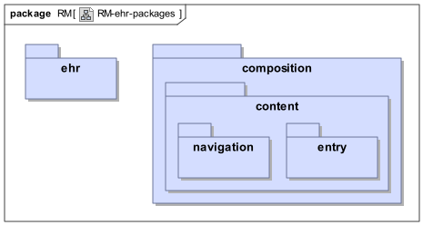

包内容如下：

- EHR
	- 此包包含顶层结构EHR，其由EHR_ACCESS对象，EHR_STATUS对象，VERSIONED_COMPOSITIONs形式的版本化数据容器组成，可选地由FOLDER的分层目录索引。还包括一些汇编，记录随着时间​​的推移对EHR的变化。
- 组成
    - 组合是EHR的顶级“数据容器”，并由COMPOSITION类描述。
- 内容
    - 此包包含导航和条目包，其类描述了健康记录中组合的内容的结构和语义。
    - 导航
        - SECTION类为记录提供了一个导航结构，类似于纸张记录中的“标题”。 ENTRY和其他SECTION可以出现在SECTION下。
    - 条目
        - 该包包含用于记录临床语句的通用结构。输入类型包括ADMIN_ENTRY，观察（所有观察到的现象，包括机械或人工测量，并在接受采访时回应），评估（用于评估，诊断，计划），指令（可执行语句，如医嘱，召回，监督，评论），和ACTION（作为执行指令的结果记录的信息）。

下图说明了EHR信息模型的类结构的概述，所依赖的主要概念，即数据类型，数据结构，原型和标识一起。

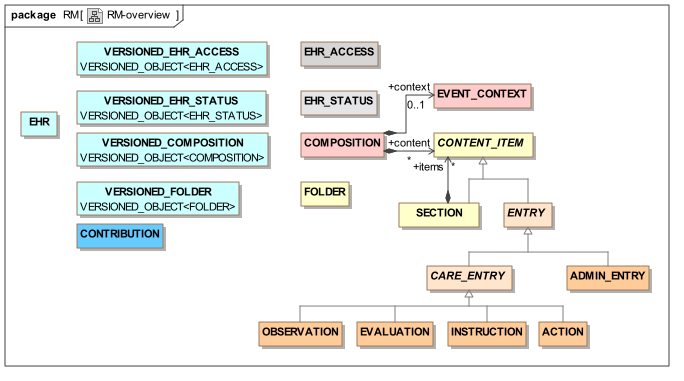

## 4. EHR包

### 4.1. 概述

openEHR EHR是根据相对简单的模型构造的。 由EHR id标识的中央EHR对象指定对多种类型的结构化版本化信息的引用，以及用作对EHR进行的变更集的审计的Contribution对象的列表。 openEHR EHR的高级结构如下所示。

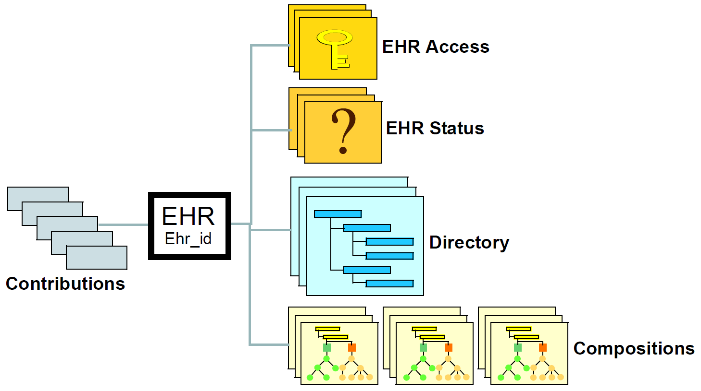

在该图中，EHR的部分如下：

- EHR：根对象，由全球唯一的EHR标识符标识;

- EHR_access（版本化）：包含记录的访问控制设置的对象;

- EHR_status（版本化）：包含各种状态和控制信息的对象，可选地包括当前与记录相关联的主体（即患者）的标识符;

- 目录（版本化）：可用于逻辑组织组合物的文件夹的可选层次结构;

- 成分（版本化）：记录的所有临床和管理内容的容器;

- 贡献：对健康记录做出的每一次更改的变更记录;每个贡献引用由用户向EHR系统提交或验证在记录中的任何版本化项目的一个或多个版本的集合。

ehr包在下面的rm.ehr包中说明。这些类或多或少地与图中所示的对象高级EHR结构一一对应。类型XXX的每个版本化对象由类VERSIONED_XXX定义，类VERSIONED_XXX是类型XXX到通用类型VERSIONED_COMPOSITION中的通用类型paremeter T的绑定（尽管这样的绑定不严格地需要它们自己的类，它们便于在语言缺乏一般性）。

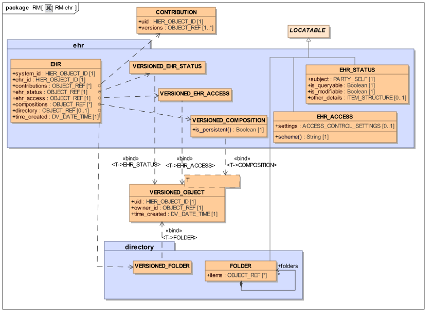

### 4.2. EHR的部分

#### 4.2.1.根EHR对象

根EHR对象记录创建后不可变的三条信息：创建EHR的系统的标识符，EHR的标识符（不同于护理主体的任何标识符），以及创建的时间EHR。否则，它只是作为EHR的组成部分的接入点。

引用而不是值的约束用于EHR和VERSIONED_XXX对象之间的关系，反映了绝大多数仅需要选择（通常是最近的）项的检索方案。按值控制将导致每次访问EHR对象时检索所有VERSIONED_XXX对象的系统。

#### 4.2.2. EHR访问

在EHR_ACCESS对象中指定了整个EHR的访问控制设置。这包括默认隐私策略，标识的访问者（个人和组）列表和默认策略的例外，每个标识EHR中的特定组合。对EHR Access对象的所有更改都通过常规机制进行版本化，确保任何以前时间点的EHR的可见视图都是可重新构建的。

由于健康信息的安全模型仍处于初级阶段，openEHR模型采用了一种完全灵活的方法。在EHR_ACCESS类中只定义了两个硬连线属性。第一个是当前使用的安全方案的名称，而第二个（设置属性）是包含根据该特定方案的EHR的访问设置的对象。每个方案由安全信息模型中定义的抽象类ACCESS_CONTROL_SETTINGS的子类的实例定义。

#### 4.2.3. EHR状态

EHR_STATUS对象包含少量硬连线属性和原始的other_details部分。前者用于指示谁是（当前被理解为）记录的主题，以及EHR是否主动使用，不活动，以及是否应被视为可查询。对于openEHR EHR中的其他地方，主体由PARTY_SELF对象表示，使其能够完全匿名，或者包括患者标识符。主题包括在EHR状态对象中，因为它可能更改，因为在向患者分配记录时发现错误。如果使用匿名形式，则将在交叉引用表中的其他地方进行更改;否则将更新EHR状态对象。因为它是版本化的，所有这些更改都是审计跟踪的，并且可以重建更改历史记录。

其他EHR范围的元数据可以被记录在该对象的原型部分中，包括运行时环境设置，软件应用程序名称和版本ID，数据资源的标识和版本，例如术语，可能甚至实际的软件工具，配置文件，密钥等等。这样的信息通常在软件配置管理系统中版本化，以便能够用正确的工具重建软件的较早版本。存储这样的信息的一个理由是，当临床医生必须证明一个看似糟糕的决定时，它增加了医疗法律支持：如果可以显示当时正在使用的软件版本有缺陷，则它们受到保护，但是这样做需要首先记录这些信息。

#### 4.2.4.组合物

EHR的主要数据在其组成。在openEHR EHR中的组成概念源自GEHR项目的交易概念（[GEHR_del_4]，[GEHR_del_7]，[GEHR_del_8]，[GEHR_del_19_20_24]），其基于对应于交互的信息单元的概念一个医疗保健代理与EHR。它最初设计为满足以下需求（包括交易的熟知ACID特性[Gray_reuter_1993]）：

- 耐久性：需要一个持久单位的信息提交在记录中;

- 原子性：对于临床信息的最小完整性单位的需要，对应于用于交付，传输和安全的最小单位;

- 一致性：需要对记录作出贡献，使记录保持一致状态;

- 隔离：需要贡献记录的同时用户不要相互干扰;

- 不可否认性：要求为记录承诺的信息是不可剥夺的，以便支持以后的调查，用于医疗法律和过程改进目的，以及随后的要求，以便能够访问记录的以前的状态;

- 修改：用户能够修改EHR内容以便纠正错误或更新先前记录的信息（例如，当前药物，家族史）的需要;

- 可追溯性：需要在提交时记录足够的审计信息，以便提供临床和法律可追溯性。

事务概念后来被重命名为“Composition”，它是当前CEN EN13606中等效概念的名称，它已经在openEHR中扩展和更正式地定义了两种方式。首先，一个承诺单元的想法已经通过openEHR变更控制模型来形式化（参见openEHR公共信息模型）;这如何适用于EHR和组合物如下所述。其次，组合物的信息目的不再仅仅是包含来自诸如患者接触的经过的临床事件的数据，而且还捕获具有长期存在意义的特定类别的临床数据，例如问题和药物列表。经验卫生信息系统，包括GEHR（澳大利亚）项目，SynEx，突触和普通商业系统的检查，表明在EHR中存在两种粗略的信息类别：事件项目和纵向，或持久性项目，其中有各种类型。

##### 事件组成

事件记录在患者或患者的医疗保健系统事件期间发生的事件，例如患者接触，而且患者不是参与者（例如手术）或不存在（例如病理测试）的会话。下图说明了包含事件组合的累积的简单EHR。

事件组合的重要工作是不仅记录来自医疗保健事件的数据，例如对患者的观察，而且记录事件上下文信息，即事件的谁，何时，在哪里和为什么。为此，表示临床上下文的特定类别与形式模型中的事件组成相关联。

##### 持久性组成

在更复杂的EHR中，还需要记录在记录中的长期兴趣的项目。这些常常由临床医生分成众所周知的类别，例如：

- 问题列表

- 当前药物

- 治疗预防措施

- 疫苗接种史

- 患者偏好

- 生活方式

- 家史

- 社会历史

- 护理计划

持久性构成可以被认为是对患者的状态或情况的代理 - 它们一起提供患者在某个时间点的图片。例如，“药物列表”的含义总是：这是患者X当前正在服用的药物的列表。类似地，对于上面给出的其他持久性组合物类型。在科学哲学中，记录在持久性组合中的信息的类型被称为继续（参见例如[Sowa_2000]中的KR本体）。这与事件组合相反，事件组合通常不记录连续体，而是记录出现，即，真实的或确实发生但没有寿命的事物。

随着时间的推移，事件构成的数量可能远远超过持续构成的数量。下图说明了包含持久信息以及事件信息的EHR。

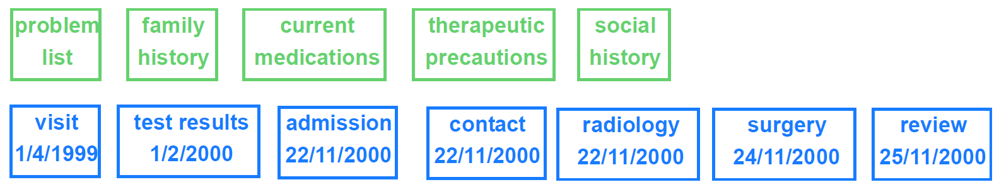

在任何临床会话中，将创建事件组合，并且在许多情况下，持久组合物将被修改。它的工作原理将在下面的EHR中的更改控制部分中描述。

#### 4.2.5.目录

随着组合物随着时间在EHR中累积，它们形成长期的患者病史。可选的目录结构可以在EHR中使用，以使用文件夹层次结构组织组合，方式与文件系统中的文件通过Windows和其他平台上的目录资源管理器工具可视化。在openEHR模型中，文件夹不包含按值的构成，而是通过引用。多个文件夹可以引用同一个合成。文件夹可以用于管理对合成的简单分类，例如，对事件和持久性，或者它们可以用于基于剧集或其他分类的合成来创建多个类别。文件夹结构可以是原型。

显示引用组合件的文件夹的简单结构如下所示，其中使用以下文件夹：

- 学科

    - 包含患者的临床相关人口统计数据的组合物;
    
- 持续

    - 包含长期有效的信息的组合物;
    
- 事件

    - 包含其货币在交付时间之后限于短期的信息的组合物;
    
- Episode_xxx

    - 而不是使用单个“事件”文件夹，可以方便地将事件组成分组为剧集（在卫生保健设施中与一个或多个识别的问题相关的治疗时段）和/或其他类别，例如基于类型医疗保健（正统，顺势疗法等）。

这些特定类别的理由是基于访问模式。持久性类别由上述十多种组合物组成，并且通过查询（特别是生活方式，当前问题和药物）持续需要。事件类别包括临床数据，其相关性相当快地消失，包括对患者或病理学做出的大多数测量。因此，该类别中的组合物在患者的一生中可能非常多，但是在时间上与患者的临床护理降低相关性;因此将它们与持久性组合物分开是有意义的。

无论使用什么文件夹结构，文件夹概念本身都没有限制，也不会对记录添加任何临床意义 - 它只是为提交给记录的信息的“块”提供了逻辑导航结构（记住组合，还有其他方法在条目中提供细粒度结构）。

注意，上面描述和说明的文件夹名称和组合名称都不是openEHR EHR引用模型的一部分：所有这些细节都是由原型提供的;因此，基于完全不同的信息划分概念的EHR结构或甚至不同类型的药物同样是可能的。

EHR目录在其自己的版本化对象中维护，确保对组合物的分类结构的改变随着时间的推移以与对EHR内容的改变相同的方式被版本化。

### 4.3. EHR中的变更控制

给定存在EHR访问对象，EHR状态对象，事件和持久组合以及可能的目录结构的EHR，EHR的更新的一般模型是这些中的任何一个可能在更新期间被创建和/或修改。最简单，最常见的情况是创建单个联系人合成。另一个常见的情况是创建事件组合，并修改一个或多个持久组合，例如。由于在关于家庭史的咨询中获得的事实，或由于新药的处方。其他类型的更新包括对现有合成的更正，以及从另一个网站（例如医院）获取合成。任何这些更新还可能包括对文件夹结构的更改，或将现有合成移动到其他文件夹。自然地，这些情形取决于包括事件和持续构图的记录的结构以及文件夹结构。在极端情况下，仅由事件组合构成且不包含文件夹的EHR将仅经历针对大多数更新的单个组合的创建，其中采集是例外。根据患者和医疗保健提供者的管理和访问控制需求，不太频繁地更新EHR访问和EHR状态对象。

一般来说，无论在任何时间进行的特定更改，始终必须满足以下要求：

- 记录应始终处于一致的信息状态;

- 对记录的所有更改都应进行审计跟踪;

- 所有以前的记录状态都可用于医学法律调查的目的。

这些要求在openEHR中通过使用公共信息模型中定义的更改控制和版本控制功能来满足。该方法的一个关键方面是使用变更集，称为openEHR中的Contribution。应用于EHR，它们可以可视化如下所示：

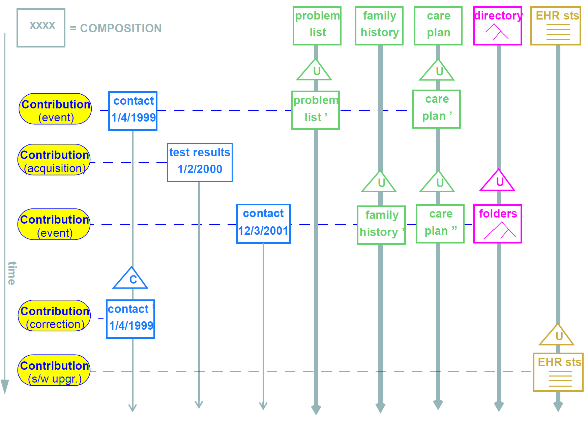

- 第一种是由于患者接触，并导致产生新的接触组合物;它也导致问题列表，当前药物和护理计划组成的改变（再一次，在不同设计的记录中，所有这些信息可能被包含在单个事件组合物中;同样，它可以被分布到更多组合物中） 。

- 下一个贡献是从病理实验室获取测试结果。

- 第三个是另一个联系人，其中家庭历史和文件夹结构都被修改。

- 第四个是错误校正（例如，拼写错误的名称，错误输入的值），并且显示即使没有医疗保健事件也可以有贡献。

- 最后一个是由于软件升级而对EHR中的EHR状态信息的更新。

对记录做出的贡献列表与数据的更改一起被记录，使得不仅捕获对顶级对象（EHR访问，组合等）的改变，而且由于用户而形成改变集的改变的列表commit总是知道的。

- 4.3.1.构成版本

通过来自change_control包（Common IM）的VERSIONED_OBJECT <T>类型实现组合的版本化，该组件包在组合包中通过继承自类型VERSIONED <COMPOSITION>的类VERSIONED_COMPOSITION被显式地绑定到COMPOSITION类。

版本控制对组合的效果在下图中可视化。在这里在VERSIONED_COMPOSITION中示出的版本（每个“版本”是组合物）是沿着图8中的每条垂直线示出的相同版本，这次与它们相关联的审计项目一起示出。该组版本应当被理解为对时间上相同数据的一组连续修改。

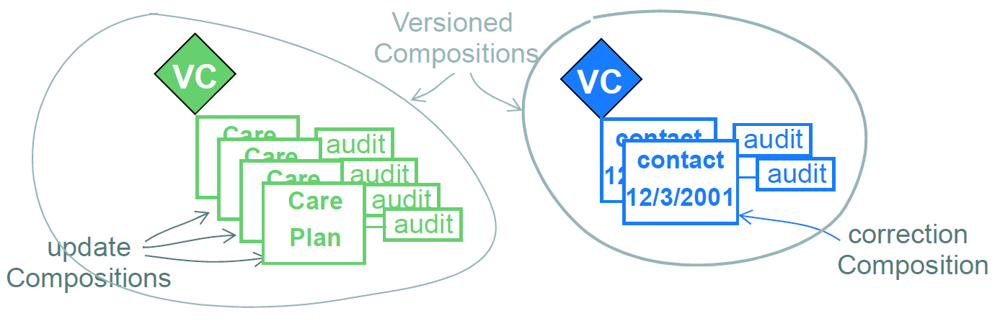

VERSIONED_COMPOSITION可以被认为是一种智能存储库：它如何在时间上存储连续版本是一个实现问题（有一些智能算法可用于这类事情），但重要的是，其功能接口要检索的任何版本，无论是最新的，第一个还是之间的任何。

#### 4.3.2.版本控制方案

以下用于创建新的COMPOSITION版本的方案如下。

- 案例0

    - 信息在本地创作，导致创建新的VERSION <COMPOSITION>。如果这是第一个版本，将首先创建一个新的VERSIONED_COMPOSITION。

- 情况1

    - 信息被本地修改，例如用于校正合成中错误输入的数据。这导致在现有VERSIONED_COMPOSITION中创建新的VERSION <COMPOSITION>，其中AUDIT_DETAILS.change_type设置为“校正”。

- 案例2

    - 从进料器系统接收的信息，例如。一个测试结果，将被转换并用于创建一个新的VERSION <COMPOSITION>。这种采集可以自动完成。如果接收器系统需要存储原始进纸器系统审核细节的副本，则将其写入COMPOSITION.feeder_audit。

- 案例3

    - 从另一个openEHR系统接收作为EHR_EXTRACT的一部分的VERSION <COMPOSITION>（诸如家族历史），其将被本地作者用于创建包括从所接收的项目中选择的一些内容的新的COMPOSITION。在这种情况下，新VERSION <COMPOSITION>被认为是本地创作的，其中一些内容已从其他地方获得。如果它是第一个版本，则首先创建VERSIONED_COMPOSITION。 AUDIT_DETAILS记录该内容的提交，并且临床医生可以选择在审计描述中记录关于它的一些细节。

总之，AUDIT_DETAILS总是用于记录在本地添加信息，而不管它来自哪里。如果需要记录原始审核详细信息，它们将成为版本化对象的内容的一部分。

### 4.4. EHR创建语义

#### 4.4.1. EHR标识符分配

openEHR EHR由于两种类型的事件而创建。第一个是在提供者机构呈现的新患者。可能由于此事件而创建EHR，而不涉及可能存在于更广泛的社区或管辖区中的任何其他公开的EHR EHR。在这种情况下，EHR将被分配一个新的，全局唯一的EHR ID。这将新的EHR建立为源EHR的有意克隆（或更准确地说，是构成该患者的虚拟EHR的EHR家族的一部分）。

另一方面，可以在组织中创建openEHR EHR作为存在于某些其他系统中的患者的EHR的逻辑克隆（可能是部分的）。这可能作为前台注册/准入过程的正常部分发生，即本地EHR系统能够询问EHR位置服务并且发现是否存在用于该患者的任何其他EHR，或者其可能由于纯电子通信在两个提供者之间，即EHR被创建，因为EHR的提取已经从其他地方作为转介或类似通信的一部分发送。在第二种情况下，EHR id应该是来自其他机构的EHR id的副本。在所有情况下，EHR.system_id值应设置为通常用于本地创建的EHR的值。在创建克隆的EHR的情况下，system_id来自接收（克隆）系统。

在理论上，这样的方案可以保证每个患者一个EHR id，但是实际上，各种因素与此相抵触，并且它只能近似它。首先，已知提供者通常为患者创建新的EHR，而不管对于该患者已经存在多少其它EHR，仅仅因为他们没有容易地找到这些EHR的方法。理想情况下，这种情况将在openEHR世界中得到改善，但是由于依赖分布式服务和可靠的人员识别等因素，没有任何保证。可以说的最好的是，EHR id分配方案可以帮助支持理想的EHR id-per-patient情况，如果和当它变得可能。

#### 4.4.2.创建

当创建EHR时，结果应为根EHR对象，EHR状态对象和EHR访问对象，以及版本控制实现所需的任何其他管理信息。在正常实现中，将在贡献中创建和提交EHR状态和EHR访问对象，就像任何合成一样。 EHR状态对象在EHR中具有特殊状态，指示EHR是否应包括在查询中，是否可修改以及是否是活动的。标志可能被设置为指示它是测试记录，或用于教育或培训目的。初始创建操作必须提供足够的参数来创建这两个对象，包括：

- system_id - 系统的EHR存储库的标识符。

- ehr_id

- subject_id - 可选;使用PARTY_SELF允许完全匿名的EHR

- is_queryable标志

- is_modifiable标志 - 指示是否允许修改EHR（除了始终可修改的EHR_STATUS对象）

- 本地实现中的EHR状态对象所需的任何其他标志。

在卫生系统中为该患者第一次创建EHR的情况下，EHR ID将是新的全球唯一标识符，或者在另一系统中与同一主体的现有EHR相同的标识符，在EHR移动或复制。 EHR在系统之间复制/同步的效果是具有相同标识符的EHR可以在多个系统中找到。然而，如果同一患者在多个提供者位置呈现没有EHR共享能力，则将在每个地方创建具有唯一标识符的新EHR。如果在两个提供者之间发生稍后的复制请求（例如，由于对EHR提取的请求），则请求机构将执行将所接收的副本合并到同一患者的现有EHR中。

分布式环境中的主要后果如下：

- 对于给定患者的多个EHR ids指示移动患者，但缺乏系统性EHR共享;

- 对于患者而言，一个EHR id表示无缝集成的分布式环境，最有可能具有全局识别服务。

注意，第一种情况不是问题，并且与其中两个EHR被识别为针对不同的患者（即，主体id而不是EHR id不同）的情况不同，而实际上它们是针对同一个人的情况。

### 4.5. EHR中的时间

在EHR中记录了许多次，在不同的粒度级别。某些时候是科学调查过程的有保证的副产品，包括抽样或收集的时间;测量时间，保健商业事件的时间，数据提交的时间。下图显示了关于EHR中的观测记录（通常是最多的）的这些时间。

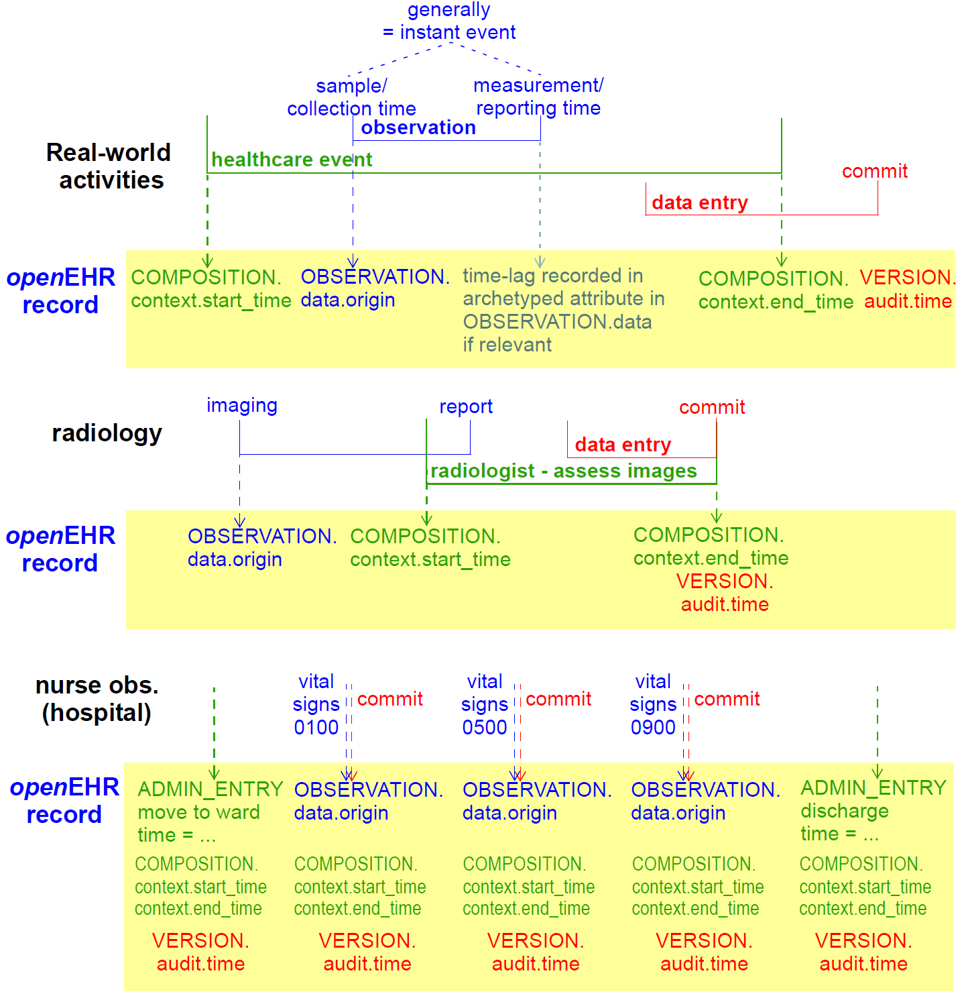

图的顶部示出了在GP就诊时身体检查的典型时间的关系。图的下部显示了放射学和微生物学中常见的不同关系，其中样品（成像或样品收集）时间可能与样品的评估和报告时间完全不同。上图中显示的时间与记录上下文模型中描述的上下文紧密相关;它们还具有（如图所示）参考模型中的具体属性。

其它与诊断（开始时间，解决时间，最后一次发作时间）和药物管理（开始服用药物，停止时间，停止时间等）的时间特定于特定类型的信息（例如诊断与预后与推荐），并且通常表示为Evaluation对象中的原型日期/时间值。基本定时信息在指令和动作条目类型中具体建模，而原型用于表示特定内容特定的定时信息。

### 4.6.记录的历史视图

重要的是要理解，在前一时间点的组合版本代表在特定EHR节点处的EHR的先前可用的信息状态。这种先前状态仅包括来自其它来源的那些已经由该时间点获取的组合物，而不管所获取的信息是否与较早记录的临床信息有关。因此，EHR的先前历史状态对应于系统的什么用户可以在特定时刻看到。重要的是将其与患者的先前的临床状态区分开：EHR的先前的信息状态可以包括比合并发生的时间点显着更老的获取的信息。患者的先前临床状态将是对于患者的所有位置中的EHR的可推导视图 - 有时被称为虚拟EHR - 在给定时间点减去获取的组成，因为它们构成（通常是过时的）主要在其他地方提供的复合材料。

这是我们关注的医疗法律目的的以前的信息状态，因为它们代表在某个时间点在医疗机构的临床医生实际可用的信息。但是以前的临床观点可能对于重建患者经历的实际事件序列是有用的。

### 4.7.类描述

#### 4.7.1. EHR类

<table>
	<tr>
		<td>类</td>
		<td colspan="2">EHR</td>
	</tr>
	<tr>
		<td>描述</td>
		<td colspan="2">EHR对象是护理主体的EHR的根对象和接入点。</td>
	</tr>
	<tr>
		<td>属性</td>
		<td>签名</td>
		<td>含义</td>
	</tr>
	<tr>
		<td>1..1</td>
		<td>system_id：HIER_OBJECT_ID</td>
		<td>创建此EHR的EHR存储库的标识。</td>
	</tr>
	<tr>
		<td>1..1</td>
		<td>ehr_id：HIER_OBJECT_ID</td>
		<td>这个EHR的id。</td>
	</tr>
	<tr>
		<td>0..1</td>
		<td>contribution：List <OBJECT_REF></td>
		<td>导致此EHR更改的文稿列表。每个贡献包含版本列表，其可以包括对任何数量的VERSION实例的引用，即VERSIONED_COMPOSITION和VERSIONED_FOLDER类型的项。</td>
	</tr>
	<tr>
		<td>1..1</td>
		<td>ehr_status：OBJECT_REF</td>
		<td>引用此EHR的EHR_STATUS对象。</td>
	</tr>
	<tr>
		<td>1..1</td>
		<td>ehr_access：OBJECT_REF</td>
		<td>引用此EHR的EHR_ACCESS对象。</td>
	</tr>
	<tr>
		<td>0..1</td>
		<td>composition：List <OBJECT_REF></td>
		<td>此EHR中所有版本化组合引用的主列表。</td>
	</tr>
	<tr>
		<td>0..1</td>
		<td>目录：OBJECT_REF</td>
		<td>此EHR的可选目录结构。</td>
	</tr>
	<tr>
		<td>1..1</td>
		<td>time_created：DV_DATE_TIME</td>
		<td>创建EHR的时间。</td>
	</tr>
	<tr>
		<td>函数</td>
		<td>签名</td>
		<td>含义</td>
	</tr>
	<tr>
		<td>（有效）</td>
		<td></td>
		<td></td>
	</tr>
	<tr>
		<td>不变</td>
		<td colspan="2">Contributions_valid：contributions.for_all（c | c.type.is_equal（“CONTRIBUTION”））</td>
	</tr>
	<tr>
		<td></td>
		<td colspan="2">Ehr_access_valid：ehr_access.type.is_equal（“VERSIONED_EHR_ACCESS”）</td>
	</tr>
	<tr>
		<td></td>
		<td colspan="2">Ehr_status_valid：ehr_status.type.is_equal（“VERSIONED_EHR_STATUS”）</td>
	</tr>
	<tr>
		<td></td>
		<td colspan="2">Compositions_valid：compositions.for_all（c | c.type.is_equal（“VERSIONED_COMPOSITION”））</td>
	</tr>
	<tr>
		<td></td>
		<td colspan="2">Directory_valid：directory / = Void意味着directory.type.is_equal（“VERSIONED_FOLDER”）</td>
	</tr>
</table>

#### 4.7.2. VERSIONED_EHR_ACCESS类

<table>
	<tr>
		<td>类</td>
		<td colspan="2">VERSIONED_EHR_ACCESS</td>
	</tr>
	<tr>
		<td>描述</td>
		<td colspan="2">EHR_ACCESS实例的版本容器。</td>
	</tr>
</table>

#### 4.7.3. EHR_ACCESS类

<table>
	<tr>
		<td>类</td>
		<td colspan="2">EHR_ACCESS</td>
	</tr>
	<tr>
		<td>描述</td>
		<td colspan="2">EHR范围的访问控制对象。对EHR中的数据的所有访问决策必须根据此对象中的策略和规则进行。</td>
	</tr>
	<tr>
		<td>继承</td>
		<td colspan="2">LOCATABLE</td>
	</tr>
	<tr>
		<td>属性</td>
		<td>签名</td>
		<td>含义</td>
	</tr>
	<tr>
		<td>0..1</td>
		<td>设置：ACCESS_CONTROL_SETTINGS</td>
		<td>EHR的访问控制设置。实例是ACCESS_CONTROL_SETTINGS类型的子类型，允许使用不同的访问控制方案。</td>
	</tr>
	<tr>
		<td>函数</td>
		<td>签名</td>
		<td>含义</td>
	</tr>
	<tr>
		<td></td>
		<td>scheme：String</td>
		<td>正在使用的访问控制方案的名称;对应于设置属性的具体实例。</td>
	</tr>
	<tr>
		<td>不变</td>
		<td colspan="2">Scheme_valid：not scheme.is_empty</td>
	</tr>
	<tr>
		<td></td>
		<td colspan="2">Is_archetype_root：is_archetype_root</td>
	</tr>
</table>

#### 4.7.4. VERSIONED_EHR_STATUS类

<table>
	<tr>
		<td>类</td>
		<td colspan="2">VERSIONED_EHR_STATUS</td>
	</tr>
	<tr>
		<td>描述</td>
		<td colspan="2">EHR_STATUS实例的版本容器。</td>
	</tr>
</table>

#### 4.7.5. EHR_STATUS类

<table>
	<tr>
		<td>类</td>
		<td colspan="2">EHR_STATUS</td>
	</tr>
	<tr>
		<td>描述</td>
		<td colspan="2">每个EHR的单个对象包含各种EHR范围的状态标志和设置，包括是否可以查询，修改此EHR等。此对象始终可修改，以便更改EHR整体的状态。</td>
	</tr>
	<tr>
		<td>继承</td>
		<td colspan="2">LOCATABLE</td>
	</tr>
	<tr>
		<td>属性</td>
		<td>签名</td>
		<td>含义</td>
	</tr>
	<tr>
		<td>1..1</td>
		<td>主题：PARTY_SELF</td>
		<td>这个EHR的主题。 external_ref属性可用于包含对人口统计或身份服务中的主题的直接引用。或者，出于安全原因，可以在其他地方进行患者与其记录之间的关联。</td>
	</tr>
	<tr>
		<td>1..1</td>
		<td>is_queryable：Boolean</td>
		<td>如果此EHR应包括在人口查询中，即如果此EHR在群体中被视为活动的，则为真。</td>
	</tr>
	<tr>
		<td>1..1</td>
		<td>is_modifiable：Boolean</td>
		<td>如果允许写入此EHR，则为true。请注意，EHR_STATUS对象是特殊的，并且可以始终写入。</td>
	</tr>
	<tr>
		<td>0..1</td>
		<td>other_details：ITEM_STRUCTURE</td>
		<td>EHR汇总对象的任何其他细节，以原型的Item_structure的形式。</td>
	</tr>
	<tr>
		<td>不变</td>
		<td colspan="2">Is_archetype_root：is_archetype_root</td>
	</tr>
</table>

#### 4.7.6. VERSIONED_COMPOSITION类

<table>
	<tr>
		<td>类</td>
		<td colspan="2">VERSIONED_COMPOSITION</td>
	</tr>
	<tr>
		<td>描述</td>
		<td colspan="2">版本控制的组合抽象，通过继承VERSIONED_OBJECT <COMPOSITION>来定义。</td>
	</tr>
	<tr>
		<td>属性</td>
		<td>签名</td>
		<td>含义</td>
	</tr>
	<tr>
		<td></td>
		<td>is_persistent：Boolean</td>
		<td>指示此组合集是否持久;派生自第一版本。</td>
	</tr>
	<tr>
		<td>不变</td>
		<td colspan="2">Archetype_node_id_valid：all_versions.for_all（v | v.archetype_node_id.is_equal（all_versions.first.archetype_node_id））</td>
	</tr>
	<tr>
		<td></td>
		<td colspan="2">Persistent_validity：all_versions.for_all（v | v.is_persistent = all_versions.first.data.is_persistent）</td>
	</tr>
</table>

## 5.成分包

### 5.1.概述

组合物是openEHR EHR中的主要“数据容器”，是临床内容的根本点。 COMPOSITION类的实例可以被认为是自立式数据聚集，或者面向文档的系统中的文档。组合中的关键信息在其内容，上下文和作曲家属性中找到。下面的UML图说明了组合包。

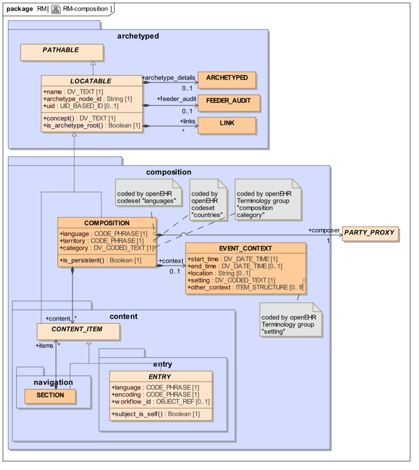

### 5.2. 记录的上下文模型

#### 5.2.1. 概述

openEHR EHR模型考虑了对“上下文”的系统分析。 根据图12所示的方案，以清楚的方式将真实世界中的上下文映射到信息模型的特定级别。在左侧描述了数据输入会话的上下文，其中由 包含“临床报告”的“医疗保健事件”被添加到EHR。 医疗保健事件被定义为患者的医疗保健系统的任何商业活动，包括遭遇，病理测试和干预。 临床说明是临床医师想要记录的最小的不可分割的信息单元。 在图中示出的临床语句具有时间和空间结构以及数据值。 这三个上下文中的每一个都有自己的审计信息，包括谁，何时，在哪里，为什么信息。

在图的右侧，记录的一般模型，表示EHR记录环境。 EHR包括不同的粗粒项目，称为随时间添加的组合，并由文件夹组织。每个组合由条目组成，按组合内的节组织。每个上下文的审计信息记录在EHR的相应级别。

#### 5.2.2.作曲家

作曲家是主要负责作品内容的人。这是应该出现在屏幕上的标识符。它可以是一个初级医生谁做所有的工作，即使没有法律责任，或者它可以是一个护士，即使后来由一个更高级的临床医生证明;它将是患者输入数据的情况下的患者。它可能是也可能不是输入和提交数据的人。它也可以是软件代理。此属性是必需的，因为所有内容必须由某人或代理创建。

由于在许多情况下，合成将由同一个人构成和提交，因此看起来两个标识符COMPOSITION.composer和VERSION.audit.committer（都是类型PARTY_PROXY）将是相同的。事实上，这可能不是这种情况，因为表示作曲者的标识符的种类将是人口统计标识符，例如， “RN Jane Williams”，“RN 12345678”，而审计细节中的标识符通常将是计算机系统用户标识符，例如。 “jane.williams@westmead.health.au”。此差异突出显示这些属性的不同目的：第一个用于标识创建信息的临床代理，第二个用于标识已将其提交到系统的已登录用户。

在患者输入数据的情况下，COMPOSITION.composer和VERSION.audit.committer都使用特殊的“self”PARTY_PROXY实例（请参阅通用IM通用包）。

#### 5.2.3.事件上下文

##### 概述

COMPOSITION类中的可选event_context用于记录导致记录中新内容或已更改内容的医疗保健事件。这里，“保健事件”是指“为患者或代表患者”的保健系统的（通常可结算的）商业活动。一般来说，这将涉及护理和医生的主题，但在医院环境中是可变的。在这个意义上，对GP的访问是单一护理事件，但在医院中的情节也是如此，其可以包括多个遭遇。在事件上下文中记录的信息包括事件的开始和（可选）结束时间，健康护理设施，设置（例如初级保健，老年护理，医院），参与的健康护理专业人员以及由原型定义的可选的进一步细节。

在记录的信息中需要Event_context实例的Healthcare事件包括以下内容。

- 预定或预订的患者遭遇导致EHR的改变，包括与GP，医院顾问或其他临床专业人员（例如移动护士）的改变。在这种情况下，事件上下文记录了相遇的时间和地点，以及临床专业人员的身份。

- 关于病人的案例会议，导致对健康记录的修改;这里的事件上下文记录案例会议时间，地点和参与者。

- 病理，成像或其他测试过程。在这种情况下，Event上下文记录了进行测试和分析的地点和时间，以及谁。

- 由卫生专业人员（通常是医疗保健工作者）提供的家庭护理数据。事件上下文是可选的情况包括以下内容。

- 护士与医院病人的互动，包括检查生命体征，调整药物或其他方面的病床情况。护士观察的每个实例通常不被认为是单独的“护理事件”，而是被看作是监测的一般活动的继续。在这种情况下，整个上下文由记录中的ADMIN_ENTRY实例给出，指示日期/时间以及入院和出院的地点。

不使用事件上下文的情况包括：

- 任何修改或更新现有内容的EHR，包括行政人员，以及临床专业人士添加或更改评估，摘要等。

- 患者输入的数据，其中没有与卫生专业人员的互动;通常来自家庭中的装置的读数，例如称重计，血糖测量装置，可穿戴式监视器等。

最终，Event上下文的使用将由组合级原型控制。

##### 数据出现

对于需要记录EVENT_CONTEXT对象的情况，值得澄清哪些组合包含这些对象。 考虑图中使用事件上下文中所示的示例。 在这个例子中，对EHR做出贡献，由一个或多个由于某些临床活动而创建或修改的组合物组成。 在这样的集合中，在访问期间通常将存在与事件直接相关的组合物，例如患者接触 - 这是包含医生的观察，护士活动等的组合物，因此是包含EVENT_CONTEXT的组合物 实例。 在同一事件期间改变的其他组合物（例如，药物列表，家族史等的更新）不需要Event上下文，因为它们是相同贡献的一部分，并且如果需要，总是可以检索主要组合物的事件上下文 。 图中的贡献A，B和C说明了这种情况。

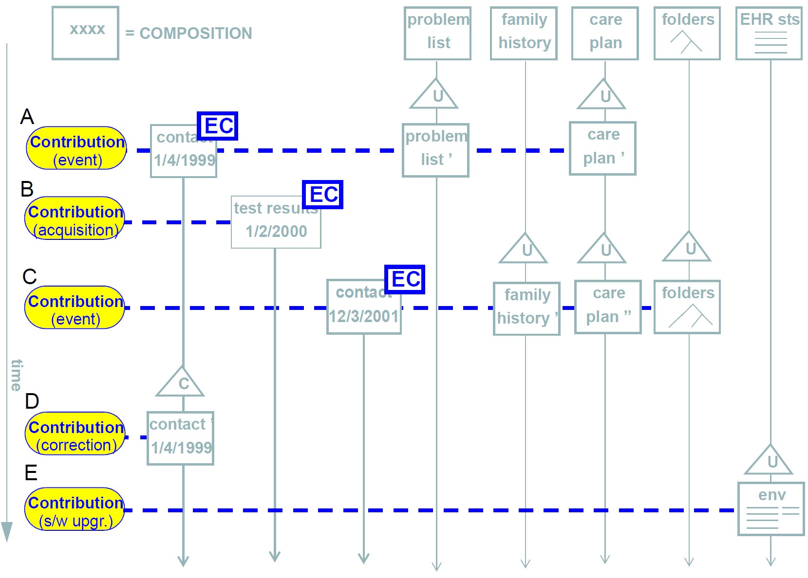

在对没有事件上下文的记录做出贡献的情况下，来自原始提交的任何组合的Event上下文将保持完整和可见（除非当然是对事件上下文本身的校正），并且将正确地反映以下事实：没有发生新的临床相互作用。这是图中的贡献D的情况。

持久化合物没有事件上下文。

##### 时间

记录在Event上下文中的时间表示健康提供者对患者/代表患者进行的遭遇或其他活动的时间。时间表示为强制性开始时间和可选结束时间。假定在存在临床会话（即，存在EVENT_CONTEXT对象）的情况下，开始时间是已知的或可以被合理地近似。非常普遍的是，咨询或遭遇的结束时间没有被记录，而是从例如。平均咨询时间或下次咨询的开始时间为同一医生。

如上所述使用事件上下文，即使在事件发生后很长时间对EHR进行添加，例如当医生在所有患者被看见之后医生在夜间将他/她的记录写入记录系统时发生。在这种情况下，版本化的组合审核跟踪记录输入数据的时间，与临时交互发生时的上下文不同。

##### 参与

是事件上下文的一部分，参与属性可以用于描述谁参与，以及如何。每个参与对象也描述参与的“模式”，例如直接存在，视频会议等。在许多情况下，这样的信息是不感兴趣的，因为任何条目的主题已知（ENTRY.subject）和临床医生将被知道（COMPOSITION.composer），并且通信模式被假定为个人遭遇。因此，当希望记录患者和/或医师如何（例如通过互联网）和/或其他参与者（例如家庭，护士，专家等）进行交互的进一步细节时，使用参与属性。

没有关于谁被包括为参与者的一般规则。例如，虽然在GP访问期间将存在患者参与，但是当临床事件是实验室中的组织测试时，不会记录这样的参与。相反，患者可能在记录中记录一些观察和药物自我管理，在这种情况下，作曲者将是患者，并且不会有临床医生参与。因此，参与的使用将主要是原型驱动的。
医疗设施，位置和环境

health_care_facility（HCF）属性用于记录事件发生的医疗保健设施。这是参与护理事件的护理递送企业中最具体的可识别的（即在卫生系统内具有提供者ID）工作组或护理递送单元。可以使用HCF的识别来确保医疗法律责任。通常，HCF也是身体遭遇的地方，但不是在患者家访，互联网联系或紧急护理的情况下; HCF不应该被认为是一个物理场所，而是作为护理交付管理单位。可以在EVENT_CONTEXT.location中单独记录物理位置。 health_care_facility属性是可选的，以允许临床事件不涉及任何护理交付企业的情况，例如。患者在家中的自我护理，非专业人员的紧急复原（例如，在海滩上的救生员的CPR），由以非官方身份行动的专业人员（飞机上的医生被要求帮助困难的乘客）的护理。在所有其他情况下，它是强制性的。原型用于控制这一点。

两个其他上下文属性完成模型中事件上下文的预定义概念：位置和设置。位置属性记录：护理交付发生的物理位置，并且应当记录合理地特定的可识别位置。例如“床5，病房E”，“家”。此属性是可选的，因为位置并不总是已知，特别是在旧数据中。

设置属性用于记录护理事件的“设置”。在临床记录保存中，已经发现这是一种有用的粗粒度信息分类器。 openEHR术语“设置”组用于对此属性进行编码。它是强制性的，在使其可选将降低其查询和分类的效用的基础上。

### 5.3.组成内容

组合中的数据存储在content属性中。在内容属性中有四种可能的数据结构：

- 它可能是空的。虽然对于大多数情况下，Compostion中应该有内容，但至少有两种情况，空组合有意义：

    - 第一个是处于“草稿”编辑状态的组合（VERSION.lifecycle_state ='incomplete'）

    - 第二种是针对仅仅发生事件的事实感兴趣的系统，但是不想要诸如所谓的临床“事件概要”系统的细节，其可以记录访问医生的事实，但是不包含更多信息。这可以使用具有事件上下文的组合来实现，并且没有其他内容。

- 它可以包含在组合物的原型中定义的一个或多个SECTION;

- 它可以包含一个或多个SECTION树，每个树都是单独的原型结构;

- 它可以直接包含一个或多个ENTRY，没有中间SECTION;

- 它可以是前面三种可能性的任何组合。

运行时组合中使用的实际结构由模板控制，而模板又控制所使用的原型的特定组合。

### 5.4.类描述

#### 5.4.1.组成类

<table>
	<tr>
		<td>类</td>
		<td colspan="2">COMPOSITION</td>
	</tr>
	<tr>
		<td>描述</td>
		<td colspan="2">VERSIONED_COMPOSITION中的一个版本。组合物被认为是记录的修改单位，记录提取物中的传输单位，以及授权临床医生的证明单位。在后一种意义上，它可以被认为等同于签名的文档。</td>
	</tr>
	<tr>
		<td>继承</td>
		<td colspan="2">LOCATABLE</td>
	</tr>
	<tr>
		<td>属性</td>
		<td>签名</td>
		<td>含义</td>
	</tr>
	<tr>
		<td>1..1</td>
		<td>语言：CODE_PHRASE</td>
		<td>编写本作品的本地化语言的强制性指标。从openEHR代码集语言编码。如果与组合不同，条目的语言在ENTRY.language中指示。</td>
	</tr>
	<tr>
		<td>1..1</td>
		<td>领域：CODE_PHRASE</td>
		<td>撰写本作品的地区名称。从openEHR国家代码集编码，这是ISO 3166标准的表达。</td>
	</tr>
	<tr>
		<td>1..1</td>
		<td>类别：DV_CODED_TEXT</td>
		<td>指示此组合物所归类的广泛类别，例如持久的纵向有效性，事件，过程等。</td>
	</tr>
	<tr>
		<td>0..1</td>
		<td>上下文：EVENT_CONTEXT</td>
		<td>该组合物的临床会话上下文，即临床会话的上下文属性。</td>
	</tr>
	<tr>
		<td>1..1</td>
		<td>作曲家：PARTY_PROXY</td>
		<td>主要负责组合物内容的人（但不一定是其进入EHR系统）。这是应该出现在屏幕上的标识符。它可以是也可以不是输入数据的人。当是患者时，将使用PARTY_PROXY的特殊自身实例。</td>
	</tr>
	<tr>
		<td>0..1</td>
		<td>内容：列表<CONTENT_ITEM></td>
		<td>本组合的内容。</td>
	</tr>
	<tr>
		<td>函数</td>
		<td>签名</td>
		<td>含义</td>
	</tr>
	<tr>
		<td></td>
		<td>is_persistent：Boolean</td>
		<td>如果类别是持久类型，则为True，否则为False。有用于查找EHR中的组成，这些组成确保大多数用户感兴趣。</td>
	</tr>
	<tr>
		<td>不变</td>
		<td colspan="2">Category_validity：术语（Terminology_id_openehr）.has_code_for_group_id（Group_id_composition_category，category.defining_code）</td>
	</tr>
	<tr>
		<td></td>
		<td colspan="2">Is_persistent_validity：is_persistent意味着context = Void</td>
	</tr>
	<tr>
		<td></td>
		<td colspan="2">Territory_valid：code_set（Code_set_id_countries）.has_code（territory）</td>
	</tr>
	<tr>
		<td></td>
		<td colspan="2">Language_valid：code_set（Code_set_id_languages）.has_code（language）</td>
	</tr>
	<tr>
		<td></td>
		<td colspan="2">Content_valid：content / = Void意味着不是content.is_empty</td>
	</tr>
	<tr>
		<td></td>
		<td colspan="2">Is_archetype_root：is_archetype_root</td>
	</tr>
</table>

#### 5.4.2. EVENT_CONTEXT类

<table>
	<tr>
		<td>类</td>
		<td colspan="2">EVENT_CONTEXT</td>
	</tr>
	<tr>
		<td>描述</td>
		<td colspan="2">记录涉及护理主题和卫生系统的医疗保健事件的上下文信息。这里记录的上下文信息独立于记录在版本审计中的属性，版本审计记录系统交互上下文，即与健康记录系统交互的用户的上下文。医疗事件包括患者联系和任何其他商业活动，例如代表患者进行的病理学研究。</td>
	</tr>
	<tr>
		<td>继承</td>
		<td colspan="2">pATHABLE</td>
	</tr>
	<tr>
		<td>属性</td>
		<td>签名</td>
		<td>含义</td>
	</tr>
	<tr>
		<td>1..1</td>
		<td>start_time：DV_DATE_TIME</td>
		<td>临床会话或其他类型事件的开始时间，在此期间提供者为患者执行任何类型的服务。</td>
	</tr>
	<tr>
		<td>0..1</td>
		<td>end_time：DV_DATE_TIME</td>
		<td>临床会话的可选结束时间。</td>
	</tr>
	<tr>
		<td>0..1</td>
		<td>location：String</td>
		<td>会话发生的实际位置，例如'微生物实验室2'，'家'，'病房A3'等。</td>
	</tr>
	<tr>
		<td>1..1</td>
		<td>设置：DV_CODED_TEXT</td>
		<td>临床会话发生的设置。使用openEHR术语编码，设置组。</td>
	</tr>
	<tr>
		<td>0..1</td>
		<td>other_context：ITEM_STRUCTURE</td>
		<td>其他可选上下文将被原型化。</td>
	</tr>
	<tr>
		<td>0..1</td>
		<td>health_care_facility：PARTY_IDENTIFIED</td>
		<td>事件发生的医疗保健设施。这是护理交付企业中在卫生系统中具有正式标识符的最具体的工作组或交付单位，可用于确保医疗法律责任。</td>
	</tr>
	<tr>
		<td>0..1</td>
		<td>参与：列表<参与></td>
		<td>参与医疗保健活动的各方。这些通常包括医师和通常的患者（但如果临床会话是例如病理学测试，则不包括后者）。</td>
	</tr>
	<tr>
		<td>不变</td>
		<td colspan="2">Setting_valid：术语（Terminology_id_openehr）.has_code_for_group_id（Group_id_setting，setting.defining_code）</td>
	</tr>
	<tr>
		<td></td>
		<td colspan="2">Participations_validity：参与/ = Void意味着不是participations.is_empty</td>
	</tr>
	<tr>
		<td></td>
		<td colspan="2">location_valid：location / = void表示不是location.is_empty</td>
	</tr>
</table>

## 6.内容包

### 6.1.概述

内容包包含CONTENT_ITEM类，所有内容类型的ancestor类以及导航和条目包，其中包含SECTION，ENTRY和相关类型。

### 6.2.类描述

#### 6.2.1. CONTENT_ITEM类

<table>
	<tr>
		<td>类</td>
		<td colspan="2">CONTENT_ITEM（摘要）</td>
	</tr>
	<tr>
		<td>描述</td>
		<td colspan="2">所有具体内容类型的抽象祖先。</td>
	</tr>
	<tr>
		<td>继承</td>
		<td colspan="2">LOCATABLE</td>
	</tr>
</table>

## 7.导航包

### 7.1.概述

导航包定义了层次标题结构，其中所有单独的标题被认为属于“标题树”。每个标题都是类SECTION的实例，在图rm.composition包的左下方可见。

章节提供了作者安排条目的逻辑结构，以及记录的读者的导航结构，无论它们是人还是机器。节在树中建模，每个树包含根节，一个或多个子节以及每个节点上的任意数量的项。可以在运行时通过类型组合单独构建的区段树（例如SOAP标题或物理检查的标题结构），以形成一个大标题结构，如下图所示。

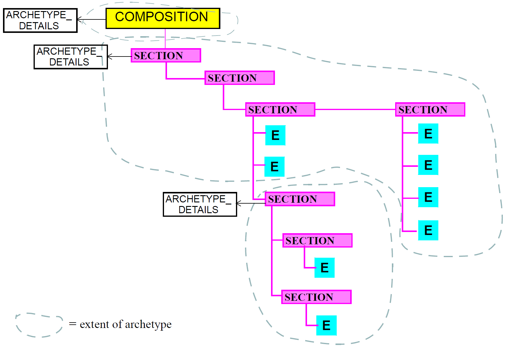

在理解临床数据方面，区段结构在组合中不是必需的 - 它们可以总是被移除或忽略（通常在机器处理中，例如查询），而不失去组合中条目的含义。虽然Sections通常用于根据状态对条目进行分组，例如“家庭史”，“问题”，“观察”，条目本身表示其中所包含的信息的最终类别。在入口及其子类型部分中更详细地解释了该原理。

尽管如此，段结构不必被认为是特别的或不可靠的结构。相反，由于他们的原型，他们的结构可以依赖于同样的方式，记录中的任何其他结构可以依赖于符合其原型。因此，为了查询的目的，可以基于它们的原型对部分进行固定假设。事实上，Sections的主要优点是它们可以通过交互式应用程序或自动化系统为查询提供显着的性能优势。

任何Section结构的一个可能混淆的方面是，当树中的根段在逻辑上是一个Section，它不会作为一个可见的部分显示或打印出来。这是因为人类通常不会写下任何东西的顶级标题，因为总是有一个包含结构作为一个顶级的组织上下文（例如正在写的那张纸）。例如，考虑临床医生在纸上写下问题/ SOAP标题的方式。她写了第一个问题的名称，然后是S / O / A / P标题，然后重复该过程以解决其他问题。但她没有写出一个高于问题水平的标题，即使从数据结构的角度来看必须有一个标题。

### 7.2.类描述

#### 7.2.1. SECTION类

<table>
	<tr>
		<td>类</td>
		<td colspan="2">SECTION</td>
	</tr>
	<tr>
		<td>描述</td>
		<td colspan="2">表示标题结构或部分树中的标题。根据典型的标题，如SOAP，体格检查，还有病理结果标题结构的原型结构创建。不应该使用ENTRY而不是层次结构。</td>
	</tr>
	<tr>
		<td>继承</td>
		<td colspan="2">CONTENT_ITEM</td>
	</tr>
	<tr>
		<td>属性</td>
		<td>签名</td>
		<td>含义</td>
	</tr>
	<tr>
		<td>0..1</td>
		<td>项目：列表<CONTENT_ITEM></td>
		<td>此部分下的内容项目的有序列表，其可以包括：* more SECTIONs * ENTRY</td>
	</tr>
	<tr>
		<td>不变</td>
		<td colspan="2">Items_valid：items / = Void意味着不是items.is_empty</td>
	</tr>
</table>

### 7.3.实例结构

#### 7.3.1.问题/ SOAP标题

表示问题/ SOAP标题结构的段树的示例如下所示。

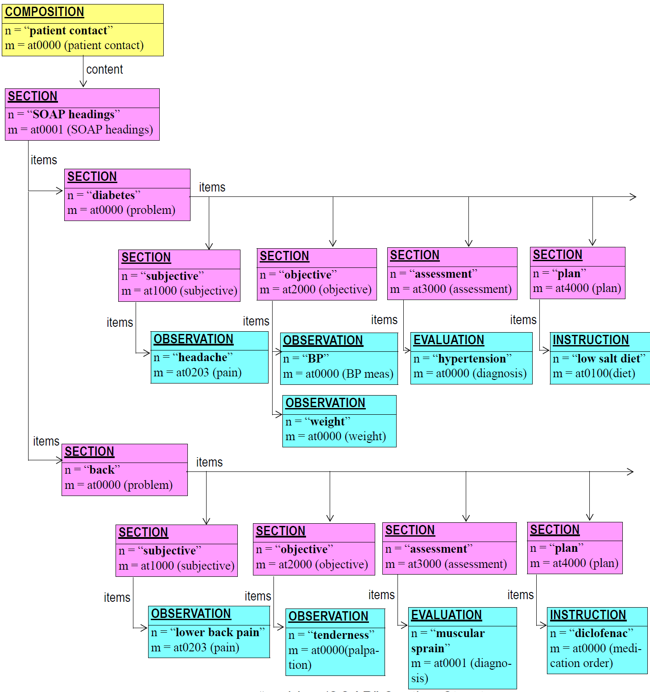

## 8.入学包

### 8.1.设计原则

#### 8.1.1.信息本体

在openEHR健康记录中创建的所有信息都表示为条目包中类的实例，包含ENTRY类和后代数。 ENTRY实例在逻辑上是单个“临床陈述”，并且可以是单个短的叙述短语，但也可以包含大量的数据，例如，微生物学结果，精神病学检查，复杂处方。在临床内容方面，Entry类在openEHR EHR信息模型中是最重要的，因为它们定义了记录中所有“硬”信息的语义。它们的目的是原型，事实上，Entries的原型构成了定义的绝大多数重要的临床原型。

进入包的设计基于临床研究者记录过程和本体，在[Beale_Heard_2007]中描述。过程如下图所示。

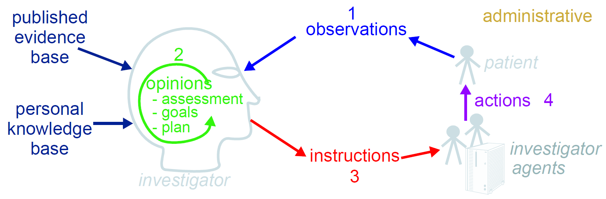

该图显示了由“临床研究者系统”进行的迭代的问题解决过程创建的信息循环，该临床研究者系统由健康护理者组成，并且可以包括患者（在患者进行观察或治疗活动的时间点）。从患者（图右侧）开始观察，这导致调查者的意见，包括评估当前情况，未来情况的目标以及实现目标的计划。个人和公开的证据和知识几乎总是在这个过程中发挥重要的作用。后者导致的指令旨在帮助患者实现目标。复杂或慢性问题可能需要多次迭代 - 可能是整个生命的价值 - 每一步都相当小，未来的步骤很大程度上取决于过去的进步。研究者（和相关试剂）的作用通常由医疗保健专业人员填写，但也可由患者或患者的监护人或伴侣填充。事实上，这是每次一个人从药房回家，使用处方药在家里发生的事情。

图中所示的过程临床研究者记录过程是Weed（[Weed_1969]）的“问题导向”方法和Elstein等人[Elstein_1987]描述的临床推理的“假设 - 演绎模型”的综合。然而，正如[Elstein_Schwarz_2002]中所指出的那样，假设和测试不是临床专业人员唯一成功的过程 - 证据表明，许多人（特别是那些老年人和更有经验的人）依赖模式识别和直接检索以前使用的计划类似患者或原型模型。研究者过程与两种认知方法兼容，因为它不说明如何形成意见，也不意味着任何特定数量或大小的迭代使过程得出结论。因此，openEHR信息模型不强加任何过程模型，只使用所使用的信息类型。

在这个过程的基础上，开发了一个临床研究者记录本体[Beale_Heard_2007]，如下所示。从这个本体，Entries的openEHR类模型是派生的。 openEHR条目类名称注释在它们的原始本体类别旁边。

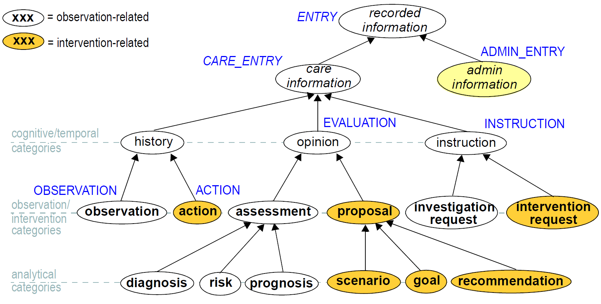

本体中的关键顶级类别是“关心信息”和“管理信息”。前者包括可能在护理过程中的任何时间记录的所有语句，并且包括主要子类别“历史”，“意见”和“指令”，它们自身对应于过去，现在和将来的时间（ISO TC215使用术语“回顾性”，“当前”和“预期”）。行政信息类别包括不由护理过程本身产生的信息，但涉及组织它，例如约会和录取。这个信息不是关心，而是关于正在交付的护理的物流。与观察和理解的患者系统相关的类别显示为白色气泡，而与介入患者系统相关的类别显示为阴影。意见类别具有被动分析和主动干预的特点。

使用本体的两个关键理由在于临床研究者记录（CIR）本体作为类设计的基础。首先，尽管本体中的所有类别都有时间，地点，身份，原因等“上下文”属性的含义，每个类别对于这些属性有不同的结构。例如，观察类别中的时间具有线性历史结构，而在指令中，时间具有分支，潜在的循环结构。类型的分离允许根据类型来对这些上下文属性进行建模。其次，类型的分离提供了对所谓的临床语句值的“状态”或“意义修改”问题的系统解决方案，如下所述。

#### 8.1.2.临床报告状态和否定

在临床信息记录中的一个公知问题是分配“状态”的问题，包括诸如“P的实际值”（P代表一些现象），“P的家族史”，“P的风险”的P“，以及任何这些的否定，即”不/没有P“，”没有P的历史“等。对这些所谓状态的正确分析[4]表明它们根本不是”状态“ ，但是根据本体的不同类别的信息。这里提到的公共语句类型映射如下：

- 实际值P→观测值（P）;

- 否/不是P→观察（排除的P或P类型，例如过敏）。

- 家族史P→评估（该患者有P的风险）;

- 没有家族史P→评价（P是排除风险）;

- 风险P→评估（该患者处于P的风险）;

- 没有P→评估的风险（该患者不处于P的风险）;

- 恐惧P→观察（FEAR，在描述中提到P）;

通常，通过对适当的条目类型使用“排除”原型来处理上述类型的否定。例如，可以使用评估原型来建模“无过敏”，该原型描述了对于该患者排除哪些过敏。

另一组可能在没有正确建模信息类别的系统中混淆的语句类型涉及干预，例如， “髋关节置换（5年前）”，“髋关节置换（计划）”，“髋关节置换（下星期二上午10点订购）”。在这里也去除了模糊性，使用正确的信息类别，例如， （我代表干预）：

- 我（远在过去/未管理/被动记录）→观察（我在病人中）;

- 我（最近过去）→行动（我已经完成/为病人）;

- I（建议）→评估，子类型建议（我建议/可能为病人）;

- 我（指令）→指示（对于患者在将来某个日期的指示）。

与临床状态的问题相关的是需要区分在当前已经做出的诊断与在过去进行的并且由患者报告的诊断。在openEHR中，诊断以及所有意见类别类型被建模为评估，而不考虑它们何时被创建。用于诊断和其他意见的时间信息仅在评估原型中处理，使得在15年前做出的诊断（例如糖尿病）具有与EHR实际操作期间相同的状态，并且患者在使用它的医生的护理下。意见类别的原型往往有很多次，包括“时间首先注意到”，“发生时间”等。

通过使用被设计成将特定种类的临床语句映射到特定ENTRY子类型的原型来促进来自本体的类别的正确使用。在一个系统中，因此条目被模型化，没有错误地识别各种条目的危险，只要条目子类型，时间和确定性/否定被考虑。

#### 8.1.3.标准临床数据类型

常用的临床信息类型可以使用openEHR Entry类型直接表示。如openEHR EHR IM中所述，识别两种组合：持久性和事件。持久性类型对应于长期表征患者的信息，并且由临床医生维护 - 其可以被认为是患者的代理“模型”。以下大多数是属于持久性构成内的入口级数据的示例：

- 基本信息（dob，性别，身高，体重，怀孕等）：记录为观察和/或管理;

- 问题列表：维护为一个或多个评估，它们本身由临床医生根据记录中其他地方进行的观察而生成;

- 药物列表：源自记录中的说明和操作。动作的状态允许药物显示为过去，当前，暂停等。

- 治疗预防（过敏和警报）：记录为各种评估（不良反应基本上是一种诊断）;

- 患者偏好：记录为评价（因为它们作为某些药物或治疗的禁忌症）;

- 患者同意：记录为Admin_entry的实例;

- 家史：

    - 家庭成员的实际事件/条件被记录为观察结果（例如，父亲在62死于MI）

    - 患者风险使用评估表达，通常包括家族史原因。

- 社会历史/情况：当前和以前的社会情况（例如在护理，喂养细节，睡眠安排）记录为观察。

- 生活方式：有各种观察原型记录生活方式，包括运动，吸烟/烟草，酒精，药物使用等。

- 疫苗接种记录：疫苗接种是一种说明;实际上已经给予的疫苗作为记录中的动作。

- 护理计划：目标，目标（评估），监测，教育（说明）等的组合在护理计划部分层次结构中。

剩余的绝大部分剩余临床信息记录在事件内，并包括以下内容：

- 实验室结果包括成像：记录为观察;

- 身体检查：记录为观察员预约，入院和出院：记录为Admin_entry

- 处方：一个或多个药物订单（每一个是指令）在处方部分结构内，在处方成分内。

- 推荐：记录为指令（即由另一个提供者提供护理的请求）。

上述概念是根据OpenEHR中Entry和其他参考模型类型的原型定义的;因此它们的定义与参考模型完全分离。

#### 8.1.4. EHR中的人口统计数据

openEHR的一般方法是为了隐私（在某些情况下由国家立法要求）和分离的数据管理的利益，将人口统计学（特别是患者识别信息）与健康记录完全分离。因此，人口统计IM定义人口统计信息。然而，没有什么可以防止在EHR中出现某些人口统计信息，并且在一些情况下这是可取的。这种情况的两个主要情况是：

- 临床相关的患者信息，如年龄，性别，身高，体重，眼睛颜色，种族或种族，职业;

- 健康护理提供者个人和组织的标识符和/或名称可以直接存储在EHR中，而不管在人口统计系统中是否还存在关于这样的实体的更多的已删除信息。

在openEHR人口统计信息模型中定义了旨在用于单独的openEHR人口统计服务（本身通常是现有医院主患者指数或类似物的前端）的所有信息的模型。

8.2.条目及其子类型

Entry模型由composition.content.entry包定义，如下面的UML图所示。 ENTRY子类型的选择基于图中所示的本体论临床研究者记录（CIR）本体及其相关模型。然而，名称不完全一致，原因有很多。首先，层次中的类别名称基于哲学/科学调查模型来选择，并且反映用于术语含义的语言规范，而这里使用的类名称反映这些术语的常规健康计算和临床使用（即名称这将对健康领域的软件开发人员有意义）。这两种文化中的名字并不总是一致的。此外，对于诸如意见和指令的类别，本体（例如评估，目标和计划）中示出的子类别太可变以在软件中安全地子类型化，并且仅在原型级别上区分。在形式模型中仅使用这些本体论组中的每一个的单个类。使用不同的名称和略微简化的映射没有阻止忠实地实现模型的语义。模型类在以下小节中描述。

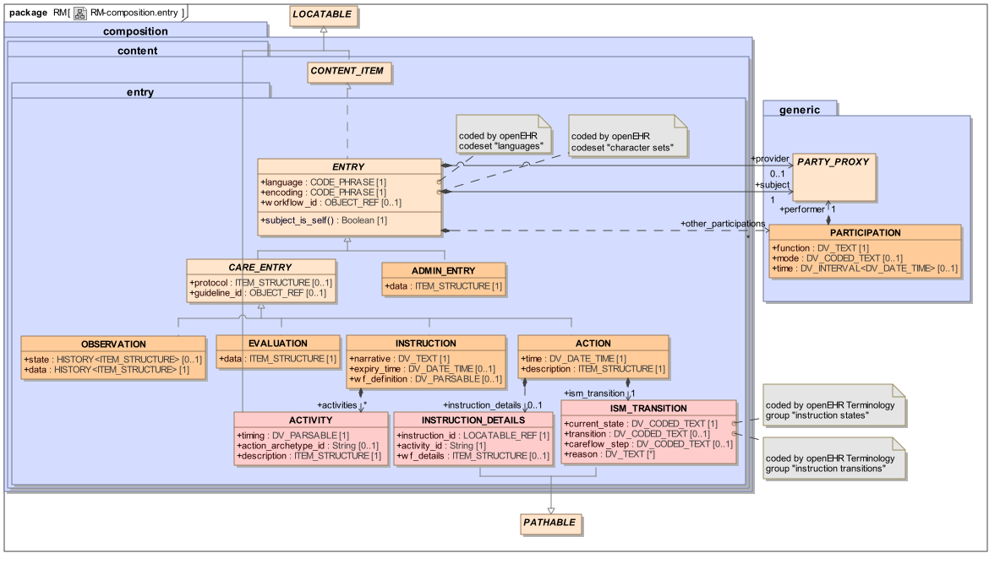

#### 8.2.1. Entry类

所有条目都有一些共同的属性。语言和编码属性指示如何在语言学和字符集级解释条目内的所有文本数据。通常，语言在整个条目（如果不是合成）中将是相同的，但是在不是的情况下，DV_TEXT的可选语言属性可以用于覆盖封闭ENTRY（或其他包围结构，如果在某些其他上下文中使用DV_TEXT）。字符编码可以通过DV_TEXT中的编码属性以相同的方式覆盖。

所有Entry子类型通用的其他属性如下：

- subject：此属性将Entry的主题记录为PARTY_PROXY的子类型的实例。当这是记录主体（即患者）时，该值是PARTY_SELF的实例。否则，通常是家庭成员，性伴侣或记录主体的其他熟人。它也可以是器官捐献者。后者以PARTY_IDENTIFIED或RELATED_PARTY实例的形式表示，其描述关系的种类，并且可选地标识人口统计实体。

- subject_is_self：当条目关于记录主题时，便利函数返回True。

- provider：提供信息的代理。这通常是患者或临床医生，但可以是其他人，或软件应用程序或设备。如果需要记录提供者的参与细节（例如通信模式），则应在EVENT_CONTEXT.p会议中记录一次细节。 provider属性是可选的，因为它通常隐含在记录的信息中。

- other_participations：为此条目存在的其他参与，例如。在INSTRUCTION中服用药物的护士;仅在需要记录信息主体和信息提供者之外的参与者的情况下才需要。

注意，这里使用的术语“提供者”不应与在许多讲英语的国家中使用的更具体的保健术语相混淆，意思是“医疗保健提供者”，其通常被理解为医生或医疗保健递送企业，例如医院。在这里的模型中，它仅仅意味着在条目的上下文中的“信息的提供者”。信息提供者是可选的，并且在许多情况下不会被记录，因为从作曲者和包含的合成的其他部分将是显而易见的。在许多情况下，记录提供者是不明智的，例如。在最平凡的情况下，GP询问“它在哪里疼”，患者说“在这里” - 在这种情况下，它只能被认为是相互的。仅当组合的作曲者确实需要指定特定语句的来源时，才需要使用它，例如在以下情况下：

- 信息提供者特别对入口数据负责（它们是他们的意见，他们的决定，他们进行测试等） - 他们可能还需要证明它;

- 信息提供者是权威来源，或者已经从独特视角（例如配偶/护理者对患者的功能健康状态或精神状态的观点）提供信息;

- 信息提供者的观点可能不反映共识（例如，不是由作曲家持有的患者观点，父亲和母亲之间关于儿童睡眠模式的描述的差异）;

- 信息提供者不是组合级参与者（例如外部信息提供者，例如在遭遇期间被电话呼叫以提供实验室结果的人，或自动测量设备或决策支持软件组件）中的一个。

#### 8.2.3.观察

OBSERVATION类的实例记录对与患者有关的任何现象或状态的观察，包括病人对医生所告知的病理结果，血压读数，家族史和社会情况，患者对医生问题的回答身体检查和对心理评估问卷的反应。观察结果与行动的区别在于行动是干预，而观察记录只记录与患者情况有关的信息，而不是对他/她所做的。

观察的重要信息用“数据”，“状态”和“协议”表示。第一个被记录在data属性中，定义如下：

- data：正在记录的实际数据;以事件历史的形式表达，其中每一个可以是其自身权利的复杂数据结构，例如列表，表，单（值）或树。实例包括血压，心率，ECG踪迹。

状态信息可以记录在Observation的状态属性中，或者记录在Observation数据属性中的每个Event的状态属性中（更多详细说明见下文和数据结构IM）。 Observation中的state属性定义如下：

- 状态：关于正确解释数据所必需的条目的主体的状态的任何特定信息，其在健康记录中是未知的（即诸如患者是女性，怀孕或正在进行化疗的事实）。例如，暴露水平（休息，马拉松后...），位置（躺，站立），葡萄糖后挑战等。 state属性的形式与data属性的形式相同：ITEM_STRUCTURE的EVENT的HISTORY。

继承的协议属性定义如下：

- 协议：如何进行观察的细节，其可以包括特定的临床方案（例如用于跑步机运动ECG的Bruce方案）和/或关于其它观察方法的仪器的信息。该信息总是可以从用户界面中安全地省略，即，对数据的解释没有影响。

观察数据的详细语义在以下小节中描述。

##### 观察时间

许多健康信息模型将观察时间表示为具有诸如'observation_time'，'activity_time'等名称的一个或多个属性。 openEHR模型通过在data_structures.history包中定义的历史/事件结构中建模历史时间，从而脱离了这一点。简而言之，这个包定义了HISTORY类的一个origin属性，以及一系列EVENT实例，每个实例都包含一个时间属性。瞬时和间隔事件通过EVENT子类型POINT_EVENT和INTERVAL_EVENT进行区分;间隔事件的width属性设置为间隔的持续时间。

##### 历史的有效内容

这里描述的观察模型的目的之一是以相同的方式表示测量协议不变的单个样本和基于多样本时间的数据。它不适用于不同人，不同仪器或数据收集技术中的任何其他差异所进行的“粗略”时间的测量。在这些情况下，使用单独的，通常单样本历史，通常发生在不同的容器对象中（例如在EHR中的不同组合物）。

因此，在一般实践设置中，HISTORY的使用将对应于在临床会话期间（即，在患者接触期间）发生的测量序列。在医院环境中，护士的观察可能以4小时为间隔发生，并且没有明确的临床会话 - 在发作期间只是一系列的ENTRY。在这里可能有两种方法。

- 如果每个观察一旦作出就致力于EHR，结果将是时间上不同的组成，每个具有其对应于护士存在的时期的event_context。每个组合物将包含一个或多个观测值，每个观测值在其数据中包含测量的生命体征的一个样本的历史。

- 如果观察不是立即被承诺到EHR，而是存储在其他地方，并且仅在每天结束时提交（假设），则结果将是单个组合，其event_context对应于总数据收集时段，并且其包含观察数据是表示在一天中进行的多个测量的多事件历史。

基于时间的数据是否保持在记录之外，直到一系列期望的长度被收集或者在其发生时输入，这取决于应用和系统的设计;所采取的方法应该基于所讨论的系统中的数据的期望可用性。例如，如果写入适当的成分，它必须在EHR中可见，那么它应该在每个相关成分中表示为历史;如果它仅需要在某个非常晚的时间点可用（例如，因为已知没有人但是治疗临床医生对它感兴趣），则它可以存储在另一个系统中，直到收集到足够的项目用于提交EHR。
事件时间的临床语义

在大多数情况下，记录在历史（HISTORY.origin和EVENT.time，width）中的时间可以被认为是“观察到的现象是真实的时候”。例如，如果对于12 / feb / 2005 12:44:00记录88bpm的脉冲，则这是心率（其中脉冲是代理）存在的时间。在这种情况下，采样时间和测量时间是一样的。

然而，在采样时间与测量时间不同的情况下，语义更加微妙。有两种情况。第一个是采集样品（例如针活检中的组织样品），并且稍后测试，但是从测试的观点来看，时间延迟没有差别。这可能是因为样品立即保存（例如冷冻，置于无菌厌氧运输容器中），或者因为即使以某种方式衰变，对测试没有区别（例如细菌可能死亡，但这没有差别到PCT分析，只要生物物质没有被物理破坏）。

第二种情况是当样品以某种方式衰减时，延迟是相关的。大多数这种情况是在病理学测试中，其中正在测量活的生物有机体（例如厌氧细菌）的存在。必须记录采样时间（或“采集”时间）。根据测试的时间，结果可能会有不同的解释。

关键问题是：在这些情况下，HISTORY.origin和EVENT.time属性的含义是什么？很容易说，他们的价值观（正如在其他情况下）只是实际的观察行为的时代，例如。显微镜，色谱法等。然而，这有两个问题。首先，并且最重要的是，所有物理样本必须被理解为对于在采样时患者状态的某些方面的间接替代，其不能通过可以采用脉冲的方式的直接，瞬时方式来观察。这意味着，无论何时实验室工作完成，结果应用的时间是采样时间。实验室要考虑时间延迟和样品衰变的影响，以提供正确指示采样时患者状态的测试结果。当实验室测试实际发生时，考虑到患者处于昏迷或死亡的极端情况（可能是由于与正在测试的问题完全无关的原因）时，这种常识是清楚的;然而，测试结果指示在采集样品时的时间点，即当患者存活时的情况。第二个原因是某些类型的测试本身很长。例如，真菌标本需要4-6周以确认阴性结果;将每天或每周检查以找到正增长。然而，实验室报告的结果数据（因此观察结果）与实验室测试的时间无关;报告为从患者收集标本的时间的结果。

因此，openEHR中的HISTORY.origin和EVENT.time属性的含义总是采样时间。如果样本和测量时间之间的延迟存在并且很重要，则在观测的协议部分注明;这样的时间被建模在适当的原型，并在结果中考虑。

##### 两种记录状态

状态信息是可选的，如果数据本身有意义，则不需要。如果它被记录，它可以作为它自己的历史（即使用上述的OBSERVATION.state属性），或者作为OBSERVATION.data历史中的EVENT实例内的状态值。这两种方法在不同的情况下都有用。单独的状态历史更可能用于相关性研究，例如关于特定类型的运动的心率的运动医学研究。在该方法中，状态信息是事件的历史，其时间和宽度不需要与数据属性中的历史的那些匹配。在该方法下的状态数据通常以绝对术语表示对象的状况，即它们是关于对象在某些时间点的状态的独立语句，诸如“在跑步机上10km / h，10°倾斜行走”。

另一种方法将用于大多数一般医学中，例如。用于记录经历葡萄糖耐量试验的患者的禁食和后葡萄糖攻击状态。 （有关更多详细信息，请参阅数据结构信息模型）。存储在数据历史内的状态值表示在历史内的事件发生时通常与其相关的主体的情况，例如“后8小时快速”。在独立状态历史中记录后一个示例将需要8个小时的事件，称为“快速”。后者在技术上仍然是正确的，但对大多数临床医生来说是非常不自然的。下图说明了两种记录状态的方法。

#### 8.2.4.评价

根据[Beale_Heard_2007]中描述的本体，意见类别涵盖了一些具体的概念，如下。

- 问题/诊断：为了确定和管理治疗的目的，将已知诊断或问题标签分配给患者中的一组观察到的体征和症状。医师通常包括初始发病的日期，临床认可的日期，最后发生的日期，最后发生的解决的日期以及可能的其他时间信息。

- 风险评估：对某一事件发生或条件出现的可能性和时间的评估。

- 情景：如果进行某种干预，对结果的意见。

- 目标：目标的语句，以及达到目标的时间。

- 建议：基于诊断，对患者建议的护理方法的一般性描述;包括用于活动的各种时间或时间段，例如监测，服用药物和复查。

在openEHR中对这些概念建模的方法主要基于用于评估的原型的开发，例如“诊断”（各种类型），“目标”，“不良反应”，“警报”，“排除”，“临床概要” ，“基于家族史的风险”等。经验表明，意见类别过于可变，无法在参考模型中直接对其子类别进行安全建模。相反，单个类EVALUATION用于意见类别的所有实例。 （评估名称已在openEHR中存在多年，并因为连续性原因而保留）。

EVALUATION类的设计非常简单。除了继承自ENTRY和CARE_ENTRY的属性之外，它只有一个属性，数据：ITEM_STRUCTURE。该结构旨在构建原型以便模拟“意见”类别中的任何特定临床信息的所有细节。不包括时序属性，因为没有与创建或捕获评估信息本身相关联的时间，仅包括在信息中的时间。通常意义的唯一时间是（潜在地）在其中创建评估的患者咨询的时间（记录在COMPOSITION.event_context.start_time_和end_time中）和递交到EHR系统的时间（记录在VERSION.commit_audit属性中） 。

继承属性的一般含义与所有条目一样。在评估中，提供者几乎总是医生，而协议可用于指示如何进行特定评估。 other_participations属性不太可能用于表示诊断的评估，因为诊断通常是医生部分的思考的结果;但例外情况是案例会议或使用专家系统。然而，复杂患者的计划可能由多个医生构建。

#### 8.2.5.指导和行动

openEHR中的指令指定将来要执行的操作。它们不同于本体中的意见子建议子类别中的信息（即类模型中的评估实例），因为它们被足够详细地指定为直接制定而无需与指令设计相关的进一步的临床决策，例如，它们可以由患者或护士执行。在指令执行期间可以做出的任何决定受指令本身约束（例如剂量范围;如果不良反应暂停）或者被假定为对预期执行者的知识。例如，评价可以说“口服皮质类固醇以200l / m 2的峰值流量指示”。相应的指令将指示实际药物，途径，剂量，频率等。可以合理地预期知情的患者能够在他/她的GP解释的剂量指南内改变他或她自己的剂量。

在图中所示的本体临床研究者记录（CIR）本体中，指令被进一步分类为调查和干预。然而，对于评估，只有一个键类别INSTRUCTION用于建模所有类型的指令类别，原型定义指令的细节。第二个Entry子类型ACTION用于对由于一些代理执行指令而记录的信息建模。

以下小节详细描述了指令和动作。

##### 要求

指令和动作类设计满足以下要求：

- 从简单的药物订单到复杂的多药物课程的各种干预应该使用相同的模型表示;

- 指令应该总是具有叙述性表达，在将使用自动化的情况下具有可选的机器可处理表达;

- 自由必须存在，以便根据情况所要求的尽可能详细地对任何特定干预进行建模;

- 临床医生必须能够以他们自己的术语，即使用诸如“开处方”，“分配”，“开始管理”等术语来指定说明步骤;

- 表示不同临床工作流程的指令必须以标准方式查询，以便可以确定患者的“活动”，“完成”等指令;

- 即使它的一部分已经在不同的医疗保健提供者环境中执行，也应该能够提供指令的执行状态的一致的视图;

- 必须有可能在记录中记录特别行为，即没有定义任何指令的行为（至少在所讨论的EHR中）;

- 说明必须与通知/警报服务集成;

- 将支持可互操作的指令的可计算工作流定义的表达式。

##### 设计原则

设计方法基于四个原则。第一个是将作为一个或多个活动的指令的规范与表示作为结果执行的动作的信息区分开。这使得模型和结果信息实例对于软件设计者和数据用户是清楚的。它还使工作流引擎能够确定规范的哪些部分已经被执行，并且允许实际执行的动作与所指定的动作不同。分离是根据INSTRUCTION和ACTION类及其帮助实现的。前者的实例指定指令，而后者的实例描述实际执行的步骤。

第二个原则是使用标准指令状态机（ISM），其为指令的每个活动定义标准化状态和转换，而不管其临床意义。标准化状态的使用意味着任何给定活动的执行状态可以以完全相同的方式（例如，“计划”，“活动”等）来表征，并且因此可以查询EHR并找出所有干预在特定国家的任何种类。 ISM在openEHR中正式建模。指令本身也可以被认为处于从其活动的状态导出的状态。下面给出了这种聚合状态机的非正式描述。

第三原理是提供将任何护理路径过程（即，保健业务过程）中的步骤映射到指令状态机中的状态的方式。护理路径过程涵盖实现指令所需的整个步骤，例如处方，预订，分配，引用，挂起等。当执行任何这样的步骤时，使相关指令处于ISM的状态之一。

第四个原则是支持对指令的正式工作流定义的表达，其中需要完全自动化。必须认识到，大多数治疗和药物施用的自动化以及活组织检查等其他干预措施今天很少，并且可能会保持一段时间。这是因为简单的原因，与人类执行相比，自动化大多数任务的成本是禁止的，特别是当指令活动通常可以由已经存在用于其他原因（例如护士护士）的医疗保健专业人员执行时。还必须说，在医疗保健中使用工作流自动化的严肃研究才刚刚开始，并且到目前为止，还没有用于临床工作流的标准模型。在openEHR方法中，建模工作流，这种不确定性以两种方式处理。首先，指令的正式工作流规范是指令和动作类的基本模型的可选添加，并且不需要获得基本级别的可计算性，包括ISM的使用。其次，工作流的形式表达形式是可解析语法而不是对象。这是一个通常适当的设计选择，因为复杂形式主义的最安全和最方便的持久形式是语法形式，而不是解析的细粒度对象形式;这既优化了存储，并允许语法随时间的变化。

##### 模型概述

指令定义根据INSTRUCTION和ACTIVITY类进行建模，具有可选的工作流属性。这两个类携带与指令相关的基本信息，所有正式工作流定义都以INSTRUCTION.wf_definition属性中的可解析语法表示。 INSTRUCTION实例包括指令的描述性描述和ACTIVITY实例的列表。它还包括从CARE_ENTRY类继承的所有属性，包括主题，参与等。

许多说明只有一个活动，通常描述要管理的药物及其时间。一些将具有多于一种药物或治疗，例如用于治疗溃疡的典型的3种药物Losec-HP方案和多药化疗。基本指令模型没有明确尝试指示确切的顺序，串行或并行管理或其他依赖性，因为如何管理药物的知识是相关临床医生已知的和/或包含在公开的指南中。然而，每个活动中的时间信息确实指示“有饭”等的时间，日期和通常规范。通过指示每种药物被施用的日子，时间信息还足以指定三种药物化疗方案。只有当指令由工作流引擎自动化时，才会给出活动图的完整结构。活动实例可能完全不在指令中，在这种情况下，只有叙述将存在。这通常发生在导入的遗留数据本身没有药物的结构化表示。

指令的表示有三种可能的级别，如下图所示。这些是最小的仅叙述级别，由ACTIVITY实例的指令活动的正式表示的级别，以及也可以使用正式工作流定义的级别。预计在可预见的未来，绝大多数开放式的人力资源管理系统将只支持最低和基本的水平。

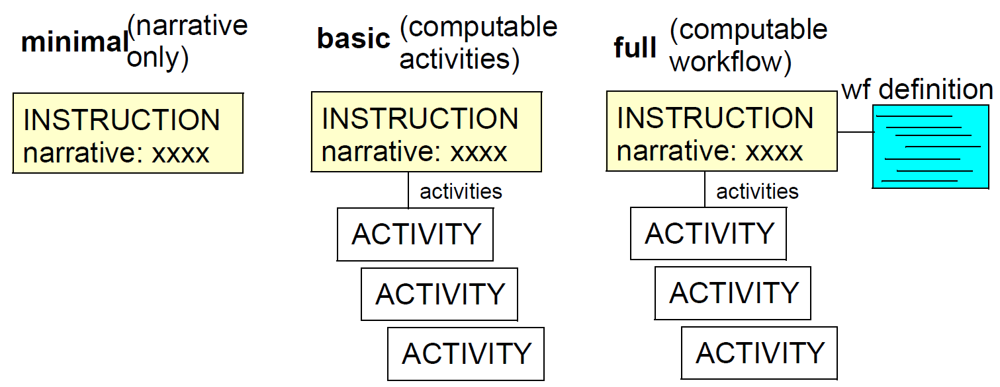

下图说明了指令和活动结构与由于执行指令而创建的Action对象之间的对应关系。 每个活动具有与其逻辑相关联的标准指令状态机，以蓝色指示。 当在ICT支持的环境中执行指导活动中的任何步骤时，应创建一个描述所做工作的ACTION实例并承诺提供给EHR。 在一些情况下，即使没有指示，例如通过自我治疗的患者和护士对患者改变快速反应，也创建特别动作。 对于这样的行动，总是有健康专业人员理解的名义活动。

所有ACTION包括继承的CARE_ENTRY属性，执行时间，执行的描述以及指示活动状态（无论在指令中是否显式）的ISM_TRANSITION对象。因此，活动的当前状态不在ACTIVITY实例中，而是在该活动的最近ACTION实例中。

如果动作确实对应于指令，它还将包括INSTRUCTION_DETAILS实例，其指示哪个指令被执行的活动，包括工作流执行细节（如果相关）。

在该方案下，可以通过查询来确定对患者发生的每次干预的状态，而不管是否存在明确的指令。

请特别注意，操作通常在不同的提供者位置或家庭中执行，而不是负责指令的提供者组织。给定指令的动作对象因此可以容易地出现在多个健康记录系统中。
标准指令状态机（ISM）

当活动定义的干预在临床环境中展开时，EHR用户想要知道诸如以下内容：

- 患者的指令的当前状态是什么？

- 病人的活动当前步骤是什么？

- 对于给定的患者，什么活动计划，活动，暂停，完成？

- 对于患者群体，每个特定工作流程的状态（例如召回）是什么？

这里选择支持这种功能的方法是定义标准指令状态机，其状态转换可以被映射到特定护理路径的步骤，使得其能够用作用于指示任何活动的状态的描述性设备。指令的状态是从组成活动的状态算法确定的，如下所述。状态机如下图所示。

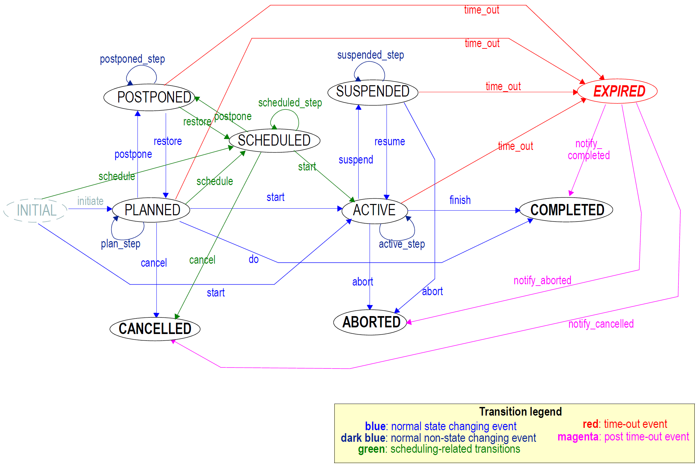

这种状态机是临床工作流程和行为管理系统的长期经验的结果。状态如下（注意：SCHEDULED状态受[Van_de_Velde_Degoulet_2003]的启发，图5.5）。

初始: 初始状态，在计划活动（状态机的可计算表示的默认开始状态）之前。

计划: 该动作已经被描述，但是还没有被执行。

POSTPONED: 该动作没有被执行，并且将不满足特定条件。具体地，将通常“激活”指令的事件和条件将被忽略，直到恢复事件发生。

- 计划: 该动作将在某个指定的未来时间执行，并且已经在调度系统中预订。

- 取消: 该操作已定义，但在执行之前被取消。

- 活性: 该动作是根据其定义执行的。药物或治疗的整个过程对应于该状态。

- SUSPENDED: 操作已开始，但已暂时停止，并且将不会重新启动，直到显式恢复。

- 停止: 行动开始，但在正常完成之前被永久终止。

- 完成: 行动开始并正常完成。

- 已过期: 行动可能相关的时间已经过期;该操作可能已完成，已取消或从未发生。

状态CANCELLED，ABORTED和COMPLETED都是终端状态。 EXPIRED状态是伪终端状态，由于在事实之后接收到信息（例如，患者报告他们确实完成了一系列抗生素的过程），允许转换进入任何真实终端状态。然而，在EHR中很可能在许多简单药物的说明书将在EXPIRED状态完成并保持在那里。

转换在大多数情况下是不言自明的，但有几个值得注释。开始和结束事件对应于当主管不是瞬时的情况，如大多数药物的情况。 do事件等效于在开始事件之后立即发生的完成事件，对应于瞬时管理，其完成使活动处于完成状态。单次疫苗接种或患者服用单一片剂是典型的实例。状态PLANNED，POSTPONED，ACTIVE，SUSPENDED各自具有将状态机返回到相同状态的xxx_step转换。不将转换的工作流步骤映射到这些事件，并且因此使指令处于相同状态。一个例子是药物审查，如果医生选择继续，将使药物处于活动状态。

在将来，如果需要将指令委派给另一指令，则可能需要支持在先前的指令状态机的活动状态内嵌套新的指令状态机。

状态机状态和转换名称分别在openEHR术语组“指令状态”和“指令转换”中定义。

##### 指令聚合状态

指令中的每个活动构成了某种临床可识别的药物或治疗，而指令通常对应于设计用于治疗整体问题的治疗的分组或组合。 因此，该指令可以被视为具有从活动的状态导出的聚合状态，如下图所示。 用于输入每个聚合状态的规则用组成活动的状态来表示。

这种状态机没有在openEHR中正式建模或编码，尽管在应用程序中这样做是有用的。

##### Careflow过程到状态机映射

从卫生专业人员的角度来看，医疗工作流程或“护理流程”包括旨在满足一个或多个目标的步骤和事件。这些步骤高度依赖于特定类型的工作流程，并且通常以相关种类的临床专业人员熟悉的术语命名，例如“处方”，“书”，“暂停”等（注意，其中一些名称可以与ISM转换相同，但是可以或可以不指示相同的事物）。然而，健康信息的用户的需要是知道指令的执行处于什么状态，而不管刚刚执行了哪个特定的护理流步骤。这是通过定义特定关注流的步骤与动作原型中的ISM的状态之间的映射来实现的。当执行与特定指令活动相对应的每个动作时，将知道它对应于哪个护理流程步骤以及活动现在处于哪个ISM状态。下表提供了用于英国药品订单工作流程的映射的示例。

<table>
	<tr>
		<td>英国GP</td>
		<td>工作流步骤状态机转换</td>
	</tr>
	<tr>
		<td>开始</td>
		<td>启动（初始→计划）</td>
	</tr>
	<tr>
		<td>规定</td>
		<td>计划的</td>
	</tr>
	<tr>
		<td>分配</td>
		<td>开始（计划→活动）</td>
	</tr>
	<tr>
		<td>管理</td>
		<td>active_step（活动→活动）</td>
	</tr>
	<tr>
		<td>请求</td>
		<td>续订active_step（活动→活动）</td>
	</tr>
	<tr>
		<td>补发</td>
		<td>active_step（活动→活动）</td>
	</tr>
	<tr>
		<td>评论</td>
		<td>active_step（活动→活动）</td>
	</tr>
	<tr>
		<td>完</td>
		<td>完成（活动→完成）</td>
	</tr>
	<tr>
		<td>取消</td>
		<td>中止（激活→中止）</td>
	</tr>
</table>

这样的映射在指令的ACTION原型中指定。当ACTION实例提交到EHR时，ISM_TRANSITION对象记录执行的步骤以及ISM状态和转换。 careflow步骤必须是相应指令的步骤之一。

在ISM_TRANSITION类中提供了可选的reason属性（类型为List <DV_TEXT>），以便能够记录已经发生的步骤的一个或多个特定原因。

以下部分提供了如何使用原型来表示此类映射的详细信息。

##### 与原型的关系

特定指令和操作的大部分语义来自原型。目前，原型用于定义两组指令语义。第一个是在说明（ACTIVITY.description）中定义并在操作（ACTION.description）中执行的活动的描述。对于任何给定的指令，这些描述总是具有相同的形式，并且非常希望具有用于两者的相同原型组件。一个例子是描述药物，通常由描述药物，其名称，形式，剂量，途径等的十个或更多元素的树或列表组成。在指令中需要相同的信息结构，其中它定义了要管理的内容，并在行动中描述所管理的内容。在任何特定情况下，所施用的（例如剂量或途径被改变）可能存在小的差异，即使原型模型对于两者是相同的。

因此，在原型方面，在INSTRUCTION中说两个ACTIVITY的定义（见下面的例子）实际上将创建活动结构的单独原型，每个结构都是ITEM_STRUCTURE的子类型之一（因为这是ACTIVITY的类型。描述和ACTION.description）。原型将被INSTRUCTION原型和ACTION原型使用，通过原型槽机制（即从其他原型组成原型的标准方法;参见下图中的use_archetype语句）。

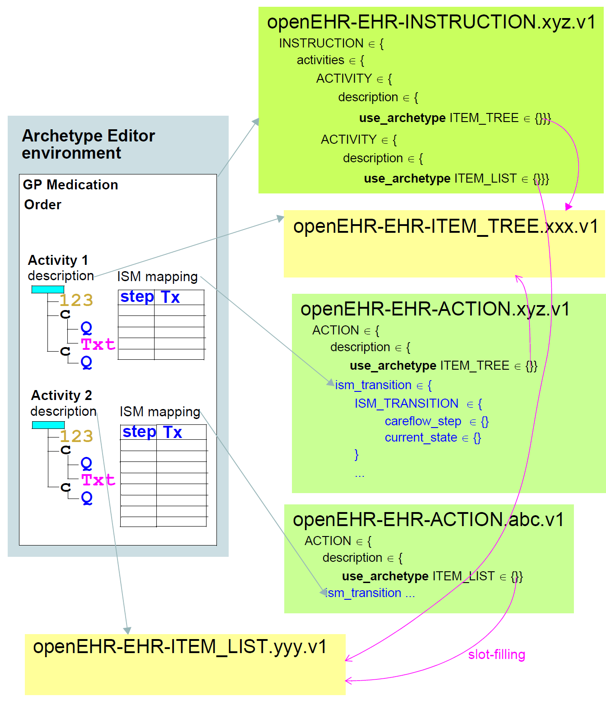

第二类可重写语义是医疗保健业务过程中的步骤与标准指令状态机之间的对应关系，如上所述。此映射是ACTION属性的ism_transition属性的原型，因此定义了ACTION原型的一部分。图说明和操作原型显示了原型编辑器环境中的逻辑原型元素如何对应于生成的原型。

因此，定义特定类型的干预的临床语义的原型集合通常将由ITEM_STRUCTURE类的INSTRUCTION，ACTION和潜在的组件原型的原型组成。

#### 8.2.6.临床工作流定义

临床工作流程存在于从健康系统水平（降低糖尿病成本;管理肥胖）到细粒度（特定患者的哮喘药物处方）的多个层次级别。在所有级别，有目标，演员和任务旨在满足目标。在粗粒度的业务流程级别，工作流可以由多于一个的actor来实施，并且可以包括观察，诊断，指令和动作的整个循环。例如，描述药物订单周围的步骤“规定”，“分配”，“管理”，“重复”，“审查”等的工作流程可以包括GP，药剂师，患者作为参与者。在实际药物或治疗管理的更细级别，通常存在执行特定任务的单个代理或组，通常在一个提供者机构内或在家。在这些不同水平的工作流程与特定患者而不仅仅是患者类别（例如，所有胰岛素依赖性糖尿病患者）之间的对应性通常在更细粒度水平上增加。因此，从自动化的角度来看，可能是细粒度的工作流程，其具有将合理出现在EHR中的患者特异性定义。最典型的药物给药是在这一类。如何在较高级别的组织层次结构中自动化工作流定义被表示并与较低级别的自动化工作流协调已知是一般难以解决的问题，并且考虑到健康计算通常比大多数域更复杂，实施分布式，协调（或“编排“或”编排“，使用工作流社区的术语）临床工作流可能有一些年。

在这种情况下，openEHR中正式工作流定义的可能范围如下：

- 为了能够记录openEHR条目和工作流程执行之间的链接，一个特定的指南。这允许openEHR数据与粗粒度非住院特定工作流程集成。

- 支持药物管理等活动的细粒度正式工作流定义的标准化，可互操作的表示。

- 仅在自动化实际上有用且可能被使用的情况下使用正式的工作流定义。可能值得自动化的工作流类型是那些运行了几天，几周或更长时间的工作流，即人类可能容易忘记执行一个步骤。在这些情况下，工作流系统的输出将提醒人类在某些时间做某些事情，而不是直接机器自动化任务。执行此类工作流定义将在工作人员或其他代理执行的“工作列表”中生成条目。实例包括儿童的哮喘药物管理和PAP回忆管理。

- 确保任何工作流定义考虑到其他现有临床活动，即不尝试定义可能相关的所有活动。一个简单的例子是用于哮喘药物给药的工作流程可能不需要明确地建模峰值流量测量的采用，因为这通常正在发生。

提出临床使用的标准工作流形式主义有各种技术挑战。首先，可执行工作流定义本质上是结构化程序，类似于过程语言中的程序，但是增加了时间逻辑运算符，包括备选路径，并行路径，等待操作，以及对外部数据源和服务的引用。最近在临床工作流建模中的工作。由于需要计算对执行的工作流的潜在修改，包括删除，替换和移动节点，[Müller_2003]，[Baretto_2005]，[Browne_2005]似乎倾向于结构化（即分析树）方法来表示。 （从设计者的角度来看，这种“实时”修改执行工作流是否是现实的可能是有问题的，因为这意味着每个工作流的设计包括在详细级别的每个可能的例外情况。）

其次，将工作流连接到外部世界的需要，即数据源和服务，例如通知和工作列表管理，对于使工作流和指南可实现是至关重要的。这个问题可能是迄今为止所有指南和工作流语言的主要弱点，包括Arden，GLIF和各种工作流语言，如前面提到的那些。

openEHR当前版本在表示可计算工作流中所采用的方法如下。

    在使用的地方，形式工作流定义是用语法而不是结构表示的，因为语法总是对持久性更恰当的表示（正如对象结构，即分析树更适合于计算）。

    对病人数据项的访问在语法中表示为符号查询。

    操作（如对通知服务的请求）表示为符号命令。

在INSTRUCTION类的wf_definition：DV_PARSABLE属性中，工作流的整个定义表示为可选可解析字符串。当前可以使用任何语法。 openEHR基金会正在开发工作流语法，该基金会旨在整合当前工作流模型和研究的相关功能，同时将其集成到openEHR类型系统和原型框架中。特别地，该语法的早期版本将示出如何表达患者数据访问和服务命令。

### 8.3.类描述

#### 8.3.1. ENTRY类

<table>
	<tr>
		<td>类</td>
		<td colspan="2">ENTRY（抽象）</td>
	</tr>
	<tr>
		<td>描述</td>
		<td colspan="2">
<pre>
所有ENTRY子类型的抽象父类。 ENTRY是在临床会话中在临床语句上下文中创建的硬临床信息的逻辑项的根。在临床会话中可以存在许多这样的上下文。观察和其他条目类型只记录在封闭组合物记录的事件中捕获/创建的信息。

ENTRY也是任何查询应该返回的最小信息单元，因为整个ENTRY（包括子部分）记录空间结构，定时信息和上下文信息，以及信息的主体和生成器。
</pre>
		</td>
	</tr>
	<tr>
		<td>继承</td>
		<td colspan="2">CONTENT_ITEM</td>
	</tr>
	<tr>
		<td>属性</td>
		<td>签名</td>
		<td>含义</td>
	</tr>
	<tr>
		<td>1..1</td>
		<td>语言：CODE_PHRASE</td>
		<td>本条目写入的本地化语言的强制指示符。从openEHR代码集语言编码。</td>
	</tr>
	<tr>
		<td>1..1</td>
		<td>encoding：CODE_PHRASE</td>
		<td>此条目中的文本值被编码的字符集的名称。从openEHR代码设置字符集编码。</td>
	</tr>
	<tr>
		<td>0..1</td>
		<td>other_participations：列表<参与></td>
		<td>其他参与ENTRY级别。</td>
	</tr>
	<tr>
		<td>0..1</td>
		<td>workflow_id：OBJECT_REF</td>
		<td>为此工作流程执行的外部保存的工作流引擎数据的标识符，用于此护理主题。</td>
	</tr>
	<tr>
		<td>1..1</td>
		<td>主题：PARTY_PROXY</td>
		<td>该ENTRY的人类受试者的Id，例如：*器官供体*胎儿*家庭成员*另一临床相关的人。</td>
	</tr>
	<tr>
		<td>0..1</td>
		<td>提供商：PARTY_PROXY</td>
		<td>
<pre>
在该ENTRY中的信息提供者的可选标识，其可以是：*患者*患者代理，例如。父母，监护人*临床医生*设备或软件

一般只在记录仪需要使其显式时使用。否则，假设组合作曲家和其他参与者。
</pre>
		</td>
	</tr>
	<tr>
		<td>函数</td>
		<td>签名</td>
		<td>含义</td>
	</tr>
	<tr>
		<td></td>
		<td>
<pre>
subject_is_self：Boolean
Post_condition：结果表明subject.generating_type =“PARTY_SELF”
</pre>
		</td>
		<td>如果此条目关于EHR的主题，则返回True，在这种情况下，主题属性的类型为PARTY_SELF。</td>
	</tr>
	<tr>
		<td>不变</td>
		<td colspan="2">Language_valid：code_set（Code_set_id_languages）.has_code（language）</td>
	</tr>
	<tr>
		<td></td>
		<td colspan="2">Encoding_valid：code_set（Code_set_id_character_sets）.has_code（encoding）</td>
	</tr>
	<tr>
		<td></td>
		<td colspan="2">Subject_validity：subject_is_self隐含subject.generating_type =“PARTY_SELF”</td>
	</tr>
	<tr>
		<td></td>
		<td colspan="2">Other_participations_valid：other_participations / = Void表示不是other_participations.is_empty</td>
	</tr>
	<tr>
		<td></td>
		<td colspan="2">Is_archetype_root：is_archetype_root</td>
	</tr>
</table>

#### 8.3.2. ADMIN_ENTRY类

<table>
	<tr>
		<td>类</td>
		<td colspan="2">ADMIN_ENTRY</td>
	</tr>
	<tr>
		<td>描述</td>
		<td colspan="2">用于管理信息的入口子类型，即关于设置临床过程的信息，但本身不是临床相关的。原型将定义包含的信息。用于录取，发病，病房位置，出院，约会（如果没有存储在实践管理或约会系统）的录取细节。不用于任何临床重要信息。</td>
	</tr>
	<tr>
		<td>继承</td>
		<td colspan="2">ENTRY</td>
	</tr>
	<tr>
		<td>属性</td>
		<td>签名</td>
		<td>含义</td>
	</tr>
	<tr>
		<td>1..1</td>
		<td>数据：ITEM_STRUCTURE</td>
		<td>条目的数据;模型在原型。</td>
	</tr>
</table>

#### 8.3.3. CARE_ENTRY类

<table>
	<tr>
		<td>类</td>
		<td colspan="2">CARE_ENTRY（abstract）</td>
	</tr>
	<tr>
		<td>描述</td>
		<td colspan="2">所有临床ENTRY亚型的抽象亲本。 CARE_ENTRY定义所有临床条目子类型的协议和准则属性。</td>
	</tr>
	<tr>
		<td>继承</td>
		<td colspan="2">ENTRY</td>
	</tr>
	<tr>
		<td>属性</td>
		<td>签名</td>
		<td>含义</td>
	</tr>
	<tr>
		<td>0..1</td>
		<td>协议：ITEM_STRUCTURE</td>
		<td>描述此条目中的信息的方法（即如何）到达。对于OBSERVATION，这是对所使用的方法或仪器的描述。对于评价，如何进行评价。对于INSTRUCTION，如何执行该指令。这可以采取指南的引用形式，包括手动跟踪和可执行;知识参考，如Medline的论文;临床原因在更大的护理过程中。</td>
	</tr>
	<tr>
		<td>0..1</td>
		<td>guideline_id：OBJECT_REF</td>
		<td>创建此条目的指南的可选外部标识符（如果相关）。</td>
	</tr>
</table>

#### 8.3.4. OBSERVATION类

<table>
	<tr>
		<td>类</td>
		<td colspan="2">OBSERVATION</td>
	</tr>
	<tr>
		<td>描述</td>
		<td colspan="2">
<pre>
用于过去或现在的所有临床数据的入口子类型，即（到它被记录的时间）已经发生的入口子类型。 OBSERVATION数据使用类HISTORY <T>表示，这保证了它在时间上的位置。观察用于对现象的观察和患者报告的现象的所有概念上的客观（即以某种方式测量）。疼痛。

不得用于记录任何形式的意见或未来陈述，包括说明，意图，计划等。
</pre>
		</td>
	</tr>
	<tr>
		<td>继承</td>
		<td colspan="2">CARE_ENTRY</td>
	</tr>
	<tr>
		<td>属性</td>
		<td>签名</td>
		<td>含义</td>
	</tr>
	<tr>
		<td>0..1</td>
		<td>状态：HISTORY <ITEM_STRUCTURE></td>
		<td>在观察过程中以可能具有任何复杂性的单独的值的历史的形式可选地记录观察的主体的状态。状态也可以记录在data属性的History中。</td>
	</tr>
	<tr>
		<td>1..1</td>
		<td>数据：HISTORY <ITEM_STRUCTURE></td>
		<td>这种观察的数据，以可能具有任何复杂性的值的历史的形式。</td>
	</tr>
</table>

#### 8.3.5.EVALUATION类

<table>
	<tr>
		<td>类</td>
		<td colspan="2">EVALUATION</td>
	</tr>
	<tr>
		<td>描述</td>
		<td colspan="2">
<pre>
评估语句的条目类型。用于评估其他信息的各种语句，如解释，诊断，鉴别诊断，假设，风险评估，目标和计划的解释。

不应用于可执行的语句，如药物订单 - 这些使用INSTRUCTION类型表示。
</pre>
		</td>
	</tr>
	<tr>
		<td>继承</td>
		<td colspan="2">CARE_ENTRY</td>
	</tr>
	<tr>
		<td>属性</td>
		<td>签名</td>
		<td>含义</td>
	</tr>
	<tr>
		<td>1..1</td>
		<td>数据：ITEM_STRUCTURE</td>
		<td>该评价的数据，以空间数据结构的形式。</td>
	</tr>
</table>

#### 8.3.6.INSTRUCTION类

<table>
	<tr>
		<td>类</td>
		<td colspan="2">INSTRUCTION</td>
	</tr>
	<tr>
		<td>描述</td>
		<td colspan="2">
<pre>
用于指定将来的操作。使得能够表达简单和复杂的规范，包括在可完全计算的工作流形式中。用于任何可操作的陈述，如药物治疗订单，监测，召回和审查。必须提供足够的细节以便由演员（人或机器）直接执行该规范。

不适用于仅以一般术语指定的计划项目。
</pre>
		</td>
	</tr>
	<tr>
		<td>继承</td>
		<td colspan="2">CARE_ENTRY</td>
	</tr>
	<tr>
		<td>属性</td>
		<td>签名</td>
		<td>含义</td>
	</tr>
	<tr>
		<td>1..1</td>
		<td>叙述：DV_TEXT</td>
		<td>强制的人类可读的版本的指令是什么。</td>
	</tr>
	<tr>
		<td>0..1</td>
		<td>expiry_time：DV_DATE_TIME</td>
		<td>可选的到期日期/时间以帮助确定指令何时可以被假定已经过期。这有助于防止错误列出的指令为活动，当他们显然必须以某种方式或其他方式终止。</td>
	</tr>
	<tr>
		<td>0..1</td>
		<td>wf_definition：DV_PARSABLE</td>
		<td>可选的工作流引擎可执行表达式的指令。</td>
	</tr>
	<tr>
		<td>0..1</td>
		<td>活动：列出<ACTIVITY></td>
		<td>指导中的所有活动的列表。</td>
	</tr>
	<tr>
		<td>不变</td>
		<td colspan="2">Activities_valid：activities / = Void意味着不是activities.is_empty</td>
	</tr>
</table>

#### 8.3.7. ACTIVITY类

<table>
	<tr>
		<td>类</td>
		<td colspan="2">ACTIVITY</td>
	</tr>
	<tr>
		<td>描述</td>
		<td colspan="2">定义指令中的单个活动，例如药物管理。</td>
	</tr>
	<tr>
		<td>继承</td>
		<td colspan="2">LOCATABLE</td>
	</tr>
	<tr>
		<td>属性</td>
		<td>签名</td>
		<td>含义</td>
	</tr>
	<tr>
		<td>1..1</td>
		<td>时序：DV_PARSABLE</td>
		<td>活动的时间，以可解析字符串的形式，如HL7 GTS或ISO8601字符串。</td>
	</tr>
	<tr>
		<td>0..1</td>
		<td>action_archetype_id：String</td>
		<td>
<pre>
Perl兼容的正则表达式模式，包含在//'分隔符中，指示与此活动规范对应的操作原型的有效原型标识符。

默认为/.*/，表示任何原型。
</pre>
		</td>
	</tr>
	<tr>
		<td>1..1</td>
		<td>说明：ITEM_STRUCTURE</td>
		<td>活动描述，以原型结构的形式。</td>
	</tr>
	<tr>
		<td>不变</td>
		<td colspan="2">Action_archteype_id_valid：not action_archetype_ids.is_empty</td>
	</tr>
</table>

#### 8.3.8. ACTION类

<table>
	<tr>
		<td>类</td>
		<td colspan="2">ACTION</td>
	</tr>
	<tr>
		<td>描述</td>
		<td colspan="2">用于记录已执行的临床操作，可能是临时的，或由于在指令工作流程中执行活动。每个行动对应于某种或另一种的护理流步骤。</td>
	</tr>
	<tr>
		<td>继承</td>
		<td colspan="2">CARE_ENTRY</td>
	</tr>
	<tr>
		<td>属性</td>
		<td>签名</td>
		<td>含义</td>
	</tr>
	<tr>
		<td>1..1</td>
		<td>时间：DV_DATE_TIME</td>
		<td>此操作完成的时间点。</td>
	</tr>
	<tr>
		<td>1..1</td>
		<td>ism_transition：ISM_TRANSITION</td>
		<td>由此Action引起的指令状态机中的转换的详细信息。</td>
	</tr>
	<tr>
		<td>0..1</td>
		<td>instruction_details：INSTRUCTION_DETAILS</td>
		<td>导致执行此操作的指令的详细信息，如果有一个。</td>
	</tr>
	<tr>
		<td>1..1</td>
		<td>说明：ITEM_STRUCTURE</td>
		<td>描述要执行的活动，以原型结构的形式。</td>
	</tr>
</table>

#### 8.3.9. INSTRUCTION_DETAILS类

<table>
	<tr>
		<td>类</td>
		<td colspan="2">INSTRUCTION_DETAILS</td>
	</tr>
	<tr>
		<td>描述</td>
		<td colspan="2">用于记录导致操作的指令的详细信息。</td>
	</tr>
	<tr>
		<td>继承</td>
		<td colspan="2">pATHABLE</td>
	</tr>
	<tr>
		<td>属性</td>
		<td>签名</td>
		<td>含义</td>
	</tr>
	<tr>
		<td>1..1</td>
		<td>instruction_id：LOCATABLE_REF</td>
		<td>引用指令。</td>
	</tr>
	<tr>
		<td>1..1</td>
		<td>activity_id：String</td>
		<td>教学中活动的标识符，以其原型路径的形式。</td>
	</tr>
	<tr>
		<td>0..1</td>
		<td>wf_details：ITEM_STRUCTURE</td>
		<td>各种工作流引擎状态详细信息，可能包括以下内容：*触发引起此Action的条件（替换为实际变量）; *实际发生的通知列表（所有变量替换）; *其他工作流引擎状态。此规范当前不定义此字段的实际结构或语义。</td>
	</tr>
	<tr>
		<td>不变</td>
		<td colspan="2">Activity_path_valid：not activity_id.is_empty</td>
	</tr>
</table>

#### 8.3.10. ISM_TRANSITION类

<table>
	<tr>
		<td>类</td>
		<td colspan="2">ISM_TRANSITION</td>
	</tr>
	<tr>
		<td>描述</td>
		<td colspan="2">指令状态机中的转换的模型，由护理流程步骤引起。属性记录了护理流程步骤以及ISM转换。</td>
	</tr>
	<tr>
		<td>继承</td>
		<td colspan="2">pATHABLE</td>
	</tr>
	<tr>
		<td>属性</td>
		<td>签名</td>
		<td>含义</td>
	</tr>
	<tr>
		<td>1..1</td>
		<td>current_state：DV_CODED_TEXT</td>
		<td>ISM当前状态。由openEHR术语组编码指令状态。</td>
	</tr>
	<tr>
		<td>0..1</td>
		<td>转换：DV_CODED_TEXT</td>
		<td>发生到达current_state的ISM转换。由openEHR术语组编码指令转换。</td>
	</tr>
	<tr>
		<td>0..1</td>
		<td>careflow_step：DV_CODED_TEXT</td>
		<td>作为产生该动作的一部分发生的护理流程过程中的步骤，例如。分配，开始管理。此属性表示活动的临床标签，而不是表示状态机（ISM）可计算表单的current_state。定义在原型。</td>
	</tr>
	<tr>
		<td>0..1</td>
		<td>原因：列表<DV_TEXT></td>
		<td>可选地，可以添加已经采取的该护理流程步骤的一个或多个原因。例如，在药物管理中可能发生多种原因。</td>
	</tr>
	<tr>
		<td>不变</td>
		<td colspan="2">Current_state_valid：术语（Terminology_id_openehr）.has_code_for_group_id（Group_id_instruction_states，current_state.defining_code）</td>
	</tr>
	<tr>
		<td></td>
		<td colspan="2">Transition_valid：transition / = Void意味着术语（Terminology_id_openehr）。 has_code_for_group_id（Group_id_instruction_transitions，transition.defining_code）</td>
	</tr>
</table>

### 8.4. 实例结构

以下小节介绍了典型的Entry实例结构。 有关如何对特定临床语句进行最佳建模的指导，请参见openEHR知识库[openehr_CKM]的原型部分。

#### 8.4.1. 观察

##### 心率测量系列

下图显示了10分钟内的三次心率测量。

##### 血压与协议

下图说明了使用方案的血压观察。

##### 葡萄糖耐量试验

口服葡萄糖耐量试验采用以下形式，尽管血糖水平的数量和时间在实践中可能略有不同：

 - 挑战：没有卡路里从12pm到上午8点禁食

 - 基准：BSL - 8am

 - 挑战：口服75g葡萄糖 - 上午8:01

 - 基准：BSL - 上午9点

 - 基准：BSL - 上午10点

OGTT被视为单一临床概念，因此只需要一种原型。 典型的实例结构如下图所示。 在该实施例中，三种血糖由EVENT表示，空腹和葡萄糖挑战表示为相关事件的状态。

#### 8.4.2. 评价

##### 部分哮喘管理计划

下图说明了部分哮喘管理计划，其中显示了具有依赖性作用（评估和进入ER）和治疗（支气管扩张剂）的监测（峰值流量）。 在一个完整的计划，症状监测和其他药物可能会显示。 计划的部分通过链接链接到根EVALUATION节点：设置从LOCATABLE类继承的<LINK>属性。

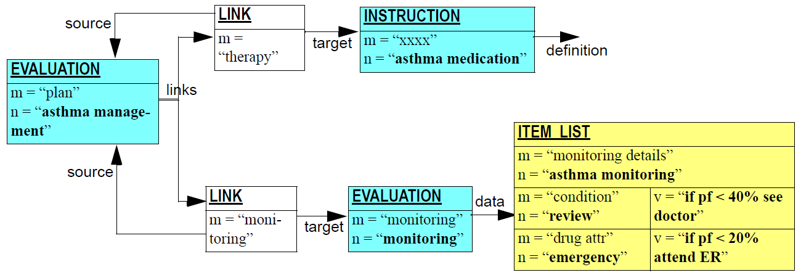

#### 8.4.3. 指令

##### 链式治疗订单

通常，一种药物的药物订单由其中改变路线，形式，频率，剂量等的一个或多个施用细节的段组成。 在医院中，静脉内抗生素和止痛药物之后可以口服相同药物的片剂形式。 其他示例在一般实践中是常见的，例如以下顺序：

- 商品名= Panafcortelone; 通用名=泼尼松龙 form = tablet; 剂量= 25mg; route = oral; freq = bd x 3天; od x 2天。

下图说明了本指令的实例结构。 请注意，ACTIVITY实例的时序属性以人类可读的形式显示; 实际上它将是一个GTS字符串或类似的（见openEHR数据类型IM的时序规范部分）。

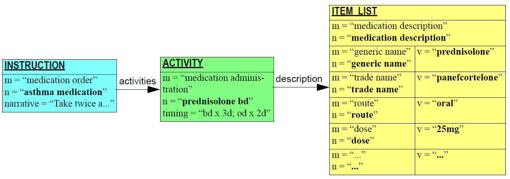

##### 多药治疗

治疗十二指肠溃疡和相关投诉的常见制度是使用Losec与其他药物，如以下组合：

 - Losec 40 mg od x 4w或直到无症状

 - 阿莫西林500mg 3td x 7d

 - 甲硝哒唑400mg 3td x 7d

该疗法的说明如下所示。

## 附录A：词汇表

- openEHR术语

	- HCA: 保健代理 - 任何医生，护士或其他认可的工作人员，或软件或设备
	
	- HCF： 保健设施 - 任何保存EHR的地方
	
	- HCP： 保健专业人员 - 任何医生，护士或其他认可的HCF工作人员

- 临床术语

	- 护理路径: 针对患者的全球护理管理战略，显示在基于时间的框架中管理健康问题或问题，类似于工程工作的项目管理视图。

	- 插曲: 一系列与时间相关的临床事件，如住院或手术事件。
	
	- 问题: 患者识别的问题，例如， “由于呼吸困难无法做运动”;可能是更广泛的保健的对象，例如。社会工作者，物理治疗师等。

	- 问题: 患者的健康问题，如由其潜在的医学原因所确定的，例如。哮喘;医疗保健的对象。

- IT术语

	- API: 应用程序编程接口 - 库或模块的软件接口。
	
	-COM: 微软的组件对象模型;设计用于实现遵守所述输出接口的二进制组件的集成。

	- CORBA: 公共对象请求代理体系结构 - 面向对象的中间件体系结构，支持构建3层系统，其中后端数据提供程序（DBMS等）仅由其导出到网络的服务才知道。 CORBA是一个由对象管理组（OMG）管理的开放标准。
	
	- DCOM: 分布式版本的Microsoft COM。类似的目的是CORBA。

	- ODMG-93: 对象数据库的标准，包括用于写入模式的对象定义语言（ODL），用于查询的对象查询语言（OQL）和多个语言绑定。
	
## 参考文献

### 出版物

<ol><li>
    [Anderson_1996]罗斯·安德森。临床信息系统的安全性。可在http://www.cl.cam.ac.uk/users/rja14/policy11/policy11.html获取。
</li><li>
    [Baretto_2005] Barretto S A.设计基于指南的工作流程 - 综合电子健康记录。南澳大学博士论文。可在http://www.cis.unisa.edu.au/~cissab/Barretto_PhD_Thesis_Revised_FINAL.pdf。
</li><li>
    [Beale_2000] Beale T. Archetypes：Constraint-based Domain Models for Future-proof Information Systems。 2000.可查阅http://www.openehr.org/files/resources/publications/archetypes/archetypes_beale_web_2000.pdf。
</li><li>
    [Beale_2002] Beale T.Archetypes：Constraint-based Domain Models for Future-proof Information Systems。第十一届OOPSLA行为语义研讨会：为客户服务（西雅图，美国华盛顿，2002年11月4日）。由Kenneth Baclawski和Haim Kilov编辑。 Northeastern University，Boston，2002，pp。16-32.请访问http://www.openehr.org/files/resources/publications/archetypes/archetypes_beale_oopsla_2002.pdf。
</li><li>
    [Beale_Heard_2007] Beale T，Heard S. An Ontology-based Model of Clinical Information。 2007.pp760-764 Proceedings MedInfo 2007，K.Kuhn et al。 （Eds），IOS Publishing 2007.见http://www.openehr.org/publications/health_ict/MedInfo2007-BealeHeard.pdf。
</li><li>
    [Booch_1994] Booch G.面向对象的分析和设计与应用。第2版​​。本杰明/ Cummings 1994.
</li><li>
    [Browne_2005] Browne E D.工作流建模协调的健康护理提供者护理计划。南澳大学博士论文。请访问http://www.openehr.org/publications/workflow/t_browne_thesis_abstract.htm。
</li><li>
    [Cimino_1997] Cimino J J. Desiderata for Controlled Medical vocabularies in the Twenty-F​​irst Century。 IMIA WG6 Conference，Jacksonville，Florida，Jan 19-22,1997.
</li><li>
    [埃菲尔]迈耶B.埃菲尔的语言（第二版）。 Prentice Hall，1992.
</li><li>
    [Elstein_1987] Elstein AS，Shulman LS，Sprafka SA。医学问题解决：临床推理的分析。剑桥，MA：哈佛大学出版社1987.
</li><li>
	[Elstein_Schwarz_2002] Elstein AS，Schwarz A.临床诊断的证据基础：临床问题解决和诊断决策：对认知文献的选择性审查。 BMJ 2002; 324; 729-732.
</li><li>
    [Fowler_1997] Fowler M.分析模式：可重用对象模型。 Addison Wesley 1997
</li><li>
    [Fowler_Scott_2000] Fowler M，Scott K.UML Distilled（第2版）。 Addison Wesley Longman 2000.
</li><li>
    [Gray_reuter_1993] Gray J，Reuter A. Transaction Processing Concepts and Techniques。 Morgan Kaufmann 1993.
</li><li>
    [Hein_2002] Hein J L.Discrete Structures，Logic and Computability（2nd Ed）。琼斯和巴特利特2002.
</li><li>
    [Hnìtynka_2004]HnìtynkaP，PlášilF. MOF的分布式版本控制模型。 Proceedings of WISICT 2004，Cancun，Mexico，A volume in the ACM international conference proceedings series，published by Computer Science Press，Trinity College Dublin Ireland，2004.
</li><li>
    [Ingram_1995] Ingram D.欧洲良好健康记录项目。 Laires，Laderia Christensen，Eds。健康在新的通信时代。阿姆斯特丹：IOS出版社; 1995; pp。66-74.
</li><li>
    [Kifer_Lausen_Wu_1995] Kifer M，Lausen G，Wu J. Logical Foundations of Object-Oriented and FrameBased Languages。 JACM 1995年5月。见见ftp://ftp.cs.sunysb.edu/pub/TechReports/kifer/flogic.pdf。
</li><li>
    [Kilov_1994] Kilov H，Ross J.信息建模 - 一种面向对象的方法。 Prentice Hall 1994.
</li><li>
    [Maier_2000] Maier M.系统建模原则。技术报告，阿拉巴马大学在亨茨维尔。 2000.可在http://www.infoed.com/Open/PAPERS/systems.htm获得
</li><li>
    [Martin] Martin P. UML，OWL，KIF和WebKB-2语言之间的翻译（For-Taxonomy，Frame-CG，Formalized English）。 May / June 2003. Available at http://www.webkb.org/doc/model/comparisons.html as at Aug 2004.
</li><li>
    [Meyer_OOSC2] Meyer B. Object-oriented Software Construction，2nd Ed。 Prentice Hall 1997
</li><li>
    [Müller_2003]MüllerR. Event-oriented Dnamic Adaptation of Workflows：Model，Architecture，and Implementation。莱比锡大学博士论文。请访问http://www.openehr.org/publications/workflow/t_mueller_thesis_abstract.htm。
</li><li>
    [Object_Z] Smith G.对象Z规范语言。 Kluwer Academic Publishers 2000.见http://www.itee.uq.edu.au/~smith/objectz.html。
</li><li>
    [Rector_1994] Rector A L，Nowlan W A，Kay S. Foundations for an Electronic Medical Record。 The IMIA Yearbook of Medical Informatics 1992（Eds.van Bemmel J，McRay A）。 Stuttgart Schattauer 1994.
</li><li>
    [Rector] Rector A L.临床术语：为什么这么难？方法。 1999 Dec; 38（4-5）：239-52.可在http://www.cs.man.ac.uk/~rector/papers/Why-is-terminology-hard-single-r2.pdf。
</li><li>
    [Richards_1998] Richards E G. Mapping Time - The Calendar and its History。牛津大学出版社1998.
</li><li>
    [Sowa_2000] Sowa J F.知识表示：逻辑，哲学和计算基础。 2000，Brooks / Cole，California。
</li><li>
    [Sottile_1999] Sottile P.A.，Ferrara F.M.，Grimson W.，Kalra D.，and Scherrer J.R.The holistic healthcare information system。欧洲电子健康记录。 1999年11月; 259-266.
</li><li>
    [Van_de_Velde_Degoulet_2003] Van de Velde R，Degoulet P. Clinical Information Systems：A Component-Based Approach。 2003. Springer-Verlag New York。
</li><li>
    [Weed_1969] Weed LL。医疗记录，医疗教育和病人护理。 6 ed。芝加哥：年鉴医疗出版商公司1969年。
</li></ol>

### 资源

#### 本体

<ol><li>
    [bfo]正式本体和医学信息科学研究所（IFOMIS）。基本正式本体论（BFO）。 http://ifomis.uni-saarland.de/bfo/。
</li><li>
    [FMA] http://sig.biostr.washington.edu/projects/fm/。
</li><li>
    [Horrocks_owl] Patel-Schneider P，Horrocks I，Hayes P. OWL Web本体语言语义和抽象语法。请参阅http://w3c.org/TR/owl-semantics/。
</li><li>
    信息工件本体。 https://code.google.com/p/information-artifact-ontology/。
</li><li>
    [OBO] The Open Biological and Biomedical Ontologies。见http://www.obofoundry.org/。
</li><li>
    [OGMS]一般医学科学本体（OGMS）。 https://code.google.com/p/ogms/。
</li></ol>

#### 一般

1.  [cov_contra]维基百科。协方差和逆变。请参阅https://en.wikipedia.org/wiki/Covariance_and_contravariance_(computer_science）。

#### 电子卫生标准

<ol><li>
    [ENV_13606-1] ENV 13606-1 - 电子医疗记录通信 - 第1部分：扩展架构。 CEN / TC 251健康信息技术委员会。
</li><li>
    [ENV_13606-2] ENV 13606-2 - 电子医疗记录通信 - 第2部分：域名术语列表。 CEN / TC 251健康信息技术委员会。
</li><li>
    [ENV_13606-3] ENV 13606-3 - 电子医疗记录通信 - 第3部分：分发规则。 CEN / TC 251健康信息技术委员会。
</li><li>
    [ENV_13606-4] ENV 13606-4 - 电子医疗记录通信标准第4部分：信息交换的信息。 CEN / TC 251健康信息技术委员会。
</li><li>
    [Corbamed_PIDS]对象管理组。人身份识别服务。 1999年3月。
</li><li>
    [Corbamed_LQS]对象管理组。词典查询服务。 1999年3月。
</li><li>
    [HL7v3_ballot2] JL7国际。 HL7版本3第二选票规格。可在http://www.hl7.org获得。
</li><li>
    [HL7v3_data_types] Schadow G，Biron P. HL7版本3可交付：版本3数据类型。 （2002年第二版投票）。
</li><li>
    [hl7_v3_rim] HL7. HL7 v3 RIM。见http://www.hl7.org。
</li><li>
    [ICD10AM]。世卫组织/ ACCD。国际疾病分类，第10次修订，澳大利亚修改。请参见https://www.accd.net.au/Icd10.aspx
</li><li>
    [IHTSDO]国际健康术语标准制定组织（IHTSDO）。 http://www.ihtsdo.org。
</li><li>
    [IHTSDO_URIs] IHTSDO。 SNOMED CT URI标准。 http://ihtsdo.org/fileadmin/user_upload/doc/download/doc_UriStandard_Current-en-US_INT_20140527.pdf?ok。
</li><li>
    [NLM_UML_list]国家医学图书馆。 UMLS术语表。 http://www.nlm.nih.gov/research/umls/metaa1.html。
</li><li>
    [SNOMED_CT] IHTSDO。系统化命名医学。请参见http://www.ohtsdo.org。
</li><li>
    [WHO_ICD]世界卫生组织（WHO）。国际疾病分类（ICD）。见：http：//www.who.int/classifications/icd/en/。
</li><li>
    [ISO_18308] Schloeffel P.（编辑）。电子健康记录参考架构的要求。 （ISO TC 215 / SC N; ISO / WD 18308）。国际标准组织，澳大利亚，2002年。
</li><li>
    [ISO_20514] ISO。综合护理EHR。见http://www.iso.org/iso/iso_catalogue/catalogue_tc/catalogue_detail.htm?csnumber=39525.
</li><li>
    [UCUM] Schadow G，McDonald C J.The Unified Code for Units of Measure，Version 1.4 2000.Regenstrief Institute for Health Care，Indianapolis。请参阅http://aurora.rg.iupui.edu/UCUM
</li></ol>

#### 电子卫生项目

<ol><li>
    [CIMI]临床信息建模倡议（CIMI）项目。参见http://opencimi.org。
</li><li>
    [EHCR_supA_14] Dixon R，Grubb P A，Lloyd D，and Kalra D. Consolidated List of Requirements。 EHCR支持行动交付1.4.欧洲委员会DGXIII，布鲁塞尔; 2001年5月59pp可从http://www.chime.ucl.ac.uk/HealthI/EHCR-SupA/del1-4v1_3.PDF获得。
</li><li>
    [EHCR_supA_35] Dixon R，Grubb P，Lloyd D. EHCR支持行动交付3.5：“对CEN未来工作的最终建议”。 2000年10月。见http://www.chime.ucl.ac.uk/HealthI/EHCRSupA/documents.htm。
</li><li>
    [EHCR_supA_24] Dixon R，Grubb P，Lloyd D. EHCR支持行动2.4“CEN EHCRA解释和实施指南”。 2000年10月。见http://www.chime.ucl.ac.uk/HealthI/EHCR-SupA/documents.htm。
</li><li>
    [Lloyd D，et al。 EHCR支持行动交付3.1和3.2“CEN的中期报告”。 July 1998. Available at http://www.chime.ucl.ac.uk/HealthI/EHCR-SupA/documents.htm。
</li><li>
    [GEHR_del_4]可交付成果4：GEHR临床综合性要求。 GEHR项目1992
</li><li>
    [GEHR_del_7]可交付成果7：临床功能规范。 GEHR项目1993
</li><li>
    [GEHR_del_8]可交付成果8：GEHR架构和系统的伦理和法律要求。 1994年GEHR项目
</li><li>
    [GEHR_del_19_20_24]交付成果19,20,24：GEHR架构。 GEHR项目30/6/1995
</li><li>
    [GeHR_AUS] Heard S，Beale T.The Good Electronic Health Record（GeHR）（Australia）。请参阅http://www.openehr.org/resources/related_projects#gehraus。
</li><li>
    [GeHR_Aus_gpcg] Heard S. GEHR Project Australia，GPCG Trial。可在http://www.gehr.org/gpcg/ehra.htm。
</li><li>
    [GeHR_Aus_req] Beale T，Heard S.GEHR技术要求。请参阅http://www.gehr.org/technical/requirements/gehr_requirements.html。
</li><li>
    [Synapses_req_A] Kalra D.（Editor）。突触用户需求和功能规范（A部分）。欧盟远程信息处理应用程序，布鲁塞尔; 1996;突触项目：可交付用户1.1.1a。 6章，176页。
</li><li>
    [Synapses_req_B] Grimson W.和Groth T.（Editors）。突触用户需求和功能规范（B部分）。欧盟远程信息处理应用程序，布鲁塞尔; 1996;突触项目：可交付用户1.1.1b。
</li><li>
    [Synapses_odp] Kalra D.（编辑）。突触ODP信息观点。欧盟远程信息处理应用程序，布鲁塞尔; 1998;突触项目：最终交付。 10章，64页。
</li><li>
    [synex]伦敦大学学院。 SynEx项目。 http://www.chime.ucl.ac.uk/HealthI/SynEx/。
</li></ol>

#### 一般标准

<ol><li>
    [OCL]对象约束语言2.0.对象管理组（OMG）。可在http://www.omg.org/cgi-bin/doc?ptc/2003-10-14.
</li><li>
    [IANA] IANA。 http://www.iana.org/。
</li><li>
    [IEEE_828] IEEE。 IEEE 828-2005：软件配置管理计划标准。
</li><li>
    [ISO_8601] ISO 8601标准描述了表示时间，日期和持续时间的格式。参见例如http://www.mcs.vuw.ac.nz/technical/software/SGML/doc/iso8601/ISO8601.html和http://www.cl.cam.ac.uk/~mgk25/iso-time.html 。
</li><li>
    [ISO_2788] ISO。 ISO 2788单语词典的建立和发展指南。
</li><li>
    [ISO_5964] ISO。 ISO 5964建立和开发多语言词典的指南。
</li><li>
    [Perl_regex] Perl.org。 Perl正则表达式。可在http://perldoc.perl.org/perlre.html。
</li><li>
    斯坦福大学。参见http://protege.stanford.edu/。
</li><li>
    [rfc_2396] Berners-Lee T.Universal Resource Identifiers in WWW。可在http://www.ietf.org/rfc/rfc2396.txt。这是一个用于全局资源识别的万维网RFC。在当前在网上使用时，由Mosaic，Netscape和类似工具。有关URI的起点，请参阅http://www.w3.org/Addressing。
</li><li>
    [rfc_2440] RFC 2440：OpenPGP消息格式。见http://www.ietf.org/rfc/rfc2440.txt和http://www.ietf.org/internet-drafts/draft-ietf-openpgp-rfc2440bis-18.txt
</li><li>
    [rfc_3986] RFC 3986：统一资源标识符（URI）：通用语法。 IETF。参见http://www.ietf.org/rfc/rfc3986.txt。
</li><li>
    [rfc_4122] RFC 4122：通用唯一标识符（UUID）URN命名空间。 IETF。参见http://www.ietf.org/rfc/rfc4122.txt。
</li><li>
    [rfc_2781] IETF。 RFC 2781：UTF-16，ISO 10646的编码见http://tools.ietf.org/html/rfc2781.
</li><li>
    [rfc_5646] IETF。 RFC 5646. Available at http://tools.ietf.org/html/rfc5646.
</li><li>
    [sem_ver]语义版本化。 http://semver.org。
</li><li>
    [Xpath] W3C Xpath 1.0规范。 1999.可在http://www.w3.org/TR/xpath。
</li><li>
    [uri_syntax]统一资源标识符（URI）：通用语法，因特网提议的标准。 2005年1月。见http://www.ietf.org/rfc/rfc3986.txt。
</li><li>
    [w3c_owl] W3C。 OWL - Web本体语言。请参阅http://www.w3.org/TR/2003/CR-owl-ref-20030818/。
</li><li>
    [w3c_xpath] W3C。 XML路径语言。请参阅http://w3c.org/TR/xpath。
</li></ol>

#### 工具

1.  [Template_Designer]模板设计器。海洋信息学。 http://www.openehr.org/downloads/modellingtools

#### openEHR资源

<ol><li>
    [openehr_18308] openEHR基金会。 openEHR架构符合ISO TS 18308“EHR体系结构的要求”。请参阅http://www.openehr.org/releases/trunk/architecture/iso18308_conformance.pdf。
</li><li>
    [openEHR_ADL_workbench] openEHR基金会。 openEHR ADL工作台。 http://www.openehr.org/downloads/ADLworkbench/home。
</li><li>
    [openehr_am_overview] openEHR基金会。 openEHR原型技术概述。请参阅http://www.openehr.org/releases/AM/latest/Overview.html。
</li><li>
    [openehr_am_adl14] openEHR基金会。原型定义语言1.4（ADL1.4）。请访问http://www.openehr.org/releases/AM/latest/ADL1.4.html。
</li><li>
    [openehr_am_aom14] openEHR基金会。原型对象模型1.4（AOM1.4）。请访问http://www.openehr.org/releases/AM/latest/AOM1.4.html。
</li><li>
    [openehr_am_adl2] openEHR基金会。原型定义语言2（ADL2）。请访问http://www.openehr.org/releases/AM/latest/ADL2.html。
</li><li>
    [openehr_am_aom2] openEHR基金会。原型对象模型2（AOM2）。请访问http://www.openehr.org/releases/AM/latest/AOM2.html。
</li><li>
    [openehr_am_identification] openEHR基金会。原型标识规范。请访问http://www.openehr.org/releases/AM/latest/Identification.html。
</li><li>
    [openehr_am_def_pri] openEHR基金会。原型定义和原则。 （已弃用）可查阅http://www.openehr.org/releases/1.0.2/architecture/am/archetype_principles.pdf。
</li><li>
    [openehr_am_sys] openEHR基金会。原型系统。 （已弃用）可查阅http://www.openehr.org/releases/1.0.2/architecture/am/archetype_system.pdf。
</li><li>
    [openehr_am_oap] openEHR基金会。 openEHR原型配置文件。 http://www.openehr.org/releases/1.0.2/architecture/am/openehr_archetype_profile.pdf。
</li><li>
    [openehr_CKM] openEHR临床知识经理（CKM）。请参阅http://www.openEHR.org/ckm
</li><li>
    [openehr_odin] openEHR基金会。对象数据实例符号（ODIN）。请访问http://www.openehr.org/releases/BASE/latest/odin.html。
</li><li>
    [openeneH_overview] openEHR基金会。 openEHR架构概述。请参阅http://www.openehr.org/releases/BASE/latest/architecture_overview.html。
</li><li>
    [openehr_query_aql] openEHR基金会。 openEHR原型查询语言（AQL）。请参阅http://www.openehr.org/releases/QUERY/latest/AQL.html。
</li><li>
    [openehr_rm_data_types] openEHR。数据类型信息模型。请参阅http://www.openehr.org/releases/RM/Release-1.0.3/data_types.html。
</li><li>
	[openehr_rm_data_structures] openEHR。数据结构信息模型。请参阅http://www.openehr.org/releases/RM/Release-1.0.3/data_structures.html。
</li><li>
    [openehr_rm_common] openEHR。公共信息模型。请参阅http://www.openehr.org/releases/RM/Release-1.0.3/common.html。
</li><li>
    [openehr_rm_ehr] openEHR基金会。 EHR信息模型。 http://www.openehr.org/releases/RM/Release-1.0.3/ehr.html。
</li><li>
    [openehr_rm_ehr_extract] openEHR基金会。 EHR Extrct信息模型。 http://www.openehr.org/releases/RM/Release-1.0.3/ehr_extract.html。
</li><li>
    [openehr_rm_integration] openEHR基金会。集成信息模型。 http://www.openehr.org/releases/RM/Release-1.0.3/integration.html。
</li><li>
    [openehr_rm_support] openEHR。支持信息模型。请参阅http://www.openehr.org/releases/RM/Release-1.0.3/support.html。
</li><li>
    openEHR基金会。 openEHR术语http://www.openehr.org/releases/TERM/latest/SupportTerminology.html。
</li><li>
    [openeneHL基金会]。 openEHR术语项目（GitHub）https://github.com/openEHR/terminology。
</li></ol>

最后更新2015-12-10 13:18:34 GMT