# EHR提取信息模型

发行人：openEHR规范程序

发布：版本1.0.3

状态：TRIAL

修订：[latest_issue]

日期：[latest_issue_date]

关键词：EHR，提取物，openehr

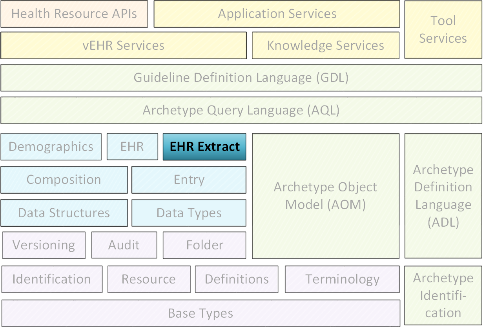

©2003 - 2015 openEHR基金会

openEHR基金会是一个独立的非营利社区组织，通过开源，基于标准的实施，促进消费者和临床医生共享健康记录。

- 许可
	- Creative Commons Attribution-NoDerivs 3.0 Unported。 https://creativecommons.org/licenses/by-nd/3.0/
- 支持
	- 问题：https：//openehr.atlassian.net/browse/SPECPR/
	- 网址：http：//www.openehr.org/
	
## 修订记录

- R E L E A S E 1.0.3
	- 2.1.1 (2015年10月10日)
		- SPECRM-30.在EHR_EXTRACT类中纠正文档错误（删除关于通用参数的文本）。
		- SPECRM-24.正确的EHR提取IM输入错误。
		- SPECRM-13.将各种字段转换为EHR提取中的编码。
		- EXTRACT_SPEC.type，EXTRACT_ACTION_REQUEST.action和EXTRACT_UPDATE_SPEC.trigger_events转换为编码类型。
	- 2.1 (2011年6月29日)
		- SPECRM-14：各种EHR提取模型改进：
		- 删除EXTRACT_SPEC.includes_directory和directory_archetype;删除EXTRACT_ENTITY_CONTENT类;
		- 使EXTRACT_FOLDER类成为主包含结构;将X_VERSIONED_OBJECT移动到openEHR_extract包;
		- 将EXTRACT.request_id更改为HIER_OBJECT_ID;
		- 将GENERIC_EXTRACT_ITEM.other_details更改为Hash <String，String>。
		- SPECRM-6.每个与单个实体相关的EXTRACT_CHAPTER的正确建模不一致性。
- R E L E A S E 1.0.1
	- 2.0 (2007年2月20日)
		- SPEC-189.添加LOCATABLE.parent。 EHR_EXTRACT中的新不变式。
		- SPECRM-10：将EHR_EXTRACT升级到Release-1.0.主要重建。
		- 添加了X_VERSIONED_OBJECT，X_VERSIONED_FOLDER，X_VERSIONED_COMPOSITION，X_VERSIONED_EHR_ACCESS，X_VERSIONED_EHR_STATUS，X_VERSIONED_PARTY。
		- SPEC-219：使用常量而不是文字来引用RM中的术语。
- R E L E A S E 0.95
	- 1.3.5 （2004年12月10日）
		- SPEC-118.使包名称为小写。
- R E L E A S E 0.9
	- 1.3.4 （04 Oct 2003）
		- SPEC-41.在openEHR文档中可视化区分基本类型。
	- 1.3.3 (2003年9月15日)
		- SPEC-13.根据CEN ENV 13606更改密钥类名称。
	- 1.3.2 (2003年3月18日)
		- SPEC-3，SPEC-4（更改版本和LOCATABLE）。 MESSAGE_CONTENT现在继承自LOCATABLE。
	- 1.3.1 (26 Feb 2003)
		- 使用ISE Eiffel 5.2正式验证。 MESSAGE类的修订结构，更好地符合CEN 13606-4.将EHR_EXTRACT.hca_authorising重命名为originator，类似于13606.
	- 1.3 （07 Feb 2003）
		- CEN WG会议后的更改罗马2003年2月。添加了对X_TRANSACTION类的证明。显着改进的要求文档，与CEN 13606-4比较。
	- 1.2.2 （08 Jan 2003）
		- 对图和类定义的微小修正。
	- 1.2.1 (04 Jan 2003)
		- 添加了senters_reference以符合CEN 13606-4：2000第7.4节。
	- 1.2 (2002年11月7日)
		- 重写和重组为两个包。
	- 1.1 (2002年10月7日)
		- 将EHR_EXTRACT的一部分移动到MESSAGE中。允许多级可写的文件夹结构。
	- 1.0 (2002年10月7日)
		- 取自EHR RM。

## 致谢

本文件所报告的工作由下列组织提供资金：

- 伦敦大学学院 - 健康信息学和多专业教育中心（CHIME）;

- 海洋信息;

特别感谢CHIME负责人David Ingram教授，他提供了自GEHR（1992年）时代以来的愿景和合作的工作环境。

## 1.前言

### 1.1.目的

本文档定义了openEHR数据类型本文档描述了openEHR EHR提取信息模型的体系结构。该模型正式定义了“提取请求”，“提取”，各种内容（包括openEHR和非openEHR）和消息包装器的概念。它涵盖包括EHR系统通信，其他临床内容消息传递和EHR系统同步的用例，以及提供等效的ISO 13606 EHR提取。模型，用于openEHR参考模型。

目标受众包括：

- 生产卫生信息学标准的标准机构;

- 使用openEHR的学术团体;

- 开源医疗保健社区;

- 解决方案供应商;

- 医疗信息学家和临床医生对健康信息感兴趣。

- 健康数据管理器。

### 1.2.相关文件

阅读本文档的前提条件包括：

- openEHR架构概述（[openehr_overview]）;

- openEHR EHR信息模型（[openehr_ehr_rm]）;

### 1.3.状态

此规范处于TRIAL状态。本文档的开发版本可以在http://www.openehr.org/releases/RM/latest/ehr_extract.html找到。

已知的遗漏或问题在文本中用“待定”段落表示，如下：

TBD :(例如待定段落）

鼓励用户对这些段落以及主要内容发表评论和/或建议。应在技术邮件列表或规格问题跟踪器上提供反馈。

### 1.4.一致性

数据或软件工件与openEHR参考模型规范的一致性通过该工件相对于相关openEHR实现技术规范（ITS）（例如IDL接口或XML模式）的形式测试来确定。由于ITS是来自参考模型的形式化的自动推导，ITS一致性指示RM一致性。

## 2.要求

### 2.1.概述

本节介绍openEHR提取信息模型（IM）设计满足的要求。需求以假定的操作环境（充当设计约束），一组用例，功能和安全要求的描述来表示。使用案例系列描述了使用openEHR标准化信息结构作为通用语的粗粒度信息输入和输出健康信息系统。提取IM对于系统之间使用的通信技术是中性的：信息结构可以同等地用于web服务环境或消息环境中，包括安全电子邮件。因此，具体的通信方法不是这里描述的情况的因素。

### 2.2.操作环境

#### 2.2.1. openEHR环境

openEHR提取的假设操作openEHR环境如下图所示。在该图中，请求系统创建对“来自一个或多个”主体的记录的信息“的请求。主体记录可以是患者EHR，人口统计系统中的人记录或任何其他逻辑上有意义的顶级实体。响应系统以一个或多个提取的形式回复。请求/响应交互由传输机制和可能的其他服务启用。这是以全面的中间件，Web服务或简单的点对点协议（例如SMTP（电子邮件）传输）的形式。

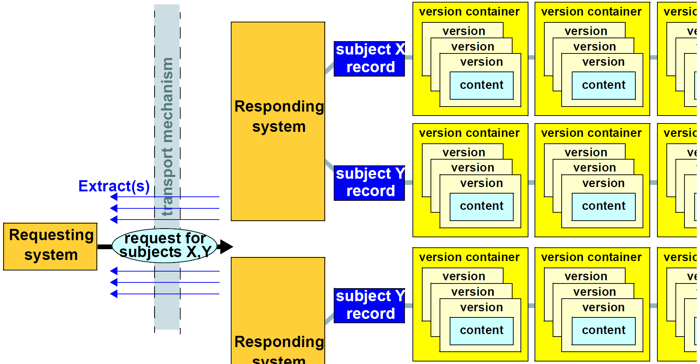

响应系统中的信息假定为以下形式。

- 每个这样的系统包含一个或多个主题记录（例如EHR）;在多个系统中可能存在同一主题的记录。

- 每个Subject记录由一个或多个版本容器组成，每个容器包含特定内容的版本历史。对于EHR，不同的容器用于持久性组合物（例如“药物列表”，“问题列表”）和事件组合物（由于患者遭遇和临床护理过程中的其它事件而产生的组合物）。

- 版本容器内的每个版本对应于由该容器管理的内容的一个版本，换句话说，特定内容项在用户提交时的某个时间点的状态。

- 版本集合，每个来自响应系统中的不同版本容器对应于贡献，即openEHR“变更集”的概念。任何特定贡献对应于由特定用户一次提交给特定系统的一组版本。

上述关系揭示了请求系统可访问的信息中的潜在的1：N关系的层次，其中贡献形成内容的替代视图。在层级的每个级别，需要标识符的系统，例如，区分主题，区分版本等。在一些特定情况下，这些中的一些可以减少到1：1的关系，例如。可能没有版本控制，消除了对项目版本的特定标识符的需要。

#### 2.2.2.非开放式环境

本规范中定义的openEHR Extract可以在非开放式环境中使用，其中目的是定义内容表示为模板原型的消息。一般来说，这种系统的内部数据架构可以假设不多。为了本说明书的目的，假设存在两个级别的信息：

- '记录'或等效的“患者” - 即基于护理主题的信息划分;

- 'document'（OpenEHR中的组合），它是构成记录的最粗粒度项。

关于非开放式EWR系统中的版本化，假设一些系统可以支持基本概念，包括：

- 文件版本;

- 文档版本集 - 相同逻辑项目的一组版本的标识符;

- 文档类型/模式类型 - 给定文档的某种模型，模式或内容类型的标识符;

- 文档类型版本 - 文档类型的版本。

提取可用于以原型形式发送旧信息的典型环境是需要跨企业通信的环境，包括排放摘要和转介。这样的消息的内容可以根据原型来定义，然后模板化以便定义消息的总内容。

#### 2.2.3.信息的位置

在更先进的环境中，可能存在健康信息位置服务，其避免了请求者对于哪些系统包含关于特定的感兴趣主题（例如某个患者）的信息的任何知识的需要;在更简单的环境中，请求系统可能需要明确地标识请求的目标系统。下图说明了由位置服务介导的直接请求和请求。

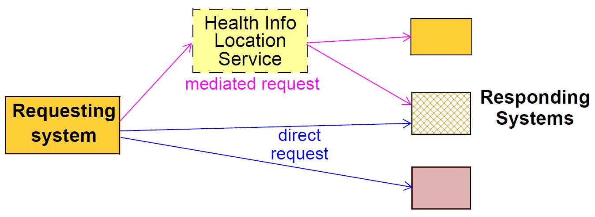

本说明书假设EHR请求和提取位于请求系统和每个响应系统之间，即使相关响应系统的列表已由位置服务生成。换句话说，此Extract规范不包含来自多个响应系统的提取摘要的想法。

#### 2.2.4.提取数据的粒度

在图中，Operational openEHR Environment for Extracts在响应系统中显示的最低级别的信息被简单标记为“content”。这对应于在openEHR中的顶层信息结构，例如组成，文件夹树，缔约方等。每个这样的内容项潜在地包含信息项的整个层级，其中仅一些对于请求者通常感兴趣。 “查询结果”的典型数据库思想通常预期只返回这样的细粒度的块。然而，Extract规范在这里只允许构成（'文档'等）的粒度，而不是通过其他方式处理的细粒度查询响应。这是因为Extract的主要用例是使EHR的某些部分在其他地方可用，而不是在原位智能查询记录并返回结果。

#### 2.2.5.时间

版本化健康记录系统是“双时态”系统，因为它们包括两个时间概念。数据中提到的时间涉及真实世界事件或状态，例如糖尿病的诊断时间或患者从医院的出院日期。现实世界时间与系统时间相区别，系统时间是信息系统本身中的事件时间，例如会费的提交。实际世界时间和系统时间都可能需要在请求中指定。

### 2.3.用例

以下部分描述请求/提取模型必须满足的典型用例。

#### 2.3.1.单个患者，特殊请求

关键的临床使用情况是需要从远程系统或系统获得一些或所有患者的EHR。该请求最有可能是由于患者已被转介到另一个提供者（包括向三级护理放电），但是其他原因，例如旅行中生病的人也会出现。

如果健康信息位置服务可用，则可以向所标识的系统（例如，引用提供者的系统）进行请求，或者可以对包含给定患者的数据的所有系统进行该请求。

可以由临床医生和/或软件以不同的方式指定请求的内容，如下：

- 第一次从确定的来源获得该患者的整个EHR;

- 从我上次执行以来，从指定（例如转诊或GP）系统获得该病人的EHR的所有变化;

- 获得持久性组合物，例如“当前药物”，“问题列表”和“过敏和相互作用”;

- 获取与特定查询匹配的组合物，例如“过去六个月内的血糖水平测量”。

时间的意义是内容相关的。对于在开放式EHR EHR中的观察，可以规定采样时间;用于记录诊断的评价，发作日期的时间，最后一集的日期，解决的日期都可以被指定。

#### 2.3.2.多个患者，批量发送

病理实验室的一个非常普遍的要求是能够将针对多个患者进行的测试的结果数据以周期性批次为基础发送到诸如医院，诊所或国家卫生系统的已知接收器。批发送通常被接收器视为“站立请求”，并且可以是周期性的（例如，发送每小时可用的所有结果），“可用”基础，或根据一些其他方案。这样的数据目前通常作为HL7v2，Edifact或其他类似消息发送。

- 待定：每条消息的病人？发送触发器？

- 待定：可以主动发送提取，即无请求

#### 2.3.3.以前的版本和修订历史

在一些情况下，可以针对除了某些内容的最新版本之外的版本提出请求。这可能是由于研究或医疗法律调查，需要确定什么信息在某些系统在早期可见。例如，可能需要确定问题列表，已知过敏列表和患者偏好是否在某个较早的时间与药物列表全部兼容。

作为对先前版本的查询的一部分，可以请求Versioned容器的修订历史，以便允许用户或软件代理确定哪些版本是感兴趣的。

#### 2.3.4.系统更新和持久请求

在诸如州和地区健康服务的更大的医疗保健递送环境中，患者常规地由多个提供者治疗，其中的一些或全部是大型分布式临床计算环境的一部分。他们可以访问各个诊所，专家和医院，每个病房都有自己的病人记录。然而，通常需要在整体卫生机构内集中聚集患者数据，其中例行性地需要更新。

在这种情况下，一般要求是对更新的请求（通常对于多于一个患者）进行一次，并且重复地采取行动直到另行通知。具体要求可能包括：

- 自上次更新以来的周期性更新，具有指定的周期;

- 事件驱动的更新，从而当服务器中发生某个事件时进行更新，例如。 “对EHR的任何改变”，“对药物或过敏的任何改变”等。

对于这些情况，请求可以持久存储在服务器中。即使对于一次性临时请求，请求者可以要求请求被持久保存在服务器中，使得它可以简单地由用于稍后调用的标识符来引用。

#### 2.3.5.共享非EHR openEHR数据

需要能够从开放的EHR系统和EHR以外的服务请求信息，例如人口统计和工作流程，因为它们被开发。这种请求的一个可能目的是从openEHR系统导入到非开放式的EHR系统，例如从openHHR人口统计服务到现有的医院患者主索引。

应该可以使用与用于EHR的请求相同的一般形式。然而，除了指定患者记录的提取（EHR）之外，在这些其他情况下共享的数据将是无论哪种顶级业务对象与该类服务相关。人口统计服务等。

#### 2.3.6.从非开放式医疗系统提供数据

openEHR系统的主要用途之一是作为共享的EHR系统，以标准化形式聚合来自各种现有系统的数据。可以以不同的方式提供来自这样的系统的数据，包括各种消息形式（HL7，Edifact），各种类型的EMR文档（CEN EN13606，HL7 CDA）以及可以或可以不标准化的其他格式。

一些这样的系统的开发者可以决定提供能够将各种数据串行化为openEHR结构（特别是高度灵活且可以适应大多数现有数据格式的Composition / GENERIC_ENTRY形式（参见openEHR Integration IM））的openEHR兼容导出网关。可以以这种方式提供openEHR提取物的非开放式EHR系统的类型包括病理学系统和部门医院系统，例如放射学（RIS），组织病理学等。

提取请求可以以openEHR形式（即根据本文档）或以诸如web服务调用或消息的某种其他形式来指定;无论哪种方式，逻辑请求是相同的，即，哪些患者，哪个内容，哪个版本和更新基础。响应必须是本文档中提供的openEHR提取的一些子集。

#### 2.3.7.患者访问健康数据

在临床遭遇之外，患者直接访问他们自己的健康数据是世界各地的电子卫生计划的共同愿望。似乎很清楚，将有各种模式，通过这些访问将发生，包括：

- 患者携带U盘或包含部分或全部健康记录的其他便携式设备;

- 从家用PC经由安全web服务到EHR，以类似于在线银行的方式;

- 以家庭PC上加密的电子邮件附件的形式访问EHR数据，或者通过患者的请求发送未经请求的（例如，通过成像实验室向患者进行扫描）

- 通过信息亭或普通电脑在医生的手术室，诊所等候室接入电子病历。

USB棒和电子邮件方案涉及EHR信息的异步​​访问，并且可以由EHR提取器来解决。

在便携式设备的情况下，最明显的需要是该设备用作包含患者/家庭EHR的副本的家用PC与患者访问的各种诊所的EHR系统之间的同步传输。为了实现这一点，当在任一位置（在家庭记录中或在诊所保持的记录中）进行改变时，应当能够仅将所需的改变复制到设备。在openEHR术语中，这对应于复制自上次同步以来所做的贡献。

电子邮件附件场景更可能涉及包含患者所请求的信息的类似于上述临时请求（例如最近的测试结果）的类似方式的信息或以openEHR提取的形式的实验室信息的目的地的实验室信息的提取集成到一个开放的EHR EHR。在后一种情况下，信息可能是以根据传统原型构建的包含GENERIC_ENTRIE的组合物的形式，尽管它可以同样是以“纯”openEHR形式（即包含适当的openEHR观察的组合物）。

#### 2.3.8.整个记录的移动

由于患者移动，永久性转移护理或重新组织其中管理EHR的数据中心，患者的整个EHR可能由于各种原因而永久移动到另一个系统。这被称为记录的保管的改变，并且与复制和同步发生的情况不同。

记录从发送系统的活动使用中删除（可能在归档后）。在这些情况下，通常需要从现有系统中导出完整EHR（包括所有先前版本）的可互操作形式，并将其发送到目的地系统，因为一般来说两个系统将不具有相同的实现平台，版本控制模型等。在一些情况下，实现可以是相同的，允许可以使用本地表示中的复制和删除操作。

#### 2.3.9.系统同步

##### 镜像

包含相同种类的数据（即EHR，人口统计等）的两个开放的EHR系统可以包含旨在彼此是逻辑“镜子”（即克隆）的记录。在一些情况下，整个系统可以是另一个的克隆，即“镜像系统”。镜像记录纯粹是只读的，并且在所有情况下，镜像记录或系统是其源的从属，并且不发生本地更新。因此，同步始终只在一个方向。

为了维护镜像记录中的信息，需要有效的更新机制。 openEHR贡献提供必要的语义单元，因为它是系统中任何记录的变更单位，它也可以用作镜像系统中同一记录的更新单位。
虚拟EHR

如果允许对也系统同步的多个系统进行更改，则存在“虚拟EHR”。该术语表示，改变的整体一起形成完整的EHR，即使在任何给定系统中的任何特定时刻，并非所有这样的改变都是可见的。虚拟EHR是任何大规模分布式电子健康环境中的通常情况。同步可以是基于特定或系统的，并且可以是或可以不是双向的。同步请求和任何其他类型的请求之间的区别在于，不是根据用户查询而是为了使记录更新而指定请求，而不管可能需要什么改变。

由于在openEHR中定义版本标识的方式（参见通用IM，change_control包），直接支持虚拟EHR，并且可以简单地通过将版本从一个位置复制到另一个位置并将它们添加到接收器中的相关版本的容器来实现同步结束。在大型健康计算环境中，克隆和镜像可能被系统地使用以实现真正的非集中式系统。

该用例的定义条件是，系统中的一个或多个（可能是所有的）记录作为其他系统中的相同记录的完整副本，具有可能的延迟，这取决于何时以及如何更新发生。

#### 2.3.10.非开放式EHR EMR / EHR系统之间的通信

由于openEHR提取表示用于表示临床信息的通用的，开放的标准化规范，因此没有理由不能用于未另外实现openEHR的系统。在这种情况下，提取内容最有可能由组合和通用条目组成，并且可能包含或不包含版本控制信息，具体取决于生成系统中是否支持版本控制。

### 2.4.技术要求

#### 2.4.1.内容规范

内容可根据匹配标准指定。这可以采取两种形式：特定顶级内容项的列表，或者根据匹配子部分指定顶级项的查询。

未完待续：

查询以原型查询语言表示。

未完待续：

#### 2.4.2.版本规范

openEHR Extract支持对数据的版本化视图的详细访问。应该返回哪些版本的内容可以通过多种方式指定：

- 作为应该获取所有内容的源EHR的版本时间

- 在更具体的术语，例如：

    - 时间窗口;

    - 有或没有修订历史，或仅修订历史;

    - 所有，一些，最新版本的每个内容项;

- 在确定的会费，自某时间以来的会费等方面。

未完待续：

#### 2.4.3.数据的完整性

在EHR提取中传送的信息需要在临床意义上是自立的，即，请求者可以理解，而不采取任何其他方式访问响应系统。一般来说，这意味着对于传输的EHR数据中的任何类型的引用，Extract需要包含引用目标，否则假设请求者具有独立访问或者不需要它是合理的。

##### 参考同一EHR的其他部分

在openEHR中，EHR中有两种交叉引用：LINKs（在LOCATABLE中定义）和超链接（DV_TEXT.hyperlink）。这两个都使用DV_EHR_URI实例来表示链接目标。 URI的内容在架构概述中定义。

待续：EHR ID总是包含在URI中吗？

在某些情况下，同一EHR中的参考项目将需要与原始请求的项目一起旅行，以使后者有意义。例如，出院摘要或推荐可能（通过LINK）指向EHR中的其他组合物，例如药物治疗列表，问题列表和实验室报告。另一方面，在所请求的项目内可能存在不需要在提取中发送的对象的链接。

构建抽取时应遵循哪些链接可以根据以下方面指定：

- 链接深度，即从原始项目继续多少跳跃;值为0表示“不遵循任何链接”。

此外，对于LINK实例，可以指定以下内容：

- 链接类型，即只跟踪类型属性与规范匹配的链接。

##### 参考其他EHR

对其他EHR中的项目的引用可以发生在EHR内，例如。到父母，其他关系，器官捐献者等的EHR。在构建EHR提取物时不要求遵循这样的链接。

##### EHR之外的资源参考

也可以从openEHR EHR内的外部项目进行计算引用。在其自身或在DV_TEXT超链接中出现的数据类型DV_URI的实例通常用于指代诸如在线准则和参考之类的资源。 DV_MULTIMEDIA的实例可以包含涉及通常在同一提供者企业内的多媒体资源的DV_URI实例，例如。放射学图像存储在PACS中。由于URI按照定义是全局唯一的，所以无论包含它们的数据在哪里移动，它们在语义上都是有效的。然而，不能保证它们总是可以被解析，如在一个提供者环境中的URI指向另一个提供者环境中的PACS图像的情况下。这不可能是一个问题，因为图像通常在EHR中表示为小的（例如200kb）JPG或类似的，并且几乎从未打算使用EHR来具有原始图像集（其可以是几百Mb） 。访问原始图像的请求将单独针对EHR提取的请求进行。

##### 参考人口实体

在开放的EHR EHR中涉及两种人口统计实体。个体提供者和提供者机构通过记录中的PARTY_PROXY对象通过external_ref属性引用，该属性包含对人口统计库中对象的引用，例如openEHR人口统计库，医院MPI或区域或国家身份服务。 PARTY_PROXY的PARTY_IDENTIFIED子类型可以另外携带所述提供者的人类可读名称和其他计算标识符。

在PARTY_PROXY的PARTY_SELF子类型中找到的第二种人口统计学参考是EHR受试者（即患者），并且可能或可能不存在于EHR中，这取决于所处的安全水平。在存在的地方，它是在人口统计或身份系统中的记录。

为了使EHR提取的内容对接收者有意义，如果接收者不能访问包含实体的人口统计系统，则引用的人口统计项目可能必须包括在提取中。是否包括患者人口统计是单独的事情，因为请求者系统已经知道患者是谁，并且可能需要或可能不需要患者。因此，请求者应该能够指定提取物是否包括除主题之外的被引用的人口统计实体，并且独立地是否应该包括主体人口统计。

##### 原型和术语

另一种“参考”是术语代码，存储在数据类型DV_TEXT（通过映射属性）和DV_CODED_TEXT.defining_code的实例中。在openEHR系统中，所有编码项（即DV_CODED_TEXT的实例）以EHR的语言环境的语言携带代码的文本值。对于正常使用，这通常就足够了。然而，为了决策支持或需要推断的其他应用的目的，术语本身需要是可用的。本说明书假定请求者需要推理或其他术语能力，将获得对完整术语的独立访问。

对于其标识符在EHR数据或元数据中提及的原型进行相同的假设：原型本身不包括在提取中，并且必须单独解析。

#### 2.4.4.安全和隐私

安全性成为EHR提取的最重要的要求之一，其明显的原因是它暴露在请求或响应系统的（假定的）安全边界之外的潜在不受控制的环境中。一般要求是提取物的内容基于：

- 在源的EHR_ACCESS对象中定义的访问控制规则;

- 在策略服务或其他地方定义的任何其他访问规则;

- 认证请求用户。

应该基于请求者的（优选地是认证的）公钥来使用数字签名。公告也可以用于提供发送和/或接收提取的不可否认的证据，尽管这在本说明书的范围之外。

#### 2.4.5.更新基础

除了指定内容之外，还需要指定更新的基础。最简单的可能情况是ad hoc一次性查询。更复杂的情况是定期更新和事件驱动更新。
持久请求

未完待续：

## 3.设计概述

### 3.1.抽象通信模型

openEHR提取模型使用两个设计思想。首先，区分请求和提取（回复）的概念。提取可以包括提取是回复的请求的副本，指示提取中实际上是什么，其可以不同于请求。其次，请求和提取的常见语义以通用方式建模，其中大量专门的请求和提取类型基于公共类。因此，不同的具体类型的提取用于满足特定的需求组，而不是试图使一种提取执行所有可能的任务。下图说明了关键的提取通信场景，以及模型定义的各种具体提取类型。

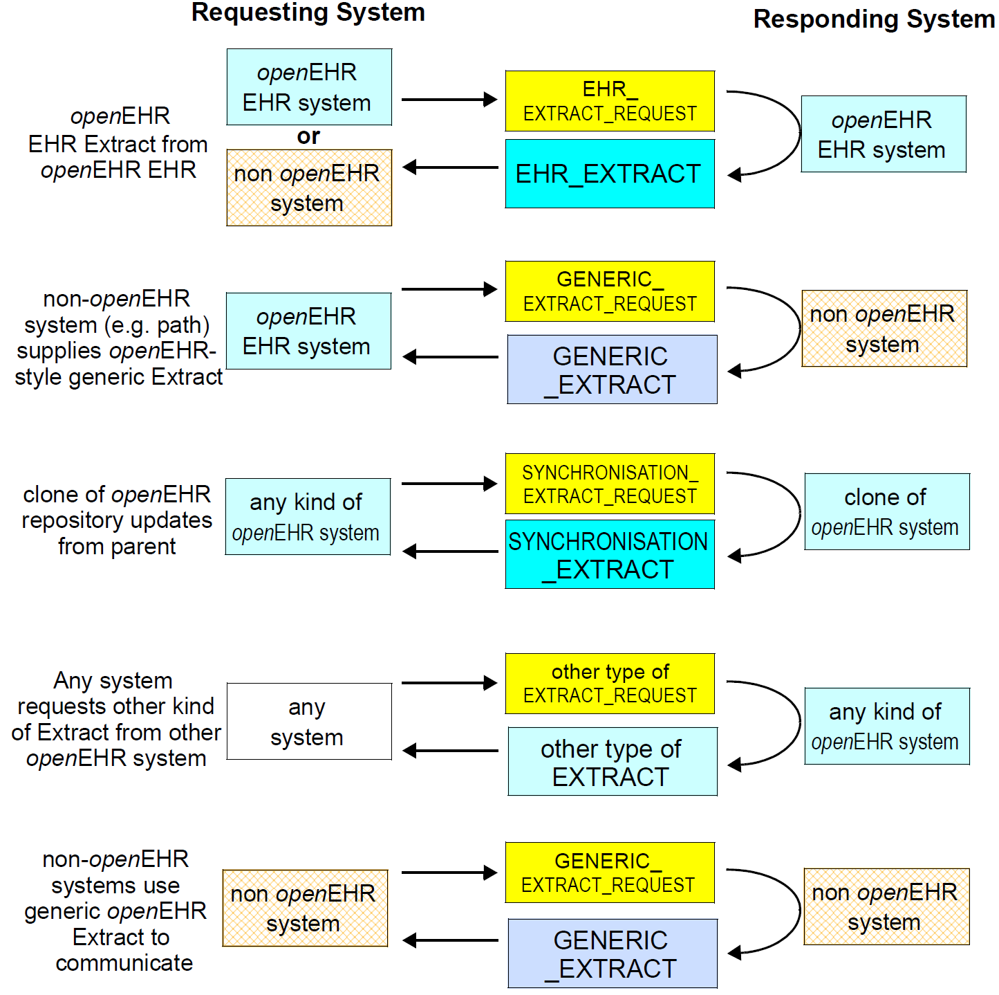

EHR提取只是一种具体类型的提取。其他类型包括：

- 通用提取：提取类型，设计用于与openHHR系统通信的非openEHR系统以及ISO 13606提取规范的用户。通用提取假定关于系统中的内容的绝对最小值，同时保持在openEHR类型系统中;

- 同步提取：用于更新跨系统的镜像EHR的提取;使用贡献作为分组概念。

其他类型的提取可以在将来定义。

请求和回复的模式可以被及时控制。最简单的情况是单个请求，单个回复。其他变体包括：

- 发送请求，持续在服务器中，并使用“动作”请求来获得提取，每次可以具有不同的内容;

- 发送指示重复周期的请求，服务器自动发送回复;

- 发送请求，指示服务器应发送回复的触发事件。

### 3.2.内容模型和表示

需要提取内容并将其发送到另一系统的任何环境的一般情况是可能需要三类数据：“关键”临床和管理信息，通常是EHR内容（例如患者血压历史）;人口统计信息（指示临床信息中提及的患者和专业人员）;以及相关元数据。这些类型的信息几乎总是驻留在源系统环境的不同部分，但需要在提取中组合。模型因此包含一个通用的抽取遏制结构，特定的原型内容可以被插入其中，整个结构被模板化，每个这样的模板对应于一个抽取类型，即一种消息类型，如下图所示。

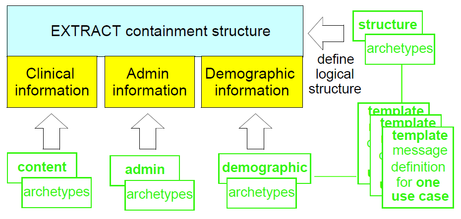

模板可以用于以至少两种方式生成内容。 默认方法是根据发布的openEHR EHR提取模式（其主要重用主要的openEHR EHR和人口统计模式）使用给定提取类型（称为“引荐”）的模板来创建标准openEHR内容。 在这种方法中，每个Extract消息符合标准模式 - 在这种情况下，XML Extract文档是“标准通用openEHR XML”。

另一种方法是将每个模板转换为自己的模式，该模板的所有实例都遵循该模式。 不同的模板 放电摘要和引用定义不同的模式。 在此方法中，任何消息的XML特定于其自己的模式。 如果消息内容中需要更改，则通常必须重新生成模式。 两种方法如下图所示。

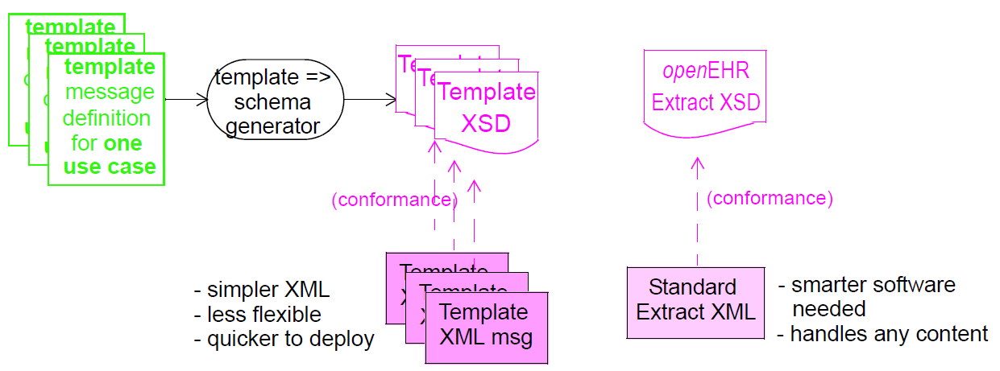

使用哪种方法取决于环境的要求和其他因素，例如模板结构的稳定性。 本文档中描述特定种类的提取的部分显示了所涉及的具体数据表示的细节。

### 3.3. 封装结构

rm.extract包定义了来自openEHR数据源（包括EHR）的提取的语义。 下面的UML图说明了rm.extract包的包结构。

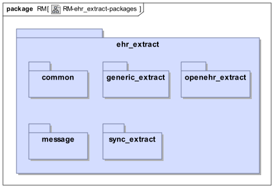

子包如下：

- common：所有提取的公共语义;

- ehr_extract：EHR提取类型的语义;

- generic_extract：定义通用提取类型的语义;

- synchronisation_extract：定义同步提取类型的语义;

- message：包含提取的消息的简单模型。

Extract.common包

4.1.概述

rm.extract.common包定义了所有种类的提取请求和提取所共有的语义。请求和提取可以作为消息实现，或在Web服务环境中用作类型。在后者中，Extract请求语义将很可能被等效的服务函数定义替代。

请求包含抽取中所需的存储库内容的详细规范。不总是需要请求，并且可以主动发送提取。请求可以是持久的和/或事件驱动的，支持各种周期性和连续的更新场景。每个请求可以指定来自一个或多个实体的数据，例如EHR或受试者。

提取回复可以可选地包括请求的副本。它的主要内容是章节的形式，根据该章节，文件夹和内容项目包含所请求的内容，或者尽可能多地检索。在各种子包中定义特定类型的内容项目，包括openEHR内容，通用EMR内容和人口统计内容。内容如何在每章中的文件夹内安排，以及跨章节通过使用原型和模板来管理提取/章节结构。以下uML图说明了rm.extract.common包。

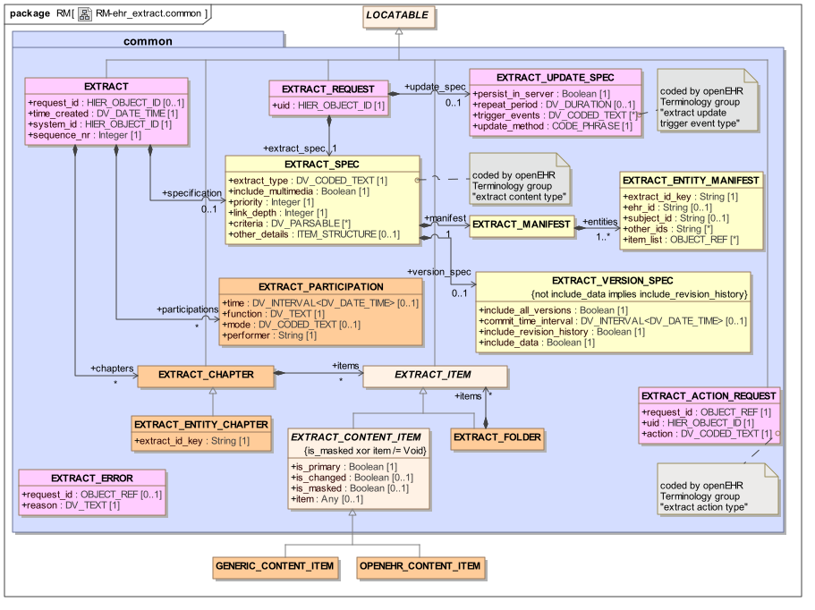

EXTRACT_REQUEST和EXTRACT类型的典型实例结构如下所示。

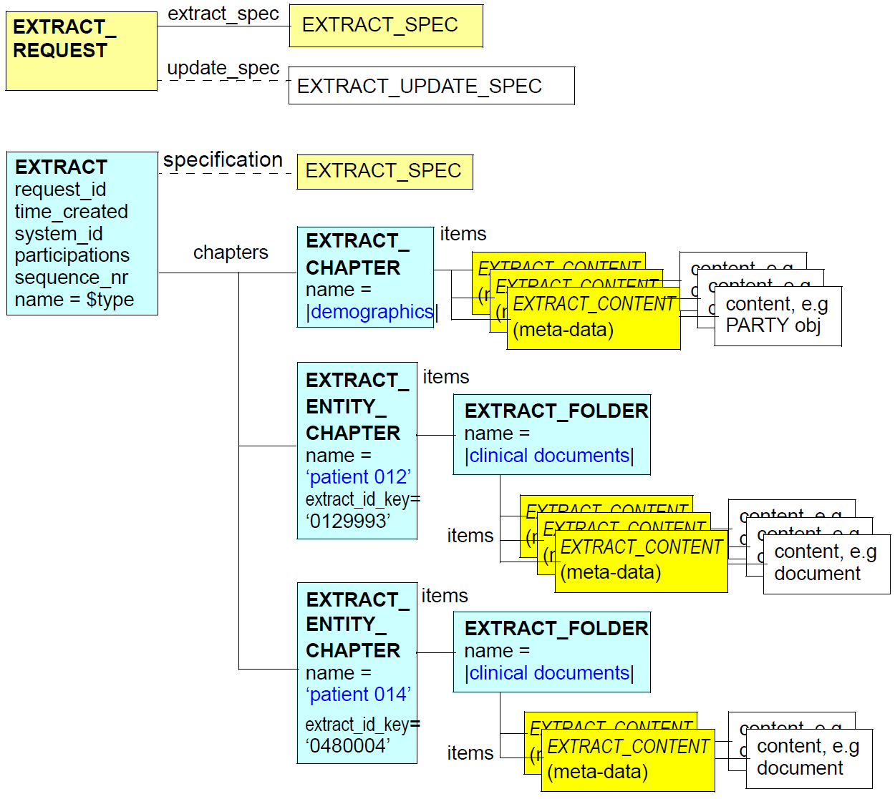

### 4.2.设计

#### 4.2.1.提取请求

EXTRACT_REQUEST类由一个update_spec指定更新（一次性，周期性，事件驱动等）的规则和一个extract_spec，指示需要来自目标存储库的哪些信息。后者包括可选的version_spec，指示哪些版本（默认为latest）和清单，指定哪些实体（记录或主题，以及可选地应包括来自那些实体的哪些项目。
内容标准规范

请求的extract_spec部分适用于提取中的所有内容。属性如下：

- extract_type：什么样的提取这是，例如。 | openehr-ehr |，| openehr-demographic |，| openehr-synchronization |，| openehr-generic |，| generic-emr |

- include_multimedia：指示是否包括内联二进制对象的标志;

- link_depth：指示当构建提取的内容时遵循多少级别的链接的值;默认值为0，表示'不遵循';

- 条件：指定定义每个实体记录的所需内容的查询;

- other_details：包含进一步提取细节的可重构结构。

criteria属性以通用查询（即，对任何记录敏感地应用的查询）的形式定义要从每个实体的记录中检索哪些项目。每个查询表示为DV_PARSABLE实例，从而允许使用任何形式。例如，可以使用openEHR原型查询形式（AQL）。查询表达式使用诸如$ ehr之类的变量来表示来自清单列表的当前EHR。查询可以如下简单：

	SELECT * FROM $ ehr - 获取记录中的所有项目
	SELECT / ehr_access FROM $ ehr - 检索EHR中的EHR_ACCESS对象
	SELECT / ehr_status FROM $ ehr - 检索EHR中的EHR_STATUS对象

更复杂的查询可以用于获得对应于特定标准的项目，例如：

	SELECT .... - 检索最近6个月的血糖测量值
	... - 检索正在进行的药物列表
	...... - 检索与主动怀孕有关的项目
	..... - 检索所有GP相遇笔记自12-03-2005

未完待续：

##### 更新规范

请求的update_spec部分指定服务器如何处理请求。默认情况，根本不需要update_spec，是一次性请求。其他选择包括：

    - 重复请求具有定义的周期和/或触发事件;

    - 将请求保持在服务器中，使得请求者可以通过其标识符参考先前存储的请求来使稍后重复请求。

使用设置为| repeat |的操作的EXTRACT_ACTION_REQUEST进行先前持久化的请求的特别重复。这仅指定先前使用EXTRACT_REQUEST指定的请求的标识符。由于对于所有时间唯一地标识请求，所以在标识中可以没有错误。

##### 清单

清单指定要在提取中检索的记录的范围。在最简单的情况下，将仅识别单个实体（例如患者）和没有特定项目（内容将由EXTRACT_SPEC对象中的标准确定）;这将在绝大多数单个病人请求情况下使用。然而，一些情况将是批量更新性质，包括病理实验室结果更新以及其中根据自从上次这样的更新以来医院接收的推荐的列表请求患者记录的情况。在这些情况下，请求清单可以标识多个实体（即记录或患者），每个实体将在所得到的提取中被分配单独的章节。

每个实体清单的item_list使用OBJECT_REF实例来标识各个项目，每个实例都包含特定顶级对象（例如合成或Party）的HIER_OBJECT_ID标识符。用于识别提取的内容的这种机制期望在已知特定标识符时使用，而不是在请求与过滤标准对应的项目时使用。后者使用criteria属性指定。

##### 版本规范

以其最简单形式的提取请求没有版本规范，对应于每个匹配项目的“最新可用版本”的假设。但是，在某些情况下，需要重新获取以前的版本或有关版本的信息。提取请求的版本规范部分允许这样做。可用的可能性如下。

- include_all_versions：应返回由清单和检索条件匹配的每个项目的整个版本“堆栈”。注意，其结果将是所讨论的存储库中的所有可用版本，其通常与已经创建的所有版本不同，因为由于局部修改，相同逻辑版本树中的版本可能存在于其他存储库中尚未传播到提取请求的目标存储库。

- include_revision_history：此标志指示VERSIONED_OBJECT的revision_history是否包括在版本的提取形式中

#### 4.2.2.提取

##### 内容规范

EXTRACT由request_id，可选参与列表，可选规范和一组章节组成，包含检索到的内容。参与属性表示负责创建提取的主体。规范采用与EXTRACT_REQUEST的extract_spec相同的格式，但在EXTRACT实例中，表示Extract的实际内容。这通常将与请求规范不同，因为它将在清单部分中列出检索到的实际实体（以及它们在接收机系统中已知的标识符），而请求可以不指定任何实体（其可以依赖于查询标准），或者它可以指定与在接收机系统中可检索的实体不同的实体集合。

##### 内容

提取的内容包含在chapters属性中，以EXTRACT_CHAPTER类或其子类型EXTRACT_ENTITY_CHAPTER的一个或多个实例的形式。在EXTRACT_CHAPTER内，content属性包含由EXTRACT_FOLDER对象构成的文件夹结构，这些对象又包含内容项。文件夹结构由原型定义，并且可以用于根据某些其他方案来分离健康记录的各部分或组项目。插曲。特定类型的章，EXTRACT_ENTITY_CHAPTER，用于携带与单个实体（即患者）相关联的内容。这意味着提取可以包含与多个实体相关的数据，即多个患者。

EXTRACT_CONTENT_ITEM类在本规范的后续部分中划分子类，以定义特定种类的内容的元数据。

#### 4.2.3.参与和人口参照

在系统环境中的“提取”或实际上携带信息的任何类型的消息之间的关键差异在于，提取在一个地方组合在原始环境中的多个服务中通常找到的信息。常规包含在提取物中的两种信息是关于受试者和其他方参与临床信息中记录的活动的临床（即EHR / EMR或类似）和人口统计数据。

在openEHR EHR模型中，“参与”由rm.common.generic包中的PARTICIPATION类定义。实际参与实例包括执行者对象（PARTY_PROXY的子类型），以及可选的外部引用对象（类型PARTY_REF）。后者包含对人口统计服务，提供者注册表或类似内容中的人口统计实体的引用。在提取中，参与发生在两个地方。在EHR_EXTRACT类中，参与用于提供与提取相关的各方的信息。这些是使用每个Extract创建的新的（即它们不是作为Extract内容的一部分的EHR数据。因此，使用PARTICIPATION类的简化形式：EXTRACT_PARTICIPATION。唯一的区别是，执行者引用是一个简单的字符串，允许它包含对包含在同一摘录中其他地方的人口统计方的GUID引用。

参与也出现在EHR的实际内容中，并且在这种情况下，他们的原始结构被忠实地复制，包括任何在线表演者信息。如果存在指向也将包括在提取中的人口统计实体的external_ref，则在提取的实体章节内将该引用重写为指向人口统计实体的本地副本（使用GUID）。

其结果是对于其原始外部引用是外部人口统计实体的源数据，逻辑结构完全保留在提取中，只是引用被重写为在提取中使用的GUID值（其可以很好地来自原始人口统计数据库或服务）。

典型的布置是将单个章节专用于在提取内引用的所有人口统计实体，可选地具有内部文件夹结构。在下面的EHR和通用提取部分中示出了一些示例布置。

### 4.3.类描述

#### 4.3.1. EXTRACT_REQUEST类

<table>
	<tr>
		<td>类</td>
		<td colspan="2">EXTRACT_REQUEST</td>
	</tr>
	<tr>
		<td>描述</td>
		<td colspan="2">请求抽取的通用模型，包含抽取规范。</td>
	</tr>
	<tr>
		<td>继承</td>
		<td colspan="2">LOCATABLE</td>
	</tr>
	<tr>
		<td>属性</td>
		<td>签名</td>
		<td>含义</td>
	</tr>
	<tr>
		<td>1..1</td>
		<td>extract_spec：EXTRACT_SPEC</td>
		<td>请求的规范详细信息。</td>
	</tr>
	<tr>
		<td>0..1</td>
		<td>update_spec：EXTRACT_UPDATE_SPEC</td>
		<td>更新请求的详细信息。</td>
	</tr>
	<tr>
		<td>1..1（重新定义）</td>
		<td>uid：HIER_OBJECT_ID</td>
		<td>此请求的标识符，由请求者生成。</td>
	</tr>
	<tr>
		<td>函数</td>
		<td>签名</td>
		<td>含义</td>
	</tr>
	<tr>
		<td>（有效）</td>
		<td></td>
		<td></td>
	</tr>
	<tr>
		<td>不变</td>
		<td colspan="2"></td>
	</tr>
	<tr>
		<td></td>
		<td colspan="2"></td>
	</tr>
</table>

#### 4.3.2. EXTRACT_ACTION_REQUEST类

<table>
	<tr>
		<td>类</td>
		<td colspan="2">EXTRACT_ACTION_REQUEST</td>
	</tr>
	<tr>
		<td>描述</td>
		<td colspan="2">请求抽取的通用模型，包含抽取规范。</td>
	</tr>
	<tr>
		<td>继承</td>
		<td colspan="2">LOCATABLE</td>
	</tr>
	<tr>
		<td>属性</td>
		<td>签名</td>
		<td>含义</td>
	</tr>
	<tr>
		<td>1..1</td>
		<td>request_id：OBJECT_REF</td>
		<td>先前EXTRACT_REQUEST的标识符。</td>
	</tr>
	<tr>
		<td>1..1</td>
		<td>动作：DV_CODED_TEXT</td>
		<td>请求的操作：cancel |重新发送|发送新。由openEHR术语组编码“提取动作类型”。</td>
	</tr>
	<tr>
		<td>1..1（重新定义）</td>
		<td>uid：HIER_OBJECT_ID</td>
		<td></td>
	</tr>
</table>

#### 4.3.3. EXTRACT_SPEC类

<table>
	<tr>
		<td>类</td>
		<td colspan="2">EXTRACT_SPEC</td>
	</tr>
	<tr>
		<td>描述</td>
		<td colspan="2">
<pre>
提取内容的规范。子类型可用于添加特定于提取类型的详细信息。规范由指定目录的属性和它们自己的类中的另外两组属性组成，即版本规范（要包括信息项的哪些版本）和清单（哪些实体将包括在提取中）。

使用：在请求中用于指定提取，以及描述提取中包含的内容。
</pre>
		</td>
	</tr>
	<tr>
		<td>继承</td>
		<td colspan="2"></td>
	</tr>
	<tr>
		<td>属性</td>
		<td>签名</td>
		<td>含义</td>
	</tr>
	<tr>
		<td>0..1</td>
		<td>version_spec：EXTRACT_VERSION_SPEC</td>
		<td>指定要包含在提取中的信息项的哪些版本。如果为Void，则默认值为仅最新版本（对于非版本控制系统也是如此）。</td>
	</tr>
	<tr>
		<td>1..1</td>
		<td>清单：EXTRACT_MANIFEST</td>
		<td>要包括在提取中的实体（例如记录）的规范。</td>
	</tr>
	<tr>
		<td>1..1</td>
		<td>extract_type：DV_CODED_TEXT</td>
		<td>
<pre>
表示所需内容类型的编码项，例如

    安佩内尔山

    openehr人口

    通用emr

    其他

由openEHR术语组编码“提取内容类型”。
</pre>
		</td>
	</tr>
	<tr>
		<td>1..1</td>
		<td>include_multimedia：Boolean</td>
		<td>指示是否包括源数据中的DV_MULTIMEDIA的内联实例。</td>
	</tr>
	<tr>
		<td>1..1</td>
		<td>priority：整数</td>
		<td>
<pre>
此请求的请求优先级由服务器处理。优先级方案可能是本地的，并且使用两端商定的值。

TBD：alternative是标准编码术语
</pre>
		</td>
	</tr>
	<tr>
		<td>1..1</td>
		<td>link_depth：Integer</td>
		<td>
<pre>
指定要包含的内容项目所产生的链接程度。要跟踪的链接类型取决于Extract的类型。

在给定深度处的跟随链接的目标结束处的所有项目也包括在提取中; EXTRACT_CONTENT_ITEM.is_primary用于区分。 - 0 =不跟随; - 1 =遵循第一学位链接; - 2 =遵循2级联系; - ...。 - n =跟随n度链接
</pre>
		</td>
	</tr>
	<tr>
		<td>0..1</td>
		<td>条件：列表<DV_PARSABLE></td>
		<td>指定此Extract的内容的查询。</td>
	</tr>
	<tr>
		<td>0..1</td>
		<td>other_details：ITEM_STRUCTURE</td>
		<td>其他规格项目。 Archetypable。</td>
	</tr>
</table>

##### 4.3.4. EXTRACT_MANIFEST类

<table>
	<tr>
		<td>类</td>
		<td colspan="2">EXTRACT_MANIFEST</td>
	</tr>
	<tr>
		<td>描述</td>
		<td colspan="2">规定要包括在提取中的候选实体和可选的顶级项目（例如，组合物）。</td>
	</tr>
	<tr>
		<td>继承</td>
		<td colspan="2"></td>
	</tr>
	<tr>
		<td>属性</td>
		<td>签名</td>
		<td>含义</td>
	</tr>
	<tr>
		<td>1..1</td>
		<td>实体：列出<EXTRACT_ENTITY_MANIFEST></td>
		<td>实体清单的列表包括在提取中的项目的uid;对于openEHR数据，这些是标识版本容器的uid。</td>
	</tr>
</table>

##### 4.3.5. EXTRACT_ENTITY_MANIFEST类

<table>
	<tr>
		<td>类</td>
		<td colspan="2">EXTRACT_ENTITY_MANIFEST</td>
	</tr>
	<tr>
		<td>描述</td>
		<td colspan="2">
<pre>
一个实体（例如EHR主体）的清单，标识实体并且可选地指定要包括在提取中的顶级项目。实际包括的列表可以由规范的version_spec部分修改，也可以通过link_depth属性修改。在重复（常规顺序）请求中，最终包含可以通过EXTRACT_UPDATE_SPEC.update_method的send_changes_only值修改。

可以为实体提供各种标识符;这些将由接收机系统使用以定位实体。 extract_id_key属性用于记录将在此实体的整个Extract中使用的标识符，包括在EXTRACT_ENTITY_IDENTIFIER的实例中。
</pre>
		</td>
	</tr>
	<tr>
		<td>继承</td>
		<td colspan="2"></td>
	</tr>
	<tr>
		<td>属性</td>
		<td>签名</td>
		<td>含义</td>
	</tr>
	<tr>
		<td>1..1</td>
		<td>extract_id_key：String</td>
		<td>标识符，通过该标识符在提取中已知此实体。可以是其他标识符之一，例如ehr_id或subject_id，或者它可能是其他的，包括一个简单的整数。</td>
	</tr>
	<tr>
		<td>0..1</td>
		<td>ehr_id：String</td>
		<td>目标系统中实体的EHR / EMR标识符。</td>
	</tr>
	<tr>
		<td>0..1</td>
		<td>subject_id：String</td>
		<td>目标系统处实体的主题（即患者或类似）标识符。</td>
	</tr>
	<tr>
		<td>0..1</td>
		<td>other_ids：List &lt;String&gt;</td>
		<td>可用于在目标系统中查找实体的其他标识符，由类型键入。可包括医疗保险号，驾照号码，税号等。</td>
	</tr>
	<tr>
		<td>0..1</td>
		<td>item_list：列出<OBJECT_REF></td>
		<td>在id请求单个项目的情况下，要包括在提取中的项目的uid列表。更典型地，不使用此属性，EXTRACT_SPEC.criteria查询定义提取内容。如果设置，对于openEHR数据，这些是标识版本容器的uid。</td>
	</tr>
</table>

#### 4.3.6. EXTRACT_VERSION_SPEC类

<table>
	<tr>
		<td>类</td>
		<td colspan="2">EXTRACT_VERSION_SPEC</td>
	</tr>
	<tr>
		<td>描述</td>
		<td colspan="2">提取中应包含哪些版本的规范。默认情况下，只有最新版本包含在提取中，在这种情况下，根本不需要提取规范的这一部分。属性include_all_versions和commit_time_interval用于修改此属性;前者强制所有版本包括;后者将版本限制为在时间间隔中提交的最新版本，或者如果include_all_versions为True，则在时间间隔中提交的所有版本。</td>
	</tr>
	<tr>
		<td>继承</td>
		<td colspan="2"></td>
	</tr>
	<tr>
		<td>属性</td>
		<td>签名</td>
		<td>含义</td>
	</tr>
	<tr>
		<td>1..1</td>
		<td>include_all_versions：Boolean</td>
		<td>如果包含提取中的每个项目的所有版本，则为True。</td>
	</tr>
	<tr>
		<td>0..1</td>
		<td>commit_time_interval：DV_INTERVAL <DV_DATE_TIME></td>
		<td>指定要包含在Extract中的项目到源存储库的提交时间间隔。默认情况下，仅包括提交时间在范围内的最新版本。如果include_all_versions为True，则范围包括在间隔内提交的所有版本。</td>
	</tr>
	<tr>
		<td>1..1</td>
		<td>include_revision_history：Boolean</td>
		<td>如果包含提取中项目的修订历史，则为true。如果包括，它总是完整的修订历史。</td>
	</tr>
	<tr>
		<td>1..1</td>
		<td>include_data：Boolean</td>
		<td>如果应包含由内容规范匹配的项目的数据，则为True。这是默认值。如果为False，则仅序列化版本中包含修订历史记录。在openEHR系统中打开此选项会导致X_VERSIONED_OBJECTs设置revision_history，但版本为Void。用于询问服务器而不必查看任何内容数据。在其他系统中，它可以具有或可以不具有合理的含义。</td>
	</tr>
	<tr>
		<td>不变</td>
		<td colspan="2">Includes_revision_history_valid：not include_data表示include_revision_history</td>
	</tr>
</table>

#### 4.3.7. EXTRACT_UPDATE_SPEC类

<table>
	<tr>
		<td>类</td>
		<td colspan="2">EXTRACT_UPDATE_SPEC</td>
	</tr>
	<tr>
		<td>描述</td>
		<td colspan="2">
<pre>
服务器处理请求的方式的规范。请求可以持久存在于服务器中，意味着a）它可以由请求系统简单地通过指示请求id来重新激活，以及b）可以建立提取更新的仅改变模式。要实现这一点，服务器必须记住在上一个响应中发送的内容。

更新模式可以是事件驱动和周期性更新或两者的混合。每次要发送的候选项目是重新评估规范的内容和版本控制部分的结果;实际发送的是由send_changes_only标志决定的。
</pre>
		</td>
	</tr>
	<tr>
		<td>继承</td>
		<td colspan="2"></td>
	</tr>
	<tr>
		<td>属性</td>
		<td>签名</td>
		<td>含义</td>
	</tr>
	<tr>
		<td>1..1</td>
		<td>persist_in_server：Boolean</td>
		<td>如果为True，此请求将保留在服务器中，直到另行通知。</td>
	</tr>
	<tr>
		<td>0..1</td>
		<td>repeat_period：DV_DURATION</td>
		<td>重新发送更新的时间段响应原始请求而解压缩。</td>
	</tr>
	<tr>
		<td>0..1</td>
		<td>trigger_events：列表<DV_CODED_TEXT></td>
		<td>
<pre>
将导致发送更新提取的事件名称集。事件类型包括：

    any_change - 通过内容规范匹配的内容项目的任何改变，例如新版本的持久性组合物。如果内容列表允许匹配任何或大范围的原型，则此事件类型将匹配对记录的任何添加。

    仅包括校正 - 匹配误差校正，包括删除。

    更新 - 匹配包括的内容项目的更新（即，新版本）。

由openEHR术语组“提取更新触发器事件类型”编码。
</pre>
		</td>
	</tr>
	<tr>
		<td>1..1</td>
		<td>update_method：CODE_PHRASE</td>
		<td>指示更新模式。可以：仅发送更改（包括逻辑删除）或自上次发送以来的新项目。仅对于persist_in_server请求。</td>
	</tr>
	<tr>
		<td>不变</td>
		<td colspan="2">Overall_validity：repeat_period / = Void或trigger_events / = Void</td>
	</tr>
	<tr>
		<td></td>
		<td colspan="2">Trigger_events_validity：trigger_events / = Void表示不是trigger_events.is_empty</td>
	</tr>
	<tr>
		<td></td>
		<td colspan="2">Send_changes_only_validity：send_changes_only表示persist_in_server</td>
	</tr>
</table>

#### 4.3.8. EXTRACT类

<table>
	<tr>
		<td>类</td>
		<td colspan="2">EXTRACT</td>
	</tr>
	<tr>
		<td>描述</td>
		<td colspan="2">通用模型从存储库中提取一些信息。</td>
	</tr>
	<tr>
		<td>继承</td>
		<td colspan="2">LOCATABLE</td>
	</tr>
	<tr>
		<td>属性</td>
		<td>签名</td>
		<td>含义</td>
	</tr>
	<tr>
		<td>0..1</td>
		<td>章节：列表<EXTRACT_CHAPTER></td>
		<td>从此提取的源存储库提取并序列化的内容。</td>
	</tr>
	<tr>
		<td>0..1</td>
		<td>规格：EXTRACT_SPEC</td>
		<td>此提取实际符合的规范;可能与相应请求的规范不同。</td>
	</tr>
	<tr>
		<td>0..1</td>
		<td>request_id：HIER_OBJECT_ID</td>
		<td>参考引起请求，如果有。</td>
	</tr>
	<tr>
		<td>1..1</td>
		<td>time_created：DV_DATE_TIME</td>
		<td>此提取的创建时间</td>
	</tr>
	<tr>
		<td>1..1</td>
		<td>system_id：HIER_OBJECT_ID</td>
		<td>创建系统的标识符。</td>
	</tr>
	<tr>
		<td>1..1</td>
		<td>sequence_nr：整数</td>
		<td>按Request_id标识的提取请求的响应顺序中的此提取响应的数量。如果这是唯一的响应，或没有请求，值为1.</td>
	</tr>
	<tr>
		<td>0..1</td>
		<td>参与：列表<EXTRACT_PARTICIPATION></td>
		<td>与本摘录的创建相关的参与。</td>
	</tr>
	<tr>
		<td>不变</td>
		<td colspan="2">Sequence_nr_valid：sequence_nr> = 1</td>
	</tr>
</table>

#### 4.3.9. EXTRACT_CHAPTER类

<table>
	<tr>
		<td>类</td>
		<td colspan="2">EXTRACT_CHAPTER</td>
	</tr>
	<tr>
		<td>描述</td>
		<td colspan="2">提取的一个内容章节;包含仅与一个实体相关的信息。</td>
	</tr>
	<tr>
		<td>继承</td>
		<td colspan="2">LOCATABLE</td>
	</tr>
	<tr>
		<td>属性</td>
		<td>签名</td>
		<td>含义</td>
	</tr>
	<tr>
		<td>0..1</td>
		<td>项目：列表&lt;EXTRACT_ITEM&gt;</td>
		<td>本章的内容。</td>
	</tr>
</table>

#### 4.3.10. EXTRACT_ENTITY_CHAPTER类

<table>
	<tr>
		<td>类</td>
		<td colspan="2">EXTRACT_ENTITY_CHAPTER</td>
	</tr>
	<tr>
		<td>描述</td>
		<td colspan="2">包含与单个人口统计实体相关的信息的章节类型。</td>
	</tr>
	<tr>
		<td>继承</td>
		<td colspan="2"></td>
	</tr>
	<tr>
		<td>属性</td>
		<td>签名</td>
		<td>含义</td>
	</tr>
	<tr>
		<td>1..1</td>
		<td>extract_id_key：String</td>
		<td>提及实体，通常是人口统计实体，例如本章内容涉及的患者。</td>
	</tr>
</table>

#### 4.3.11. EXTRACT_ITEM类

<table>
	<tr>
		<td>类</td>
		<td colspan="2">EXTRACT_ITEM（摘要）</td>
	</tr>
	<tr>
		<td>描述</td>
		<td colspan="2">提取文件夹和内容类型的抽象父级。</td>
	</tr>
	<tr>
		<td>继承</td>
		<td colspan="2">LOCATABLE</td>
	</tr>
</table>

#### 4.3.12. EXTRACT_FOLDER类

<table>
	<tr>
		<td>类</td>
		<td colspan="2">EXTRACT_FOLDER</td>
	</tr>
	<tr>
		<td>描述</td>
		<td colspan="2">文件夹中的本地文件夹结构中的提取。允许使用空文件夹。</td>
	</tr>
	<tr>
		<td>继承</td>
		<td colspan="2">EXTRACT_ITEM</td>
	</tr>
	<tr>
		<td>属性</td>
		<td>签名</td>
		<td>含义</td>
	</tr>
	<tr>
		<td>0..1</td>
		<td>项目：列表<EXTRACT_ITEM></td>
		<td>此文件夹中的文件夹和内容项列表。</td>
	</tr>
</table>

##### 4.3.13. EXTRACT_CONTENT_ITEM类

<table>
	<tr>
		<td>类</td>
		<td colspan="2">EXTRACT_CONTENT_ITEM（摘要）</td>
	</tr>
	<tr>
		<td>描述</td>
		<td colspan="2">摘要中的一个内容项的包装的抽象模型，包含各种元数据。指示它是否是主集的一部分，以及它的原始路径。旨在为特定类型的内容的包装器子类化。</td>
	</tr>
	<tr>
		<td>继承</td>
		<td colspan="2">EXTRACT_ITEM</td>
	</tr>
	<tr>
		<td>属性</td>
		<td>签名</td>
		<td>含义</td>
	</tr>
	<tr>
		<td>1..1</td>
		<td>is_primary：Boolean</td>
		<td>如果此容器中携带的内容项目是“提取”的主要集合的一部分，即由于链接跟随而未添加，则为True。</td>
	</tr>
	<tr>
		<td>0..1</td>
		<td>is_changed：Boolean</td>
		<td>如果此容器中携带的内容项是自上次发送以来的重复发送情况中的任何类型的更改，则为true。</td>
	</tr>
	<tr>
		<td>0..1</td>
		<td>is_masked：Boolean</td>
		<td>如果此项目的内容由于请求者的访问权限不足而未包括在内，则为true。</td>
	</tr>
	<tr>
		<td>0..1</td>
		<td>item：任何</td>
		<td>内容对象。</td>
	</tr>
	<tr>
		<td>不变</td>
		<td colspan="2">Item_validity：is_masked xor item / = Void</td>
	</tr>
</table>

#### 4.3.14. EXTRACT_PARTICIPATION类

<table>
	<tr>
		<td>类</td>
		<td colspan="2">EXTRACT_PARTICIPATION</td>
	</tr>
	<tr>
		<td>描述</td>
		<td colspan="2">
<pre>
一个缔约方（任何演员或角色）参与活动的模式。用于表示缔约方在某些活动中的任何参与，这在模型中没有明确说明。协助护士。可用于记录过去或未来的参与。

不应该用于代替人口统计实体之间更为永久的关系。
</pre>
		</td>
	</tr>
	<tr>
		<td>继承</td>
		<td colspan="2"></td>
	</tr>
	<tr>
		<td>属性</td>
		<td>签名</td>
		<td>含义</td>
	</tr>
	<tr>
		<td>0..1</td>
		<td>时间：DV_INTERVAL <DV_DATE_TIME></td>
		<td>参与发生的时间间隔，如果它用于观察上下文（即记录关于过去的事实）;或在未来环境中使用时参与的预期时间间隔，例如EHR指令。</td>
	</tr>
	<tr>
		<td>1..1</td>
		<td>功能：DV_TEXT</td>
		<td>缔约方在这种参与中的职能（注意，某一缔约方可能以不止一种方式参与特定活动）。此属性应该编码，但不能限于HL7v3：ParticipationFunction词汇表，因为它太有限并且面向医院。</td>
	</tr>
	<tr>
		<td>0..1</td>
		<td>模式：DV_CODED_TEXT</td>
		<td>执行者/活动交互的模式，例如出席，电话，电子邮件等。</td>
	</tr>
	<tr>
		<td>1..1</td>
		<td>performer：String</td>
		<td>执行此参与的Extract中的人口统计实体的Uid。</td>
	</tr>
	<tr>
		<td>函数</td>
		<td>签名</td>
		<td>含义</td>
	</tr>
	<tr>
		<td>（有效）</td>
		<td></td>
		<td></td>
	</tr>
	<tr>
		<td>不变</td>
		<td colspan="2">Function_valid：function / = Void然后function.generating_type.is_equal（“DV_CODED_TEXT”）意味着术语（Terminology_id_openehr）.has_code_for_group_id（Group_id_participation_function，function.defining_code）</td>
	</tr>
	<tr>
		<td></td>
		<td colspan="2">Mode_valid：mode / = Void和术语（Terminology_id_openehr）.has_code_for_group_id（Group_id_participation_mode，mode.defining_code）</td>
	</tr>
</table>

## 5. openehr_extract包

### 5.1.概述

rm.extract.openehr_extract包定义了EXTRACT_ITEM的一个openEHR特定的变体，它由来自rm.common的VERSIONED_OBJECT <T>类的一种形式组成。 change_control包适用于Extracts。该类的Extract形式是X_VERSIONED_OBJECT <T>，并且由从类的EHR表单中复制函数值的属性组成。这个类通过绑定到对应于openEHR EHR的顶级对象类型的非泛型类型进一步子类化。

下面的UML图说明了rm.extract.openehr_extract包。

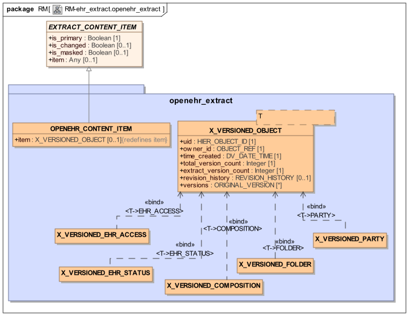

下图说明了EHR提取的典型实例结构。

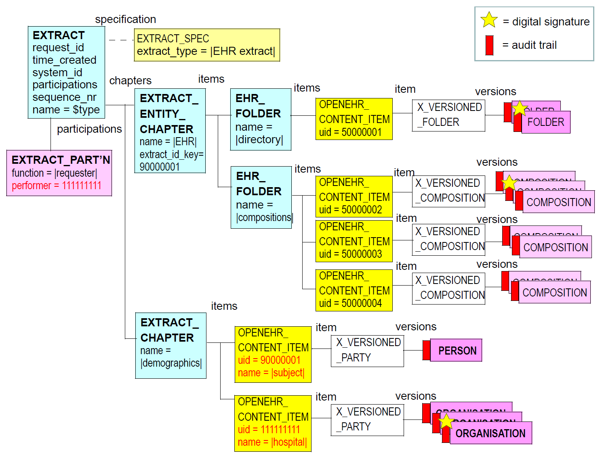

### 5.2.设计

#### 5.2.1. openEHR提取项目

来自包括在EHR提取中的openEHR系统的项总是顶级对象（组合，目录，EHR_EXTRACT，PARTY等以及后代）以X_VERSIONED_OBJECT <T>的后代的可串行化形式表示。这种类型提供了一种标准的可互操作的方式来串行化VERSIONED_OBJECT的所有或部分，以用于系统之间的无损传输，而不管在每一端的版本化中可能的实现差异。因此，X_VERSIONED_OBJECT将VERSIONED_OBJECT的大多数功能属性转换为数据属性。最感兴趣的两个属性是revision_history，它允许从原始VERSIONED_OBJECT中可选地包含完整的修订历史记录，以及允许从原始版本中包含任何或所有版本的版本。可以通过将版本规范的includes_data标志设置为False来自己请求修订历史。

在大多数情况下，将包括版本，并且排除revision_history。 X_VERSIONED_OBJECT.versions中的每个项目都由来自源系统中对应的VERSIONED_OBJECT对象的ORIGINAL_VERSION的封装副本组成。

#### 5.2.2. EHR提取结构

可以使用原型的文件夹结构复制主体的openEHR EHR的整体结构，该结构创建在openEHR EHR中找到的目录，composition，ehr_access和ehr_status的分组。文件夹的这种使用不是强制性的，但在大多数情况下可能是有用的，并且是如上图典型EHR提取结构中所示的结构。

#### 5.2.3.人口参考

在内容中的EHR提取，无论是PARTICIPATION和PARTY_PROXY结构出现（对于后者，PARTY_SELF和PARTY_IDENTIFIED后代），为了保真的原因，它们被完好保留。然而，最终的“指针”，即OBJECT_ID.value可以在提取内被重写以正确地引用预期的人口统计。典型的S_PARTICIPATION结构在图的底部示出典型的EHR提取结构。在该图中，OBJECT_ID.value已被重写以指向图中所示的第一个OPENEHR_CONTENT_ITEM对象的uid（11111111）。

### 5.3.类描述

#### 5.3.1. OPENEHR_CONTENT_ITEM类

<table>
	<tr>
		<td>类</td>
		<td colspan="2">OPENEHR_CONTENT_ITEM</td>
	</tr>
	<tr>
		<td>描述</td>
		<td colspan="2">包含openEHR序列化VERSIONED_OBJECT的EHR EXTRACT_ITEM的形式。</td>
	</tr>
	<tr>
		<td>继承</td>
		<td colspan="2">EXTRACT_CONTENT_ITEM</td>
	</tr>
	<tr>
		<td>属性</td>
		<td>签名</td>
		<td>含义</td>
	</tr>
	<tr>
		<td>0..1（重新定义）</td>
		<td>项目：X_VERSIONED_OBJECT</td>
		<td>内容对象。</td>
	</tr>
</table>

#### 5.3.2. X_VERSIONED_OBJECT类

<table>
	<tr>
		<td>类</td>
		<td colspan="2">X_VERSIONED_OBJECT</td>
	</tr>
	<tr>
		<td>描述</td>
		<td colspan="2">包含的抽取内容的种类是VERSIONED_OBJECT <T>的可共享的面向数据的版本。</td>
	</tr>
	<tr>
		<td>属性</td>
		<td>签名</td>
		<td>含义</td>
	</tr>
	<tr>
		<td>1..1</td>
		<td>uid：HIER_OBJECT_ID</td>
		<td>原始VERSIONED_OBJECT的UID。</td>
	</tr>
	<tr>
		<td>1..1</td>
		<td>owner_id：OBJECT_REF</td>
		<td>Owner_id来自原始VERSIONED_OBJECT，它标识源EHR。</td>
	</tr>
	<tr>
		<td>1..1</td>
		<td>time_created：DV_DATE_TIME</td>
		<td>原始VERSIONED_OBJECT的创建时间。</td>
	</tr>
	<tr>
		<td>1..1</td>
		<td>total_version_count：Integer</td>
		<td>创建此X_VERSIONED_OBJECT时，原始VERSIONED_OBJECT中的版本总数。</td>
	</tr>
	<tr>
		<td>1..1</td>
		<td>extract_version_count：整数</td>
		<td>此版本对象的此提取中的版本数，即versions属性中项目的计数。如果仅请求修订历史记录，则可以为0.</td>
	</tr>
	<tr>
		<td>0..1</td>
		<td>revision_history：REVISION_HISTORY</td>
		<td>原始VERSIONED_OBJECT的可选修订历史记录。如果包括，它是完整的修订历史。</td>
	</tr>
	<tr>
		<td>0..1</td>
		<td>版本：列表<ORIGINAL_VERSION></td>
		<td>0或更多版本，从原始VERSIONED_OBJECT，根据Extract规范。</td>
	</tr>
</table>

#### 5.3.3. X_VERSIONED_EHR_ACCESS类

<table>
	<tr>
		<td>类</td>
		<td colspan="2">X_VERSIONED_EHR_ACCESS</td>
	</tr>
	<tr>
		<td>描述</td>
		<td colspan="2">EHR_ACCESS EHR对象的X_VERSIONED_OBJECT的形式。</td>
	</tr>
</table>

#### 5.3.4. X_VERSIONED_EHR_STATUS类

<table>
	<tr>
		<td>类</td>
		<td colspan="2">X_VERSIONED_EHR_STATUS</td>
	</tr>
	<tr>
		<td>描述</td>
		<td colspan="2">EHR_STATUS EHR对象的X_VERSIONED_OBJECT的形式。</td>
	</tr>
</table>

#### 5.3.5. X_VERSIONED_COMPOSITION类

<table>
	<tr>
		<td>类</td>
		<td colspan="2">X_VERSIONED_COMPOSITION</td>
	</tr>
	<tr>
		<td>描述</td>
		<td colspan="2">COMPOSITION EHR对象的X_VERSIONED_OBJECT形式。</td>
	</tr>
</table>

#### 5.3.6. X_VERSIONED_FOLDER类

<table>
	<tr>
		<td>类</td>
		<td colspan="2">X_VERSIONED_FOLDER</td>
	</tr>
	<tr>
		<td>描述</td>
		<td colspan="2">FOLDER EHR对象的X_VERSIONED_OBJECT的形式。</td>
	</tr>
</table>

#### 5.3.7. X_VERSIONED_PARTY类

<table>
	<tr>
		<td>类</td>
		<td colspan="2">X_VERSIONED_PARTY</td>
	</tr>
	<tr>
		<td>描述</td>
		<td colspan="2">PARTY人口特性对象的X_VERSIONED_OBJECT格式。</td>
	</tr>
</table>

## 6. Generic_extract包

### 6.1. 概述

rm.extract.generic_extract包定义了一种旨在由非开放式EHR系统（包括EHR / EMR系统）使用的Extract，它们希望使用由原型和模板定义的openEHR结构将数据发送到另一个系统。 这样的系统通常不本来包含任何种类的标准化数据，并且通常对版本化具有相当可变和特殊的支持。 下面的UML图说明了rm.extract.generic_extract包。

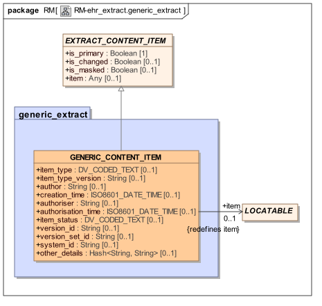

下图说明了典型GENERIC_EXTRACT的实例结构。 包含结构以蓝色显示，内容项包装器（元数据）显示为黄色。

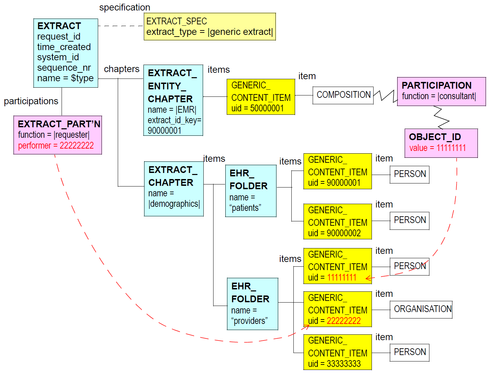

### 6.2.设计

#### 6.2.1.结构体

EXTRACT_CONTENT_ITEM的GENERIC_CONTENT_ITEM子类型定义了元数据，或多或少都可以由典型的传统系统以及诸如IHE / XDS存储库的文档源填充。定义了各种元数据组：文档类型/状态信息，提交审核细节和文档生命周期信息。

文档元数据项如下：

- item_type：指示内容“模型”或模式的编码项，其可以是公布的标准，和/或某种原型，模板或类似的内容控制制造品;

- item_type_version：item_type模型的版本。

下一组项目定义创建原始信息的细节。在一些系统中，这与“提交”相同，即，创建和提交原始数据到系统的动作。在其他情况下，提取中的信息首次组合用于提取的目的，因此审核信息对应于此行为。审计细节如下：

- 作者：作者的原始内容的身份 - 这是当前摘录的另一部分中的人口统计项目的UID引用;

- creation_time：创建内容的日期/时间;

- 授权者：授权此内容的专业人员的身份，如果相关 - 这是UID对当前摘录的另一部分中的人口统计项目的引用;

- authorisation_time：内容被授权的日期/时间;

- item_status：内容的生命周期状态;

- version_id：在创建和/或提交时，在支持版本化的环境中内容项的此特定实例的版本;

- version_set_id：'版本集合'标识符，即一起构成给定逻辑内容项目在时间上的一组版本的版本组的标识符;

- system_id：创建/提交内容/从中提取内容的系统;

- other_details：其他元数据，以String的关键列表的形式。

所有这些项目是可选的，反映了它们在不同源系统中的可用性。提取的原型或模板可以强制某些或全部对于特定种类的提取是强制性的。

项目属性携带可以是任何openEHR LOCATABLE结构的内容，包括诸如COMPOSITION，包括GENERIC_ENTRY，ITEM_TREE或甚至CLUSTER的任何种类的ENTRY。这被假定为已经通过一些数据转换过程从原始系统内的数据转换。

##### 人口参考

在内容中，使用openEHR组合物表达的通用提取物，参与使用参与的内容表示。这在这里对于所需要的使用显然是低效率的，因为它们将从更简单的非开放式EHR数据即时构建，并且将来可能需要更灵活的变体。

待定：更有效的参与参考机制，以支持为提取的目的实时构建的参与。

### 6.3.类描述

#### 6.3.1. GENERIC_CONTENT_ITEM类

<table>
	<tr>
		<td>类</td>
		<td colspan="2">GENERIC_CONTENT_ITEM</td>
	</tr>
	<tr>
		<td>描述</td>
		<td colspan="2">单项在通用提取，专为13606和CDA数据。</td>
	</tr>
	<tr>
		<td>继承</td>
		<td colspan="2">EXTRACT_CONTENT_ITEM</td>
	</tr>
	<tr>
		<td>属性</td>
		<td>签名</td>
		<td>含义</td>
	</tr>
	<tr>
		<td>0..1</td>
		<td>item_type：DV_CODED_TEXT</td>
		<td>用于创建内容的模型或模式的标识符。</td>
	</tr>
	<tr>
		<td>0..1</td>
		<td>item_type_version：String</td>
		<td>用于创建内容项的模型或模式的版本。</td>
	</tr>
	<tr>
		<td>0..1</td>
		<td>author：String</td>
		<td>在此提取中代表项目版本的作者的人口统计实体的引用。引用应该是与包含人口统计信息的GENERIC_CONTENT_ITEM的UID相对应的UID。</td>
	</tr>
	<tr>
		<td>0..1</td>
		<td>creation_time：ISO8601_DATE_TIME</td>
		<td>在原始系统上创建此项目版本的时间。这可以是较早的提交时间，或者可以是在提取生成过程期间创建项目的时间。</td>
	</tr>
	<tr>
		<td>0..1</td>
		<td>authoriser：String</td>
		<td>参考此提取中其他地方的人口统计实体，表示项目版本的授权人（如果相关）。引用应该是与包含人口统计信息的GENERIC_CONTENT_ITEM的UID相对应的UID。</td>
	</tr>
	<tr>
		<td>0..1</td>
		<td>authorisation_time：ISO8601_DATE_TIME</td>
		<td>在相关的原始系统上授权此项目版本的时间。</td>
	</tr>
	<tr>
		<td>0..1</td>
		<td>item_status：DV_CODED_TEXT</td>
		<td>项目的编码生命周期状态。</td>
	</tr>
	<tr>
		<td>0..1</td>
		<td>version_id：String</td>
		<td>原始系统中此项目的版本ID。</td>
	</tr>
	<tr>
		<td>0..1</td>
		<td>version_set_id：String</td>
		<td>原始系统中此项目的版本集ID（如果适用）。</td>
	</tr>
	<tr>
		<td>0..1</td>
		<td>system_id：String</td>
		<td>EMR的标识符或创建/提取项目的其他系统。通常以域名的形式。</td>
	</tr>
	<tr>
		<td>0..1</td>
		<td>other_details：Hash &lt;String，String&gt;</td>
		<td>关于内容项的其他详细信息。</td>
	</tr>
	<tr>
		<td>0..1（重新定义）</td>
		<td>item：LOCATABLE</td>
		<td>内容对象。</td>
	</tr>
</table>

## 7.同步提取

### 7.1. 概述

下面的UML图说明了设计用于同步两个openEHR系统的Extract变体。 该规范仅允许自一定贡献以来的贡献或贡献的列表; 它还允许包括或排除实际版本。 如果他们被排除在外，你可以自己得到只是贡献 - 我知道其他系统有什么。

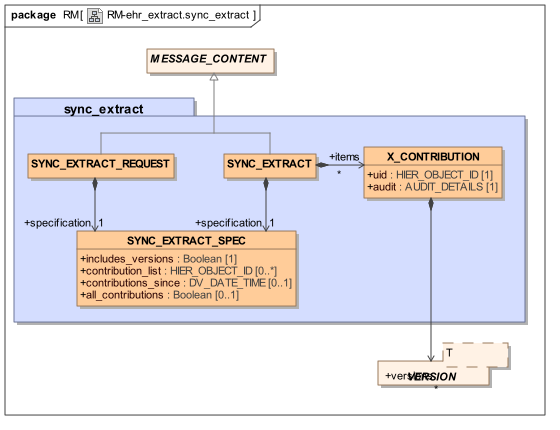

### 7.2.类描述

#### 7.2.1. SYNC_EXTRACT_REQUEST类

<table>
	<tr>
		<td>类</td>
		<td colspan="2">SYNC_EXTRACT_REQUEST</td>
	</tr>
	<tr>
		<td>描述</td>
		<td colspan="2">设计用于在openEHR服务器之间同步贡献的请求类型。</td>
	</tr>
	<tr>
		<td>继承</td>
		<td colspan="2">MESSAGE_CONTENT</td>
	</tr>
	<tr>
		<td>属性</td>
		<td>签名</td>
		<td>含义</td>
	</tr>
	<tr>
		<td>1..1</td>
		<td>规格：SYNC_EXTRACT_SPEC</td>
		<td>同步请求的规范的详细信息。</td>
	</tr>
</table>

7.2.2. SYNC_EXTRACT类

<table>
	<tr>
		<td>类</td>
		<td colspan="2">SYNC_EXTRACT</td>
	</tr>
	<tr>
		<td>描述</td>
		<td colspan="2"></td>
	</tr>
	<tr>
		<td>继承</td>
		<td colspan="2">MESSAGE_CONTENT</td>
	</tr>
	<tr>
		<td>属性</td>
		<td>签名</td>
		<td>含义</td>
	</tr>
	<tr>
		<td>1..1</td>
		<td>规格：SYNC_EXTRACT_SPEC</td>
		<td>此提取的规范的详细信息。</td>
	</tr>
	<tr>
		<td>0..1</td>
		<td>项目：列表<X_CONTRIBUTION></td>
		<td>内容，以串行化的Contributions的形式。</td>
	</tr>
</table>

7.2.3. SYNC_EXTRACT_SPEC类

<table>
	<tr>
		<td>类</td>
		<td colspan="2">SYNC_EXTRACT_SPEC</td>
	</tr>
	<tr>
		<td>描述</td>
		<td colspan="2">Extract的详细说明，在请求中用于指定Extract，或在响应中描述实际在Extract中的内容。</td>
	</tr>
	<tr>
		<td>属性</td>
		<td>签名</td>
		<td>含义</td>
	</tr>
	<tr>
		<td>1..1</td>
		<td>includes_versions：Boolean</td>
		<td>如果包括贡献的版本，则为true;如果只包括贡献及其审核，则为False。</td>
	</tr>
	<tr>
		<td>0..1</td>
		<td>contribution_list：List &lt;HIER_OBJECT_ID&gt;</td>
		<td>要包括/包含在提取中的贡献列表。</td>
	</tr>
	<tr>
		<td>0..1</td>
		<td>contributions_since：DV_DATE_TIME</td>
		<td>指定包含在按阈值日期提取的贡献。</td>
	</tr>
	<tr>
		<td>0..1</td>
		<td>all_contributions：Boolean</td>
		<td>包括记录中的所有Contribution为True。</td>
	</tr>
</table>

7.2.4. X_CONTRIBUTION类

<table>
	<tr>
		<td>类</td>
		<td colspan="2">X_CONTRIBUTION</td>
	</tr>
	<tr>
		<td>描述</td>
		<td colspan="2">提取的贡献的序列化形式。</td>
	</tr>
	<tr>
		<td>继承</td>
		<td colspan="2"></td>
	</tr>
	<tr>
		<td>属性</td>
		<td>签名</td>
		<td>含义</td>
	</tr>
	<tr>
		<td>1..1</td>
		<td>uid：HIER_OBJECT_ID</td>
		<td>源系统中的贡献的用途。</td>
	</tr>
	<tr>
		<td>1..1</td>
		<td>审计：AUDIT_DETAILS</td>
		<td>源系统中的贡献审计。</td>
	</tr>
	<tr>
		<td>0..1</td>
		<td>版本：列表&lt;VERSION&gt;</td>
		<td>源系统中的贡献的序列化版本。</td>
	</tr>
</table>

## 8.消息包

### 8.1.要求

在第8页的要求中描述的前两个EHR提取场景中，可以响应于请求接收提取，或者它们可以是未经请求的。大多数护理转移（例如出院摘要和转诊）和病理检查结果将产生未经请求的提取物，而请求的请求通常将发生，因为患者在没有明确转移护理的情况下在健康系统的另一部分中呈现他或她自己。

### 8.2.设计

消息包提供了发送和接收包含抽象类型为MESSAGE的有效载荷的任何点到点消息的基本抽象。消息包在下面的UML图中说明。

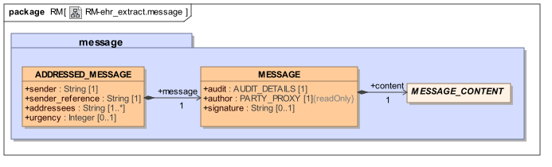

即使有效载荷被创建一次并且被重传多次，每个传输也需要新消息。

#### 8.2.1.完整性和安全性

MESSAGE对象可以包括例如使用SHA-1或MD5算法进行的串行化内容的数字散列（即摘要或数字查找）。摘要的目的是提供对数据的完整性检查。这防止对数据的非恶意更改（例如，由于软件错误，不正确的事务管理）。通常这在安全的封闭环境中是可以接受的，例如私人医院或社区健康网络。

可以通过加密来提供对恶意修改的保护。

待定：标准化的序列化表达式

### 8.3.类描述

#### 8.3.1. ADDRESSED_MESSAGE类

<table>
	<tr>
		<td>类</td>
		<td colspan="2">ADDRESSED_MESSAGE</td>
	</tr>
	<tr>
		<td>描述</td>
		<td colspan="2">发送给指定收件人的邮件的概念。</td>
	</tr>
	<tr>
		<td>继承</td>
		<td colspan="2"></td>
	</tr>
	<tr>
		<td>属性</td>
		<td>签名</td>
		<td>含义</td>
	</tr>
	<tr>
		<td>1..1</td>
		<td>sender：String</td>
		<td>发送消息的Party。</td>
	</tr>
	<tr>
		<td>1..1</td>
		<td>sender_reference：String</td>
		<td>发件人使用的消息的标识。无论将此邮件发送给这些收件人的次数，这将是相同的。</td>
	</tr>
	<tr>
		<td>1..1</td>
		<td>addressees：List &lt;String&gt;</td>
		<td>目标收件人，以互联网地址的形式。</td>
	</tr>
	<tr>
		<td>0..1</td>
		<td>紧急：整数</td>
		<td>
<pre>
目的地应处理消息的紧急程度：

    -1 - 低

    0 - 正常

    1 - 高
</pre>
		</td>
	</tr>
	<tr>
		<td>1..1</td>
		<td>消息：MESSAGE</td>
		<td>消息的内容。</td>
	</tr>
</table>

#### 8.3.2. MESSAGE类

<table>
	<tr>
		<td>类</td>
		<td colspan="2">MESSAGE</td>
	</tr>
	<tr>
		<td>描述</td>
		<td colspan="2">“消息”是针对一个或多个接收者的创作的，可能签名的内容片段。由于收件人可能直接或可能不直接获知，收件人在ADDRESSED_MESSAGE类中指定。</td>
	</tr>
	<tr>
		<td>继承</td>
		<td colspan="2"></td>
	</tr>
	<tr>
		<td>属性</td>
		<td>签名</td>
		<td>含义</td>
	</tr>
	<tr>
		<td>1..1</td>
		<td>作者：PARTY_PROXY</td>
		<td>负责消息内容的方，谁可能或可能不负责其创建（例如通过数据输入等）。</td>
	</tr>
	<tr>
		<td>函数</td>
		<td>签名</td>
		<td>含义</td>
	</tr>
	<tr>
		<td>1..1</td>
		<td>审计：AUDIT_DETAILS</td>
		<td>实际创建消息的人员和时间的详细信息。这是输入数据或以其他方式导致创建消息的人，或者可以是一段软件。</td>
	</tr>
	<tr>
		<td>1..1</td>
		<td>内容：MESSAGE_CONTENT</td>
		<td>消息内容。</td>
	</tr>
	<tr>
		<td>0..1</td>
		<td>signature：String</td>
		<td></td>
	</tr>
</table>

可选签名由作者以openPGP格式的消息内容。签名被创建为具有此签名字段Void的此消息对象的序列化的哈希和可选签名。

## 9. 开放的EHR和ISO 13606提取的语义

### 9.1.版本化语义

虽然对于大多数临床情况，它是被发送到接收器的最新版本的组合物，但是要求包括各种量的版本相关信息，如第8页的要求中所述。至少，组合物总是包括审核跟踪对应于组合所表示的特定版本。在某些情况下，由于某些医学法律原因，需要逻辑组合的历史版本。甚至可能需要接收机系统想要重建版本化对象的完整传真，其在逻辑上与其在源处的形式相同（但是最有可能存储在不同的版本化实现中）。 openEHR提取规范定义了满足这些需求的最简单的方法，即以它们的整体形式包括所有组合，包括在它们是单个逻辑组合的连续版本例如“家族历史”的情况下，如下图所示。这样做的主要理由是，发送者或接收者系统不应对其表示或有效处理版本的能力做出假设。即使是最简单的系统，整个作曲也总能被处理。

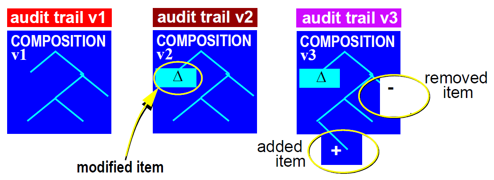

假设任何想要能够确定事物的系统，例如谁负责改变合成的某个片段，当合成的某些部分成立时，或者合成的两个特定版本之间的差异必须本地具有版本控制功能。这通常意味着具有版本控制模型的一些实现，诸如在openEHR公共参考模型中描述的版本控制模型，其可以进行有效的版本控制，差异化等。以完整形式提供组合物确保不对这样的实施可能做什么假设。

这种方法背离了ISO 13606-1：2008 EHR提取标准，其定义了组合，以便包括关于结构的每个节点的修订历史信息。尽管在13606规范中没有说明“组合物”实际上是否应被理解为来自EHR的组合物的拷贝，或者作为EHR中组合物版本的“累积差异”，但分析显示，后者可能有意义，因为组合（Composition）是创建和修改的单位，并且每个版本在逻辑上只有一个审计跟踪。即使是第100版本也只有一个审计跟踪。

这提出了是否应该在openEHR提取中使用“diff”形式的组合物的问题，符合ISO标准。选择该方法的原因有很多：

- 它意味着发送者可以生成“差异”信息结构，并且接收者可以处理它们，即，它对系统的复杂性做出比必要的更多的假设;

- ISO规范似乎相对于删除是错误的 - 逻辑删除的发送似乎没有被正确处理;

- 通常不希望发送删除，并且可能是非法的（例如在欧洲有EC指令阻止发送由临床医生或患者校正的语句）。

值得考虑复杂的累积差异信息是多少。下图说明了在下图中连续版本中仅显示三个变化的累积产生的结构。持久性构成中可能发生的大量变化将产生更复杂的结构。

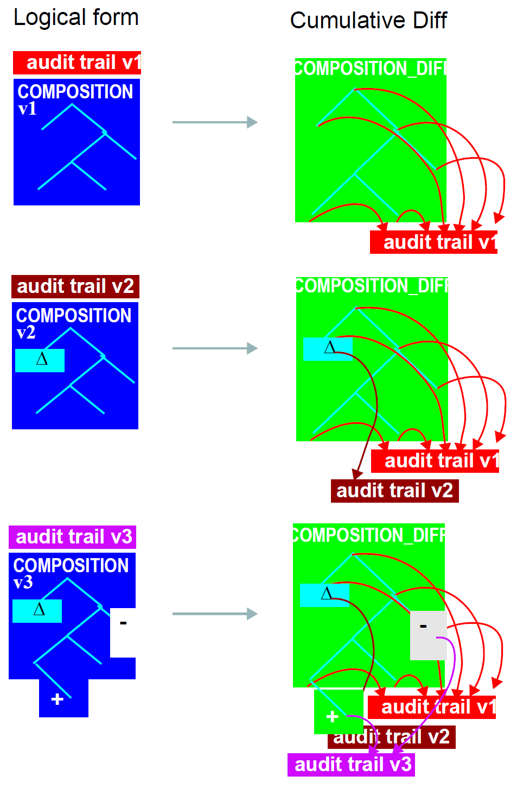

总之，虽然在将来当EHR系统常规地能够进行复杂的版本处理时发送差别形式的合成不是问题，但是当前被认为太复杂，并且对发送删除的信息的控制还没有被充分地描述。

### 9.2.创建语义

下面描述保证EHR提取的正确内容的算法。算法的输入是：

- 提取物中需要的EHR组合物列表（“主要”组合物集）;

- 可选地其中组合物将在提取物中结构化的文件夹结构;

- 所述include_multimedia标志指示DV_MULTIMEDIA内容是否将包括在线中;

- follow_links属性指示应该遵循从构成发出的DV_LINK引用的深度，并且包含也包括在提取中的链接目标的构成。

算法如下。

- 创建一个新的EHR_EXTRACT包括文件夹结构;

- 创建人口统计数据EXTRACT_CHAPTER并写入PARTY;

- 对于原始集中的每个合成，执行：

    - 创建X_VERSIONED_COMPOSITION，并设置is_primary;

    - 对于遇到的OBJECT_REF的每个实例（例如，PARTY_REF），从相关服务获得引用的目标，并将其复制到适当的章节，例如。人口统计，access_groups表与key = OBJECT_REF.id;

    - 将组合复制/序列化到文件夹结构中适当的位置，重写其OBJECT_REFs，以使namespace =“local”

    - 对于遇到的每个DV_MULTIMEDIA实例，根据include_multimedia标志包含或排除由uri或数据属性引用的内容;

    - 根据follow_links的值，对于遇到的每个DV_LINK实例（仅从/到原型实体）：

- 递归地跟随链接。对于每个链接：创建X_VERSIONED_COMPOSITION;设置is_primary = False，写入路径并写入目标组合物在提取中如果还没有;

- 创建DV_LINK对象，以便他们的路径正确引用提取中的组合;

TBD：对Access_control对象做一些事情;

## 参考文献

### 出版物

<ol><li>
    [Anderson_1996]罗斯·安德森。临床信息系统的安全性。可在http://www.cl.cam.ac.uk/users/rja14/policy11/policy11.html获得。
</li><li>
    [Baretto_2005] Barretto S A.设计基于指南的工作流程 - 综合电子健康记录。南澳大学博士论文。可在http://www.cis.unisa.edu.au/~cissab/Barretto_PhD_Thesis_Revised_FINAL.pdf。
</li><li>
    [Beale_2000] Beale T. Archetypes：Constraint-based Domain Models for Future-proof Information Systems。 2000.可查阅http://www.openehr.org/files/resources/publications/archetypes/archetypes_beale_web_2000.pdf。
</li><li>
    [Beale_2002] Beale T.Archetypes：Constraint-based Domain Models for Future-proof Information Systems。第十一届OOPSLA行为语义研讨会：为客户服务（西雅图，美国华盛顿，2002年11月4日）。由Kenneth Baclawski和Haim Kilov编辑。 Northeastern University，Boston，2002，pp。16-32.请访问http://www.openehr.org/files/resources/publications/archetypes/archetypes_beale_oopsla_2002.pdf。
</li><li>
    [Beale_Heard_2007] Beale T，Heard S. An Ontology-based Model of Clinical Information。 2007.pp760-764 Proceedings MedInfo 2007，K.Kuhn et al。 （Eds），IOS Publishing 2007.见http://www.openehr.org/publications/health_ict/MedInfo2007-BealeHeard.pdf。
</li><li>
    [Booch_1994] Booch G.面向对象的分析和设计与应用。第2版​​。本杰明/ Cummings 1994.
</li><li>
    [Browne_2005] Browne E D.工作流建模协调的健康护理提供者护理计划。南澳大学博士论文。请访问http://www.openehr.org/publications/workflow/t_browne_thesis_abstract.htm。
</li><li>
    [Cimino_1997] Cimino J J. Desiderata for Controlled Medical vocabularies in the Twenty-F​​irst Century。 IMIA WG6 Conference，Jacksonville，Florida，Jan 19-22,1997.
</li><li>
    [埃菲尔]迈耶B.埃菲尔的语言（第二版）。 Prentice Hall，1992.
</li><li>
    [Elstein_1987] Elstein AS，Shulman LS，Sprafka SA。医学问题解决：临床推理的分析。剑桥，MA：哈佛大学出版社1987.
</li><li>
	[Elstein_Schwarz_2002] Elstein AS，Schwarz A.临床诊断的证据基础：临床问题解决和诊断决策：对认知文献的选择性审查。 BMJ 2002; 324; 729-732.
</li><li>
    [Fowler_1997] Fowler M.分析模式：可重用对象模型。 Addison Wesley 1997
</li><li>
    [Fowler_Scott_2000] Fowler M，Scott K.UML Distilled（第2版）。 Addison Wesley Longman 2000.
</li><li>
    [Gray_reuter_1993] Gray J，Reuter A. Transaction Processing Concepts and Techniques。 Morgan Kaufmann 1993.
</li><li>
    [Hein_2002] Hein J L.Discrete Structures，Logic and Computability（2nd Ed）。琼斯和巴特利特2002.
</li><li>
    [Hnìtynka_2004]HnìtynkaP，PlášilF. MOF的分布式版本控制模型。 Proceedings of WISICT 2004，Cancun，Mexico，A volume in the ACM international conference proceedings series，published by Computer Science Press，Trinity College Dublin Ireland，2004.
</li><li>
    [Ingram_1995] Ingram D.欧洲良好健康记录项目。 Laires，Laderia Christensen，Eds。健康在新的通信时代。阿姆斯特丹：IOS出版社; 1995; pp。66-74.
</li><li>
    [Kifer_Lausen_Wu_1995] Kifer M，Lausen G，Wu J. Logical Foundations of Object-Oriented and FrameBased Languages。 JACM 1995年5月。见见ftp://ftp.cs.sunysb.edu/pub/TechReports/kifer/flogic.pdf。
</li><li>
    [Kilov_1994] Kilov H，Ross J.信息建模 - 面向对象的方法。 Prentice Hall 1994.
</li><li>
    [Maier_2000] Maier M.系统建模原则。技术报告，阿拉巴马大学在亨茨维尔。 2000.可在http://www.infoed.com/Open/PAPERS/systems.htm获得
</li><li>
    [Martin] Martin P. UML，OWL，KIF和WebKB-2语言之间的翻译（For-Taxonomy，Frame-CG，Formalized English）。 May / June 2003. Available at http://www.webkb.org/doc/model/comparisons.html as at Aug 2004.
</li><li>
    [Meyer_OOSC2] Meyer B. Object-oriented Software Construction，2nd Ed。 Prentice Hall 1997
</li><li>
    [Müller_2003]MüllerR. Event-oriented Dnamic Adaptation of Workflows：Model，Architecture，and Implementation。莱比锡大学博士论文。请访问http://www.openehr.org/publications/workflow/t_mueller_thesis_abstract.htm。
</li><li>
    [Object_Z] Smith G.对象Z规范语言。 Kluwer Academic Publishers 2000.见http://www.itee.uq.edu.au/~smith/objectz.html。
</li><li>
    [Rector_1994] Rector A L，Nowlan W A，Kay S. Foundations for an Electronic Medical Record。 The IMIA Yearbook of Medical Informatics 1992（Eds.van Bemmel J，McRay A）。 Stuttgart Schattauer 1994.
</li><li>
    [Rector] Rector A L.临床术语：为什么这么难？方法。 1999 Dec; 38（4-5）：239-52.可在http://www.cs.man.ac.uk/~rector/papers/Why-is-terminology-hard-single-r2.pdf。
</li><li>
    [Richards_1998] Richards E G. Mapping Time - The Calendar and its History。牛津大学出版社1998.
</li><li>
    [Sowa_2000] Sowa J F.知识表示：逻辑，哲学和计算基础。 2000，Brooks / Cole，California。
</li><li>
    [Sottile_1999] Sottile P.A.，Ferrara F.M.，Grimson W.，Kalra D.，and Scherrer J.R.The holistic healthcare information system。欧洲电子健康记录。 1999年11月; 259-266.
</li><li>
    [Van_de_Velde_Degoulet_2003] Van de Velde R，Degoulet P. Clinical Information Systems：A Component-Based Approach。 2003. Springer-Verlag New York。
</li><li>
    [Weed_1969] Weed LL。医疗记录，医疗教育和病人护理。 6 ed。芝加哥：年鉴医疗出版商公司1969年。
</li></ol>

### 资源

#### 本体

<ol><li>
    [bfo]正式本体和医学信息科学研究所（IFOMIS）。基本正式本体论（BFO）。 http://ifomis.uni-saarland.de/bfo/。
</li><li>
    [FMA] http://sig.biostr.washington.edu/projects/fm/。
</li><li>
    [Horrocks_owl] Patel-Schneider P，Horrocks I，Hayes P. OWL Web本体语言语义和抽象语法。请参阅http://w3c.org/TR/owl-semantics/。
</li><li>
    信息工件本体。 https://code.google.com/p/information-artifact-ontology/。
</li><li>
    [OBO]开放生物和生物医学本体。见http://www.obofoundry.org/。
</li><li>
    [OGMS]一般医学科学本体（OGMS）。 https://code.google.com/p/ogms/。
</li></ol>

#### 一般

1.  [cov_contra]维基百科。协方差和逆变。请参阅https://en.wikipedia.org/wiki/Covariance_and_contravariance_(computer_science）。

#### 电子卫生标准

<ol><li>
    [ENV_13606-1] ENV 13606-1 - 电子医疗记录通信 - 第1部分：扩展架构。 CEN / TC 251健康信息技术委员会。
</li><li>
    [ENV_13606-2] ENV 13606-2 - 电子医疗记录通信 - 第2部分：域名术语列表。 CEN / TC 251健康信息技术委员会。
</li><li>
    [ENV_13606-3] ENV 13606-3 - 电子医疗记录通信 - 第3部分：分发规则。 CEN / TC 251健康信息技术委员会。
</li><li>
    [ENV_13606-4] ENV 13606-4 - 电子医疗记录通信标准第4部分：信息交换的信息。 CEN / TC 251健康信息技术委员会。
</li><li>
    [Corbamed_PIDS]对象管理组。人身份识别服务。 1999年3月。
</li><li>
    [Corbamed_LQS]对象管理组。词典查询服务。 1999年3月。
</li><li>
    [HL7v3_ballot2] JL7国际。 HL7版本3第二选票规格。可在http://www.hl7.org获得。
</li><li>
    [HL7v3_data_types] Schadow G，Biron P. HL7第3版可交付：第3版数据类型。 （2002年第二版投票）。
</li><li>
    [hl7_v3_rim] HL7. HL7 v3 RIM。见http://www.hl7.org。
</li><li>
    [ICD10AM]。世卫组织/ ACCD。国际疾病分类，第10次修订，澳大利亚修改。请参见https://www.accd.net.au/Icd10.aspx
</li><li>
    [IHTSDO]国际健康术语标准制定组织（IHTSDO）。 http://www.ihtsdo.org。
</li><li>
    [IHTSDO_URIs] IHTSDO。 SNOMED CT URI标准。 http://ihtsdo.org/fileadmin/user_upload/doc/download/doc_UriStandard_Current-en-US_INT_20140527.pdf?ok。
</li><li>
    [NLM_UML_list]国家医学图书馆。 UMLS术语表。 http://www.nlm.nih.gov/research/umls/metaa1.html。
</li><li>
    [SNOMED_CT] IHTSDO。系统化命名医学。请参见http://www.ohtsdo.org。
</li><li>
    [WHO_ICD]世界卫生组织（WHO）。国际疾病分类（ICD）。见：http：//www.who.int/classifications/icd/en/。
</li><li>
    [ISO_18308] Schloeffel P.（编辑）。电子健康记录参考架构的要求。 （ISO TC 215 / SC N; ISO / WD 18308）。国际标准组织，澳大利亚，2002年。
</li><li>
    [ISO_20514] ISO。综合护理EHR。见http://www.iso.org/iso/iso_catalogue/catalogue_tc/catalogue_detail.htm?csnumber=39525.
</li><li>
    [UCUM] Schadow G，McDonald C J.The Unified Code for Units of Measure，Version 1.4 2000.Regenstrief Institute for Health Care，Indianapolis。请参阅http://aurora.rg.iupui.edu/UCUM
</li></ol>

#### 电子卫生项目

<ol><li>
    [CIMI]临床信息建模倡议（CIMI）项目。参见http://opencimi.org。
</li><li>
    [EHCR_supA_14] Dixon R，Grubb P A，Lloyd D，and Kalra D. Consolidated List of Requirements。 EHCR支持行动交付1.4.欧盟委员会DGXIII，布鲁塞尔; 2001年5月59pp可从http://www.chime.ucl.ac.uk/HealthI/EHCR-SupA/del1-4v1_3.PDF获得。
</li><li>
    [EHCR_supA_35] Dixon R，Grubb P，Lloyd D. EHCR支持行动交付3.5：“对CEN未来工作的最终建议”。 2000年10月。见http://www.chime.ucl.ac.uk/HealthI/EHCRSupA/documents.htm。
</li><li>
    [EHCR_supA_24] Dixon R，Grubb P，Lloyd D. EHCR支持行动2.4“CEN EHCRA解释和实施指南”。 2000年10月。见http://www.chime.ucl.ac.uk/HealthI/EHCR-SupA/documents.htm。
</li><li>
    [Lloyd D，et al。 EHCR支持行动交付3.1和3.2“CEN的中期报告”。 July 1998. Available at http://www.chime.ucl.ac.uk/HealthI/EHCR-SupA/documents.htm。
</li><li>
	[GEHR_del_4]可交付成果4：GEHR临床综合性要求。 GEHR项目1992
</li><li>
    [GEHR_del_7]可交付成果7：临床功能规范。 GEHR项目1993
</li><li>
    [GEHR_del_8]可交付成果8：GEHR架构和系统的伦理和法律要求。 1994年GEHR项目
</li><li>
    [GEHR_del_19_20_24]交付成果19,20,24：GEHR架构。 GEHR项目30/6/1995
</li><li>
    [GeHR_AUS] Heard S，Beale T.The Good Electronic Health Record（GeHR）（Australia）。请参阅http://www.openehr.org/resources/related_projects#gehraus。
</li><li>
    [GeHR_Aus_gpcg] Heard S. GEHR Project Australia，GPCG Trial。可在http://www.gehr.org/gpcg/ehra.htm。
</li><li>
    [GeHR_Aus_req] Beale T，Heard S.GEHR技术要求。请参阅http://www.gehr.org/technical/requirements/gehr_requirements.html。
</li><li>
    [Synapses_req_A] Kalra D.（Editor）。突触用户需求和功能规范（A部分）。欧盟远程信息处理应用程序，布鲁塞尔; 1996;突触项目：可交付用户1.1.1a。 6章，176页。
</li><li>
    [Synapses_req_B] Grimson W.和Groth T.（Editors）。突触用户需求和功能规范（B部分）。欧盟远程信息处理应用程序，布鲁塞尔; 1996;突触项目：可交付用户1.1.1b。
</li><li>
    [Synapses_odp] Kalra D.（编辑）。突触ODP信息观点。欧盟远程信息处理应用程序，布鲁塞尔; 1998;突触项目：最终交付。 10章，64页。
</li><li>
    [synex]伦敦大学学院。 SynEx项目。 http://www.chime.ucl.ac.uk/HealthI/SynEx/。
</li></ol>

#### 一般标准

<ol><li>
    [OCL]对象约束语言2.0.对象管理组（OMG）。可在http://www.omg.org/cgi-bin/doc?ptc/2003-10-14.
</li><li>
    [IANA] IANA。 http://www.iana.org/。
</li><li>
    [IEEE_828] IEEE。 IEEE 828-2005：软件配置管理计划标准。
</li><li>
    [ISO_8601] ISO 8601标准描述了表示时间，日期和持续时间的格式。参见例如http://www.mcs.vuw.ac.nz/technical/software/SGML/doc/iso8601/ISO8601.html和http://www.cl.cam.ac.uk/~mgk25/iso-time.html 。
</li><li>
    [ISO_2788] ISO。 ISO 2788单语词典的建立和发展指南。
</li><li>
    [ISO_5964] ISO。 ISO 5964建立和开发多语言词典的指南。
</li><li>
    [Perl_regex] Perl.org。 Perl正则表达式。可在http://perldoc.perl.org/perlre.html。
</li><li>
    斯坦福大学。参见http://protege.stanford.edu/。
</li><li>
    [rfc_2396] Berners-Lee T.Universal Resource Identifiers in WWW。可在http://www.ietf.org/rfc/rfc2396.txt。这是一个用于全局资源识别的万维网RFC。在当前在网上使用时，由Mosaic，Netscape和类似工具。有关URI的起点，请参阅http://www.w3.org/Addressing。
</li><li>
    [rfc_2440] RFC 2440：OpenPGP消息格式。见http://www.ietf.org/rfc/rfc2440.txt和http://www.ietf.org/internet-drafts/draft-ietf-openpgp-rfc2440bis-18.txt
</li><li>
	[rfc_3986] RFC 3986：统一资源标识符（URI）：通用语法。 IETF。参见http://www.ietf.org/rfc/rfc3986.txt。
</li><li>
    [rfc_4122] RFC 4122：通用唯一标识符（UUID）URN命名空间。 IETF。参见http://www.ietf.org/rfc/rfc4122.txt。
</li><li>
    [rfc_2781] IETF。 RFC 2781：UTF-16，ISO 10646的编码见http://tools.ietf.org/html/rfc2781.
</li><li>
    [rfc_5646] IETF。 RFC 5646. Available at http://tools.ietf.org/html/rfc5646.
</li><li>
    [sem_ver]语义版本化。 http://semver.org。
</li><li>
    [Xpath] W3C Xpath 1.0规范。 1999.可在http://www.w3.org/TR/xpath。
</li><li>
    [uri_syntax]统一资源标识符（URI）：通用语法，因特网提议的标准。 2005年1月。见http://www.ietf.org/rfc/rfc3986.txt。
</li><li>
    [w3c_owl] W3C。 OWL - Web本体语言。请参阅http://www.w3.org/TR/2003/CR-owl-ref-20030818/。
</li><li>
    [w3c_xpath] W3C。 XML路径语言。请参阅http://w3c.org/TR/xpath。
</li></ol>

#### 工具

1.  [Template_Designer]模板设计器。海洋信息学。 http://www.openehr.org/downloads/modellingtools。

#### openEHR资源

<ol><li>
    [openehr_18308] openEHR基金会。 openEHR架构符合ISO TS 18308“EHR体系结构的要求”。请参阅http://www.openehr.org/releases/trunk/architecture/iso18308_conformance.pdf。
</li><li>
    [openEHR_ADL_workbench] openEHR基金会。 openEHR ADL工作台。 http://www.openehr.org/downloads/ADLworkbench/home。
</li><li>
    [openehr_am_overview] openEHR基金会。 openEHR原型技术概述。请参阅http://www.openehr.org/releases/AM/latest/Overview.html。
</li><li>
    [openehr_am_adl14] openEHR基金会。原型定义语言1.4（ADL1.4）。请访问http://www.openehr.org/releases/AM/latest/ADL1.4.html。
</li><li>
    [openehr_am_aom14] openEHR基金会。原型对象模型1.4（AOM1.4）。请访问http://www.openehr.org/releases/AM/latest/AOM1.4.html。
</li><li>
    [openehr_am_adl2] openEHR基金会。原型定义语言2（ADL2）。请访问http://www.openehr.org/releases/AM/latest/ADL2.html。
</li><li>
    [openehr_am_aom2] openEHR基金会。原型对象模型2（AOM2）。请访问http://www.openehr.org/releases/AM/latest/AOM2.html。
</li><li>
    [openehr_am_identification] openEHR基金会。原型标识规范。请访问http://www.openehr.org/releases/AM/latest/Identification.html。
</li><li>
    [openehr_am_def_pri] openEHR基金会。原型定义和原则。 （已弃用）可查阅http://www.openehr.org/releases/1.0.2/architecture/am/archetype_principles.pdf。
</li><li>
    [openehr_am_sys] openEHR基金会。原型系统。 （已弃用）可查阅http://www.openehr.org/releases/1.0.2/architecture/am/archetype_system.pdf。
</li><li>
    [openehr_am_oap] openEHR基金会。 openEHR原型配置文件。 http://www.openehr.org/releases/1.0.2/architecture/am/openehr_archetype_profile.pdf。
</li><li>
    [openehr_CKM] openEHR临床知识经理（CKM）。请参阅http://www.openEHR.org/ckm
</li><li>
    [openehr_odin] openEHR基金会。对象数据实例符号（ODIN）。请访问http://www.openehr.org/releases/BASE/latest/odin.html。
</li><li>
    [openeneH_overview] openEHR基金会。 openEHR架构概述。请参阅http://www.openehr.org/releases/BASE/latest/architecture_overview.html。
</li><li>
    [openehr_query_aql] openEHR基金会。 openEHR原型查询语言（AQL）。请参阅http://www.openehr.org/releases/QUERY/latest/AQL.html。
</li><li>
    [openehr_rm_data_types] openEHR。数据类型信息模型。请参阅http://www.openehr.org/releases/RM/Release-1.0.3/data_types.html。
</li><li>
    [openehr_rm_data_structures] openEHR。数据结构信息模型。请参阅http://www.openehr.org/releases/RM/Release-1.0.3/data_structures.html。
</li><li>
    [openehr_rm_common] openEHR。公共信息模型。请参阅http://www.openehr.org/releases/RM/Release-1.0.3/common.html。
</li><li>
    [openehr_rm_ehr] openEHR基金会。 EHR信息模型。 http://www.openehr.org/releases/RM/Release-1.0.3/ehr.html。
</li><li>
    [openehr_rm_ehr_extract] openEHR基金会。 EHR Extrct信息模型。 http://www.openehr.org/releases/RM/Release-1.0.3/ehr_extract.html。
</li><li>
	[openehr_rm_integration] openEHR基金会。 集成信息模型。 http://www.openehr.org/releases/RM/Release-1.0.3/integration.html。
</li><li>
     [openehr_rm_support] openEHR。 支持信息模型。 请参阅http://www.openehr.org/releases/RM/Release-1.0.3/support.html。
</li><li>
     openEHR基金会。 openEHR术语http://www.openehr.org/releases/TERM/latest/SupportTerminology.html。
</li><li>
     [openeneHL基金会]。 openEHR术语项目（GitHub）https://github.com/openEHR/terminology。
</li></ol>

最后更新2015-12-10 13:18:23 GMT