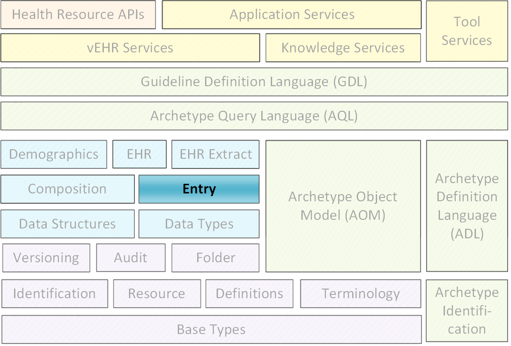
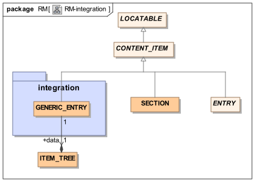
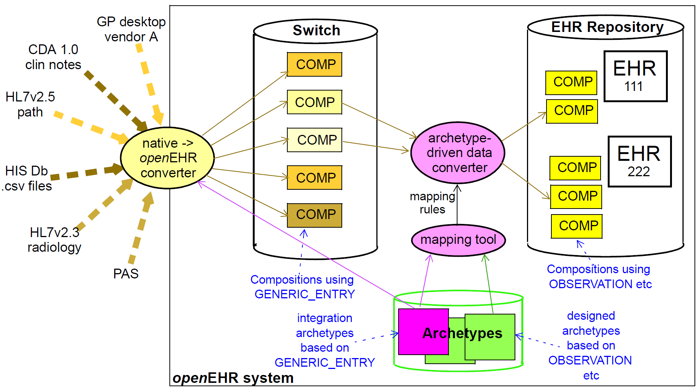

<!-- markdown extra -->

# 集成信息模型

| 发行人：openEHR规范程序 |
|---|---|
|发布：版本1.0.3|状态：STABLE|
|修订：[最新版]|日期：[最新发布日期]|
|关键词：EHR，整合，openehr|

|©2003 - 2015 openEHR基金会|
| [openEHR基金会](http://www.openehr.org/)是一个独立的非营利社区组织，通过开源，基于标准的实施，促进消费者和临床医生共享健康记录。|
|执照|Creative Commons Attribution-NoDerivs 3.0 Unported。 https://creativecommons.org/licenses/by-nd/3.0/|
|支持|问题：https：//openehr.atlassian.net/browse/SPECPR/
网址：http：//www.openehr.org/|

## 修订记录
|问题|详情|发起人|结束时间|
|R E L E A S E 1.0.1|
|0.6|SPEC-203：1.0版的说明文字改进。 添加了关于openEHR提取的部分。 增加集成架构图。|T Beale|2006年7月22日|
|R E L E A S E 1.0|
|0.5|初始写作。|T Beale|2005年9月15日|

## 致谢

本文件所报告的工作由下列组织提供资金：

- 伦敦大学学院 - 健康信息学和多专业教育中心（CHIME）;

- 海洋信息;

特别感谢CHIME负责人David Ingram教授，他提供了自GEHR（1992年）时代以来的愿景和合作的工作环境。

## 1.前言

### 1.1. 目的

本文档描述了openEHR集成信息模型的架构，旨在用于传统和其他集成情况。

目标受众包括：

- 生产卫生信息学标准的标准机构;

- 使用openEHR的学术团体;

- 开源医疗保健社区;

- 解决方案供应商;

- 医疗信息学家和临床医生对健康信息感兴趣。

- 健康数据管理器。

### 1.2. 相关文件

阅读本文档的前提条件包括：

- openEHR架构概述（[openehr_overview]）;

### 1.3. 状态

此规范处于稳定状态。本文档的开发版本可以在http://www.openehr.org/releases/RM/latest/integration.html找到。

已知的遗漏或问题在文本中用“待定”段落表示，如下：

TBD :(例如待定段落）

鼓励用户对这些段落以及主要内容发表评论和/或建议。应在技术邮件列表或规格问题跟踪器上提供反馈。

### 1.4. 一致性

数据或软件工件与openEHR参考模型规范的一致性通过该工件相对于相关openEHR实现技术规范（ITS）（例如IDL接口或XML模式）的形式测试来确定。由于ITS是来自参考模型的形式化的自动推导，ITS一致性指示RM一致性。

## 2.集成包

### 2.1. 要求

将数据输入和输出EHR是openEHR旨在满足的最基本的要求之一。在“greenfield”（新构建）情况下，并且对于由GUI应用程序通过openEHR EHR API创建的数据，没有问题，因为使用了本机openEHR结构和语义。在几乎所有其他情况下，必须考虑现有的数据源和汇。一般来说，外部或“遗留”数据（这里该术语是为了方便而使用，并且不暗示关于所讨论的系统的年龄或质量的任何数据）具有与openEHR数据不同的语法和语义格式，并且无缝转换需要解决水平。

传统数据源和宿的典型示例包括关系数据库，HL7v2消息和HL7 CDA文档。 HL7v2消息可能是许多国家最常见的病理信息来源之一; EDIFACT消息是另一种。最近，HL7v2消息被设计用于转介，甚至排放摘要。不是所有的传统系统都是标准化的;许多如果不是大多数医院以及GP和其他台式机产品都有自己的私人模型的数据和术语使用。从技术上讲，标准化和非标准化的遗留模型之间没有太大的区别;只有解决方案的可重用性不同。

此处描述的集成包解决的另一个重要类别的外部数据是以CEN EN13606提取形式表示的数据。 EN13606的第1部分定义了一个信息模型，它在组合和SECTION级别与openEHR的信息模型几乎相同。 CEN EN13606 Entry类是具有最小上下文元数据的通用结构，并且可以容易地映射到本规范中描述的openEHR Entry类型。

相对于遗留数据的主要需求是能够将来自多个相互不兼容的源的数据转换成用于每个患者的单个，标准化的以患者为中心的EHR，然后可以纵向查看和查询。这使得GP和专家笔记，诊断和计划能够与来自多个来源，患者说明，行政数据等的实验室结果集成，以提供患者旅程的连贯记录。

在技​​术术语中，必须处理多种类型的不兼容性。不能保证传入事务的范围和目标openEHR结构的对应关系 - 例如，传入文档可以对应于多个临床原型。结构通常不对应，遗留数据（特别是消息）通常具有比目标原型中定义的结构更平坦的结构。术语的使用在现有的系统和消息中是非常不稳定的，也必须加以处理。数据类型也不会直接对应，因此，例如，必须进行传入字符串“110/80 mmHg”和两个DV_QUANTITY对象的目标openEHR形式之间的映射，每个对象都有自己的值和单位。

## 2.2. 设计基础
### 2.2.1. 概述

将现有系统连接到openEHR的设计基础是建立在对数据所需的语法和语义变换的明确分离的基础上的。句法转换将源数据从其原始形式（或其可能已被转换成的任何中间形式）转换为在openEHR参考模型中遵守特殊类的格式，但是其逻辑结构和语义由“集成”原型控制，以便以模仿源数据的设计。此步骤将数据导入openEHR计算上下文。第二步导致将这个中间openEHR数据转换为a）主openEHR参考模型的实例的数据，和b）服从“设计的”临床原型。

使得这种转换成为可能的openEHR结构的附加元件是：

- 类GENERIC_ENTRY，它是SECTION和ENTRY的兄弟，并且包含完全通用的，可构造的结构;

- 'integration'原型，即针对GENERIC_ENTRY类定义的原型;

- 来自基于GENERIC_ENTRY的openEHR数据和基于ENTRY的子类型的集成原型到数据的语义转换规则，以及设计的原型。

下图说明了rm.integration包，其中包含单个类GENERIC_ENTRY。与openEHR参考模型中的其他类不同，GENERIC_ENTRY根本不包含硬连线属性，只包含一个通用属性数据。没有对这些数据的实际形状作任何假设。

2.2.2. GENERIC_ENTRY的语义

这种建模方法有许多有用的后果。首先，GENERIC_ENTRY的实例将包含从LOCATABLE类继承的属性，包括archetype_node_id，因此可以以与openEHR引用模型中所有其他类相同的方式进行构造。 LOCATABLE属性feeder_audit也被继承，并且可以用于使用来自源系统记录或消息的相关元数据来标记数据的每个节点。其次，作为CONTENT_ITEM的子类型，GENERIC_ENTRY是COMPOSITION.content的有效值。这是一个完全理想的情况，因为相同的规则适用于GENERIC_ENTRY和其他内容：实例只能作为COMPOSITION实例的一部分提交到记录。因此，GENERIC_ENTRY数据以正常方式被审计跟踪和版本化。第三，GENERIC_ENTRY实例可以发生在SECTION的层次结构中，这对于具有标题或部分等同物的数据源（这在包含医生笔记的医院信息系统中非常常见）是有用的。最后，与所有其他openEHR数据一样，可以为GENERIC_ENTRY的原型构建设计时路径，而运行时路径可以基于这样的原型从数据中提取。这些路径集可用于写入数据转换规则。

应该记住，虽然GENERIC_ENTRY为openEHR中的外部源数据提供了一个标准化的句法形式，但它不提供语义一致性。对于来自众多数据源的GENERIC_ENTRY实例尤其如此：不能保证来自系统A的“胆固醇结果”的GENERIC_ENTRY表示将与来自系统B的GENERIC_ENTRY表示一致。甚至不要求数据源极大地不同的是这个问题发生。可以找到来自不同病理实验室的消息的示例，其遵守HL7v2（例如2.3.1）的相同次要版本并且应该实现相同的消息类型（例如“完整血液图片”），但是在实际结构和内容上不同。这种情况的后果是GENERIC_ENTRY数据通常不能安全地用于临床计算（例如决策支持），并且通常甚至不支持可靠的临床查询。换句话说，GENERIC_ENTRYs的库（在适当的组合结构中）不构成可靠或可互操作的健康记录 - 它只能被认为是标准化的健康信息数据存储，其主要目的是作为语义转换过程的输入或输出，或用于其他审核或非临床数据管理目的。

2.2.3. 与openEHR提取一起使用

GENERIC_ENTRY类提供了一种表示来自实现openEHR提取规范的非openEHR系统的数据的方法，以便与openEHR系统通信，或与也实现openEHR提取规范的其他系统进行通信。

2.2.4. 与CEN EN13606集成

GENERIC_ENTRY类为使openEHR系统符合EN13606标准提供了一个方便的基础，这使得openEHR在使用EN13606进行数据通信的异构环境中具有网关能力。 CEN EN13606 EHR提取可以转换为一系列包含GENERIC_ENTRY对象的组合，这些对象遵循适当的集成原型;这个数据然后可以语义上转换为正统的openEHR对象，以便集成到一个一致的EHR中。类似地，openEHR数据可以转换为基于GENERIC_ENTRY的中间形式，以进一步转换为EN13606 EHR提取。

2.3. 数据转换架构

将数据导入openEHR系统的基于集成原型的策略（如下图所示）由两个步骤组成。

首先，数据从其原始的句法格式转换为openEHR组合/ SECTION / GENERIC_ENTRY结构，如openEHR集成开关所示。大多数数据将出现在GENERIC_ENTRY部分，由设计为尽可能接近地模拟传入结构（例如HL7v2实验室消息）的集成原型控制; FEEDER_AUDIT结构用于包含集成元数据。该步骤的结果是在openEHR类型系统中表示的数据（即，作为openEHR参考模型的实例），并且立即适于用正常openEHR软件处理。

在第二步中，通过使用集成和设计的原型之间的映射来实现语义变换。这种映射是由原型作者使用工具创建的。映射规则是定义结构变换，使用术语代码和其他变化的关键。当然，严重的挑战仍然在集成异构系统的业务;其中一些在馈线系统的通用IM文档部分中讨论。

2.4. 类描述
2.4.1. GENERIC_ENTRY类

<table>
	<tr>
		<td>类</td>
		<td colspan="2">GENERIC_ENTRY</td>
	</tr>
	<tr>
		<td>描述</td>
		<td colspan="2">此类用于创建来自不符合openEHR类（例如HL7消息，关系数据库等）的源的数据的中间表示。</td>
	</tr>
	<tr>
		<td>继承</td>
		<td colspan="2">CONTENT_ITEM</td>
	</tr>
	<tr>
		<td>属性</td>
		<td>签名</td>
		<td>含义</td>
	</tr>
	<tr>
		<td>1..1</td>
		<td>数据：ITEM_TREE</td>
		<td>来自源消息或记录的“数据”。</td>
	</tr>
</table>

## 参考文献

### openEHR资源

<ol><li>
[openehr_18308] openEHR基金会。 openEHR架构符合ISO TS 18308“EHR体系结构的要求”。请参阅http://www.openehr.org/releases/trunk/architecture/iso18308_conformance.pdf。

</li><li>[openEHR_ADL_workbench] openEHR基金会。 openEHR ADL工作台。 http://www.openehr.org/downloads/ADLworkbench/home。

</li><li>[openehr_am_overview] openEHR基金会。 openEHR原型技术概述。请参阅http://www.openehr.org/releases/AM/latest/Overview.html。

</li><li>[openehr_am_adl14] openEHR基金会。原型定义语言1.4（ADL1.4）。请访问http://www.openehr.org/releases/AM/latest/ADL1.4.html。

</li><li>[openehr_am_aom14] openEHR基金会。原型对象模型1.4（AOM1.4）。请访问http://www.openehr.org/releases/AM/latest/AOM1.4.html。

</li><li>[openehr_am_adl2] openEHR基金会。原型定义语言2（ADL2）。请访问http://www.openehr.org/releases/AM/latest/ADL2.html。

</li><li>[openehr_am_aom2] openEHR基金会。原型对象模型2（AOM2）。请访问http://www.openehr.org/releases/AM/latest/AOM2.html。

</li><li>[openehr_am_identification] openEHR基金会。原型标识规范。请访问http://www.openehr.org/releases/AM/latest/Identification.html。

</li><li>[openehr_am_def_pri] openEHR基金会。原型定义和原则。 （已弃用）可查阅http://www.openehr.org/releases/1.0.2/architecture/am/archetype_principles.pdf。

</li><li>[openehr_am_sys] openEHR基金会。原型系统。 （已弃用）可查阅http://www.openehr.org/releases/1.0.2/architecture/am/archetype_system.pdf。

</li><li>[openehr_am_oap] openEHR基金会。 openEHR原型配置文件。 http://www.openehr.org/releases/1.0.2/architecture/am/openehr_archetype_profile.pdf。

</li><li>[openehr_CKM] openEHR临床知识经理（CKM）。请参阅http://www.openEHR.org/ckm

</li><li>[openehr_odin] openEHR基金会。对象数据实例符号（ODIN）。请访问http://www.openehr.org/releases/BASE/latest/odin.html。

</li><li>[openeneH_overview] openEHR基金会。 openEHR架构概述。请参阅http://www.openehr.org/releases/BASE/latest/architecture_overview.html。

</li><li>[openehr_query_aql] openEHR基金会。 openEHR原型查询语言（AQL）。请参阅http://www.openehr.org/releases/QUERY/latest/AQL.html。

</li><li>[openehr_rm_data_types] openEHR。数据类型信息模型。请参阅http://www.openehr.org/releases/RM/Release-1.0.3/data_types.html。

</li><li>[openehr_rm_data_structures] openEHR。数据结构信息模型。请参阅http://www.openehr.org/releases/RM/Release-1.0.3/data_structures.html。

</li><li>[openehr_rm_common] openEHR。公共信息模型。请参阅http://www.openehr.org/releases/RM/Release-1.0.3/common.html。

</li><li>[openehr_rm_ehr] openEHR基金会。 EHR信息模型。 http://www.openehr.org/releases/RM/Release-1.0.3/ehr.html。

</li><li>[openehr_rm_ehr_extract] openEHR基金会。 EHR Extrct信息模型。 http://www.openehr.org/releases/RM/Release-1.0.3/ehr_extract.html。

</li><li>[openehr_rm_integration] openEHR基金会。集成信息模型。 http://www.openehr.org/releases/RM/Release-1.0.3/integration.html。

</li><li>[openehr_rm_support] openEHR。支持信息模型。请参阅http://www.openehr.org/releases/RM/Release-1.0.3/support.html。

</li><li>openEHR基金会。 openEHR术语http://www.openehr.org/releases/TERM/latest/SupportTerminology.html。

</li><li>[openeneHL基金会]。 openEHR术语项目（GitHub）https://github.com/openEHR/terminology。
</li></ol>

