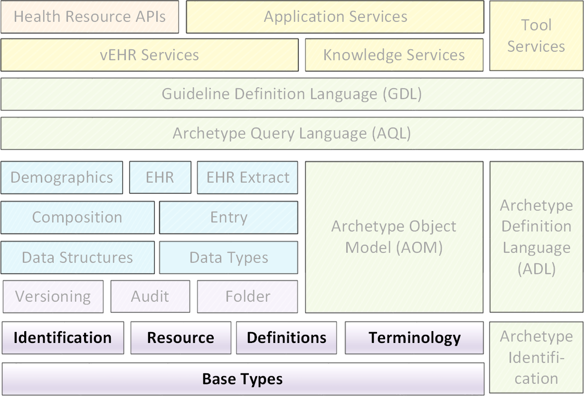
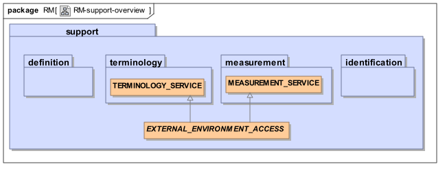
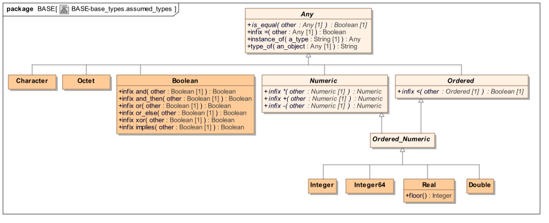
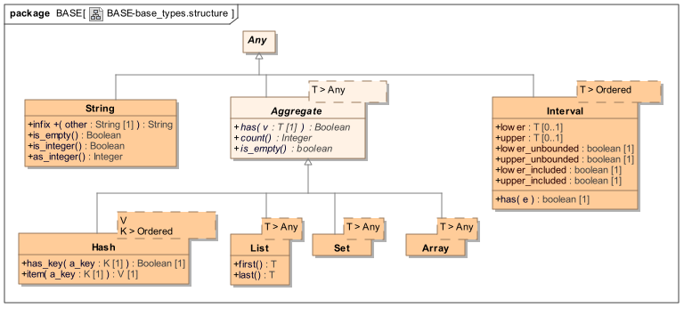
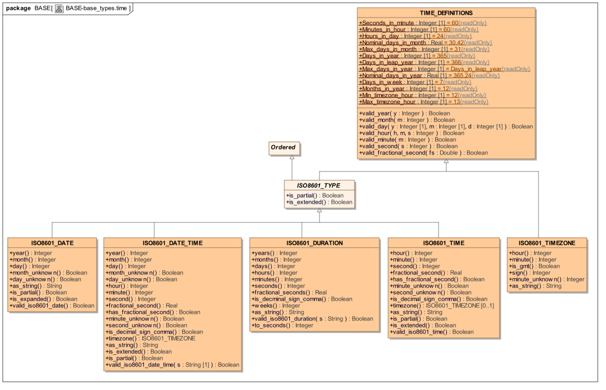
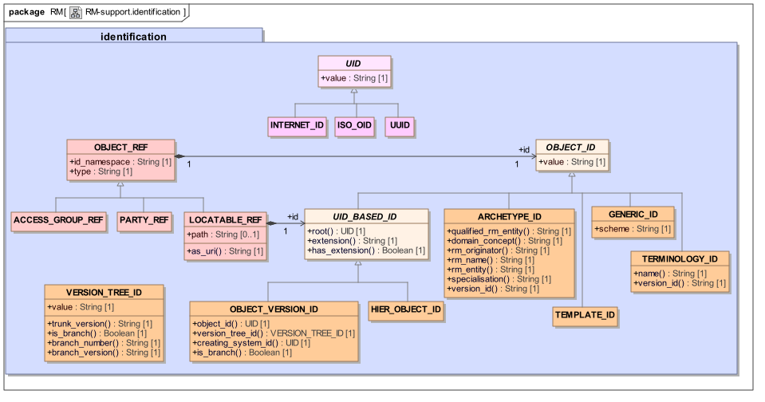
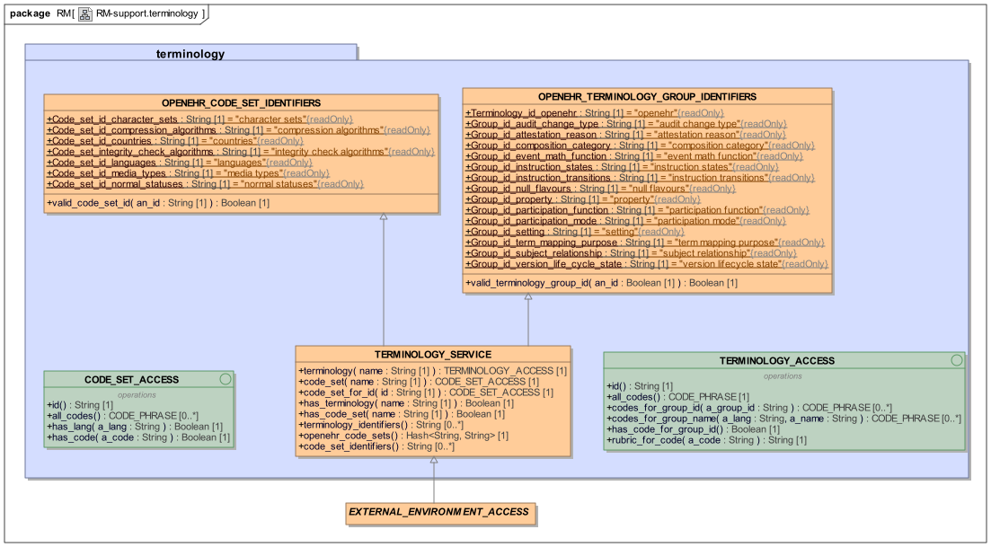
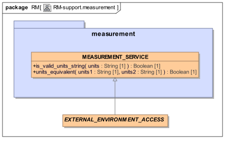

# 支持信息模型

发行人：openEHR规范程序

发布：版本1.0.3

状态：STABLE

修订：[latest_issue]

日期：[latest_issue_date]

关键词：EHR，openehr，标识符，类型

©2003 - 2015 openEHR基金会

openEHR基金会是一个独立的非营利社区组织，通过开源，基于标准的实施，促进消费者和临床医生共享健康记录。

- 许可
	- Creative Commons Attribution-NoDerivs 3.0 Unported。 https://creativecommons.org/licenses/by-nd/3.0/
- 支持
	- 问题：https：//openehr.atlassian.net/browse/SPECPR/
	- 网址：http：//www.openehr.org/
 
## 修订记录

- R E L E A S E 1.0.3
	- 1.7.0 (2015年8月15日)
		- SPECRM-29：将DV_COUNT.magnitude更改为integer64类型。
	- 1.7.0 (2015年10月10日)
		- SPECRM-31：升级INTERNET_ID语法以允许下划线;清理EBNF。
- R E L E A S E 1.0.2
	- 1.6.1 (2008年10月20日)
		- SPEC-256：更正UID_BASED_ID类中的extension_validity。
		- SPEC-260：更正为ARCHETYPE_ID类型发布的正则表达式。改进了复合标识符的说明文本，包括对区分大小写的说明。警告包括.v1draft不符合。
- R E L E A S E 1.0.1
	- 1.6.0 (2007年4月8日)
		- CR-000215：合并DV_PARTIAL_XX日期/时间类，并将ISO 8601语义移动到支持IM。
		- CR-000209：进行次要更改以正确定义AUTHORED_RESOURCE.current_revision。为List <T>类添加最小定义。
		- CR-000200：正确的1.0版排字错误。将INTERVAL类定义移动到正确的部分。添加两个不变量。改进标识符的说明。
		- CR-000202：更正VERSION.preceding_version_id中的小错误。添加了is_first函数，并且不变为VERSION_TREE_ID类。添加了基于1的编号的不变量
		- CR-000203：1.0版说明文字改进。
		- CR-000204：添加OBJECT_ID的通用id子类型。
		- CR-000216：允许在ISO8601中的W，D等的混合持续时间（与标准偏差）。
		- CR-000219：使用常量而不是文字来引用RM中的术语。
		- CR-000220：拧紧HISTORY.period和EVENT.time的语义。
		- CR-000144：添加新比率类型：DV_PROPORTION。添加Real.floor。
		- CR-000221.将normal_status添加到DV_ORDERED。调整不变量。
		- CR-000228：将ISO 8601的微小偏差添加到假定的日期/时间类型。
		- CR-000229：次要日期/时间更正。允许2位时区。
		- CR-000236：在DV_MULTIMEDIA中将字符的使用更改为八位位组。
		- CR-000239：添加OBJECT_VERSION_ID和HIER_OBJECT_ID的公共父类型。
		- CR-000243：将template_id添加到ARCHETYPED类。
		- CR-000246：更正openEHR术语表。
- R E L E A S E 1.0
	- 1.5 (2006年2月06日)
		- CR-000162.没有人口统计数据时允许方标识符。在PARTY_REF上保持不变。
		- CR-000184.将术语从支持IM分离出来。
		- CR-000188：将generate_type函数添加到ANY以在不变量中使用。
		- CR-000161.支持分布式版本控制。将OBJECT_ID.version移动到子类型。添加OBJECT_VERSION_ID，VERSION_TREE_ID和LOCATABLE_REF类型。
- R E L E A S E 0.96
	- 1.3 (2005年6月25日)
		- CR-000135：对rm.support.terminology包的微小更正。
		- CR-000126.部分日期/时间类的正确详细信息。
		- CR-000112.添加DV_PARTIAL_DATE_TIME类
- R E L E A S E 0.95
	- 1.2.1 (2005年2月25日)
		- CR-000129.修复标识包的UML和规格中的错误。调整OBJECT_ID，HIER_OBJECT_ID，ARCHETYPE_ID和TERMINOLOGY_ID的不变量和后置条件。改进文本与假定的抽象类型Any和Ordered_numeric。
	- 1.2 (2005年2月10日)
		- CR-000128.更新支持假设类型为ISO 11404：2003.
		- CR-000107.添加对排除和包含间隔限制的支持。
		- CR-000116.添加PARTICIPATION.function词汇和不变。
		- CR-000122.在支持模型中的Terminology_access类中修复UML。
		- CR-000118.使包名称为小写。
		- CR-000111.将标识包移动到支持。
		- CR-000064.重新评估COMPOSITION.is_persistent属性。添加“组合类别”词汇表。按字母顺序重新排序词汇。
- R E L E A S E 0.9
	- 1.1 (2004年3月11日)
		- CR-000047.改进结构属性代码的处理。填充术语和code_set代码。
	- 1.0 (2004年3月09日)
		- CR-000091.纠正使用CODE_PHRASE和DV_CODED_TEXT时的异常。添加简单术语服务接口。
		- CR-000095.从数量包中删除属性属性。添加简单的测量界面。
		- 使用ISE Eiffel 5.4正式验证。
	- 0.9.9 （13 Feb 2004）
		- CR-000063. ATTESTATION应该有一个状态属性。
	- 0.9.8 （20 Dec 2003）
		- CR-000068.纠正INTERVAL类中的错误。
	- 0.9.7 （2003年10月9日）
		- CR-000032.基本数字类型假设需要说明。
		- CR-000041.在openEHR文档中可视化区分基本类型。
		- CR-000043.将外部包移动到Common RM并重命名为Identification（包含CR-000036 - - 添加HIER_OBJECT_ID类，使OBJECT_ID类抽象）。
	- 0.9.6 （2003年9月18日）
		- CR-000013.重命名键类。基于CEN ENV13606.
		- CR-000038.从多轴原型ID中删除archetype_originator。
		- CR-000039.将archetype_id节分隔符从“：”更改为“ - ”。
	- 0.9.5 （16 August 2003）
		- CR-000036.添加HIER_OBJECT_ID类，使OBJECT_ID类抽象。
	- 0.9.4 （2003年6月20日）
		- CR-000022.代码TERM_MAPPING.purpose。
	- 0.9.3 （2003年4月11日）
		- CR-000007.添加了Subject_relationships和Provider_functions的已忘记术语。
	- 0.9.2 （2003年3月25日）
		- 海洋，DSTC，Grahame Grieve的详细审查。更新了OBJECT_ID.namespace中的有效字符。
	- 0.9.1 （2003年3月18日）
		- 添加了BOOLEAN类型的规格。修正ISO 639标准字符串中的小错误 - 现在符合TERMINOLOGY_ID。 OBJECT_ID.version_id现在是可选的。改进的文档结构。
	- 0.9 （2003年2月25日）
		- 初始写作。取自数据类型和通用参考模型。使用ISE Eiffel 5.2正式验证。
## 致谢

本文件所报告的工作由下列组织提供资金：

- 伦敦大学学院 - 健康信息学和多专业教育中心（CHIME）;

- 海洋信息;

- 分布式系统技术中心（DSTC），通过澳大利亚联邦政府总理和内阁部合作研究中心计划。

特别感谢CHIME负责人David Ingram教授，他提供了自GEHR（1992年）时代以来的愿景和合作的工作环境。

## 1.前言

### 1.1.目的

本文档描述了openEHR支持信息模型，其语义由所有openEHR参考模型使用。

目标受众包括：

- 生产卫生信息学标准的标准机构;

- 使用openEHR的学术团体;

- 开源医疗保健社区;

- 解决方案供应商;

- 医疗信息学家和临床医生对健康信息感兴趣。

### 1.2.相关文件

阅读本文档的前提条件包括：

- openEHR架构概述（[openehr_overview]）;

### 1.3.状态

此规范处于STABLE状态。本文档的开发版本可以在http://www.openehr.org/releases/RM/latest/support.html找到。

已知的遗漏或问题在文本中用“待定”段落表示，如下：

TBD :(例如待定段落）

鼓励用户对这些段落以及主要内容发表评论和/或建议。应在技术邮件列表或规格问题跟踪器上提供反馈。

### 1.4.一致性

数据或软件工件与openEHR参考模型规范的一致性通过该工件相对于相关openEHR实现技术规范（ITS）（例如IDL接口或XML模式）的形式测试来确定。由于ITS是来自参考模型的形式化的自动推导，ITS一致性指示RM一致性。

## 2.支持包

### 2.1.概述

支持参考模型包括在openEHR模型中使用的类型，包括在openEHR之外定义的假设的原始类型。封装结构如下图所示。假定类型“伪包”表示由openEHR规范假设存在于诸如编程语言，模式语言或数据库环境的实现技术中的类型。四个支持包分别定义常量，术语访问，对外部定义的科学单位的访问和转换信息的语义。类EXTERNAL_ENVIRONMENT_ACCESS是一个mixin类，提供对服务接口类的访问。

### 2.2.类定义

#### 2.2.1. EXTERNAL_ENVIRONMENT_ACCESS类

<table>
	<tr>
		<td>类</td>
		<td colspan="2">EXTERNAL_ENVIRONMENT_ACCESS（abstract）</td>
	</tr>
	<tr>
		<td>描述</td>
		<td colspan="2">在外部环境中提供对服务的访问的mixin类。</td>
	</tr>
	<tr>
		<td>继承</td>
		<td colspan="2">TERMINOLOGY_SERVICE，MEASUREMENT_SERVICE</td>
	</tr>
</table>

## 3.假设类型

### 3.1.概述

本节介绍所有openEHR模型假设的类型。这里选择的一组类型基于来自各种公开来源的公共集，包括：

- ISO 11404（2003修订版）通用数据类型;

- ISO 8601（2004）日期/时间规范;

- 众所周知的互操作性形式，包括OMG IDL，W3C XML模式;

- 着名的面向对象编程语言，包括Java，C＃，C ++和Eiffel。

openEHR的目的是双重的。首先，为了确保基于模型的openEHR软件尽可能容易地与现有的实现技术集成，其次，对实现形式中发现的类型做出最小可能的假设，同时做出足够的假设以使得能够方便地指定openEHR模型。 ISO 11404（2003）标准包含用于信息技术的“通用数据类型”（GPD）的基本语义，并且在此用作描述关于类型的假设的规范基础。这里描述的操作和属性与ISO 11404中使用的操作和属性兼容，但不总是相同，因为11404不使用面向对象的函数。例如，在ISO 11404集合类型上没有定义下面类型集合<T>上定义的名义函数（x：T）（测试集合中是否存在值）而是定义函数IsIn（x：T; s：Set <T>）。然而，在面向对象的形式主义中，在Set类型上定义的函数IsIn通常意味着'的子集。为了清楚起见，在这里已经使用了面向对象的函数和属性的样式。

ISO8601：2004用作假定日期/时间类型的定义基础，因为它通常在世界各地使用，并且也是W3C XML模式中日期/时间类型的基础。有关日期和时间的详细信息，请参阅下面的日期/时间类型。

确定了两组假设类型：原始类型，它们是构建在形式主义的类型系统中的类型;以及库类型，它们被假定为在形式主义中定义的（类）库中可用。因此，类型布尔值总是假定以形式主义存在，而类型Array <T>假设在库中可用。出于实际目的，这两个类别无关紧要 - 无论String是真正的库类（通常情况）还是内置类型对程序员没有太大的区别。它们在这里主要作为说明方便而单独示出。

openEHR对现有类型做出的假设在接口定义方面记录如下。这些定义中的每一个仅包含在openEHR参考模型中使用的给定类型所需的假设 - 它绝不是一个完整的接口定义。此处用于假设类型的任何函数的名称和语义可能与某些实现技术中发现的函数不同。任何所需的映射都应在相关实施技术规范（ITS）中说明。为了给出一个具体的例子，在下面定义的假定的Set <T>类型具有操作具有（item：T）：Boolean，其在整个openEHR规范中使用，Java在其Set <T>类上具有方法contains（）。在Java实现中，应该使用以Java表示的openEHR类中的contains（）方法来代替has（）方法。

### 3.2.内置原始类型

以下类型构成了实现形式主义的openEHR假定的最基本类型集合。

<table>
	<tr>
		<td>类型名称</td>
		<td>在openEHR描述ISO 11404</td>
		<td>类型</td>
	</tr>
	<tr>
		<td>Octet</td>
		<td>表示其值为8位值的类型。</td>
		<td>八位字节</td>
	</tr>
	<tr>
		<td>Character</td>
		<td>表示其值为8位字符集（ISO：“repertoire”）成员的类型。</td>
		<td>字符</td>
	</tr>
	<tr>
		<td>Boolean</td>
		<td>表示逻辑True / False值;通常物理上表示为整数，但不需要</td>
		<td>布尔值</td>
	</tr>
	<tr>
		<td>Integer</td>
		<td>表示32位整数</td>
		<td>整数</td>
	</tr>
	<tr>
		<td>Integer64</td>
		<td>表示64位整数</td>
		<td>整数64</td>
	</tr>
	<tr>
		<td>Real</td>
		<td>表示任何可互操作表示中的32位实数，包括单宽度IEEE浮点</td>
		<td>真实</td>
	</tr>
	<tr>
		<td>Double</td>
		<td>类型，其表示包括双精度IEEE浮点的任何互操作表示中的64位实数。</td>
		<td>真实</td>
	</tr>
</table>

下图说明了内置的基本类型。显示了简化的继承关系，这有助于下面的类型描述。类“Any”用于代表所有面向对象类型系统中通常的顶级类，通常称为“Any”或“Object”。在OpenEHR中不假定Any类的继承或成员性（因此在UML中的虚线）。它在这里用于启用基本操作，例如'='一次描述一次类型Any，而不是每个子类型。另一方面，类型Ordered_numeric在openEHR data_types.quantity包中用于指定的目的，并且旨在映射到真实类型系统（例如，Java，java.lang.Number）中的等效类型。这里假定在相关的实现类型系统中，在Ordered_numeric上定义的操作可用于Integer，Real和Double类型。面向数据的实现类型系统（如XML模式）没有这样的操作。

#### 3.2.1.Any类

<table>
	<tr>
		<td>类</td>
		<td colspan="2">Any（抽象）</td>
	</tr>
	<tr>
		<td>描述</td>
		<td colspan="2">抽象超类。通常映射到对象系统中类似“Any”或“Object”的类型。这里定义提供值和引用等价语义。</td>
	</tr>
	<tr>
		<td>函数</td>
		<td>签名</td>
		<td>含义</td>
	</tr>
	<tr>
		<td></td>
		<td>is_equal（other：Any）：Boolean</td>
		<td>价值平等。</td>
	</tr>
	<tr>
		<td></td>
		<td>infix =（other：Any）：Boolean</td>
		<td></td>
	</tr>
	<tr>
		<td></td>
		<td>instance_of（a_type：String）：任意</td>
		<td>创建一个类型的新实例。</td>
	</tr>
	<tr>
		<td></td>
		<td>type_of（an_object：Any）：String</td>
		<td></td>
	</tr>
</table>

#### 3.2.2.Numeric类

<table>
	<tr>
		<td>类</td>
		<td colspan="2">NUMERIC(abstract)</td>
	</tr>
	<tr>
		<td>描述</td>
		<td colspan="2">数值类型的抽象概念父类，它们是定义了各种算术和比较运算符的类型。</td>
	</tr>
	<tr>
		<td>继承</td>
		<td colspan="2">Any</td>
	</tr>
	<tr>
		<td>函数</td>
		<td>签名</td>
		<td>含义</td>
	</tr>
	<tr>
		<td></td>
		<td>infix *（other：Numeric）：数字</td>
		<td>产品由`其他'。实际类型的结果取决于算术平衡规则。</td>
	</tr>
	<tr>
		<td></td>
		<td>infix +（other：Numeric）：数字</td>
		<td>与“其他”（交换）。实际类型的结果取决于算术平衡规则。</td>
	</tr>
	<tr>
		<td></td>
		<td>infix - （other：Numeric）：数字</td>
		<td>减去“other”的结果。实际类型的结果取决于算术平衡规则。</td>
	</tr>
</table>

#### 3.2.3.Ordered类

<table>
	<tr>
		<td>类</td>
		<td colspan="2">ORDERED(abstract)</td>
	</tr>
	<tr>
		<td>描述</td>
		<td colspan="2">抽象概念父类的有序，类型，即在其上定义“&lt;”运算符的类型。</td>
	</tr>
	<tr>
		<td>函数</td>
		<td>签名</td>
		<td>含义</td>
	</tr>
	<tr>
		<td></td>
		<td>infix <（other：Ordered）：Boolean</td>
		<td>算术比较。结合'='，启用运算符'>'，'> ='，'⇐'，'<>'的定义。在实际类型系统中，可以在另一个类上定义该运算符以用于可比性。</td>
	</tr>
</table>

#### 3.2.4. Ordered_Numeric类

<table>
	<tr>
		<td>类</td>
		<td colspan="2">Ordered_Numeric（abstract）</td>
	</tr>
	<tr>
		<td>描述</td>
		<td colspan="2">有序，数字类型的抽象概念父类，它们是定义了'&lt;'和算术运算符的类型。</td>
	</tr>
	<tr>
		<td>继承</td>
		<td colspan="2">Order, Numeric</td>
	</tr>
</table>

#### 3.2.5.Boolean类

<table>
	<tr>
		<td>类</td>
		<td colspan="2">Boolean</td>
	</tr>
	<tr>
		<td>描述</td>
		<td colspan="2"></td>
	</tr>
	<tr>
		<td>继承</td>
		<td colspan="2">Any</td>
	</tr>
	<tr>
		<td>函数</td>
		<td>签名</td>
		<td>含义</td>
	</tr>
	<tr>
		<td></td>
		<td>
<pre>
infix和（other：Boolean）：Boolean
Post_de_Morgan：结果=不（不是自己或不是其他）
Post_commutative：Result =（other和self）
</pre>
		</td>
		<td>逻辑连接</td>
	</tr>
	<tr>
		<td></td>
		<td>
<pre>
infix and_then（other：Boolean）：Boolean
Post_de_Morgan：Result = not（not self或else not other）
</pre>
		</td>
		<td>布尔半精确结合其他</td>
	</tr>
	<tr>
		<td></td>
		<td>
<pre>
infix或（other：Boolean）：Boolean
Post_de_Morgan：Result = not（not self and not other）
Post_commutative：Result =（other或Current）
Post_consistent_with_semi_strict：结果暗示（self或else其他）
</pre>
		</td>
		<td>与其他的布尔析取。</td>
	</tr>
	<tr>
		<td></td>
		<td>
<pre>
infix or_else（other：Boolean）：Boolean
Post_de_Morgan：Result = not（not self，then not other）
</pre>
		</td>
		<td>与“other”的布尔半严格析取。</td>
	</tr>
	<tr>
		<td></td>
		<td>
<pre>
infix xor（other：Boolean）：Boolean
Post_definition：Result = self或other）而不是（self和other
</pre>
		</td>
		<td>布尔异或与“其他”。</td>
	</tr>
	<tr>
		<td></td>
		<td>
<pre>
infix implies（other：Boolean）：Boolean
Post_definition：Result =（not self或else other）
</pre>
		</td>
		<td>`other'（半严格）的布尔含义</td>
	</tr>
	<tr>
		<td>不变</td>
		<td colspan="2">Involutive_negation：is_equal（not（not self））</td>
	</tr>
	<tr>
		<td></td>
		<td colspan="2">Non_contradiction：not（self and（not self））</td>
	</tr>
	<tr>
		<td></td>
		<td colspan="2">完整性：self or else（not self）</td>
	</tr>
</table>

#### 3.2.6.Integer类

<table>
	<tr>
		<td>类</td>
		<td colspan="2">Integer</td>
	</tr>
	<tr>
		<td>描述</td>
		<td colspan="2"></td>
	</tr>
	<tr>
		<td>继承</td>
		<td colspan="2">Ordered_Numeric</td>
	</tr>
</table>

3.2.7. Integer64类

<table>
	<tr>
		<td>类</td>
		<td colspan="2">Integer64</td>
	</tr>
	<tr>
		<td>描述</td>
		<td colspan="2"></td>
	</tr>
	<tr>
		<td>继承</td>
		<td colspan="2">Ordered_Numeric</td>
	</tr>
</table>

3.2.8.Real类

<table>
	<tr>
		<td>类</td>
		<td colspan="2">Real</td>
	</tr>
	<tr>
		<td>描述</td>
		<td colspan="2">用于表示十进制数的类型。在大多数语言中对应于单精度浮点值。</td>
	</tr>
	<tr>
		<td>继承</td>
		<td colspan="2">Ordered_Numeric</td>
	</tr>
	<tr>
		<td></td>
		<td>floor：Integer</td>
		<td>返回不大于此对象的值的最大整数。</td>
	</tr>
</table>

### 3.3.假设库类型

本节中描述的类型也被假定为在openEHR的实现技术中相当标准，但通常来自类型库，而不是内置到实现形式的类型系统中。

<table>
	<tr>
		<td>类型名称</td>
		<td>在openEHR描述ISO 11404</td>
		<td>类型</td>
	</tr>
	<tr>
		<td>String</td>
		<td>表示启用Unicode的字符串</td>
		<td>字符串/序列</td>
	</tr>
	<tr>
		<td>Array <T></td>
		<td>由数字索引的项目的实际容器</td>
		<td>数组</td>
	</tr>
	<tr>
		<td>List <T></td>
		<td>容器的项目，暗示的顺序，非唯一的成员资格</td>
		<td>序列</td>
	</tr>
	<tr>
		<td>Set<T></td>
		<td>容器的项目，没有秩序，独特的会员</td>
		<td>组</td>
	</tr>
	<tr>
		<td>Hash &lt;T，U：Comparable&gt;</td>
		<td>任何类型T的值的表，由任何基本可比较类型U的值（通常为字符串或整数）键入，但可以是更复杂的类型，例如。编码项类型。</td>
		<td>表</td>
	</tr>
	<tr>
		<td>Interval&lt;T&gt;</td>
		<td>打开或关闭的上限和下限的间隔。</td>
		<td>- -</td>
	</tr>
</table>

以下UML图说明了假定的库类型。与假定的基本类型一样，为了方便下面的定义，使用继承和抽象类，但是在openEHR中没有正式假定。

#### 3.3.1.String类

<table>
	<tr>
		<td>类</td>
		<td colspan="2">String</td>
	</tr>
	<tr>
		<td>描述</td>
		<td colspan="2">字符串，用于表示任何自然或形式语言的文本数据。</td>
	</tr>
	<tr>
		<td>继承</td>
		<td colspan="2">Any</td>
	</tr>
	<tr>
		<td>函数</td>
		<td>签名</td>
		<td>含义</td>
	</tr>
	<tr>
		<td></td>
		<td>infix +（other：String）：String</td>
		<td>连接运算符 - 使“other”附加到此字符串。</td>
	</tr>
	<tr>
		<td></td>
		<td>is_empty：Boolean</td>
		<td>如果字符串为空，即等于“”，则为True。</td>
	</tr>
	<tr>
		<td></td>
		<td>is_integer：Boolean</td>
		<td>如果字符串可以解析为整数，则为True。</td>
	</tr>
	<tr>
		<td></td>
		<td>as_integer：整数</td>
		<td>返回与此字符串中表示的整数值对应的整数。</td>
	</tr>
	<tr>
		<td></td>
		<td>Unicode</td>
		<td>在openEHR规范中假定Unicode由类型String支持。对于所有亚洲语言，阿拉伯语和其他脚本语言，对于openEHR参考模型中的数据值（特别是纯文本和编码文本）和许多预定义的字符串属性，都需要Unicode。它包含所有现有的字符集。在openEHR中，假设使用UTF-8编码。</td>
	</tr>
</table>

3.3.2.Aggregate类

<table>
	<tr>
		<td>类</td>
		<td colspan="2">Aggregate(abstract)</td>
	</tr>
	<tr>
		<td>描述</td>
		<td colspan="2">容器中的项目数。</td>
	</tr>
	<tr>
		<td>继承</td>
		<td colspan="2">Any</td>
	</tr>
	<tr>
		<td>函数</td>
		<td>签名</td>
		<td>含义</td>
	</tr>
	<tr>
		<td></td>
		<td>has（v：T）：Boolean</td>
		<td>测试值的成员资格。</td>
	</tr>
	<tr>
		<td></td>
		<td>count：Integer</td>
		<td></td>
	</tr>
	<tr>
		<td></td>
		<td>is_empty：boolean</td>
		<td>如果容器为空，则为true。</td>
	</tr>
</table>

#### 3.3.3.List类

<table>
	<tr>
		<td>类</td>
		<td colspan="2">List</td>
	</tr>
	<tr>
		<td>描述</td>
		<td colspan="2">可包含重复项的有序容器。</td>
	</tr>
	<tr>
		<td>继承</td>
		<td colspan="2">Aggregate</td>
	</tr>
	<tr>
		<td>函数</td>
		<td>签名</td>
		<td>含义</td>
	</tr>
	<tr>
		<td></td>
		<td>first：T</td>
		<td>返回第一个元素。</td>
	</tr>
	<tr>
		<td></td>
		<td>last：T</td>
		<td>返回最后一个元素。</td>
	</tr>
	<tr>
		<td>不变</td>
		<td colspan="2">First_validity：not is_empty表示第一个/ = Void</td>
	</tr>
	<tr>
		<td></td>
		<td colspan="2">Last_validity：not is_empty表示last / = Void</td>
	</tr>
</table>

#### 3.3.4.Set类

<table>
	<tr>
		<td>类</td>
		<td colspan="2">Set</td>
	</tr>
	<tr>
		<td>描述</td>
		<td colspan="2">无序的容器，可能不包含重复项。</td>
	</tr>
	<tr>
		<td>继承</td>
		<td colspan="2">Aggregate</td>
	</tr>
</table>

#### 3.3.5.Array类

<table>
	<tr>
		<td>类</td>
		<td colspan="2">Array</td>
	</tr>
	<tr>
		<td>描述</td>
		<td colspan="2">假定其存储为连续的容器。</td>
	</tr>
	<tr>
		<td>继承</td>
		<td colspan="2">Aggregate</td>
	</tr>
</table>

#### 3.3.6.Hash类

<table>
	<tr>
		<td>类</td>
		<td colspan="2">Hash</td>
	</tr>
	<tr>
		<td>描述</td>
		<td colspan="2">类型表示键控值表。 T是值类型，U是键的类型。</td>
	</tr>
	<tr>
		<td>继承</td>
		<td colspan="2">Aggregate</td>
	</tr>
	<tr>
		<td>函数</td>
		<td>签名</td>
		<td>含义</td>
	</tr>
	<tr>
		<td></td>
		<td>has_key（a_key：K）：Boolean</td>
		<td>测试密钥的成员资格。</td>
	</tr>
	<tr>
		<td></td>
		<td>项目（a_key：K）：V</td>
		<td>返回项a_key'。相当于ISO 11404提取操作。</td>
	</tr>
</table>

#### 3.3.7.Interval类

<table>
	<tr>
		<td>类</td>
		<td colspan="2">Interval</td>
	</tr>
	<tr>
		<td>描述</td>
		<td colspan="2">有序项目的间隔。</td>
	</tr>
	<tr>
		<td>继承</td>
		<td colspan="2">Any</td>
	</tr>
	<tr>
		<td>属性</td>
		<td>签名</td>
		<td>含义</td>
	</tr>
	<tr>
		<td>0..1</td>
		<td>lower：T</td>
		<td>下限。</td>
	</tr>
	<tr>
		<td>0..1</td>
		<td>Up：T</td>
		<td>上限。</td>
	</tr>
	<tr>
		<td>1..1</td>
		<td>lower_unbounded：boolean</td>
		<td>下边界打开（即=无穷）</td>
	</tr>
	<tr>
		<td>1..1</td>
		<td>upper_unbounded：boolean</td>
		<td>上边界打开（即= +无穷大）</td>
	</tr>
	<tr>
		<td>1..1</td>
		<td>lower_included：boolean</td>
		<td>如果不是lower_unbounded，则包括在范围中的下边界值。</td>
	</tr>
	<tr>
		<td>1..1</td>
		<td>upper_included：boolean</td>
		<td>如果不是upper_unbounded，则包含在范围内的上边界值。</td>
	</tr>
	<tr>
		<td></td>
		<td>has（e）：boolean</td>
		<td>如果（lower_unbounded或lower_included且v> = lower）或v> lower和（upper_unbounded或upper_included且v⇐upper或v <upper）</td>
	</tr>
	<tr>
		<td>不变</td>
		<td colspan="2">lower_included_valid：lower_unbounded表示不是lower_included</td>
	</tr>
	<tr>
		<td></td>
		<td colspan="2">Upper_included_valid：upper_unbounded表示不是upper_included</td>
	</tr>
	<tr>
		<td></td>
		<td colspan="2">Limits_consistent：（不是upper_unbounded，而不是lower_unbounded）意味着较低的⇐upper</td>
	</tr>
	<tr>
		<td></td>
		<td colspan="2">Limits_comparable：（不是upper_unbounded，而不是lower_unbounded）意味着lower.strictly_comparable_to（upper）</td>
	</tr>
</table>

3.4. 日期/时间类型

虽然ISO 11404（2003）标准定义了日期和时间类型发生器（8.1.6节）和时间间隔类型（10.1.6节），但更广泛使用的日期/时间规范由ISO 8601给出： 2004，它被用作openEHR中使用的字符串字面表示和属性的规范基础。 类型在下面的UML图中显示。

openEHR中未使用的ISO 8601语义包括：

- “扩展”日期，年份数字大于4位数，可能为负数;在openEHR中，假设只有4位数年份数字;

- 表示日期的YYYY-WW-DD方法（因为由于变量星期开始日期，并且健康中不需要，因此这是不精确和难以计算的）;

- 具有分数分钟或小时的部分日期/时间，例如hh，hhh或mm，mm;在openEHR中，只支持小数秒;

- 间隔语法。 openEHR支持日期/时间的间隔，但是它们的语法形式由ADL定义，并且在所有可比较类型中标准化，而不仅仅是日期和时间。

与公布标准的偏差包括以下内容：

- 持续时间应采取PnnW或PnnYnnMnnDTnnHnnMnnS的形式，但在openEHR中，W（周）指示符可以与其他指示符组合使用，因为将妊娠持续时间描述为几周和几天的某些组合是非常常见的。

- ISO8601_DATE_TIME的部分变体可能包括缺少的小时，天和月，而ISO 8601：2004（第4.3.3 c节）仅允许缺少秒和分钟。这种偏差的原因是：

    - 在HL7v2和HL7v3TS（时间戳）类型中使用相同的偏差，即在与该规范匹配的现有临床系统中存在数据;

    - 在类型化对象模型中，这种偏差更加明智; ISO 8601规则最有可能是纯语法表达手段的限制。在实际系统中，以屏幕形式指定时间戳/日期时间，允许它尽可能地局部是有意义的，而不是仅限于缺少秒和分钟。

- 时间24:00:00（或240000）不允许在任何地方，而在ISO8601：2004它似乎是合法的，至少对于时间。该偏差也出现在HL7v2和HL7v3中（其中午夜定义为时间00:00:00），并且优于已记录的标准，因为具有24:00:00的时间的日期/时间真的是第二天，即日期部分不正确。

以下类定义提供了openEHR使用的ISO 8601：2004子集的语义的面向对象表达式。

有关ISO 8601的详细信息，请参见http://www.cl.cam.ac.uk/~mgk25/iso-time.html和官方ISO标准。请注意，在下面显示的日期，时间和日期_时间格式中，“Z”和“T”是文字。在下面所示的持续时间类别中，“P”，“Y”，“M”，“W”，“D”，“H”，“S”和“T”

#### 3.4.1. TIME_DEFINITIONS类

<table>
	<tr>
		<td>类</td>
		<td colspan="2">TIME_DEFINITIONS</td>
	</tr>
	<tr>
		<td>描述</td>
		<td colspan="2">日期/时间类的定义。请注意，时区限制由国际日期表所在的位置设置。因此，新西兰的时间使用+12：00，而不是-12：00.</td>
	</tr>
	<tr>
		<td>属性</td>
		<td>签名</td>
		<td>含义</td>
	</tr>
	<tr>
		<td>1..1</td>
		<td>Seconds_in_minute：Integer</td>
		<td></td>
	</tr>
	<tr>
		<td>1..1</td>
		<td>Minutes_in_hour：Integer</td>
		<td></td>
	</tr>
	<tr>
		<td>1..1</td>
		<td>Hours_in_day：整数</td>
		<td></td>
	</tr>
	<tr>
		<td>1..1</td>
		<td>Nominal_days_in_month：Real</td>
		<td>用于包含月份到天和/或秒的持续时间的转换。</td>
	</tr>
	<tr>
		<td>1..1</td>
		<td>Max_days_in_month：Integer</td>
		<td></td>
	</tr>
	<tr>
		<td>1..1</td>
		<td>Days_in_year：整数</td>
		<td></td>
	</tr>
	<tr>
		<td>1..1</td>
		<td>Days_in_leap_year：整数</td>
		<td></td>
	</tr>
	<tr>
		<td>1..1</td>
		<td>Max_days_in_year：Integer</td>
		<td></td>
	</tr>
	<tr>
		<td>1..1</td>
		<td>Nominal_days_in_year：Real</td>
		<td>用于将包含年份的持续时间转换为天和/或秒。</td>
	</tr>
	<tr>
		<td>1..1</td>
		<td>Days_in_week：整数</td>
		<td></td>
	</tr>
	<tr>
		<td>1..1</td>
		<td>Months_in_year：Integer</td>
		<td></td>
	</tr>
	<tr>
		<td>1..1</td>
		<td>Min_timezone_hour：整数</td>
		<td>时区的最小小时值（请注意，-ve符号在ISO8601_TIMEZONE类中提供）。</td>
	</tr>
	<tr>
		<td>1..1</td>
		<td>Max_timezone_hour：Integer</td>
		<td></td>
	</tr>
	<tr>
		<td>函数</td>
		<td>签名</td>
		<td>含义</td>
	</tr>
	<tr>
		<td></td>
		<td>
<pre>
valid_year（y：Integer）：Boolean
Post：Result = y> = 0</td>
</pre>
		<td></td>
	</tr>
	<tr>
		<td></td>
		<td>
<pre>
valid_month（m：Integer）：Boolean
发布：结果= m> = 1和m⇐Months_in_year
</pre>
		</td>
		<td></td>
	</tr>
	<tr>
		<td></td>
		<td>
<pre>
valid_day（y：Integer，m：Integer，d：Integer）：Boolean
Post：Result = d> = 1 andd⇐days_in_month（m，y）
</pre>
		</td>
		<td>如果d> = 1和d⇐days_in_month（m，y），则为真</td>
	</tr>
	<tr>
		<td></td>
		<td>
<pre>
valid_hour（h，m，s：Integer）：Boolean
Post：Result =（h> = 0和h <Hours_in_day）或（h = Hours_in_day和m = 0和s = 0）
</pre>
		</td>
		<td>如果（h> = 0且h <小时_天）或（h =小时_天_和m = 0且s = 0）</td>
	</tr>
	<tr>
		<td></td>
		<td>
<pre>
valid_minute（m：Integer）：Boolean
后：结果= m> = 0和m <Minutes_in_hour
</pre>
		</td>
		<td>如果m> = 0且m <Minutes_in_hour，则为真。</td>
	</tr>
	<tr>
		<td></td>
		<td>
<pre>
valid_second（s：Integer）：Boolean
发布：结果= s> = 0和s <Seconds_in_minute
</pre>
		</td>
		<td>如果s> = 0和s <Seconds_in_minute，则为真。</td>
	</tr>
	<tr>
		<td></td>
		<td>
<pre>
valid_fractional_second（fs：Double）：Boolean
Post：Result = fs> = 0.0和fs <1.0.
</pre>
		</td>
		<td>如果fs> = 0.0和fs <1.0，则为真。</td>
	</tr>
</table>

3.4.2. ISO8601_TYPE类

<table>
	<tr>
		<td>类</td>
		<td colspan="2">ISO8601_TYPE（摘要）</td>
	</tr>
	<tr>
		<td>描述</td>
		<td colspan="2"></td>
	</tr>
	<tr>
		<td>继承</td>
		<td colspan="2">ORDERED，TIME_DEFINITIONS</td>
	</tr>
	<tr>
		<td>函数</td>
		<td>签名</td>
		<td>含义</td>
	</tr>
	<tr>
		<td></td>
		<td>is_partial：Boolean</td>
		<td></td>
	</tr>
	<tr>
		<td></td>
		<td>is_extended：Boolean</td>
		<td></td>
	</tr>
</table>

3.4.3. ISO8601_DATE类

<table>
	<tr>
		<td>类</td>
		<td colspan="2">ISO8601_DATE</td>
	</tr>
	<tr>
		<td>描述</td>
		<td colspan="2">表示在公历上测量的绝对时间点，仅指定日期。</td>
	</tr>
	<tr>
		<td>继承</td>
		<td colspan="2">ISO8601_TYPE</td>
	</tr>
	<tr>
		<td>函数</td>
		<td>签名</td>
		<td>含义</td>
	</tr>
	<tr>
		<td></td>
		<td>year：整数</td>
		<td>年。</td>
	</tr>
	<tr>
		<td></td>
		<td>月：整数</td>
		<td></td>
	</tr>
	<tr>
		<td></td>
		<td>前：not month_unknown</td>
		<td>每年的月份。</td>
	</tr>
	<tr>
		<td></td>
		<td>day：整数</td>
		<td>月份日。</td>
	</tr>
	<tr>
		<td></td>
		<td>month_unknown：Boolean</td>
		<td>指示一年中的月份是否未知。如果是，日期的格式为“YYYY”。</td>
	</tr>
	<tr>
		<td></td>
		<td>day_unknown：Boolean</td>
		<td>指示每月中的某天是否未知。如果是，并且月份是已知的，日期的格式为“YYYY-MM”或“YYYYMM”。</td>
	</tr>
	<tr>
		<td></td>
		<td>as_string：String</td>
		<td>ISO8601日期字符串，格式为YYYYMMDD或YYYY-MM-DD或部分不变量。有效性请参见valid_iso8601_date。</td>
	</tr>
	<tr>
		<td></td>
		<td>is_expanded：Boolean</td>
		<td>
<pre>
如果此日期使用“ - ”分隔符，则为true。

valid_iso8601_date：Boolean

字符串是有效的ISO 8601日期，即采用完整的形式：

    YYYYMMDD或扩展形式：

    YYYY-MM-DD或部分形式之一：

    YYYYMM

    YYYY

或等效扩展形式：

    YYYY-MM

哪里：

    YYYY是范围“0000” - “9999”（零填充到四个数字）中任何正数的字符串形式，

    MM为“01” - “12”（零填充为两位数）

    DD是“01” - “31”（填零到两位数）

相对于公历，YYYY，MM，DD数字的组合必须正确。
</pre>
		</td>
	</tr>
	<tr>
		<td>（有效）</td>
		<td>is_partial：Boolean</td>
		<td>如果此日期是部分的，即如果缺少一天或多个日期，则为True。</td>
	</tr>
	<tr>
		<td>不变</td>
		<td colspan="2">Year_valid：valid_year（year）</td>
	</tr>
	<tr>
		<td></td>
		<td colspan="2">Month_valid：not month_unknown表示valid_month（month）</td>
	</tr>
	<tr>
		<td></td>
		<td colspan="2">Day_valid：not day_unknown表示valid_day（年，月，日）</td>
	</tr>
	<tr>
		<td></td>
		<td colspan="2">Partial_validity：month_unknown表示day_unknown</td>
	</tr>
</table>

#### 3.4.4. ISO8601_TIME类

<table>
	<tr>
		<td>类</td>
		<td colspan="2">ISO8601_TIME</td>
	</tr>
	<tr>
		<td>描述</td>
		<td colspan="2">
<pre>
表示从原点开始的绝对时间点，通常被解释为当前日期的开始，指定为第二天。
注意
在本课程中，与ISO 8601：2004标准的小偏差是，为了与ISO8601_DATE_TIME一致，不允许24:00:00的时间。
</pre>
		</td>
	</tr>
	<tr>
		<td>继承</td>
		<td colspan="2">ISO8601_TYPE</td>
	</tr>
	<tr>
		<td>函数</td>
		<td>签名</td>
		<td>含义</td>
	</tr>
	<tr>
		<td></td>
		<td>小时：整数</td>
		<td>24小时内的时间。</td>
	</tr>
	<tr>
		<td></td>
		<td>分钟：整数</td>
		<td>分钟，小时。</td>
	</tr>
	<tr>
		<td></td>
		<td>second：Integer</td>
		<td></td>
	</tr>
	<tr>
		<td></td>
		<td>
<pre>
fractional_second：Real
前：不是second_unknown
</pre>
		</td>
		<td>分秒。</td>
	</tr>
	<tr>
		<td></td>
		<td>has_fractional_second：Boolean</td>
		<td>如果fractional_second部分是有效的（即使= 0.0），则为真。</td>
	</tr>	
	<tr>
		<td></td>
		<td>minute_unknown：Boolean</td>
		<td>指示分钟是否未知。如果是，时间的形式是“hh”。</td>
	</tr>	
	<tr>
		<td></td>
		<td>second_unknown：Boolean</td>
		<td>指示第二个是否未知。如果已知，则时间的形式为“hh：mm”或“hhmm”。</td>
	</tr>
	<tr>
		<td></td>
		<td>is_decimal_sign_comma：Boolean</td>
		<td>如果此时间具有由“，”（逗号）表示的小数部分，而不是“。”（句点），则为true。</td>
	</tr>	
	<tr>
		<td></td>
		<td>时区：ISO8601_TIMEZONE</td>
		<td></td>
	</tr>	
	<tr>
		<td></td>
		<td>as_string：String</td>
		<td>ISO8601字符串的时间，即以形式：hhmmss [，sss] [Z |hh[mm]]或扩展形式：hh：mm：ss [，sss] [Z |hh[mm]不变的。请参见valid_iso8601_time的有效性。</td>
	</tr>
	<tr>
		<td></td>
		<td>valid_iso8601_time：Boolean</td>
		<td>
<pre>
String是有效的ISO 8601日期，即采用以下格式：

    hhmmss [，sss] [Z | hh[mm]

或扩展形式：

    hh：mm：ss [，sss] [Z | ±hh [mm]]

或部分形式之一：

    hhmm或hh

或扩展形式：

    hh：mm

带有附加的可选时区指示器：* Z或hh[mm]

哪里：

    hh是“00” - “23”（0填充两位数）

    mm为“00” - “59”（0填充两位数）

    ss为“00” - “60”（0填充两位数）

    sss是任何数字字符串，表示可选的小数秒

    Z是字面意思UTC（现代替代GMT），即时区+0000

    hh[mm]，即+ hhmm，+ hh，-hhmm，-hh，表示时区
</pre>
		</td>
	</tr>
	<tr>
		<td>（有效）</td>
		<td>is_partial：Boolean</td>
		<td>如果此时间为部分，即如果缺少秒数或更多，则为true。</td>
	</tr>
	<tr>
		<td>（有效）</td>
		<td>is_extended：Boolean</td>
		<td>如果此时使用“：”分隔符，则为true。</td>
	</tr>
	<tr>
		<td>不变</td>
		<td colspan="2">Hour_valid：valid_hour（hour，minute，second）</td>
	</tr>
	<tr>
		<td></td>
		<td colspan="2">Minute_valid：not minute_unknown means valid_minute（minute）</td>
	</tr>
	<tr>
		<td></td>
		<td colspan="2">Second_valid：不是second_unknown意味着valid_second（second）</td>
	</tr>
	<tr>
		<td></td>
		<td colspan="2">Fractional_second_valid：has_fractional_second表示（不是second_unknown和valid_fractional_second（fractional_second））</td>
	</tr>
	<tr>
		<td></td>
		<td colspan="2">Partial_validity：minute_unknown表示second_unknown</td>
	</tr>
</table>

#### 3.4.5. ISO8601_DATE_TIME类

<table>
	<tr>
		<td>类</td>
		<td colspan="2">ISO8601_DATE_TIME</td>
	</tr>
	<tr>
		<td>描述</td>
		<td colspan="2">
<pre>
表示指定给秒的绝对时间点。

请注意，此类别包括ISO 8601：2004的2个偏差：

    对于部分日期/时间，直到该月的日期/时间的任何部分可能丢失，而不仅仅是标准中的秒和分钟;

    时间24:00:00不允许，因为这意味着日期真的在第二天。
</pre>
		</td>
	</tr>
	<tr>
		<td>继承</td>
		<td colspan="2">ISO8601_TYPE</td>
	</tr>
	<tr>
		<td>函数</td>
		<td>签名</td>
		<td>含义</td>
	</tr>
	<tr>
		<td></td>
		<td>year：整数</td>
		<td>年。</td>
	</tr>
	<tr>
		<td></td>
		<td>
<pre>
月：整数
前：not month_unknown
</pre>
		</td>
		<td>每年的月份。</td>
	</tr>
	<tr>
		<td></td>
		<td>
<pre>
day：整数
前：not day_unknown
</pre>
		</td>
		<td>月份日。</td>
	</tr>
	<tr>
		<td></td>
		<td>month_unknown：Boolean</td>
		<td>指示一年中的月份是否未知。</td>
	</tr>
	<tr>
		<td></td>
		<td>day_unknown：Boolean</td>
		<td>指示每月中的某天是否未知。</td>
	</tr>
	<tr>
		<td></td>
		<td>
<pre>
小时：整数
前：不是hour_unknown
</pre>
		</td>
		<td>小时。</td>
	</tr>
	<tr>
		<td></td>
		<td>
<pre>
分钟：整数
前：not minute_unknown
</pre>s
		</td>
		<td>分钟，小时。</td>
	</tr>
	<tr>
		<td></td>
		<td>
<pre>
second：Integer
前：不是second_unknown
</pre>
		</td>
		<td>第二分钟。</td>
	</tr>
	<tr>
		<td></td>
		<td>fractional_second：Real</td>
		<td>分秒。</td>
	</tr>
	<tr>
		<td></td>
		<td>has_fractional_second：Boolean</td>
		<td>如果fractional_second部分是有效的（即使= 0.0），则为真。</td>
	</tr>
	<tr>
		<td></td>
		<td>minute_unknown：Boolean</td>
		<td>指示是否知道小时的分钟数。</td>
	</tr>
	<tr>
		<td></td>
		<td>second_unknown：Boolean</td>
		<td>指示是否知道小时的分钟数。</td>
	</tr>
	<tr>
		<td></td>
		<td>is_decimal_sign_comma：Boolean</td>
		<td>
<pre>
如果此时间具有由“，”（逗号）表示的小数部分，而不是“。”（句点），则为true。

时区：ISO8601_TIMEZONE

时区;可以为空。
</pre>
		</td>
	</tr>
	<tr>
		<td></td>
		<td>as_string：String</td>
		<td>
<pre>
ISO8601日期/时间字符串，格式为YYYYMMDDThhmmss [，sss] [Z | ±hh [mm]]或扩展格式YYYY-MM-DDThh：mm：ss [，sss] [Z | ±hh [mm]]或部分变体;请参阅下面的valid_iso8601_date_time（）。
</pre>
		</td>
	</tr>
	<tr>
		<td></td>
		<td>valid_iso8601_date_time（s：String）：Boolean</td>
		<td>
<pre>
String是有效的ISO 8601日期时间，即采用以下形式：

    YYYYMMDDThhmmss [，sss] [Z | hh[mm]

或扩展形式：

    YYYY-MM-DDThh：mm：ss [，sss] [Z | hh[mm]

或部分形式之一：

    YYYYMMDDhmmmm

    YYYYMMDDThh

或等效的扩展形式：

    YYYY-MM-DDThh：mm

    YYYY-MM-DDThh

（含义如DV_DATE，DV_TIME），并且每个字段中的值有效。
</pre>
		</td>
	</tr>
	<tr>
		<td>（有效）</td>
		<td>is_extended：Boolean</td>
		<td>如果此日期/时间使用' - '，'：'分隔符，则为true。</td>
	</tr>
	<tr>
		<td>（有效）</td>
		<td>is_partial：Boolean</td>
		<td>如果此日期时间为部分，即如果缺少秒数或以上，则为true。</td>
	</tr>
	<tr>
		<td>不变</td>
		<td colspan="2">Year_valid：valid_year（year）</td>
	</tr>
	<tr>
		<td></td>
		<td colspan="2">Month_valid：valid_month（month）</td>
	</tr>
	<tr>
		<td></td>
		<td colspan="2">Day_valid：valid_day（年，月，日）</td>
	</tr>
	<tr>
		<td></td>
		<td colspan="2">Hour_valid：valid_hour（hour，minute，second）</td>
	</tr>
	<tr>
		<td></td>
		<td colspan="2">Minute_valid：not minute_unknown means valid_minute（minute）</td>
	</tr>
	<tr>
		<td></td>
		<td colspan="2">Second_valid：不是second_unknown意味着valid_second（second）</td>
	</tr>
	<tr>
		<td></td>
		<td colspan="2">Fractional_second_valid：has_fractional_second表示（不是second_unknown和valid_fractional_second（fractional_second））</td>
	</tr>
	<tr>
		<td></td>
		<td colspan="2">Partial_validity_year：not month_unknown</td>
	</tr>
	<tr>
		<td></td>
		<td colspan="2">Partial_validity_month：not month_unknown</td>
	</tr>
	<tr>
		<td></td>
		<td colspan="2">Partial_validity_day：not day_unknown</td>
	</tr>
	<tr>
		<td></td>
		<td colspan="2">Partial_validity_hour：not hour_unknown</td>
	</tr>
	<tr>
		<td></td>
		<td colspan="2">Partial_validity_minute：minute_unknown意味着second_unknown</td>
	</tr>
</table>

#### 3.4.6. ISO8601_DURATION课程

<table>
	<tr>
		<td>类</td>
		<td colspan="2">ISO8601_DURATION</td>
	</tr>
	<tr>
		<td>描述</td>
		<td colspan="2">表示对应于两个时间点之间的差的时间段。</td>
	</tr>
	<tr>
		<td>继承</td>
		<td colspan="2">ISO8601_TYPE</td>
	</tr>
	<tr>
		<td>函数</td>
		<td>签名</td>
		<td>含义</td>
	</tr>
	<tr>
		<td></td>
		<td>年：整数</td>
		<td>标称365天长度的年数。</td>
	</tr>
	<tr>
		<td></td>
		<td>月：整数</td>
		<td></td>
	</tr>
	<tr>
		<td></td>
		<td>天：整数</td>
		<td>24小时天数。</td>
	</tr>
	<tr>
		<td></td>
		<td>小时：整数</td>
		<td>60分钟小时。</td>
	</tr>	
	<tr>
		<td></td>
		<td>分钟：整数</td>
		<td>60秒分钟数。</td>
	</tr>	
	<tr>
		<td></td>
		<td>seconds：Integer</td>
		<td>秒数。</td>
	</tr>	
	<tr>
		<td></td>
		<td>fractional_seconds：Real</td>
		<td>分秒。</td>
	</tr>
	<tr>
		<td></td>
		<td>is_decminal_sign_comma：Boolean</td>
		<td>如果此时间具有由“，”（逗号）表示的小数部分，而不是“。”，则为true。 （期）。</td>
	</tr>
	<tr>
		<td></td>
		<td>周：整数</td>
		<td>7天周数。</td>
	</tr>
	<tr>
		<td></td>
		<td>as_string：String</td>
		<td>
<pre>
ISO8601字符串的格式

    P [nnY] [nnM] [nnW] [nnD] [T [nnH] [nnM] [nnS]]
</pre>
		</td>
	</tr>
	<tr>
		<td></td>
		<td>valid_iso8601_duration（s：String）：Boolean</td>
		<td></td>
	</tr>
	<tr>
		<td></td>
		<td>to_seconds：整数</td>
		<td>总持续时间的等效秒数（包括小数）。</td>
	</tr>
	<tr>
		<td>不变</td>
		<td colspan="2">Years_valid：年> = 0</td>
	</tr>
	<tr>
		<td></td>
		<td colspan="2">Months_valid：months> = 0</td>
	</tr>
	<tr>
		<td></td>
		<td colspan="2">Weeks_valid：weeks> = 0</td>
	</tr>
	<tr>
		<td></td>
		<td colspan="2">Days_valid：days> = 0</td>
	</tr>
	<tr>
		<td></td>
		<td colspan="2">Hours_valid：小时> = 0</td>
	</tr>
	<tr>
		<td></td>
		<td colspan="2">Minutes_valid：minutes> = 0</td>
	</tr>
	<tr>
		<td></td>
		<td colspan="2">Seconds_valid：seconds> = 0</td>
	</tr>
	<tr>
		<td></td>
		<td colspan="2">Fractional_second_valid：fractional_second> = 0.0 and fractional_second <1.0</td>
	</tr>
</table>

#### 3.4.7. ISO8601_TIMEZONE类

<table>
	<tr>
		<td>类</td>
		<td colspan="2">ISO8601_TIMEZONE</td>
	</tr>
	<tr>
		<td>描述</td>
		<td colspan="2">表示ISO 8601中使用的时区。</td>
	</tr>
	<tr>
		<td>继承</td>
		<td colspan="2">TIME_DEFINITIONS</td>
	</tr>
	<tr>
		<td>函数</td>
		<td>签名</td>
		<td>含义</td>
	</tr>
	<tr>
		<td></td>
		<td>小时：整数</td>
		<td>时区的小时部分 - 范围00 - 13.</td>
	</tr>
	<tr>
		<td></td>
		<td>分钟：整数</td>
		<td>分钟的部分时区。一般为00或30.</td>
	</tr>
	<tr>
		<td></td>
		<td>is_gmt：Boolean</td>
		<td>如果时区是UTC，则为true，即+0000.</td>
	</tr>
	<tr>
		<td></td>
		<td>sign：Integer</td>
		<td>时区的方向表示为+1或-1.</td>
	</tr>
	<tr>
		<td></td>
		<td>minute_unknown：Integer</td>
		<td>指示是否已知部分。</td>
	</tr>
	<tr>
		<td></td>
		<td>as_string：String</td>
		<td></td>
	</tr>
	<tr>
		<td>不变</td>
		<td colspan="2">
<pre>
ISO8601时区字符串，格式如下：

    Z | hh[mm]

哪里：

    hh是“00” - “23”（0填充两位数）

    mm为“00” - “59”（0填充两位数）

    Z是字面意思UTC（现代替代GMT），即时区+0000
</pre>
		</td>
	</tr>
	<tr>
		<td></td>
		<td colspan="2">Min_hour_valid：sign = -1意味着小时> 0，小时⇐Min_timezone_hour</td>
	</tr>
	<tr>
		<td></td>
		<td colspan="2">Max_hour_valid：sign = 1意味着小时> 0和小时⇐Max_timezone_hour</td>
	</tr>
	<tr>
		<td></td>
		<td colspan="2">Minute_valid：not minute_unknown means valid_minute（minute）</td>
	</tr>
	<tr>
		<td></td>
		<td colspan="2">Sign_valid：sign = 1或sign = -1</td>
	</tr>
</table>

## 4.识别包

### 4.1.概述

rm.support.identification包描述了信息实体的引用和标识符模型，如下所示。

#### 4.1.1.要求

在现实世界和信息系统中识别实体是一个非平凡的问题。在健康信息环境中跨系统识别的需求包括以下：

- 诸如社会安全号码，退伍军人事务id等真实世界标识符可以按照医疗保健设施，企业政策或立法的要求记录;

- 表示真实世界实体或过程的信息实体的标识符应该是唯一的;

- 应该可以确定两个标识符是否指代表示相同现实世界实体的信息实体，即使信息实体的实例被保持在不同的系统中;

- 对现实世界实体链接的信息实体（其可以创建新的信息实例）的版本或改变应该以两种方式来解释：

    - 应该可以判断两个标识符是否指向同一版本树中的相同信息实体的不同版本;

    - 应该不可能混淆在多个系统中维护的旨在表示相同真实世界实体的信息实体的同名版本。例如。不能保证两个系统的“最新”版本的“琼斯博士”是相同的。

    - 医学法律使用信息依赖于先前的信息状态可与其他先前状态和当前状态区分开。

- 一个系统或服务（例如EHR）中的实体应该可以以下述方式引用另一个系统或服务中的实体：

    - 参考的目标在共享环境中是容易可靠的

    - 无论服务器和应用程序的物理体系结构如何，引用都是有效的。

以下小节描述了识别的一些特征和挑战。

##### 现实世界实体（RWE）

诸如人，汽车引擎，发票和约会的现实世界实体都可以被分配标识符。虽然其中许多设计为在一个管辖区内是唯一的，但由于数据输入错误，不良设计（ids太小或包含所标识实体的一些非唯一特性），坏进程（例如， - 同步的id发布点）;身份盗用（例如通过窃取证明文件或黑客入侵）。一般来说，虽然一些真实世界标识符（RWI）是“几乎唯一的”，但没有一个可以保证这样。也应该是这样的情况，如果两个RWE标识符相等，它们指的是相同的RWE，但通常不是这样。出于实际目的，RWI不能被认为对于进行这里描述的推论是计算安全的。
信息实体（IE）

一旦信息系统被用于记录关于RWE的事实，由于信息的无形性质，情况变得更加复杂。尤其是：

- 相同的RWE可以在多于一个系统上同时表示（“空间多重性”）;

- 相同的RWE可以由系统中的同一IE的多于一个“版本”（“时间多重性”）来表示。

初看起来，似乎还可以存在纯信息实体，即不涉及任何RWE的IE，例如书，仅在线的文档和软件。然而，一旦考虑一个例子，变得清楚的是总是存在每个这样的实体的虚拟的“确定的”或“权威的”（即可信的）版本。这些实体可以更好地被理解为“虚拟RWE”。因此，仍然可以说多个IE可以指任何给定的RWE。

IE的多样性的根本原因是计算机系统中的“现实” - 时间和空间不是连续的，而是离散的，并且每个“实体”实际上只是RWE的某些属性值的快照，时间，在一个特定的系统。如果将标识符分配给IE而不考虑版本或重复，则当比较两个IEid时，不能对所识别的RWE进行断言。
版本的标识

“版本化”的概念仅适用于信息实体，即，每个表示一些逻辑实体的快照的内容的不同实例。在这种实例在某种版本系统内的版本化容器中存储和管理的情况下，需要明确地识别版本。这些要求在Common IM，change_control包中详细讨论。

它们可以总结如下：

- 必须能够区分同一逻辑实体的两个版本，即如果它们是同一事物的相同或不同版本，则从标识符知道;

- 必须能够区分在两个不同系统中创建的相同逻辑实体的两个版本;

- 必须能够从版本标识符中识别版本化谱系中的项目之间的关系。

##### 参考信息实体

在分布式信息环境中，需要在相同存储器空间中不通过直接引用连接的实体能够彼此引用。有两个竞争要求：*在分布式计算环境中对象的分离不会影响模型的语义; *不同类型的信息可以相对独立地管理;例如EHR和人口统计信息可以由组织或社区中的不同群组管理，每个群组至少具有改变实现和模型细节的一些自由。

### 4.2.设计

该包仅仅建模信息标识符，即openEHR或相​​关计算系统理解的透明标识符。真实世界实体标识符（例如驾驶执照号）使用数据类型DV_IDENTIFIER建模。这并不意味着这样的标识符比这里定义的系统标识符更少系统化或良好管理，只是从openEHR的观点来看，它们具有与其他信息属性相同的状态，例如名称，地址等人。

关键设计决定是为所有标识符选择一个字符串表示，子部分由对字符串执行简单解析的适当函数提供。这确保了标识符的数据表示（例如，在XML中）尽可能小，而不会失去面向对象的打字。

#### 4.2.1.原始标识符

在这个包中定义了三种类型。抽象UID类型及其子类型对应于永久的，计算可靠的基本标识符。这样的标识符被认为是“原始的”，因为它们被视为不具有进一步的内部结构，在这种标识符的一部分通常不是有意义的意义上。三个子类型UUID，ISO_OID和INTERNET_ID都具有这些属性，并且是在计算机系统中唯一地识别实体的通常接受的方式。在openEHR（通常在健康信息学中），它们通常用作其他标识符的一部分。

在这些类中使用的字符串表示方法的结果是，从字符串值设置类型UID的属性，如从数据库读取时所做的那样，从XML或另一文本形式解析，一段代码检查字符串结构必须被使用为了决定它的UID的子类型。这是一个安全的事情，因为所有三个子类型具有互斥的字符串模式，并且可以容易地区分。

#### 4.2.2.复合标识符

OBJECT_ID类型及其子类型的层次结构定义了openEHR系统中使用的所有标识符类型。这些中的大多数具有多部分结构，并且一些是“有意义的”，即人类可读的。标识符类型可以用于表示在语义上分为两组的标识符值：由openEHR（其可以包括通用标准标识符，例如ISO Oids等）定义的标识符值和由外部组织定义的那些。组如下表所示。标识符的形式由HIER_OBJECT_ID类型定义，由openEHR和许多其他组织使用。

<table>
	<tr>
		<td>openEHR定义的标识符</td>
		<td>外部定义的标识符</td>
	</tr>
	<tr>
		<td>OBJECT_VERSION_ID</td>
		<td>TERMINOLOGY_ID</td>
	</tr>
	<tr>
		<td>ARCHEYTPE_ID</td>
		<td>GENERIC_ID</td>
	</tr>
	<tr>
		<td>TEMPLATE_ID</td>
		<td>HIER_OBJECT_ID</td>
	</tr>
	<tr>
		<td>HIER_OBJECT_ID</td>
		<td>基于UID的标识符</td>
	</tr>	
</table>

抽象类型UID_BASED_ID及其两个子类型HIER_OBJECT_ID和OBJECT_VERSION_ID分别提供未版本化和版本化项目的基于UID的标识符。后者子类型的设计在openEHR Common IM，change_control包中进行了说明。

##### 原型标识符

ARCHETYPE_ID子类型定义原型的多轴标识符，意味着每个标识符实例表示多维空间中的单个原型。空间可以被认为是3维的，或者作为版本化的2维空间，由以下轴组成：

    - 参考模型实体，即原型的目标，定义为：

        - 模型发行人名称;

        - 模型名称（可能有多个来自同一个发行者）;

        - 模型中的概念名称，即类名称

    - 领域概念;

	- 版。

三个外部部分由“。”分隔。字符，而第一部分的部分由“ - ”字符分隔。与任何多轴标识符一样，原型标识符的基本原理是标识符的所有部分必须能够被认为是不可变的。这意味着，其标识符中不能包括原型的可变特征（例如，认证机构，其可能由于另一机构稍后的认证而改变，或者可以是多个）。明确包含版本作为标识符的一部分意味着原型的两个“版本”实际上是两个不同的原型。 （原型版本，修订版本和其他变体的规则在openEHR原型标识规范[openehr_am_identification]中给出。）

原型标识符的示例包括：

- openEHR-EHR-SECTION.physical_examination.v2

- openEHR-EHR-SECTION.physical_examination-prenatal.v1

- H17-RIM-Act.progress_note.v1

- openEHR-EHR-OBSERVATION.progress_note-naturopathy.v2

原型标识符的语法在下面[原型ID语法]中给出。

警告：一些原型创作工具历史上允许在原型标识符中包括生命周期状态的不合格版本部分。这导致一些原型具有其版本部分具有“.v1draft”或类似形式的标识符。 openHHR基金会将在其网站上公布处理这个问题的指南和时间表。新的和现有的原型工具可能必须支持此异常，这取决于它们将被使用的位置，并且建议至少通过命令行开关或选项来支持它。在这种不合格的原型在新环境中重新使用的情况下，应当校正该标识符。

##### 模板标识符

模板标识符在意图上类似于类型标识符 - 除了可以使用的任何UID样式的标识符之外，它提供了多轴可读的标识符。在此版本中，尚未定义确切的结构，但当前的提议如下：

- 创作组织反向域名;

- 模板化的参考模型类的标识符;

- 逻辑名称模板;

- 版本标识符，形式为“vn”，其中n是数字版本标识符。

这将导致如下的标识符：

- uk.nhs.cfh：openehr-EHR-COMPOSITION.admission_ed.v5

在未来的版本中将描述一个固定形式的模板标识符。
术语标识符

TERMINOLOGY_ID子类型定义术语的全局唯一单字符串标识符。术语标识符值可以包括版本，或者作为名称的一部分，和/或根据下面4.3.12节中定义的语法。术语标识符的示例包括：

- “SNOMED-CT”

- “ICD9（1999）”

目前，标识符名称部分（即，括号中不包括可选版本部分的部分）的最佳权威来源是美国国家医学图书馆包含术语的UMLS标识符 - 请参见http://www.nlm.nih.gov/ research / umls / metaa1.html。

由TERMINOLOGY_ID类定义的方案提供了诸如世界卫生组织的“ICD10”和“ICD10AM”（AM =“澳大利亚修改”）等术语的主要“版本”可以容纳更精细的版本或修订版本的情况，例如：

- “ICD10AM（3rd_ed）”

- “ICD10AM（4th_ed）”

术语标识符的版本部分在理论上对于那些破坏了用代码标识的概念丢失或改变其对术语版本的含义的规则的那些术语绝对必要。这不适用于现代术语和本体，特别是那些从Cimino的“desiderata”[Doc No：]出版之后设计的术语和本体，其中“概念永久性”的原则在这里适用 - “概念的意义不能改变，从词汇表中删除“。然而，可能存在较旧的术语，或可能不遵守这些规则但仍然使用的专门术语;版本ID应始终用于这些。在实践层面，在一些系统中可以常规地包括版本以支持潜在的医学法律需要，以证明a）给定代码事实上在术语中定义（它可能在早期版本中不存在），以及b）在系统中所赋予的意义确实是在特定版本或版本中赋予它的意思。

##### 等价

尽管在一些已公布的术语中以及在相同术语的一些版本之间存在异常，但是忽略版本部分的两个相同的术语标识符通常可以被认为是术语世界中的语义等同物。然而，取决于为标识符的名称部分选择了哪个字符串源，两个不同的标识符也可以指示相同的术语，例如， “ICD10AM_2000”（在UMLS中使用的NLM标识符）和“ICD10AM（2nd_ed）”是指相同的东西。
在openEHR版本化容器内标识版本

OBJECT_VERSION_ID定义了在openEHR中用于标识版本化容器中版本的方案的语义，并使用由三部分组成的标识符，包括：

- object_id：版本容器的标识符，以UID的形式;

- version_tree_id：版本树中的位置，作为1或3部分数字标识符，其中后一个变体表示分支;这是使用VERSION_TREE_ID类型建模的;

- creation_system_id：创建此版本的系统的标识符，或键入UID。

在该方案下，同一容器中的多个版本都具有相同的object_id值，而它们在版本树中的位置由版本树标识符和创建系统的标识符的组合给出。

对标识符第三部分的要求是它对于每个系统是唯一的，并且容易获得或生成。如果它是有意义的标识符也是有帮助的。两个最实用的候选者似乎是GUID（它们没有意义，但容易生成）和反向互联网域标识符，如[3]中所建议的（这些很容易确定系统是否有互联网地址，并且有意义并且可直接处理，然而未连接的系统引起问题）。也可以使用ISO Oids。所有这些标识符类型通过使用UID来容纳。版本标识方案及其功能的完整解释在Common IM的change_control部分中给出。
通用和外部标识符

GENERIC_ID类型提供了除rm.support.identification包中具体定义的方案的标识符。它具有单个方法方案，其可以用于记录标识符类型。方案的名称当前未受控制。
分层标识符

HIER_OBJECT_ID类型被定义为支持分层标识符，通常基于ISO Oids或其他类似的机器可读和可解析方案。

##### 复合标识符和案例

所有复合标识符应遵循两种规则，即：

- 保持案例 - 不因持久性，复制，传输或其他计算过程而发生变化;

- 为不区分大小写的 - 除了情况之外的两个标识符被认为是相同的，并且因此标识相同的事物。

这些规则的实际后果如下：

- 可以使用混合大小写的标识符，例如原型标识符，混合大小写的反向域标识符（INTERNET_ID类型）;

- 在公开的EHR系统内创建的标识符的字母中选择的原始案例应由相关发布组织发布（例如，NLM UMLS术语名称均为大写）;

- 如果标识符用作计算机文件系统中的文件名的一部分，则必须注意正确地创建和保留文件名。因此，软件通常必须在Unix风格的操作系统上处理文件名创建和修改，这些操作系统区分大小写（因此区分大小写），而Windows风格的操作系统不区分大小写，保存。

这些规则不适用于以语言不存在的语言构建的任何标识符作为概念。因此，对于翻译成土耳其语的标识符（可能还有较小的相关语言），必须注意“I / i”字符。

##### 复合标识符和语言

在上面所有的“有意义”标识符类型中，使用可见的异常GENERIC_ID，人类可读的标识符部分被假定为只使用基本的拉丁字符集，可能添加了生产规则所允许的其他特殊字符下面为每个标识符。在大多数情况下，这些标识符的文本部分将是来自英语的单词，否则它们将是来自其他语言的可识别单词，必要时可以引用到拉丁字母表中。不允许使用重音和其他变音字母变体。这种限制是出于实际标识符可计算性的目的，并且与标准世界中的共享UML模型中的类和属性命名以及互联网域名和因特网URI一样。

#### 4.2.3.参考文献

所有OBJECT_ID用作它们标识的事物内的标识符属性，与数据库主键相同。要引用来自另一个对象的标识对象，通常应该使用类OBJECT_REF的实例，与数据库外键相同。类OBJECT_REF作为分布式引用的一种手段提供，并且包括对象名称空间（通常为1：1，带有某些服务，例如“术语”）和类型。对象引用的一般原则是能够引用特定命名空间或服务中可用的对象。通常，它们用于指代其他服务中的对象，例如来自EHR内的人口统计实体，但是它们也可以用于指代本地对象。类型可以是被引用对象（例如“GP”）或任何适当的祖先（例如PARTY）的具体类型。

### 4.3.类描述

#### 4.3.1. UID类

<table>
	<tr>
		<td>类</td>
		<td colspan="2">UID（抽象）</td>
	</tr>
	<tr>
		<td>描述</td>
		<td colspan="2">表示以持久方式标识信息实体的唯一标识符的类的抽象父类。 UID只在时间或空间中识别一个IE，并且从不重复使用。</td>
	</tr>
	<tr>
		<td>继承</td>
		<td colspan="2"></td>
	</tr>
	<tr>
		<td>属性</td>
		<td>签名</td>
		<td>含义</td>
	</tr>
	<tr>
		<td>1..1</td>
		<td>value：String</td>
		<td>id的值。</td>
	</tr>
	<tr>
		<td>不变</td>
		<td colspan="2">Value_valid：not value.empty</td>
	</tr>
</table>

#### 4.3.2. ISO_OID类

<table>
	<tr>
		<td>类</td>
		<td colspan="2">ISO_OID</td>
	</tr>
	<tr>
		<td>描述</td>
		<td colspan="2">由标准ISO / IEC 8824定义的ISO对象标识符（oid）的模型。Oid由以点分隔的整数形成。 Oid中从左边开始的每个非叶节点对应于分配权限，并且标识该权限的命名空间，其中标识符的剩余部分是本地唯一的。</td>
	</tr>
</table>

#### 4.3.3. UUID类

<table>
	<tr>
		<td>类</td>
		<td colspan="2">UUID</td>
	</tr>
	<tr>
		<td>描述</td>
		<td colspan="2">DCE通用唯一标识符或UUID的模型，采用以连字符分隔的十六进制整数形式，遵循开放组CDE 1.1远程过程调用规范（附录A）定义的模式8-4-4-4-12.称为GUID。</td>
	</tr>
	<tr>
		<td>继承</td>
		<td colspan="2">UID</td>
	</tr>
</table>

#### 4.3.4. INTERNET_ID类

<table>
	<tr>
		<td>类</td>
		<td colspan="2">INTERNET_ID</td>
	</tr>
	<tr>
		<td>描述</td>
		<td colspan="2">反向互联网域的模型，用于唯一地标识互联网域。以IETF RFC 1034（http://www.ietf.org/rfc/rfc1034.txt）指定的域名反向顺序的点分隔字符串的形式。</td>
	</tr>
	<tr>
		<td>继承</td>
		<td colspan="2">UID</td>
	</tr>
</table>

#### 4.3.5. OBJECT_ID类

<table>
	<tr>
		<td>类</td>
		<td colspan="2">OBJECT_ID（abstract）</td>
	</tr>
	<tr>
		<td>描述</td>
		<td colspan="2">
<pre>
信息对象的标识符的祖先类。 Id可能是完全无意义的，在这种情况下，他们唯一的工作是引用某物，或者可能携带与所识别的对象有关的一些信息。

对象ID在对象内部用于标识该对象。要标识另一个服务中的另一个对象，请使用OBJECT_REF，否则对由UID标识的本地对象使用UID。如果没有一个子类型是合适的，则可以使用该类的直接实例。
</pre>
		</td>
	</tr>
	<tr>
		<td>继承</td>
		<td colspan="2"></td>
	</tr>
	<tr>
		<td>属性</td>
		<td>签名</td>
		<td>含义</td>
	</tr>
	<tr>
		<td>1..1</td>
		<td>value：String</td>
		<td>id的值以下面定义的形式。</td>
	</tr>
</table>

#### 4.3.6. UID_BASED_ID类

<table>
	<tr>
		<td>类</td>
		<td colspan="2">UID_BASED_ID（abstract）</td>
	</tr>
	<tr>
		<td>描述</td>
		<td colspan="2">基于UID的标识符的抽象模型，包括根部分和可选扩展;词法形式：根'::'扩展</td>
	</tr>
	<tr>
		<td>继承</td>
		<td colspan="2">OBJECT_ID</td>
	</tr>
	<tr>
		<td>函数</td>
		<td>签名</td>
		<td>含义</td>
	</tr>
	<tr>
		<td></td>
		<td>root：UID</td>
		<td>标识方案中对象所在的概念命名空间的标识符。返回第一个::'分隔符（如果有的话）左边的部分，否则返回整个字符串。</td>
	</tr>
	<tr>
		<td></td>
		<td>extension：String</td>
		<td>在根标识符的上下文中对象的可选本地标识符。返回第一个::'分隔符右边的部分，如果有的话，或者任何空的字符串。</td>
	</tr>
	<tr>
		<td></td>
		<td>has_extension：Boolean</td>
		<td>如果扩展名为/ = Void，则为真。</td>
	</tr>
	<tr>
		<td>不变</td>
		<td colspan="2">Has_extension_valid：extension.is_empty xor has_extension</td>
	</tr>
</table>

#### 4.3.7. HIER_OBJECT_ID类

<table>
	<tr>
		<td>类</td>
		<td colspan="2">HIER_OBJECT_ID</td>
	</tr>
	<tr>
		<td>描述</td>
		<td colspan="2">具体类型对应于由UID_BASED_ID定义的形式的层次标识符。</td>
	</tr>
	<tr>
		<td>继承</td>
		<td colspan="2">UID_BASED_ID</td>
	</tr>
</table>

#### 4.3.8. OBJECT_VERSION_ID类

<table>
	<tr>
		<td>类</td>
		<td colspan="2">OBJECT_VERSION_ID</td>
	</tr>
	<tr>
		<td>描述</td>
		<td colspan="2">
<pre>
版本化对象的一个​​版本的全局唯一标识符;词法形式：object_id ::'creation_system_id ::'version_tree_id
</pre>
		</td>
	</tr>
	<tr>
		<td>继承</td>
		<td colspan="2">UID_BASED_ID</td>
	</tr>
	<tr>
		<td>函数</td>
		<td>签名</td>
		<td>含义</td>
	</tr>
	<tr>
		<td></td>
		<td>object_id：UID</td>
		<td>该标识符标识一个版本的逻辑对象的唯一标识符;通常object_id将是包含此OBJECT_VERSION_ID实例引用的版本的版本容器的唯一标识符。</td>
	</tr>
	<tr>
		<td></td>
		<td>version_tree_id：VERSION_TREE_ID</td>
		<td>相对于同一版本树中的其他版本，此版本的树标识符，如1或3个点分隔的数字，例如1，2.1.4.</td>
	</tr>
	<tr>
		<td></td>
		<td>creation_system_id：UID</td>
		<td>创建与此对象版本标识对应的版本的系统的标识符。</td>
	</tr>
	<tr>
		<td></td>
		<td>is_branch：Boolean</td>
		<td>如果此版本标识符表示分支，则为True。</td>
	</tr>
	<tr>
		<td></td>
		<td></td>
		<td></td>
	</tr>
	<tr>
		<td>不变</td>
		<td colspan="2"></td>
	</tr>
	<tr>
		<td></td>
		<td colspan="2"></td>
	</tr>
</table>

#### 4.3.9. VERSION_TREE_ID类

<table>
	<tr>
		<td>类</td>
		<td colspan="2">VERSION_TREE_ID</td>
	</tr>
	<tr>
		<td>描述</td>
		<td colspan="2">
<pre>
一个版本的版本树标识符。词汇形式：

trunk_version ['。 branch_number'。 branch_version]
</pre>
		</td>
	</tr>
	<tr>
		<td>继承</td>
		<td colspan="2"></td>
	</tr>
	<tr>
		<td>属性</td>
		<td>签名</td>
		<td>含义</td>
	</tr>
	<tr>
		<td>1..1</td>
		<td>value：String</td>
		<td>此标识符的字符串形式。</td>
	</tr>
	<tr>
		<td>函数</td>
		<td>签名</td>
		<td>含义</td>
	</tr>
	<tr>
		<td></td>
		<td>trunk_version：String</td>
		<td>中继版本号;编号从1开始。</td>
	</tr>
	<tr>
		<td></td>
		<td>is_branch：Boolean</td>
		<td>如果此版本标识符表示分支，即具有branch_number和branch_version部分，则为True。</td>
	</tr>
	<tr>
		<td></td>
		<td>branch_number：String</td>
		<td>从干线点的分支数;编号从1开始。</td>
	</tr>	
	<tr>
		<td></td>
		<td>branch_version：String</td>
		<td>分支版本;编号从1开始。</td>
	</tr>
	<tr>
		<td>不变</td>
		<td colspan="2">Value_valid：not value.is_empty</td>
	</tr>
	<tr>
		<td></td>
		<td colspan="2">Trunk_version_valid：trunk_version / = Void，然后trunk_version.is_integer然后trunk_version.as_integer> = 1</td>
	</tr>
	<tr>
		<td></td>
		<td colspan="2">Branch_number_valid：branch_number / = Void表示branch_number.is_integer，然后branch_number.as_integer> = 1</td>
	</tr>
	<tr>
		<td></td>
		<td colspan="2">Branch_version_valid：branch_version / = Void表示branch_version.is_integer，然后branch_version.as_integer> = 1</td>
	</tr>
	<tr>
		<td></td>
		<td colspan="2">Branch_validity：（branch_number = Void和branch_version = Void）xor（branch_number / = Void和branch_version / = Void）</td>
	</tr>
	<tr>
		<td></td>
		<td colspan="2">Is_branch_validity：is_branch xor branch_number = Void</td>
	</tr>
	<tr>
		<td></td>
		<td colspan="2">Is_first_validity：not is_first xor trunk_version.is_equal（“1”）</td>
	</tr>
</table>

#### 4.3.10. ARCHETYPE_ID类

<table>
	<tr>
		<td>类</td>
		<td colspan="2">ARCHETYPE_ID</td>
	</tr>
	<tr>
		<td>描述</td>
		<td colspan="2">原型的标识符。理想情况下，这些将识别全球唯一的原型。词法形式：rm_originator - 'rm_name - 'rm_entity。' concept_name { - 'specialization} * .v'number</td>
	</tr>
	<tr>
		<td>继承</td>
		<td colspan="2">OBJECT_ID</td>
	</tr>
	<tr>
		<td>函数</td>
		<td>签名</td>
		<td>含义</td>
	</tr>
	<tr>
		<td></td>
		<td>qualified_rm_entity：字符串</td>
		<td>全球合格参考模型实体，例如openehr-composition-OBSERVATION。</td>
	</tr>
	<tr>
		<td></td>
		<td>domain_concept：String</td>
		<td>由此原型表示的概念的名称，包括专门化，例如生物化学 - 胆固醇。</td>
	</tr>
	<tr>
		<td></td>
		<td>rm_originator：String</td>
		<td>源自该原型所基于的参考模型的组织，例如奥彭涅尔</td>
	</tr>
	<tr>
		<td></td>
		<td>rm_name：String</td>
		<td>参考模型的名称，例如rim，ehr_rm，en13606.</td>
	</tr>
	<tr>
		<td></td>
		<td>rm_entity：String</td>
		<td>在该原型所针对的参考模型内的本体级的名称，例如用于openEHR，文件夹，组合，节，条目。</td>
	</tr>
	<tr>
		<td></td>
		<td>specialization：String</td>
		<td>概念的专业化名称，如果这个原型是另一个原型的专业化，例如。胆固醇。</td>
	</tr>
	<tr>
		<td></td>
		<td>version_id：String</td>
		<td>这个原型的版本。</td>
	</tr>
</table>

#### 4.3.11. TEMPLATE_ID类

<table>
	<tr>
		<td>类</td>
		<td colspan="2">TEMPLATE_ID</td>
	</tr>
	<tr>
		<td>描述</td>
		<td colspan="2">模板标识符。词法形式待定。</td>
	</tr>
	<tr>
		<td>继承</td>
		<td colspan="2">OBJECT_ID</td>
	</tr>
</table>

#### 4.3.12. TERMINOLOGY_ID类

<table>
	<tr>
		<td>类</td>
		<td colspan="2">TERMINOLOGY_ID</td>
	</tr>
	<tr>
		<td>描述</td>
		<td colspan="2">
<pre>
例如通过术语查询服务访问的术语的标识符。在此类中，value属性标识术语服务中的术语，例如。 SNOMED-CT。术语假定为特定语言，必须明确指定。

如果id属性是精确术语id标识符，包括实际版本（即实际版本），本地修改等的值;例如ICPC2.

词汇形式：name [（'version）']
</pre>
		</td>
	</tr>
	<tr>
		<td>继承</td>
		<td colspan="2">OBJECT_ID</td>
	</tr>
	<tr>
		<td>函数</td>
		<td>签名</td>
		<td>含义</td>
	</tr>
	<tr>
		<td></td>
		<td>name：String</td>
		<td>返回术语id（在某些情况下包括版本）。不同的名称对应于不同的（即不兼容的）术语。因此，名称ICD10AM和ICD10涉及不同的术语。</td>
	</tr>
	<tr>
		<td></td>
		<td>version_id：String</td>
		<td>此术语的版本，如果版本支持，否则为空字符串。</td>
	</tr>
</table>

#### 4.3.13. GENERIC_ID类

<table>
	<tr>
		<td>类</td>
		<td colspan="2">GENERIC_ID</td>
	</tr>
	<tr>
		<td>描述</td>
		<td colspan="2">对于openEHR格式未知的标识符的通用标识符类型。包括用于命名识别方案的属性（其可以是本地的）。</td>
	</tr>
	<tr>
		<td>继承</td>
		<td colspan="2">OBJECT_ID</td>
	</tr>
	<tr>
		<td>属性</td>
		<td>签名</td>
		<td>含义</td>
	</tr>
	<tr>
		<td>1..1</td>
		<td>scheme：String</td>
		<td>此标识符符合的方案名称。理想地，该名称将在全球可识别，但实际上它可以是其名称没有以任何方式被控制或标准化的本地自组织方案。</td>
	</tr>
</table>

#### 4.3.14. OBJECT_REF类

<table>
	<tr>
		<td>类</td>
		<td colspan="2">OBJECT_REF</td>
	</tr>
	<tr>
		<td>描述</td>
		<td colspan="2">描述对另一对象的引用的类，其可以存在于本地或者在当前命名空间之外维护。在另一个服务。服务通常是外部的，例如。可在LAN（包括在同一主机上）或通过Corba，SOAP或一些其他分布式协议的互联网。然而，在小系统中，它们可以是与包含Id的数据相同的可执行文件的一部分。</td>
	</tr>
	<tr>
		<td>继承</td>
		<td colspan="2"></td>
	</tr>
	<tr>
		<td>属性</td>
		<td>签名</td>
		<td>含义</td>
	</tr>
	<tr>
		<td>1..1</td>
		<td>id_namespace：String</td>
		<td>该标识符在本地系统上下文中（并且可能在任何其他符合openEHR的环境中）所属的名称空间。术语，人口。这些名称尚未标准化。命名空间的合法值为：local |未知| [a-zA-Z] [a-zA-Z0-9_-：/ + +]</td>
	</tr>
	<tr>
		<td>1..1</td>
		<td>type：String</td>
		<td>该标识符类型引用的对象的类（具体或抽象）的名称，例如PARTY，PERSON，GUIDELINE等。这些类名来自相关的参考模型。类型名称ANY可以用于指示接受任何类型（例如，如果类型是未知的）。</td>
	</tr>
	<tr>
		<td>1..1</td>
		<td>id：OBJECT_ID</td>
		<td>对象的全局唯一ID，无论它存储在何处。</td>
	</tr>
</table>

#### 4.3.15. ACCESS_GROUP_REF类

<table>
	<tr>
		<td>类</td>
		<td colspan="2">ACCESS_GROUP_REF</td>
	</tr>
	<tr>
		<td>描述</td>
		<td colspan="2">引用访问控制服务中的访问组。</td>
	</tr>
	<tr>
		<td>继承</td>
		<td colspan="2">OBJECT_REF</td>
	</tr>
	<tr>
		<td>不变</td>
		<td colspan="2">Type_validity：type.is_equal（“ACCESS_GROUP”）</td>
	</tr>
</table>

#### 4.3.16. PARTY_REF类

<table>
	<tr>
		<td>类</td>
		<td colspan="2">PARTY_REF</td>
	</tr>
	<tr>
		<td>描述</td>
		<td colspan="2">人口统计或身份服务中的各方的标识符。通常有一些PARTY类的子类型，包括PERSON，ORGANIZATION等。如果被引用的对象是这个类的当前实现所不知道的类型，则允许抽象超类型（换句话说，如果人口统计模型是通过添加新的PARTY或ACTOR子类型进行更改，仍然可以为其生成有效的PARTY_REF）。</td>
	</tr>
	<tr>
		<td>继承</td>
		<td colspan="2">OBJECT_REF</td>
	</tr>
	<tr>
		<td>不变</td>
		<td colspan="2">Type_validity：type.is_equal（“PERSON”）或type.is_equal（“ORGANIZATION”）或type.is_equal（“GROUP”）或type.is_equal（“AGENT”）或type.is_equal（“ROLE”）或type.is_equal （“PARTY”）或type.is_equal（“ACTOR”）</td>
	</tr>
</table>

#### 4.3.17. LOCATABLE_REF类

<table>
	<tr>
		<td>类</td>
		<td colspan="2">LOCATABLE_REF</td>
	</tr>
	<tr>
		<td>描述</td>
		<td colspan="2">用途在VERSION <T>内的顶层内容结构中引用LOCATABLE实例; path属性应用于VERSION.data指向的对象。</td>
	</tr>
	<tr>
		<td>继承</td>
		<td colspan="2">OBJECT_REF</td>
	</tr>
	<tr>
		<td>属性</td>
		<td>签名</td>
		<td>含义</td>
	</tr>
	<tr>
		<td>0..1</td>
		<td>path：String</td>
		<td>所涉及实例的路径，作为相对于在VERSION.data中找到的对象的绝对路径。空路径意味着指定由id引用的对象。</td>
	</tr>
	<tr>
		<td>1..1（重新定义）</td>
		<td>id：UID_BASED_ID</td>
		<td>版本的标识符。</td>
	</tr>
	<tr>
		<td>函数</td>
		<td>签名</td>
		<td>含义</td>
	</tr>
	<tr>
		<td></td>
		<td>as_uri：String</td>
		<td>引用的URI形式，通过连接以下内容创建：ehr：// + id.value + / + path</td>
	</tr>
</table>

### 4.4.语法

上面定义的标识符通过以下EBNF语法规则以其字符串形式定义。

	（* --------------------------- INTERNET_ID -------------------- ------- *）
	（*根据IETF http://tools.ietf.org/html/rfc1034[RFC 1034]和*）
	（* http://tools.ietf.org/html/rfc1035[RFC 1035]，由*表示）
	（* http://tools.ietf.org/html/rfc2181 [RFC 2181]（第11节），*）
	（*域名的语法遵循语法：*）
	
	domain = subdomain | '';
	subdomain = label | subdomain，'。'，label;
	label = letter [[ldh-str] let-dig];
	ldh-str = let-dig-hyp | let-dig-hyp，ldh-str
	let-dig-hyp = let-dig | ' - ';
	let-dig = letter |数字 ;
	
	（* --------------------------- INTERNET_ID -------------------- ------- *）
	internet_id = root ['::'extension];
	root = uid;
	extension =？任何字符串？ ; （*任何字符串*）
	
	（* ------------------------- OBJECT_VERSION_ID ---------------------- - *）
	object_version_id = object_id'::'creation_system_id'::'version_tree_id;
	object_id = uid;
	creation_system_id = uid;
	
	（* ------------------------- VERSION_TREE_ID ---------------------- --- *）
	version_tree_id = trunk_version ['。' branch_number'。 branch_version];
	trunk_version = number;
	branch_number = number;
	branch_version = number;
	
	（* ------------------------- UID，OID，GUID ------------------ -------- *）
	uid = iso_oid | guid;
	iso_oid = number，{'。'，number};
	guid =十六进制数，' - '，十六进制数，' - '，十六进制数，' - '，十六进制数，
	
	（* -------------------------- ARCHETYPE_ID --------------------- ------ *）
	archetype_id = qualified_rm_entity'。' domain_concept'。' version_id;
	qualified-rm-entity = rm_originator' - 'rm_name' - 'rm_entity;
	rm-originator = alphanum-str; （* id，源自此原型所基于的RM的org *）
	rm-name = alphanum-str; （*原型所基于的RM的* id *）
	rm-entity = alphanum-str; （* RM *中的本体级）
	domain-concept = concept-name {' - 'specialization};
	concept-name = alphanum-str;
	specialization = alphanum-str
	version-id ='v'，non-zero-digit，[number]; （*数字版本标识符*）
	
	（* ------------------------- TERMINOLOGY_ID ---------------------- ---- *）
	terminology_id = name-str，['（'，name-str，'）'];
	
	（* --------------------------一般规则-------------------- ------ *）
	name-str = letter，{letter |数字| '_'| ' - '| '/'| '+'};
	alphanum-str = letter，{letter |数字| '_'};
	letter ='a'| .. | 'z'| 'A'| .. | 'Z';
	
	number = digit，{digit};
	hex-number =十六进制数，{hex-digit};
	digit ='0'| nz_digit;
	非零数字='1'| .. | '9';
	hex-digit ='0'| .. | 'A'| .. | 'F'.. | 'a'| .. | 'F' ;

## 5.术语包

### 5.1.概述

本节介绍术语包，其中包含用于访问术语和代码集的类，包括openEHR支持术语，来自参考模型中定义的类的实例。这里显示的类通常通过类EXTERNAL_ENVIRONMENT_ACCESS和OPENEHR_DEFINITIONS继承，尽管如何完成的确切细节可能会因实现语言而异。

### 5.2.服务接口

#### 5.2.1.代码集

根据图6定义了简单的术语服务接口，使得能够从参考模型中正式引用openEHR代码集和术语。在openEHR中区分两种类型的编码实体，并且可以通过服务接口访问。第一个是来自“代码集”的代码，这是代码代表其自身的术语，例如ISO 639-1语言代码。这些代码集的标识符本身似乎不是标准化的，但是希望使用诸如“ISO_639-1”的名称（见下文）。

在任何情况下，openEHR模型本身（例如对于其值是语言代码的属性）中所需的代码集不直接由诸如“ISO_639-1”的外部名称引用，而是通过内部常量，在这种情况下，常量Code_set_id_languages，其值被定义为“语言”。这些常量在UML图中的OPENEHR_CODE_SET_IDENTIFIERS类中定义。内部标识符和外部名称之间的映射应在配置文件中完成。服务函数TERMINOLOGY_SERVICE.code_set_for_id（）用于在常数的基础上检索代码集。 openEHR中假定的当前映射和外部标识符在openEHR支持术语文档中定义。使用间接的这种使用以确保代码集的过时和取代不直接影响openEHR软件。

对于未映射到内部使用的常量的代码集，即openEHR模型本身不需要但在术语服务中已知的代码集，函数TERMINOLOGY_SERVICE.code_set（）可以用于通过其外部标识符检索这些代码集。

#### 5.2.2.术语

包括openEHR支持术语的术语通过TERMINOLOGY_SERVICE函数术语（）和terminology_identifiers（）访问，其中参数包括“openehr”，“centc251”（对于CEN TC / 251代码）和来自美国NLM术语表的名称）。 openEHR术语支持组，参考模型所需的组的集合在类OPENEHR_TERMINOLOGY_GROUP_IDENTIFIERS中定义。这些组对应于在openEHR参考模型中找到的编码属性。

#### 5.2.3. openEHR参考模型中的条款和代码

参考模型中的真编码属性（即类型DV_CODED_TEXT的属性），例如FEEDER_AUDIT.change_type由封闭类中的不变量定义，例如以下：

Change_type_valid：术语（Terminology_id_openehr）.has_code_for_group_id
    （Group_id_audit_change_type，change_type.defining_code）

这是一种形式化的方式，称属性change_type必须具有一个值，使得其define_code（其CODE_PHRASE）在openEHR术语中的CODE_PHRASE的集合中，该集合在其标识符为Group_id_audit_change_type的组中。

类似的不变量用于类型CODE_PHRASE的属性，它来自code_set。以下不变式出现在ENTRY类（rm.composition.content.entry包）中：

Language_valid：media_type / = Void然后code_set（Code_set_languages）.has_code（language）

### 5.3.身份标识

在openEHR中，术语或代码集的标识符在类CODE_PHRASE（数据类型信息模型，文本包）的terminology_id属性中找到。
5.3.1.代码集标识符

在openEHR中使用的内部代码集标识符（例如“语言”）在类OPENEHR_CODE_SET_IDENTIFIERS中定义; openEHR参考模型使用的代码集的假定外部标识符（例如“ISO_639-1”）在openEHR支持术语文档中定义。

#### 5.3.2.术语标识符

可用于此属性的术语的有效标识符包括但不限于以下内容：

- “openehr”

- “centc251”

- 来自美国国家图书馆或医学（NLM）UMLS术语标识符表的第一列的标识符值，以两种形式中的任一种：

    - 例如， “ICD10AM_2000”，“ICPC93”;

    - 除去以下划线开始的任何尾部分，例如。 “ICD10AM”。

在一些标准中使用其他标识方案，例如ISO Oids。这些不是直接用于openEHR由于各种原因：

- 它们当前不被NLM使用，并且没有可用的明确公布的术语标识符列表;

- ISO Oids是长标识符，并且可能由于编码项的普遍性而显着增加持久信息的大小;

- 确定数据中的术语的身份总是需要对包含Oid /名称映射的服务的请求;

- 在数据中具有人可读术语标识符的安全因素。

然而，基于Oid或其他术语识别方案的使用与openEHR不兼容;所需要的是术语标识符/名称映射服务或表。

下表是美国国家医学图书馆UMLS术语标识符列表的快照。最新的最新列表可以在NLM网站[NLM_UML_list]上找到。

<table>
	<tr>
		<td colspan="2">UMLS 2003术语标识符</td>
	</tr>
	<tr>
		<td>标识符</td>
		<td>描述</td>
	</tr>
	<tr>
		<td>AIR93</td>
		<td>AI / RHEUM，1993</td>
	</tr>
	<tr>
		<td>ALT2000</td>
		<td>备选结算概念，2000</td>
	</tr>
	<tr>
		<td>AOD2000</td>
		<td>酒精和其他药物叙词表，2000</td>
	</tr>
	<tr>
		<td>BI98</td>
		<td>Beth以色列词汇，1.0</td>
	</tr>
	<tr>
		<td>BRMP2002</td>
		<td>医疗主题标题的葡萄牙语翻译，2002年</td>
	</tr>
	<tr>
		<td>BRMS2002</td>
		<td>医学主题标题的西班牙语翻译，2002年</td>
	</tr>
	<tr>
		<td>CCPSS99</td>
		<td>规范临床问题声明系统，1999</td>
	</tr>
	<tr>
		<td>CCS99</td>
		<td>临床分类软件，1999</td>
	</tr>
	<tr>
		<td>CDT4</td>
		<td>当前牙科术语（CDT），4</td>
	</tr>	
	<tr>
		<td>COSTAR_89-95</td>
		<td>COSTAR，1989-1995</td>
	</tr>	
	<tr>
		<td>CPM93</td>
		<td>医学实体词典，1993</td>
	</tr>	<tr>
		<td>CPT01SP</td>
		<td>医生现行程序术语，西班牙语翻译，2001</td>
	</tr>	<tr>
		<td>CPT2003</td>
		<td>医生现行程序术语，2003</td>
	</tr>	<tr>
		<td>CSP2002</td>
		<td>CRISP同义词库，2002</td>
	</tr>	<tr>
		<td>CST95</td>
		<td>COSTART，1995</td>
	</tr>	<tr>
		<td>DDB00</td>
		<td>疾病数据库，2000</td>
	</tr>	<tr>
		<td>DMD2003</td>
		<td>医学主题标题的德语翻译，2003</td>
	</tr>
	<tr>
		<td>DMDICD10_1995</td>
		<td>ICD10的德语翻译，1995</td>
	</tr>
	<tr>
		<td>DMDUMD_1996</td>
		<td>UMDNS的德语翻译，1996</td>
	</tr>
	<tr>
		<td>DSM3R_1987</td>
		<td>DSM-III-R，1987</td>
	</tr>
	<tr>
		<td>DSM4_1994</td>
		<td>DSM-IV，1994</td>
	</tr>
	<tr>
		<td>DUT2001</td>
		<td>医学主题词的荷兰语翻译，2001</td>
	</tr>
	<tr>
		<td>DXP94</td>
		<td>DXplain，1994</td>
	</tr>	<tr>
		<td>FIN2003</td>
		<td>医学主题标题的芬兰语翻译，2003</td>
	</tr>	<tr>
		<td>HCDT4</td>
		<td>HCPCS当前牙科术语（CDT）版本，4</td>
	</tr>	<tr>
		<td>HCPCS03</td>
		<td>Healthcare Common Procedure Coding System，2003</td>
	</tr>	<tr>
		<td>HCPT03</td>
		<td>HCPCS版本的当前程序术语（CPT），2003</td>
	</tr>	<tr>
		<td>HHC96</td>
		<td>家庭保健分类，1996</td>
	</tr>	<tr>
		<td>HL7_1998-2002</td>
		<td>健康水平七词汇，1998-2002</td>
	</tr>	<tr>
		<td>HLREL_1998</td>
		<td>来自Henk Lamberts博士的ICPC2E-ICD10关系，1998</td>
	</tr>	<tr>
		<td>HPC99</td>
		<td>健康产品比较系统，1999</td>
	</tr>
	<tr>
		<td>ICD10AE_1998</td>
		<td>ICD10，美国英语等同物，1998</td>
	</tr>
	<tr>
		<td>ICD10AMAE_2000</td>
		<td>国际统计分类的疾病和相关的健康问题，澳大利亚修改，美国英语等同，2000年</td>
	</tr>
	<tr>
		<td>ICD10AM_2000</td>
		<td>International Statistical Classification of Diseases and Related Health Problems，10th Revision，Australian Modification，January 2000 Release</td>
	</tr>
	<tr>
		<td>ICD10_1998</td>
		<td>ICD10，1998</td>
	</tr>
	<tr>
		<td>ICD9CM_2003</td>
		<td>ICD-9-CM，2003</td>
	</tr>
	<tr>
		<td>ICPC2AE_1998</td>
		<td>International Classification of Primary Care，Americanized English Equivalents，2E，1998</td>
	</tr>
	<tr>
		<td>ICPC2E_1998</td>
		<td>International Classification of Primary Care 2nd Edition，Electronic，2E，1998</td>
	</tr>
	<tr>
		<td>ICPC2P_2000</td>
		<td>国际初级保健分类，第2版，2000年</td>
	</tr>
	<tr>
		<td>ICPC93</td>
		<td>国际初级保健分类，1993年</td>
	</tr>
	<tr>
		<td>ICPCBAQ_1993</td>
		<td>ICPC，巴斯克翻译，1993年</td>
	</tr>
	<tr>
		<td>ICPCDAN_1993</td>
		<td>ICPC，丹麦翻译，1993年</td>
	</tr>
	<tr>
		<td>ICPCDUT_1993</td>
		<td>ICPC，荷兰语翻译，1993年</td>
	</tr>
	<tr>
		<td>ICPCFIN_1993</td>
		<td>ICPC，芬兰翻译，1993年</td>
	</tr>
	<tr>
		<td>ICPCFRE_1993</td>
		<td>ICPC，法语翻译，1993年</td>
	</tr>
	<tr>
		<td>。ICPCGER_1993</td>
		<td>ICPC，德语翻译，1993</td>
	</tr>
	<tr>
		<td>ICPCHEB_1993</td>
		<td>ICPC，希伯来文翻译，1993年</td>
	</tr>
	<tr>
		<td>ICPCHUN_1993</td>
		<td>ICPC，匈牙利翻译，1993年</td>
	</tr>
	<tr>
		<td>ICPCITA_1993</td>
		<td>ICPC，意大利翻译，1993年</td>
	</tr>
	<tr>
		<td>ICPCNOR_1993</td>
		<td>ICPC，挪威文翻译，1993年</td>
	</tr>
	<tr>
		<td>ICPCPAE_2000</td>
		<td>国际初级保健分类，第2版，美国英语等同体，2000年</td>
	</tr>
	<tr>
		<td>ICPCPOR_1993</td>
		<td>ICPC，葡萄牙语翻译，1993年</td>
	</tr>
	<tr>
		<td>ICPCSPA_1993</td>
		<td>ICPC，西班牙文翻译，1993年</td>
	</tr>
	<tr>
		<td>ICPCSWE_1993</td>
		<td>ICPC，瑞典翻译，1993年</td>
	</tr>
	<tr>
		<td>INS2002</td>
		<td>医疗主题标题法语翻译，2002年</td>
	</tr>
	<tr>
		<td>ITA2003</td>
		<td>医学主题标题的意大利语翻译，2003</td>
	</tr>
	<tr>
		<td>JABL99</td>
		<td>在线先天性多发性异常/心理延迟综合征，1999</td>
	</tr>
	<tr>
		<td>LCH90</td>
		<td>国会图书馆主题标题，1990</td>
	</tr>
	<tr>
		<td>LNC205</td>
		<td>LOINC，2.05</td>
	</tr>
	<tr>
		<td>LOINC</td>
		<td>LOINC</td>
	</tr>
	<tr>
		<td>MCM92</td>
		<td>McMaster大学流行病学术语，1992</td>
	</tr>
	<tr>
		<td>MDDB99</td>
		<td>MasterDrug DataBase，1999</td>
	</tr>
	<tr>
		<td>MDR51</td>
		<td>监管活动术语医学词典（MedDRA），5.1</td>
	</tr>
	<tr>
		<td>MDRAE51</td>
		<td>医学词典法规活动术语（MedDRA），美国英语等同物，5.1</td>
	</tr>
	<tr>
		<td>MDREA51</td>
		<td>医学词典法规活动术语（MedDRA），美国英语，扩展的缩写，5.1</td>
	</tr>
	<tr>
		<td>MDREX51</td>
		<td>医学词典法规活动术语（MedDRA），扩展的缩写，5.1</td>
	</tr>
	<tr>
		<td>MDRPOR51</td>
		<td>医学词典法规活动术语（MedDRA），5.1，葡萄牙语版</td>
	</tr>
	<tr>
		<td>MDRSPA51</td>
		<td>医学词典法规活动术语（MedDRA），5.1，西班牙语版</td>
	</tr>
	<tr>
		<td>MIM93</td>
		<td>在线孟德尔继承在人，1993年</td>
	</tr>
	<tr>
		<td>MMSL01</td>
		<td>Multum MediSource Lexicon，2001</td>
	</tr>
	<tr>
		<td>MMX01</td>
		<td>Micromedex DRUGDEX，2001-08</td>
	</tr>
	<tr>
		<td>MSH2003_2002_10_24</td>
		<td>医疗主题，2002_10_24</td>
	</tr>
	<tr>
		<td>MTH</td>
		<td>UMLS Metathesaurus</td>
	</tr>
	<tr>
		<td>MTHCH03</td>
		<td>Metathesaurus CPT分层术语，2003</td>
	</tr>
	<tr>
		<td>MTHHH03</td>
		<td>Metathesaurus HCPCS分层术语，2003</td>
	</tr>
	<tr>
		<td>MTHICD9_2003</td>
		<td>Metathesaurus ICD-9-CM的附加条目，2003</td>
	</tr>
	<tr>
		<td>MTHMST2001</td>
		<td>Metathesaurus版本的最小标准术语消化内窥镜，2001</td>
	</tr>
	<tr>
		<td>MTHMSTFRE_2001</td>
		<td>Metathesaurus版本的最小标准术语消化内镜，法语翻译，2001年</td>
	</tr>
	<tr>
		<td>MTHMSTITA_2001</td>
		<td>Metathesaurus最小标准术语版本消化内镜，意大利翻译，2001年</td>
	</tr>
	<tr>
		<td>NAN99</td>
		<td>护理诊断分类，1999</td>
	</tr>
	<tr>
		<td>NCBI2001</td>
		<td>NCBI分类法，2001</td>
	</tr>
	<tr>
		<td>NCI2001a</td>
		<td>NCI同义词，2001a</td>
	</tr>
	<tr>
		<td>NCISEER_1999</td>
		<td>NCISEER ICD Neoplasm Code Mappings，1999</td>
	</tr>
	<tr>
		<td>NDDF01</td>
		<td>FirstDataBank National Drug DataFile，2001-07</td>
	</tr>
	<tr>
		<td>NEU99</td>
		<td>神经系统脑层次结构，1999</td>
	</tr>
	<tr>
		<td>NIC99</td>
		<td>护理干预分类，1999</td>
	</tr>
	<tr>
		<td>NOC97</td>
		<td>护理结果分类，1997</td>
	</tr>
	<tr>
		<td>OMIM97</td>
		<td>OMIM，在线人孟德尔继承，1997</td>
	</tr>
	<tr>
		<td>OMS94</td>
		<td>奥马哈系统，1994</td>
	</tr>
	<tr>
		<td>PCDS97</td>
		<td>病人护理数据集，1997</td>
	</tr>
	<tr>
		<td>PDQ2002</td>
		<td>Physician Data Query，2002</td>
	</tr>
	<tr>
		<td>PPAC98</td>
		<td>药学实践活动分类，1998</td>
	</tr>
	<tr>
		<td>PSY2001</td>
		<td>心理指数术语词表，2001</td>
	</tr>
	<tr>
		<td>QMR96</td>
		<td>快速医学参考（QMR），1996</td>
	</tr>
	<tr>
		<td>RAM99</td>
		<td>QMR临床相关术语从Randolph A. Miller，1999</td>
	</tr>
	<tr>
		<td>RCD99</td>
		<td>Clinical Terms Version 3（CTV​​3）（Read Codes），1999</td>
	</tr>
	<tr>
		<td>RCDAE_1999</td>
		<td>阅读同义词，美国英语等同物，1999</td>
	</tr>
	<tr>
		<td>RCDSA_1999</td>
		<td>阅读词典Americanized Synthesized Terms，1999</td>
	</tr>
	<tr>
		<td>RCDSY_1999</td>
		<td>阅读综合术语，1999年</td>
	</tr>
	<tr>
		<td>RUS2003</td>
		<td>俄语翻译MeSH，2003</td>
	</tr>
	<tr>
		<td>RXNORM_03AA</td>
		<td>RXNORM项目，META2003AA</td>
	</tr>
	<tr>
		<td>SNM2</td>
		<td>SNOMED-2，2</td>
	</tr>
	<tr>
		<td>SNMI98</td>
		<td>SNOMED国际，1998年</td>
	</tr>
	<tr>
		<td>SNOMED-CT</td>
		<td>SNOMED国际临床术语，2002</td>
	</tr>
	<tr>
		<td>SPN02</td>
		<td>标准产品命名，2002</td>
	</tr>
	<tr>
		<td>SRC</td>
		<td>Metathesaurus源术语名称</td>
	</tr>
	<tr>
		<td>ULT93</td>
		<td>UltraSTAR，1993</td>
	</tr>
	<tr>
		<td>UMD2003</td>
		<td>UMDNS：产品分类词典，2003</td>
	</tr>
	<tr>
		<td>UMLS</td>
		<td>UMLS：美国国家医学图书馆</td>
	</tr>
	<tr>
		<td>UWDA155</td>
		<td>华盛顿大学数字解剖学家，1.5.5</td>
	</tr>
	<tr>
		<td>VANDF01</td>
		<td>退伍军人健康管理国家药物档案，2001年</td>
	</tr>
	<tr>
		<td>WHO97</td>
		<td>世卫组织不良反应术语，1997</td>
	</tr>
	<tr>
		<td>WHOFRE_1997</td>
		<td>WHOART，法语翻译，1997</td>
	</tr>
	<tr>
		<td>WHOGER_1997</td>
		<td>WHOART，德语翻译，1997</td>
	</tr>	<tr>
		<td>WHOPOR_1997</td>
		<td>WHOART，葡萄牙语翻译，1997</td>
	</tr>	<tr>
		<td>WHOSPA_1997</td>
		<td>WHOART，西班牙文翻译，1997</td>
	</tr>
</table>

### 5.4.类定义

#### 5.4.1. TERMINOLOGY_SERVICE类

<table>
	<tr>
		<td>类</td>
		<td colspan="2">TERMINOLOGY_SERVICE</td>
	</tr>
	<tr>
		<td>描述</td>
		<td colspan="2">定义提供代理访问术语服务的对象。</td>
	</tr>
	<tr>
		<td>继承</td>
		<td colspan="2">OPENEHR_TERMINOLOGY_GROUP_IDENTIFIERS，OPENEHR_CODE_SET_IDENTIFIERS</td>
	</tr>
	<tr>
		<td>函数</td>
		<td>签名</td>
		<td>含义</td>
	</tr>
	<tr>
		<td></td>
		<td>术语（名称：字符串）：TERMINOLOGY_ACCESS</td>
		<td>将接口返回到名为name的术语。允许的名称包括： - * openehr，* centc251，*任何名称取自美国NLM UMLS元数据列表，网址为http://www.nlm.nih.gov/research/umls/metaa1.html</td>
	</tr>
	<tr>
		<td></td>
		<td>
<pre>
code_set（name：String）：CODE_SET_ACCESS
前缀：has_code_set（name）
</pre>
		</td>
		<td>返回一个接口到由外部标识符名称（例如ISO_639-1）标识的code_set。</td>
	</tr>
	<tr>
		<td></td>
		<td>
<pre>
code_set_for_id（id：String）：CODE_SET_ACCESS
前：valid_code_set_id（id）
</pre>
		</td>
		<td>将接口返回到openEHR中通过id在内部标识的code_set。</td>
	</tr>
	<tr>
		<td></td>
		<td>has_terminology（name：String）：Boolean</td>
		<td>
<pre>
如果此服务已知名为名称的术语，则为true。允许的名称包括： - * openehr * centc251 *任何名称取自美国NLM UMLS元数据列表，网址为http://www.nlm.nih.gov/research/umls/metaa1.html
</pre>
		</td>
	</tr>
	<tr>
		<td></td>
		<td>has_code_set（name：String）：Boolean</td>
		<td>如果code_set链接到内部名称（例如语言），则为true。</td>
	</tr>
	<tr>
		<td></td>
		<td>terminology_identifiers：List &lt;String&gt;</td>
		<td>
<pre>
术语服务中已知的所有术语标识符集。美国NLM UMLS元数据列表中的值： - http://www.nlm.nih.gov/research/umls/metaa1.html
</pre>
		</td>
	</tr>
	<tr>
		<td></td>
		<td>openehr_code_sets：Hash &lt;String，String&gt;</td>
		<td>术语服务中已知的所有代码集标识符的集合。</td>
	</tr>
	<tr>
		<td></td>
		<td>code_set_identifiers：List &lt;String&gt;</td>
		<td>具有内部openEHR名称的所有代码集标识符集;作为由内部名称键入的ids的映射返回。</td>
	</tr>
</table>

5.4.2. TERMINOLOGY_ACCESS接口

<table>
	<tr>
		<td>类</td>
		<td colspan="2">TERMINOLOGY_ACCESS</td>
	</tr>
	<tr>
		<td>描述</td>
		<td colspan="2">定义提供代理访问术语的对象。</td>
	</tr>
	<tr>
		<td>继承</td>
		<td colspan="2"></td>
	</tr>
	<tr>
		<td>属性</td>
		<td>签名</td>
		<td>含义</td>
	</tr>
	<tr>
		<td></td>
		<td></td>
		<td></td>
	</tr>
	<tr>
		<td>函数</td>
		<td>签名</td>
		<td>含义</td>
	</tr>
	<tr>
		<td></td>
		<td>id：String</td>
		<td>本术语的识别。</td>
	</tr>
	<tr>
		<td></td>
		<td>all_codes：CODE_PHRASE</td>
		<td>返回此术语中已知的所有代码。</td>
	</tr>
	<tr>
		<td></td>
		<td>codes_for_group_id（a_group_id：String）：List &lt;CODE_PHRASE&gt;</td>
		<td>从此术语返回grouper'a_group_id'下的所有代码。</td>
	</tr>
	<tr>
		<td></td>
		<td>codes_for_group_name（a_lang：String，a_name：String）：List &lt;CODE_PHRASE&gt;</td>
		<td>返回在“a_lang”中的名称为“a_name”的分组器下的所有代码。</td>
	</tr>
	<tr>
		<td></td>
		<td>has_code_for_group_id：Boolean</td>
		<td>如果a_code'在openEHR术语中的group group_id'中已知，则为true。</td>
	</tr>
	<tr>
		<td></td>
		<td>rubric_for_code（a_code：String）：String</td>
		<td>返回代码的所有代码'在语言lang'。</td>
	</tr>
</table>

#### 5.4.3. CODE_SET_ACCESS接口

<table>
	<tr>
		<td>类</td>
		<td colspan="2">CODE_SET_ACCESS</td>
	</tr>
	<tr>
		<td>描述</td>
		<td colspan="2">定义提供代理访问code_set的对象。</td>
	</tr>
	<tr>
		<td>继承</td>
		<td colspan="2"></td>
	</tr>
	<tr>
		<td>函数</td>
		<td>签名</td>
		<td>含义</td>
	</tr>
	<tr>
		<td></td>
		<td>id：String</td>
		<td>此代码集的外部标识符。</td>
	</tr>
	<tr>
		<td></td>
		<td>all_codes：List &lt;CODE_PHRASE&gt;</td>
		<td>返回此代码集中已知的所有代码。</td>
	</tr>
	<tr>
		<td></td>
		<td>has_lang（a_lang：String）：Boolean</td>
		<td>如果代码集知道“a_lang”，则为true。</td>
	</tr>
	<tr>
		<td></td>
		<td>has_code（a_code：String）：Boolean</td>
		<td>如果代码集知道“a_code”，则为true。</td>
	</tr>
</table>

#### 5.4.4. OPENEHR_TERMINOLOGY_GROUP_IDENTIFIERS类

<table>
	<tr>
		<td>类</td>
		<td colspan="2">OPENEHR_TERMINOLOGY_GROUP_IDENTIFIERS</td>
	</tr>
	<tr>
		<td>描述</td>
		<td colspan="2">openEHR术语中的组标识符列表。</td>
	</tr>
	<tr>
		<td>继承</td>
		<td colspan="2"></td>
	</tr>
	<tr>
		<td>常量</td>
		<td>签名</td>
		<td>含义</td>
	</tr>
	<tr>
		<td>1..1</td>
		<td>Terminology_id_openehr：String =“openehr”</td>
		<td>openEHR自己的术语名称。</td>
	</tr>
	<tr>
		<td>1..1</td>
		<td>Group_id_audit_change_type：String =“audit change type”</td>
		<td></td>
	</tr>
	<tr>
		<td>1..1</td>
		<td>Group_id_attestation_reason：String =“attestation reason”</td>
		<td></td>
	</tr>
	<tr>
		<td>1..1</td>
		<td>Group_id_composition_category：String =“composition category”</td>
		<td></td>
	</tr>
	<tr>
		<td>1..1</td>
		<td>Group_id_event_math_function：String =“事件数学函数”</td>
		<td></td>
	</tr>
	<tr>
		<td>1..1</td>
		<td>Group_id_instruction_states：String =“指令状态”</td>
		<td></td>
	</tr>
	<tr>
		<td>1..1</td>
		<td>Group_id_instruction_transitions：String =“指令转换”</td>
		<td></td>
	</tr>
	<tr>
		<td>1..1</td>
		<td>Group_id_null_flavours：String =“null flavors”</td>
		<td></td>
	</tr>
	<tr>
		<td>1..1</td>
		<td>Group_id_property：String =“property”</td>
		<td></td>
	</tr>
	<tr>
		<td>1..1</td>
		<td>Group_id_participation_function：String =“参与功能”</td>
		<td></td>
	</tr>
	<tr>
		<td>1..1</td>
		<td>Group_id_participation_mode：String =“参与模式”</td>
		<td></td>
	</tr>
	<tr>
		<td>1..1</td>
		<td>Group_id_setting：String =“setting”</td>
		<td></td>
	</tr>
	<tr>
		<td>1..1</td>
		<td>Group_id_term_mapping_purpose：String =“term mapping purpose”</td>
		<td></td>
	</tr>	<tr>
		<td>1..1</td>
		<td>Group_id_subject_relationship：String =“subject relationship”</td>
		<td></td>
	</tr>	<tr>
		<td>1..1</td>
		<td>Group_id_version_life_cycle_state：String =“版本生命周期状态”</td>
		<td></td>
	</tr>
	<tr>
		<td>函数</td>
		<td>签名</td>
		<td>含义</td>
	</tr>
	<tr>
		<td></td>
		<td>valid_terminology_group_id（an_id：Boolean）：Boolean</td>
		<td>有效性函数，用于测试标识符是否在此类定义的集合中。</td>
	</tr>
</table>

#### 5.4.5. OPENEHR_CODE_SET_IDENTIFIERS类

<table>
	<tr>
		<td>类</td>
		<td colspan="2">OPENEHR_CODE_SET_IDENTIFIERS</td>
	</tr>
	<tr>
		<td>描述</td>
		<td colspan="2">openEHR术语中代码集的标识符列表。</td>
	</tr>
	<tr>
		<td>继承</td>
		<td colspan="2"></td>
	</tr>
	<tr>
		<td>常量</td>
		<td>签名</td>
		<td>含义</td>
	</tr>
	<tr>
		<td>1..1</td>
		<td>Code_set_id_character_sets：String =“字符集”</td>
		<td></td>
	</tr>
	<tr>
		<td>1..1</td>
		<td>Code_set_id_compression_algorithms：String =“compression algorithms”</td>
		<td></td>
	</tr>	<tr>
		<td>1..1</td>
		<td>Code_set_id_countries：String =“countries”</td>
		<td></td>
	</tr>
	<tr>
		<td>1..1</td>
		<td>Code_set_integrity_check_algorithms：String =“完整性检查算法”</td>
		<td></td>
	</tr>
	<tr>
		<td>1..1</td>
		<td>Code_set_id_languages：String =“languages”</td>
		<td></td>
	</tr>
	<tr>
		<td>1..1</td>
		<td>Code_set_id_media_types：String =“media types”</td>
		<td></td>
	</tr>
	<tr>
		<td>1..1</td>
		<td>Code_set_id_normal_statuses：String =“normal statuses”</td>
		<td></td>
	</tr>
	<tr>
		<td>函数</td>
		<td>签名</td>
		<td>含义</td>
	</tr>
	<tr>
		<td></td>
		<td>valid_code_set_id（an_id：String）：Boolean</td>
		<td>有效性函数，用于测试标识符是否在此类定义的集合中。</td>
	</tr>
</table>

## 6.测量包

### 6.1.概述

测量包定义了与定量测量，单位和转换相关的最小语义，使得能够正确表达openEHR数据类型信息模型的Quantity包。对于术语包，假设一个简单的服务接口，它为参考模型的其他部分提供有用的功能。测量和单位的定义来自各种来源，包括：

- CEN ENV 12435，医学信息学 - 健康科学测量结果的表达（见http://www.centc251.org）;

- 由Gunther Schadow和Clement J.McDonald of The Regenstrief Institute（可在HL7v3投票材料中获得; http://www.hl7.org）开发的统一测量单位代码（UCUM）。

这些当然依赖于大量的文献和标准，主要来自ISO关于科学测量的主题。

- 6.2.服务接口

根据下图定义简单的测量数据服务接口，使得定量语义能够在参考模型内正式使用。注意，目前定义的这个服务没有寻求对单元，转换等的语义进行正确的建模 - 它只提供openEHR参考模型所需的最小函数。

### 6.3.类定义

#### 6.3.1. TERMINOLOGY_SERVICE类

<table>
	<tr>
		<td>类</td>
		<td colspan="2">TERMINOLOGY_SERVICE</td>
	</tr>
	<tr>
		<td>描述</td>
		<td colspan="2">定义提供代理访问术语服务的对象。</td>
	</tr>
	<tr>
		<td>继承</td>
		<td colspan="2">OPENEHR_TERMINOLOGY_GROUP_IDENTIFIERS，OPENEHR_CODE_SET_IDENTIFIERS</td>
	</tr>
	<tr>
		<td>函数</td>
		<td>签名</td>
		<td>含义</td>
	</tr>
	<tr>
		<td></td>
		<td>术语（名称：字符串）：TERMINOLOGY_ACCESS</td>
		<td>将接口返回到名为name的术语。允许的名称包括： - * openehr，* centc251，*任何名称取自美国NLM UMLS元数据列表，网址为http://www.nlm.nih.gov/research/umls/metaa1.html</td>
	</tr>
	<tr>
		<td></td>
		<td>
<pre>
code_set（name：String）：CODE_SET_ACCESS
前缀：has_code_set（name）</td>
</pre>
		<td>返回一个接口到由外部标识符名称（例如ISO_639-1）标识的code_set。</td>
	</tr>
	<tr>
		<td></td>
		<td>
<pre>
code_set_for_id（id：String）：CODE_SET_ACCESS
前：valid_code_set_id（id）
</pre>
		</td>
		<td>将接口返回到openEHR中通过id在内部标识的code_set。</td>
	</tr>
	<tr>
		<td></td>
		<td>has_terminology（name：String）：Boolean</td>
		<td>如果此服务已知名为名称的术语，则为true。允许的名称包括： - * openehr * centc251 *任何名称取自美国NLM UMLS元数据列表，网址为http://www.nlm.nih.gov/research/umls/metaa1.html</td>
	</tr>
	<tr>
		<td></td>
		<td>has_code_set（name：String）：Boolean</td>
		<td>如果code_set链接到内部名称（例如语言），则为true。</td>
	</tr>
	<tr>
		<td></td>
		<td></td>
		<td></td>
	</tr>
	<tr>
		<td></td>
		<td>terminology_identifiers：List &lt;String&gt;</td>
		<td>术语服务中已知的所有术语标识符集。美国NLM UMLS元数据列表中的值： - http://www.nlm.nih.gov/research/umls/metaa1.html</td>
	</tr>
	<tr>
		<td></td>
		<td>openehr_code_sets：Hash &lt;String，String&gt;</td>
		<td>术语服务中已知的所有代码集标识符的集合。</td>
	</tr>
	<tr>
		<td></td>
		<td>code_set_identifiers：List &lt;String&gt;</td>
		<td>具有内部openEHR名称的所有代码集标识符集;作为由内部名称键入的ids的映射返回。</td>
	</tr>
</table>

## 7.定义包

### 7.1.概述

定义包定义了openEHR模型使用的符号定义。当前仅定义了少量数字。

### 7.2.类定义

#### 7.2.1. OPENEHR_DEFINITIONS类

<table>
	<tr>
		<td>类</td>
		<td colspan="2">OPENEHR_DEFINITIONS</td>
	</tr>
	<tr>
		<td>描述</td>
		<td colspan="2">继承类，提供对在其他包中定义的常量的访问。</td>
	</tr>
	<tr>
		<td>继承</td>
		<td colspan="2">BASIC_DEFINITIONS</td>
	</tr>
</table>
7.2.2. BASIC_DEFINITIONS类

<table>
	<tr>
		<td>类</td>
		<td colspan="2">BASIC_DEFINITIES</td>
	</tr>
	<tr>
		<td>描述</td>
		<td colspan="2">定义全局使用的常量值。</td>
	</tr>
	<tr>
		<td>继承</td>
		<td colspan="2"></td>
	</tr>
	<tr>
		<td>属性</td>
		<td>签名</td>
		<td>含义</td>
	</tr>
	<tr>
		<td>1..1</td>
		<td>CR：char ='\ 015'</td>
		<td>回车字符。</td>
	</tr>
	<tr>
		<td>1..1</td>
		<td>LF：char ='\ 012'</td>
		<td>换行字符。</td>
	</tr>
</table>

## 参考文献

### 出版物

<ol><li>
    [Anderson_1996]罗斯·安德森。临床信息系统的安全性。可在http://www.cl.cam.ac.uk/users/rja14/policy11/policy11.html获得。
</li><li>
    [Baretto_2005] Barretto S A.设计基于指南的工作流程 - 综合电子健康记录。南澳大学博士论文。可在http://www.cis.unisa.edu.au/~cissab/Barretto_PhD_Thesis_Revised_FINAL.pdf。
</li><li>
    [Beale_2000] Beale T. Archetypes：Constraint-based Domain Models for Future-proof Information Systems。 2000.可查阅http://www.openehr.org/files/resources/publications/archetypes/archetypes_beale_web_2000.pdf。
</li><li>
    [Beale_2002] Beale T.Archetypes：Constraint-based Domain Models for Future-proof Information Systems。第十一届OOPSLA行为语义研讨会：为客户服务（西雅图，美国华盛顿，2002年11月4日）。由Kenneth Baclawski和Haim Kilov编辑。 Northeastern University，Boston，2002，pp。16-32.请访问http://www.openehr.org/files/resources/publications/archetypes/archetypes_beale_oopsla_2002.pdf。
</li><li>
    [Beale_Heard_2007] Beale T，Heard S. An Ontology-based Model of Clinical Information。 2007.pp760-764 Proceedings MedInfo 2007，K.Kuhn et al。 （Eds），IOS Publishing 2007.见http://www.openehr.org/publications/health_ict/MedInfo2007-BealeHeard.pdf。
</li><li>
	[Booch_1994] Booch G.面向对象的分析和设计与应用。第2版​​。本杰明/ Cummings 1994.
</li><li>	
	[Browne_2005] Browne E D.工作流建模协调的健康护理提供者护理计划。南澳大学博士论文。请访问http://www.openehr.org/publications/workflow/t_browne_thesis_abstract.htm。
</li><li>	
	[Cimino_1997] Cimino J J. Desiderata for Controlled Medical vocabularies in the Twenty-F​​irst Century。 IMIA WG6 Conference，Jacksonville，Florida，Jan 19-22,1997.
</li><li>	
	[埃菲尔]迈耶B.埃菲尔的语言（第二版）。 Prentice Hall，1992.
</li><li>	
	[Elstein_1987] Elstein AS，Shulman LS，Sprafka SA。医学问题解决：临床推理的分析。剑桥，MA：哈佛大学出版社1987.
</li><li>	
	[Elstein_Schwarz_2002] Elstein AS，Schwarz A.临床诊断的证据基础：临床问题解决和诊断决策：对认知文献的选择性审查。 BMJ 2002; 324; 729-732.
</li><li>	
	[Fowler_1997] Fowler M.分析模式：可重用对象模型。 Addison Wesley 1997
</li><li>	
	[Fowler_Scott_2000] Fowler M，Scott K.UML Distilled（2nd Ed。）。 Addison Wesley Longman 2000.
</li><li>	
	[Gray_reuter_1993] Gray J，Reuter A. Transaction Processing Concepts and Techniques。 Morgan Kaufmann 1993.
</li><li>	
	[Hein_2002] Hein J L.Discrete Structures，Logic and Computability（2nd Ed）。琼斯和巴特利特2002.
</li><li>	
	[Hnìtynka_2004]HnìtynkaP，PlášilF. MOF的分布式版本控制模型。 Proceedings of WISICT 2004，Cancun，Mexico，A volume in the ACM international conference proceedings series，published by Computer Science Press，Trinity College Dublin Ireland，2004.
</li><li>	
	[Ingram_1995] Ingram D.欧洲良好健康记录项目。 Laires，Laderia Christensen，Eds。健康在新的通信时代。阿姆斯特丹：IOS出版社; 1995; pp。66-74.
</li><li>	
	[Kifer_Lausen_Wu_1995] Kifer M，Lausen G，Wu J. Logical Foundations of Object-Oriented and FrameBased Languages。 JACM 1995年5月。见见ftp://ftp.cs.sunysb.edu/pub/TechReports/kifer/flogic.pdf。
</li><li>	
	[Kilov_1994] Kilov H，Ross J.信息建模 - 面向对象的方法。 Prentice Hall 1994.
</li><li>	
	[Maier_2000] Maier M.系统建模原则。技术报告，阿拉巴马大学在亨茨维尔。 2000.可在http://www.infoed.com/Open/PAPERS/systems.htm获得
</li><li>	
	[Martin] Martin P. UML，OWL，KIF和WebKB-2语言之间的翻译（For-Taxonomy，Frame-CG，Formalized English）。 May / June 2003. Available at http://www.webkb.org/doc/model/comparisons.html as at Aug 2004.
</li><li>	
	[Meyer_OOSC2] Meyer B. Object-oriented Software Construction，2nd Ed。 Prentice Hall 1997
</li><li>	
	[Müller_2003]MüllerR. Event-oriented Dnamic Adaptation of Workflows：Model，Architecture，and Implementation。莱比锡大学博士论文。请访问http://www.openehr.org/publications/workflow/t_mueller_thesis_abstract.htm。
</li><li>	
	[Object_Z] Smith G.对象Z规范语言。 Kluwer Academic Publishers 2000.见http://www.itee.uq.edu.au/~smith/objectz.html。
</li><li>	
	[Rector_1994] Rector A L，Nowlan W A，Kay S. Foundations for an Electronic Medical Record。 The IMIA Yearbook of Medical Informatics 1992（Eds.van Bemmel J，McRay A）。 Stuttgart Schattauer 1994.
</li><li>	
	[Rector] Rector A L.临床术语：为什么这么难？方法。 1999 Dec; 38（4-5）：239-52.可在http://www.cs.man.ac.uk/~rector/papers/Why-is-terminology-hard-single-r2.pdf。
</li><li>	
	[Richards_1998] Richards E G. Mapping Time - The Calendar and its History。牛津大学出版社1998.
</li><li>	
	[Sowa_2000] Sowa J F.知识表示：逻辑，哲学和计算基础。 2000，Brooks / Cole，California。
</li><li>	
	[Sottile_1999] Sottile P.A.，Ferrara F.M.，Grimson W.，Kalra D.，and Scherrer J.R.The holistic healthcare information system。欧洲电子健康记录。 1999年11月; 259-266.
</li><li>	
	[Van_de_Velde_Degoulet_2003] Van de Velde R，Degoulet P. Clinical Information Systems：A Component-Based Approach。 2003. Springer-Verlag New York。
</li><li>	
	[Weed_1969] Weed LL。医疗记录，医疗教育和病人护理。 6 ed。芝加哥：年鉴医疗出版商公司1969年。
</li></ol>

### 资源

#### 本体

<ol><li>
    [bfo]正式本体和医学信息科学研究所（IFOMIS）。基本正式本体论（BFO）。 http://ifomis.uni-saarland.de/bfo/。
</li><li>
    [FMA] http://sig.biostr.washington.edu/projects/fm/。
</li><li>
    [Horrocks_owl] Patel-Schneider P，Horrocks I，Hayes P. OWL Web本体语言语义和抽象语法。请参阅http://w3c.org/TR/owl-semantics/。
</li><li>
    信息工件本体。 https://code.google.com/p/information-artifact-ontology/。
</li><li>
    [OBO] The Open Biological and Biomedical Ontologies。见http://www.obofoundry.org/。
</li><li>
    [OGMS]一般医学科学本体（OGMS）。 https://code.google.com/p/ogms/。
</li></ol>
一般

1.  [cov_contra]维基百科。协方差和逆变。请参阅https://en.wikipedia.org/wiki/Covariance_and_contravariance_(computer_science）。

电子卫生标准

<ol><li>
    [ENV_13606-1] ENV 13606-1 - 电子医疗记录通信 - 第1部分：扩展架构。 CEN / TC 251健康信息技术委员会。
</li><li>
    [ENV_13606-2] ENV 13606-2 - 电子医疗记录通信 - 第2部分：域名术语列表。 CEN / TC 251健康信息技术委员会。
</li><li>
    [ENV_13606-3] ENV 13606-3 - 电子医疗记录通信 - 第3部分：分发规则。 CEN / TC 251健康信息技术委员会。
</li><li>
    [ENV_13606-4] ENV 13606-4 - 电子医疗记录通信标准第4部分：信息交换的信息。 CEN / TC 251健康信息技术委员会。
</li><li>
    [Corbamed_PIDS]对象管理组。人身份识别服务。 1999年3月。
</li><li>
    [Corbamed_LQS]对象管理组。词典查询服务。 1999年3月。
</li><li>
    [HL7v3_ballot2] JL7国际。 HL7版本3第二选票规格。可在http://www.hl7.org获得。
</li><li>
    [HL7v3_data_types] Schadow G，Biron P. HL7版本3可交付：版本3数据类型。 （2002年第二版投票）。
</li><li>
    [hl7_v3_rim] HL7. HL7 v3 RIM。见http://www.hl7.org。
</li><li>
    [ICD10AM]。世卫组织/ ACCD。国际疾病分类，第10次修订，澳大利亚修改。请参见https://www.accd.net.au/Icd10.aspx
</li><li>
    [IHTSDO]国际健康术语标准制定组织（IHTSDO）。 http://www.ihtsdo.org。
</li><li>
    [IHTSDO_URIs] IHTSDO。 SNOMED CT URI标准。 http://ihtsdo.org/fileadmin/user_upload/doc/download/doc_UriStandard_Current-en-US_INT_20140527.pdf?ok。
</li><li>
    [NLM_UML_list]国家医学图书馆。 UMLS术语表。 http://www.nlm.nih.gov/research/umls/metaa1.html。
</li><li>
    [SNOMED_CT] IHTSDO。系统化命名医学。请参见http://www.ohtsdo.org。
</li><li>
    [WHO_ICD]世界卫生组织（WHO）。国际疾病分类（ICD）。见：http：//www.who.int/classifications/icd/en/。
</li><li>
    [ISO_18308] Schloeffel P.（编辑）。电子健康记录参考架构的要求。 （ISO TC 215 / SC N; ISO / WD 18308）。国际标准组织，澳大利亚，2002年。
</li><li>
    [ISO_20514] ISO。综合护理EHR。见http://www.iso.org/iso/iso_catalogue/catalogue_tc/catalogue_detail.htm?csnumber=39525.
</li><li>
    [UCUM] Schadow G，McDonald C J.The Unified Code for Units of Measure，Version 1.4 2000.Regenstrief Institute for Health Care，Indianapolis。请参阅http://aurora.rg.iupui.edu/UCUM
</li><ol>

#### 电子卫生项目

<ol><li>
    [CIMI]临床信息建模倡议（CIMI）项目。参见http://opencimi.org。
</li><li>
    [EHCR_supA_14] Dixon R，Grubb P A，Lloyd D，and Kalra D. Consolidated List of Requirements。 EHCR支持行动交付1.4.欧洲委员会DGXIII，布鲁塞尔; 2001年5月59pp可从http://www.chime.ucl.ac.uk/HealthI/EHCR-SupA/del1-4v1_3.PDF获得。
</li><li>
    [EHCR_supA_35] Dixon R，Grubb P，Lloyd D. EHCR支持行动交付3.5：“对CEN未来工作的最终建议”。 2000年10月。见http://www.chime.ucl.ac.uk/HealthI/EHCRSupA/documents.htm。
</li><li>
    [EHCR_supA_24] Dixon R，Grubb P，Lloyd D. EHCR支持行动2.4“CEN EHCRA解释和实施指南”。 2000年10月。见http://www.chime.ucl.ac.uk/HealthI/EHCR-SupA/documents.htm。
</li><li>
    [Lloyd D，et al。 EHCR支持行动交付3.1和3.2“CEN的中期报告”。 July 1998. Available at http://www.chime.ucl.ac.uk/HealthI/EHCR-SupA/documents.htm。
</li><li>
    [GEHR_del_4]可交付成果4：GEHR临床综合性要求。 GEHR项目1992
</li><li>
    [GEHR_del_7]可交付成果7：临床功能规范。 GEHR项目1993
</li><li>
    [GEHR_del_8]可交付成果8：GEHR架构和系统的伦理和法律要求。 1994年GEHR项目
</li><li>
    [GEHR_del_19_20_24]交付成果19,20,24：GEHR架构。 GEHR项目30/6/1995
</li><li>
    [GeHR_AUS] Heard S，Beale T.The Good Electronic Health Record（GeHR）（Australia）。请参阅http://www.openehr.org/resources/related_projects#gehraus。
</li><li>
    [GeHR_Aus_gpcg] Heard S. GEHR Project Australia，GPCG Trial。可在http://www.gehr.org/gpcg/ehra.htm。
</li><li>
    [GeHR_Aus_req] Beale T，Heard S.GEHR技术要求。请参阅http://www.gehr.org/technical/requirements/gehr_requirements.html。
</li><li>
    [Synapses_req_A] Kalra D.（Editor）。突触用户需求和功能规范（A部分）。欧盟远程信息处理应用程序，布鲁塞尔; 1996;突触项目：可交付用户1.1.1a。 6章，176页。
</li><li>
    [Synapses_req_B] Grimson W.和Groth T.（Editors）。突触用户需求和功能规范（B部分）。欧盟远程信息处理应用程序，布鲁塞尔; 1996;突触项目：可交付用户1.1.1b。
</li><li>
    [Synapses_odp] Kalra D.（编辑）。突触ODP信息观点。欧盟远程信息处理应用程序，布鲁塞尔; 1998;突触项目：最终交付。 10章，64页。
</li><li>
    [synex]伦敦大学学院。 SynEx项目。 http://www.chime.ucl.ac.uk/HealthI/SynEx/。
</li></ol>

#### 一般标准

<ol><li>
    [OCL]对象约束语言2.0.对象管理组（OMG）。可在http://www.omg.org/cgi-bin/doc?ptc/2003-10-14.
</li><li>
    [IANA] IANA。 http：//www.iana.org/。
</li><li>
    [IEEE_828] IEEE。 IEEE 828-2005：软件配置管理计划标准。
</li><li>
    [ISO_8601] ISO 8601标准描述了表示时间，日期和持续时间的格式。参见例如http://www.mcs.vuw.ac.nz/technical/software/SGML/doc/iso8601/ISO8601.html和http://www.cl.cam.ac.uk/~mgk25/iso-time.html 。
</li><li>
    [ISO_2788] ISO。 ISO 2788单语词典的建立和发展指南。
</li><li>
    [ISO_5964] ISO。 ISO 5964建立和开发多语言词典的指南。
</li><li>
    [Perl_regex] Perl.org。 Perl正则表达式。可在http://perldoc.perl.org/perlre.html。
</li><li>
    斯坦福大学。参见http://protege.stanford.edu/。
</li><li>
    [rfc_2396] Berners-Lee T.Universal Resource Identifiers in WWW。可在http://www.ietf.org/rfc/rfc2396.txt。这是一个用于全局资源识别的万维网RFC。在当前在网上使用时，由Mosaic，Netscape和类似工具。有关URI的起点，请参阅http://www.w3.org/Addressing。
</li><li>
    [rfc_2440] RFC 2440：OpenPGP消息格式。见http://www.ietf.org/rfc/rfc2440.txt和http://www.ietf.org/internet-drafts/draft-ietf-openpgp-rfc2440bis-18.txt
</li><li>
    [rfc_3986] RFC 3986：统一资源标识符（URI）：通用语法。 IETF。参见http://www.ietf.org/rfc/rfc3986.txt。
</li><li>
    [rfc_4122] RFC 4122：通用唯一标识符（UUID）URN命名空间。 IETF。参见http://www.ietf.org/rfc/rfc4122.txt。
</li><li>
    [rfc_2781] IETF。 RFC 2781：UTF-16，ISO 10646的编码见http://tools.ietf.org/html/rfc2781.
</li><li>
    [rfc_5646] IETF。 RFC 5646. Available at http://tools.ietf.org/html/rfc5646.
</li><li>
    [sem_ver]语义版本化。 http://semver.org。
</li><li>
    [Xpath] W3C Xpath 1.0规范。 1999.可在http://www.w3.org/TR/xpath。
</li><li>
    [uri_syntax]统一资源标识符（URI）：通用语法，因特网提议的标准。 2005年1月。见http://www.ietf.org/rfc/rfc3986.txt。
</li><li>
    [w3c_owl] W3C。 OWL - Web本体语言。请参阅http://www.w3.org/TR/2003/CR-owl-ref-20030818/。
</li><li>
    [w3c_xpath] W3C。 XML路径语言。请参阅http://w3c.org/TR/xpath。
</li></ol>

#### 工具

1.  [Template_Designer]模板设计器。海洋信息学。 http://www.openehr.org/downloads/modellingtools。

#### openEHR资源

<ol><li>
    [openehr_18308] openEHR基金会。 openEHR架构符合ISO TS 18308“EHR体系结构的要求”。请参阅http://www.openehr.org/releases/trunk/architecture/iso18308_conformance.pdf。
</li><li>
    [openEHR_ADL_workbench] openEHR基金会。 openEHR ADL工作台。 http://www.openehr.org/downloads/ADLworkbench/home。
</li><li>
    [openehr_am_overview] openEHR基金会。 openEHR原型技术概述。请参阅http://www.openehr.org/releases/AM/latest/Overview.html。
</li><li>
    [openehr_am_adl14] openEHR基金会。原型定义语言1.4（ADL1.4）。请访问http://www.openehr.org/releases/AM/latest/ADL1.4.html。
</li><li>
    [openehr_am_aom14] openEHR基金会。原型对象模型1.4（AOM1.4）。请访问http://www.openehr.org/releases/AM/latest/AOM1.4.html。
</li><li>
    [openehr_am_adl2] openEHR基金会。原型定义语言2（ADL2）。请访问http://www.openehr.org/releases/AM/latest/ADL2.html。
</li><li>
    [openehr_am_aom2] openEHR基金会。原型对象模型2（AOM2）。请访问http://www.openehr.org/releases/AM/latest/AOM2.html。
</li><li>
    [openehr_am_identification] OpenEHR基金会。原型标识规范。请访问http://www.openehr.org/releases/AM/latest/Identification.html。
</li><li>
    [openehr_am_def_pri] openEHR基金会。原型定义和原则。 （已弃用）可查阅http://www.openehr.org/releases/1.0.2/architecture/am/archetype_principles.pdf。
</li><li>
    [openehr_am_sys] openEHR基金会。原型系统。 （已弃用）可查阅http://www.openehr.org/releases/1.0.2/architecture/am/archetype_system.pdf。
</li><li>
    [openehr_am_oap] openEHR基金会。 openEHR原型配置文件。 http://www.openehr.org/releases/1.0.2/architecture/am/openehr_archetype_profile.pdf。
</li><li>
    [openehr_CKM] openEHR临床知识经理（CKM）。请参阅http://www.openEHR.org/ckm
</li><li>
    [openehr_odin] openEHR基金会。对象数据实例符号（ODIN）。请访问http://www.openehr.org/releases/BASE/latest/odin.html。
</li><li>
    [openeneH_overview] openEHR基金会。 openEHR架构概述。请参阅http://www.openehr.org/releases/BASE/latest/architecture_overview.html。
</li><li>
    [openehr_query_aql] openEHR基金会。 openEHR原型查询语言（AQL）。请参阅http://www.openehr.org/releases/QUERY/latest/AQL.html。
</li><li>
    [openehr_rm_data_types] openEHR。数据类型信息模型。请参阅http://www.openehr.org/releases/RM/Release-1.0.3/data_types.html。
</li><li>
    [openehr_rm_data_structures] openEHR。数据结构信息模型。请参阅http://www.openehr.org/releases/RM/Release-1.0.3/data_structures.html。
</li><li>
    [openehr_rm_common] openEHR。公共信息模型。请参阅http://www.openehr.org/releases/RM/Release-1.0.3/common.html。
</li><li>
    [openehr_rm_ehr] openEHR基金会。 EHR信息模型。 http://www.openehr.org/releases/RM/Release-1.0.3/ehr.html。
</li><li>
    [openehr_rm_ehr_extract] openEHR基金会。 EHR Extrct信息模型。 http://www.openehr.org/releases/RM/Release-1.0.3/ehr_extract.html。
</li><li>
    [openehr_rm_integration] openEHR基金会。集成信息模型。 http://www.openehr.org/releases/RM/Release-1.0.3/integration.html。
</li><li>
    [openehr_rm_support] openEHR。支持信息模型。请参阅http://www.openehr.org/releases/RM/Release-1.0.3/support.html。
</li><li>
    openEHR基金会。 openEHR术语http://www.openehr.org/releases/TERM/latest/SupportTerminology.html。
</li><li>
    [openeneHL基金会]。 openEHR术语项目（GitHub）https://github.com/openEHR/terminology。
</li></ol>

最后更新2015-12-10 13:17:53 GMT